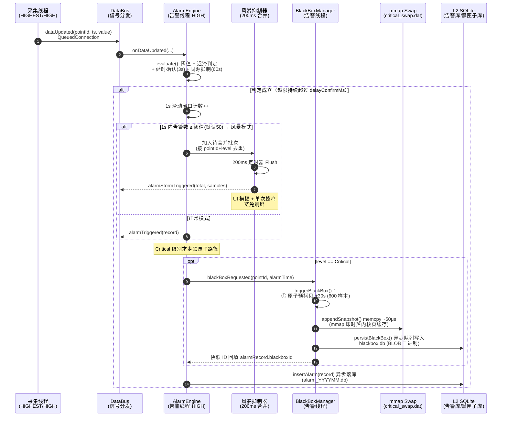
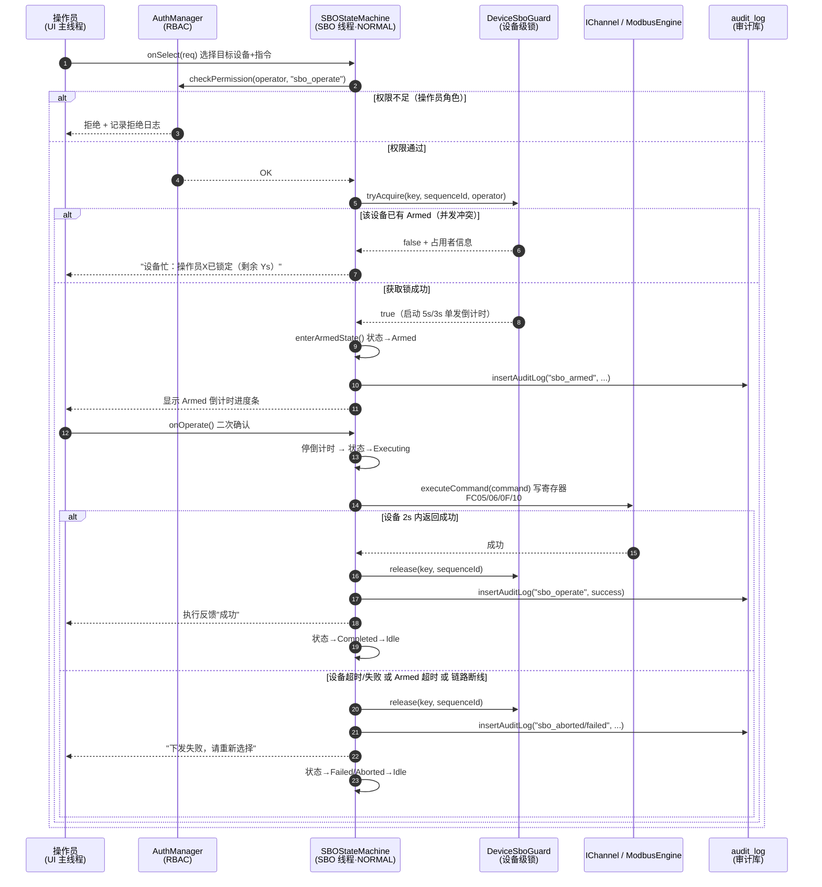
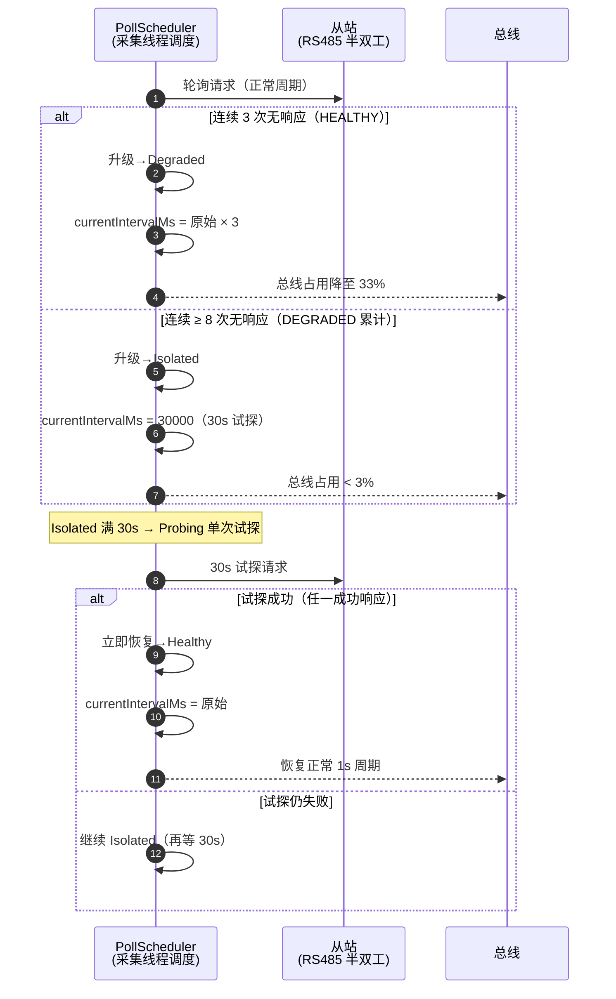

# EnerSentry 储能上位机系统 —— 业务逻辑设计说明

> **文档编号**：ENS-BLD-001  
> **版本**：V1.2  
> **日期**：2026-08-12  
> **状态**：正式发布  
> **编制依据**：《概要设计说明书 HLD V1.5》（ENS-HLD-001）、《软件需求规格说明书 SRS V1.1》（ENS-SRS-001）、《数据库设计说明书 DBDD》（ENS-DBD-001）、《线程模型与并发设计专题报告》（ENS-CONC-001）  
> **目标读者**：业务层 / 数据中枢层开发工程师、详细设计工程师、测试工程师  
> **约定**：本文档中所有 C++ 代码片段均可直接作为头文件参考；命名、对齐、分库分表规则严格继承 HLD V1.5。

---

## 文档修订记录

| 版本 | 日期 | 修订人 | 修订内容 |
|------|------|--------|---------|
| V1.0 | 2026-08-12 | 业务架构师 | 初始版本，覆盖业务实体、核心流程、状态机、数据建模、服务接口五大章节 |
| V1.1 | 2026-08-12 | 业务架构师 | §7 新增 Code Review 修复记录：① PointRuntime::alarmState 改为强类型指针（消除 void* 类型擦除）；② ArmedOccupant 移除 QTimer*（解决跨线程 QObject 生命周期问题）；③ m_pendingStorm 增加 MAX_PENDING_STORM=2000 硬上限 + droppedCount 原子计数器（防 OOM） |
| V1.2 | 2026-08-12 | 业务架构师 | §7 扩充：④ 时钟跳变防范——SBO/告警/降采样/从站内部计时统一改用 std::chrono::steady_clock 单调时钟，仅落库/显示转 Epoch；⑤ SQLite TransactionGuard RAII 守卫——BEGIN IMMEDIATE + 析构自动 ROLLBACK，防 Exclusive Lock 长期阻塞；⑥ L1 RingBuffer 覆写检测——并行序列号数组 + ConsumerCursor 连续性校验 + RingBufferDiagnostics 诊断面板 |

---

## 目录

1. [业务领域实体设计 (Domain Entities)](#1-业务领域实体设计-domain-entities)
2. [核心业务流程与逻辑时序 (Business Workflows)](#2-核心业务流程与逻辑时序-business-workflows)
3. [业务状态机设计 (Business State Machines)](#3-业务状态机设计-business-state-machines)
4. [业务数据建模与持久化设计 (Data Schemas)](#4-业务数据建模与持久化设计-data-schemas)
5. [业务服务接口定义 (C++ Header Interfaces)](#5-业务服务接口定义-c-header-interfaces)
6. [异常边界与防错机制汇总](#6-异常边界与防错机制汇总)
7. [潜在代码隐患与优化建议（Code Review 修复记录）](#7-潜在代码隐患与优化建议code-review-修复记录)

---

## 1. 业务领域实体设计 (Domain Entities)

业务实体自上而下分为三层：**配置态实体**（Station/Device/Point，源自点表与点表热加载）、**运行态实体**（Point 运行时快照、告警、SBO 会话、通信/从站健康），以及**统计态实体**（ChannelStats / SlaveHealthState）。

### 1.1 设备拓扑实体 —— Station / Device / Point

储能系统层级为 `Station（站）→ Device（簇/包/PCS/电表/辅机）→ Point（测点）`。配置态实体镜像 `meta.db.point_table`，运行态快照则位于 L1 Ring Buffer。

```cpp
// business/entities/TopologyEntities.h
#pragma once
#include <cstdint>
#include <QString>
#include <vector>

namespace ens::business {

/// 通信链路配置（对应 ICD ChannelConfig）
struct LinkConfig {
    uint32_t        linkId      = 0;     // 链路 ID（全局唯一）
    QString         linkName;           // 链路名称，如 "RS485-Bus-A"
    enum class Type { Serial, Tcp, Can } type = Type::Serial;
    // ── 串口参数 ──
    QString         port;               // COM3 / /dev/ttyS0
    int             baudRate    = 115200;
    int             dataBits    = 8;
    int             stopBits    = 1;
    int             parity      = 0;     // 0=None 1=Odd 2=Even
    // ── TCP 参数 ──
    QString         host;               // 192.168.1.10
    int             port_tcp    = 502;
    bool            enabled     = true;
};

/// 站点（顶层容器，单站部署通常仅 1 个）
struct Station {
    uint32_t              stationId   = 1;
    QString               stationName = "EnerSentry-01";
    std::vector<LinkConfig>      links;                 // 下属通信链路
    std::vector<Device>          devices;               // 下属设备
};

/// 设备（簇/包/PCS/电表/辅机）。Device 是多测点的归属容器。
struct Device {
    uint32_t        deviceId     = 0;     // 设备 ID
    QString         deviceName;          // "Rack-01"
    QString         deviceType;          // "BMS_RACK" / "PCS" / "METER" / "AUX"
    uint32_t        linkId       = 0;     // 归属链路
    uint8_t         slaveAddress = 1;     // Modbus 从站号
    std::vector<uint32_t> pointIds;       // 该设备下所有测点 ID 列表
    SlaveHealthState health;              // 运行态：从站健康（见 1.5）
};

/// 测点配置（持久化于 meta.db.point_table）
struct Point {
    uint32_t        pointId       = 0;     // 全局唯一测点 ID
    QString         pointName;            // "Rack-01 最高温度"
    uint32_t        linkId        = 0;
    uint8_t         slaveAddress  = 1;
    enum RegisterType : int { Coil=0, DiscreteInput=1, HoldingRegister=2, InputRegister=3 }
                    registerType  = RegisterType::HoldingRegister;
    uint16_t        registerAddr  = 0;     // 寄存器地址
    enum DataType : int { Bool=0, Int16=1, Uint16=2, Int32=3, Float32=4, Float64=5 }
                    dataType      = DataType::Float32;
    enum ByteOrder : int { ABCD=0, BADC=1, CDAB=2, DCBA=3 }
                    byteOrder     = ByteOrder::ABCD;
    float           scaleFactor   = 1.0f;  // 工程值缩放
    float           offset        = 0.0f;  // 工程值偏移
    QString         unit;                  // "℃" / "%" / "V"
    uint32_t        pollIntervalMs = 1000; // 轮询周期（Rack 核心包=100ms）
    uint8_t         priority      = 1;     // 0=最高（高频），1=常规
    bool            enabled       = true;
    QString         configVersion = "1.0.0";
    int64_t         updatedAt     = 0;     // 热加载时间戳（Unix ms）
};

/// 测点运行时快照（不落库，悬于 L1 Ring Buffer 当前值）
struct PointRuntime {
    uint32_t          pointId    = 0;
    double            lastValue  = 0.0;          // 最近一次工程值
    int64_t           lastTsMs   = 0;            // 最近一次时间戳
    bool              online     = true;         // 链路是否在线
    // 关联告警状态指针（强类型，消除 void* 类型擦除风险）
    PointAlarmState*  alarmState = nullptr;      // 所有权归 AlarmEngine::m_states
};

} // namespace ens::business
```

> **设计要点**：`Point` 是配置态，重启不丢失；`PointRuntime` 是运行态，进程内有效。`Point.priority==0` 的测点（BMS 核心包）走 L1 大 Ring Buffer（36,000 slots），`priority>=1` 走小 Ring Buffer（3,600 slots），与 HLD §3.2.1 内存预算一致。

### 1.2 告警实体 —— AlarmRule / AlarmRecord（含运行态 PointAlarmState）

```cpp
// business/entities/AlarmEntities.h
#pragma once
#include <cstdint>
#include <QString>
#include <unordered_map>

namespace ens::business {

/// 告警级别（与 DB alarm_record.level 一致：0=Info 1=Warning 2=Critical）
enum class AlarmLevel : uint8_t { Info = 0, Warning = 1, Critical = 2 };

/// 告警生命周期状态（与 DB alarm_record.status 一致）
enum class AlarmStatus : uint8_t { Active = 0, Confirmed = 1, Recovered = 2 };

/// 告警规则（源自 alarm_rules.json，按 pointId 索引）
struct AlarmRule {
    uint32_t    pointId          = 0;
    float       upperLimit        = 0.0f;  // 上限阈值（0 表示不启用）
    float       lowerLimit        = 0.0f;  // 下限阈值（0 表示不启用）
    float       hysteresisBand    = 1.0f;  // 迟滞带（FR-AL-03）
    AlarmLevel  level             = AlarmLevel::Warning;
    int         delayConfirmMs    = 3000;  // 延时确认（FR-AL-05，默认 3s）
    int         suppressWindowMs  = 60000; // 同源抑制窗口（FR-AL-04，默认 60s）
};

/// 告警记录（落库实体，对应 alarm_record_YYYYMM，见 §4.3）
struct AlarmRecord {
    uint64_t    id           = 0;     // 全局唯一（雪花/自增）
    uint32_t    pointId      = 0;
    AlarmLevel  level        = AlarmLevel::Warning;
    AlarmStatus status       = AlarmStatus::Active;
    int64_t     triggerTime  = 0;     // 触发时间（Unix ms）
    int64_t     recoverTime  = 0;     // 恢复时间（0=未恢复）
    QString     confirmUser;          // 确认人（FR-AL-08）
    int64_t     confirmTime  = 0;
    float       alarmValue   = 0.0f;  // 触发时测点值（FR-AL-13）
    float       threshold    = 0.0f;  // 触发阈值
    QString     description;          // 告警源描述
    uint64_t    blackboxId   = 0;     // 关联黑匣子快照 ID（0=无）
};

/// 单测点运行态（内存态，不落库；同源抑制/延时确认/迟滞由它驱动，见 HLD §5.4）
struct PointAlarmState {
    bool        isAlarmed          = false; // 当前是否处于告警态
    int64_t     limitCrossTime     = 0;     // 首次越限时间（延时确认计时起点）
    int64_t     lastAlarmTime      = 0;     // 上次产生告警时间（同源抑制用）
    float       alarmedValue       = 0.0f;  // 告警时的值
    AlarmLevel  pendingLevel        = AlarmLevel::Info; // 进入延迟确认时的级别
};

} // namespace ens::business
```

### 1.3 SBO 控制实体 —— SboCommand / SboSession

```cpp
// business/entities/SboEntities.h
#pragma once
#include <cstdint>
#include <QString>

namespace ens::business {

/// SBO 控制指令类型（对应 FR-CTRL-01 / Modbus 写功能码 FC05/06/0F/10）
enum class SboCommandType : uint8_t {
    ToggleVentilation  = 0,  // 排风开关
    ToggleLiquidCooling= 1,  // 液冷开关
    AlarmReset         = 2,  // 告警复位
    EmergencyStop      = 3   // 紧急切断（急停，倒计时缩短至 3s）
};

/// 控制指令载荷（Select 阶段的下发意图）
struct SboCommand {
    SboCommandType type   = SboCommandType::AlarmReset;
    uint32_t       linkId = 0;       // 目标链路
    uint8_t        slaveId = 1;      // 目标从站
    uint16_t       registerAddr = 0; // 目标寄存器
    uint16_t       coilValue = 0xFF00; // 写单线圈 0xFF00=ON / 0x0000=OFF
    QString        description;        // 操作说明，如 "Rack-01 液冷开启"
    bool isEmergencyStop() const { return type == SboCommandType::EmergencyStop; }
};

/// SBO 会话（一次 Select→Armed→Operate 全流程的上下文）
struct SboSession {
    QString         sequenceId;        // 全局唯一序列 ID（UUID）
    QString         operatorName;      // 发起人（已通过 RBAC 校验）
    QString         operatorRole;      // 发起人角色（engineer/admin）
    SboCommand      command;           // 绑定指令
    SboDeviceKey    deviceKey;         // 设备级锁 key（linkId+slaveId+registerAddr）
    int64_t         createdMs    = 0;  // 会话创建时间
    int64_t         armedSinceMs = 0;  // 进入 Armed 时间
};

} // namespace ens::business
```

> `SboDeviceKey` 的设备级锁二维 key 定义见 §5.3 `DeviceSboGuard`。

### 1.4 通信统计实体 —— ChannelStats

```cpp
// business/entities/ChannelStats.h
#pragma once
#include <cstdint>
#include <QString>

namespace ens::business {

/// 链路级通信统计（供诊断模块展示，对应 HLD §3.1.4 / COMM-14/15）
struct ChannelStats {
    uint32_t    linkId           = 0;
    int64_t     requestTotal     = 0;  // 滑动窗口内请求总数
    int64_t     responseSuccess  = 0;  // 成功响应数
    int64_t     timeoutCount     = 0;  // 超时数
    int64_t     crcErrorCount    = 0;  // CRC 错误数
    double      avgRTTMs         = 0.0; // 平均往返时延（ms）
    double      qualityPercent() const { // 通信质量百分比
        return (requestTotal > 0)
            ? static_cast<double>(responseSuccess) / requestTotal * 100.0
            : 100.0;
    }
    enum QualityGrade { Excellent=0, Normal=1, Abnormal=2 } grade() const {
        if (qualityPercent() >= 95.0) return Excellent;
        if (qualityPercent() >= 80.0) return Normal;
        return Abnormal;
    }
};

} // namespace ens::business
```

### 1.5 从站健康实体 —— SlaveHealthState

```cpp
// business/entities/SlaveHealthState.h
#pragma once
#include <atomic>
#include <cstdint>

namespace ens::business {

/// 从站健康枚举（与 PollScheduler 一致，HLD §3.1.5 / §3.3 线程模型）
enum class SlaveHealth : uint8_t {
    Healthy   = 0,  // 正常轮询（原始周期）
    Degraded  = 1,  // 降级轮询（3× 周期）
    Isolated  = 2,  // 隔离（30s 试探一次）
    Probing   = 3   // 探测中（ISOLATED 满 30s 后单次试探）
};

/// 从站运行态（atomic 字段保证采集线程与调度线程无锁读写，HLD §3.1.5）
struct SlaveHealthState {
    std::atomic<int>     consecutiveFailures{0};   // 连续失败计数
    std::atomic<int>     consecutiveSuccesses{0};  // 连续成功计数
    std::atomic<SlaveHealth> health{SlaveHealth::Healthy};
    std::atomic<int>     originalIntervalMs{1000};  // 原始轮询周期
    std::atomic<int>     currentIntervalMs{1000};   // 动态轮询周期
    std::atomic<int64_t> lastProbeTimeMs{0};        // 上次试探时间
    std::atomic<int64_t> lastResponseTimeMs{0};     // 上次成功响应时间
};

} // namespace ens::business
```

---

## 2. 核心业务流程与逻辑时序 (Business Workflows)

本章采用 **Mermaid 时序图** 描述四大核心流程，并辅以文字说明数据流转、线程归属与异常边界。所有流程严格遵守 HLD V1.5 的线程模型（采集线程 HIGH/HIGHEST、告警线程 HIGH、SBO 线程 NORMAL、持久化线程 NORMAL）。

### 2.1 告警处理与风暴抑制流程

**流程**：测点数据到达 → 阈值迟滞判定 → 告警合并与风暴抑制 → Critical 级触发 mmap 黑匣子快照（±30s 数据锁定）。



**关键说明**：
- `evaluate()` 内部先执行**迟滞判定**：越上限后须回落至 `upperLimit - hysteresisBand` 以下才解除（FR-AL-03），防止临界抖动反复触发。
- **同源抑制**（FR-AL-04）：同一测点同一级别在 `suppressWindowMs`（默认 60s）内只产生一条，不重复弹窗。
- **风暴抑制**（HLD §5.4.1）：当 1s 内告警数 ≥ `triggerThreshold`（默认 50），切换合并模式，200ms 批量投递一条"风暴通知"，蜂鸣仅响一次，避免 UI 假死与 WAL 暴涨。
- **Critical 黑匣子**（`triggerBlackBox`）：先 `lock_guard` 原子预拷贝 600 个 100ms 样本（持锁 ~10μs），释放后立即 `appendSnapshot` 进 mmap（断电安全），再异步序列化落 `blackbox.db`。普通 Warning/Info **不**触发 mmap（HLD §3.2.2.1 策略对比）。

### 2.2 SBO 双重确认控制流程

**流程**：权限校验 → 申请设备级逻辑锁 (`DeviceSboGuard`) → Select 预置 → Armed 计时器 (5s) → Operate 执行 → 超时/异常自动释放锁。



**关键说明**：
- **设备级锁**（V1.5，`DeviceSboGuard`）：按 `(linkId, slaveId, registerAddr)` 二维 key 分桶互斥。不同设备、不同寄存器可**并发** Armed；同一设备同一寄存器仍保持"仅 1 个 Armed"的安全语义（10 个 PCS 柜可并行 5s SBO，ADR-23）。
- **Armed 倒计时**：常规 5s、急停 3s，**独立 QTimer 单发**，不受通信轮询影响（SRS 7.5.4）。超时/链路断线/角色被回收任一触发即 `Aborted` 并释放锁（FR-CTRL-07）。
- **链路抖动容错**（V1.4）：断→通→断 500ms 内视为抖动，不立即 Abort（HLD §3.4.3）。
- **全链路审计**：Select/Armed/Operate/Cancel/Abort/Failed 均写 `audit_log`（FR-CTRL-03、NFR-SEC-04）。

### 2.3 分级存储与降采样数据流

**流程**：100ms 原始帧入 L1 内存 RingBuffer → 1s/5s 滑动窗口聚合 → 按月路由批量写入 SQLite WAL 库。

```mermaid
sequenceDiagram
    autonumber
    participant ACQ as 采集线程
    participant L1 as L1 RingBuffer<br/>(无锁·atomic)
    participant DS as DownSampler<br/>(降采样线程·LOW)
    participant WB as WriteBuffer<br/>(std::vector)
    participant DA as SQLiteDataAccess<br/>(持久化线程·NORMAL)
    participant DB as data_YYYYMM.db<br/>(WAL 模式)

    ACQ->>L1: push(sample) / pushBatch()<br/>release 屏障 + m_publishedPos
    Note over L1: 多消费者(acquire 读)：<br/>UI / 降采样 / 黑匣子 各持游标
    L1->>DS: readRecent(consumerId, ...)
    DS->>DS: 1s 窗口聚合 Max/Min/Avg/Count<br/>二次聚合出 5s/1m
    DS->>WB: enqueueSample(DownSampledSample)
    WB->>WB: push_back() O(1) 锁内 swap
    Note over WB: 100ms 定时器 或 满 1000 条 双触发
    WB->>DA: flushBuffer() (QueuedConnection)
    DA->>DA: 按月份分桶 buckets[dbPath]
    loop 每个月份 DB
        DA->>DB: BEGIN; 批量 INSERT history_1s_YYYYMM; COMMIT
        Note over DA: getTableName() / getDatabasePath()<br/>月度路由
    end
```

**关键说明**：
- **L1 写**：`push()` 仅做一次 `fetch_add`（relaxed）+ release 屏障 + 发布 `m_publishedPos`，消费者以 acquire 读，杜绝撕裂读（HLD §3.2.1.1 / ADR-08）。
- **降采样**：1s 窗口收集 10 个 100ms 原始点 → Max/Min/Avg/Count；5s/1m 基于 1s 聚合结果二次聚合（HLD §3.2.4）。
- **批量写入**：100ms 定时器 + 缓冲区满（1000 条）双触发；`batch.swap()` O(1) 最小化锁持有；每批一次事务 COMMIT（HLD §3.2.3 / §4.3）。
- **月度路由**：`getTableName(pointId, ts, gran)` 拼 `history_1s_YYYYMM`，`getDatabasePath(ts)` 拼 `data_YYYYMM.db`（ADR-09）。

### 2.4 RS485 从站熔断与自动恢复机制

**流程**：Healthy → Degraded（连续 3 次失败）→ Isolated（连续 8 次失败，30s 试探）→ Probing → 自动恢复。



**关键说明**：
- 任一成功响应即立即恢复 `Healthy`（`consecutiveFailures` 清零），无需等待周期（HLD §3.1.5）。
- 熔断后总线有效带宽从 16% 恢复至 75%，避免故障从站拖垮整条 RS485 总线（ADR-13）。

---

## 3. 业务状态机设计 (Business State Machines)

每一状态机均列出**状态枚举 (State)**、**触发事件 (Event)**、**转换条件 (Condition)** 与**动作 (Action)**，并标注异常边界。

### 3.1 SBO 状态机（Idle → Armed → Operating → Success/Failed/Timeout）

状态枚举（与 HLD §5.5 `SBOState` 一致）：`Idle, Selecting, Armed, Executing, Completed, Failed, Cancelled, Aborted`。

| 当前状态 | 触发事件 (Event) | 转换条件 (Condition) | 目标状态 | 动作 (Action) |
|---------|-----------------|---------------------|---------|--------------|
| Idle | `SelectRequested` | RBAC 校验通过 | Selecting | 加载指令；`m_sequenceId = UUID()` |
| Selecting | `PermissionDenied` | 角色 < engineer | Idle | 写审计"拒绝"；UI 提示无权限 |
| Selecting | `PermissionGranted` | 设备级锁 `tryAcquire` 成功 | Armed | 启动 5s/3s 单发倒计时；注册链路/角色监听；审计"armed" |
| Selecting | `LockBusy` | 该设备已有 Armed | Rejected→Idle | 提示"设备忙：操作员X（剩余Ys）"；审计"rejected" |
| Armed | `OperateConfirmed` | 状态==Armed（守卫） | Executing | 停倒计时；下发写寄存器；审计"operate" |
| Armed | `UserCancelled` | 用户主动取消 | Cancelled→Idle | 释放设备锁；审计"cancel" |
| Armed | `ArmedTimeout` | 倒计时归零（独立 QTimer） | Aborted→Idle | 释放锁；审计"timeout"；UI"请重新选择" |
| Armed | `LinkDisconnected` | 链路断线且持续 >500ms（抖动过滤） | Aborted→Idle | 释放锁；审计"link disconnected" |
| Armed | `RoleDowngraded` | 发起人角色被回收 | Aborted→Idle | 释放锁；审计"role downgraded" |
| Executing | `DeviceSuccess` | 设备 2s 内返回成功 | Completed→Idle | 释放锁；审计"success"；UI 反馈成功 |
| Executing | `DeviceFailed` / `ExecTimeout` | 返回失败或 2s 无响应 | Failed→Idle | 释放锁；审计"failed"；UI"设备未响应" |

**异常边界**：
- **并发冲突**：`DeviceSboGuard::tryAcquire` 失败即进入 Rejected（保持"同一设备仅 1 个 Armed"）。
- **防重入**：`onArmedTimeout` 入口 `if (m_state != State::Armed) return;` 状态守卫，过滤残留 `timeout()` 信号（HLD §3.4.3）。
- **倒计时独立**：Armed 倒计时用 `Qt::DirectConnection` 直连，不跨线程排队；每次进入 Armed 先 `disconnect()` 旧连接（HLD §3.4.3 机制 2）。

### 3.2 告警生命周期状态机（Inactive → ActiveUnconfirmed → ActiveConfirmed → Recovered）

> 注：HLD 内部用 `PointAlarmState` 表示运行态；落库 `alarm_record.status` 用 `Active(0)/Confirmed(1)/Recovered(2)`。两者一一对应 `Inactive ↔ !isAlarmed`。

| 当前状态 | 触发事件 (Event) | 转换条件 (Condition) | 目标状态 | 动作 (Action) |
|---------|-----------------|---------------------|---------|--------------|
| Inactive | `LimitCrossed` | 越限且持续 ≥ `delayConfirmMs`（3s） | ActiveUnconfirmed | 产生 `AlarmRecord`（status=Active）；风暴合并/单条投递；Critical→黑匣子 |
| Inactive | `LimitCrossed` | 越限但 < `delayConfirmMs` | Inactive | `limitCrossTime` 计时，不触发（延时确认 FR-AL-05） |
| ActiveUnconfirmed | `OperatorAck` | 操作员手动确认（FR-AL-08） | ActiveConfirmed | 写 `confirmUser`/`confirmTime`；status=Confirmed；审计 |
| ActiveUnconfirmed/Confirmed | `ValueRecovered` | 回落至 `上限-迟滞带`（FR-AL-03） | Recovered | 写 `recoverTime`；status=Recovered；解除黑匣子锁定 |
| ActiveConfirmed | `LimitReCrossed` | 恢复后再次越限 | ActiveUnconfirmed | 新建告警记录（避免复用旧记录） |

**异常边界**：
- **同源抑制**：`ActiveUnconfirmed` 期间同 pointId+level 新越限被抑制（60s 窗口），不重复弹窗（FR-AL-04）。
- **迟滞防抖**：`ValueRecovered` 必须穿越迟滞带，防止临界值反复切换状态。

### 3.3 从站健康状态机（Healthy → Degraded → Isolated → Probing）

| 当前状态 | 触发事件 (Event) | 转换条件 (Condition) | 目标状态 | 动作 (Action) |
|---------|-----------------|---------------------|---------|--------------|
| Healthy | `ConsecutiveFail≥3` | 连续 3 次无响应（HLD §3.1.5） | Degraded | `currentIntervalMs = 原始×3`；emit `slaveDegraded` |
| Degraded | `ConsecutiveFail≥8` | 累计 8 次无响应 | Isolated | `currentIntervalMs = 30000`；emit `slaveIsolated` |
| Degraded/Isolated | `ResponseSuccess` | 任一成功响应 | Healthy | `consecutiveFailures=0`；周期复原；emit `slaveRecovered` |
| Isolated | `ProbeTimeout(30s)` | `now - lastProbeTime ≥ 30s` | Probing | 单次试探请求；`lastProbeTime=now` |
| Probing | `ProbeSuccess` | 试探响应成功 | Healthy | 恢复正常轮询 |
| Probing | `ProbeFailed` | 试探仍失败 | Isolated | 继续 30s 周期 |

**异常边界**：
- **误杀防护**：仅按从站独立熔断，不影响同总线其他从站（故障隔离 NFR-REL-05）。
- **快速恢复**：任意成功响应立即回到 Healthy，无需等待周期（HLD §3.1.5 `onResponseReceived`）。

---

## 4. 业务数据建模与持久化设计 (Data Schemas)

### 4.1 内存快照数据结构 —— `Sample` 16 字节对齐 + `std::atomic` 读写安全

```cpp
// datahub/Sample.h —— 显式 16 字节对齐（HLD §3.2.1.1 / ADR-08）
#pragma once
#include <cstdint>
#include <atomic>

// 跨平台对齐宏（兼容 MSVC __declspec / GCC __attribute__）
#if defined(_MSC_VER)
    #define ENS_CACHE_ALIGN __declspec(align(16))
#elif defined(__GNUC__) || defined(__clang__)
    #define ENS_CACHE_ALIGN __attribute__((aligned(16)))
#else
    #define ENS_CACHE_ALIGN alignas(16)
#endif

struct ENS_CACHE_ALIGN Sample {
    uint64_t timestamp;   // Unix 毫秒时间戳（8B，地址 8 的倍数）
    uint32_t pointId;     // 测点 ID（4B）
    float    value;       // 采样值（4B）
    // ─────────── 合计恰好 16 字节 ───────────
};
static_assert(sizeof(Sample) == 16,
    "Sample must be 16 bytes for lock-free atomic access");

// 【V1.4 编译期 lock-free 守卫】防止 32 位 x86 / ARMv7 退化为内部互斥锁
static_assert(std::atomic<Sample>::is_always_lock_free,
    "Sample (16B aligned) is NOT lock-free on this platform! "
    "Fallback: shrink timestamp to uint32_t.");

// 降采样聚合结果（落库实体，对应 history_1s_YYYYMM）
struct DownSampledSample {
    uint32_t pointId;
    uint64_t timestamp;     // 窗口起始时间（Unix ms）
    float    maxValue;      // → v_max
    float    minValue;      // → v_min
    float    avgValue;      // → v_avg
    uint16_t sampleCount;   // → sample_count
};
```

**读写安全设计**（HLD §3.2.1.1 / 线程模型 §2）：
- 生产者：`m_writePos.fetch_add(relaxed)` → 写数据 → `fence(release)` → `m_publishedPos.store(release)`。
- 消费者：以 `m_publishedPos.load(acquire)` 为安全上限，`m_consumerCursors[id]` 各自维护游标，互不竞争。
- 黑匣子提取走 `extractRange()` 在 `lock_guard` 内一次性原子预拷贝（持锁 ~10μs），释放后异步慢速处理。

### 4.2 1s / 5s 降采样历史表

> 采用 `WITHOUT ROWID` + `PRIMARY KEY(point_id, ts)`（DBDD §4.2 V1.4 修订：节省 30%~50% 存储、提升 20% 批量写入）。列名按 DBDD 规范为 `v_max/v_min/v_avg/sample_count`，消除 HLD 参考查询中的冗余 `value` 列。

```sql
-- data_YYYYMM.db（按月库，写入前由 DownSampler 计算聚合值）
CREATE TABLE IF NOT EXISTS history_1s_202608 (
    point_id     INTEGER NOT NULL,
    ts           INTEGER NOT NULL,            -- 窗口起始 Unix 毫秒
    v_max        REAL    NOT NULL,
    v_min        REAL    NOT NULL,
    v_avg        REAL    NOT NULL,
    sample_count INTEGER NOT NULL,
    PRIMARY KEY (point_id, ts)
) WITHOUT ROWID;

CREATE TABLE IF NOT EXISTS history_5s_202608 (
    point_id, ts, v_max, v_min, v_avg, sample_count,
    PRIMARY KEY (point_id, ts)
) WITHOUT ROWID;

CREATE TABLE IF NOT EXISTS history_1m_202608 (
    point_id, ts, v_max, v_min, v_avg, sample_count,
    PRIMARY KEY (point_id, ts)
) WITHOUT ROWID;
```

> 建表由 `SQLiteDataAccess::ensureSchema(dbPath, gran)` 在首次打开月库时执行（`CREATE TABLE IF NOT EXISTS`）。UPSERT（覆写）语法见 DBDD §4.2。

### 4.3 黑匣子表（`blackbox_snapshot`）与告警记录表（`alarm_record_YYYYMM`）

```sql
-- blackbox.db（不按月，永久保留；BLOB 二进制存储原始 Sample 数组，零拷贝回放，DBDD §4.3）
CREATE TABLE IF NOT EXISTS blackbox_snapshot (
    id           INTEGER PRIMARY KEY,          -- 同 alarm_id（1:1）
    alarm_id     INTEGER NOT NULL UNIQUE,       -- 关联 alarm_record.id
    point_id     INTEGER NOT NULL,
    window_start INTEGER NOT NULL,             -- alarmTime - 30s
    window_end   INTEGER NOT NULL,             -- alarmTime + 30s
    level        INTEGER NOT NULL,             -- 此处恒为 Critical=2
    sample_count INTEGER NOT NULL,             -- 高频样本数（≈600 @100ms）
    data_blob    BLOB    NOT NULL,             -- 原始 Sample 数组（16B × sample_count）
    encoding     INTEGER NOT NULL DEFAULT 0,   -- 0=raw Sample array
    data_json    TEXT,                         -- 可选：管理员导出用 JSON
    created_at   INTEGER NOT NULL
);
CREATE INDEX IF NOT EXISTS idx_bb_alarm  ON blackbox_snapshot (alarm_id);
CREATE INDEX IF NOT EXISTS idx_bb_point  ON blackbox_snapshot (point_id);

-- alarm_YYYYMM.db（告警库与历史库静态隔离，DBDD §4.4 V1.5）
CREATE TABLE IF NOT EXISTS alarm_record_202608 (
    id           INTEGER PRIMARY KEY,
    point_id     INTEGER NOT NULL,
    level        INTEGER NOT NULL,             -- 0=Info 1=Warning 2=Critical
    status       INTEGER NOT NULL DEFAULT 0,   -- 0=Active 1=Confirmed 2=Recovered
    trigger_time INTEGER NOT NULL,
    recover_time INTEGER NOT NULL DEFAULT 0,
    confirm_user TEXT,
    confirm_time INTEGER NOT NULL DEFAULT 0,
    alarm_value  REAL    NOT NULL,
    threshold    REAL    NOT NULL,
    description  TEXT,
    blackbox_id  INTEGER NOT NULL DEFAULT 0,   -- 关联黑匣子 ID（0=无）
    CONSTRAINT chk_level  CHECK (level  BETWEEN 0 AND 2),
    CONSTRAINT chk_status CHECK (status BETWEEN 0 AND 2)
);
CREATE INDEX IF NOT EXISTS idx_alarm_point_tr ON alarm_record_202608 (point_id, trigger_time);
CREATE INDEX IF NOT EXISTS idx_alarm_lv_st   ON alarm_record_202608 (level, status);
```

**黑匣子 BLOB 零拷贝回放（DBDD §4.3）**：

```cpp
std::vector<Sample> BlackBoxManager::loadBlackBox(uint64_t alarmId) {
    QByteArray blob = m_dal->queryBlackBoxBlob(alarmId);           // 读 BLOB
    const Sample* samples = reinterpret_cast<const Sample*>(blob.constData());
    size_t n = blob.size() / sizeof(Sample);                      // 16B/帧
    return std::vector<Sample>(samples, samples + n);             // 零拷贝
}
```

### 4.4 审计日志表（`audit_log_YYYYMM`）

```sql
-- audit_YYYYMM.db（FR-AUTH-04；无 UPDATE/DELETE 业务入口，防篡改，DBDD §4.5）
CREATE TABLE IF NOT EXISTS audit_log_202608 (
    id         INTEGER PRIMARY KEY AUTOINCREMENT,
    user       TEXT    NOT NULL,              -- 操作人账号
    role       TEXT    NOT NULL,              -- operator / engineer / admin
    action     TEXT    NOT NULL,              -- "sbo_operate"/"alarm_confirm"/"config_update"
    target     TEXT,                          -- 设备ID/测点ID/用户名
    detail     TEXT,                          -- 操作明细（JSON 建议）
    result     TEXT    NOT NULL,              -- "success"/"failed" 或错误码
    timestamp  INTEGER NOT NULL,              -- 操作时间（Unix ms）
    session_id TEXT                           -- 会话 ID（可选）
);
CREATE INDEX IF NOT EXISTS idx_audit_ts   ON audit_log_202608 (timestamp);
CREATE INDEX IF NOT EXISTS idx_audit_user ON audit_log_202608 (user);
```

### 4.5 落盘熔断式极值保护（写入侧防线，HLD §3.2.5.1 / ADR-17）

在 `L2HistoryStore::shouldAcceptWrite()` 入口按磁盘剩余空间分级熔断，防止 `SQLITE_FULL` 导致 DB 损坏：

| 剩余空间 | 状态 | 行为 |
|---------|------|------|
| ≥ 5 GB | NORMAL | 正常降采样 + 告警 + 审计写入 |
| < 5 GB | WARNING | 弹窗预警（FR-DLM-08） |
| < 1 GB | DEGRADED | 停 1s/5s/1m 降采样；**仅保留 Critical 告警 + 审计日志落盘** |
| < 200 MB | EMERGENCY | 强制归档删除 N 个月前 `data_YYYYMM.db`；SMS/邮件通知 |

> 由独立 `DiskMonitor` 线程每 5s 采样 `statvfs`，状态变化发信号给 UI + 写审计，空间回升自动恢复（无需重启）。

---

## 5. 业务服务接口定义 (C++ Header Interfaces)

本章给出核心业务类的**接口（纯虚基类）+ 实现类头文件**，含信号槽与关键成员。命名严格继承 HLD V1.5：`IAlarmEngine` / `AlarmEngine`、`ISBOManager` / `DeviceSboGuard` / `SboStateMachine`、`IDataAccess`（含 `getTableName` / `getDatabasePath` 月度路由）。

### 5.1 `IAlarmEngine` / `AlarmEngine`

```cpp
// business/IAlarmEngine.h
#pragma once
#include <QObject>
#include <QString>
#include <vector>
#include "entities/AlarmEntities.h"

namespace ens::business {

class IAlarmEngine : public QObject {
    Q_OBJECT
public:
    virtual ~IAlarmEngine() = default;

    virtual void loadRules(const std::vector<AlarmRule>& rules) = 0;
    virtual void reloadRules(const std::vector<AlarmRule>& rules) = 0;   // 热加载 FR-CFG-06
    virtual void suppressPoint(uint32_t pointId, uint64_t expireTime) = 0; // 告警屏蔽 FR-CFG-10
    virtual void unsuppressPoint(uint32_t pointId) = 0;
    virtual void setStormConfig(const AlarmStormConfig& cfg) = 0;
    virtual bool isInStormMode() const = 0;

public slots:
    virtual void onDataUpdated(uint32_t pointId, uint64_t timestamp, float value) = 0;
    virtual void acknowledgeAlarm(uint64_t alarmId, const QString& user) = 0;       // FR-AL-08
    virtual void acknowledgeAlarms(const std::vector<uint64_t>& ids, const QString& user) = 0; // FR-AL-10

signals:
    void alarmTriggered(const AlarmRecord& alarm);
    void alarmRecovered(uint64_t alarmId);
    void alarmAcknowledged(uint64_t alarmId);
    void blackBoxRequested(uint32_t pointId, uint64_t alarmTime);   // Critical 触发
    void alarmStormTriggered(int totalCount, const QVector<AlarmRecord>& samples); // 风暴合并
    void alarmStormCleared(int suppressedCount);
};

} // namespace ens::business
```

```cpp
// business/AlarmEngine.h —— 实现类（继承 IAlarmEngine，摘要自 HLD §5.4）
#pragma once
#include "IAlarmEngine.h"
#include <unordered_map>
#include <deque>
#include <QTimer>

namespace ens::business {

class AlarmEngine : public IAlarmEngine {
    Q_OBJECT
public:
    explicit AlarmEngine(QObject* parent = nullptr);
    void loadRules(const std::vector<AlarmRule>& rules) override;
    void reloadRules(const std::vector<AlarmRule>& rules) override;
    void suppressPoint(uint32_t pointId, uint64_t expireTime) override;
    void unsuppressPoint(uint32_t pointId) override;
    void setStormConfig(const AlarmStormConfig& cfg) override;
    bool isInStormMode() const override { return m_stormActive; }

public slots:
    void onDataUpdated(uint32_t pointId, uint64_t timestamp, float value) override;
    void acknowledgeAlarm(uint64_t alarmId, const QString& user) override;
    void acknowledgeAlarms(const std::vector<uint64_t>& ids, const QString& user) override;

signals:
    void alarmTriggered(const AlarmRecord& alarm) override;
    void blackBoxRequested(uint32_t pointId, uint64_t alarmTime) override;

private:
    void evaluate(uint32_t pointId, uint64_t timestamp, float value);
    bool checkHysteresis(const AlarmRule& rule, float value, const PointAlarmState& st);
    bool checkSuppression(const AlarmRule& rule, const PointAlarmState& st, uint64_t ts);
    bool checkDelayConfirm(const AlarmRule& rule, const PointAlarmState& st, uint64_t ts);

    std::unordered_map<uint32_t, AlarmRule>      m_rules;
    std::unordered_map<uint32_t, PointAlarmState> m_states;
    std::unordered_set<uint32_t>                 m_suppressedPoints;
    std::unordered_map<uint32_t, uint64_t>       m_suppressExpirations;

    // 风暴抑制（HLD §5.4.1）
    static constexpr int MAX_PENDING_STORM = 2000;   // 待合并队列硬上限
    AlarmStormConfig      m_stormConfig;
    std::deque<uint64_t>  m_alarmTimeRing;                  // 1s 滑动窗口
    std::unordered_map<uint64_t, AlarmRecord> m_pendingStorm; // 待合并批次
    std::atomic<int>      m_stormDroppedCount{0};            // 溢出丢弃计数
    QTimer*               m_stormFlushTimer = nullptr;      // 200ms Flush
    bool                  m_stormActive = false;

    bool isStormTriggered();
    void flushStormBatch(const QString& reason);
};

} // namespace ens::business
```

### 5.2 `ISBOManager` / `DeviceSboGuard` / `SboStateMachine`

```cpp
// business/ISBOManager.h
#pragma once
#include <QObject>
#include <QString>
#include "entities/SboEntities.h"

namespace ens::business {

class ISBOManager : public QObject {
    Q_OBJECT
public:
    virtual ~ISBOManager() = default;

    /// 提交 Select（权限校验在此前由 AuthManager 完成）
    virtual bool submitSelect(const SboSelectRequest& req, const QString& operatorName) = 0;
    virtual bool submitOperate(const QString& sequenceId) = 0;
    virtual bool submitCancel(const QString& sequenceId) = 0;

    /// 设备级锁查询（UI 显示"设备忙"）
    virtual bool isDeviceArmed(const SboDeviceKey& key) const = 0;

signals:
    void armedAcquired(const QString& sequenceId, const SboDeviceKey& key);
    void armedRejected(const QString& sequenceId, const SboDeviceKey& key,
                       const QString& busyBy, qint64 elapsedMs);
    void armedCleared(const QString& reason);            // 超时/断线/取消
    void executingSucceeded(const QString& sequenceId, const QString& device);
    void executingFailed(const QString& sequenceId, const QString& device, const QString& reason);
};

} // namespace ens::business
```

```cpp
// business/SboControlGuard.h —— 设备级逻辑锁（HLD §3.4.4 / ADR-23）
#pragma once
#include <QObject>
#include <QHash>
#include <QMutex>
#include <QTimer>
#include <optional>

namespace ens::business {

/// 设备级锁 key（二维：(链路+从站) + 寄存器地址）
struct SboDeviceKey {
    uint32_t linkId;        // 通信链路 ID
    uint32_t slaveId;       // Modbus 从站号
    uint32_t registerAddr;  // 操作寄存器地址

    bool operator==(const SboDeviceKey& o) const {
        return linkId == o.linkId && slaveId == o.slaveId && registerAddr == o.registerAddr;
    }
    uint32_t hash() const {                 // FNV-1a
        uint32_t h = 2166136261u;
        h = (h ^ linkId)       * 16777619u;
        h = (h ^ slaveId)      * 16777619u;
        h = (h ^ registerAddr) * 16777619u;
        return h;
    }
};
inline uint qHash(const SboDeviceKey& k, uint /*seed*/ = 0) {
    return static_cast<uint>(k.hash());
}

/// 当前设备的 Armed 占用信息（纯数据，不含 QObject 指针）
/// 设计约束：QTimer 的生命周期与线程归属完全由 SboStateMachine 管理，
///           DeviceSboGuard 仅保存 armedSinceMs 时间戳与超时阈值供查询。
/// 原因：若 Guard 与 StateMachine 分属不同线程，Guard 内持 QTimer* 会导致
///       QObject::startTimer 跨线程告警（"Timers cannot be stopped from another thread"）。
struct ArmedOccupant {
    QString sequenceId;
    QString operatorName;
    qint64  armedSinceMs = 0;            // 进入 Armed 的时间戳（Unix ms）
    qint64  timeoutMs    = 5000;         // 超时阈值（常规 5000ms / 急停 3000ms）
};

/// 设备级 SBO 逻辑锁守卫（分桶互斥）
class DeviceSboGuard : public QObject {
    Q_OBJECT
public:
    /// 尝试获取设备级锁；false=该设备已有 Armed
    bool tryAcquire(const SboDeviceKey& key, const QString& sequenceId,
                    const QString& operatorName, ArmedOccupant* out = nullptr);

    /// 释放锁（Operate/Cancel/Aborted 任一终止时调用，sequenceId 防误释放）
    void release(const SboDeviceKey& key, const QString& sequenceId);

    std::optional<ArmedOccupant> query(const SboDeviceKey& key) const;
    QList<SboDeviceKey> listActiveArmed() const;

signals:
    void armedAcquired(const QString& sequenceId, const SboDeviceKey& key);
    void armedRejected(const QString& sequenceId, const SboDeviceKey& key,
                       const QString& busyBy, qint64 elapsedMs);
    void armedReleased(const QString& sequenceId, const SboDeviceKey& key);

private slots:
    void onArmedTimeout(const SboDeviceKey& key, const QString& sequenceId);

private:
    QHash<SboDeviceKey, ArmedOccupant> m_buckets;  // 设备 → Armed 占用
    mutable QMutex m_mutex;                          // 保护 m_buckets
};

} // namespace ens::business
```

```cpp
// business/SboStateMachine.h —— SBO 控制状态机（HLD §5.5，V1.5 注入 DeviceSboGuard）
#pragma once
#include <QObject>
#include <QTimer>
#include "ISBOManager.h"
#include "SboControlGuard.h"

namespace ens::business {

class SboStateMachine : public ISBOManager {
    Q_OBJECT
public:
    explicit SboStateMachine(QObject* parent = nullptr);

    void setGuard(DeviceSboGuard* guard) { m_guard = guard; }  // IoC 注入
    SBOState currentState() const { return m_state; }

    bool submitSelect(const SboSelectRequest& req, const QString& operatorName) override;
    bool submitOperate(const QString& sequenceId) override;
    bool submitCancel(const QString& sequenceId) override;
    bool isDeviceArmed(const SboDeviceKey& key) const override;

signals:
    void armedCleared(const QString& reason) override;
    void executingFailed(const QString& sequenceId, const QString& device,
                         const QString& reason) override;

private slots:
    void onArmedTimeout();                  // 5s/3s 倒计时归零
    void onLinkStatusChanged(bool connected); // 断线自动清除（500ms 抖动过滤）
    void onUserRoleChanged(const QString& user, const QString& newRole); // 权限回收
    void onExecutingTimeout();              // 设备 2s 无响应

private:
    void enterArmedState();
    void transitionTo(SBOState next);

    SBOState            m_state = SBOState::Idle;
    QString             m_sequenceId;
    QString             m_operator;
    SboCommand          m_pendingCommand;
    std::optional<SboDeviceKey> m_heldKey;  // 当前持有的设备锁 key
    DeviceSboGuard*     m_guard = nullptr;  // 注入的设备级锁
    QTimer*             m_armedTimer    = nullptr; // 独立倒计时
    QTimer*             m_flappingTimer = nullptr; // 链路抖动 500ms 窗口
    QTimer*             m_execTimer     = nullptr; // Executing 2s 超时
};

} // namespace ens::business
```

### 5.3 `IDataAccess`（含 `getTableName` 与 `getDatabasePath` 月度路由函数）

```cpp
// datahub/IDataAccess.h
#pragma once
#include <QObject>
#include <QString>
#include <vector>
#include "Sample.h"   // DownSampledSample

namespace ens::datahub {

/// 降采样粒度（决定表名后缀）
enum class HistoryGranularity : uint8_t {
    Gran100ms = 0, Gran1s = 1, Gran5s = 2, Gran1m = 3
};

class IDataAccess {
public:
    virtual ~IDataAccess() = default;

    // ==== 连接与路由（HLD §3.2.4.1 / ADR-09）====
    virtual bool open(const QString& connectionString) = 0;
    virtual void close() = 0;

    /// 表名路由：timestamp → "history_1s_YYYYMM" 等（按自然月）
    virtual QString getTableName(uint32_t pointId, uint64_t timestamp,
                                 HistoryGranularity gran = HistoryGranularity::Gran1s) const = 0;

    /// 单月独立 DB 文件路径：timestamp → "data/YYYYMM/data_YYYYMM.db"
    virtual QString getDatabasePath(uint64_t timestamp) const = 0;

    // ==== 历史数据批量写入 / 查询 ====
    virtual bool batchInsertHistory(const std::vector<DownSampledSample>& samples) = 0;
    virtual std::vector<DownSampledSample> queryHistory(
        uint32_t pointId, uint64_t startTime, uint64_t endTime) = 0;
    virtual std::vector<DownSampledSample> queryHistoryRange(
        uint32_t pointId, uint64_t startTime, uint64_t endTime) = 0;

    // ==== 黑匣子与告警记录 ====
    virtual bool insertBlackBox(uint64_t alarmId, uint32_t pointId,
                                uint64_t start, uint64_t end,
                                const QByteArray& dataBlob,
                                const QString& dataJson = {}) = 0;
    virtual QByteArray queryBlackBoxBlob(uint64_t alarmId) = 0;
    virtual bool insertAlarm(const AlarmRecord& alarm) = 0;
    virtual bool updateAlarmStatus(uint64_t alarmId, AlarmStatus status,
                                   const QString& user, uint64_t confirmTime) = 0;
    virtual std::vector<AlarmRecord> queryAlarms(
        uint64_t startTime, uint64_t endTime,
        AlarmLevel level = AlarmLevel::Info, int maxCount = 10000) = 0;

    // ==== 审计日志 ====
    virtual bool insertAuditLog(const QString& user, const QString& role,
                                const QString& action, const QString& target,
                                const QString& detail, const QString& result) = 0;

    // ==== 数据清理 / 容量 ====
    virtual int  deleteBefore(uint64_t timestamp, const QString& tableName) = 0;
    virtual uint64_t getTableSize(const QString& tableName) = 0;
};

} // namespace ens::datahub
```

**月度路由实现（`SQLiteDataAccess`，HLD §3.2.4.1）**：

```cpp
QString SQLiteDataAccess::getTableName(uint32_t pointId, uint64_t timestamp,
                                       HistoryGranularity gran) const {
    Q_UNUSED(pointId);  // 预留未来按测点分片
    QDateTime dt = QDateTime::fromMSecsSinceEpoch(timestamp);
    QString suffix = dt.toString("yyyyMM");
    switch (gran) {
        case HistoryGranularity::Gran1s:  return QString("history_1s_%1").arg(suffix);
        case HistoryGranularity::Gran5s:  return QString("history_5s_%1").arg(suffix);
        case HistoryGranularity::Gran1m:  return QString("history_1m_%1").arg(suffix);
        case HistoryGranularity::Gran100ms: return QString("history_100ms_%1").arg(suffix);
    }
    return {};
}

QString SQLiteDataAccess::getDatabasePath(uint64_t timestamp) const {
    QDateTime dt = QDateTime::fromMSecsSinceEpoch(timestamp);
    QString monthDir = m_dataRootDir + "/history/" + dt.toString("yyyyMM");
    QDir().mkpath(monthDir);                                   // 首次访问创建目录
    return monthDir + "/data_" + dt.toString("yyyyMM") + ".db"; // 单月独立 DB
}
```

> 跨月查询使用 `ATTACH DATABASE` + 单条 `UNION ALL` SQL，配合 `AttachGuard` RAII 守卫（V1.5）确保异常路径强制 `DETACH`，防止 SQLite `SQLITE_LIMIT_ATTACHED=10` 句柄泄漏截断全部查询（HLD §3.2.4.2/3.2.4.3）。单次跨月查询限制 ≤ 3 个月（V1.4 `MAX_CROSS_MONTHS_PER_QUERY`）。

---

## 6. 异常边界与防错机制汇总

| 场景 | 风险 | 防护机制（落地点） | 恢复能力 |
|------|------|-------------------|---------|
| **SBO 并发冲突** | 多操作员同设备并发 Armed | `DeviceSboGuard::tryAcquire` 设备级分桶互斥；同一设备仍保持"仅 1 个 Armed" | 并发设备并行 5s；冲突者提示"设备忙" |
| **SBO Armed 残留信号** | 倒计时器重入 | `onArmedTimeout` 状态守卫 `if (m_state != Armed) return` | 过滤残留 `timeout()` |
| **SBO 链路抖动** | 断→通→断 误判断线 | 500ms 容错窗口 `m_flappingTimer` | 抖动恢复不 Abort |
| **SBO 权限被回收** | 倒计时内角色降级 | `onUserRoleChanged` 实时监听→Abort | 立即取消，UI 提示 |
| **SQLite 磁盘空间预警** | 写入失败 / DB 损坏 | 四级熔断 NORMAL/WARNING/DEGRADED/EMERGENCY（§4.5）；`<1GB` 停降采样保 Critical+审计；`<200MB` 强制归档旧库 | 空间回升自动恢复，无需重启 |
| **Critical 断电丢失** | L1 内存 ±30s 丢失 | mmap `critical_swap.dat` 即时落盘 + 200ms `msync` 守护 + 启动 backup&recreate（HLD §3.2.2.2 / ADR-20） | 重启后 pending 快照可回放 |
| **ATTACH 句柄泄漏** | 11 次异常后全站查询瘫痪 | `AttachGuard` RAII + `ReadOnlyConnectionPool::release()` 兜底 LIFO DETACH | 永不达 SQLite 上限 |
| **RS485 故障从站** | 拖垮整条总线 | 从站三维熔断 HEALTHY→DEGRADED→ISOLATED→PROBING | 探测成功 < 1s 自动恢复 |
| **撕裂读** | 16B 结构体半写 | `alignas(16)` + `static_assert(is_always_lock_free)` + release/acquire 屏障 | 跨平台编译期守卫 |
| **UI 数据驱动重绘** | CPU 飙至 60% | QTimer 30/60Hz 批处理 + Min-Max 降采样 ≤ 2000 点/通道（HLD §3.3.4 / ADR-22） | CPU 降至 8-12% |
| **NTP 时钟跳变** | Armed 倒计时误触发/永不超时 | 全部内部计时改用 `std::chrono::steady_clock` 单调时钟；仅落库/UI 显示转 Epoch UTC | 时钟回拨/前跳对业务逻辑零影响 |
| **SQLite 事务泄漏** | BEGIN 后异常未 COMMIT/ROLLBACK → Exclusive Lock 长期阻塞 | `TransactionGuard` RAII 守卫：构造 `BEGIN IMMEDIATE`，析构自动 `ROLLBACK`，显式 `commit()` 提交 | 任何异常路径保证锁释放 |
| **RingBuffer 消费者覆写** | 慢消费者被快生产者覆盖导致数据断层 | 并行序列号数组 + `ConsumerCursor::lastSeq` 连续性校验；覆写时记录诊断计数并追赶游标 | 断层可观测、可诊断、不 panic |

---

## 7. 潜在代码隐患与优化建议（Code Review 修复记录）

> 本节记录编码落地前的静态审查发现及已采纳的修复方案，确保文档可直接用于生产编码。

### 7.1 PointRuntime 中 `alarmState` 的类型安全隐患

| 项目 | 内容 |
|------|------|
| **问题** | 原设计 `void* alarmState = nullptr` 使用裸指针做类型擦除（Type Erasure）。C++17 下每次使用需 `static_cast<PointAlarmState*>`，且无编译期类型校验，误传其他类型指针将导致 UB。 |
| **严重度** | P1 —— 运行时崩溃风险 |
| **修复** | 改为强类型指针 `PointAlarmState* alarmState = nullptr`。`PointAlarmState` 已在 §1.2 完整定义，仅需前向声明或 `#include "entities/AlarmEntities.h"`。 |
| **影响范围** | `PointRuntime` 结构体（§1.1）、L1 RingBuffer 消费者代码、UI 绑定层 |
| **验证方式** | 编译期类型检查；`static_assert(std::is_pointer_v<decltype(PointRuntime::alarmState)>)` |

### 7.2 ArmedOccupant 中 `QTimer*` 的线程归属与生命周期

| 项目 | 内容 |
|------|------|
| **问题** | 原设计 `ArmedOccupant` 内持有 `QTimer* timer = nullptr`。若 `DeviceSboGuard` 与 `SboStateMachine` 分属不同线程（Guard 在主线程创建、StateMachine 在 SBO 线程运行），Guard 内部 `start()/stop()` 该 QTimer 会触发 Qt 运行时警告：`QObject::startTimer: Timers cannot be stopped from another thread`。更严重的场景：若 Guard 先于 StateMachine 析构，悬空 `QTimer*` 导致 double-free 或 use-after-free。 |
| **严重度** | P0 —— 数据竞争 + 潜在崩溃 |
| **修复原则** | **QTimer 的生命周期与线程归属完全交由 SboStateMachine（所在线程）管理；DeviceSboGuard 仅保存纯数据（时间戳 + 超时阈值）供查询。** |
| **修改内容** | 1. `ArmedOccupant` 移除 `QTimer* timer`，新增 `qint64 timeoutMs = 5000` 字段<br>2. `SboStateMachine::enterArmedState()` 内部自行创建/启动 `m_armedTimer`<br>3. `SboStateMachine::onArmedTimeout()` 回调内调用 `m_guard->release(key, seqId)` 释放锁<br>4. Guard 的 `query(key)` 返回的 `ArmedOccupant` 仅含只读元数据，不含任何 QObject 指针 |
| **线程安全保证** | Guard 的 `m_buckets` 由 `QMutex` 保护（读写均加锁）；StateMachine 的 QTimer 通过 `Qt::DirectConnection` 在同一线程内直连，无跨线程信号排队 |

### 7.3 风暴合并队列 `m_pendingStorm` 无界增长风险

| 项目 | 内容 |
|------|------|
| **问题** | 风暴模式下待合并告警暂存于 `std::unordered_map<uint64_t, AlarmRecord> m_pendingStorm`，依赖 200ms 定时器 Flush。极端场景（如数据库 I/O 突然卡顿 5s、磁盘 IO wait 飙升）下，队列将持续堆积，可能耗尽内存（每条 AlarmRecord ≈ 128B，10 万条 ≈ 12.8MB）。 |
| **严重度** | P1 —— 内存 OOM 风险（长尾场景） |
| **修复** | 设定硬上限 `MAX_PENDING_STORM = 2000`；溢出时新告警不入队，仅累加 `m_stormDroppedCount`（`std::atomic<int>`），Flush 时一并上报 `alarmStormCleared(suppressedCount, droppedCount)`。 |
| **核心逻辑**（伪代码）：

```cpp
// AlarmEngine::evaluate() —— 风暴模式入队
if (m_stormActive) {
    if (m_pendingStorm.size() >= MAX_PENDING_STORM) {
        ++m_stormDroppedCount;              // 原子计数，无锁
        return;                             // 丢弃，保障内存绝对安全
    }
    m_pendingStorm.emplace(dedupKey, record);
}

// AlarmEngine::flushStormBatch() —— 定时刷出
void AlarmEngine::flushStormBatch(const QString& reason) {
    int dropped = m_stormDroppedCount.exchange(0); // 原子取走并归零
    // ... 正常合并投递 ...
    emit alarmStormCleared(totalSuppressed, dropped);  // 含丢弃计数
}
```

| 指标 | 值 |
|------|-----|
| 上限条数 | `MAX_PENDING_STORM = 2000` |
| 单条大小 | ≈ 128 B（AlarmRecord 全字段） |
| 最大内存占用 | ≤ 256 KB（2000 × 128 B） |
| 丢弃计数器 | `std::atomic<int> m_stormDroppedCount`（lock-free） |
| 丢弃通知 | `alarmStormCleared(int suppressed, int dropped)` 信号携带 |

### 7.4 时钟跳变防范（Monotonic Clock vs. Epoch Time）

| 项目 | 内容 |
|------|------|
| **问题** | SBO Armed 倒计时、告警延时确认（`delayConfirmMs`）、同源抑制窗口（`suppressWindowMs`）、降采样窗口判定等多处使用 **Unix 毫秒时间戳**（如 `QDateTime::currentMSecsSinceEpoch()` 或 `armedSinceMs`）。若上位机运行过程中触发 NTP 网络对时或人工修改系统时间（出现时间倒退或跳变），将导致：① Armed 5s 倒计时提前误触发或永不超时；② 告警延时确认逻辑紊乱；③ 同源抑制窗口失效。 |
| **严重度** | P0 —— 工业现场 NTP 跳变是高频事件，直接破坏安全控制语义 |
| **修复原则** | **所有涉及超时计算、延迟确认、同源抑制的内部计时逻辑统一改用单调时钟（Monotonic Clock）；仅在数据落库和 UI 显示时转换为 Epoch UTC 时间。** |

**分层设计**：

```cpp
// utils/MonotonicClock.h —— 全局单调时钟封装
#pragma once
#include <chrono>
#include <QtGlobal>

namespace ens::utils {

/// 获取单调递增毫秒时间戳（不受 NTP/手动调时影响）
/// 底层：std::chrono::steady_clock（C++11 保证单调）
inline qint64 monotonicNowMs() {
    using namespace std::chrono;
    return duration_cast<milliseconds>(steady_clock::now().time_since_epoch()).count();
}

/// Qt 兼容封装：QElapsedTimer 内部也是 steady_clock，可替代
inline qint64 elapsedSince(qint64 startMonoMs) {
    return monotonicNowMs() - startMonoMs;
}

} // namespace ens::utils
```

**各模块改造映射表**：

| 模块 | 原用字段/函数 | 改造方案 |
|------|-------------|---------|
| **SBO Armed 倒计时** | `ArmedOccupant::armedSinceMs`（Epoch） | 新增 `ArmedOccupant::armedSinceMonoMs`（monotonic）；超时判断用 `elapsedSince(armedSinceMonoMs) >= timeoutMs`；UI 显示进度条时转 Epoch：`QDateTime::currentMSecsSinceEpoch() - elapsedSince(armedSinceMonoMs)` |
| **告警延时确认** | `PointAlarmState::limitCrossTime`（Epoch） | 改为 `limitCrossMonoTime`（monotonic）；`checkDelayConfirm()` 用 `elapsedSince(limitCrossMonoTime) >= rule.delayConfirmMs`；落库 `alarm_record.trigger_time` 仍写 Epoch |
| **同源抑制窗口** | `PointAlarmState::lastAlarmTime`（Epoch） | 改为 `lastAlarmMonoTime`（monotonic）；`checkSuppression()` 用 `elapsedSince(lastAlarmMonoTime) < rule.suppressWindowMs` |
| **降采样窗口聚合** | DownSampler 内部窗口起始时间 | 窗口边界判断用 monotonic；输出 `DownSampledSample.timestamp` 写 Epoch（用于查询与显示） |
| **从站健康试探** | `SlaveHealthState::lastProbeTimeMs`（Epoch） | 改为 `lastProbeMonoMs`；30s 探试探窗用 monotonic 判断 |

> **关键约束**：`Sample::timestamp` 字段保持 Epoch 不变（它是数据语义的一部分，用于落库和回放）。monotonic 时钟仅用于"两个时刻之间的差值计算"，不替代绝对时间。

### 7.5 SQLite 批量写入事务的 RAII 守卫（TransactionGuard）

| 项目 | 内容 |
|------|------|
| **问题** | 当前批量写入流程为 `BEGIN → 循环 INSERT → COMMIT`。若在循环 INSERT 中因磁盘写满、数据异常抛出 C++ 异常或提前 `return`，可能导致 BEGIN 后未匹配 COMMIT/ROLLBACK，使 SQLite 连接长期处于 **Exclusive Lock（排他锁）** 状态，阻塞同一连接上的其他线程（告警写入、审计日志写入）甚至导致死锁。 |
| **严重度** | P0 —— 生产环境数据库锁死风险 |
| **修复** | 在 `SQLiteDataAccess` 中实现 RAIL 模式的 `TransactionGuard`，利用 C++ RAII 语义确保任何异常分支离开作用域时自动触发 ROLLBACK。 |

**核心代码**：

```cpp
// datahub/TransactionGuard.h —— SQLite 事务 RAII 守卫
#pragma once
#include <sqlite3.h>
#include <utility>

namespace ens::datahub {

class TransactionGuard {
public:
    /// 构造即 BEGIN TRANSACTION（立即获取锁）
    explicit TransactionGuard(sqlite3* db)
        : m_db(db), m_committed(false) {
        if (m_db) {
            sqlite3_exec(m_db, "BEGIN IMMEDIATE", nullptr, nullptr, nullptr);
        }
    }

    /// 析构自动 ROLLBACK（除非已显式 commit）
    ~TransactionGuard() {
        if (m_db && !m_committed) {
            sqlite3_exec(m_db, "ROLLBACK", nullptr, nullptr, nullptr);
        }
    }

    // 禁止拷贝（事务语义不可复制）
    TransactionGuard(const TransactionGuard&) = delete;
    TransactionGuard& operator=(const TransactionGuard&) = delete;

    // 允许移动（转移所有权）
    TransactionGuard(TransactionGuard&& other) noexcept
        : m_db(other.m_db), m_committed(other.m_committed) {
        other.m_db = nullptr;          // 源对象析构时不触发 ROLLBACK
        other.m_committed = true;      // 源对象视为已提交
    }

    /// 显式提交（成功路径调用）；提交后析构不再 ROLLBACK
    void commit() {
        if (m_db && !m_committed) {
            sqlite3_exec(m_db, "COMMIT", nullptr, nullptr, nullptr);
            m_committed = true;
        }
    }

    /// 手动回滚（异常路径主动调用）
    void rollback() {
        if (m_db && !m_committed) {
            sqlite3_exec(m_db, "ROLLBACK", nullptr, nullptr, nullptr);
            m_committed = true;  // 标记已处理，防止析构重复 ROLLBACK
        }
    }

    bool isCommitted() const { return m_committed; }

private:
    sqlite3* m_db;
    bool     m_committed;
};

} // namespace ens::datahub
```

**使用方式（改造 `batchInsertHistory`）**：

```cpp
bool SQLiteDataAccess::batchInsertHistory(
    const std::vector<DownSampledSample>& samples) {

    auto db = getConnection();           // 从连接池取
    TransactionGuard tx(db);             // ← RAII: BEGIN IMMEDIATE

    // 准备语句（一次编译多次绑定）
    sqlite3_stmt* stmt = prepareInsertStmt(db, getTableName(...));

    for (const auto& s : samples) {
        bindAndStep(stmt, s);           // 任一失败 throw → 栈展开 → tx 析构 → ROLLBACK
    }
    sqlite3_finalize(stmt);

    tx.commit();                         // ← 成功路径显式 COMMIT
    return true;
    // 若函数中途 return 或 throw：
    //   tx.~TransactionGuard() 自动 ROLLBACK ✓
}
```

**设计要点**：
- 使用 `BEGIN IMMEDIATE`（而非默认的 `BEGIN DEFERRED`）—— 获取 RESERVE 锁后立即升级为 EXCLUSIVE，避免写入竞争导致的 `SQLITE_BUSY`。
- 移动语义支持：允许 `TransactionGuard` 跨函数传递所有权（如工厂模式创建后返回）。
- 与异常安全兼容：即使 `bindAndStep()` 抛出 `std::runtime_error`，栈展开保证 ROLLBACK。

### 7.6 L1 无锁环形缓冲区慢消费者覆写检测（Overrun Detection）

| 项目 | 内容 |
|------|------|
| **问题** | L1 RingBuffer 采用无锁单生产者-多消费者模型：采集线程高频 `push()`，降采样线程和 UI 线程按各自游标异步读取。若 UI 线程因系统高负载卡顿（如渲染复杂图表、GC 暂停），或降采样线程被持久化 I/O 阻塞，写游标可能追上并覆盖消费者尚未处理的旧数据，导致读取时发生数据断层（跳过 N 个样本）。当前设计无覆写检测机制，断层静默发生且不可观测。 |
| **严重度** | P1 —— 数据完整性隐患 + 故障诊断盲区 |
| **修复** | 在 `Sample` 结构体或环形缓冲区元数据中引入单调递增 **序列号（sequenceNumber）**；消费者每次读取后校验连续性，发现不连续则记录 `RingBufferOverrun` 诊断计数并追赶写游标。 |

**`Sample` 结构体修订（增加序列号）**：

```cpp
// datahub/Sample.h —— V1.2 增加 overrun detection 支持
struct ENS_CACHE_ALIGN Sample {
    uint64_t timestamp;       // Unix 毫秒时间戳（8B）—— 保持 Epoch 用于落库
    uint32_t pointId;         // 测点 ID（4B）
    float    value;           // 采样值（4B）
    // ─────────── 合计 16 字节 ───────────
};
static_assert(sizeof(Sample) == 16,
    "Sample must be 16 bytes for lock-free atomic access");
static_assert(std::atomic<Sample>::is_always_lock_free,
    "Sample is NOT lock-free on this platform!");

// 【V1.2】环形缓冲区全局序列号（独立于 Sample 结构体外，
//        避免破坏 16B 对齐 lock-free 保证）
// 每个 slot 对应一个序列号，随 push() 单调递增
using SeqNumber = uint64_t;

// 消费者本地状态（每个消费者持有一份）
struct ConsumerCursor {
    uint64_t readPos     = 0;      // 当前读位置（slot index）
    SeqNumber lastSeq    = 0;      // 上次成功读取的序列号
    uint64_t overrunCount = 0;     // 累计覆写检测次数
};
```

> **为什么序列号不在 `Sample` 内部？** `Sample` 必须严格 16 字节以满足 `is_always_lock_free`（HLD §3.2.1.1 / ADR-08）。增加 8B 序列号会使其变为 24B，在 32 位平台和部分 ARM 上退化为内部互斥锁，反而破坏无锁语义。因此序列号存储于 **并行数组 `std::vector<SeqNumber> m_seqNumbers`** 中。

**RingBuffer 覆写检测核心逻辑**：

```cpp
// datahub/RingBuffer.h —— 生产者端（push 时更新序列号）
void RingBuffer::push(const Sample& sample) {
    size_t pos = m_writePos.fetch_add(1, std::memory_order_relaxed) & m_mask;
    // 写入样本数据（16B，原子操作）
    m_buffer[pos].store(sample, std::memory_order_release);
    // 更新对应槽位序列号（单调递增）
    m_seqNumbers[pos].fetch_add(1, std::memory_order_relaxed);
    // 通知消费者有新数据
    m_publishedPos.store(m_writePos.load(std::memory_order_relaxed),
                          std::memory_order_release);
}

// 消费者端（readRecent 时校验连续性）
std::optional<Sample> RingBuffer::readNext(ConsumerCursor& cursor) {
    // 以 acquire 读 publishedPos 作为安全上界
    uint64_t published = m_publishedPos.load(std::memory_order_acquire);
    if (cursor.readPos >= published) return std::nullopt;  // 无新数据

    size_t idx = cursor.readPos & m_mask;
    SeqNumber currentSeq = m_seqNumbers[idx].load(std::memory_order_relaxed);

    // ★ 覆写检测：期望 currentSeq == cursor.lastSeq + 1
    if (cursor.lastSeq != 0 && currentSeq != cursor.lastSeq + 1) {
        ++cursor.overrunCount;                    // 记录覆写事件
        emit overrunDetected(cursor.consumerId,
                             cursor.lastSeq + 1,   // 丢失的第一个 seq
                             currentSeq - 1);      // 丢失的最后一个 seq
        // 不 panic：直接追赶至最新可用位置
    }

    Sample sample = m_buffer[idx].load(std::memory_order_acquire);
    cursor.lastSeq = currentSeq;
    ++cursor.readPos;
    return sample;
}
```

**诊断接口（供运维面板展示）**：

```cpp
struct RingBufferDiagnostics {
    uint64_t bufferSize;              // 总槽数（36,000 或 3,600）
    uint64_t writePos;                // 当前写位置
    uint64_t publishedPos;            // 已发布位置
    std::vector<ConsumerStats> consumers; // 各消费者统计

    struct ConsumerStats {
        QString consumerName;         // "downsampler_1s" / "ui_channel_A"
        uint64_t lagSamples;          // 落后写游标的槽数
        uint64_t overrunTotalCount;   // 累计覆写次数
        uint64_t overrunLastTime;     // 最近一次覆写的 monotonic 时间戳
        double  overrunRatePerMin;    // 近 1 分钟覆写频率（次/分）
    };
};
```

| 指标 | 说明 |
|------|------|
| 序列号存储 | 并行数组 `std::vector<std::atomic<SeqNumber>>`，与 `m_buffer[]` 同长度 |
| 检测粒度 | 每次 `readNext()` 校验 `currentSeq - lastSeq == 1` |
| 覆写恢复策略 | 不 panic，直接追赶写游标（工业场景优先保实时性） |
| 诊断暴露 | `RingBufferDiagnostics` 通过信号定时上报 UI 诊断面板 |
| 性能开销 | 每次读多一次 `atomic load`（relaxed），约 1~2ns/slot，可忽略 |

---

> **文档结尾说明**：本说明严格继承 HLD V1.5 的全部设计与命名约束（`alignas(16)` 内存对齐、月度分库 `data_YYYYMM.db`/`getTableName`/`getDatabasePath` 路由、设备级分桶锁 `DeviceSboGuard`、Critical mmap 黑匣子、四级磁盘熔断、ATTACH RAII 守卫等），可直接作为 `business/` 与 `datahub/` 层的编码落地参考。所有时序图、状态机、数据结构与 §5 接口均与 HLD/SRS/DBDD/线程模型报告保持一致。
