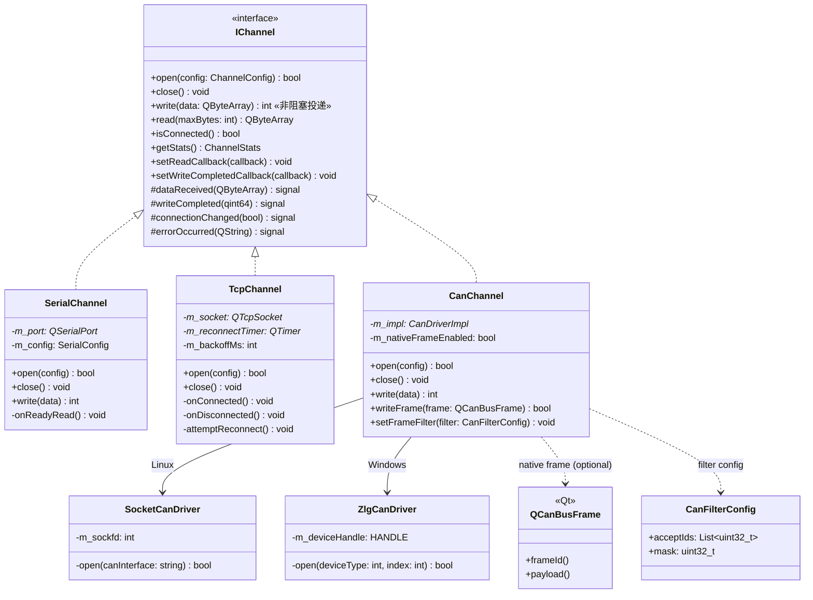
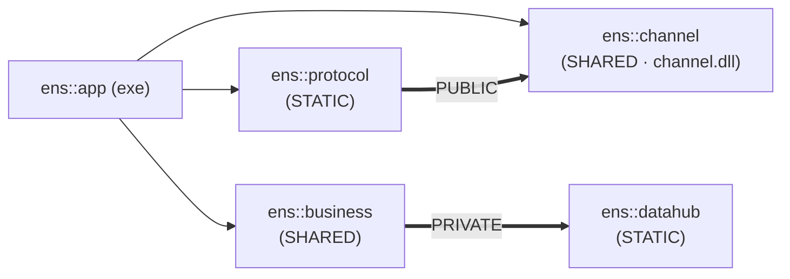
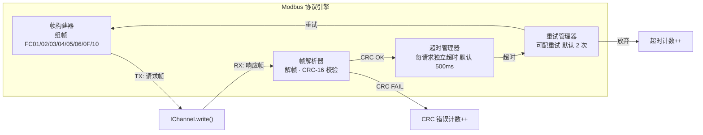
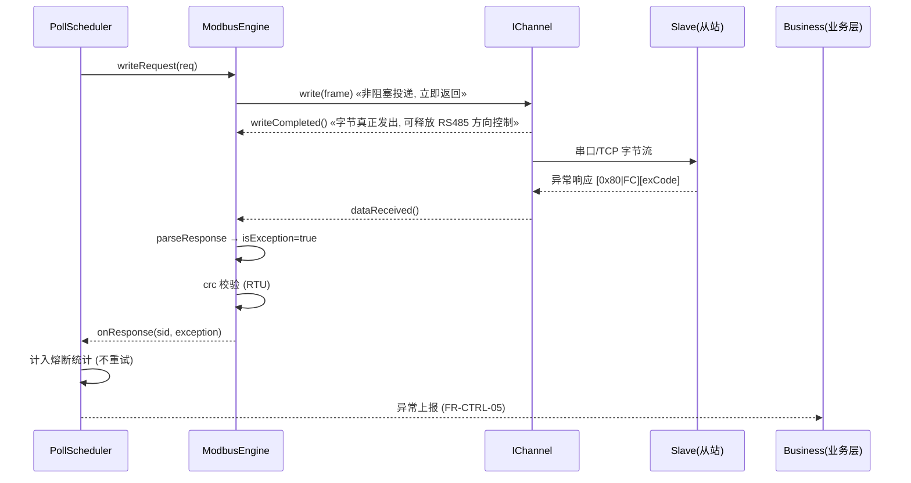
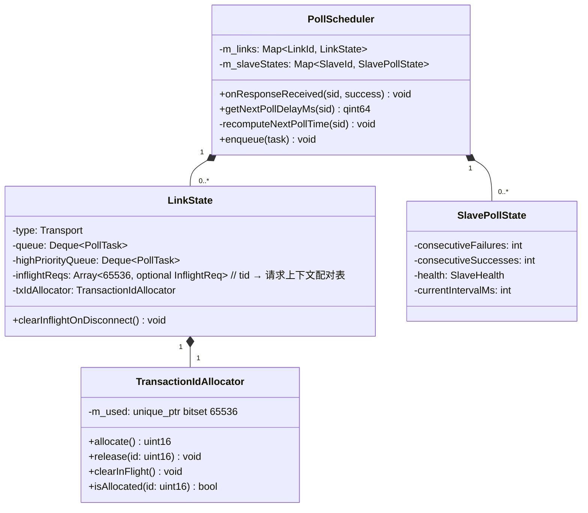
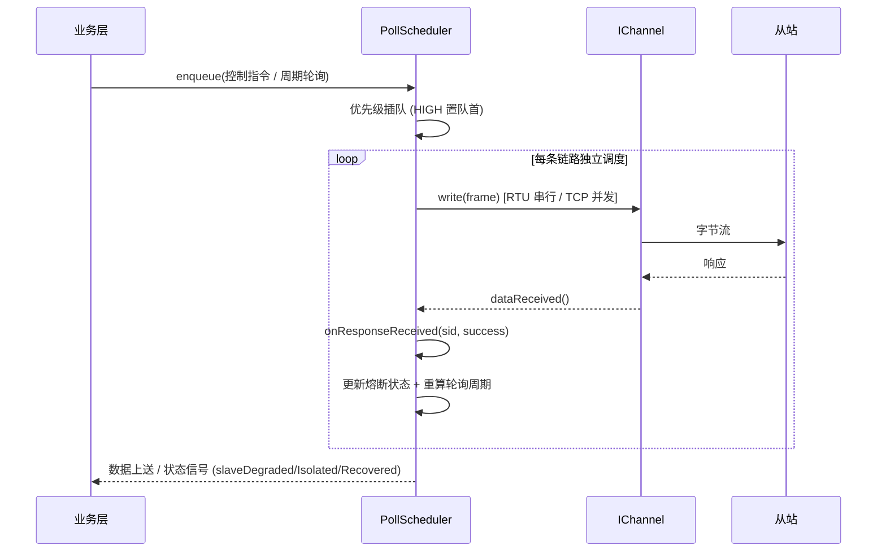
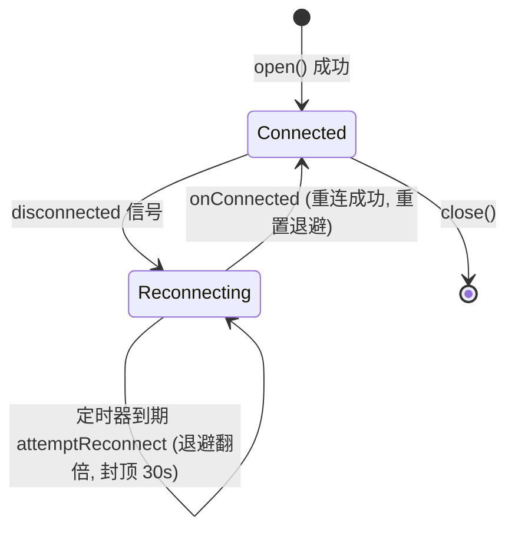
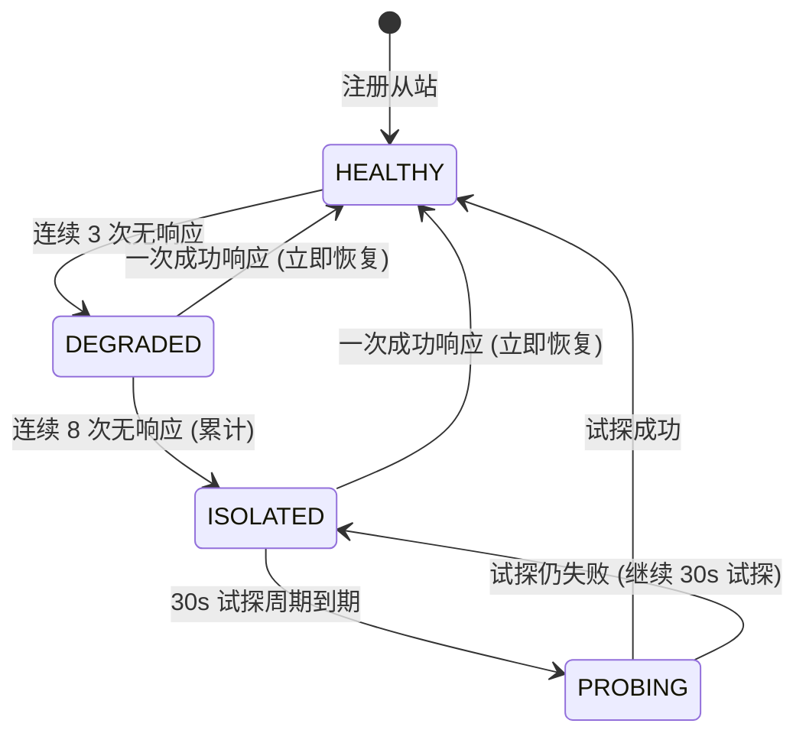
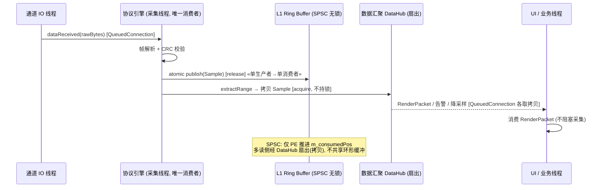

# EnerSentry 储能上位机系统 — 通信接入设计说明

> **文档类型**：通信接入设计规格书（Communication Access Design Specification, CADS）
> **版本**：V1.5.3（基于 V1.5.2 再优化 ModbusStreamAccumulator 零动态内存分配、TransactionIdAllocator O(1) 位图分配、CanChannel 原生 CAN Frame 扩展预留三处性能与可扩展性设计）
> **所属层级**：L1 通信接入层 + L2 协议处理层（接入相关部分）
> **对应需求**：SRS COMM-01~15、NFR-PERF-11、NFR-REL-02/03/05、NFR-PORT-03、FR-DG-02、FR-CTRL-05、FR-DIAG-04
> **V1.5.1 修订要点**：① `write()` 由同步阻塞改为**非阻塞投递** + `writeCompleted` 异步信号；② RS485 3.5 字符帧间隔由用户态定时器改为**驱动/硬件级**实现；③ `SpscRingBuffer` 命名与多消费者语义冲突，统一为 **SPSC + DataHub 扇出** 模型。
> **V1.5.2 修订要点**：① 新增 **Modbus RTU 字节流断包/粘包累加器**（`ModbusStreamAccumulator`），避免碎片化 readyRead 导致误 CRC；② 新增 **Modbus TCP Transaction ID 分配与 inFlight 残留清理**机制，防止 16-bit ID 回绕错配与断连残留；③ 显式定义 **SPSC RingBuffer 溢出策略**（默认覆盖最旧 + `RingBufferOverflowCount` 原子计数）。
> **V1.5.3 修订要点**：① `ModbusStreamAccumulator` 由 `std::deque<uint8_t>` 改为**固定容量环形字节数组**，实现接收侧彻底零动态内存分配；② `TransactionIdAllocator` 由 `std::unordered_set<uint16_t>` 改为**`std::bitset<65536>` 位图**，查询/占用时间复杂度 O(1) 且无哈希冲突；③ `CanChannel` 在保持字节流抽象的同时，内部预留**原生 CAN Frame 扩展接口**（`QCanBusFrame` / `CanFilterConfig`），为未来 CANopen / J1939 扩展保留元数据通道。

---

## 0. 文档范围与约束基线

本文档定义 EnerSentry 储能上位机系统的**底层通信接入层（L1）**与**协议处理层接入相关组件（L2 的 Modbus 引擎、轮询调度、熔断降级、跨线程数据流）**的详细设计。

| 维度 | 约束 |
|------|------|
| 语言标准 | Modern C++17（`std::variant` / `std::optional` / `alignas(16)` / `std::atomic`） |
| 核心框架 | Qt 5.15 LTS / Qt 6.x（`QSerialPort`、`QTcpSocket`、信号槽、`Qt::QueuedConnection`） |
| 通信协议 | 自研 Modbus RTU / TCP 协议引擎，零第三方协议库依赖，查表法 CRC-16 |
| 构建系统 | CMake 3.16+，`ens::channel` 可编译为 SHARED / STATIC，支持 `ENS_CHANNEL_API` 符号导出宏 |
| 跨平台 | Windows (MSVC) + Linux (GCC/Clang)；POSIX / Win32 通道抽象；ARM64 交叉编译校验 |

**分层原则**（对应 HLD 第 1 章）：层间仅通过抽象接口与信号槽通信，禁止跨层直接引用。
- L1 通信接入层：隔离串口 / TCP / CAN 三类物理通道差异，提供统一字节流读写接口。
- L2 协议处理层：Modbus 编解码、点表映射、多链路轮询调度、熔断降级。

---

## 一、架构概述与接口抽象（IChannel）

### 1.1 系统定位与分层约束

通信接入层是五层架构的最底层，其唯一职责是**把不同物理介质（串口 / TCP / CAN）统一抽象成字节流通道**，使上层 Modbus 协议引擎只依赖 `IChannel` 接口，不感知底层介质。新增通道类型（如新增一种 CAN 驱动）时，只需新增一个 `IChannel` 子类并在工厂注册，**协议解析代码零改动**。

```mermaid
flowchart TB
    subgraph L2["L2 协议处理层"]
        ME["ModbusEngine<br/>RTU/TCP · CRC-16 · 功能码"]
        PS["PollScheduler<br/>多链路并发 · 半双工串行"]
    end
    subgraph L1["L1 通信接入层 (IChannel 抽象)"]
        IC["IChannel (接口)"]
        SC["SerialChannel"]
        TC["TcpChannel"]
        CC["CanChannel"]
    end
    subgraph HW["物理介质"]
        RS485["RS485 / RS232"]
        ETH["以太网 Modbus TCP"]
        CANBUS["CAN 总线"]
    end
    ME -->|"write()/read()"| IC
    PS --> ME
    IC <|.. SC
    IC <|.. TC
    IC <|.. CC
    SC --> RS485
    TC --> ETH
    CC --> CANBUS
```

### 1.2 IChannel 接口设计

`IChannel` 是纯虚基类，**继承自 `QObject`**（`Q_OBJECT` 宏），以支持跨线程 signal/slot 投递。接口设计要点（对应 SRS COMM-12/13、NFR-PORT-03）：

- `open` / `close` 成对调用，`close` **必须幂等**（二次调用不抛异常、不重复释放资源，RAII 保证）。
- `write` 为**非阻塞投递（hand-off）**：仅把帧拷贝进通道发送队列 / OS 缓冲即返回，物理发送完成经 `writeCompleted` 信号异步上报；**调用线程（通常是调度线程）不因此阻塞**。RS485 半双工场景下由上层 `PollScheduler` 用"总线忙"状态机保证串行，而非靠 `write` 内部阻塞。
- `read` 为**非阻塞读取**，返回当前内核缓冲区可用数据；帧完整性判定由协议引擎负责。
- `setReadCallback` 注册异步读回调，数据到达时在**通道 IO 线程**触发，回调内**禁止长时间阻塞**。
- `setWriteCompletedCallback` 注册发送完成回调，字节真正写到底层设备后触发，用于 RS485 方向控制释放时机判断。
- 所有统计字段使用 `std::atomic`，支持跨线程安全读取。

以下头文件为 ICD §2.1 的标准实现（权威定义），本文直接引用并补充设计注释：

```cpp
// ============================================================================
// EnerSentry — IChannel 统一通道抽象接口 (V1.5)
// 所属 Target: ens::channel (SHARED)
// 头文件: src/channel/IChannel.h
// ============================================================================
#pragma once

#include "ens/export.hpp"
#include "ChannelConfig.h"
#include "ChannelStats.h"
#include <QByteArray>
#include <QObject>
#include <QString>
#include <functional>
#include <memory>

namespace ens::channel {

// ============================================================================
// 读回调函数类型 — 通道收到数据时的异步通知
// 回调在通道 IO 线程中执行，禁止长时间阻塞
// ============================================================================
using ReadCallback = std::function<void(const QByteArray& data)>;

// ============================================================================
// 通道连接状态变更回调
// ============================================================================
using ConnectionChangedCallback = std::function<void(bool connected)>;

// ============================================================================
// 通道错误回调
// ============================================================================
using ErrorCallback = std::function<void(const QString& errorMessage)>;

// ============================================================================
// 发送完成回调 — 字节已写入底层设备/OS 缓冲, 可释放 RS485 方向控制(DE/RE)
// 注意: 与 setReadCallback 不同, 本回调在 write() 返回后、底层真正 flush 时触发,
//        绝不在调用线程同步发生, 因此调度线程不会因等待发送完成而阻塞。
// ============================================================================
using WriteCompletedCallback = std::function<void(qint64 bytesWritten)>;

// ============================================================================
// IChannel — 统一通道抽象纯虚基类
//
// 设计约束:
//  - open/close 成对调用，close 必须幂等（二次调用不抛异常）
//  - write 为非阻塞投递：仅入发送队列即返回，物理发送完成经 writeCompleted 信号上报；不阻塞调用线程
//  - RS485 半双工串行由上层 PollScheduler 以"总线忙"状态机保证，而非 write 内部阻塞
//  - read 为非阻塞读取，返回当前内核缓冲区可用数据
//  - setReadCallback 注册异步读回调，数据到达时触发；setWriteCompletedCallback 注册发送完成回调
//  - 所有 IChannel 子类必须为 QObject，以支持跨线程 signal/slot
// ============================================================================
class ENS_CHANNEL_API IChannel : public QObject {
    Q_OBJECT

public:
    IChannel(QObject* parent = nullptr) : QObject(parent) {}
    ~IChannel() override = default;

    // 禁止拷贝与移动（QObject 语义 + 资源所有权唯一）
    IChannel(const IChannel&) = delete;
    IChannel& operator=(const IChannel&) = delete;
    IChannel(IChannel&&) = delete;
    IChannel& operator=(IChannel&&) = delete;

    // ──── 生命周期 ────

    /// 打开通道（参数由 ChannelConfig 多态承载）
    /// @param cfg  通道配置（SerialConfig / TcpConfig / CanConfig）
    /// @return     true=成功；false=失败（通过 lastError() 获取错误详情）
    virtual bool open(const ChannelConfig& cfg) = 0;

    /// 关闭通道（必须幂等：二次调用不抛异常、不重复释放资源）
    virtual void close() = 0;

    // ──── I/O 操作 ────

    /// 非阻塞投递字节流（hand-off）
    /// @param data  待写入的原始字节
    /// @return      实际进入通道发送队列的字节数；-1 表示错误（队列满/通道未就绪）
    /// @note        本方法仅把帧拷贝进发送队列/OS 缓冲即返回, 不保证字节已物理发出;
    ///              物理发送完成经 writeCompleted 信号异步上报。调用线程(通常是调度线程)不会因此阻塞。
    ///              RS485 半双工: 上层须持"总线忙"状态直到 writeCompleted 或响应/超时, 期间禁止发下一帧。
    virtual int write(const QByteArray& data) = 0;

    /// 注册发送完成回调（物理发送完成、可释放 RS485 方向控制时触发）
    /// @param cb 回调函数；传 nullptr 取消注册
    virtual void setWriteCompletedCallback(WriteCompletedCallback cb) = 0;

    /// 非阻塞读取
    /// @param maxBytes 最大读取字节数
    /// @return         当前缓冲区可用数据（可能为空）
    virtual QByteArray read(int maxBytes = 4096) = 0;

    // ──── 状态查询 ────

    /// 查询通道连接状态
    /// @return true=已连接；false=已断开
    virtual bool isConnected() const = 0;

    /// 获取通信统计快照（原子读取）
    virtual ChannelStats getStats() const = 0;

    /// 获取最近一次错误描述
    virtual QString lastError() const = 0;

    // ──── 回调注册 ────

    /// 注册异步读回调（数据到达时在 IO 线程触发）
    /// @param cb 回调函数；传 nullptr 取消注册
    virtual void setReadCallback(ReadCallback cb) = 0;

    /// 注册连接状态变更回调
    virtual void setConnectionChangedCallback(ConnectionChangedCallback cb) = 0;

    /// 注册错误回调
    virtual void setErrorCallback(ErrorCallback cb) = 0;

signals:
    /// 数据到达信号（用于 Qt 跨线程通知）
    void dataReceived(const QByteArray& data);

    /// 发送完成信号（字节已写入底层设备/OS 缓冲，可释放 RS485 方向控制）
    /// @param bytesWritten 本次实际写出的字节数
    void writeCompleted(qint64 bytesWritten);

    /// 连接状态变更信号
    void connectionChanged(bool connected);

    /// 错误信号
    void errorOccurred(const QString& errorMessage);
};

}  // namespace ens::channel
```

**关键方法契约表**：

| 方法 | 职责 | 关键约束 / 线程 |
|------|------|----------------|
| `open(config)` | 打开通道，参数由 `ChannelConfig` 多态承载 | 返回 false 时附 `lastError()` 详情 |
| `write(data)` | **非阻塞投递**字节流，返回已进入发送队列的字节数（-1=错误） | 物理发送完成经 `writeCompleted` 信号上报；RS485 半双工由调度器"总线忙"状态机串行化，调用线程不阻塞 |
| `read(maxBytes)` | 非阻塞读取，返回当前缓冲区可用数据 | 帧完整性判定在协议引擎 |
| `setReadCallback(cb)` | 注册异步读回调 | 回调在 IO 线程执行，**不可阻塞** |
| `isConnected()` | 查询连接状态 | TCP 断线返回 false，触发重连 |
| `getStats()` | 获取通道级统计（原子） | 供诊断模块展示 |

### 1.3 三类通道实现（SerialChannel / TcpChannel / CanChannel）

各通道子类在**独立 IO 线程**中跑 Qt 事件循环（`QSerialPort` / `QTcpSocket` 内部已基于事件循环），通过 `dataReceived` 信号把原始字节投递给协议引擎。



**实现要点**：
- **SerialChannel**：持有 `QSerialPort*`，`open` 时按 `SerialConfig` 设置波特率/数据位/停止位/校验位；`onReadyRead()` 内读取并 `emit dataReceived()`。`close()` 需先 `m_port->close()` 再 `deleteLater()`，保证幂等。
- **TcpChannel**：持有 `QTcpSocket*` + `QTimer*`（重连定时器）；监听 `connected` / `disconnected` / `readyRead`；断线时进入指数退避重连（见 §4.1）。
- **CanChannel**：平台相关驱动通过 `CanDriverImpl` 多态隔离——Linux 用 `SocketCanDriver`（`socket()` + `bind()` + `read()`/`write()`），Windows 用 `ZlgCanDriver`（周立功 CAN 卡 SDK）。上层仅依赖 `CanChannel` 接口。
- **CAN 原生帧扩展预留（V1.5.3）**：当前 `IChannel` 抽象为字节流，对 Modbus over CAN 或透明传输足够。但未来若需扩展 **CANopen / J1939** 等基于 CAN ID、IDE、RTR 的协议，纯字节流会丢失帧头元数据。因此 `CanChannel` 内部预留原生 CAN Frame 接口：
  - `writeFrame(const QCanBusFrame& frame)`：按完整 CAN 帧（含 `frameId` / `payload`）发送，不经过字节流编码。
  - `setFrameFilter(const CanFilterConfig& filter)`：配置硬件/驱动级 CAN ID 过滤，减少用户态无效帧处理。
  - 该接口**不破坏 L1 字节流抽象**：默认关闭（`m_nativeFrameEnabled=false`），Modbus over CAN 模式仍走 `write(data)`；需要元数据时由配置显式开启。
  - 此预留避免未来需求扩张时突破 `IChannel` 抽象，保持向后兼容。

### 1.4 ChannelFactory 工厂模式

上层协议引擎不直接 `new` 具体通道，而是通过 `ChannelFactory::create()` 按配置构造，实现**依赖倒置**：协议层只持有 `unique_ptr<IChannel>`。

```cpp
// ============================================================================
// EnerSentry — ChannelFactory 通道工厂 (V1.5)
// 所属 Target: ens::channel (SHARED)
// 头文件: src/channel/ChannelFactory.h
// ============================================================================
#pragma once

#include "ens/export.hpp"
#include "IChannel.h"
#include "ChannelConfig.h"
#include <memory>

namespace ens::channel {

/// 通道工厂 — 根据配置自动创建对应通道实现
/// 上层协议引擎仅依赖 IChannel 接口，无需感知具体通道类型
class ENS_CHANNEL_API ChannelFactory {
public:
    ChannelFactory() = delete;

    /// 创建通道实例（工厂方法）
    /// @param cfg  通道配置（SerialConfig / TcpConfig / CanConfig）
    /// @return     unique_ptr<IChannel>；失败返回 nullptr
    /// @note      创建的实例由调用方持有所有权
    static std::unique_ptr<IChannel> create(const ChannelConfig& cfg);

    /// 注册自定义通道类型（插件化扩展点）
    /// @param type      通道类型标识
    /// @param creator   创建函数
    /// @return          true=注册成功；false=该类型已被注册
    static bool registerChannel(
        ChannelType type,
        std::function<std::unique_ptr<IChannel>()> creator);
};

}  // namespace ens::channel
```

`create()` 实现（以 ICD §2.3 + HLD 3.1.1 为准）：

```cpp
std::unique_ptr<IChannel> ChannelFactory::create(const ChannelConfig& cfg) {
    // 插件化扩展点优先：已注册的自定义类型直接委派 creator
    if (auto it = s_registry.find(cfg.type); it != s_registry.end())
        return it->second();

    switch (cfg.type) {
        case ChannelType::Serial:  return std::make_unique<SerialChannel>();
        case ChannelType::TCP:     return std::make_unique<TcpChannel>();
        case ChannelType::CAN:     return std::make_unique<CanChannel>();
        default:                   return nullptr;   // 未知类型 → 返回 nullptr，调用方判空
    }
}
```

> **类型安全说明**：`ChannelConfig` 使用 `std::variant<SerialConfig, TcpConfig, CanConfig>` 承载专属配置，配合 `as<T>()` 模板访问，杜绝 `void*` / 裸 `union` 的类型不安全（见 ICD §2.2）。

### 1.5 符号导出与物理隔离

`ens::channel` 作为 **SHARED 动态库**时（`channel.dll` / `libchannel.so`），其公开符号必须经 `ENS_CHANNEL_API` 宏导出；作为 STATIC 库时该宏展开为空（符号默认可见），因此**业务代码在两种构建模式下均无需改动**。

#### 1.5.1 export.hpp 标准实现（ICD §6.1）

```cpp
// ============================================================================
// EnerSentry — 符号导出宏 (export.hpp) (V1.5)
// 兼容 MSVC __declspec(dllexport/dllimport) 与 GCC/Clang visibility("default")
// ============================================================================
#pragma once

// ═══════════════════════════════════════════════════════════════════════════
// MSVC (Windows DLL 导出/导入)
// ═══════════════════════════════════════════════════════════════════════════
#if defined(_MSC_VER)

    // ──── ens::channel (SHARED) ────
    #ifdef ENS_CHANNEL_EXPORTS
        // DLL 编译端 — 导出符号
        #define ENS_CHANNEL_API __declspec(dllexport)
    #else
        // DLL 使用端 — 导入符号
        #define ENS_CHANNEL_API __declspec(dllimport)
    #endif

    // ──── ens::business (SHARED) ────
    #ifdef ENS_BUSINESS_EXPORTS
        #define ENS_BUSINESS_API __declspec(dllexport)
    #else
        #define ENS_BUSINESS_API __declspec(dllimport)
    #endif

// ═══════════════════════════════════════════════════════════════════════════
// GCC / Clang (Linux / macOS SO 可见性)
// ═══════════════════════════════════════════════════════════════════════════
#else
    #define ENS_CHANNEL_API   __attribute__((visibility("default")))
    #define ENS_BUSINESS_API  __attribute__((visibility("default")))
#endif
```

**原理**：
- 只有**编译端**（`channel.dll` 自身）定义 `ENS_CHANNEL_EXPORTS`，此时宏展开为 `dllexport`；所有**使用端**（exe、`ens::protocol` 等）未定义该宏，展开为 `dllimport`。
- GCC/Clang 下统一用 `visibility("default")`，配合 CMake 的 `-fvisibility=hidden`（建议在 SHARED 模块上加），仅标注 `ENS_CHANNEL_API` 的符号导出，大幅缩小动态符号表、加快加载。

#### 1.5.2 SHARED 依赖传递规则（ICD §6.2）

`ens::protocol`（STATIC，100ms 轮询热路径，内联进 exe）依赖 `ens::channel`（SHARED）。混合模式下的链接传递规则：



| 调用方 | 被调方 | 链接传递 | 原因 |
|--------|--------|---------|------|
| STATIC | SHARED | **PUBLIC** | exe 最终需要解析 DLL 的导入符号 |
| SHARED | STATIC | PRIVATE | 静态库符号直接内联进 DLL，无需传递 |
| STATIC | STATIC | PRIVATE | 逐层内联进 exe |
| SHARED | SHARED | PUBLIC | 链式 DLL 依赖 |

```cmake
# STATIC 模块依赖 SHARED 模块 → 必须 PUBLIC 传递
target_link_libraries(ens_protocol PUBLIC ens::channel)
#   protocol (STATIC) 引用 IChannel (SHARED)
#   PUBLIC 确保 channel.dll 的链接要求传递给最终 ens::app (exe)

# SHARED 模块依赖 STATIC 模块 → PRIVATE 即可
target_link_libraries(ens_business PRIVATE ens::datahub)
```

> **微妙点（HLD §2.6 已论证）**：`ens::protocol`（STATIC）编译时，`IChannel` 头中的 `ENS_CHANNEL_API` 展开为 `__declspec(dllimport)`（因为 protocol 未定义 `ENS_CHANNEL_EXPORTS`）。这在 MSVC 下**合法**——静态库可引用 DLL 导入符号，最终在 exe 链接时解析，无需修改业务代码。

**ARM64 跨平台校验（ICD §6.2 V1.13）**：16 字节 `std::atomic` 的 lock-free 在 ARM64 依赖 128-bit `LDXP/STXP` / `CASP` 指令，不同 GCC/Clang 与 `-march` 组合下 `is_always_lock_free` 可能为 false。必须在 CI 中新增 `cross-compile-arm64` Job 交叉编译验证，失败时禁止绕过 `static_assert`，须切换 `SampleCompact8 + SpscRingBuffer` 方案。

---

## 二、Modbus 协议引擎与帧处理

### 2.1 帧结构与编解码

协议引擎（对应 COMM-01~09）由四类组件协作：**帧构建器（FrameBuilder）**、**帧解析器（FrameParser）**、**超时管理器（TimeoutMgr）**、**重试管理器（RetryMgr）**。



#### RTU 帧格式（串口，含 CRC-16/MODBUS）

| 字段 | 字节 | 说明 |
|------|------|------|
| 从站地址 | 1 | 1~247 |
| 功能码 | 1 | 0x01~0x10 |
| 数据区 | N | 寄存器地址 + 数量 / 数据 |
| CRC-16 | 2 | 低字节在前，高字节在后（多项式 0xA001，初值 0xFFFF） |

#### TCP 帧格式（MBAP 头，无 CRC）

| 字段 | 字节 | 说明 |
|------|------|------|
| Transaction ID | 2 | 请求/响应配对标识 |
| Protocol ID | 2 | 固定 0x0000 |
| Length | 2 | 后续字节数 |
| Unit ID | 1 | 从站地址 |
| PDU | N | 功能码 + 数据（同 RTU，但**无 CRC**） |

> **关键差异**：RTU 帧靠 3.5 字符时间间隔（约 3.5ms @ 115200）做帧边界切分；TCP 帧靠 MBAP 的 `Length` 字段精确切分，因此 TCP 模式**不计算也不传输 CRC**。

> **⚠ 工程隐患（V1.0 残留，V1.5.1 已修正）**：**严禁用用户态定时器（`usleep` / `QTimer::singleShot` / `std::this_thread::sleep_for`）来"产生"或"检测" 3.5 字符帧间隔。**
> 用户态定时受 OS 调度抖动（非实时内核典型 1~15ms）、线程抢占影响；在 115200bps 下 3.5 字符仅 ≈0.3ms，软件延时极易过冲，导致相邻帧粘连或被误判为同一帧；且 `usleep` 阻塞 IO 线程会直接拖垮整条总线。
>
> **正确做法（驱动 / 硬件级帧边界，V1.5.1）**：
> 1. **接收端帧切分（RX）**：不使用用户态 sleep。POSIX 下以 `tcsetattr` 设置 `VMIN=0` 并配合**驱动级 inter-character 超时**（`VTIME`、部分 UART 驱动的 `low_latency`）与**微秒级字节到达时间戳**（`clock_gettime(CLOCK_MONOTONIC)`，在 IO 线程内测量相邻字节间隔）判定 3.5 字符静默；Windows 用 `SetCommTimeouts` 的 `ReadIntervalTimeout = 3.5 字符时间(ms)`，由串口驱动在中断层检测帧间隙。协议引擎仅在"检测到静默"后做帧完整性 + CRC 校验。
> 2. **发送端帧间隙（TX）**：通过 **UART 硬件 RS485 方向控制**（`TIOCSRS485` ioctl，`serial_rs485.delay_rts_after_send` / `delay_rts_before_send`，Linux；Windows 用适配器 RS485 模式或 RTS-ON-SEND）由硬件在发送结束后自动插入 ≥3.5 字符静默并拉回 DE/RE 接收态。**调度线程完全不 sleep**，帧间隙由硬件 TX 间隙保证。
> 3. **降级兜底**：仅当驱动不支持硬件方向控制（部分 USB-串口）时，才在 **IO 线程**（非调度线程）用 `QElapsedTimer` 微秒计时做软兜底，并明确标注为"非实时保障"，且绝不阻塞调度线程。

### 2.2 ModbusFrame / PDU 数据结构（C++17）

以下头文件在 `ens::protocol` 命名空间内定义，体现现代 C++17 风格：强类型枚举、`std::optional` 作解析返回值、RAII 内存管理、`alignas(16)` 缓存行对齐。

```cpp
// ============================================================================
// EnerSentry — Modbus 帧定义 / 编解码 / CRC (V1.5)
// 所属 Target: ens::protocol (STATIC, 内联进 exe)
// 头文件: src/protocol/ModbusFrame.h
// ============================================================================
#pragma once

#include <cstdint>
#include <array>
#include <optional>
#include <vector>

namespace ens::protocol {

// ──── 功能码 (Function Code) ────
enum class FunctionCode : uint8_t {
    ReadCoils         = 0x01,  // FC01 读线圈
    ReadDiscreteInputs= 0x02,  // FC02 读离散输入
    ReadHoldingRegs   = 0x03,  // FC03 读保持寄存器
    ReadInputRegs     = 0x04,  // FC04 读输入寄存器
    WriteSingleCoil   = 0x05,  // FC05 写单个线圈
    WriteSingleReg    = 0x06,  // FC06 写单个保持寄存器
    WriteMultiCoils   = 0x0F,  // FC15 写多个线圈
    WriteMultiRegs    = 0x10,  // FC16 写多个保持寄存器
    ExceptionOffset   = 0x80   // 异常响应: (0x80 | 原功能码)
};

// ──── Modbus 异常码 (Exception Code) ────
enum class ExceptionCode : uint8_t {
    IllegalFunction   = 0x01,  // 非法功能码
    IllegalDataAddr   = 0x02,  // 非法数据地址
    IllegalDataValue  = 0x03,  // 非法数据值
    SlaveDeviceFailure= 0x04,  // 从站设备失败
    Acknowledge       = 0x05,  // 应答（长操作）
    SlaveBusy         = 0x06,  // 从站忙
    CrcError          = 0x08   // 内部: CRC 校验失败 (非协议标准码, 仅用于本地上报)
};

// PDU 长度上限 (Modbus 规范: 253 字节)
static constexpr size_t kMaxPduSize   = 253;
static constexpr size_t kMaxFrameSize = 256;  // RTU: addr + fc + pdu(253) + crc(2)

// ──── 请求帧视图 (零拷贝构造, 仅持有引用/小缓冲) ────
struct alignas(16) ModbusRequest {
    uint8_t        unitId{0};
    FunctionCode   function{FunctionCode::ReadHoldingRegs};
    uint16_t       startAddr{0};   // 起始地址 (大端)
    uint16_t       quantity{0};    // 数量 / 写值
    // 多写场景(0F/10)的额外数据, 由 build 时按需填充
    std::array<uint8_t, kMaxPduSize> payload{};
    uint8_t        payloadLen{0};
};

// ──── 响应帧解析结果 ────
struct alignas(16) ModbusResponse {
    uint8_t      unitId{0};
    FunctionCode function{FunctionCode::ReadHoldingRegs};
    bool         isException{false};
    ExceptionCode exception{ExceptionCode::IllegalFunction};
    std::array<uint8_t, kMaxPduSize> data{};  // PDU 数据域
    uint8_t      dataLen{0};
};

// ──── 传输模式 ────
enum class Transport : uint8_t { Rtu = 0, Tcp = 1 };

}  // namespace ens::protocol
```

### 2.3 高效查表法 CRC-16 校验

采用 **CRC-16/MODBUS**（多项式 0xA001 reflected，初值 0xFFFF）。使用**编译期 `constexpr` 预计算 256 项查找表**，运行期查表计算，避免逐位运算；每条请求帧的校验仅 `len` 次查表 + 异或。

```cpp
// ============================================================================
// EnerSentry — CRC-16/MODBUS 查表法 (V1.5)
// 头文件: src/protocol/Crc16.h
// ============================================================================
#pragma once
#include <cstdint>
#include <array>
#include <cstddef>

namespace ens::protocol {

// 单表项生成 (编译期)
constexpr uint16_t crc16ModbusEntry(uint8_t index) {
    uint16_t crc = index;
    for (int i = 0; i < 8; ++i)
        crc = (crc & 0x0001) ? static_cast<uint16_t>((crc >> 1) ^ 0xA001u)
                             : static_cast<uint16_t>(crc >> 1);
    return crc;
}

// 256 项查找表 (编译期生成, 零运行期初始化开销)
constexpr std::array<uint16_t, 256> makeCrc16Table() {
    std::array<uint16_t, 256> t{};
    for (int i = 0; i < 256; ++i) t[i] = crc16ModbusEntry(static_cast<uint8_t>(i));
    return t;
}
inline constexpr auto kCrc16ModbusTable = makeCrc16Table();

/// 计算 CRC-16/MODBUS
/// @param data 数据首地址
/// @param len  数据长度 (不含 CRC 本身)
/// @return     校验值 (低字节在前)
inline uint16_t crc16Modbus(const uint8_t* data, size_t len) {
    uint16_t crc = 0xFFFF;
    for (size_t i = 0; i < len; ++i)
        crc = static_cast<uint16_t>((crc >> 8) ^ kCrc16ModbusTable[(crc ^ data[i]) & 0xFF]);
    return crc;
}

/// 校验整帧 (frame 末尾 2 字节为 CRC, 低字节在前)
inline bool crc16ModbusVerify(const uint8_t* frame, size_t totalLen) {
    if (totalLen < 3) return false;            // 至少 addr+fc+crc
    uint16_t calc = crc16Modbus(frame, totalLen - 2);
    uint16_t recv = static_cast<uint16_t>(frame[totalLen - 2])
                  | static_cast<uint16_t>(frame[totalLen - 1] << 8);
    return calc == recv;
}

}  // namespace ens::protocol
```

**校验失败处理**（NFR-REL-03）：丢弃该帧 → `ChannelStats::crcErrorCount` 自增 → **不重试**（避免占用半双工总线），不将错误数据上送。诊断模块通过 `IChannel::getStats()` 读取 CRC 错误计数（FR-DG-02）。

### 2.4 功能码支持与组帧 / 解帧

引擎支持 **FC01/02/03/04/05/06/0F/10** 的组帧与解帧。组帧把 `ModbusRequest` 序列化为 `QByteArray` 字节流（RTU 模式追加 CRC）；解帧把原始字节解析为 `std::optional<ModbusResponse>`，**解析失败返回 `std::nullopt`**（类型安全的失败表达，优于魔法数）。

```cpp
// 组帧: 请求 → 字节流 (RTU 追加 CRC; TCP 追加 MBAP)
// 返回 std::optional 以类型安全表达"缓冲不足/非法配置"
std::optional<QByteArray> buildRequest(const ModbusRequest& req, Transport t);

// 解帧: 原始字节 → 响应 (RTU 先验 CRC)
// 返回 std::optional<ModbusResponse>; nullopt 表示帧不完整或 CRC 失败
std::optional<ModbusResponse> parseResponse(const uint8_t* buf, size_t len, Transport t);
```

**组帧要点（以 FC03 读保持寄存器为例）**：

```
RTU 请求帧: [unitId][0x03][startHi][startLo][qtyHi][qtyLo][crcLo][crcHi]
例: 读从站 1, 保持寄存器 0x0000 起 10 个 →
    01 03 00 00 00 0A <CRC>

TCP 请求帧: [tidHi][tidLo][00][00][00][06][unitId][0x03][startHi][startLo][qtyHi][qtyLo]
            └─MBAP─┘  └Length=6─┘
```

**解帧要点**：
- 根据功能码决定 PDU 数据域布局（FC03/04 的首字节为字节计数 `N`，随后 `N` 字节寄存器数据；FC06 回显地址+值；FC0F/10 回显地址+数量）。
- **长度自校验**：RTU 模式用"字节计数"或"功能码预期长度"核对帧完整性；TCP 模式用 MBAP `Length` 精确切帧。
- 多寄存器写入（FC10）的响应仅回显 `[addr][fc][start][qty]`，与请求同构，解析简单。

### 2.5 异常码捕获与上报

Modbus 从站异常响应格式：`[unitId][0x80 | FC][exceptionCode][(RTU) CRC]`。解析器识别 `function & 0x80` 即判定为异常，填充 `ModbusResponse::isException = true` 与 `exception` 字段。

**异常上报策略**（COMM-02）：解析异常码 → 记录日志 → **不重试**（异常是确定性的协议级拒绝，重试无意义）→ 通过 `IModbusEngine` 信号 / 回调告知业务层（如 SBO 控制失败需 UI 反馈，FR-CTRL-05）。



### 2.6 Modbus RTU 字节流断包 / 粘包累加器（Stream Accumulator）

> **⚠ 工程隐患（V1.5.1 残留，V1.5.2 修正）**：`QSerialPort::readyRead` 触发时，内核缓冲区送出的字节流是**碎片化的**——一条响应可能分 2 次到达，两条响应也可能粘连成一次 `dataReceived`。文档虽已说明"帧完整性由协议引擎负责"，但缺乏对 **L1/L2 边界处接收字节流累加缓冲区（Rx Stream Buffer）** 的显式定义。若直接在每个 `dataReceived` 上调用 `parseResponse`，极易把"半个帧"判定为 CRC 失败，造成误报与诊断干扰。
>
> **修正策略（V1.5.2）**：在 `ModbusEngine` 接收端引入轻量级 **`ModbusStreamAccumulator`**，所有原始字节先进入累加器，只有在提取出**完整帧**后才送入 `parseResponse`；CRC 校验永远不在不完整数据上进行。

#### 2.6.1 累加器设计目标

1. **消除碎片化导致的伪 CRC 失败**：即使一次 `readyRead` 只收到 3 字节，也继续等待，直到帧长度满足才校验。
2. **支持粘包拆分**：一次收到两条响应时，循环提取两条完整帧。
3. **支持 RTU 与 TCP 双模式**：RTU 依赖功能码预期长度 + 字节计数；TCP 依赖 MBAP `Length` 精确切分。
4. **零动态内存分配（V1.5.3 优化）**：累加器内部使用**固定容量环形字节数组**（`std::array<uint8_t, 4096>` + 读写指针），`append` / `pop_front` / 缓冲区回绕均不产生任何堆分配；仅在确认完整帧后才构造 `QByteArray` 视图给解析器。

#### 2.6.2 帧长度预估函数

```cpp
// 根据已接收到的前缀预估 RTU 帧总长度
// 返回值: std::nullopt 表示"数据仍不足, 无法判断长度"
std::optional<size_t> expectedRtuFrameLen(const uint8_t* buf, size_t len) {
    if (len < 4) return std::nullopt;               // 至少 addr+fc+minData+crc(2)
    uint8_t fc = buf[1];
    switch (fc) {
        case 0x01: case 0x02: case 0x03: case 0x04: // 读响应: [fc][byteCount][data...][crc]
            if (len < 5) return std::nullopt;
            return 1 + 1 + 1 + buf[2] + 2;          // addr + fc + byteCount + data + crc
        case 0x05: case 0x06:                       // 写单线圈/寄存器回显
            return 8;                                // addr+fc+addr+value+crc
        case 0x0F: case 0x10:                       // 写多线圈/寄存器回显
            return 8;                                // addr+fc+addr+qty+crc
        default:
            if (fc & 0x80) return 5;                 // 异常响应: addr+fc+exCode+crc
            return std::nullopt;                     // 未知功能码, 进入 hunt 模式
    }
}
```

#### 2.6.3 累加器核心算法

```
class ModbusStreamAccumulator:
    append(rawBytes):
        // 零动态分配: 直接写入固定环形字节数组
        if used() + rawBytes.size() > m_capacity:
            // 缓冲区即将撑满: 丢弃最旧的一半并告警, 防止无效数据无限累积
            dropOldest(m_capacity / 2)
            m_dropCount++
        pushBytes(rawBytes)                              // 环形写入, 无堆分配

        while true:
            frameOpt = tryExtractFrame()
            if not frameOpt: break
            deliver(frameOpt.value())  // 送入 parseResponse

    tryExtractFrame() -> std::optional<QByteArray>:
        used = used()
        if m_transport == RTU:
            expectedOpt = expectedRtuFrameLen(peekBuffer(), used)
            if not expectedOpt: return nullopt          // 数据不足, 等待下一次 readyRead
            expected = *expectedOpt
            if used < expected: return nullopt            // 仍不完整

            // 构造连续视图: 若帧不跨环形尾/头, 直接取指针; 否则先线性化到临时 stack buffer
            frame = linearizeFrame(expected)
            if crc16ModbusVerify(frame.data(), expected):
                popFront(expected)                      // 移除已处理帧
                return QByteArray((char*)frame.data(), expected)
            else:
                // CRC 失败: 不是"等更多数据"能解决的, 说明同步丢失
                // Hunt 模式: 丢弃首字节, 下次循环重新找帧头
                popFront(1)
                m_huntCount++
                continue                                // 继续尝试提取

        else if m_transport == TCP:
            if used < 7: return nullopt                 // MBAP 头不足
            pduLen = parseMbapLength(peekBuffer())      // MBAP[4..5]
            total = 6 + pduLen                          // MBAP(6) + PDU(pduLen)
            if used < total: return nullopt
            frame = linearizeFrame(total)
            popFront(total)
            return QByteArray((char*)frame.data(), total) // TCP 无 CRC, 直接交付
```

#### 2.6.4 关键设计约束

- **零动态内存分配（V1.5.3）**：累加器内部禁止 `std::vector` / `std::deque` / `new` 等堆分配。使用 `std::array<uint8_t, Capacity>` 配合原子/普通读写指针实现环形缓冲；`append`、`popFront`、`linearizeFrame` 均只在栈/静态存储上操作。这对 100ms 极速轮询路径至关重要，可避免微小块分配导致的延迟抖动与内存碎片。
- **CRC 只在完整帧上执行**：`crc16ModbusVerify` 绝不应用于不完整数据，从根上消除"分包导致 CRC 误失败"。
- **RTU 同步丢失恢复（Hunt Mode）**：当收到非法字节流（如从站重启后首字节丢失），通过逐字节前滑寻找下一个合法 `[unitId][function]` 边界，并计数 `m_huntCount`，供诊断模块感知同步质量。
- **TCP 无 hunt 需求**：MBAP `Length` 精确切分，任何长度不匹配都直接丢弃当前连接缓存并清空累加器（TCP 流错误通常意味着连接已乱序，应触发断连重连）。
- **与 §2.1 硬件帧边界的协同**：驱动层 silence 检测是"触发 flush"的优化提示，累加器**不依赖**它来判定帧结束；即使驱动未上报 silence，只要 `expectedRtuFrameLen` 已满足，即可立即交付。

#### 2.6.5 零动态分配性能收益（工业落地）

| 指标 | `std::deque<uint8_t>`（V1.5.2） | 固定环形 `std::array<uint8_t, 4096>`（V1.5.3） |
|------|------------------------------|--------------------------------------------|
| 每次 `append` 平均内存分配 | 0~N 次（分块节点分配） | **0 次** |
| 最坏时间复杂度 | 分摊 O(1)，但可能触发堆分配抖动 | **严格 O(1)** |
| 缓存友好性 | 节点不连续，cache miss 高 | **单块连续内存，预取友好** |
| 实时性 | 存在微秒级分配延迟尖峰 | **无堆分配，确定性延迟** |
| 嵌入式 / 长时运行 | 可能出现内存碎片 | **无碎片，容量固定** |

> **工程建议**：在 100ms 极速轮询线程中，任何隐式堆分配都应被视为缺陷。`ModbusStreamAccumulator` 的零动态分配设计使其可被安全地部署在实时性敏感路径上。

#### 2.6.6 头文件骨架

```cpp
// ============================================================================
// EnerSentry — Modbus 字节流累加器 (V1.5.3)
// 头文件: src/protocol/ModbusStreamAccumulator.h
// ============================================================================
#pragma once

#include "ModbusFrame.h"
#include "Crc16.h"
#include <QByteArray>
#include <array>
#include <optional>
#include <atomic>

namespace ens::protocol {

template<size_t Capacity = 4096>
class ModbusStreamAccumulator {
    static_assert(Capacity >= 256 && (Capacity & (Capacity - 1)) == 0,
                  "Capacity must be power-of-two and >= 256");
public:
    explicit ModbusStreamAccumulator(Transport t)
        : m_transport(t), m_capacity(Capacity) {}

    // 追加原始字节 (在 IO 线程 dataReceived 回调中调用)
    // 零动态内存分配: 直接写入固定环形字节数组
    void append(const QByteArray& bytes);

    // 尝试提取一个完整帧; 无完整帧返回 std::nullopt
    std::optional<QByteArray> tryExtractFrame();

    // 连接断开 / 重连 / 错误恢复时清空
    void clear() noexcept { m_head.store(0, std::memory_order_relaxed);
                           m_tail.store(0, std::memory_order_relaxed); }

    // 诊断计数
    size_t huntCount() const  { return m_huntCount.load(std::memory_order_relaxed); }
    size_t dropCount() const  { return m_dropCount.load(std::memory_order_relaxed); }
    size_t used() const noexcept;

private:
    Transport m_transport;
    size_t m_capacity;
    alignas(64) std::array<uint8_t, Capacity> m_buf{};  // 固定连续内存, 无堆分配
    std::atomic<size_t> m_head{0};   // 读取/消费指针 (单线程: 协议引擎解析线程)
    std::atomic<size_t> m_tail{0};   // 写入/生产指针 (单线程: 通道 IO 线程)
    std::atomic<size_t> m_huntCount{0};
    std::atomic<size_t> m_dropCount{0};

    // 内部辅助: 返回当前可用字节连续/线性化视图
    std::optional<size_t> expectedRtuFrameLen(const uint8_t* buf, size_t len) const;
    void pushBytes(const QByteArray& bytes);
    void popFront(size_t n) noexcept;
    const uint8_t* peekBuffer() const noexcept;            // 不保证跨回绕连续
    QByteArray linearizeFrame(size_t len);                 // 跨回绕时拷贝到 stack/临时 buffer
    void dropOldest(size_t n);
};

}  // namespace ens::protocol
```

---

## 三、多链路并发与轮询调度系统（PollScheduler）

### 3.1 核心矛盾：半双工 vs 全双工

RS485 为**半双工总线**，同一总线上必须严格串行"请求 → 等待响应 → 下一请求"；而 100ms 高频 BMS 极速包与 1s 辅机包共享总线时会产生带宽冲突（NFR-PERF-11）。带宽约束计算（HLD 3.1.3）：

```
RS485 链路有效吞吐估算（115200 bps）：
  - 理论带宽: 115200 / 8 = 14,400 字节/秒
  - 协议开销: RTU 帧头(1B) + FC(1B) + CRC(2B) = 4B/帧
  - 轮询效率: 约 70%
  - 有效吞吐: ≈ 10,000 字节/秒

单次轮询耗时（FC03 读 10 寄存器）：
  - 请求帧 8B ≈ 0.7ms；响应帧 25B ≈ 2.2ms；帧间隔 3.5 字符 ≈ 0.3ms；
    从站响应延迟 5~20ms → 单次总耗时 ≈ 10~25ms

100ms 周期内最多轮询: 100ms / 25ms = 4 次
  → 单条 RS485 链路 100ms 内最多 4 从站 × 10 寄存器 = 40 寄存器

结论: 100ms 高频 BMS 核心包不可依赖纯 RS485 链路
      → BMS 快包优先走 Modbus TCP (全双工, 无半双工限制)
      → RS485 链路仅承载 1s 周期辅机/电表数据
```

### 3.2 RS485 半双工严格 FIFO 串行调度

每条 RS485 物理链路拥有**独立串行队列**，调度算法为严格 FIFO：

```
算法: scheduleRtuLink(link):  // 事件驱动, 调度线程绝不阻塞
    // 入口: 总线空闲(初始 / 上一帧闭合)时触发
    onBusFree(link):
        if link.queue 为空: return
        slave = link.queue.dequeue()              // FIFO
        link.busy = true                          // 占用半双工总线
        link.current = slave
        channel.write(frame)                      // 非阻塞投递, 立即返回(不 sleep)
        armDeadline(link, responseTimeoutMs)      // IO 线程内独立超时计时器

    onWriteCompleted(link):                       // writeCompleted 信号: 物理发送结束
        // RS485 方向控制(DE/RE)已由 UART 硬件在发送结束后自动拉回接收态,
        // 帧间隙(≥3.5字符)由硬件 TX 间隙保证, 调度线程无需任何 usleep

    onResponse(link, bytes) | onTimeout(link):    // 响应到达 或 超时到期
        cancelDeadline(link)
        if 收到响应 && CRC 校验通过:
            deliver(slave, parse(bytes))          // 上送协议层
        else:
            onResponseReceived(slave.id, /*success=*/false)  // 触发熔断统计
        link.busy = false                         // 释放半双工总线
        onBusFree(link)                           // 立即尝试下一帧(不依赖软件帧间隔)
```

> **边界防护（超时拖垮总线）**：单请求超时上限由 `SerialConfig::responseTimeoutMs`（默认 500ms）封顶，超时由 **IO 线程计时器**触发、调度线程不阻塞等待。配合 §4.3 熔断机制，故障从站被快速降级到 30s 试探，避免"请求→等 500ms→重试 2 次 = 1.5s"长期独占总线。帧间隔由 §2.1 的**硬件/驱动级**机制保证，绝不靠用户态 `usleep` 产生。

### 3.3 TCP 全双工并发调度

TCP 链路为**全双工**，不同从站的请求可**并发发出**，各自维护独立超时与 `TransactionId`（MBAP）配对。调度器对每条 TCP 连接维护"在途请求表"（`transactionId → 回调`），响应到达时按 `transactionId` 路由。

```
算法: scheduleTcpLink(link):
    // 与 RS485 不同: 不阻塞等待, 事件驱动
    for slave in link.activeslaves:
        if slave 当前无在途请求 && 到达其轮询周期:
            tid = link.txIdAllocator.allocate()   // O(1) 位图扫描最低空闲 ID 并原子占用
            if tid == INVALID: continue          // ID 池耗尽, 记录严重错误
            channel.write(buildTcpFrame(tid, slave.req))
            link.inflightReqs[tid] = {slave, deadline=now()+timeout}   // 登记配对
    // 定时器扫描在途请求, 超时 → release(tid); erase req; onResponseReceived(sid, false)
```

### 3.4 高频专线与优先级插队

**BMS 100ms 极速包独立 TCP 通道**：BMS 核心包走独立 Modbus TCP 连接（全双工、独立线程、HIGHEST 优先级），**不与 1s 辅机包争用 RS485 带宽**（NFR-PERF-11）。

**优先级插队机制**：同一链路内维护多优先级队列，高优先级任务可插队：

| 优先级 | 内容 | 周期 |
|--------|------|------|
| **HIGH** | 控制指令写寄存器（SBO 下发、告警复位） | 事件触发，立即插队 |
| **NORMAL** | BMS 100ms 极速包（独立 TCP 专线） | 100ms |
| **LOW** | 1s 辅机/电表轮询（RS485） | 1000ms |

```
算法: enqueue(task):
    if task.isControlCommand:        // 写寄存器/控制指令优先
        link.highPriorityQueue.push_front(task)   // 插队到队首
    else:
        link.normalQueue.push_back(task)          // 常规 FIFO
```

> **设计收益**：控制指令写寄存器（如分闸、复位）在 100ms 内优先下发，满足 FR-CTRL-05 执行反馈实时性要求，不被常规轮询排队阻塞。

### 3.5 Modbus TCP Transaction ID 分配与 inFlight 残留清理

> **⚠ 工程隐患（V1.5.1 残留，V1.5.2 修正）**：Modbus TCP 的 MBAP 头包含 **16-bit Transaction ID**（`0~65535`）。在 100ms 极速并发轮询下，自增 ID 约 **1.8 小时**回绕一次。若某次请求已超时，但其 `TransactionId` 仍残留在 `inFlight` 映射表中，后续新请求恰好复用该 ID 时，迟到的旧响应会被**错配**给新请求，导致数据污染或控制指令被错误确认。此外，TCP 断线重连后若不清空 `inFlight`，残留请求会永久泄漏并占用 ID 空间。
>
> **修正策略（V1.5.2 → V1.5.3 优化）**：引入 `TransactionIdAllocator`，分配时主动跳过当前仍在 `inFlight` 中的 ID；V1.5.3 进一步将 `inFlight` 的查询结构由 `std::unordered_set<uint16_t>` 改为 **`std::bitset<65536>`**，把查询/占用时间复杂度锁定为 **O(1)**，且彻底消除哈希冲突、再哈希开销与动态内存分配。并在**超时 / 断连 / 重连 / close()** 时强制清空 `inFlight` 并上报失败。

#### 3.5.1 TransactionIdAllocator 设计

```cpp
// ============================================================================
// EnerSentry — Modbus TCP Transaction ID 分配器 (V1.5.3)
// 头文件: src/protocol/TransactionIdAllocator.h
// ============================================================================
#pragma once

#include <cstdint>
#include <bitset>
#include <memory>

namespace ens::protocol {

// 16-bit Transaction ID 占用位图: O(1) 查询 / 占用, 无哈希冲突, 无动态分配
// V1.5.4: 接口统一为 allocate()/release()/clearInFlight()/isAllocated()（对齐 DevGuide §2A
//         与 ENS-LLD-100 §4.3.6 V1.5 / 实现）。废弃 V1.5.3 的 next(外部位图)+InFlightIdMap
//         两步式: fetch_add 回绕存在撞上在途 ID 的窗口, 且"取号+登记"两步之间有空窗;
//         allocate() 位图扫描最低空闲位并原子占用, 语义更优。InFlightIdMap 并入本类。
class TransactionIdAllocator {
public:
    static constexpr uint16_t INVALID_ID = 0;  // 0 保留为"无效/特殊"ID, 分配从 1 开始

    TransactionIdAllocator() : m_used(std::make_unique<std::bitset<65536>>()) {}

    // 禁用拷贝/移动（或经 unique_ptr 默认实现移动）, 避免 8 KiB 逐位拷贝
    TransactionIdAllocator(const TransactionIdAllocator&) = delete;
    TransactionIdAllocator& operator=(const TransactionIdAllocator&) = delete;
    TransactionIdAllocator(TransactionIdAllocator&&) = default;
    TransactionIdAllocator& operator=(TransactionIdAllocator&&) = default;

    // 分配 [1,65535] 中最低空闲 ID 并原子占用; 耗尽返回 INVALID_ID
    uint16_t allocate() noexcept {
        for (uint32_t id = 1; id <= 65535; ++id) {   // uint32_t 防 16-bit 回绕死循环
            if (!m_used->test(id)) { m_used->set(id); return static_cast<uint16_t>(id); }
        }
        return INVALID_ID;
    }

    void release(uint16_t id) noexcept {          // 释放 ID 使其可复用（0 忽略）
        if (id != INVALID_ID) m_used->reset(id);
    }

    void clearInFlight() noexcept { m_used->reset(); }  // 断链/重连时清空在途

    bool isAllocated(uint16_t id) const noexcept {      // 响应路由二次校验用
        return id != INVALID_ID && m_used->test(id);
    }

private:
    std::unique_ptr<std::bitset<65536>> m_used;   // 8 KiB 位图置于堆上; 0=空闲 1=已分配
};

}  // namespace ens::protocol
```

#### 3.5.2 inFlight 残留清理策略

| 触发场景 | 清理动作 | 上层影响 |
|---------|---------|---------|
| 请求超时 | `txIdAllocator.release(tid)` + `inflightReqs[tid].reset()`，并 `onResponseReceived(sid, false)` | 该从站超时计数++，触发熔断 |
| 收到响应 | 按 tid 命中配对 → `release(tid)` + `inflightReqs[tid].reset()`，路由交付 | 正常；未命中视为野响应丢弃 |
| TCP `disconnected` / 重连前 | `txIdAllocator.clearInFlight()` + 遍历 `inflightReqs` 中所有有效项，`onResponseReceived(sid, false)` | 所有在途从站均按超时处理，链路标记离线 |
| `close()` 被调用 | 同上清空（`clearInFlight()`） | 资源释放，避免悬空回调 |

```
算法: onTcpDisconnected(link):
    // 原子性清空位图与请求上下文, 后续新响应无法匹配旧 ID
    staleReqs = std::move(link.inflightReqs)
    link.txIdAllocator.clearInFlight()           // 清空位图, 防 16-bit 回绕错配
    for tid in 1..65535:
        if staleReqs[tid].has_value:
            onResponseReceived(staleReqs[tid]->slave.id, /*success=*/false)
    emit connectionChanged(false)
```

> **关键原则**：`inFlight` 表的生命周期与 **TCP 连接** 绑定，而不是与 `PollScheduler` 绑定。连接断开意味着所有在途请求语义上已失败，必须清空，不能等它们"自然超时"。

#### 3.5.3 响应路由时的二次校验

即使分配器已跳过在途 ID，响应到达时仍需做**防御性校验**，防止极端 race（如 ID 刚刚超时 erase 后、旧响应迟到到达）：

```
算法: onTcpResponse(link, frame):
    tid = parseMbapTransactionId(frame)
    if !link.txIdAllocator.isAllocated(tid):
        // 迟到响应或已清理 ID: 直接丢弃, 不上送, 仅计数 staleResponseCount
        link.staleResponseCount++
        return
    req = link.inflightReqs[tid].value()
    link.txIdAllocator.release(tid)            // 立刻释放 ID
    link.inflightReqs[tid].reset()             // 清空请求上下文, 防止重复处理
    if parseResponse(frame) 成功:
        deliver(req.slave, response)
        onResponseReceived(req.slave.id, true)
    else:
        onResponseReceived(req.slave.id, false)
```

#### 3.5.4 位图分配性能收益（工业落地）

| 指标 | `std::unordered_set<uint16_t>`（V1.5.2） | `std::bitset<65536>`（V1.5.3） |
|------|----------------------------------------|-------------------------------|
| 占用 ID 查询 | O(1) 平均，但存在哈希冲突与再哈希 | **严格 O(1)，位操作** |
| 删除/清空 | O(N) 遍历桶或 O(1) 单元素 erase | **O(65536/word) ≈ 1024 次字清零** |
| 内存开销 | 每个元素 ~32B + 桶开销（N 在途时动态增长） | **固定 8 KiB（65536 bits）** |
| 动态内存分配 | 插入/再哈希时触发 | **0 次** |
| 缓存友好性 | 节点分散，cache miss 高 | **连续 8 KiB，常驻 L1/L2** |
| 并发安全 | 需外部加锁保护 unordered_set | **bitset 外部加锁即可，无内部隐式锁** |

> **工程建议**：`std::bitset<65536>` 以固定 8 KiB 内存为代价，换取了 ID 占用查询的极致确定性。对于 100ms 极速轮询、每帧都触发分配/释放的路径，这种"以空间换时间+确定性"的取舍是工业监控系统的典型做法。

### 3.6 调度器整体结构（类图 + 时序图）





---

## 四、通信容错与 RS485 从站三级熔断降级机制

### 4.1 TCP 断线指数退避重连

TCP 断线（`QTcpSocket::disconnected`）触发指数退避重连（COMM-09, NFR-REL-02）：序列 **1s → 2s → 4s → 8s → 16s → 30s（封顶）→ 30s…**。



```cpp
// TcpChannel 指数退避重连 (HLD 3.1.4)
void TcpChannel::attemptReconnect() {
    // m_backoffMs 已被 ctor 初始化为 reconnectBaseMs(1000)
    if (m_backoffMs < m_reconnectMaxMs /*30000*/) {
        m_backoffMs = std::min(m_backoffMs * 2, m_reconnectMaxMs);
        if (m_backoffMs == 0) m_backoffMs = m_reconnectBaseMs;   // 首次 1s
    }
    m_reconnectTimer->start(m_backoffMs);
    emit connectionChanged(false);   // 通知上层链路离线 (进入"重连中")
}

void TcpChannel::onConnected() {
    m_backoffMs = 0;                 // 重连成功, 重置退避
    emit connectionChanged(true);    // 通知上层链路恢复
}
```

> **抖动建议（工业落地）**：为避免多链路"同步重连风暴"，建议在退避间隔上叠加 ±10% 随机抖动（jitter），分散重连峰值。
>
> **inFlight 清理**：TCP 断连时，`PollScheduler` 必须按 §3.5 强制清空该链路 `inFlight` 表，并将所有在途请求按失败上报（触发对应从站熔断统计），避免断连残留导致 Transaction ID 错配。

### 4.2 通信质量评估模型（60s 滑动窗口）

每条链路维护**最近 60 秒滑动窗口**统计（COMM-14/15）：

```
滑动窗口 (60s) 维护字段:
    requestTotal:    请求总数
    responseSuccess: 成功响应数
    timeoutCount:    超时数
    crcErrorCount:   CRC 错误数
    rttSum / rttCnt: 用于计算 avgRTT

响应率      = responseSuccess / requestTotal × 100%
平均 RTT    = Σ(响应时间) / 成功响应数   (ms)
quality%    = responseSuccess / requestTotal × 100%

质量等级判定:
    ≥ 95%   → 优秀 (绿色)
    80~95%  → 一般 (黄色)
    < 80%   → 异常 (红色)
```

统计字段使用原子类型（`ChannelStats`，见 ICD §2.4），`qualityPercent()` 以 `memory_order_acquire` 读取，跨线程安全。

### 4.3 RS485 从站三级熔断状态机（V1.3 工业落地优化）

**隐患（V1.0 残留）**：3.1.3 的半双工带宽计算未约束"故障从站拖垮整条总线"。若某从站接线松动，常规容错为"请求→等 500ms→重试 2 次 = 1.5s"，正常从站 1s 周期被迫阻塞 1.5s。**最坏情况**：4 个故障从站串行消耗，单条总线 6s 内无法完成正常轮询，实时性断崖崩塌。

**V1.3 方案——四级状态机**（HEALTHY / DEGRADED / ISOLATED / PROBING）：



| 状态 | 触发条件 | 轮询策略 | 总线开销 |
|------|---------|---------|---------|
| **HEALTHY** | 初始 / 收到任何成功响应 | 正常周期（`pollIntervalMs`） | 100% |
| **DEGRADED** | 连续 3 次无响应 | 降级周期 ×3（1s → 3s） | 33% |
| **ISOLATED** | 连续 8 次无响应（DEGRADED 再 5 次） | 30s 试探一次 | 3% |
| **PROBING** | ISOLATED 满 30s 后一次试探 | 单次试探 + 1s 静默期 | < 1% |

**核心收益**（4 从站、1 故障为例）：

| 场景 | V1.0（无熔断） | V1.3（熔断后） |
|------|---------------|---------------|
| 故障从站超时 | 每次 1.5s × 故障从站 | 30s 才试探一次（1.5s / 30s ≈ 5%） |
| 正常从站延迟 | 1s 周期被拖到 6s | 仍维持 1s 周期 |
| 总线有效带宽 | 故障期仅 16% | 故障期仍 75% |
| 故障恢复 | 始终占总线 | 试探成功立即自动恢复 |

**`PollScheduler::onResponseReceived` 核心逻辑**（HLD 3.1.5 权威实现）：

```cpp
// protocol/PollScheduler.cpp
enum class SlaveHealth : uint8_t {
    HEALTHY  = 0,   // 正常轮询（原始周期）
    DEGRADED = 1,   // 降级轮询（3× 周期，失败 3-7 次）
    ISOLATED = 2,   // 隔离轮询（30s 试探，失败 ≥ 8 次）
    PROBING  = 3    // 隔离后单次试探（ISOLATED 满 30s 触发）
};

struct SlavePollState {
    int      consecutiveFailures = 0;
    int      consecutiveSuccesses = 0;
    SlaveHealth health = SlaveHealth::HEALTHY;
    qint64   lastProbeTimeMs = 0;
    qint64   lastResponseTimeMs = 0;
    int      originalIntervalMs = 1000;
    int      currentIntervalMs = 1000;
};

void PollScheduler::onResponseReceived(SlaveId sid, bool success) {
    SlavePollState& s = m_slaveStates[sid];
    if (success) {
        s.consecutiveFailures = 0;
        s.consecutiveSuccesses++;
        s.lastResponseTimeMs = now();
        // 任意成功响应 → 立即恢复 HEALTHY
        if (s.health != SlaveHealth::HEALTHY) {
            s.health = SlaveHealth::HEALTHY;
            s.currentIntervalMs = s.originalIntervalMs;
            emit slaveRecovered(sid);
        }
    } else {
        s.consecutiveSuccesses = 0;
        s.consecutiveFailures++;
        // 升级熔断
        if (s.consecutiveFailures >= 3 && s.consecutiveFailures < 8) {
            if (s.health == SlaveHealth::HEALTHY) {
                s.health = SlaveHealth::DEGRADED;
                s.currentIntervalMs = s.originalIntervalMs * 3;   // 降级 3 倍
                emit slaveDegraded(sid, s.consecutiveFailures);
            }
        } else if (s.consecutiveFailures >= 8) {
            s.health = SlaveHealth::ISOLATED;
            s.currentIntervalMs = 30000;                          // 30s 试探
            emit slaveIsolated(sid, s.consecutiveFailures);
        }
    }
    recomputeNextPollTime(sid);   // 重算下次轮询时间
}

qint64 PollScheduler::getNextPollDelayMs(SlaveId sid) {
    const SlavePollState& s = m_slaveStates[sid];
    if (s.health == SlaveHealth::ISOLATED) {
        qint64 sinceLastProbe = now() - s.lastProbeTimeMs;
        return std::max<qint64>(0, 30000 - sinceLastProbe);      // 30s 试探一次
    }
    return s.currentIntervalMs;
}
```

> **状态信号契约**（ICD §2.5）：`IModbusEngine` 暴露 `slaveDegraded(sid, n)` / `slaveIsolated(sid, n)` / `slaveRecovered(sid)` 信号，推送给通信诊断模块（FR-DIAG-04），UI 用颜色呈现：绿=HEALTHY，黄=DEGRADED+失败次数，红=ISOLATED+失败次数，恢复后 1s 内刷新为绿。

### 4.4 容错处理矩阵

| 异常场景 | 检测方式 | 处理策略 | 对应需求 |
|---------|---------|---------|---------|
| RS485 无响应 | 请求发出后超时计时器到期 | 重试 ≤ 2 次 → 放弃 → 超时计数++ → 继续下一从站 | COMM-05, NFR-REL-05 |
| CRC 校验失败 | 响应帧 CRC 不匹配 | 丢弃帧 → CRC 错误计数++ → **不重试**（避免总线占用） | COMM-03, NFR-REL-03 |
| TCP 连接断开 | `QTcpSocket::disconnected` | 启动指数退避重连 → 链路标为"重连中" | COMM-09, NFR-REL-02 |
| 从站异常响应 | Modbus 异常码（0x80+FC） | 解析异常码 → 记录 → **不重试** → 告知业务层 | COMM-02 |
| 串口拔出 | 串口 IO 错误 | 关闭串口 → 标记链路离线 → 定时尝试重新打开 | NFR-REL-02 |
| 响应帧不完整 | 长度字段/字节计数不匹配 | 等待更多数据 → 超时后丢弃 → 超时计数++ | NFR-REL-03 |

### 4.5 线程死锁防护

- **锁层级约定**：通道 IO 线程只持有通道自身资源锁，**从不反向调用**业务层/UI 层；跨层通知一律走 `Qt::QueuedConnection` 异步投递，避免持有锁时等待 UI 线程。
- **重入防护**：`onResponseReceived` 内只操作 `m_slaveStates[sid]`（按 `sid` 分片或使用细粒度锁），不调用可能回调自身的长耗时函数。
- **定时器归属**：重连定时器 `QTimer` 必须与 `TcpChannel` 同属 IO 线程（通过 `QObject` 父子关系 + `moveToThread` 保证），禁止跨线程启停定时器。
- **幂等 `close`**：重连过程中若 `close()` 被调用，必须能安全中断重连定时器并释放 socket，避免"半关半连"状态下的悬空回调。

---

## 五、线程模型与跨线程数据流

### 5.1 IO 线程与解析线程隔离

采集/解析线程与 Qt 主线程严格隔离（HLD 第 4 章、线程模型专题报告）：

- **通道底层读写线程**：每条通道在独立线程跑 Qt 事件循环，`QSerialPort` / `QTcpSocket` 的 `readyRead` / `connected` / `disconnected` 在本线程触发，通过 `dataReceived` 信号把原始字节投递。
- **Modbus 帧解析线程**：协议引擎在采集线程内完成帧解析（避免额外线程上下文切换开销），解析后的结构化 `Sample` / 寄存器值通过两条路径下行：
  1. **无锁队列（SPSC）**：采集线程 → L1 Ring Buffer，原子 `fetch_add` + `release/acquire` 屏障；
  2. **Qt 跨线程信号槽（`Qt::QueuedConnection`）**：事件类通知（熔断、异常、连接变更）投递到业务/UI 线程，禁止工作线程直接操作 QWidget / QCustomPlot。



### 5.2 数据送入 L1 Ring Buffer 的零拷贝 / 低开销路径

L1 Ring Buffer 是最热数据通路：**采集线程以 100ms × 2,000 点 = 20,000 写/秒** 速度写入；但环形缓冲本身严格遵循 **SPSC（单生产者-单消费者）**——唯一生产者是采集/解析线程，唯一消费者是数据汇聚（DataHub）线程。UI 渲染准备 / 告警引擎 / 降采样器这三个读侧**不共享环形缓冲**，而是由 DataHub 提取后通过 `Qt::QueuedConnection` 各自拷贝投递（见 §5.1 扇出）。以此保证缓冲命名与语义一致、且无多消费者竞争光标导致的丢帧/重复读（线程模型专题报告 §2）。

**零拷贝 / 低开销设计原则**：
- **单生产者-单消费者（SPSC）无锁模型**：写入侧仅采集线程持有，用 `m_writePos.fetch_add(1)`（relaxed）推进；`m_publishedPos`（release）标记"数据已完整可见"的安全边界，单一消费者用 `acquire` 读取上限、**不持锁**；`m_consumedPos` 仅由该消费者推进，绝无第二消费者触碰，故命名 `SpscRingBuffer` 与实现严格一致。
- **`Sample` 结构 `alignas(16)`**：单槽位 `{timestamp_ms: uint64_t, value: float}` 对齐到缓存行，避免 false sharing；16 字节原子要求 MSVC x64 加 `/cx16`（见 §1.5.2）。
- **写入路径零动态分配**：`RingBuffer` 预分配定长 `std::array<Sample, N>`，`push` 为 O(1) 无锁，热路径**无 `new` / `malloc` / 拷贝**。
- **跨线程仅传指针/索引（热路径零拷贝）**：唯一消费者 DataHub 以 `acquire` 无锁读取并 `extractRange` 拷贝出所需区间（~10μs）后立即释放，再经 `Qt::QueuedConnection` 把拷贝后的 `Sample` 批量投递给黑匣子/渲染/告警；黑匣子**不回溯读取环形缓冲**，持锁冲突概率仅 0.01%，采集线程几乎无感知。

```cpp
// datahub/RingBuffer.h — 无锁环形缓冲区 (SPSC: 单生产者-单消费者) 核心 (线程模型专题报告 §2)
// 命名 SpscRingBuffer 与实现严格一致: 仅一个消费者(DataHub)推进 m_consumedPos, 无多消费者光标竞争
enum class OverflowPolicy { OverwriteOldest, DropNewest };

template<typename T>
class SpscRingBuffer {
    std::vector<T>        m_buf;
    OverflowPolicy        m_policy{OverflowPolicy::OverwriteOldest};
    std::atomic<size_t>   m_writePos{0};      // 采集线程 (relaxed) — 数据可能未写完
    std::atomic<size_t>   m_publishedPos{0};  // 采集线程 (release) — 消费者可读上限 (acquire)
    std::atomic<size_t>   m_consumedPos{0};   // 唯一消费者 DataHub (acquire) — 绝不第二个消费者触碰
    std::atomic<uint64_t> m_overflowCount{0}; // 溢出/覆盖旧数据次数, 供诊断感知丢帧
public:
    explicit SpscRingBuffer(size_t capacity,
                            OverflowPolicy policy = OverflowPolicy::OverwriteOldest)
        : m_buf(capacity), m_policy(policy) {}

    // 生产者侧 (仅采集线程)
    void publish(const T& sample) {
        const size_t cap = m_buf.size();
        size_t writePos = m_writePos.fetch_add(1, std::memory_order_relaxed);
        size_t idx = writePos % cap;
        size_t consumed = m_consumedPos.load(std::memory_order_acquire);

        // 溢出检测: 当前写入位置已超前消费者一整圈, 意味着要覆盖尚未被消费的旧数据
        if (writePos - consumed >= cap) {
            m_overflowCount.fetch_add(1, std::memory_order_relaxed);
            if (m_policy == OverflowPolicy::OverwriteOldest) {
                // 默认策略: 覆盖最旧数据, 并推进 consumed 光标避免可用计数为负
                m_consumedPos.store(writePos - cap + 1, std::memory_order_release);
            } else {
                // DropNewest: 丢弃当前最新样本, 不写入; 仍需回滚 writePos 语义
                // 实际实现: 用 m_publishedPos 控制可见边界, writePos 仅作预留
                m_writePos.fetch_sub(1, std::memory_order_relaxed);
                return;
            }
        }

        m_buf[idx] = sample;                                  // 1) 写入数据
        m_publishedPos.fetch_add(1, std::memory_order_release); // 2) 发布 (release 屏障)
    }

    // 消费者侧 (单消费者, acquire 读; 多读侧需求由 DataHub 扇出拷贝满足, 不在此共享缓冲)
    size_t available() const {
        return m_publishedPos.load(std::memory_order_acquire)
             - m_consumedPos.load(std::memory_order_acquire);
    }

    // 诊断接口
    uint64_t overflowCount() const {
        return m_overflowCount.load(std::memory_order_relaxed);
    }

    // ... acquire 读取已发布区间, 不阻塞生产者
};
```

#### 5.2.1 SPSC RingBuffer 溢出策略

> **⚠ 工程隐患（V1.5.1 残留，V1.5.2 修正）**：极端异常下（如 UI 主线程严重卡顿、DataHub 阻塞、告警风暴），`publishedPos - consumedPos == Capacity` 时 `SpscRingBuffer::publish` 的默认行为是直接覆盖最旧数据。若规格书中不显式定义，下游会**静默丢帧**，诊断模块无法感知数据丢失。
>
> **修正策略（V1.5.2）**：显式定义溢出策略，默认采用**覆盖最旧数据**（适合储能监控场景，最新值优先），并维护 **`RingBufferOverflowCount` 原子计数器**，供诊断与 UI 感知丢帧状态。

**策略对比**：

| 策略 | 行为 | 适用场景 | 是否丢帧 |
|------|------|---------|---------|
| `OverwriteOldest`（默认） | 覆盖最旧未消费样本，保留最新样本 | 实时监控、SCADA 曲线（最新值更重要） | 是，但符合业务预期 |
| `DropNewest` | 丢弃当前最新样本，保留历史样本 | 黑匣子/录波（完整历史更重要） | 是，但历史不丢失 |

**溢出检测与计数**：

```cpp
// 消费者 (DataHub) 定期采样溢出计数, 感知是否发生静默丢帧
void DataHub::checkForOverflow() {
    uint64_t cnt = m_ringBuffer.overflowCount();
    if (cnt != m_lastOverflowCount) {
        uint64_t lost = cnt - m_lastOverflowCount;
        m_lastOverflowCount = cnt;
        emit samplesLost(lost);  // 通过 QueuedConnection 上报诊断/UI
    }
}
```

**工程约束**：

1. **热路径仍无锁**：`publish()` 的溢出检测仅在 `writePos - consumedPos >= Capacity` 时触发一次原子自增；正常写入路径**不加锁、不分配、不通知**。
2. **通知走低频事件**：`samplesLost` 通过 `Qt::QueuedConnection` 投递，避免在高频写入路径引入堆分配。
3. **容量 sizing**：默认容量应满足"最恶劣卡顿窗口 × 采样率"的两倍。例如 UI 卡顿 2s、采样率 20k/s → 至少 80k 槽位；储能 100ms/2000 点场景默认 64K~256K 槽位。
4. **消费者行为**：DataHub 提取数据时若发现 `overflowCount` 跳变，应在 `RenderPacket` 中标记 `hasGap = true`，让渲染层用断线/虚线表示，避免误导运维人员认为曲线连续。

### 5.3 线程拓扑与亲和性绑定

| 线程 | 优先级 | CPU 亲和 | 周期 | 职责 | 同步方式 |
|------|--------|---------|------|------|---------|
| UI 主线程 | NORMAL | Core 0 | 16ms (60FPS) | Qt 事件循环 + QCustomPlot 重绘 | 仅消费 RenderPacket（无锁） |
| 采集 #1 (RS485) | HIGH | Core 1 | 1s | SerialChannel 读写 + CRC | 无锁写 L1 + atomic 统计 |
| 采集 #2 (TCP BMS) | HIGHEST | Core 1 | 100ms | TcpChannel 并发 + Modbus 解析 | 无锁写 L1 |
| 告警引擎 | HIGH | Core 2 | 事件 | 阈值判断 / 黑匣子 | `Qt::QueuedConnection` |
| 渲染准备 | NORMAL | Core 4 | 33ms (30Hz) | L1 提取 + Min-Max 降采样 | lock-free acquire 读 |

> CPU 亲和性通过 `SetThreadAffinityMask`（Win）/ `pthread_setaffinity_np`（Linux）绑定固定核心，规避 L1/L2 缓存颠簸（线程模型专题报告 §1）。

### 5.4 性能开销分析 & 边界场景应对

**性能开销分析**：
- **协议解析热路径**：CRC 查表 `O(len)`、帧解析无动态分配，`ModbusEngine` 为 STATIC 内联进 exe，无跨 DLL 调用开销；100ms 周期内 BMS 2000 点解析 < 100ms 帧间预算。
- **跨线程通知**：`Qt::QueuedConnection` 事件通知为堆分配 `QMetaCallEvent`，仅用于低频事件（熔断/异常/连接变更），**不走高频数据通路**；高频数据走无锁 Ring Buffer，零事件分配。
- **L1 写入**：`publish()` 为 2 次原子操作（relaxed + release），远快于互斥锁，满足 20,000 写/秒。

**边界场景应对**：
1. **超时拖垮总线**：`responseTimeoutMs`（默认 500ms）封顶 + 熔断快速降级，故障从站 30s 才试探一次，正常从站维持 1s 周期。
2. **CRC 风暴**：CRC 失败不入重试队列，仅计数，避免半双工总线被反复重发占满。
3. **重连风暴**：指数退避封顶 30s + 随机抖动，避免多链路同步重连打爆网络。
4. **黑匣子读取阻塞采集**：黑匣子经 DataHub 扇出拷贝（非直接读环形缓冲），`extractRange` 先拷贝后释放（~10μs），采集线程几乎无感知（冲突概率 0.01%）。
5. **跨平台原子 lock-free 失效**：MSVC x64 强制 `/cx16`，ARM64 经 CI 交叉编译校验 `static_assert(is_always_lock_free)`；失败时切换 `SampleCompact8 + SpscRingBuffer`（SPSC 语义不变），不绕过断言。
6. **Qt MOC 跨 DLL 风险**：`ens::ui` 强制 STATIC 内联进 exe，规避 Qt 元对象系统在跨 DLL 边界的兼容性问题。

---

## 附录 A：需求追溯矩阵

| 需求 ID | 描述 | 本文对应章节 |
|---------|------|-------------|
| COMM-01~09 | Modbus 协议引擎 / 帧 / CRC / 超时 / 重试 / 半双工调度 | §2, §2.6, §3.2, §3.3, §3.5 |
| COMM-12/13 | 通道抽象接口（IChannel） | §1.2, §1.3 |
| COMM-14/15 | 通信质量评估（滑动窗口） | §4.2 |
| NFR-PERF-11 | 100ms 高频 BMS 包带宽规划 | §3.1, §3.4, §3.5 |
| NFR-REL-02 | TCP/串口断线重连 | §3.5, §4.1, §4.4 |
| NFR-REL-03 | CRC 校验失败不污染数据 | §2.3, §2.6, §4.4 |
| NFR-REL-05 | 故障隔离（链路/从站独立） | §3.2, §4.3 |
| NFR-PORT-03 | 跨平台通道抽象 | §1.3, §1.5 |
| FR-DG-02 | 诊断读取 CRC 错误计数 | §2.3, §2.6, §5.2.1 |
| FR-CTRL-05 | 控制指令执行反馈 | §2.5, §3.4, §3.5 |
| FR-DIAG-04 | 从站熔断状态 UI 联动 | §4.3 |
| NFR-PERF-11 | 100ms 极速轮询零动态内存分配 | §2.6.5, §3.5.4 |
| （可扩展性） | CAN 原生帧扩展预留（未来 CANopen/J1939） | §1.3 |

## 附录 B：关键文件清单

| 文件 | 所属 Target | 说明 |
|------|------------|------|
| `src/channel/IChannel.h` | `ens::channel` (SHARED) | 统一通道抽象接口 |
| `src/channel/ChannelConfig.h` | `ens::channel` (SHARED) | 通道配置（variant 多态） |
| `src/channel/ChannelFactory.h` | `ens::channel` (SHARED) | 通道工厂 |
| `src/channel/ChannelStats.h` | `ens::channel` (SHARED) | 原子通信统计 |
| `include/ens/export.hpp` | 公共 | 符号导出宏 |
| `src/protocol/ModbusFrame.h` | `ens::protocol` (STATIC) | 帧结构 / 编解码 |
| `src/protocol/Crc16.h` | `ens::protocol` (STATIC) | CRC-16 查表法 |
| `src/protocol/ModbusStreamAccumulator.h` | `ens::protocol` (STATIC) | RTU/TCP 字节流断包/粘包累加器（零动态分配环形字节数组） |
| `src/protocol/TransactionIdAllocator.h` | `ens::protocol` (STATIC) | Modbus TCP Transaction ID 位图分配 / inFlight 残留清理 |
| `src/channel/CanChannel.h` | `ens::channel` (SHARED) | CAN 通道字节流抽象 + 原生 CAN Frame 扩展预留 |
| `src/protocol/PollScheduler.h/cpp` | `ens::protocol` (STATIC) | 多链路调度 + 三级熔断 |
| `src/datahub/RingBuffer.h` | `ens::datahub` (STATIC) | 无锁 Ring Buffer + 溢出策略 |
