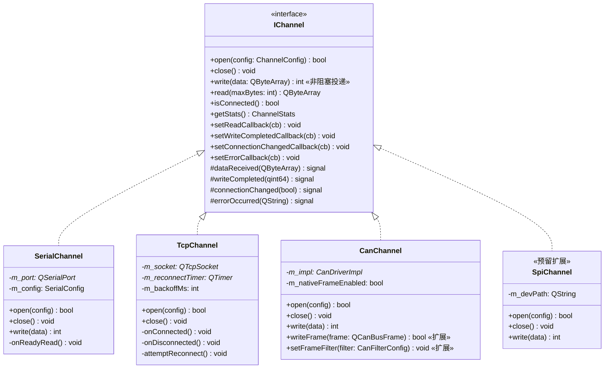
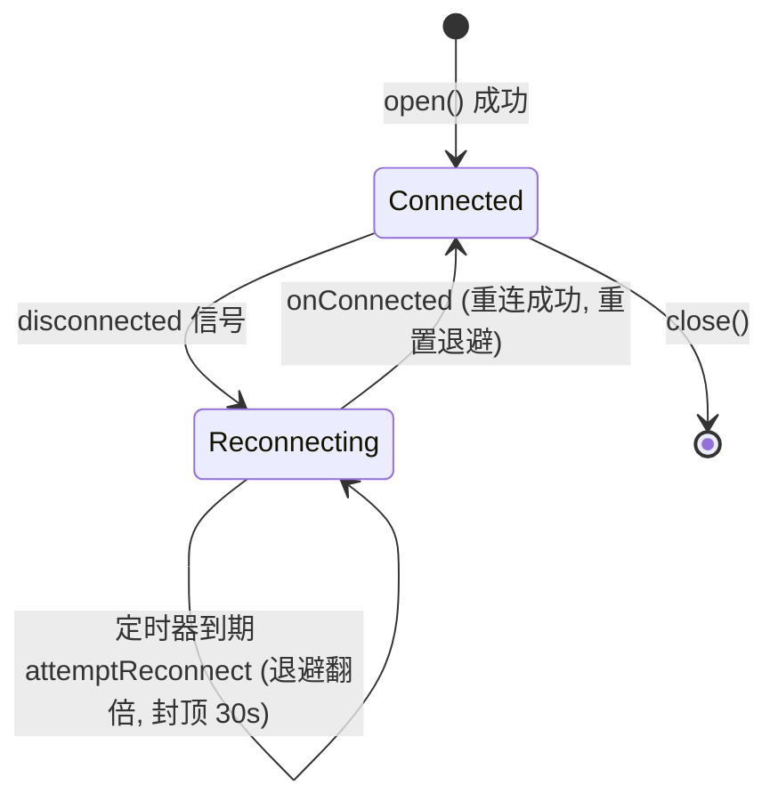
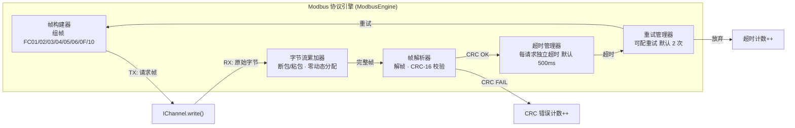
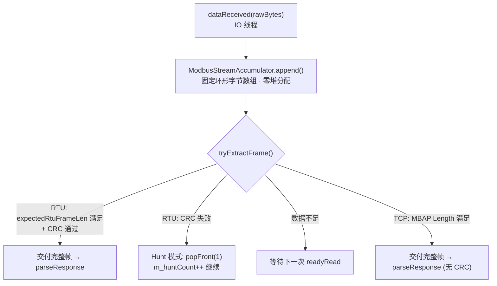
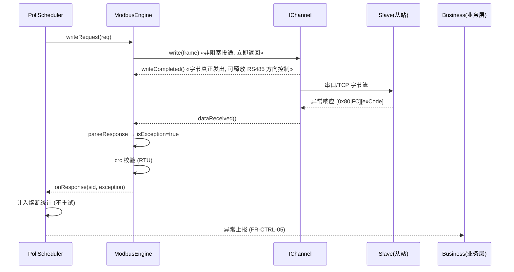
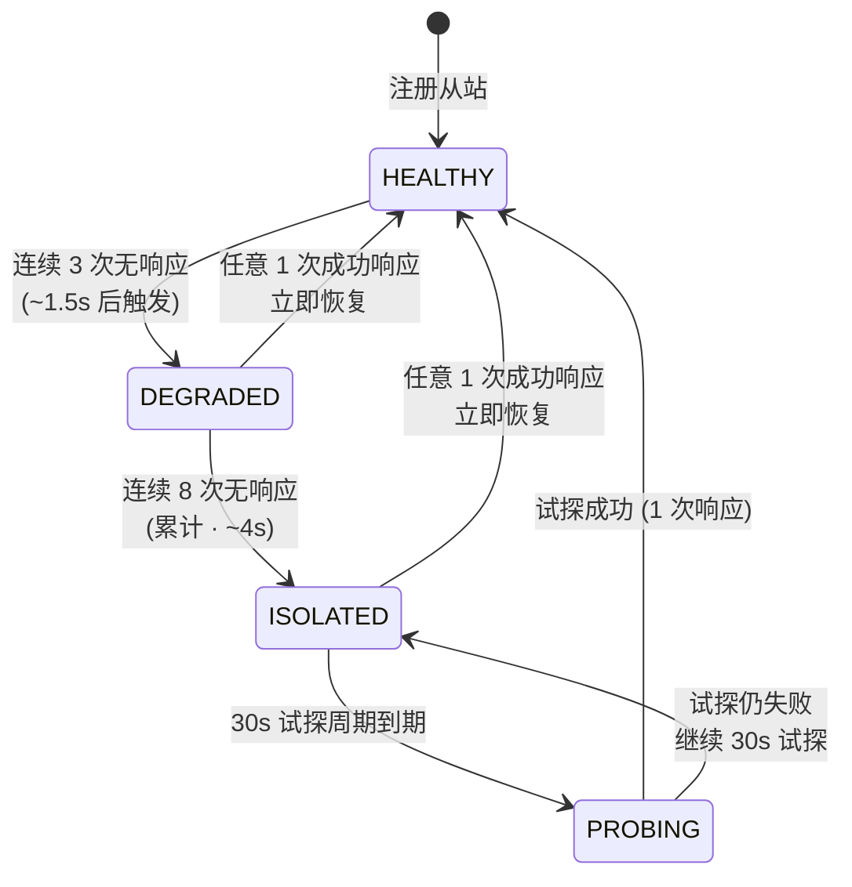
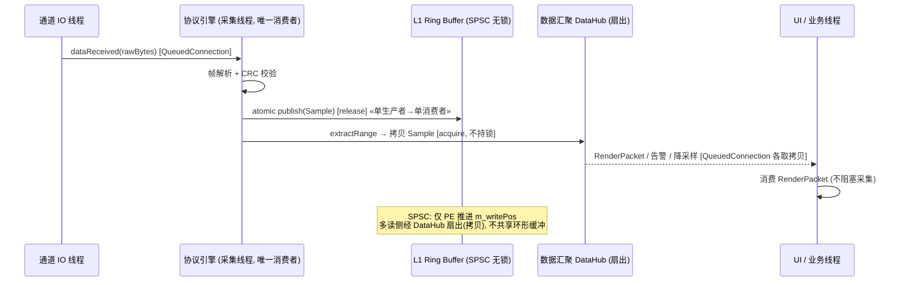

# EnerSentry 储能上位机系统 —— 协议引擎设计说明

> **文档编号**：ENS-PEDS-001  
> **版本**：V1.0  
> **日期**：2026-08-11  
> **状态**：正式发布  
> **编制依据**：
> - 《EnerSentry-储能上位机系统-概要设计说明书 V1.5》（ENS-HLD-001）
> - 《EnerSentry-储能上位机系统-软件需求规格说明书 V1.1》（ENS-SRS-001）
> - 《EnerSentry-通信接入设计说明 V1.5.3》（CADS）
> - 《EnerSentry-接口控制文档 / 接口设计说明 V1.14》（ICD/IDD）
> - 《EnerSentry-线程模型与并发设计专题报告 V1.0》（ENS-CONC-001）
> - 《EnerSentry-非功能保障设计说明 V1.2》《EnerSentry-工业上位机实战项目蓝图 v2.0》
> **所属层次**：L1 通信接入层 + L2 协议处理层（协议引擎接入相关部分）  
> **对应需求**：SRS COMM-01~15、NFR-PERF-02/11、NFR-REL-02/03/05、NFR-PORT-03、FR-DG-02、FR-CTRL-05、FR-DIAG-04

---

## 文档修订记录

| 版本 | 日期 | 修订人 | 修订内容 |
|------|------|--------|---------|
| V1.0 | 2026-08-11 | 通信/后端架构师 | 初始版本。覆盖 IChannel 接入层抽象、Modbus 编解码引擎、PollScheduler 轮询调度与 RS485 三级熔断、ChannelStats 滑动窗口诊断、线程模型与无锁数据流、关键 C++17 类骨架。预留 SPI/CAN 扩展位 |

---

## 目录

1. [引言与设计目标](#1-引言与设计目标)
2. [底层通信抽象 (IChannel)](#2-底层通信抽象-ichannel)
3. [Modbus 编解码引擎设计 (ModbusEngine)](#3-modbus-编解码引擎设计-modbusengine)
4. [轮询调度器 (PollScheduler) 详细设计](#4-轮询调度器-pollscheduler-详细设计)
5. [通信质量统计与诊断 (ChannelStats)](#5-通信质量统计与诊断-channelstats)
6. [并发与线程安全模型](#6-并发与线程安全模型)
7. [关键接口与 C++ 类骨架定义](#7-关键接口与-c-类骨架定义)

---

## 1. 引言与设计目标

### 1.1 编写目的

本文档是 EnerSentry 储能上位机系统的**协议引擎设计说明（Protocol Engine Design Specification）**，在概要设计（HLD V1.5）、通信接入设计说明（CADS V1.5.3）、接口控制文档（ICD V1.14）与线程模型专题报告（CONC V1.0）的基础上，对**底层通信接入层（L1）**与**协议处理层（L2）的协议引擎子系统**做可编码落地的详细设计。

核心目标：

- 定义 `IChannel` 统一通道抽象，隔离串口 / TCP / CAN 三类物理介质，新增通道类型时协议解析代码零改动；
- 定义自研 Modbus RTU/TCP 编解码引擎（查表法 CRC-16、功能码状态机、字节流累加器），零第三方协议库依赖；
- 定义多链路轮询调度器 `PollScheduler`，严格约束 RS485 半双工串行、TCP 全双工并发、BMS 100ms 高频专线插队，并以**三级熔断状态机**隔离故障从站；
- 定义 60 秒滑动窗口通信质量统计与诊断模型；
- 定义通信 IO 线程与采集/解析线程的隔离、内存对齐与无锁数据流边界，确保 10,000+ 测点、100ms 极速包稳定接收、高频采集不丢帧。

### 1.2 设计目标与性能指标

| 架构目标 | 量化指标 | 对应 SRS/NFR | 本文落点 |
|---------|---------|--------------|---------|
| 大规模测点支撑 | 单站 ≥ 10,000 测点 | NFR-PERF-01 | 点表驱动 + 无锁 RingBuffer 热路径 |
| 高频采集不丢帧 | 100ms/帧 BMS 极速包稳定接收，0 丢帧 | NFR-PERF-02 | 独立 TCP 专线 + SPSC 零动态分配写入 |
| 高频不卡顿 | 单站 ≥ 10,000 测点 @ 100ms/1s 混合 | NFR-PERF-04/05 | 线程隔离 + 无锁热路径，CPU < 15%、内存 < 2GB |
| RS485 带宽约束 | 100ms 高频 BMS 包优先走 Modbus TCP / CAN | NFR-PERF-11 | §4 调度模型 + 高频专线插队 |
| 通信容错与故障隔离 | 故障从站不影响整条总线 | NFR-REL-05 | §4.3 三级熔断状态机 |
| 数据完整性 | CRC 失败丢弃并计数，不污染数据 | NFR-REL-03 | §3.2 查表 CRC + §3.4 累加器 |
| 断线重连 | 1s→…→30s 封顶指数退避 | COMM-09, NFR-REL-02 | §2.4 TcpChannel 退避算法 |
| 通信质量可诊断 | 质量% + 等级（优秀/一般/异常） | COMM-14/15 | §5 滑动窗口模型 |

### 1.3 设计原则

| 原则 | 内涵 | 落地体现 |
|------|------|---------|
| **分层解耦 + 抽象隔离** | 上层协议引擎只依赖 `IChannel` 字节流接口，禁止直接调用 `QSerialPort`/`QTcpSocket`/CAN SDK | `ChannelFactory` 依赖倒置；`ens::channel` 编译为 SHARED，符号经 `ENS_CHANNEL_API` 导出 |
| **事件驱动、绝不阻塞** | 调度线程/IO 线程绝不因 `usleep`/等待响应而阻塞；帧间隔由硬件/驱动级保证 | §2.1 `write` 非阻塞 hand-off + `writeCompleted` 信号；§3.1 硬件 3.5 字符帧间隔 |
| **零动态分配热路径** | 100ms 极速轮询路径禁止隐式堆分配，消除延迟抖动与碎片 | §3.4 固定环形字节数组累加器；§3.5 `std::bitset<65536>` 位图分配器 |
| **无锁优先** | 热路径（采集→L1 写入）用原子 + 内存屏障；冷路径才用 `std::mutex` | §6 `SpscRingBuffer` + `release/acquire` 语义 |
| **强类型 + 编译期守卫** | 强类型枚举、`std::variant` 配置、`alignas(16)` + `static_assert(is_always_lock_free)` | §7 全部头文件 |
| **扩展位预留** | 通道类型预留 SPI/CAN 原生帧扩展，协议引擎预留 `IProtocolEngine` 抽象 | §2.3 `ChannelType::SPI` 预留；§3.6 CAN 原生帧接口 |

### 1.4 工程环境约束

| 维度 | 约束 |
|------|------|
| 语言标准 | Modern C++17（`std::variant` / `std::optional` / `alignas(16)` / `std::atomic` / `constexpr`） |
| 核心框架 | Qt 5.15 LTS / Qt 6.x（`QSerialPort`、`QTcpSocket`、`QCanBus`、`QObject` 信号槽、`Qt::QueuedConnection`） |
| 协议 | 自研 Modbus RTU / TCP 引擎，**零第三方协议库**（如 libmodbus）依赖，查表法 CRC-16 |
| 构建 | CMake 3.16+；`ens::channel` 可 SHARED/STATIC；`ens::protocol` 为 STATIC 内联进 exe（100ms 热路径） |
| 跨平台 | Windows (MSVC) + Linux (GCC/Clang)；POSIX / Win32 通道抽象；ARM64 经 CI 交叉编译 `static_assert` 校验 |

---

## 2. 底层通信抽象 (IChannel)

### 2.1 设计定位与分层约束

通信接入层是五层架构的最底层，唯一职责是**把不同物理介质（串口 / TCP / CAN）统一抽象成字节流通道**。上层 Modbus 协议引擎只依赖 `IChannel` 接口，不感知底层介质。新增通道类型（如新增 SPI 适配、新增一种 CAN 驱动）时，只需新增一个 `IChannel` 子类并在工厂注册，**协议解析代码零改动**。

```mermaid
flowchart TB
    subgraph L2["L2 协议处理层"]
        ME["ModbusEngine<br/>RTU/TCP · CRC-16 · 功能码"]
        PS["PollScheduler<br/>多链路并发 · 半双工串行"]
    end
    subgraph L1["L1 通信接入层 (IChannel 抽象)"]
        IC["IChannel (接口)"]
        SC["SerialChannel"]
        TC["TcpChannel"]
        CC["CanChannel"]
        SC2["SpiChannel (预留)"]
    end
    subgraph HW["物理介质"]
        RS485["RS485 / RS232"]
        ETH["以太网 Modbus TCP"]
        CANBUS["CAN 总线"]
        SPIBUS["SPI (预留·本地 ADC/GPIO 扩展)"]
    end
    ME -->|"write()/read()"| IC
    PS --> ME
    IC <|.. SC
    IC <|.. TC
    IC <|.. CC
    IC <|.. SC2
    SC --> RS485
    TC --> ETH
    CC --> CANBUS
    SC2 -.-> SPIBUS
```

### 2.2 IChannel 接口契约

`IChannel` 是纯虚基类，**继承自 `QObject`**（支持跨线程 signal/slot 投递）。设计约束（对应 SRS COMM-12/13、NFR-PORT-03）：

- `open` / `close` 成对调用，`close` **必须幂等**（二次调用不抛异常、不重复释放，RAII 保证）。
- `write` 为**非阻塞投递（hand-off）**：仅把帧拷贝进通道发送队列 / OS 缓冲即返回，物理发送完成经 `writeCompleted` 信号异步上报；**调用线程（调度线程）不因此阻塞**。RS485 半双工场景下由上层 `PollScheduler` 用"总线忙"状态机保证串行，而非靠 `write` 内部阻塞。
- `read` 为非阻塞读取，返回当前内核缓冲区可用数据；**帧完整性判定由协议引擎负责**（见 §3.4 累加器）。
- `setReadCallback` 注册异步读回调，数据到达时在**通道 IO 线程**触发，回调内**禁止长时间阻塞**。
- `setWriteCompletedCallback` 注册发送完成回调，字节真正写到底层设备后触发，用于释放 RS485 方向控制（DE/RE）。
- 所有统计字段使用 `std::atomic`，支持跨线程安全读取。

> **与 ICD V1.14 的差异说明**：ICD §2.1 原始版本将 `write` 描述为"同步阻塞写入"。在 CADS V1.5.1 中已修正为**非阻塞投递 + `writeCompleted` 异步信号**，以解决"调度线程在 RS485 半双工等待发送完成时阻塞整条总线"的隐患。本文档以**最新 CADS V1.5.3 口径**为准；接口扩展点 `setWriteCompletedCallback` / `writeCompleted` 信号即为该修正产物。



### 2.3 三类通道实现 + SPI/CAN 扩展位

各通道子类在**独立 IO 线程**中跑 Qt 事件循环（`QSerialPort` / `QTcpSocket` / `QCanBusDevice` 内部已基于事件循环），通过 `dataReceived` 信号把原始字节投递给协议引擎。

**实现要点**：

- **SerialChannel**：持有 `QSerialPort*`，`open` 时按 `SerialConfig` 设置波特率/数据位/停止位/校验位，并通过原生句柄配置**驱动级 3.5 字符帧静默检测**（见 §2.3.1）；`onReadyRead()` 内读取并 `emit dataReceived()`。`close()` 先 `m_port->close()` 再 `deleteLater()`，保证幂等。RS485 方向控制（DE/RE）由 UART 硬件 `TIOCSRS485` ioctl（Linux）/ RTS-ON-SEND（Windows）在发送结束后自动拉回接收态，调度线程不 sleep。
- **TcpChannel**：持有 `QTcpSocket*` + `QTimer*`（重连定时器）；监听 `connected` / `disconnected` / `readyRead`；断线时进入指数退避重连（见 §2.4）。
- **CanChannel**：平台相关驱动通过 `CanDriverImpl` 多态隔离——Linux 用 `SocketCanDriver`（`socket()`+`bind()`+`read()`/`write()`），Windows 用 `ZlgCanDriver`（周立功 CAN 卡 SDK）。上层仅依赖 `CanChannel` 接口。
  - **CAN 原生帧扩展预留（CADS V1.5.3）**：当前 `IChannel` 抽象为字节流，对 Modbus over CAN 或透明传输足够。但未来若扩展 CANopen / J1939 等基于 CAN ID/IDE/RTR 的协议，纯字节流会丢失帧头元数据。故 `CanChannel` 内部预留原生 CAN Frame 接口：`writeFrame(const QCanBusFrame&)`、`setFrameFilter(const CanFilterConfig&)`。**不破坏 L1 字节流抽象**：默认关闭（`m_nativeFrameEnabled=false`），需要元数据时由配置显式开启。
- **SpiChannel（预留扩展位）**：`ChannelType::SPI` 为架构预留枚举值（见 §7.1）。用于本地 ADC / GPIO 扩展芯片（如电池包级模拟量采集），走 Linux `spidev` / Windows 厂商 SDK。当下不实现，仅占位以保证 `enum class ChannelType` 的稳定 ABI——未来新增时不会改写既有 case 分支。

> **扩展位设计原则**：通道类型的扩展不应破坏既有 `switch(cfg.type)` 或工厂注册表 ABI。新增 `SPI` 仅增加一个 `enum class ChannelType` 枚举项 + 一个占位子类；`ChannelFactory::create()` 的 `default` 分支返回 `nullptr`，调用方判空即可，不影响 SerialChannel / TcpChannel / CanChannel 的行为。

### 2.3.1 SerialChannel::open() 的 3.5 字符帧静默检测配置

`QSerialPort` 未直接暴露 inter-character timeout 接口，因此 `SerialChannel::open()` 在设置完波特率/数据位/停止位/校验位后，必须**通过原生句柄**配置驱动级读间隔超时，确保 Modbus RTU 的 3.5 字符帧边界由操作系统/驱动检测，而非用户态定时器。

```cpp
// src/channel/SerialChannel.cpp 中 open() 的 OS 相关片段

static int interFrameDelayUs(int baudRate, int dataBits, int stopBits, QString parity) {
    // 1 字符时间 = (数据位 + 校验位 + 停止位) / 波特率，单位秒
    int bitsPerChar = dataBits + (parity == "N" ? 0 : 1) + stopBits;
    return static_cast<int>((bitsPerChar * 3500000LL) / baudRate);  // 3.5 字符，单位 us
}

bool SerialChannel::open(const SerialConfig& cfg) {
    m_port->setPortName(cfg.portName);
    m_port->setBaudRate(cfg.baudRate);
    m_port->setDataBits(static_cast<QSerialPort::DataBits>(cfg.dataBits));
    m_port->setStopBits(static_cast<QSerialPort::StopBits>(cfg.stopBits));
    m_port->setParity(parseParity(cfg.parity));

    if (!m_port->open(QIODevice::ReadWrite)) return false;

    const int delayUs = interFrameDelayUs(cfg.baudRate, cfg.dataBits, cfg.stopBits, cfg.parity);

#if defined(Q_OS_LINUX)
    // Linux: 通过 termios 设置 VMIN=0, VTIME=1（以 0.1s 为单位）
    // 实际要求：VTIME 应 ≥ 3.5 字符时间，向上取整到 0.1s 粒度。
    // 例：115200,N,8,1 时 3.5 字符 ≈ 304us，取 VTIME=1 即 100ms 足够且安全。
    int fd = m_port->handle();
    struct termios tio;
    if (tcgetattr(fd, &tio) == 0) {
        tio.c_cc[VMIN]  = 0;  // 最小读取 0 字节
        int vtime = std::max(1, (delayUs + 99999) / 100000);  // 向上取整到 0.1s
        tio.c_cc[VTIME] = static_cast<cc_t>(vtime);
        tcsetattr(fd, TCSANOW, &tio);
    }

    // RS485 方向控制：发送完成后硬件自动切换 DE/RE，并插入 ≥3.5 字符静默
    struct serial_rs485 rs485conf{};
    rs485conf.flags = SER_RS485_ENABLED | SER_RS485_RTS_ON_SEND | SER_RS485_RTS_AFTER_SEND;
    rs485conf.delay_rts_after_send = delayUs;  // 内核在 RTS 切回接收前插入的静默时间
    ioctl(fd, TIOCSRS485, &rs485conf);

#elif defined(Q_OS_WIN)
    // Windows: 通过 COMMTIMEOUTS 设置 ReadIntervalTimeout（毫秒）
    // 115200,N,8,1 时 3.5 字符 ≈ 0.304ms；保守取 2ms~4ms，确保帧边界可靠。
    HANDLE h = reinterpret_cast<HANDLE>(m_port->handle());
    COMMTIMEOUTS timeouts{};
    DWORD intervalMs = static_cast<DWORD>(std::max(2, (delayUs * 10) / 1000)); // 约 3.5 字符的 10 倍，最低 2ms
    timeouts.ReadIntervalTimeout         = intervalMs;
    timeouts.ReadTotalTimeoutConstant    = 0;
    timeouts.ReadTotalTimeoutMultiplier  = 0;
    timeouts.WriteTotalTimeoutConstant   = 0;
    timeouts.WriteTotalTimeoutMultiplier = 0;
    SetCommTimeouts(h, &timeouts);

    // Windows RS485 方向控制：RTS-ON-SEND
    // 通过 DCB 的 fRtsControl 或在 write() 前显式 SetCommMask/EV_RTS 配合硬件。
    // 具体实现取决于 UART 转 RS485 芯片（如 MAX13487/SP3485）的自动方向还是 GPIO 方向。
#endif

    return true;
}
```

> **关键约束**：`ReadIntervalTimeout` / `VTIME` 的作用是"两字节间超过该时间即触发 `readyRead`"，协议引擎在收到此次 `readyRead` 后再检查累计缓冲区是否满足完整帧 + CRC。若仍出现粘包，由 `ModbusStreamAccumulator`（§3.4）二次切分。**任何情况下不得在应用层用 `usleep`/`QTimer` 模拟 3.5 字符静默**。

### 2.4 指数退避重连逻辑（TcpChannel）

TCP 断线（`QTcpSocket::disconnected`）触发指数退避重连（COMM-09, NFR-REL-02）：序列 **1s → 2s → 4s → 8s → 16s → 30s（封顶）→ 30s…**。



```cpp
// TcpChannel 指数退避重连核心算法 (依据 HLD 3.1.4 / CADS §4.1)
void TcpChannel::attemptReconnect() {
    // m_backoffMs 已在 ctor 初始化为 reconnectBaseMs(1000)
    if (m_backoffMs < m_reconnectMaxMs /*30000*/) {
        m_backoffMs = std::min(m_backoffMs * 2, m_reconnectMaxMs);
        if (m_backoffMs == 0) m_backoffMs = m_reconnectBaseMs;   // 首次 1s
    }
    m_reconnectTimer->start(m_backoffMs);
    emit connectionChanged(false);   // 通知上层链路离线 (进入"重连中")
}

void TcpChannel::onConnected() {
    m_backoffMs = 0;                 // 重连成功, 重置退避
    emit connectionChanged(true);    // 通知上层链路恢复
}
```

**工业增强建议**：

- **重连抖动（Jitter）**：为避免多链路"同步重连风暴"，在退避间隔上叠加 ±10% 随机抖动，分散重连峰值。
- **inFlight 清理**：TCP 断连时，`PollScheduler` 必须先按 §4.5 强制清空该链路 `inFlight` 表，并将所有在途请求按失败上报（触发对应从站熔断统计），避免断连残留导致 Transaction ID 错配（见 §4.5）。
- **定时器归属**：`QTimer` 必须与 `TcpChannel` 同属 IO 线程（通过 `QObject` 父子关系 + `moveToThread` 保证），禁止跨线程启停定时器。
- **幂等 close**：重连过程中若 `close()` 被调用，必须能安全中断重连定时器并释放 socket，避免"半关半连"悬空回调。

### 2.5 ChannelFactory 工厂模式

上层协议引擎不直接 `new` 具体通道，而是通过 `ChannelFactory::create()` 按配置构造，实现**依赖倒置**：协议层只持有 `unique_ptr<IChannel>`。

```cpp
// ChannelFactory::create() 权威实现（依据 ICD §2.3 / CADS §1.4）
std::unique_ptr<IChannel> ChannelFactory::create(const ChannelConfig& cfg) {
    // 插件化扩展点优先：已注册的自定义类型直接委派 creator
    if (auto it = s_registry.find(cfg.type); it != s_registry.end())
        return it->second();

    switch (cfg.type) {
        case ChannelType::Serial:  return std::make_unique<SerialChannel>();
        case ChannelType::TCP:     return std::make_unique<TcpChannel>();
        case ChannelType::CAN:     return std::make_unique<CanChannel>();
        case ChannelType::SPI:     return nullptr;   // 预留扩展位：当前未实现，调用方判空
        default:                   return nullptr;
    }
}
```

`ChannelFactory` 额外提供 `registerChannel(type, creator)` 静态注册表，支持以插件形式注入自定义通道（如现场私有协议网关），无需改动 `create()` 主流程（CADS §1.4）。

---

## 3. Modbus 编解码引擎设计 (ModbusEngine)

### 3.1 协议引擎架构

Modbus 协议引擎（对应 COMM-01~09）由四类组件协作：**帧构建器（FrameBuilder）**、**帧解析器（FrameParser）**、**超时管理器（TimeoutMgr）**、**重试管理器（RetryMgr）**。



### 3.2 帧格式剖析

#### RTU 帧格式（串口，含 CRC-16/MODBUS）

| 字段 | 字节 | 说明 |
|------|------|------|
| 从站地址 | 1 | 1~247 |
| 功能码 | 1 | 0x01~0x10 |
| 数据区 | N | 寄存器地址 + 数量 / 数据 |
| CRC-16 | 2 | 低字节在前，高字节在后（多项式 0xA001，初值 0xFFFF） |

#### TCP 帧格式（MBAP 头，无 CRC）

| 字段 | 字节 | 说明 |
|------|------|------|
| Transaction ID | 2 | 请求/响应配对标识（16-bit，位图分配见 §4.5） |
| Protocol ID | 2 | 固定 0x0000 |
| Length | 2 | 后续字节数 |
| Unit ID | 1 | 从站地址 |
| PDU | N | 功能码 + 数据（同 RTU，但**无 CRC**） |

> **关键差异**：RTU 帧靠 3.5 字符时间间隔（约 3.5ms @ 115200）做帧边界切分；TCP 帧靠 MBAP 的 `Length` 字段精确切分，因此 TCP 模式**不计算也不传输 CRC**。

> **⚠ 工程隐患与正确做法（CADS V1.5.1 / §2.3.1）**：严禁用用户态定时器（`usleep` / `QTimer::singleShot` / `std::this_thread::sleep_for`）来"产生"或"检测" 3.5 字符帧间隔。正确做法：
> 1. **接收端帧切分（RX）**：通过原生句柄配置驱动级 inter-character 超时。Linux 设置 `termios.c_cc[VMIN]=0`、`c_cc[VTIME]=1`（0.1s 粒度，按波特率计算后向上取整）；Windows 设置 `COMMTIMEOUTS.ReadIntervalTimeout` 为 3.5~5 字符时间毫秒值（如 115200,N,8,1 下 2ms~4ms）。协议引擎仅在"检测到静默"后做帧完整性 + CRC 校验。具体代码模板见 §2.3.1。
> 2. **发送端帧间隙（TX）**：通过 **UART 硬件 RS485 方向控制**（`TIOCSRS485` ioctl + `delay_rts_after_send`，Linux；Windows `RTS-ON-SEND`）由硬件在发送结束后自动插入 ≥3.5 字符静默并拉回 DE/RE 接收态。**调度线程完全不 sleep**。

### 3.3 高效查表法 CRC-16 校验

采用 **CRC-16/MODBUS**（多项式 0xA001 reflected，初值 0xFFFF）。使用**编译期 `constexpr` 预计算 256 项查找表**，运行期查表计算，避免逐位运算；每条请求帧的校验仅 `len` 次查表 + 异或。所有 256 项在编译期生成，**零运行期初始化开销**。

```cpp
// src/protocol/Crc16.h —— 256 项预计算查表法 CRC-16/MODBUS
#pragma once
#include <cstdint>
#include <array>
#include <cstddef>

namespace ens::protocol {

// 单表项生成 (编译期)
constexpr uint16_t crc16ModbusEntry(uint8_t index) {
    uint16_t crc = index;
    for (int i = 0; i < 8; ++i)
        crc = (crc & 0x0001) ? static_cast<uint16_t>((crc >> 1) ^ 0xA001u)
                             : static_cast<uint16_t>(crc >> 1);
    return crc;
}

// 256 项查找表 (编译期生成)
inline constexpr std::array<uint16_t, 256> kCrc16ModbusTable = [] {
    std::array<uint16_t, 256> t{};
    for (int i = 0; i < 256; ++i) t[i] = crc16ModbusEntry(static_cast<uint8_t>(i));
    return t;
}();

/// 计算 CRC-16/MODBUS
/// @param data 数据首地址
/// @param len  数据长度 (不含 CRC 本身)
/// @return     校验值 (低字节在前，由调用方按 RTU 字节序落盘)
inline uint16_t crc16Modbus(const uint8_t* data, size_t len) {
    uint16_t crc = 0xFFFF;
    for (size_t i = 0; i < len; ++i)
        crc = static_cast<uint16_t>((crc >> 8) ^ kCrc16ModbusTable[(crc ^ data[i]) & 0xFF]);
    return crc;
}

/// 校验整帧 (frame 末尾 2 字节为 CRC, 低字节在前)
inline bool crc16ModbusVerify(const uint8_t* frame, size_t totalLen) {
    if (totalLen < 3) return false;            // 至少 addr+fc+crc
    uint16_t calc = crc16Modbus(frame, totalLen - 2);
    uint16_t recv = static_cast<uint16_t>(frame[totalLen - 2])
                  | static_cast<uint16_t>(frame[totalLen - 1] << 8);
    return calc == recv;
}

}  // namespace ens::protocol
```

**校验失败处理**（NFR-REL-03）：丢弃该帧 → `ChannelStats::crcErrorCount` 自增 → **不重试**（避免占用半双工总线），不将错误数据上送。诊断模块通过 `IChannel::getStats()` 读取 CRC 错误计数（FR-DG-02）。

### 3.4 字节流断包/粘包累加器（Stream Accumulator）

> **⚠ 工程隐患（CADS V1.5.2 修正）**：`QSerialPort::readyRead` 触发时，内核缓冲区送出的字节流是碎片化的——一条响应可能分 2 次到达，两条响应也可能粘连成一次 `dataReceived`。若直接在每个 `dataReceived` 上调用 `parseResponse`，极易把"半个帧"判定为 CRC 失败，造成误报。

> **修正策略**：在 `ModbusEngine` 接收端引入轻量级 **`ModbusStreamAccumulator`**，所有原始字节先进入累加器，只有在提取出**完整帧**后才送入 `parseResponse`；CRC 校验永远不在不完整数据上进行。

**设计要点（CADS V1.5.3 零动态分配）**：

- 内部使用**固定容量环形字节数组**（`std::array<uint8_t, 4096>` + 读写指针），`append` / `pop_front` / 缓冲区回绕均不产生任何堆分配。
- **CRC 只在完整帧上执行**：`crc16ModbusVerify` 绝不应用于不完整数据。
- **RTU 同步丢失恢复（Hunt Mode）**：当收到非法字节流（如从站重启后首字节丢失），逐字节前滑寻找下一个合法 `[unitId][function]` 边界，计数 `m_huntCount`，供诊断感知同步质量。
- **TCP 无 hunt 需求**：MBAP `Length` 精确切分，任何长度不匹配直接丢弃当前连接缓存并清空累加器（TCP 流错误通常意味着连接已乱序，应触发断连重连）。



### 3.5 功能码覆盖与组帧/解帧状态机

引擎支持 **FC01/02/03/04/05/06/0F/10** 的组帧与解帧。组帧把 `ModbusRequest` 序列化为 `QByteArray` 字节流（RTU 模式追加 CRC；TCP 模式追加 MBAP）；解帧把原始字节解析为 `std::optional<ModbusResponse>`，**解析失败返回 `std::nullopt`**（类型安全的失败表达，优于魔法数）。

**功能码处理状态机**（解帧阶段，按功能码分派 PDU 解析路径）：

```mermaid
stateDiagram-v2
    [*] --> Dispatch: parseResponse(byte_stream)
    Dispatch --> ReadResp: FC01/02/03/04<br/>[fc][byteCount][data...]
    Dispatch --> WriteSingleResp: FC05/06<br/>回显 addr+value
    Dispatch --> WriteMultiResp: FC0F/10<br/>回显 addr+qty
    Dispatch --> ExceptionResp: (fc & 0x80)<br/>[0x80|FC][exCode]
    Dispatch --> Unknown: 未知功能码<br/>Hunt 模式前滑
    ReadResp --> [*]: 返回 ModbusResponse
    WriteSingleResp --> [*]: 返回 ModbusResponse
    WriteMultiResp --> [*]: 返回 ModbusResponse
    ExceptionResp --> [*]: isException=true + 异常码
    Unknown --> [*]: std::nullopt
```

**功能码覆盖表**：

| 功能码 | 名称 | 方向 | 解帧布局要点 |
|------|------|------|------------|
| FC01 | Read Coils | 读 | `[fc][byteCount=N][coilStatus...]` |
| FC02 | Read Discrete Inputs | 读 | `[fc][byteCount=N][inputStatus...]` |
| FC03 | Read Holding Registers | 读 | `[fc][byteCount=N][regHi..regLo...]`（N = qty×2） |
| FC04 | Read Input Registers | 读 | 同 FC03 |
| FC05 | Write Single Coil | 写 | 回显 `[addr][value]`（0xFF00/0x0000） |
| FC06 | Write Single Register | 写 | 回显 `[addr][value]` |
| FC0F (15) | Write Multiple Coils | 写 | 回显 `[addr][qty]` |
| FC10 (16) | Write Multiple Registers | 写 | 回显 `[addr][qty]` |
| 0x80+FC | 异常响应 | — | `[0x80|FC][exceptionCode]` |

**异常帧处理**：Modbus 从站异常响应格式 `[unitId][0x80|FC][exceptionCode][(RTU) CRC]`。解析器识别 `function & 0x80` 即判定为异常，填充 `ModbusResponse::isException = true` 与 `exception` 字段。异常上报策略（COMM-02）：解析异常码 → 记录日志 → **不重试**（异常是确定性的协议级拒绝）→ 通过信号/回调告知业务层（如 SBO 控制失败需 UI 反馈，FR-CTRL-05）。



### 3.6 Modbus TCP Transaction ID 分配与 inFlight 残留清理

> **⚠ 工程隐患（CADS V1.5.2 修正）**：Modbus TCP 的 MBAP 头包含 **16-bit Transaction ID**（`0~65535`）。在 100ms 极速并发轮询下，自增 ID 约 **1.8 小时**回绕一次。若某次请求已超时，但其 `TransactionId` 仍残留在 `inFlight` 映射表中，后续新请求恰好复用该 ID 时，迟到的旧响应会被**错配**给新请求。此外，TCP 断线重连后若不清空 `inFlight`，残留请求会永久泄漏并占用 ID 空间。

> **修正策略**：引入 `TransactionIdAllocator`，分配时主动跳过当前仍在 `inFlight` 中的 ID；分配器将 `inFlight` 的查询结构由 `std::unordered_set<uint16_t>` 改为 **`std::bitset<65536>`**，把查询/占用时间复杂度锁定为 **O(1)**，彻底消除哈希冲突、再哈希开销与动态内存分配。并在**超时 / 断连 / 重连 / close()** 时强制清空 `inFlight` 并上报失败。

```cpp
// src/protocol/TransactionIdAllocator.h —— 16-bit Transaction ID 位图分配
#pragma once
#include <cstdint>
#include <atomic>
#include <cstdint>
#include <bitset>
#include <memory>

namespace ens::protocol {

// 16-bit Transaction ID 占用位图: O(1) 查询 / 占用, 无哈希冲突, 无动态分配
// V1.5.4: 接口统一为 allocate()/release()/clearInFlight()/isAllocated()（对齐 DevGuide §2A
//         与 ENS-LLD-100 §4.3.6 V1.5 / 实现）。废弃 V1.5.3 的 next(外部位图)+InFlightIdMap
//         两步式: fetch_add 回绕存在撞上在途 ID 的窗口, 且"取号+登记"两步之间有空窗;
//         allocate() 位图扫描最低空闲位并原子占用, 语义更优。InFlightIdMap 并入本类。
class TransactionIdAllocator {
public:
    static constexpr uint16_t INVALID_ID = 0;  // 0 保留为"无效/特殊"ID, 分配从 1 开始

    TransactionIdAllocator() : m_used(std::make_unique<std::bitset<65536>>()) {}

    // 禁用拷贝/移动（或经 unique_ptr 默认实现移动）, 避免 8 KiB 逐位拷贝
    TransactionIdAllocator(const TransactionIdAllocator&) = delete;
    TransactionIdAllocator& operator=(const TransactionIdAllocator&) = delete;
    TransactionIdAllocator(TransactionIdAllocator&&) = default;
    TransactionIdAllocator& operator=(TransactionIdAllocator&&) = default;

    // 分配 [1,65535] 中最低空闲 ID 并原子占用; 耗尽返回 INVALID_ID
    uint16_t allocate() noexcept {
        for (uint32_t id = 1; id <= 65535; ++id) {   // uint32_t 防 16-bit 回绕死循环
            if (!m_used->test(id)) { m_used->set(id); return static_cast<uint16_t>(id); }
        }
        return INVALID_ID;
    }

    void release(uint16_t id) noexcept {          // 释放 ID 使其可复用（0 忽略）
        if (id != INVALID_ID) m_used->reset(id);
    }

    void clearInFlight() noexcept { m_used->reset(); }  // 断链/重连时清空在途

    bool isAllocated(uint16_t id) const noexcept {      // 响应路由二次校验用
        return id != INVALID_ID && m_used->test(id);
    }

private:
    std::unique_ptr<std::bitset<65536>> m_used;   // 8 KiB 位图置于堆上; 0=空闲 1=已分配
};

}  // namespace ens::protocol
```

**inFlight 残留清理策略**：

| 触发场景 | 清理动作 | 上层影响 |
|---------|---------|---------|
| 请求超时 | `txIdAllocator.release(tid)` + 清空请求上下文，`onResponseReceived(sid, false)` | 该从站超时计数++，触发熔断 |
| 收到响应 | 按 tid 命中配对 → `release(tid)` + 清空请求上下文，路由交付 | 正常；未命中视为野响应丢弃 |
| TCP disconnected / 重连前 | `txIdAllocator.clearInFlight()` + 遍历所有有效项 `onResponseReceived(sid, false)` | 所有在途从站按超时处理，链路离线 |
| `close()` 被调用 | 同上清空（`clearInFlight()`） | 资源释放，避免悬空回调 |

**关键原则**：`inFlight` 表的生命周期与 **TCP 连接** 绑定，而不是与 `PollScheduler` 绑定。连接断开意味着所有在途请求语义上已失败，必须清空，不能等它们"自然超时"。

---

## 4. 轮询调度器 (PollScheduler) 详细设计

### 4.1 核心矛盾：半双工 vs 全双工

RS485 为**半双工总线**，同一总线上必须严格串行"请求 → 等待响应 → 下一请求"；而 100ms 高频 BMS 极速包与 1s 辅机包共享总线时会产生带宽冲突（NFR-PERF-11）。带宽约束计算（HLD 3.1.3）：

```
RS485 链路有效吞吐估算（115200 bps）：
  - 理论带宽: 115200 / 8 = 14,400 字节/秒
  - 协议开销: RTU 帧头(1B) + FC(1B) + CRC(2B) = 4B/帧
  - 轮询效率: 约 70%
  - 有效吞吐: ≈ 10,000 字节/秒

单次轮询耗时（FC03 读 10 寄存器）：
  - 请求帧 8B ≈ 0.7ms；响应帧 25B ≈ 2.2ms；帧间隔 3.5 字符 ≈ 0.3ms；
    从站响应延迟 5~20ms → 单次总耗时 ≈ 10~25ms

100ms 周期内最多轮询: 100ms / 25ms = 4 次
  → 单条 RS485 链路 100ms 内最多 4 从站 × 10 寄存器 = 40 寄存器

结论: 100ms 高频 BMS 核心包不可依赖纯 RS485 链路
      → BMS 快包优先走 Modbus TCP (全双工, 无半双工限制)
      → RS485 链路仅承载 1s 周期辅机/电表数据
```

### 4.2 调度模型总览

```mermaid
graph TB
    subgraph PS["轮询调度器 PollScheduler"]
        LinkMgr["链路管理器<br/>每条物理链路独立调度"]
        subgraph "RS485 链路 (半双工 · 串行 FIFO 队列)"
            RTUQueue["RTU 轮询队列<br/>严格 FIFO 串行<br/>请求→等待响应→下一请求"]
        end
        subgraph "TCP 链路 (全双工 · 并发)"]
            TCPConcurrent["TCP 并发调度<br/>不同从站可同时请求<br/>每从站独立超时 + TransactionId 配对"]
        end
        subgraph "高频专用通道"
            BMSFast["BMS 极速包通道<br/>独立 TCP 连接<br/>100ms 固定周期<br/>HIGHEST 优先级"]
        end
        PriorityMgr["优先级调度器<br/>HIGH(控制) > NORMAL(BMS) > LOW(辅机)"]
    end
    LinkMgr --> RTUQueue
    LinkMgr --> TCPConcurrent
    LinkMgr --> BMSFast
    PriorityMgr --> LinkMgr
```

**调度规则**：

| 规则 | 说明 | 对应需求 |
|------|------|---------|
| 链路隔离 | 每条物理链路（串口/TCP 连接）拥有独立调度队列，互不阻塞 | NFR-REL-05 |
| RS485 串行 | 同一 RS485 总线上严格 FIFO：发请求→等响应/超时→发下一请求 | COMM-05 |
| TCP 并发 | 不同 TCP 从站的请求可并发发出，各自管理超时 | COMM-07 |
| 高频优先 | BMS 100ms 极速包走独立 TCP 通道，不与 1s 辅机包争用带宽 | NFR-PERF-11 |
| 优先级插队 | 同一链路内，高优先级（控制写寄存器 / 告警复位）可插队 | FR-CTRL-05 |
| 超时保护 | 每个请求独立计时（IO 线程定时器），超时后放弃并记录，不阻塞后续 | NFR-REL-05 |

### 4.3 RS485 三级熔断/降级状态机（重点）

#### 4.3.1 隐患分析

RS485 半双工带宽计算未约束"故障从站拖垮整条总线"。若某从站接线松动，常规容错为"请求→等 500ms→重试 2 次 = 1.5s"，正常从站 1s 周期被迫阻塞 1.5s。**最坏情况**：4 个故障从站串行消耗，单条总线 6s 内无法完成正常轮询，实时性断崖崩塌。

#### 4.3.2 四级状态机（HEALTHY / DEGRADED / ISOLATED / PROBING）

每个从站独立维护熔断状态。本文档按任务要求显式展开 **PROBING** 为独立状态（与 CADS/ICD 中将 PROBING 折叠进 ISOLATED 的内部实现一致，但对外状态枚举显式包含 `PROBING = 3` 以便诊断 UI 精确呈现"探测中"）。



**四级状态定义**：

| 状态 | 触发条件 | 轮询策略 | 总线/CPU 开销 |
|------|---------|---------|--------------|
| **HEALTHY（健康）** | 初始 / 收到任何成功响应 | 正常周期（按 `pollIntervalMs` 调度） | 100% |
| **DEGRADED（降级）** | 连续 3 次无响应 | 降级周期 × 3（默认 1s → 3s） | 33% |
| **ISOLATED（隔离）** | 连续 8 次无响应（DEGRADED 再 5 次） | 30s 试探一次 | 3% |
| **PROBING（探测）** | ISOLATED 满 30s 后一次试探 | 单次试探 + 1s 静默期 | < 1% |

> **PROBING 语义说明**：PROBING 不是"新的一轮轮询"，而是 ISOLATED 状态下每 30s 触发的**单次治愈性探测**。探测成功 → 回 HEALTHY 并恢复原始周期；探测失败 → 回到 ISOLATED 重新计时 30s。诊断 UI 将 PROBING 显示为呼吸态（区别于 ISOLATED 的红色常亮）。

**核心收益**（以 4 从站、1 故障为例）：

| 场景 | 无熔断 | 熔断后 |
|------|--------|--------|
| 故障从站超时 | 每次 1.5s × 故障从站 | 30s 才试探一次（1.5s / 30s ≈ 5%） |
| 正常从站延迟 | 1s 周期被拖到 6s | 仍维持 1s 周期 |
| 总线有效带宽 | 故障期仅 16% | 故障期仍 75% |
| 故障恢复 | 始终占总线 | 试探成功立即自动恢复（< 1s） |

#### 4.3.3 C++ 伪代码实现

```cpp
// protocol/PollScheduler.cpp —— RS485 从站三级熔断控制 (含 PROBING 显式状态)
enum class SlaveHealth : uint8_t {
    HEALTHY  = 0,   // 正常轮询（原始周期）
    DEGRADED = 1,   // 降级轮询（3× 周期，失败 3-7 次）
    ISOLATED = 2,   // 隔离（30s 探测一次，失败 ≥ 8 次）
    PROBING  = 3    // 隔离后单次试探（ISOLATED 满 30s 触发）
};

struct SlavePollState {
    int      consecutiveFailures = 0;
    int      consecutiveSuccesses = 0;
    SlaveHealth health = SlaveHealth::HEALTHY;
    qint64   lastProbeTimeMs = 0;       // 上次试探时间
    qint64   lastResponseTimeMs = 0;    // 上次成功响应时间
    int      originalIntervalMs = 1000; // 原始轮询周期
    int      currentIntervalMs = 1000;  // 当前轮询周期（动态）
};

void PollScheduler::onResponseReceived(SlaveId sid, bool success) {
    SlavePollState& s = m_slaveStates[sid];
    if (success) {
        s.consecutiveFailures = 0;
        s.consecutiveSuccesses++;
        s.lastResponseTimeMs = now();
        if (s.health != SlaveHealth::HEALTHY) {
            s.health = SlaveHealth::HEALTHY;
            s.currentIntervalMs = s.originalIntervalMs;
            emit slaveRecovered(sid);   // 任意成功响应 → 立即恢复
        }
    } else {
        s.consecutiveSuccesses = 0;
        s.consecutiveFailures++;
        if (s.consecutiveFailures >= 3 && s.consecutiveFailures < 8) {
            if (s.health == SlaveHealth::HEALTHY) {
                s.health = SlaveHealth::DEGRADED;
                s.currentIntervalMs = s.originalIntervalMs * 3;   // 降级 3 倍
                emit slaveDegraded(sid, s.consecutiveFailures);
            }
        } else if (s.consecutiveFailures >= 8) {
            s.health = SlaveHealth::ISOLATED;
            s.currentIntervalMs = 30000;                          // 30s 试探
            s.lastProbeTimeMs = now();
            emit slaveIsolated(sid, s.consecutiveFailures);
        }
    }
    recomputeNextPollTime(sid);   // 重算下次轮询时间
}

void PollScheduler::enterProbingIfDue(SlaveId sid) {
    SlavePollState& s = m_slaveStates[sid];
    if (s.health == SlaveHealth::ISOLATED &&
        now() - s.lastProbeTimeMs >= 30000) {
        s.health = SlaveHealth::PROBING;
        s.lastProbeTimeMs = now();
        emit slaveProbing(sid);            // 触发单次探测包下发
    }
}

qint64 PollScheduler::getNextPollDelayMs(SlaveId sid) {
    const SlavePollState& s = m_slaveStates[sid];
    if (s.health == SlaveHealth::ISOLATED) {
        qint64 sinceLastProbe = now() - s.lastProbeTimeMs;
        return std::max<qint64>(0, 30000 - sinceLastProbe);
    }
    if (s.health == SlaveHealth::PROBING) {
        return 0;   // 立即下发探测包
    }
    return s.currentIntervalMs;
}
```

**状态信号契约**（ICD §2.5）：`PollScheduler` 暴露 `slaveDegraded(sid, n)` / `slaveIsolated(sid, n)` / `slaveRecovered(sid)` / `slaveProbing(sid)` 信号，推送给通信诊断模块（FR-DIAG-04），UI 用颜色呈现：绿=HEALTHY，黄=DEGRADED+失败次数，红=ISOLATED/PROBING+失败次数，恢复后 1s 内刷新为绿。

### 4.4 高频包插队机制（BMS 100ms 极速包）

**BMS 100ms 极速包独立 TCP 通道**：BMS 核心包走独立 Modbus TCP 连接（全双工、独立线程、HIGHEST 优先级），**不与 1s 辅机包争用 RS485 带宽**（NFR-PERF-11）。

**优先级插队机制**：同一链路内维护多优先级队列，高优先级任务可插队：

| 优先级 | 内容 | 周期 |
|--------|------|------|
| **HIGH** | 控制指令写寄存器（SBO 下发、告警复位） | 事件触发，立即插队 |
| **NORMAL** | BMS 100ms 极速包（独立 TCP 专线） | 100ms |
| **LOW** | 1s 辅机/电表轮询（RS485） | 1000ms |

```cpp
// 优先级插队算法
void PollScheduler::enqueue(const PollTask& task) {
    LinkState& link = m_links[task.linkId];
    if (task.isControlCommand) {
        link.highPriorityQueue.push_front(task);   // 控制指令插队到队首
    } else if (task.priority == PollPriority::High) {
        link.normalQueue.push_front(task);          // BMS 极速包置常规队首
    } else {
        link.normalQueue.push_back(task);           // 常规 FIFO
    }
}
```

> **设计收益**：控制指令写寄存器（如分闸、复位）在 100ms 内优先下发，满足 FR-CTRL-05 执行反馈实时性要求，不被常规轮询排队阻塞。

### 4.5 RS485 半双工严格 FIFO 串行调度 + TCP 并发

**RS485（事件驱动，调度线程绝不阻塞）**：

```
算法: scheduleRtuLink(link):
    onBusFree(link):                         // 总线空闲(初始 / 上一帧闭合)时触发
        if link.queue 为空: return
        slave = link.queue.dequeue()         // FIFO
        link.busy = true                     // 占用半双工总线
        channel.write(frame)                 // 非阻塞投递, 立即返回(不 sleep)
        armDeadline(link, responseTimeoutMs) // IO 线程内独立超时计时器

    onWriteCompleted(link):                  // writeCompleted 信号: 物理发送结束
        // RS485 方向控制(DE/RE)已由 UART 硬件在发送结束后自动拉回接收态

    onResponse(link, bytes) | onTimeout(link):
        cancelDeadline(link)
        if 收到响应 && CRC 校验通过:
            deliver(slave, parse(bytes))     // 上送协议层
        else:
            onResponseReceived(slave.id, false)  // 触发熔断统计
        link.busy = false                    // 释放半双工总线
        onBusFree(link)                      // 立即尝试下一帧(不依赖软件帧间隔)
```

**TCP（全双工并发）**：

```
算法: scheduleTcpLink(link):
    for slave in link.activeSlaves:
        if slave 当前无在途请求 && 到达其轮询周期:
            tid = link.txIdAllocator.allocate()   // O(1) 位图扫描最低空闲 ID 并原子占用
            if tid == INVALID: continue          // ID 池耗尽, 记录严重错误
            channel.write(buildTcpFrame(tid, slave.req))
            link.inflightReqs[tid] = {slave, deadline=now()+timeout}   // 登记配对
    // 定时器扫描在途请求, 超时 → release(tid); onResponseReceived(sid, false)
```

### 4.6 容错处理矩阵

| 异常场景 | 检测方式 | 处理策略 | 对应需求 |
|---------|---------|---------|---------|
| RS485 无响应 | 请求发出后超时计时器到期 | 重试 ≤ 2 次 → 放弃 → 超时计数++ → 继续下一从站 | COMM-05, NFR-REL-05 |
| CRC 校验失败 | 响应帧 CRC 不匹配 | 丢弃帧 → CRC 错误计数++ → **不重试** | COMM-03, NFR-REL-03 |
| TCP 连接断开 | `disconnected` 信号 | 启动指数退避重连 → 链路标为"重连中" → 清空 inFlight | COMM-09, NFR-REL-02 |
| 从站异常响应 | Modbus 异常码（0x80+FC） | 解析异常码 → 记录 → **不重试** → 告知业务层 | COMM-02 |
| 串口拔出 | 串口 IO 错误 | 关闭串口 → 标记链路离线 → 定时尝试重新打开 | NFR-REL-02 |
| 响应帧不完整 | 长度字段/字节计数不匹配 | 累加器等待更多数据 → 超时后丢弃 → 超时计数++ | NFR-REL-03 |

---

## 5. 通信质量统计与诊断 (ChannelStats)

### 5.1 60 秒滑动窗口统计

每条链路维护**最近 60 秒滑动窗口**统计（COMM-14/15）。基础计数器使用 ICD 权威 `ChannelStats`（全部 `std::atomic`，跨线程安全），再叠加一个**时间分桶的 60 秒滑动窗口**用于平滑质量评估。

**滑动窗口数据结构**：采用 60 个"每秒桶"（环形数组 `std::array<Bucket, 60>`，每桶覆盖 1 秒）。每次请求完成（成功/超时/CRC失败）按当前秒落入对应桶；质量/RTT 计算时仅累加最近 60 个桶，自动淘汰 60s 前的历史。

```cpp
// 每秒质量桶（环形数组，固定容量 60）
// lastUpdatedSec 标识本桶当前归属的绝对秒级时间戳，跨秒时原子清零。
// 清零采用 double-checked locking + CAS：先写计数器为 0，再 CAS 更新时间戳，
// 从而消除秒边界自旋锁，同时利用 release/acquire 保证看到新时间戳的线程必见已清零的计数器。
struct QualityBucket {
    std::atomic<uint64_t> lastUpdatedSec{0};  // 本桶最近一次写入的绝对秒级时间戳
    std::atomic<uint64_t> requestTotal{0};
    std::atomic<uint64_t> responseSuccess{0};
    std::atomic<uint64_t> timeoutCount{0};
    std::atomic<uint64_t> crcErrorCount{0};
    std::atomic<uint64_t> rttSumUs{0};        // 成功响应 RTT 累加 (微秒)
};

// 60 秒滑动窗口 (无动态分配)
class SlidingQualityEstimator {
    static constexpr size_t kWindowSec = 60;
    std::array<QualityBucket, kWindowSec> m_buckets{};

    static uint64_t nowSec() noexcept {
        using namespace std::chrono;
        return static_cast<uint64_t>(duration_cast<seconds>(steady_clock::now().time_since_epoch()).count());
    }

public:
    void onRequest()  { bucketFor(nowSec()).requestTotal.fetch_add(1, relaxed); }
    void onSuccess(uint64_t rttUs) {
        auto& b = bucketFor(nowSec());
        b.responseSuccess.fetch_add(1, relaxed);
        b.rttSumUs.fetch_add(rttUs, relaxed);
    }
    void onTimeout() { bucketFor(nowSec()).timeoutCount.fetch_add(1, relaxed); }
    void onCrcError(){ bucketFor(nowSec()).crcErrorCount.fetch_add(1, relaxed); }

    // 质量% = 窗口内成功响应 / 窗口内请求总数 × 100
    double qualityPercent() const {
        uint64_t total=0, success=0;
        const uint64_t cutoff = windowCutoff();
        for (const auto& b : m_buckets) {
            if (b.lastUpdatedSec.load(acquire) < cutoff) continue;  // 跳过窗口外旧桶
            total   += b.requestTotal.load(acquire);
            success += b.responseSuccess.load(acquire);
        }
        return total == 0 ? 100.0 : (double(success) / double(total)) * 100.0;
    }

    // 平均 RTT (微秒) = Σ(响应时间) / 成功响应数
    uint64_t avgRttUs() const {
        uint64_t sum=0, success=0;
        const uint64_t cutoff = windowCutoff();
        for (const auto& b : m_buckets) {
            if (b.lastUpdatedSec.load(acquire) < cutoff) continue;
            sum     += b.rttSumUs.load(acquire);
            success += b.responseSuccess.load(acquire);
        }
        return success == 0 ? 0 : sum / success;
    }

    QualityGrade grade() const {
        double q = qualityPercent();
        if (q >= 95.0) return QualityGrade::Excellent;  // 优秀
        if (q >= 80.0) return QualityGrade::Normal;     // 一般
        return QualityGrade::Abnormal;                   // 异常
    }

private:
    // 窗口左边界：最近 60 秒（不含边界）
    uint64_t windowCutoff() const {
        uint64_t n = nowSec();
        return n > kWindowSec ? n - kWindowSec : 0;
    }

    QualityBucket& bucketFor(uint64_t sec) {
        size_t idx = static_cast<size_t>(sec % kWindowSec);
        QualityBucket& b = m_buckets[idx];

        // 快速路径：本秒已初始化
        if (b.lastUpdatedSec.load(acquire) == sec) return b;

        // 慢速路径：秒边界切换，需原子清桶。
        // Double-checked locking + CAS：先清零计数器，再 CAS 更新时间戳。
        // 该顺序保证：任何线程若通过 acquire 看到新的 lastUpdatedSec，必然也看到已清零的计数器。
        uint64_t last = b.lastUpdatedSec.load(acquire);
        if (last != sec) {
            b.requestTotal.store(0, relaxed);
            b.responseSuccess.store(0, relaxed);
            b.timeoutCount.store(0, relaxed);
            b.crcErrorCount.store(0, relaxed);
            b.rttSumUs.store(0, relaxed);
            // 仅 CAS 成功的线程"发布"新秒；失败线程已完成一次幂等的清零，直接返回即可。
            b.lastUpdatedSec.compare_exchange_strong(last, sec, acq_rel, acquire);
        }
        return b;
    }
};

enum class QualityGrade : uint8_t { Excellent = 0, Normal = 1, Abnormal = 2 };
```

> **修正要点**：旧版 `bucketFor()` 用 `m_headTick.fetch_add(1) % 60` 选择桶，导致高并发下 60 个桶在亚秒级被轮转覆盖，破坏"60 秒滑动窗口"语义。新版改为**绝对秒级时间戳 `% 60`** 定位桶，并以 `lastUpdatedSec` 识别是否跨秒；读取侧按 `nowSec() - 60` 过滤，只累加窗口内有效桶。秒边界重置采用 **double-checked locking + CAS**：先清零计数器，再 `compare_exchange_strong` 更新时间戳，利用 release/acquire 语义保证看到新时间戳的线程必见已清零的计数器；相比 `atomic_flag` 自旋锁，消除了秒边界微秒级线程调度抖动。

> **为何保留 ICD 权威 `ChannelStats` 与滑动窗口并存**：ICD `ChannelStats` 提供全局累计原子快照（供 `getStats()` 即时返回、无锁），适合"累计成功率"类长期指标；`SlidingQualityEstimator` 提供**时间衰减的近 60 秒质量感知**，用于实时诊断与颜色等级判定。二者职责互补，均零动态分配。

### 5.2 质量算法与等级划分

```
通信质量百分比 = (成功响应数 / 请求总数) × 100%

滑动窗口 (60s) 维护字段:
    requestTotal:    窗口内请求总数
    responseSuccess: 窗口内成功响应数
    timeoutCount:    窗口内超时数
    crcErrorCount:   窗口内 CRC 错误数
    avgRTT:          平均往返时延 = Σ(响应时间) / 成功响应数 (μs)

质量等级判定:
    ≥ 95%   → 优秀 (绿色, QualityGrade::Excellent)
    80~95%  → 一般 (黄色, QualityGrade::Normal)
    < 80%   → 异常 (红色, QualityGrade::Abnormal)
```

诊断模块（FR-DG-02）每秒刷新链路质量；质量曲线（FR-DG-03）可缩放查看最近 1 小时趋势。

---

## 6. 并发与线程安全模型

### 6.1 线程拓扑与 IO / 解析隔离

采集/解析线程与 Qt 主线程严格隔离（HLD 第 4 章、CONC V1.0）：

- **通道底层 IO 线程**：每条通道在独立线程跑 Qt 事件循环，`QSerialPort` / `QTcpSocket` 的 `readyRead` / `connected` / `disconnected` 在本线程触发，通过 `dataReceived` 信号把原始字节投递。
- **Modbus 帧解析线程（采集线程）**：协议引擎在采集线程内完成帧解析（避免额外线程上下文切换开销），解析后的结构化 `Sample` / 寄存器值通过两条路径下行：
  1. **无锁队列（SPSC）**：采集线程 → L1 Ring Buffer，原子 `fetch_add` + `release/acquire` 屏障；
  2. **Qt 跨线程信号槽（Qt::QueuedConnection）**：事件类通知（熔断、异常、连接变更）投递到业务/UI 线程，禁止工作线程直接操作 QWidget / QCustomPlot。



### 6.2 Sample 16 字节对齐 + 原子 lock-free

解析后的测点样本 `Sample` 通过 `alignas(16)` 保证单条 CPU 指令原子读写，避免"撕裂读"：

```cpp
// datahub/Sample.h —— 显式 16 字节对齐（保证单条 CPU 指令原子读写）
#pragma once
#include <cstdint>
#include <atomic>

#if defined(_MSC_VER)
    #define ENS_CACHE_ALIGN __declspec(align(16))
#elif defined(__GNUC__) || defined(__clang__)
    #define ENS_CACHE_ALIGN __attribute__((aligned(16)))
#else
    #define ENS_CACHE_ALIGN alignas(16)
#endif

struct ENS_CACHE_ALIGN Sample {
    uint64_t timestamp;   // Unix 毫秒时间戳 (8B)
    uint32_t pointId;     // 测点 ID (4B)
    float    value;       // 采样值 (4B)
    // ─────────── 合计恰好 16 字节 ───────────
};

static_assert(sizeof(Sample) == 16,
    "Sample must be 16 bytes — required for atomic store/load on x86-64");

// 编译期强制跨平台 lock-free 守卫
// 防止 32 位 x86 / ARMv7 退化为内部互斥锁（性能暴跌 10x+）
static_assert(std::atomic<Sample>::is_always_lock_free,
    "Sample (16B aligned) is NOT lock-free on this platform! "
    "Check: x86-64 OK; 32-bit x86 / ARMv7 may fail. "
    "Fallback: shrink timestamp to uint32_t (lose sub-second precision).");
```

**内存布局**：`aligned(16)` 保证 Sample 从不跨越 16B 边界 → x86-64 上 `movaps` 单条指令完成写入 → 读线程永远不会看到"半写入"的结构体。

### 6.3 内存屏障与无锁数据流边界

**核心思想**：采集线程完成数据写入和数据"发布"是两个独立的步骤，消费者只消费"已发布"的数据。

```cpp
// 生产者侧 (仅采集线程)
bool publish(const Sample& item) {
    const size_t cap = m_buf.size();
    size_t pos = m_writePos.fetch_add(1, std::memory_order_relaxed);
    size_t consumed = m_consumedPos.load(std::memory_order_acquire);
    if (pos - consumed >= cap) {                 // 溢出：丢弃最新，禁止推进 consumed
        m_overflowCount.fetch_add(1, std::memory_order_relaxed);
        m_writePos.fetch_sub(1, std::memory_order_relaxed);
        return false;
    }
    size_t idx = pos & MASK;                     // 等价于 pos % cap (位掩码更快)
    m_buf[idx] = item;                           // ① Store (relaxed)
    std::atomic_thread_fence(std::memory_order_release);   // ② Store-Store 屏障
    m_publishedPos.store(pos + 1, std::memory_order_release);  // ③ 发布 (release)
    return true;
}

// 消费者侧 (单消费者, acquire 读; 多读侧需求由 DataHub 扇出拷贝满足)
size_t readRecent(size_t cursor, Sample* out, size_t count) {
    size_t published = m_publishedPos.load(std::memory_order_acquire);  // 安全上限
    if (published <= cursor) return 0;
    size_t readable = std::min(published - cursor, count);
    for (size_t i = 0; i < readable; ++i)
        out[i] = m_buffer[(cursor + i + 1) & MASK].load(std::memory_order_acquire);
    return readable;
}
```

**happens-before 关系**：`T2(store)` happens-before `T4(release store)`；`T4` synchronizes-with `T5(acquire load)`；∴ `T2(store)` happens-before `T6(load)`——数据完整可见，零锁。

**二级发布指针语义**：

| 指针 | 类型 | 写入者 | 读取者 | 语义 |
|------|------|-------|-------|------|
| `m_writePos` | `atomic<size_t>` | 采集线程 (relaxed) | 仅内部 | 已 `fetch_add` 但数据可能未完全写入——消费者**不可读** |
| `m_publishedPos` | `atomic<size_t>` | 采集线程 (release) | 所有消费者 (acquire) | 数据已完整可见的安全边界——消费者**可读上限** |
| `m_consumerCursors[id]` | `atomic<size_t>` | 各消费者线程 | 消费者自身 | 单消费者读游标，互不竞争 |

**零拷贝 / 低开销原则**：

- **SPSC 无锁模型**：唯一生产者是采集/解析线程，唯一消费者是数据汇聚（DataHub）线程；UI 渲染/告警/降采样三个读侧**不共享环形缓冲**，而是由 DataHub 提取后通过 `Qt::QueuedConnection` 各自拷贝投递（扇出）。
- **写入路径零动态分配**：`RingBuffer` 预分配定长 `std::array<Sample, N>`，`push` 为 O(1) 无锁。
- **溢出策略**：L1 热路径固定为 **`DropNewest`**（队列满时丢弃最新样本并原子递增 `RingBufferOverflowCount`）。在单生产者-单消费者模型中，**严禁**由生产者侧推进消费者游标来实现 `OverwriteOldest`，否则会并发篡改 `m_consumedPos`；如业务确实需要覆盖最旧，应改用序列号型 MPMC 环形队列（LMAX Disruptor 模式）。

> **⚠ 高频/高实时性风险与缓解（评审补充）**：
> 1. **`QueuedConnection` 内存开销**：IO 线程通过 `emit dataReceived(QByteArray)` 经 `Qt::QueuedConnection` 投递到解析线程时，Qt 事件队列会在堆上分配 `QEvent` 并对 `QByteArray` 做引用计数/深拷贝。在 10,000+ 测点、100ms 极速包或多路 TCP 高并发场景下，频繁事件投递可能破坏"热路径零动态分配"原则。缓解方案：对极高频 TCP 通道，可考虑**跳过 Qt 事件队列**，在 IO 线程内直接调用无锁解析器，或把原始字节写入 IO 线程与解析线程之间的**无锁字节 RingBuffer**（`SpscRingBuffer<uint8_t>` / `ModbusStreamAccumulator` 共用同一段预分配内存）。该优化保留 `IChannel` 抽象：新增 `IChannel::setRawBytesHandler(std::function<void(const uint8_t*, size_t)>)` 回调，默认走 `QByteArray + QueuedConnection`，高频通道注册裸字节处理器即可。
> 2. **`DropNewest` 对实时状态的影响**：储能 SCADA 中最新遥测（电池单体过温、遥信跳闸）具有更高实时优先级。若 DataHub 消费者因 UI 渲染重绘等偶发卡顿导致队列溢出，`DropNewest` 会丢弃最新样本，系统可能保留旧遥测状态，掩盖瞬时故障。缓解方案：① **确保 DataHub 消费者线程优先级不低于 `HIGH`**（见 §6.4 线程拓扑），并绑定独立核心避免与 UI/渲染抢占；② 对 freshness 要求极高的告警通道，可升级 L1 缓冲为序列号型 MPMC 环形队列，由生产者安全执行 `OverwriteOldest`，优先保障最新数据；③ 关键安全遥信建议走**独立高优先级队列 + 事件触发**（跳变即上报），不与普通遥测共队列。

### 6.4 线程拓扑与 CPU 亲和性

| 线程 | 优先级 | CPU 核心 | 周期 | 核心操作 | 锁策略 |
|------|--------|---------|------|---------|--------|
| UI 主线程 | NORMAL | Core 0 | 16ms (60FPS) | Qt 事件循环 + QCustomPlot 重绘 | 无锁（仅消费 RenderPacket） |
| 采集 #1 (RS485) | HIGH | Core 1 | 1s | SerialChannel 读写 + CRC | 无锁写 L1 + atomic 统计 |
| 采集 #2 (TCP BMS) | HIGHEST | Core 1 | 100ms | TcpChannel 并发 + Modbus 解析 | 无锁写 L1 |
| DataHub 汇聚 | HIGH | Core 2 | 事件 | 从 SPSC RingBuffer 提取 Sample → 扇出 UI/告警/降采样 | lock-free acquire 读 + 拷贝 |
| 告警引擎 | HIGH | Core 2 | 事件 | 阈值判定 + 黑匣子 | lock-free acquire 读 |
| SBO 状态机 | NORMAL | Core 2 | 事件 | 倒计时 + 链路监听 | QMutex（低频） |
| 持久化 | NORMAL | Core 3 | 100ms 批量 | WriteBuf swap + Batch Insert | std::mutex (swap) |
| 降采样 | LOW | Core 3 | 1s/5s/1min | 滑动窗口聚合 | lock-free acquire 读 |
| 渲染准备 | NORMAL | Core 4 | 33ms (30Hz) | L1 提取 + 画布降采样 | lock-free acquire 读 |
| 诊断 | LOW | Core 4 | 1s | 通信质量统计 | atomic 读 |

> CPU 亲和性通过 `SetThreadAffinityMask`（Win）/ `pthread_setaffinity_np`（Linux）绑定固定核心，规避 L1/L2 缓存颠簸（CONC §1.3）。

### 6.5 线程死锁防护

- **锁层级约定**：通道 IO 线程只持有通道自身资源锁，**从不反向调用**业务层/UI 层；跨层通知一律走 `Qt::QueuedConnection` 异步投递。
- **重入防护**：`onResponseReceived` 内只操作 `m_slaveStates[sid]`（按 `sid` 分片或使用细粒度锁），不调用可能回调自身的长耗时函数。
- **定时器归属**：重连定时器必须与所属对象同属 IO 线程，禁止跨线程启停。
- **幂等 close**：重连过程中 `close()` 被调用，必须能安全中断重连定时器并释放资源。

---

## 7. 关键接口与 C++ 类骨架定义

> 本章提供**直接可调用**的 C++17 头文件骨架，包含头文件防护（`#pragma once`）、`std::atomic` 标记与强类型枚举（`enum class`）。命名空间遵循既有约定：`ens::channel`（L1，SHARED）、`ens::protocol`（L2，STATIC）。符号导出宏 `ENS_CHANNEL_API` / `ENS_PROTOCOL_API` 来自 `ens/export.hpp`（CADS §1.5.1）。

### 7.1 ChannelConfig.h —— 通道配置（含 SPI 扩展位）

```cpp
// src/channel/ChannelConfig.h
#pragma once
#include "ens/export.hpp"
#include <QString>
#include <cstdint>
#include <variant>

namespace ens::channel {

// 通道类型枚举（强类型）—— SPI 为架构预留扩展位
enum class ChannelType : uint8_t {
    Serial = 0,   // RS485 / RS232 串口
    TCP    = 1,   // Modbus TCP 客户端
    CAN    = 2,   // CAN 总线 (SocketCAN / ZLG CAN)
    SPI    = 3,   // [预留扩展位] 本地 ADC/GPIO 扩展 (spidev / 厂商 SDK)
};

struct ENS_CHANNEL_API SerialConfig {
    QString portName;          // "COM3" (Win) / "/dev/ttyUSB0" (Linux)
    int     baudRate    = 115200;
    int     dataBits    = 8;
    int     stopBits    = 1;
    QString parity      = "N";   // "N"/"E"/"O"
    int     responseTimeoutMs = 500;
    // 3.5 字符帧静默时间（微秒），仅用于推导驱动级读间隔超时：
    // Linux termios VTIME / Windows COMMTIMEOUTS::ReadIntervalTimeout。
    // 严禁在代码里用此字段做 usleep/QTimer 等用户态延时。
    int     interFrameDelayUs  = 3500;
};

struct ENS_CHANNEL_API TcpConfig {
    QString host;
    uint16_t port           = 502;
    int      connectTimeoutMs  = 3000;
    int      responseTimeoutMs = 500;
    int      reconnectBaseMs   = 1000;
    int      reconnectMaxMs    = 30000;
};

struct ENS_CHANNEL_API CanConfig {
    QString interfaceName;      // "can0" / ZLG 设备索引
    int     bitrate    = 500000;
    bool    useZlgDriver = false;
};

// [预留] SPI 配置占位 —— 不实现功能, 仅保证 ABI 稳定
struct ENS_CHANNEL_API SpiConfig {
    QString devPath;            // "/dev/spidev0.0"
    int     speedHz = 1000000;
};

// 通道配置的强类型联合体 (避免 void*/union 类型不安全)
struct ENS_CHANNEL_API ChannelConfig {
    ChannelType type = ChannelType::Serial;
    std::variant<SerialConfig, TcpConfig, CanConfig, SpiConfig> params;

    template<typename T>
    T& as() { return std::get<T>(params); }
    template<typename T>
    const T& as() const { return std::get<T>(params); }

    bool isValid() const;
};

}  // namespace ens::channel
```

### 7.2 IChannel.h —— 统一通道抽象（非阻塞 hand-off 口径）

```cpp
// src/channel/IChannel.h
#pragma once
#include "ens/export.hpp"
#include "ChannelConfig.h"
#include "ChannelStats.h"
#include <QByteArray>
#include <QObject>
#include <QString>
#include <functional>
#include <memory>

namespace ens::channel {

using ReadCallback           = std::function<void(const QByteArray& data)>;
using RawBytesHandler        = std::function<void(const uint8_t* data, size_t len)>;  // 高频通道跳过 Qt 事件队列
using ConnectionChangedCallback = std::function<void(bool connected)>;
using ErrorCallback          = std::function<void(const QString& errorMessage)>;
using WriteCompletedCallback = std::function<void(qint64 bytesWritten)>;

class ENS_CHANNEL_API IChannel : public QObject {
    Q_OBJECT
public:
    IChannel(QObject* parent = nullptr) : QObject(parent) {}
    ~IChannel() override = default;

    IChannel(const IChannel&) = delete;
    IChannel& operator=(const IChannel&) = delete;
    IChannel(IChannel&&) = delete;
    IChannel& operator=(IChannel&&) = delete;

    // 生命周期（close 必须幂等）
    virtual bool open(const ChannelConfig& cfg) = 0;
    virtual void close() = 0;

    // I/O 操作
    // write 非阻塞投递: 仅入发送队列即返回, 物理发送完成经 writeCompleted 信号上报
    virtual int write(const QByteArray& data) = 0;
    virtual QByteArray read(int maxBytes = 4096) = 0;

    // 状态查询
    virtual bool isConnected() const = 0;
    virtual ChannelStats getStats() const = 0;
    virtual QString lastError() const = 0;

    // 回调注册
    virtual void setReadCallback(ReadCallback cb) = 0;
    virtual void setRawBytesHandler(RawBytesHandler cb) = 0;  // 默认空：走 dataReceived(QByteArray) + QueuedConnection
    virtual void setWriteCompletedCallback(WriteCompletedCallback cb) = 0;
    virtual void setConnectionChangedCallback(ConnectionChangedCallback cb) = 0;
    virtual void setErrorCallback(ErrorCallback cb) = 0;

signals:
    void dataReceived(const QByteArray& data);
    void writeCompleted(qint64 bytesWritten);  // 字节已写入底层设备/OS, 可释放 RS485 DE/RE
    void connectionChanged(bool connected);
    void errorOccurred(const QString& errorMessage);
};

}  // namespace ens::channel
```

### 7.3 ModbusFrame.h —— 帧定义 / 功能码 / 异常码

```cpp
// src/protocol/ModbusFrame.h
#pragma once
#include <cstdint>
#include <array>
#include <optional>
#include <vector>

namespace ens::protocol {

enum class FunctionCode : uint8_t {
    ReadCoils          = 0x01,
    ReadDiscreteInputs = 0x02,
    ReadHoldingRegs    = 0x03,
    ReadInputRegs      = 0x04,
    WriteSingleCoil    = 0x05,
    WriteSingleReg     = 0x06,
    WriteMultiCoils    = 0x0F,
    WriteMultiRegs     = 0x10,
    ExceptionOffset    = 0x80,  // 异常响应: (0x80 | 原功能码)
};

enum class ExceptionCode : uint8_t {
    IllegalFunction    = 0x01,
    IllegalDataAddr    = 0x02,
    IllegalDataValue   = 0x03,
    SlaveDeviceFailure = 0x04,
    Acknowledge        = 0x05,
    SlaveBusy          = 0x06,
    CrcError           = 0x08,  // 内部: CRC 校验失败 (本地上报用)
};

static constexpr size_t kMaxPduSize   = 253;
static constexpr size_t kMaxFrameSize = 256;

struct alignas(16) ModbusRequest {
    uint8_t      unitId{0};
    FunctionCode function{FunctionCode::ReadHoldingRegs};
    uint16_t     startAddr{0};
    uint16_t     quantity{0};
    std::array<uint8_t, kMaxPduSize> payload{};
    uint8_t      payloadLen{0};
};

struct alignas(16) ModbusResponse {
    uint8_t       unitId{0};
    FunctionCode  function{FunctionCode::ReadHoldingRegs};
    bool          isException{false};
    ExceptionCode exception{ExceptionCode::IllegalFunction};
    std::array<uint8_t, kMaxPduSize> data{};
    uint8_t       dataLen{0};
};

enum class Transport : uint8_t { Rtu = 0, Tcp = 1 };

// 组帧 / 解帧（类型安全, 失败返回 std::nullopt）
std::optional<QByteArray>     buildRequest(const ModbusRequest& req, Transport t);
std::optional<ModbusResponse> parseResponse(const uint8_t* buf, size_t len, Transport t);

}  // namespace ens::protocol
```

### 7.4 Crc16.h —— 编译期查表（见 §3.3，此处略去重复）

> 完整实现见 §3.3 `src/protocol/Crc16.h`：`kCrc16ModbusTable` 为 `constexpr` 256 项数组，`crc16Modbus` / `crc16ModbusVerify` 提供 O(len) 查表校验。

### 7.5 PollScheduler.h —— 调度器 + 三级熔断状态（含 PROBING）

```cpp
// src/protocol/PollScheduler.h (关键骨架)
#pragma once
#include <QObject>
#include <cstdint>
#include <functional>
#include <unordered_map>

namespace ens::protocol {

enum class SlaveHealth : uint8_t {
    HEALTHY  = 0,
    DEGRADED = 1,
    ISOLATED = 2,
    PROBING  = 3,   // 显式探测态 (ISOLATED 满 30s 触发)
};

struct SlaveId {
    uint32_t linkId;
    uint8_t  address;   // Modbus 从站地址 (1-247)
    bool operator==(const SlaveId& o) const {
        return linkId == o.linkId && address == o.address;
    }
};

enum class PollPriority : uint8_t { Low = 0, Normal = 1, High = 2 };

struct SlavePollState {
    int         consecutiveFailures = 0;
    int         consecutiveSuccesses = 0;
    SlaveHealth health = SlaveHealth::HEALTHY;
    qint64      lastProbeTimeMs = 0;
    qint64      lastResponseTimeMs = 0;
    int         originalIntervalMs = 1000;
    int         currentIntervalMs = 1000;
};

class PollScheduler : public QObject {
    Q_OBJECT
public:
    void onResponseReceived(SlaveId sid, bool success);
    void enterProbingIfDue(SlaveId sid);
    qint64 getNextPollDelayMs(SlaveId sid) const;
    void enqueue(const PollTask& task);

    void setSlaveHealthCallback(SlaveHealthCallback cb);

signals:
    void slaveDegraded(ens::protocol::SlaveId sid, int consecutiveFailures);
    void slaveIsolated(ens::protocol::SlaveId sid, int consecutiveFailures);
    void slaveRecovered(ens::protocol::SlaveId sid);
    void slaveProbing(ens::protocol::SlaveId sid);

private:
    std::unordered_map<SlaveId, SlavePollState, SlaveIdHash> m_slaveStates;
};

}  // namespace ens::protocol
```

> `TransactionIdAllocator` 头文件见 §3.6；`ModbusStreamAccumulator` 头文件见 CADS §2.6.6（固定环形字节数组 + 零动态分配）。

### 7.6 ChannelStats.h —— 权威原子统计 + 质量等级

```cpp
// src/channel/ChannelStats.h (依据 ICD §2.4)
#pragma once
#include "ens/export.hpp"
#include <atomic>
#include <cstdint>

namespace ens::channel {

struct ENS_CHANNEL_API ChannelStats {
    std::atomic<uint64_t> requestTotal{0};
    std::atomic<uint64_t> responseSuccess{0};
    std::atomic<uint64_t> timeoutCount{0};
    std::atomic<uint64_t> crcErrorCount{0};
    std::atomic<uint64_t> bytesSent{0};
    std::atomic<uint64_t> bytesReceived{0};
    std::atomic<int64_t>  avgRttUs{0};   // 平均往返时延 (微秒)

    double qualityPercent() const {
        uint64_t total = requestTotal.load(std::memory_order_acquire);
        if (total == 0) return 100.0;
        uint64_t success = responseSuccess.load(std::memory_order_acquire);
        return (static_cast<double>(success) / static_cast<double>(total)) * 100.0;
    }
};

}  // namespace ens::channel
```

> 60 秒滑动窗口质量估计器 `SlidingQualityEstimator` 见 §5.1（环形 `std::array<QualityBucket, 60>`，零动态分配，提供 `qualityPercent()` / `avgRttUs()` / `grade()`）。

### 7.7 SpscRingBuffer.h —— 无锁环形缓冲（采集→L1 热路径）

```cpp
// src/datahub/SpscRingBuffer.h (SPSC: 单生产者-单消费者)
#pragma once
#include <atomic>
#include <vector>
#include <cstddef>

namespace ens::datahub {

// L1 采集热路径固定为 DropNewest：
// 在 SPSC 模型中，m_consumedPos 只能由唯一消费者线程修改。
// 若生产者侧为"覆盖最旧"而强行推进 m_consumedPos，会并发篡改消费者游标，导致游标回退或数据撕裂。
// 如业务确实需要 OverwriteOldest，应改用基于序列号（Sequence-based）的 LMAX Disruptor 模式，而非 SPSC。
enum class OverflowPolicy : uint8_t { DropNewest = 0 };

template<typename T, size_t Capacity = 1024>
class SpscRingBuffer {
    static_assert(std::atomic<T>::is_always_lock_free,
                  "T must be lock-free atomic; for Sample ensure alignas(16)");
    static_assert((Capacity & (Capacity - 1)) == 0, "Capacity must be power of two");
    static constexpr size_t MASK = (Capacity - 1);

public:
    explicit SpscRingBuffer(OverflowPolicy policy = OverflowPolicy::DropNewest)
        : m_policy(policy) {}

    // 生产者侧：仅采集/解析线程调用
    bool publish(const T& sample) {
        const size_t pos = m_writePos.fetch_add(1, std::memory_order_relaxed);
        const size_t consumed = m_consumedPos.load(std::memory_order_acquire);

        // 溢出检测：队列已满则丢弃最新样本，不触碰消费者游标
        if (pos - consumed >= Capacity) {
            m_overflowCount.fetch_add(1, std::memory_order_relaxed);
            m_writePos.fetch_sub(1, std::memory_order_relaxed);  // 回滚写入序号
            return false;
        }

        m_buf[pos & MASK] = sample;                           // ① Store (relaxed)
        std::atomic_thread_fence(std::memory_order_release);  // ② Store-Store 屏障
        m_publishedPos.store(pos + 1, std::memory_order_release);  // ③ 发布
        return true;
    }

    // 消费者侧：仅 DataHub 线程调用；cursor 由调用方持有（支持多个下游各持一份 cursor）
    size_t readRecent(size_t cursor, T* out, size_t count) {
        const size_t published = m_publishedPos.load(std::memory_order_acquire);
        if (published <= cursor) return 0;
        const size_t readable = std::min(published - cursor, count);
        for (size_t i = 0; i < readable; ++i) {
            out[i] = m_buf[(cursor + i + 1) & MASK].load(std::memory_order_acquire);
        }
        return readable;
    }

    // 单一消费者推进读游标（DataHub 提取后调用）
    void consume(size_t n) {
        m_consumedPos.fetch_add(n, std::memory_order_release);
    }

    size_t available() const {
        return m_publishedPos.load(std::memory_order_acquire)
             - m_consumedPos.load(std::memory_order_acquire);
    }
    uint64_t overflowCount() const {
        return m_overflowCount.load(std::memory_order_relaxed);
    }

private:
    std::array<T, Capacity> m_buf{};
    OverflowPolicy          m_policy;
    std::atomic<size_t>     m_writePos{0};      // 生产者私有写入序号
    std::atomic<size_t>     m_publishedPos{0};  // 已发布安全边界（release）
    std::atomic<size_t>     m_consumedPos{0};   // 消费者读游标（仅消费者线程修改）
    std::atomic<uint64_t>   m_overflowCount{0};
};

}  // namespace ens::datahub
```

> **修正要点**：旧版默认 `OverflowPolicy::OverwriteOldest` 并在生产者侧 `m_consumedPos.store(...)`，这在 SPSC 中**违反游标写权限单向归属**（消费者游标只能由消费者写），会引发并发竞态。新版将 L1 热路径固定为 **`DropNewest`**，溢出时由生产者回滚 `m_writePos` 并计数，消费者游标 `m_consumedPos` 仅由 DataHub 消费者推进。若业务场景确实需要覆盖最旧，应升级为**序列号环形队列（LMAX Disruptor 模式）**，而非在 SPSC 中让生产者越权修改消费游标。

---

## 附录 A：需求追溯矩阵

| 需求 ID | 描述 | 本文对应章节 |
|---------|------|-------------|
| COMM-01~09 | Modbus 协议引擎 / 帧 / CRC / 超时 / 重试 / 半双工调度 | §3, §4.2, §4.5 |
| COMM-12/13 | 通道抽象接口（IChannel） | §2.2, §2.3 |
| COMM-14/15 | 通信质量评估（60s 滑动窗口） | §5 |
| NFR-PERF-02 | 100ms 高频 BMS 包稳定接收 | §6.1, §6.3 |
| NFR-PERF-11 | 100ms 高频 BMS 包带宽规划 + 专线插队 | §4.1, §4.4 |
| NFR-REL-02 | TCP/串口断线重连（指数退避） | §2.4 |
| NFR-REL-03 | CRC 校验失败不污染数据 | §3.3, §3.4 |
| NFR-REL-05 | 故障隔离（链路/从站独立 + 三级熔断） | §4.3, §4.6 |
| NFR-PORT-03 | 跨平台通道抽象 | §2.3, §6 |
| FR-DG-02 | 诊断读取 CRC 错误计数 / 质量% | §5 |
| FR-CTRL-05 | 控制指令执行反馈（优先级插队） | §4.4 |
| FR-DIAG-04 | 从站熔断状态 UI 联动 | §4.3.3 |
| （可扩展性） | SPI 预留 / CAN 原生帧扩展位 | §2.3, §7.1 |

## 附录 B：关键文件清单（协议引擎）

| 文件 | 所属 Target | 说明 |
|------|------------|------|
| `src/channel/IChannel.h` | `ens::channel` (SHARED) | 统一通道抽象接口（非阻塞 hand-off 口径） |
| `src/channel/ChannelConfig.h` | `ens::channel` (SHARED) | 通道配置（variant 多态 + SPI 扩展位） |
| `src/channel/ChannelStats.h` | `ens::channel` (SHARED) | 原子通信统计 |
| `src/channel/ChannelFactory.h` | `ens::channel` (SHARED) | 通道工厂 + 插件注册 |
| `include/ens/export.hpp` | 公共 | 符号导出宏 |
| `src/protocol/ModbusFrame.h` | `ens::protocol` (STATIC) | 帧结构 / 功能码 / 异常码 |
| `src/protocol/Crc16.h` | `ens::protocol` (STATIC) | CRC-16 查表法（constexpr 256 项） |
| `src/protocol/ModbusStreamAccumulator.h` | `ens::protocol` (STATIC) | RTU/TCP 字节流累加器（零动态分配） |
| `src/protocol/TransactionIdAllocator.h` | `ens::protocol` (STATIC) | TCP Transaction ID 位图分配 + inFlight 清理 |
| `src/protocol/PollScheduler.h/cpp` | `ens::protocol` (STATIC) | 多链路调度 + 三级熔断（含 PROBING） |
| `src/datahub/Sample.h` | `ens::datahub` (STATIC) | alignas(16) 原子对齐采样结构 |
| `src/datahub/SpscRingBuffer.h` | `ens::datahub` (STATIC) | 无锁环形缓冲 + 溢出策略 |

---

*本文档为 EnerSentry 储能上位机系统的协议引擎设计说明（V1.0），基于概要设计说明书 V1.5、通信接入设计说明 V1.5.3、接口控制文档 V1.14 与线程模型专题报告 V1.0 编制。所有 C++17 代码片段、Mermaid 状态机图与性能指标均与既有设计文档保持一致；SPI/CAN 扩展位已作为 ABI 稳定预留，新增通道类型时协议解析代码零改动。*
