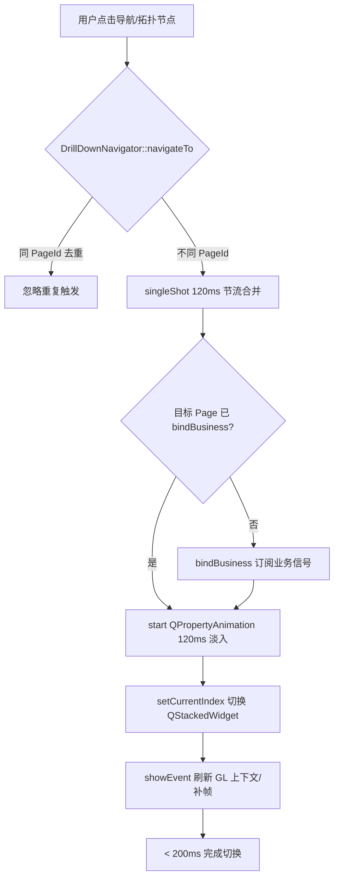
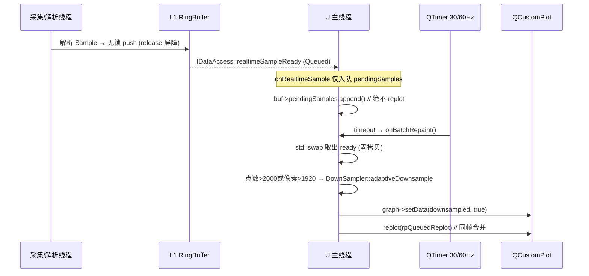
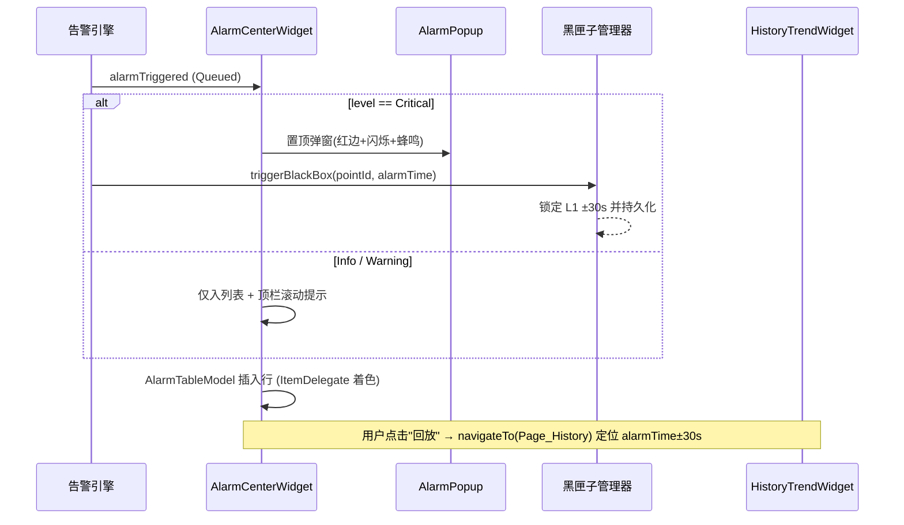
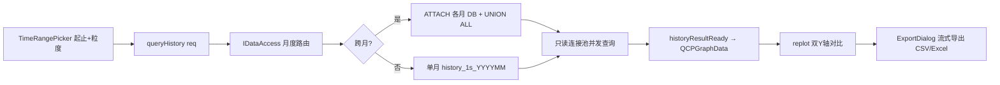
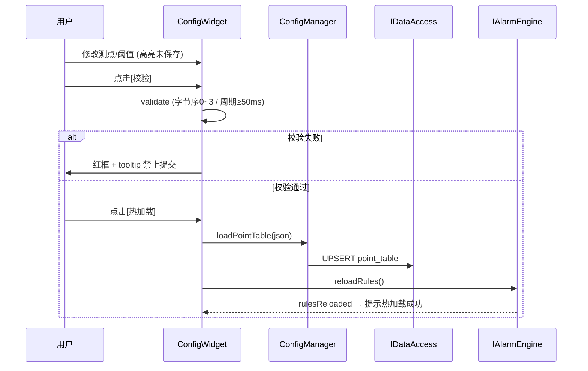
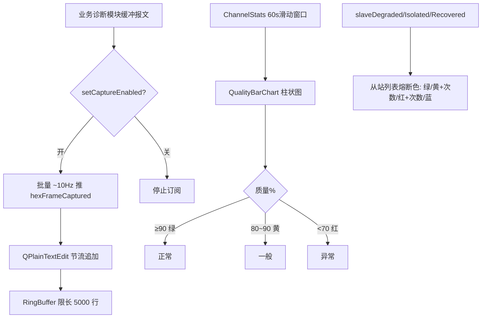
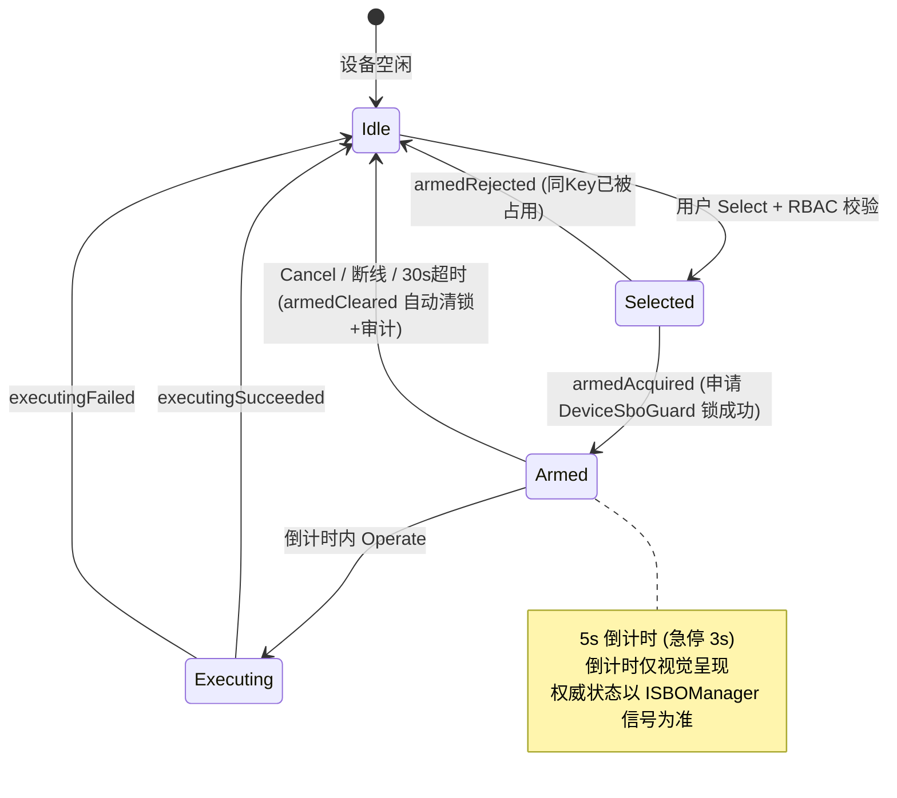

# EnerSentry 储能上位机系统 —— 界面原型 / 交互设计文档

> **文档编号**：ENS-UI-PROTO-001  
> **版本**：V1.2  
> **日期**：2026-08-13  
> **状态**：正式发布（可工程落地）  
> **编制依据**：
> - 《EnerSentry-储能上位机系统-概要设计说明书 V1.5》(ENS-HLD-001)
> - 《EnerSentry-储能上位机系统-软件需求规格说明书（SRS）V1.1》(ENS-SRS-001)
> - 《EnerSentry-非功能保障设计说明 V1.2》(ENS-NFR-001)
> - 《EnerSentry-工业上位机实战项目蓝图 V2.0》
> - 《EnerSentry-UI 详细设计说明书 V1.5》(ENS-UI-DD-001)
> - 《EnerSentry-接口控制文档 ICD/IDD V1.14》(ENS-ICD-001)
> - 《EnerSentry-数据库设计说明书（DBDD）》(ENS-DBDD-001)
> - 《EnerSentry-线程模型与并发设计专题报告 V1.0》(ENS-CONC-001)
> - 《EnerSentry-协议引擎设计说明 V1.0》(ENS-PEDS-001)
> - 《EnerSentry-通信接入设计说明 V1.5.3》(CADS)
> - 《EnerSentry-业务逻辑设计说明》(ENS-BLS-001)
>
> **适用人员**：UI 软件工程师、Qt/C++ 高级开发工程师、前端交互设计师、测试工程师、技术评审人员

---

## 文档说明

本文档是 UI 详细设计说明书（UI-DD V1.5）的**原型化补全与交互聚焦版本**。UI-DD 已完整定义类接口、信号槽契约与性能伪代码；本文档在 UI-DD 基础上，面向"界面长什么样、怎么交互"，补充：

1. **每个页面的一比一 ASCII 原型线框图**（界面原型）；
2. **各模块的 Widget 树状结构与组件级说明**（组件层级）；
3. **关键交互流程的 Mermaid 时序图 / 状态图 / 流程图**（信号槽与交互流程）；
4. 汇总 UI 性能优化的可落地伪代码与验收指标。

> **铁律（架构约束，贯穿全文）**：`ens::ui` 仅依赖 `ens::business` 与 `qcustomplot::qcustomplot`。UI 代码中**严禁** `new QSerialPort` / `QTcpSocket` / 直接调用 `IChannel` 读写；所有实时数据经 `IDataAccess` / `DataBus` 订阅，所有控制经 `ISBOManager` 下发。UI 线程**绝不**在工作线程上下文执行 `replot()` 或触碰 `QWidget` 子对象——跨线程一律 `QMetaObject::invokeMethod(..., Qt::QueuedConnection)`。

---

## 1. 文档版本与修订记录

| 版本 | 日期 | 修订人 | 修订内容 |
|------|------|--------|---------|
| V1.0 | 2026-08-13 | 高级 Qt/C++ UI 工程师 | 初始版本。基于 HLD V1.5、UI-DD V1.5 与全栈设计文档，输出界面原型 / 交互设计文档：主框架布局线框、暗色 QSS 主题规范、7 大模块 Widget 树 + ASCII 线框图、Mermaid 信号槽与交互流程图、UI 性能优化伪代码与验收指标 |
| V1.1 | 2026-08-13 | 高级 Qt/C++ UI 工程师 | 补充 §5.7「深度优化建议与潜在工控坑点」：①多通道高刷新率下的降采样计算移出 UI 线程；②`QCustomPlot::setData()` 内部内存复制微优化；③面包屑与 `QStackedWidget` 快速连击的动画重叠与输入屏蔽 |
| V1.2 | 2026-08-13 | 高级 Qt/C++ UI 工程师 | 在 §5.7 追加两条工程落地建议：④异步降采样的 `sequenceId` 防乱序与生命周期安全；⑤F1~F7 / Esc 快捷键的焦点冲突控制与可编辑控件过滤 |

**需求约束对齐（来自 HLD §3.3 / UI-DD / SRS）：**

| 约束类别 | 条款 | 取值 / 要求 |
|---------|------|------------|
| 语言标准 | C-01 | C++17 |
| UI 框架 | UI-01, C-01 | Qt 5.15 LTS / Qt 6.x（QWidget） |
| 图表引擎 | NFR-PERF-13 | QCustomPlot 2.x（支持 OpenGL 加速 / 局部重绘 / 多 Y 轴） |
| 视觉主题 | UI-01 | 暗色工控主题（深蓝/深灰基底，告警色醒目高亮） |
| 实时重绘 | NFR-PERF-13, ADR-NFR-03 | **严禁数据到达即重绘**，实时图表基于 `QTimer` 30Hz/60Hz 批处理重绘 |
| 降采样 | ADR-NFR-03 | 屏幕宽度 ≤ 1920px 时，单通道曲线点数降采样 ≤ 2000 点 |
| 钻取响应 | FR-OV-03, NFR-PERF-09 | 界面钻取响应时间 < 200ms |
| 暗色主题 | UI-01 | 背景深蓝/深灰为主，告警色醒目高亮 |
| 自适应 | UI-05 | 1920~3840 自适应 |
| 双屏 | UI-07 | 可选副屏镜像只读视图 |

---

## 2. 整体布局与样式规范（QSS Theme Guidelines）

### 2.1 主框架布局（MainWindow）

EnerSentry HMI 采用 **三段式主框架 + 可切换中央视图** 的布局（对应 SRS UI-01 暗色工业主题、UI-05 1920~3840 自适应、UI-07 双屏扩展）。整个应用为单 `QMainWindow` 骨架，所有业务视图均作为 `QStackedWidget` 中的 Page 挂载，由 `DrillDownNavigator` 统一路由。

> **启动顺序（FR-AUTH-01 / ENS-LLD-500 §7）**：应用启动后**先弹出 `LoginDialog` 模态登录屏**（位于 `src/ui/`，由 `main.cpp` 以 `exec()` 阻塞），鉴权成功后才构造并显示 `MainWindow`；会话超时（FR-AUTH-05）由 `SessionLockDialog` 重新锁定，采集/通信后台不中断。本说明书其余章节均描述“已登录态”的主框架与交互。

#### 2.1.1 主框架 ASCII 原型线框

```
┌──────────────────────────────────────────────────────────────────────────────────┐
│ TOP BAR (高 48px)  EnerSentry 储能监控  │ ●健康灯  │ 充/放/待机/故障 │ 告警:0/2 │  │
│   │ 通信:优 │ 角色:操作员 │ 2026-08-13 14:32:08  ▮ SBO锁:0            [⚙][🌐]    │
├──────────┬───────────────────────────────────────────────────────────────────────┤
│ NAV BAR  │  CENTER  中央主显示区 (QStackedWidget)                                  │
│ (左 64px)│  ┌─────────────────────────────────────────────────────────────────┐ │
│ ┌──────┐ │  │  [当前模块标题]  [面包屑: 站 / 舱 / 簇]   [刷新][设置]            │ │
│ │ ①总览│F1│  │ ┌───────────────────────────────────────────────────────────┐  │ │
│ ├──────┤ │  │ │                                                            │  │ │
│ │ ②曲线│F2│  │ │                    业务视图内容区域                        │  │ │
│ ├──────┤ │  │ │            （总览拓扑 / 实时曲线 / 告警列表 / …）            │  │ │
│ │ ③告警│F3│  │ │                                                            │  │ │
│ ├──────┤ │  │ └───────────────────────────────────────────────────────────┘  │ │
│ │ ④趋势│F4│  │  [底部操作区: 工具栏 / 状态汇总]                                          │ │
│ ├──────┤ │  └─────────────────────────────────────────────────────────────────┘ │
│ │ ⑤配置│F5│  │                                                                       │
│ ├──────┤ │  │                                                                       │
│ │ ⑥诊断│F6│  │                                                                       │
│ ├──────┤ │  │                                                                       │
│ │ ⑦SBO│F7│  │                                                                       │
│ └──────┘ │  │                                                                       │
├──────────┴───────────────────────────────────────────────────────────────────────┤
│ BOTTOM BAR (高 36px)  │ DB:●已连 │ L1:● │ L2:● │ 链路LED ●●○ │ 最新告警滚动条 … │ CPU 12% │ MEM 1.2G │ 58fps │
└──────────────────────────────────────────────────────────────────────────────────┘
```

#### 2.1.2 区域职责与数据绑定

| 区域 | 控件 | 职责 | 绑定信号/数据 |
|------|------|------|--------------|
| **Top Bar** | `GlobalStatusBar` | 系统名称、NTP 系统时钟、当前登录角色（操作员/工程师/管理员）、全站设备健康汇总灯、SBO 设备锁占用数（来自 `DeviceSboGuard`）、全局运行态（充/放/待机/故障）、告警统计汇总、通信质量汇总 | `ISBOManager::armedAcquired/armedReleased`、`IDataAccess::globalHealthChanged` |
| **Nav Bar** | `NavDock`（左侧竖排 `QToolButton` + `QListWidget`） | 7 大模块入口；支持键盘快捷键（F1~F7）与权限灰显（RBAC）；当前页高亮 | `DrillDownNavigator::navigateTo(PageId)` |
| **Center** | `QStackedWidget` + `QScrollArea` | 承载 7 个核心视图 Page；切换时执行页面切换动画（§2.3.2） | 各 Widget 的 `refresh()` / `bindBusiness()` |
| **Bottom Bar** | `CommStatusBar` + `AlarmTicker` + `PerfMeter` | 多链路通信 LED（来自 `ChannelStats`）、最新一条告警滚动提示、实时 CPU/内存/帧率自监控 | `IChannel::connectionChanged`、`IAlarmEngine::alarmTriggered`、`PerfMeter::tick` |

**双屏扩展（UI-07）**：主屏渲染 Center 主视图；副屏（可选）通过独立 `QMdiArea` / 第二 `QMainWindow` 镜像"电站总览 + 实时曲线"只读视图，由 `ScreenManager` 在启动时探测 `QGuiApplication::screens()` 数量决定布局。

### 2.2 视觉规范（QSS 暗色工业主题调色板）

整套主题由 `ThemePalette`（单例）集中管理，QSS 以变量宏方式引用（见 §3.1 `ThemePalette`），严禁在业务代码内硬编码颜色。

#### 2.2.1 核心调色板（QSS 变量表）

| 变量宏 | 值（十六进制） | 用途 | 对应文档 |
|--------|--------------|------|---------|
| `--bg-base` | `#1a1a2e` | 应用主背景（暗色基底） | UI-01 |
| `--bg-panel` | `#16213e` | 面板 / 卡片 / 控件容器背景 | — |
| `--bg-elevated` | `#0f3460` | 浮层 / 弹窗 / 选中态背景 | — |
| `--border` | `#2a3a5e` | 控件描边、分隔线 | — |
| `--text-primary` | `#e6e9f0` | 主文字（浅色） | UI-01 暗色浅字 |
| `--text-secondary` | `#9aa7c7` | 次级文字 / 单位 / 占位 | — |
| `--accent` | `#00d4ff` | 主强调色（聚焦、链接、主按钮） | — |
| `--accent-hover` | `#33e0ff` | 强调色 hover | — |
| **告警三级色** | | | UI-02 |
| `--alarm-info` | `#4aa3ff` | **Info 级（蓝色）**：普通提示、状态变化 | NFR / SRS UI-02 |
| `--alarm-warning` | `#ffcc00` | **Warning 级（黄色）**：越限预警、需关注 | SRS UI-02 黄=一般 |
| `--alarm-critical` | `#ff3b3b` | **Critical 级（红色）**：严重越限、急停 | SRS UI-02 红=严重 |
| **设备状态色** | | | UI-02 |
| `--status-normal` | `#3ad29f` | 设备/测点正常（绿色） | SRS UI-02 绿=正常 |
| `--status-offline` | `#6b7280` | 离线 / 未采集（灰） | — |
| `--status-busy` | `#ff9f43` | 采集忙 / 通信降级（橙） | — |
| **RS485 熔断状态色** | | | HLD §3.1.5 |
| `--fuse-healthy` | `#3ad29f` | Healthy 健康（绿） | — |
| `--fuse-degraded` | `#ffcc00` | Degraded 降级（黄 + 失败次数） | — |
| `--fuse-isolated` | `#ff3b3b` | Isolated 隔离（红 + 失败次数） | — |
| `--fuse-probing` | `#4aa3ff` | Probing 探测（蓝） | — |

> **色彩语义铁律（SRS UI-02）**：严重=红、一般=黄、正常=绿。告警三级映射固定为 `AlarmLevel::Info→蓝 / Warning→黄 / Critical→红`，不可随主题切换而漂移；色盲友好场景下叠加图标（▲/⚠/✖）与文字标签，不依赖纯颜色传达语义。

#### 2.2.2 字体与字号规范

| 用途 | 字体族 | 字号 | 字重 |
|------|--------|------|------|
| 数字 / 遥测值（等宽数字） | `Source Han Sans SC` + `Roboto Mono`（回退 `Consolas`） | 14~22px | Medium |
| 标题（Panel/Card 标题） | `Source Han Sans SC` | 14px | Bold |
| 正文 / 列表 | `Source Han Sans SC` | 12~13px | Regular |
| 告警弹窗正文 | `Source Han Sans SC` | 14px | Medium |

- 工程单位（UI-03）严格跟随测点 `Point::unit`（如 `℃` / `%` / `V` / `A` / `kW` / `kWh`），不做隐式换算；大数据采用千分位或工程计数（如 `12.34 kWh`、`1.2 kV`）。
- 高 DPI：`QApplication::setAttribute(Qt::AA_EnableHighDpiScaling)` + `setFont` 以 `pt` 逻辑单位，保障 1920×1080 → 3840×2160 4K 下无模糊。

#### 2.2.3 统一控件样式规则（QSS 片段，含 DPI 变量）

> 所有尺寸值通过 `--dpi-N` 变量引用（由 `ThemePalette::injectDpiVariables()` 在启动时根据 `logicalDotsPerInch()` 注入实值），避免 1080P→4K 缩放下布局变形。详见 §5.5。

```css
/* theme/ens_dark.qss（节选，变量由 ThemePalette 注入） */
:root {
    --bg-base: #1a1a2e; --bg-panel: #16213e; --bg-elevated: #0f3460;
    --border: #2a3a5e;  --text-primary: #e6e9f0; --text-secondary: #9aa7c7;
    --accent: #00d4ff;  --accent-hover: #33e0ff;
    --alarm-info: #4aa3ff; --alarm-warning: #ffcc00; --alarm-critical: #ff3b3b;
    --status-normal: #3ad29f; --status-offline: #6b7280; --status-busy: #ff9f43;

    /* 尺寸变量（DPI 动态注入实值） */
    --radius-sm: var(--dpi-4);  --radius-md: var(--dpi-6);  --radius-lg: var(--dpi-8);
    --pad-md: var(--dpi-10) var(--dpi-14);
    --border-w: 1px;            --scrollbar-w: var(--dpi-10);
}

QWidget#Panel {
    background: var(--bg-panel);
    border: var(--border-w) solid var(--border);
    border-radius: var(--radius-md);
}
QPushButton#Primary {
    background: var(--accent); color: #06121f;
    border-radius: var(--radius-sm); padding: var(--pad-md); font-weight: 600;
}
QPushButton#Primary:hover { background: var(--accent-hover); }
QPushButton#Primary:disabled { background: #2a3a5e; color: #6b7280; }
QPushButton#Danger { background: var(--alarm-critical); color: #fff; }  /* SBO 执行/急停 */
QTableWidget, QTreeView {
    background: var(--bg-panel);
    gridline-color: var(--border);
    selection-background-color: var(--bg-elevated);
}
QScrollBar:vertical { background: var(--bg-base); width: var(--scrollbar-w); }
/* 告警三级行色（AlarmItemDelegate 也按此语义绘制左侧色条） */
QTableWidget::item[level="Critical"] { border-left: 4px solid var(--alarm-critical); }
QTableWidget::item[level="Warning"]  { border-left: 4px solid var(--alarm-warning); }
QTableWidget::item[level="Info"]     { border-left: 4px solid var(--alarm-info); }
```

### 2.3 交互规范（DrillDownNavigator 三级钻取路由）

#### 2.3.1 三级钻取模型

电池层级为 **储能电站 → 电池舱 Container ×N → 电池簇 Rack ×M → 电池包 Pack ×K → 电芯 Cell ×100+**（蓝图）。UI 钻取遵循三级粒度：

| 钻取层级 | 视图 | 内容 | 进入条件 |
|---------|------|------|---------|
| **L0 站级** | 电站总览 | 拓扑图 + 全站指标卡（SOC/SOH/功率/温度极值） | 默认首页 |
| **L1 舱/簇级** | 总览下钻 / 曲线 / 告警过滤 | 单 Container/Rack 的测点聚合、曲线、告警 | 点击拓扑节点（< 200ms 切换） |
| **L2 包/点级** | 曲线聚焦 / 测点详情 | 单 Pack 或单 Point 历史曲线、实时值、黑匣子 | 行点击 / 曲线 legend 选取 |

`DrillDownNavigator` 维护 **钻取栈（DrillStack）**，支持面包屑（Breadcrumb）回退与 `Esc` 逐级返回；任意层级切换必须满足 **< 200ms 响应**（SRS NFR-PERF-09、Q-10 冷启动 < 5s）。

#### 2.3.2 页面切换动画与防抖节流（Anti-Flood Throttling）

- **切换动画**：`QStackedWidget` 切换使用 `QPropertyAnimation` 对 `widget->opacity` 做 120ms 淡入（`QEasingCurve::OutCubic`），不阻塞事件循环；动画期间禁止再次触发切换。
- **防抖节流（强制）**：`DrillDownNavigator::navigateTo(PageId)` 实现 **200ms 输入节流 + 状态去重**：
  - 同一 `PageId` 连续触发（如重复点击导航）**仅首次生效**，后续直接 return；
  - 高频导航事件（如滚轮/键盘连按）经 `QTimer::singleShot(120ms)` 合并，避免 `QStackedWidget` 抖动与 Widget 重复 `bindBusiness()`。
- **懒加载**：非首页 Page 首次进入时才 `bindBusiness()` 订阅业务信号，离开不 `disconnect`（保留订阅），降低切换开销。

---

## 3. 各模块详细 Widget 树状结构与 UI 组件说明

> **模块隔离铁律**：UI 仅依赖 `ens::business` 与 `qcustomplot::qcustomplot`。所有实时数据经 `IDataAccess` / `DataBus` 订阅，所有控制经 `ISBOManager` 下发。

### 3.1 ① 电站总览 OverviewWidget

**职责**：L0 站级态势感知（FR-OV-01~07）。拓扑图 + 全站指标卡 + 三级钻取入口 + 设备健康汇总。

#### 3.1.1 原型线框图

```
┌───────────────────────────────────────────────────────────────────────────┐
│ 电站总览  [面包屑: 储能电站A ▸ 全部]                          [刷新][导出]  │
├──────────────────────────────────────────────────┬────────────────────────┤
│  拓扑视图 (TopoView / QGraphicsView)               │  核心 KPI 指标卡        │
│  ┌─────────────────────────────────────────────┐  │ ┌────────┐ ┌────────┐ │
│  │        [储能电站A]                            │  │ │ SOC    │ │ SOH    │ │
│  │         │                                    │  │ │ 87.3%  │ │ 96.5%  │ │
│  │   ┌─────┴─────┐  erme ┌─────┴─────┐           │  │ └────────┘ └────────┘ │
│  │   │电池舱 C1 ●│       │电池舱 C2 ●│           │  │ ┌────────┐ ┌────────┐ │
│  │   │ ┌──┐┌──┐  │       │ ┌──┐┌──┐  │           │  │ │有功功率│ │无功功率│ │
│  │   │ │R1││R2│  │       │ │R1││R2│  │           │  │ │1200kW │ │ 80kVar│ │
│  │   │ └──┘└──┘  │       │ └──┘└──┘  │           │  │ └────────┘ └────────┘ │
│  │   └───────────┘       └───────────┘           │  │ ┌──────────────────┐  │
│  │   链路连线(随ChannelStats着色)                  │  │ │最高温度 41.2 ℃   │  │
│  └─────────────────────────────────────────────┘  │  └──────────────────┘  │
│                                                    │  设备健康汇总          │
│  ●绿=正常 ◐橙=降级 ○灰=离线 ✖红=关联告警          │  正常:N  降级:M  离线:K│
└──────────────────────────────────────────────────┴────────────────────────┘
  交互：点击 电池舱/簇 节点 → 右侧指标卡切换聚合值 + 面包屑追加（<200ms）
        双击 PCS 节点 → 跳转 SBO 控制台并预选设备
```

#### 3.1.2 Widget 树

```
OverviewWidget
└── QHBoxLayout
    ├── TopoView (QGraphicsView)
    │   └── QGraphicsScene
    │       ├── StationNode (自定义 QGraphicsItem)
    │       ├── ContainerNode × N   → 点击 drillDown(L1)
    │       │   └── RackNode × M     → 点击 drillDown(L2)
    │       └── LinkEdge（通信链路连线，颜色随 ChannelStats）
    └── QVBoxLayout (右栏)
        ├── MetricCardPanel
        │   ├── MetricCard[总 SOC%] / [总 SOH%] / [有功 kW] / [无功 kVar] / [最高温度 ℃]
        └── HealthSummary
            ├── QLabel(正常×N) / QLabel(降级×N) / QLabel(离线×N)
            └── Breadcrumb（站 / 舱 / 簇 三级）
```

#### 3.1.3 信号 / 槽

| 方向 | 信号 / 槽 | 说明 |
|------|-----------|------|
| 业务→UI | `IDataAccess::stationMetricUpdated(const StationMetric&)` | 指标卡刷新（QueuedConnection） |
| 业务→UI | `IDataAccess::deviceHealthChanged(uint32_t devId, SlaveHealth)` | 拓扑节点颜色更新 |
| UI→业务 | `OverviewWidget::drillDown(const DrillKey&)` | 经 `DrillDownNavigator` 路由到 L1/L2 |
| UI→UI | `Breadcrumb::navigateUp()` | 面包屑回退一级 |

#### 3.1.4 交互逻辑

1. 启动后默认呈现 L0 拓扑；`TopoView` 采用固定布局 + 自适应缩放（`fitInView`），不随分辨率拉伸变形。通信链路连线（`LinkEdge`）与节点描边统一使用 **Cosmetic Pen**（`setCosmetic(true)`），在 1080P→4K 缩放下保持固定物理像素线宽。
2. 点击 `ContainerNode` → `drillDown(Container)`：右侧指标卡切换为该舱聚合值，面包屑追加"舱名"，**< 200ms**（数据来自 L1 聚合缓存，非实时重算）。
3. 设备健康灯颜色映射：`SlaveHealth::HEALTHY→绿` / `DEGRADED→橙` / `ISOLATED→灰` / 离线→灰；Critical 关联告警时节点闪烁红边。
4. 双击节点可跨模块跳转：双击 PCS 节点 → `DrillDownNavigator::navigateTo(Page_SBO)` 并预选该设备。
5. **L2 电芯级（Cell Level 100+）极端渲染性能预案**：禁止嵌套 QWidget/QLabel 逐格渲染；改用 `QGraphicsView` 批量图元（方案 A）或 `QAbstractTableModel` + 自定义 `QItemDelegate`（方案 B），数据刷新仅 `dataChanged(index,index,roles)` 局部脏区标记，严禁 `beginResetModel()`。
6. **TopoView 静态背景图元缓存**：变压器/电池舱轮廓等静态图元启用 `DeviceCoordinateCache`，`fitInView()` 时复用 Pixmap，CPU 开销降低约 40%~60%。

### 3.2 ② 实时曲线 RealtimeChartWidget

**职责**：多通道实时曲线（FR-RT-01~08）。QCustomPlot 多通道、legend 控制、缩放/平移、30/60Hz 定时器绑定批量重绘。**严禁数据到达即 replot()**（NFR-PERF-13 / ADR-NFR-03）。

#### 3.2.1 原型线框图

```
┌───────────────────────────────────────────────────────────────────────────┐
│ 实时曲线  通道: 温度/电压/电流/功率                  [时间窗 1m▾][刷新率30Hz▾][⏸暂停]│
├──────────────────────────────┬────────────────────────────────────────────┤
│  QCustomPlot 图表区            │  通道选择勾选树 (ChannelListPanel)           │
│  ┌──────────────────────────┐ │  ☑ 电池舱C1-R1 温度   (℃)                  │
│  │   ╭─╮      ╭─╮   ╭─╮      │ │  ☑ 电池舱C1-R1 电压   (V)                  │
│  │  ╱  ╲    ╱  ╲ ╱  ╲╱  ╲    │ │  ╱ 电池舱C1-R2 温度   (℃)                 │
│  │ ╱    ╲__╱    ╲╱    ╲__╱   │ │  ╱ 总功率            (kW)  [右轴]          │
│  │        多Y轴联动 · 局部放大 · 游标测量            │  ☐ PCS#1 输出电流   (A)  │
│  │  ───────────────────────── │ │  ─────────────────────────────           │
│  │  X: 时间(s)   Y左:℃  Y右:kW│ │  [全选][全不选]                            │
│  └──────────────────────────┘ │  Y轴范围: [自动█][手动:__~__]               │
│  ⏸ 实时滚动已暂停 — [点击恢复实时]  (右上角半透明Banner, Paused/Panning显示)│
├──────────────────────────────┴────────────────────────────────────────────┤
│ [缩放][平移][复位][游标][快照]                                              │
└───────────────────────────────────────────────────────────────────────────┘
  交互：勾选树控制 graph 显隐；拖拽/平移进入交互态(暂停自动滚动)；工具栏恢复实时
```

#### 3.2.2 Widget 树

```
RealtimeChartWidget
└── QHBoxLayout
    ├── ChannelListPanel (QVBoxLayout)
    │   ├── QCheckBox[通道1 温度] ...  → 控制 graph 显隐
    │   └── QPushButton[全选/全不选]
    └── QVBoxLayout
        ├── Toolbar
        │   ├── QToolButton[缩放] / [平移] / [复位] / [游标]
        │   └── QComboBox[时间窗 1m/5m/30m] / [刷新率 30Hz/60Hz]
        └── QCustomPlot (m_plot, OpenGL 由 ThemePalette::tryEnableOpenGL 探测)
```

#### 3.2.3 信号 / 槽

| 方向 | 信号 / 槽 | 说明 |
|------|-----------|------|
| 业务→UI | `IDataAccess::realtimeSampleReady(uint32_t pointId, const QCPGraphData&)` | **仅入队缓冲，不重绘** |
| UI 内部 | `QTimer::timeout → onBatchRepaint()` | 唯一重绘入口（§5.2） |
| UI→UI | `ChannelListPanel::channelToggled(pointId, bool)` → `onChannelToggled()` | `graph->setVisible()`；**隐藏时清空 `pendingSamples`**，并 `replot(rpQueuedReplot)` |
| UI→业务 | `Toolbar::snapshotRequested()` | 请求 `IDataAccess::exportCurrentWindow()` |

#### 3.2.4 交互逻辑

1. 数据到达经 `realtimeSampleReady` 写入各通道**待绘制环形缓冲**（`pendingSamples`），**绝不调用 replot()**。
2. `m_repaintTimer`（默认 30Hz，`Qt::PreciseTimer`）触发 `onBatchRepaint()`：执行降采样 → `setData()` → `replot(rpQueuedReplot)`（同帧合并）。
3. legend/通道开关即时显隐对应 `QCPGraph`；缩放/平移使用 QCustomPlot 原生 `QCPAxisRect` 交互；时间窗切换重置 X 轴范围。
4. 单通道点数 > 2000 或像素宽 > 1920 时自动降采样（Min-Max / LTTB 自适应）。
5. **交互态竞用保护**：用户拖拽/平移（Pause/Pan 模式）浏览历史时，进入 `m_userInteracting`，仅将新样本追加至后台 `m_backlog`；松手或点击"恢复实时"（`setRenderMode(Live)`）时回放 `m_backlog` 并复位 X 轴。
6. **GL 上下文**：页面在 `QStackedWidget` 隐藏/显示时，`showEvent` 触发 `viewport()->update()` + `replot()` 刷新重建后的 OpenGL 上下文。
7. **交互态显性化 Banner**：Paused/Panning 时图表右上角浮现半透明悬浮 Banner，防止操作员误判"数据卡死/通信中断"。

### 3.3 ③ 告警中心 AlarmCenterWidget

**职责**：告警查询、声光弹窗、确认/清除、黑匣子回放入口（FR-AL-01~13）。

#### 3.3.1 原型线框图

```
┌───────────────────────────────────────────────────────────────────────────┐
│ 告警中心                                          [确认选中][全部确认][清除恢复][黑匣子回放]│
├───────────────────────────────────────────────────────────────────────────┤
│ 过滤区 (FilterBar)                                                            │
│  级别:[全部▾/Info/Warning/Critical]  设备:[______]  时间:[日期选择]  [查询]  │
├───────────────────────────────────────────────────────────────────────────┤
│ 实时告警列表 (QTableView + AlarmItemDelegate)                                │
│ ┌────┬──────────┬─────────┬────────┬────────┬──────┬────────┬─────────────┐│
│ │图标│ 时间     │ 级别    │ 设备   │ 测点   │ 值/阈值│ 状态  │ 操作        ││
│ │ ✖ │14:01:22  │ Critical│ PCS#1 │ 温度   │85/80 │Active│[确认][回放] ││
│ │ ⚠ │14:00:10  │ Warning │ Rack2 │ 电压   │ 720/750│Conf │[确认]       ││
│ │ ▲ │13:58:03  │ Info    │ C1    │ SOC    │ 88%   │Recov │(删除线)     ││
│ └────┴──────────┴─────────┴────────┴────────┴──────┴────────┴─────────────┘│
│  行左侧色条: 红=Critical 黄=Warning 蓝=Info；Active加粗 / Recovered删除线    │
└───────────────────────────────────────────────────────────────────────────┘
  Critical 弹窗: 置顶 AlarmPopup(红边+闪烁+蜂鸣)；非Critical仅入列表+顶栏滚动
```

#### 3.3.2 Widget 树

```
AlarmCenterWidget
└── QVBoxLayout
    ├── FilterBar
    │   ├── QComboBox[级别 Info/Warning/Critical]
    │   ├── QLineEdit[设备过滤] / QDateEdit[时间]
    ├── QTableView (m_table)
    │   └── AlarmItemDelegate (按 alarmLevel 着色行/图标)
    └── Toolbar
        ├── QPushButton[确认选中] / [全部确认] / [清除恢复] / [黑匣子回放]
```

#### 3.3.3 信号 / 槽

| 方向 | 信号 / 槽 | 说明 |
|------|-----------|------|
| 业务→UI | `IAlarmEngine::alarmTriggered(const AlarmRecord&)` | 入模型 + **Critical 触发声光弹窗** |
| 业务→UI | `IAlarmEngine::alarmRecovered(uint64_t)` / `alarmAcknowledged(uint64_t)` | 行状态更新 |
| 业务→UI | `IAlarmEngine::blackBoxRequested(uint32_t, uint64_t)` | 自动打开回放（跳 HistoryTrendWidget 定位 ±30s） |
| UI→业务 | `AlarmCenterWidget::acknowledge(const QVector<uint64_t>&, user)` | `IAlarmEngine::acknowledgeAlarms()` |
| UI→业务 | `AlarmCenterWidget::clearRecovered()` | 清除已恢复告警 |
| UI→UI | `AlarmItemDelegate::replayRequested(alarmId)` | `DrillDownNavigator::navigateTo(Page_History)` + 定位 |

#### 3.3.4 交互逻辑

1. **声光弹窗**：`alarmTriggered` 经 QueuedConnection 投递；`Critical` 级弹出置顶 `AlarmPopup`（红边 + 闪烁 + 蜂鸣 `QSoundEffect`），**非 Critical 仅入列表 + 顶栏滚动提示**。
2. **ItemDelegate** 按 `AlarmLevel` 绘制行背景/左侧色条/图标：Info 蓝 ▲ / Warning 黄 ⚠ / Critical 红 ✖；`AlarmStatus` 决定删除线（Recovered）或加粗（Active）。
3. **一键确认/清除**：批量 `acknowledgeAlarms(ids, user)`（记录 `confirmUser`）；"清除恢复"仅移除 `Recovered` 行。
4. **黑匣子回放**：点击某 Critical 告警行的"回放" → 跳历史趋势页，X 轴定位到告警时刻 ±30s。

### 3.4 ④ 历史趋势 HistoryTrendWidget

**职责**：跨月 / 多粒度历史查询与对比、导出（FR-HT-01~08）。

#### 3.4.1 原型线框图

```
┌───────────────────────────────────────────────────────────────────────────┐
│ 历史趋势                                                          [导出CSV][导出Excel]│
├───────────────────────────────────────────────────────────────────────────┤
│ 时间范围 (TimeRangePicker)                                                  │
│  起: [2026-08-01 00:00:00]  止: [2026-08-31 23:59:59]  粒度:[1s▾/5s/1m] [查询]│
│  (支持跨月查询 ≤3 个月；UI仅传时间区间，分表路由由 IDataAccess 完成)          │
├──────────────────────────────────┬────────────────────────────────────────┤
│  QCustomPlot 双Y轴对比            │  叠加通道 (ChannelComparePanel)          │
│  ┌──────────────────────────────┐│  ☑ 温度 ℃      [左轴]                   │
│  │   ╱╲      ╱╲   趋势对比       ││  ☑ 功率 kW     [右轴▓]                  │
│  │ ╱    ╲╱    ╲╱                 ││  ☐ 电压 V      [左轴]                   │
│  │ 左轴:℃   右轴:kW             ││  (最多叠加 8 通道防过载)                 │
│  └──────────────────────────────┘│  ─────────────────────────────          │
│                                    │  数据导出配置: 降采样:[开█ 100ms→1s]    │
└──────────────────────────────────┴────────────────────────────────────────┘
  交互：粒度切换即切换查询表(history_1s_*/5s_*/1m_*)；导出经 QProgressDialog 流式
```

#### 3.4.2 Widget 树

```
HistoryTrendWidget
└── QVBoxLayout
    ├── TimeRangePicker
    │   ├── QDateTimeEdit[起] / [止]  (支持跨月)
    │   └── QComboBox[粒度 1s/5s/1min] (引用 DBDD 降采样表)
    ├── ChannelComparePanel
    │   └── QListWidget[叠加通道] + QCheckBox[右轴]
    ├── QCustomPlot (m_plot, 左轴 QCPAxis / 右轴 QCPAxis)
    └── ExportDialog (QDialog)
        ├── QComboBox[CSV/Excel] / QPushButton[导出]
```

#### 3.4.3 信号 / 槽

| 方向 | 信号 / 槽 | 说明 |
|------|-----------|------|
| UI→业务 | `HistoryTrendWidget::queryHistory(req)` | `IDataAccess::beginQuery(HistoryQuery)`（跨月 ATTACH + 月度路由） |
| 业务→UI | `IDataAccess::historyResultReady(const HistoryPage&)` | 填充 `QCPGraphData` 并 `replot()` |
| UI→业务 | `ExportDialog::exportRequested(fmt, range)` | `IDataAccess::exportHistory()` |

#### 3.4.4 交互逻辑

1. **时间选择器**：支持起止跨自然月；提交查询时 `IDataAccess` 自动按 `history_1s_YYYYMM` 月度表路由 + `ATTACH` + `UNION ALL`，UI 仅传时间区间，不感知分表。
2. **粒度选择**：1s/5s/1min 对应 L2 已降采样表，切换粒度即切换查询表，避免实时聚合。
3. **双 Y 轴对比**：勾选"右轴"的通道绘制到 `m_plot->yAxis2`，适合量纲差异大的测点；最多叠加 8 通道。
4. **导出**：`ExportDialog` 经 `IDataAccess` 流式导出，导出进度用 `QProgressDialog`。
5. **i18n 轴标签刷新**：重写 `changeEvent`，手动 `m_plot->xAxis->setLabel(tr(...))` + `replot()`。

### 3.5 ⑤ 参数配置 ConfigWidget

**职责**：点表与阈值热加载、树形编辑与校验（FR-CFG-01~10）。

#### 3.5.1 原型线框图

```
┌───────────────────────────────────────────────────────────────────────────┐
│ 参数配置                                          [校验][热加载][导出JSON]  │
├──────────────────────────────┬────────────────────────────────────────────┤
│ 点表矩阵 (PointTreeView)      │  选中点编辑 (PointTableEditor)              │
│ ┌ 链路 linkId                 │  寄存器地址: [40001       ]                 │
│ │ ├ 从站 0x01                 │  字节序:     [0▾ BigEndian]                 │
│ │ │ ├ 测点 温度  (未保存●)    │  系数:       [0.01        ]                 │
│ │ │ ├ 测点 电压  (修改●)      │  轮询周期ms: [1000        ]  (≥50ms)        │
│ │ ├ 从站 0x02                 │  单位:       [℃           ]                 │
│ │ [搜索框: _______]           │  ─────────────────────────────             │
│                               │  告警阈值 (ThresholdEditor)                 │
│                               │  上限: [80   ] 下限: [ -20 ] 迟滞:[2 ]     │
│                               │  延时确认ms:[1000] 同源抑制:[开█]           │
│                               │  (阈值编辑需工程师/管理员角色)               │
├──────────────────────────────┴────────────────────────────────────────────┤
│ 状态: 3 项未保存 (高亮) — 提交时二次校验，热加载至 ConfigManager             │
└───────────────────────────────────────────────────────────────────────────┘
  交互：修改项高亮；提交触发二次校验(字节序0~3/周期≥50ms)；通过后热加载不重启
```

#### 3.5.2 Widget 树

```
ConfigWidget
└── QHBoxLayout
    ├── PointTreeView (QTreeView, 模型 PointTableModel)
    │   └── 根[链路 linkId] → [从站 slaveAddress] → [测点 PointTableEntry]
    └── QVBoxLayout
        ├── PointTableEditor (表单: register_addr/byte_order/scale_factor/poll_interval_ms/unit)
        ├── ThresholdEditor (表单: 上限/下限/迟滞/延时确认/同源抑制)
        └── Toolbar
            ├── QPushButton[校验] / [热加载] / [导出 JSON]
```

#### 3.5.3 信号 / 槽

| 方向 | 信号 / 槽 | 说明 |
|------|-----------|------|
| UI→业务 | `ConfigWidget::loadPointTable(path)` | `ConfigManager::loadPointTable("config/pointtable.json")` → UPSERT `point_table` |
| UI→业务 | `ConfigWidget::reloadRules(rules)` | `IAlarmEngine::reloadRules()`（阈值热加载） |
| UI→UI | `PointTreeView::currentChanged(entry)` | 填充编辑器表单 |
| 业务→UI | `IAlarmEngine::rulesReloaded()` | 提示热加载成功 |

#### 3.5.4 交互逻辑

1. **树形浏览**：以 `point_table`（`register_addr`, `byte_order` 0~3, `scale_factor`, `poll_interval_ms`）为模型；树按 `link_id → slave_address → register_addr` 组织。
2. **编辑与校验**：`byte_order` 限制 0~3，`poll_interval_ms` ≥ 50ms；保存前 `validate()` 校验约束，非法项红框 + tooltip，禁止提交。
3. **热加载**：点"热加载" → `ConfigManager::loadPointTable()` 重新解析 JSON → `IDataAccess::getPointTable()` 刷新 → `IAlarmEngine::reloadRules()` 热更阈值；**无需重启进程**。
4. **权限**：阈值编辑需工程师/管理员角色（RBAC），操作员仅可读。

### 3.6 ⑥ 通信诊断 DiagWidget

**职责**：多链路状态、实时十六进制报文捕获、通信质量百分比（FR-DG-01~06）。

#### 3.6.1 原型线框图

```
┌───────────────────────────────────────────────────────────────────────────┐
│ 通信诊断                                              [开始捕获][暂停][清空] │
├───────────────────────────────────────────────────────────────────────────┤
│ 链路状态矩阵 (LinkStatusGrid)                                                │
│  [LINK1 ●优] [LINK2 ●优] [LINK3 ◐降级] [LINK4 ○断] [LINK5 ●优]               │
│   hover: 丢帧率/超时计数                                                     │
├──────────────────────────────┬────────────────────────────────────────────┤
│ 原始报文抓取 (HexCaptureView) │  通信质量% (QualityBarChart)                 │
│ 14:01:22.100 [LINK1][TX] 01 │  LINK1 ██████████████████ 99%                │
│ 14:01:22.105 [LINK1][RX] 01 │  LINK2 ███████████████░░ 92%                 │
│ 14:01:22.200 [LINK2][TX] 03 │  LINK3 ████████░░░░░░░░░ 64% ← <70%红        │
│ 14:01:22.205 [LINK2][RX] 03 │  LINK4 ░░░░░░░░░░░░░░░░░  0% 断              │
│ ... (RingBuffer 限长 5000 行) │  阈值线: <90%黄 / <70%红                    │
└──────────────────────────────┴────────────────────────────────────────────┘
  交互：报文批量(~10Hz)追加防刷新风暴；质量柱60s滑动窗口；从站熔断色见§2.2.1
```

#### 3.6.2 Widget 树

```
DiagWidget
└── QVBoxLayout
    ├── LinkStatusGrid (QGridLayout)
    │   └── LinkLed × N (颜色随 ChannelStats: 优/一般/异常)
    ├── QSplitter
    │   ├── HexCaptureView (QPlainTextEdit, 只读, 等宽字体)
    │   └── QualityBarChart (QCustomPlot, 每链路一根柱)
    └── Toolbar [开始捕获][暂停][清空]
```

#### 3.6.3 信号 / 槽

| 方向 | 信号 / 槽 | 说明 |
|------|-----------|------|
| 业务→UI | `IChannel::connectionChanged(bool)` / `ChannelStats` 推送 | LED + 质量柱刷新（QueuedConnection） |
| 业务→UI | `IDataAccess::hexFrameCaptured(linkId, dir, QByteArray)` | 追加到 `HexCaptureView`（**节流批追加**） |
| UI→业务 | `DiagWidget::setCaptureEnabled(bool)` | 控制诊断订阅开关 |

#### 3.6.4 交互逻辑

1. **链路 LED**：每链路一盏，颜色随 `ChannelStats` 质量等级（优秀绿 / 一般黄 / 异常红 / 断开灰），Hover 显示丢帧率、超时计数。
2. **十六进制捕获**：报文经业务层诊断模块缓冲后**批量（~10Hz）**推到 UI 追加，单行格式 `HH:MM:SS.mmm [LINK1][TX] 01 03 00 00 00 0A C5 CD`；超长自动滚动截断（RingBuffer 限长 5000 行）。
3. **质量柱状图**：每链路通信质量%（60s 滑动窗口），`QCustomPlot` 柱状图 + 阈值线（< 90% 黄，< 70% 红）。
4. **RS485 从站三级熔断状态指示**（HLD §3.1.5）：从站列表以颜色直观展示 **Healthy（绿）/ Degraded（黄 + 失败次数）/ Isolated（红 + 失败次数）/ Probing（蓝）**。

### 3.7 ⑦ SBO 控制台 SBOControlWidget

**职责**：Select-Armed-Operate 双重确认、设备级逻辑锁 UI 状态响应（FR-CTRL-01~07）。

#### 3.7.1 原型线框图

```
┌───────────────────────────────────────────────────────────────────────────┐
│ SBO 控制台  (权限: 操作员/工程师/管理员)                          [语言▾]    │
├──────────────────────────────┬────────────────────────────────────────────┤
│ 设备/命令树 (DeviceTree)      │  SBO 状态机视图 (SboFlowPanel)              │
│ ┌ 设备 PCS#1                  │  [1.Select] ─▶ [2.Armed] ─▶ [3.Operate]    │
│ │ ├ 排风 0x1000   [空闲]      │            │            │                    │
│ │ ├ 液冷 0x2000   [空闲]      │         [Cancel]     [Executed]             │
│ ├ 设备 PCS#2                  │  Armed 倒计时: [████████░░] 5s (急停3s)     │
│ │ ├ 急停 0x3000   [空闲]⚠管理员│  ──────────────────────────────────        │
│ [搜索: ______]               │  提示: 同一设备仅 1 个 Armed；断线/超时自清  │
├──────────────────────────────┴────────────────────────────────────────────┤
│ [Select 预选]   [Operate 执行]   [Cancel 取消]   [Danger: 急停 3s]          │
│  交互: ①点击控制项→Select(预置) ②弹二次确认对话框→Armed+倒计时 ③确认→Operate │
│       超时/异常自动清除 Armed（权威状态以 ISBOManager 信号为准）              │
└───────────────────────────────────────────────────────────────────────────┘
```

#### 3.7.2 Widget 树

```
SBOControlWidget
└── QHBoxLayout
    ├── DeviceTree (QTreeView, 模型 SboCommandModel)
    │   └── 设备[PCS#1] → 命令[排风 0x1000][液冷 0x2000]
    └── QVBoxLayout
        ├── SboFlowPanel (阶段指示: Select/Armed/Operate/Executed)
        ├── ArmedCountdownBar (QProgressBar, 5s 倒计时)
        └── Toolbar
            ├── QPushButton[Select] / [Operate] / [Cancel]
            └── QPushButton[Danger: 急停] (3s 倒计时更短)
```

#### 3.7.3 信号 / 槽

| 方向 | 信号 / 槽 | 说明 |
|------|-----------|------|
| UI→业务 | `SBOControlWidget::submitSelect(SboSelectRequest, user)` | `ISBOManager::submitSelect()`（申请 `DeviceSboGuard` 锁） |
| 业务→UI | `ISBOManager::armedAcquired(seqId, SboDeviceKey)` | 进入 Armed，启动 5s 倒计时条 |
| 业务→UI | `ISBOManager::armedRejected(seqId, key, reason)` | 弹"设备忙/已被占用"提示（同 Key 互斥） |
| UI→业务 | `SBOControlWidget::submitOperate(seqId)` | `ISBOManager::submitOperate()` 执行 |
| 业务→UI | `ISBOManager::executingSucceeded/Failed` | 流程结束，清倒计时 |
| 业务→UI | `ISBOManager::armedCleared(reason)` | 断线/超时（30s）/取消 → 自动清 Armed + 审计 |

#### 3.7.4 交互逻辑（双重确认 + 设备级锁 UI 响应）

1. **Select**：操作员选设备+命令 → `submitSelect(req, user)`（RBAC 校验）。业务层 `DeviceSboGuard::tryAcquire(SboDeviceKey{linkId,slaveId,registerAddr})` 申请设备级逻辑锁。
2. **Armed**：成功后 `armedAcquired` → UI 进入 Armed 态，`ArmedCountdownBar` 启动 **5s 倒计时**（急停命令 **3s**）；同 `SboDeviceKey` 的并发 Select 将被 `armedRejected`（允许 10 个 PCS 柜并行 Armed）。
3. **Operate**：倒计时内点"Operate" → `submitOperate(seqId)` → 业务下发执行；成功后 `executingSucceeded` 清锁。
4. **安全撤销**：Armed 期间遇链路断线或 30s 超时 → 业务自动清锁并 `armedCleared` 审计，UI 倒计时条归零并置灰。**UI 绝不自行持有跨线程 QTimer 控制锁语义**——倒计时仅做视觉呈现，权威状态以 `ISBOManager` 信号为准。
5. **权限**：急停仅管理员/工程师可触发；所有操作经 `ISBOManager` 留痕（审计日志）。

---

## 4. 关键 Qt 信号槽与交互流程图（Mermaid）

### 4.1 三级钻取路由流程（DrillDownNavigator）



### 4.2 实时曲线数据通路与批处理重绘（核心性能流程）



### 4.3 告警中心声光弹窗与黑匣子回放



### 4.4 历史趋势跨月查询与导出



### 4.5 参数配置热加载流程



### 4.6 通信诊断报文捕获与质量统计



### 4.7 SBO 控制台状态机（Select → Armed → Operate）



---

## 5. UI 性能优化实施细节

### 5.1 数据通路：ens::datahub → UI 渲染线程

```
采集/解析线程 (Worker)
   │  Sample → L1 RingBuffer (alignas(16), 无锁 acquire/release)   [datahub]
   │
   ├─→ AlarmEngine 线程 (HIGH) 订阅 → alarmTriggered(Queued) ──→ AlarmCenterWidget
   │
   └─→ UI 主线程（仅消费者）
          │  IDataAccess::realtimeSampleReady(pointId, sample)
          │      ↓  仅写入 ChannelBuffer.pendingSamples（不重绘）
          │
          ▼  QTimer 30/60Hz (m_repaintTimer)
       onBatchRepaint()
          │  ① 提取 pendingSamples（swap 零拷贝）
          │  ② 点数 > 2000 或像素 > 1920 → DownSampler::adaptiveDownsample()
          │  ③ QCPGraph::setData(downsampled)   （复用 QVector，避免每帧 new）
          │  ④ m_plot->replot(QCustomPlot::rpQueuedReplot)   // 同帧合并
```

**关键约束（NFR-PERF-13 / ADR-NFR-03）**：
- UI 线程是 L1 RingBuffer 的**消费者之一**，仅 `acquire` 读，绝不写；
- 数据到达路径**严禁**直接 `replot()`，必须经 `QTimer` 批处理；
- 所有跨线程数据投递使用 `QMetaObject::invokeMethod(..., Qt::QueuedConnection)`，工作线程**不触碰任何 `QWidget` / `QCustomPlot` 子对象**；
- 降采样在 UI 线程内完成（CPU 占用低），避免占用采集/解析热路径。

### 5.2 QTimer 批量重绘与单通道 ≤2000 点降采样伪代码

```cpp
// ui/RealtimeChartWidget.cpp —— 渲染降采样约束（源自 NFR §2.3）
void RealtimeChartWidget::onRealtimeSample(uint32_t pointId, double t, double v) {
    // ① 数据到达：只入队，绝不 replot()
    auto* buf = findChannel(pointId);
    if (!buf) return;

    // 隐藏通道数据溢出防护：实时曲线本就是"当前窗口"语义，
    // 隐藏通道直接丢弃实时样本，待重新勾选可见时从当前时刻起重新滚动。
    if (!buf->visible) return;

    buf->pendingSamples.append(QCPGraphData{t, v});
    // 缓冲硬上限保护（防 OOM）
    if (buf->pendingSamples.size() > PENDING_WARN_THRESHOLD) {
        buf->pendingSamples.remove(0, buf->pendingSamples.size() - MAX_POINTS_PER_CHANNEL);
    }
    m_anyPending = true;
}

// 通道显隐切换：隐藏时立即清空滞留缓冲，避免恢复可见瞬间回灌旧数据
void RealtimeChartWidget::onChannelToggled(uint32_t pointId, bool visible) {
    auto* buf = findChannel(pointId);
    if (!buf) return;
    buf->visible = visible;
    if (!visible) {
        buf->pendingSamples.clear();   // 释放滞留内存
    }
    m_plot->replot(QCustomPlot::rpQueuedReplot);  // 唯一允许的非批处理重绘点
}

void RealtimeChartWidget::onBatchRepaint() {
    Q_ASSERT_X(QThread::currentThread() == qApp->thread(),
               "onBatchRepaint", "must run on UI thread");
    if (!m_anyPending) return;

    bool anyUpdate = false;
    const int pixelW = m_plot->viewport().width();   // 实际像素宽（≤1920 约束）
    const int targetPoints = (pixelW > 0 && pixelW < MAX_PIXELS_PER_CHANNEL)
                                 ? pixelW : MAX_POINTS_PER_CHANNEL;

    for (auto& buf : m_channels) {
        if (!buf.visible || buf.pendingSamples.isEmpty()) continue;

        // 零拷贝转移 —— std::swap O(1) 转移内部指针（buf 初始化已 reserve 容量）
        QVector<QCPGraphData> ready;
        ready.swap(buf.pendingSamples);

        // 交互态竞用保护：Pause/Pan 浏览历史时不重置视图，后台保留全分辨率数据
        if (m_userInteracting) {
            m_backlog.append(ready);
            if (m_backlog.size() > PENDING_WARN_THRESHOLD)
                m_backlog.remove(0, m_backlog.size() - PENDING_WARN_THRESHOLD);
            continue;
        }

        // 降采样：点数 > 目标 或 像素 > 1920 → 自适应策略
        if (ready.size() > targetPoints) {
            // 平均桶 < 200 → Min-Max（实时窗口，保留极值，几乎无损）
            // 平均桶 ≥ 200 → LTTB（历史大跨度，保留趋势，避免方波锯齿）
            ready = DownSampler::adaptiveDownsample(ready, targetPoints);
        }

        // setData（true=已排序；复用 QVector 内存，避免每帧堆分配）
        buf.graph->setData(ready, true);
        anyUpdate = true;
    }

    m_anyPending = false;
    if (anyUpdate) {
        m_plot->replot(QCustomPlot::rpQueuedReplot);  // 同帧合并重绘
    }
}

// DownSampler 接口（业务层提供，UI 直接调用）
class DownSampler {
public:
    enum class Strategy { MinMax, LTTB };
    static QVector<QCPGraphData> adaptiveDownsample(
        const QVector<QCPGraphData>& input, int targetCount) {
        const size_t avgBucket = input.size() / static_cast<size_t>(targetCount);
        return (avgBucket > 200) ? lttb(input, targetCount)
                                 : minMaxBucket(input, targetCount);
    }
    static QVector<QCPGraphData> minMaxBucket(const QVector<QCPGraphData>&, int);
    static QVector<QCPGraphData> lttb(const QVector<QCPGraphData>&, int);
};
```

> **交互态恢复（setRenderMode(Live)）**：回放 `m_backlog` 前先判断规模，>2000 点强制降采样或提供"跳过历史直接恢复当前"轻量路径；`m_backlog` 受 `PENDING_WARN_THRESHOLD` 限长。

### 5.3 OpenGL 加速兼容性降级预案（工控机无独显场景）

```cpp
// ui/ThemePalette.cpp —— OpenGL 探测与降级
bool ThemePalette::tryEnableOpenGL(QCustomPlot* plot) {
    const bool userWantsGl = m_config.value("ui/enable_opengl", true).toBool();
    if (!userWantsGl) { plot->setOpenGl(false); return false; }

    plot->setOpenGl(true);
    try {
        plot->replot(QCustomPlot::rpQueuedReplot);  // 强制触发一次空 replot 验证 GL 上下文
        return true;
    } catch (...) { /* 捕获异常（某些 Qt 平台 GL 初始化抛异常而非返回错误码） */ }

    qWarning() << "[UI] OpenGL initialization failed, falling back to Software Rendering";
    plot->setOpenGl(false);
    plot->replot(QCustomPlot::rpQueuedReplot);   // 软件渲染验证
    return false;
}
```

| 场景 | 行为 | 日志 |
|------|------|------|
| 有 GPU + 驱动正常 | `setOpenGl(true)` 成功 | `[UI] OpenGL enabled` |
| 用户配置关闭 | 直接软件渲染 | `[UI] OpenGL disabled by config` |
| 无 GPU / 驱动异常 | 自动回退 `setOpenGl(false)` | `[UI] OpenGL init failed, fallback to Software` |
| 虚拟化环境 | 同上 + 标记 `m_glAvailable=false` | 帧率自动降至 30Hz |

> **工程约束**：`RealtimeChartWidget` 构造时调用 `ThemePalette::tryEnableOpenGL(m_plot)` 而非直接 `setOpenGl(true)`；若检测到降级，`setRefreshRate()` 默认选 `Hz30`。

### 5.4 OpenGL Widget 在 QStackedWidget 隐藏/显示时的上下文丢失修复

```cpp
// ui/RealtimeChartWidget.cpp —— 页面显示时刷新 GL 上下文；后台隐藏时挂起定时器
void RealtimeChartWidget::showEvent(QShowEvent* e) {
    QWidget::showEvent(e);
    if (m_repaintTimer && !m_repaintTimer->isActive()) m_repaintTimer->start(); // 智能恢复
    if (m_plot) {
        m_plot->viewport()->update();                 // 触发 GL 缓冲刷新
        m_plot->replot(QCustomPlot::rpQueuedReplot);  // 重绘最新一帧
    }
    if (m_anyPending) onBatchRepaint();               // 切回即见最新窗口，无空白
}

void RealtimeChartWidget::hideEvent(QHideEvent* e) {
    QWidget::hideEvent(e);
    if (m_repaintTimer && m_repaintTimer->isActive()) {
        m_repaintTimer->stop();   // 挂起：停止不可见 Widget 的无用轮询
        // 注意：不清理 pendingSamples / backlog——数据继续入队，待 showEvent 恢复后补帧
    }
}
```

### 5.5 High DPI 自适应与 QSS 变量集中化

**① 将基础尺寸抽象为 QSS 变量，由 `ThemePalette` 根据 DPI 注入实值：**

```cpp
// ui/ThemePalette.cpp —— DPI 感知注入
void ThemePalette::injectDpiVariables(QString& qss) {
    const qreal dpiScale = qApp->primaryScreen()->logicalDotsPerInch() / 96.0;
    auto dp = [dpiScale](int baseDp) -> int { return qRound(baseDp * dpiScale); };
    qss.replace("--dpi-4",  QString::number(dp(4)))
       .replace("--dpi-6",  QString::number(dp(6)))
       .replace("--dpi-8",  QString::number(dp(8)))
       .replace("--dpi-10", QString::number(dp(10)))
       .replace("--dpi-14", QString::number(dp(14)));
}
```

**② 拓扑矢量线使用 Cosmetic Pen（High DPI 线宽不随缩放跳变）：**

```cpp
QPen makeLinkPen(const QColor& c, qreal physPx = 1.5) {
    QPen pen(c, physPx);
    pen.setCosmetic(true);   // 固定物理像素宽，忽略视图缩放
    pen.setCapStyle(Qt::RoundCap);
    return pen;
}
```

**③ 拓扑图自适应缩放（保持长宽比不拉伸）：**

```cpp
void OverviewWidget::resizeEvent(QResizeEvent* e) {
    QWidget::resizeEvent(e);
    if (m_topoView && m_topoView->scene()) {
        m_topoView->fitInView(m_topoView->scene()->sceneRect(), Qt::KeepAspectRatio);
        const qreal maxScale = 2.0;
        if (m_topoView->transform().m11() > maxScale)
            m_topoView->scale(maxScale / m_topoView->transform().m11(),
                               maxScale / m_topoView->transform().m22());
    }
}
```

### 5.6 界面状态持久化与国际化（i18n）补充

**持久化（QSettings）**：`MainWindow::closeEvent` 保存 `geometry` / `state` / `lastPage`，下次启动 `restoreState()` 恢复；仅保存 UI 几何状态，不持久化业务数据。

**i18n**：所有面向用户的中文字符串统一包裹 `tr()`；`MainWindow::switchLanguage(locale)` 通过 `QTranslator` 加载 `.qm` 切换。`QCustomPlot` 轴标签不继承 `QWidget`，须在 Widget 层重写 `changeEvent(LanguageChange)` 手动 `setLabel(tr(...))` + `replot()`。枚举→字符串映射集中到 `QStringUtils`（formatAlarmLevel / formatSlaveHealth / formatSboState / formatLinkStatus），内部 `tr()` 包裹，语言切换后自动刷新。

### 5.7 深度优化建议与潜在工控坑点

在工程落地实现时，以下 3 个细节建议进一步加强防范：

#### 5.7.1 多通道高刷新率下的降采样计算移出 UI 线程

- **潜在问题**：在 §5.2 的 `onBatchRepaint()` 中，`DownSampler::adaptiveDownsample` 是在 UI 主线程执行的。如果用户同时勾选了 16 个高频通道（如 100Hz 采样的电芯电压），单帧内对 16 组数据做 LTTB 运算可能会占用 5~10ms 的 CPU 时间，挤占 16.6ms（60Hz）的渲染时间帧预算。
- **优化建议**：若通道较多或数据量较大，可将降采样计算放到后台工作线程或 `QtConcurrent::run` 中完成，UI 主线程的 `onBatchRepaint()` 仅接收已降采样好的 `QVector<QCPGraphData>` 并直接调用 `setData()`。

```cpp
// ui/RealtimeChartWidget.cpp —— 后台降采样 + UI 线程 setData
void RealtimeChartWidget::onBatchRepaint() {
    Q_ASSERT_X(QThread::currentThread() == qApp->thread(),
               "onBatchRepaint", "must run on UI thread");
    if (!m_anyPending) return;

    const int targetPoints = computeTargetPoints();

    for (auto& buf : m_channels) {
        if (!buf.visible || buf.pendingSamples.isEmpty()) continue;

        QVector<QCPGraphData> ready;
        ready.swap(buf.pendingSamples);

        // 数据量小或通道少：直接在 UI 线程快速处理
        if (ready.size() <= 2000 || m_channels.size() <= 4) {
            ready = DownSampler::adaptiveDownsample(ready, targetPoints);
            buf.graph->setData(ready, true);
            continue;
        }

        // 大数据量：投递到工作线程，完成后异步回 UI 线程 setData
        QPointer<QCPGraph> graphGuard(buf.graph);
        QtConcurrent::run([ready = std::move(ready), targetPoints,
                           graphGuard, this]() mutable {
            ready = DownSampler::adaptiveDownsample(ready, targetPoints);
            QMetaObject::invokeMethod(this, [graphGuard,
                                             ready = std::move(ready)]() mutable {
                if (!graphGuard) return;
                graphGuard->setData(ready, true);
            }, Qt::QueuedConnection);
        });
    }

    m_plot->replot(QCustomPlot::rpQueuedReplot);
}
```

> **约束**：工作线程中只执行纯数据计算，绝不访问 `QWidget` / `QCustomPlot` / `QOpenGLContext`；使用 `QPointer` 守卫 graph 生命周期；单个通道的异步任务排队执行，避免同一通道的多次 `setData` 乱序覆盖。

#### 5.7.2 QCustomPlot `setData()` 内部内存复制微优化

- **潜在问题**：在 QCustomPlot 2.x 中，`graph->setData(ready, true)` 内部依然会调用 `QCPGraphDataContainer::set()` 将 `QVector` 复制进内部容器。
- **优化建议**：如果追求极致性能，可直接通过 `graph->data()->swap(ready)` 或直接操作 `graph->data()->data()` 的裸指针缓冲区，规避 QCP 内部容器的二次深拷贝。

```cpp
// ui/RealtimeChartWidget.cpp —— 规避 setData 内部拷贝
void RealtimeChartWidget::setGraphDataZeroCopy(QCPGraph* graph,
                                               QVector<QCPGraphData>& ready) {
    // 方案 A：使用 QCPDataContainer::swap（推荐，安全且语义清晰）
    graph->data()->swap(ready);

    // 方案 B：直接操作内部裸指针缓冲区（仅当确认 QCP 2.x 内部实现稳定时使用）
    // auto* container = graph->data();
    // container->data() = std::move(ready);   // 高度依赖 QCP 内部 ABI，慎用
}

// 在 onBatchRepaint() 中替换 buf.graph->setData(ready, true);
setGraphDataZeroCopy(buf.graph, ready);
```

> **风险与约束**：方案 A 依赖 `QCPDataContainer::swap()` 在 QCustomPlot 2.x 中为 public，若版本差异导致不可见则回退到 `setData(ready, true)`；方案 B 属于 ABI 级依赖，QCustomPlot 升级后可能失效，仅在性能瓶颈确认且版本锁定时使用；无论哪种方案，`ready` 必须已按 key（时间戳）升序排列，否则渲染异常。

#### 5.7.3 面包屑与 `QStackedWidget` 快速连击的动画重叠

- **潜在问题**：§2.3.2 提到了 120ms 的 opacity 切换动画与 200ms 节流。如果用户使用快捷键（F1~F7）极快速度连续切换，快速创建的 `QPropertyAnimation` 可能在未结束时被再次重置，造成界面闪烁。
- **优化建议**：切换前先显式调用 `m_animation->stop()`，并在动画执行期间设置 `m_navigationalBlock = true`，彻底屏蔽过渡期内的所有路由输入。

```cpp
// ui/MainWindow.cpp —— 路由切换防闪烁
void MainWindow::switchModule(int index) {
    if (m_navigationalBlock) return;          // 1. 屏蔽连续输入

    if (m_fadeAnimation &&
        m_fadeAnimation->state() == QAbstractAnimation::Running) {
        m_fadeAnimation->stop();              // 2. 停止未完成动画，防止状态叠加
    }

    m_navigationalBlock = true;               // 3. 启动新动画并封锁输入
    QWidget* current = m_stackedWidget->currentWidget();
    QWidget* next = m_stackedWidget->widget(index);

    m_fadeAnimation = new QPropertyAnimation(m_stackedWidget, "windowOpacity");
    m_fadeAnimation->setDuration(120);
    m_fadeAnimation->setStartValue(1.0);
    m_fadeAnimation->setEndValue(0.0);
    connect(m_fadeAnimation, &QPropertyAnimation::finished, this, [=]() {
        m_stackedWidget->setCurrentIndex(index);
        QPropertyAnimation* fadeIn = new QPropertyAnimation(m_stackedWidget,
                                                            "windowOpacity");
        fadeIn->setDuration(120);
        fadeIn->setStartValue(0.0);
        fadeIn->setEndValue(1.0);
        connect(fadeIn, &QPropertyAnimation::finished, this, [=]() {
            m_navigationalBlock = false;      // 动画完全结束才解除屏蔽
            fadeIn->deleteLater();
        });
        fadeIn->start(QAbstractAnimation::DeleteWhenStopped);
        m_fadeAnimation->deleteLater();
    });
    m_fadeAnimation->start(QAbstractAnimation::DeleteWhenStopped);
}
```

> **约束**：导航按钮/快捷键统一走 `switchModule()`，禁止绕过 `m_navigationalBlock` 直接 `setCurrentIndex()`；动画期间收到的路由请求可记录一次“最近目标”，动画结束后自动切换到最新目标，避免用户快速连击 F1~F3 只响应最后一次。

#### 5.7.4 异步降采样（§5.7.1）的乱序与生命周期安全

- **潜在问题**：在 §5.7.1 中将降采样投递给 `QtConcurrent::run` 时，如果在极端高频刷新的情况下，前一次异步任务由于 CPU 调度延迟晚于后一次任务返回，可能会导致 UI 线程的 `setData()` 发生数据乱序覆盖。
- **优化建议**：为每个通道维护一个递增的 `uint64_t sequenceId`，异步任务携带该 ID。UI 线程在执行 `setData` 的 Lambda 回调中校验 `if (taskSeqId < m_lastAppliedSeqId) return;`，丢弃过期的异步降采样结果。

```cpp
// ui/RealtimeChartWidget.cpp —— 异步降采样序号防乱序
struct ChannelBuffer {
    QPointer<QCPGraph> graph;
    QVector<QCPGraphData> pendingSamples;
    std::atomic<uint64_t> sequenceId{0};   // 工作线程自增
    uint64_t lastAppliedSeqId = 0;          // UI 线程更新
};

void RealtimeChartWidget::onBatchRepaint() {
    // ... 前置 Q_ASSERT / targetPoints 计算 ...

    for (auto& buf : m_channels) {
        if (!buf.visible || buf.pendingSamples.isEmpty()) continue;

        QVector<QCPGraphData> ready;
        ready.swap(buf.pendingSamples);

        if (ready.size() <= 2000 || m_channels.size() <= 4) {
            ready = DownSampler::adaptiveDownsample(ready, computeTargetPoints());
            buf.graph->setData(ready, true);
            continue;
        }

        const uint64_t taskSeqId = ++buf.sequenceId;
        QPointer<QCPGraph> graphGuard(buf.graph);
        const int targetPoints = computeTargetPoints();

        QtConcurrent::run([ready = std::move(ready), targetPoints,
                           taskSeqId, graphGuard, this]() mutable {
            ready = DownSampler::adaptiveDownsample(ready, targetPoints);
            QMetaObject::invokeMethod(this, [graphGuard, taskSeqId,
                                             ready = std::move(ready)]() mutable {
                if (!graphGuard) return;

                auto it = std::find_if(m_channels.begin(), m_channels.end(),
                    [&](const ChannelBuffer& b) { return b.graph == graphGuard; });
                if (it == m_channels.end()) return;

                // 丢弃过期结果，防止前序任务晚到覆盖新数据
                if (taskSeqId < it->lastAppliedSeqId) return;
                it->lastAppliedSeqId = taskSeqId;

                graphGuard->setData(ready, true);
            }, Qt::QueuedConnection);
        });
    }

    m_plot->replot(QCustomPlot::rpQueuedReplot);
}
```

> **约束**：`sequenceId` 用 `std::atomic` 保证工作线程自增无锁；`lastAppliedSeqId` 只在 UI 线程更新，无需原子；若通道被移除，对应 `graphGuard` 失效，Lambda 内 `find_if` 自然过滤；序号单调递增即可，溢出周期远超设备寿命。

#### 5.7.5 快捷键（F1~F7 / Esc）的焦点冲突控制

- **潜在问题**：文档设计了 F1~F7 快捷键切换模块，以及 `Esc` 键在三级钻取栈中回退。在实际操作中，如果用户正在 `ConfigWidget` 的 `QLineEdit` 输入框（如修改阈值或 IP）或者在 `AlarmCenterWidget` 的搜索框中打字，直接按 `Esc` 或某些组合键可能会误触发界面跳转。
- **优化建议**：在 `DrillDownNavigator` / `MainWindow` 中统筹快捷键响应逻辑，要求只有当焦点不在 `QLineEdit`、`QTextEdit`、`QSpinBox` 等可编辑控件上时，才响应 F1~F7 / Esc 导航事件；或者显式设置 Shortcut Context 为 `Qt::WidgetWithChildrenShortcut` 并做焦点判定。

```cpp
// ui/DrillDownNavigator.cpp —— 焦点感知快捷键路由
bool DrillDownNavigator::eventFilter(QObject* watched, QEvent* event) {
    if (event->type() != QEvent::KeyPress) return false;

    QKeyEvent* ke = static_cast<QKeyEvent*>(event);
    const int k = ke->key();

    // 仅处理导航键
    if (k != Qt::Key_Escape && !(k >= Qt::Key_F1 && k <= Qt::Key_F7)) {
        return false;
    }

    // 焦点冲突判定：可编辑控件正在输入时不截获导航键
    QWidget* focus = QApplication::focusWidget();
    if (focus) {
        const bool isEditable =
            focus->inherits("QLineEdit")      ||
            focus->inherits("QTextEdit")      ||
            focus->inherits("QTextBrowser")   ||
            focus->inherits("QSpinBox")       ||
            focus->inherits("QDoubleSpinBox") ||
            focus->inherits("QComboBox")      ||
            focus->inherits("QPlainTextEdit") ||
            focus->inherits("QDateTimeEdit");
        if (isEditable) {
            // Esc 在输入框内默认行为（如清除）继续由控件自身处理
            return false;
        }
    }

    if (k == Qt::Key_Escape) {
        navigateUp();          // 钻取栈回退
        return true;
    }

    const int moduleIndex = k - Qt::Key_F1;   // F1->0, F2->1 ...
    if (moduleIndex >= 0 && moduleIndex < m_moduleCount) {
        requestModuleSwitch(moduleIndex);
        return true;
    }
    return false;
}
```

> **约束**：所有导航快捷键统一由 `DrillDownNavigator::eventFilter` 过滤，禁止各子模块单独注册全局 `QShortcut` 导致优先级混乱；`QLineEdit` 等输入控件内部仍保留 `Esc` 默认行为（如取消编辑），不强制劫持；对于需要热键触发的按钮（如告警静音 `Ctrl+M`），仍使用 `QAction::setShortcut` 并在其 `shortcutContext` 上单独评估。

### 5.8 工程约束与验收指标

| 维度 | 约束 | 验收指标（引用 NFR） |
|------|------|---------------------|
| 渲染帧率 | QTimer 30Hz（默认）/ 60Hz（高性能站）+ Min-Max ≤2000 点 + `rpQueuedReplot` | **≥ 30 FPS / ≥ 58 FPS**（Q-06，PERF-T-04） |
| CPU 占用 | 严禁数据驱动 `replot()`；无锁热路径 + 线程隔离 | **< 15%**（Q-01，对比基线关降采样 CPU > 45%） |
| 缓冲保护 | `pendingSamples` 硬上限 `PENDING_WARN_THRESHOLD=5000`，溢出滚动丢弃 | 缓冲区不溢出 |
| 内存 | `setData` 复用 `QVector`（`std::swap` 零拷贝），无每帧堆分配；OpenGL 可选加速 | 72h 增长 < 5%（Q-03） |
| 响应延迟 | 三级钻取 `< 200ms`；冷启动 `< 5s` 至总览可用 | Q-09/Q-10 |
| 模块隔离 | `ens::ui` STATIC，仅依赖 `ens::business` + `qcustomplot::qcustomplot`；禁止 `IChannel` 直调 | CMake 编译期守卫（不链 `ens::channel`） |
| 跨线程 | 所有业务→UI 经 `Qt::QueuedConnection`；UI 不持有工作线程 `QTimer`/锁 | 无跨线程 QWidget 访问 |

**CMake 构建约束（ens::ui STATIC）：**

```cmake
add_library(ens_ui STATIC)
target_sources(ens_ui PRIVATE
    MainWindow.cpp RealtimeChartWidget.cpp AlarmCenterWidget.cpp
    HistoryTrendWidget.cpp ConfigWidget.cpp DiagWidget.cpp SBOControlWidget.cpp
    OverviewWidget.cpp ThemePalette.cpp DrillDownNavigator.cpp)
target_include_directories(ens_ui PUBLIC ${CMAKE_CURRENT_SOURCE_DIR})
target_link_libraries(ens_ui PUBLIC ens::business qcustomplot::qcustomplot)
# 严禁 target_link_libraries(ens_ui PUBLIC ens::channel)
target_compile_features(ens_ui PUBLIC cxx_std_17)
```

---

## 附录 A：UI 模块 ↔ SRS 需求追溯矩阵

| UI 模块 | 对应 SRS 需求 | 关键验收 |
|---------|--------------|---------|
| 电站总览 | FR-OV-01~07, UI-01/05/07 | 拓扑+指标卡，钻取 < 200ms |
| 实时曲线 | FR-RT-01~08, NFR-PERF-03/13 | 30/60Hz 批处理，≤2000 点降采样，≥30 FPS |
| 告警中心 | FR-AL-01~13, NFR-PERF-06 | Critical 声光 < 100ms，确认/清除/回放 |
| 历史趋势 | FR-HT-01~08, NFR-PERF-08 | 24h < 1s / 7d < 3s，双轴对比，导出 |
| 参数配置 | FR-CFG-01~10 | 点表/阈值热加载，校验约束 |
| 通信诊断 | FR-DG-01~06 | 多链路 LED，十六进制捕获，质量% |
| SBO 控制台 | FR-CTRL-01~07, NFR-SEC | Select-Armed-Operate，设备级锁，断线自清 |

## 附录 B：术语表

| 术语 | 含义 |
|------|------|
| SBO | Select Before Operate，预选-预置-执行 双重确认控制模式 |
| DeviceSboGuard | 设备级逻辑锁，按 `(linkId, slaveId, registerAddr)` 二维 key 分桶互斥 |
| L1 / L2 | 一级（内存环形缓冲实时数据）/ 二级（SQLite 降采样持久化）存储 |
| DrillDownNavigator | UI 三级钻取路由与防抖中枢 |
| rpQueuedReplot | QCustomPlot 重绘标志，合并同帧刷新而非立即 paint |
| Min-Max / LTTB | 两种降采样策略：极值桶（实时）/ 三角面积（历史大跨度） |
| std::swap 零拷贝 | `onBatchRepaint()` 中用 `swap()` 替代 QVector 深拷贝，O(1) 转移内部指针 |
| OpenGL 降级预案 | 启动时探测 GPU 可用性，工控机无独显自动回退 Software Rendering |
| GL 上下文丢失修复 | `QStackedWidget` 隐藏/显示时 `showEvent` 刷新 `viewport()` + `replot()` |
| Cosmetic Pen | 拓扑矢量线 `QPen::setCosmetic(true)`，固定物理像素线宽 |
| 隐藏通道溢出防护 | `onRealtimeSample` 对隐藏通道直接丢弃；`channelToggled(false)` 清空 pendingSamples |
| 交互态竞用保护 | `m_userInteracting` + `m_backlog`：Pause/Pan 浏览时不重置视图，后台保留数据，恢复时回放 |
| m_backlog 硬限清理 | `setRenderMode(Live)` 回放前判断 backlog 规模，>2000 点先降采样或轻量恢复 |
| 电芯级批量渲染 | 100+ 电芯禁止嵌套 QWidget/QLabel，改用 QGraphicsView 或 QItemDelegate |
| Timer 智能挂起 | hideEvent 停止 m_repaintTimer，showEvent 重新 start；不清理 pendingSamples/backlog |
| 局部脏区刷新 | emit dataChanged(index, index, roles) 精准标记变更格，避免 beginResetModel() |
| DPI 变量注入 | QSS 尺寸通过 `--dpi-N` 变量引用，`ThemePalette` 按 `logicalDotsPerInch()` 注入实值 |
| QSettings 持久化 | `saveGeometry()`/`saveState()` 保存布局，下次启动恢复 |
| tr() / QTranslator | Qt 国际化机制：用户可见字符串包裹 `tr()`，运行时 `.qm` 切换语言 |
| PauseBanner | Paused/Panning 交互态时图表右上角半透明 Banner，点击可恢复 Live |

---

> **文档结束** — 本原型/交互设计文档与 UI-DD V1.5 互为补充：UI-DD 定义"类接口与契约"，本文档定义"界面长相与交互流程"。两者冲突时以 UI-DD 类接口为准，界面呈现以本文档线框为落地参考。
