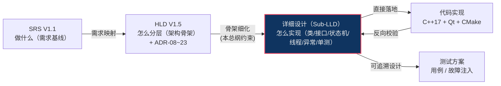

# EnerSentry 储能上位机系统 —— 详细设计说明书（总纲）

> **文档编号**：ENS-LLD-000  
> **版本**：V1.3  
> **日期**：2026-08-13  
> **状态**：正式发布（基线规范）  
> **编制依据**：  
> - 《EnerSentry 储能上位机系统-软件需求规格说明书（SRS）V1.1》（ENS-SRS-001）  
> - 《EnerSentry 储能上位机系统-概要设计说明书（HLD）V1.5》（ENS-HLD-001）  
> - 《EnerSentry 储能上位机系统-线程模型与并发设计专题报告 V1.0》（ENS-CONC-001）  
> **后续文档**：各子模块《详细设计说明书》（Sub-LLD，编号 ENS-LLD-XXX）、《测试方案》

---

## 文档修订记录

| 版本 | 日期 | 修订人 | 修订内容 |
|------|------|--------|---------|
| V1.0 | 2026-08-13 | 系统架构师 | 初始版本，定义 LLD 总纲：定位、标准模板、全局编号规则、模块索引矩阵、SRS-HLD-LLD 追溯矩阵、全局工程不变式 |
| V1.1 | 2026-08-13 | 系统架构师 | 评审后补充：RingBuffer 慢消费者淘汰、SQLite 跨月 ATTACH 并发控制、SBO 锁进程崩溃恢复三条细化要求 |
| V1.2 | 2026-08-13 | 系统架构师 | 第二轮评审后补充：RingBuffer 容量预算与高频/低频分级策略、AttachGuard 条件变量超时避免查询饥饿、SBO 启动清除指令平滑队列异步下发 |
| V1.3 | 2026-08-13 | 系统架构师 | 第三轮评审后补充：RingBuffer 慢消费者跳跃后数据帧完整性检验、SQLite 退化分支内存分配器保护、工程约束 CI/CD 规则固化 |

---

## 目录

1. [引言与总纲定位](#1-引言与总纲定位)
2. [详细设计规范与标准模板（Standard LLD Template）](#2-详细设计规范与标准模板standard-lld-template)
3. [全局编号规则（Numbering Rules）](#3-全局编号规则numbering-rules)
4. [各模块 LLD 索引与责任分配表（Module LLD Index Matrix）](#4-各模块-lld-索引与责任分配表module-lld-index-matrix)
   - 4.1 模块 LLD 索引矩阵
   - 4.2 索引覆盖度校验
   - 4.3 评审补充交付要求
5. [SRS - HLD - LLD 完整追溯矩阵（Traceability Matrix）](#5-srs---hld---lld-完整追溯矩阵traceability-matrix)
6. [编码落地通用工程约束（Technical Invariants）](#6-编码落地通用工程约束technical-invariants)
   - 6.1 `Sample` 原子对齐与无锁 RingBuffer 读写屏障
     - 6.1.1 慢消费者淘汰机制
     - 6.1.2 RingBuffer 容量与内存预算
     - 6.1.3 慢消费者跳跃后的数据帧完整性检验
   - 6.2 `PlatformMMap` 跨平台抽象与 `backup & recreate`
   - 6.3 `DeviceSboGuard` 设备级细粒度锁
     - 6.3.1 进程崩溃恢复
     - 6.3.2 启动清除指令的平滑队列异步下发
   - 6.4 RS485 链路熔断状态机
   - 6.5 UI 层 `QTimer` 批处理重绘与降采样
   - 6.6 SQLite 跨月 ATTACH 查询与并发读写锁竞争
     - 6.6.1 避免查询饥饿：带超时阈值的读写条件变量
     - 6.6.2 退化分支的内存分配器保护
   - 6.7 全局约束速查（评审 Checklist）
   - 6.8 工程约束的 CI/CD 固化（自动化规则）

---

## 1. 引言与总纲定位

### 1.1 编写目的

本文档是 EnerSentry 储能上位机系统的**详细设计说明书总纲（Master LLD）**，是连接《概要设计说明书（HLD V1.5）》与后续各子模块《详细设计说明书（Sub-LLD）》之间的**强制性桥梁规范文档**。其核心目标：

- **统一编写规范**：为所有 Sub-LLD 提供统一的 Markdown 标准模板（见第 2 章），确保各模块设计文档结构一致、粒度一致、可追溯；
- **统一编号与命名**：定义子模块 LLD 文档编号、架构/模块编号、接口/代码对象命名、设计决策（ADR）编号规则（见第 3 章），消除命名歧义；
- **建立索引与责任分配**：梳理需独立编制 LLD 的全部子模块，建立"LLD 编号 ↔ 架构层级 ↔ CMake Target ↔ 构建类型 ↔ 核心负责类 ↔ 撰写优先级"的索引矩阵（见第 4 章）；
- **打通端到端追溯**：建立从 SRS 需求项 → HLD 架构设计/ADR 决策 → LLD 文档/模块的完整追溯链路（见第 5 章），保证每条关键需求都有落地的详细设计归属；
- **固化硬性工程约束**：汇总 HLD V1.5 约定的全局关键技术不变式（Technical Invariants），作为所有 Sub-LLD 必须遵守的底层规则（见第 6 章）。

**预期读者**：系统架构师、详细设计工程师、高级开发工程师、测试工程师、技术评审人员、技术管理者。

### 1.2 适用范围

本总纲适用于 EnerSentry 储能上位机系统**全部软件子模块的详细设计阶段**，覆盖：

- 五层架构（L1 通信接入层、L2 协议处理层、L3 数据中枢层、L4 业务逻辑层、L5 UI 视图层）下的所有静态库/动态库模块；
- 7 大功能模块（电站总览、实时曲线、告警中心、历史趋势、参数配置、通信诊断、设备模拟器）；
- 3 项横向能力（本地控制 SBO、RBAC 权限管理、数据生命周期管理）；
- 独立运行的设备模拟器进程（Simulator）。

**不适用范围**：纯需求论证（属 SRS）、纯架构骨架（属 HLD）、UI 视觉稿件（属 UI-DD / 交互设计文档）、单测/集成测试执行计划（属《测试方案》）。

### 1.3 参考依据

| 编号 | 文档名称 | 版本 | 关键引用 |
|------|---------|------|---------|
| REF-SRS | EnerSentry SRS | V1.1 | 功能/非功能需求条目、7.5 节设计约束 |
| REF-HLD | EnerSentry HLD | V1.5 | 五层架构、ADR-08~23、CMake 混合构建、核心数据结构 |
| REF-CONC | 线程模型与并发设计专题报告 | V1.0 | 线程拓扑、无锁模型、熔断并发、ADR 落地细节 |
| REF-BP | 项目蓝图 | V2.0 | 量化性能基线、业务场景 |
| REF-DD | DBDD（数据库设计说明书） | — | 表结构、索引、分库策略 |
| REF-ICD | ICD/IDD 接口控制文档 | — | 接口契约、字节序、寄存器映射 |
| REF-UI | UI-DD / 交互设计文档 | — | 暗色主题、布局、交互流 |

### 1.4 详细设计说明书（LLD）在研发周期中的定位

LLD 位于 HLD 与代码实现之间，是"架构骨架 → 可编码规格"的最后一公里：



**上下游关系原则**：

| 关系 | 约束 |
|------|------|
| HLD → LLD | LLD 必须继承 HLD 的五层边界、核心类名、接口契约（如 `IChannel`、`IDataAccess`、`Sample`、`DeviceSboGuard`），**不得推翻 HLD 已固化决策**（ADR-08~23）；若需变更，须回到 HLD 发起 ADR 修订并以 `ADR-LLD-XX` 记录 |
| LLD → 代码 | LLD 是编码的直接依据；凡 LLD 中出现的类、接口、结构体、信号槽、线程归属，代码必须一一对应实现 |
| LLD → 测试 | 每个 Sub-LLD 的"单元测试策略"章节须能派生出可执行的测试用例，故障注入场景（FR-SIM-05a~e、FR-CTRL-07）须有对应用例 |

---

## 2. 详细设计规范与标准模板（Standard LLD Template）

所有子模块 LLD（编号 ENS-LLD-XXX）**必须**严格遵循以下 Markdown 标准模板。模板已内置 HLD V1.5 的核心约束占位符，撰写时不得删除章节，仅需填充内容。

```markdown
# ENS-LLD-XXX 《<模块名称> 详细设计说明书》

> 文档编号：ENS-LLD-XXX ｜ 版本：V1.0 ｜ 所属架构层级：Lx ｜ 对应 CMake Target：ens::xxx
> 构建类型：STATIC / SHARED ｜ 核心负责类：XxxClass ｜ 关联 ADR：ADR-xx / ADR-LLD-xx

## 1. 模块概述
- 职责边界（一句话说明本模块做什么、不做什么）
- 在五层架构中的位置（Lx）与上下游依赖（仅通过哪些抽象接口交互）
- 关联 SRS 需求项（FR-xxx / NFR-xxx）与 HLD 章节（§x.x）

## 2. 类图设计（Class Diagram）
- 使用 Mermaid classDiagram 或带说明的表格
- 标注所有 public/protected 接口、关键成员变量
- 抽象接口必须标注 <<interface>>，并列出其所有纯虚函数

## 3. 核心时序 / 状态机图
- 关键交互序列：使用 Mermaid sequenceDiagram
- 关键状态迁移：使用 Mermaid stateDiagram-v2
- 例：SBO 状态机 Idle→Selecting→Armed→Operate/Aborted；RS485 熔断 HEALTHY→DEGRADED→ISOLATED→PROBING

## 4. 关键 API 与结构体定义（C++17 类型约束）
- 公开头文件中的类声明、接口签名（带 noexcept / const / override 标注）
- 结构体定义须标注 alignas / static_assert 等编译期约束
- 示例（必须与 HLD 一致）：
  struct ENS_CACHE_ALIGN Sample { uint64_t timestamp; uint32_t pointId; float value; };
  static_assert(sizeof(Sample) == 16, "Sample must be 16 bytes");
  static_assert(std::atomic<Sample>::is_always_lock_free, "lock-free required");

## 5. 线程与并发模型
- 本模块归属哪个工作线程（参考 ENS-CONC-001 线程拓扑）
- 使用的同步原语（无锁 atomic / std::mutex / QMutex / QReadWriteLock）
- 跨线程通信方式（信号槽 QueuedConnection / invokeMethod）
- 是否读写 L1 RingBuffer / WriteBuffer，是否持锁，持锁时间预算

## 6. 异常处理与边界路径
- 枚举所有异常分支（超时 / 校验失败 / 文件锁 / 磁盘满 / 句柄泄漏）
- 明确每条异常路径的恢复策略（重试 / 降级 / 熔断 / 丢弃）
- RAII 守卫要求（如 ATTACH/DETACH、文件句柄、锁）

## 7. 单元测试策略
- 测试框架（GoogleTest / QtTest）
- 关键用例清单（覆盖正常路径 + 边界路径 + 故障注入）
- 性能基准用例（如 5000 点/秒、60FPS、<100ms 告警延迟）
- Mock 策略（如注入 IMappedFile / IChannel mock）
```

### 2.1 模板强制章节说明

| 章节 | 必写内容 | 常见错误（禁止） |
|------|---------|----------------|
| 类图设计 | 列出全部可被上层调用的公开类/接口；抽象基类标 `<<interface>>` | 仅画框不列方法；混用 `IChannel` 与 `Channel`（接口与实现不分） |
| 状态机 | 列出**全部**状态与**全部**迁移边（含异常边） | 遗漏断线/超时/权限回收等边；状态名与 HLD 不一致 |
| C++17 约束 | Hot-path 结构体必须带 `alignas(16)` + 双重 `static_assert` | 用裸 `struct` 不加对齐与 lock-free 断言 |
| 并发模型 | 明确线程归属、锁粒度、持锁时间预算 | "数据到达即 `replot()`"；工作线程直接操作 UI 控件 |
| 异常路径 | 覆盖 HLD 已识别的边界场景 | 只写正常路径；忽略 Windows 文件锁 / 磁盘满 |
| 单测策略 | 用例可追溯至 SRS 需求与 HLD 验收检查项 | 仅写"编写单元测试"无具体用例 |

---

## 3. 全局编号规则（Numbering Rules）

### 3.1 文档编号规则

#### 3.1.1 总纲文档

| 文档 | 编号 |
|------|------|
| 详细设计说明书（总纲） | `ENS-LLD-000` |

#### 3.1.2 子模块 LLD 文档编号 `ENS-LLD-XXX`

格式：`ENS-LLD-<3位序号>`，其中**百位数字映射所属架构层级**，确保编号即可判层：

| 百位段 | 映射层级 / 类别 | 说明 |
|--------|----------------|------|
| `1xx` | L1 通信接入层 | 通道抽象与实现 |
| `2xx` | L2 协议处理层 | Modbus 引擎 / 调度 / 点表 |
| `3xx` | L3 数据中枢层 | RingBuffer / 黑匣子 / L2 持久化 / 降采样 / 总线 |
| `4xx` | L4 业务逻辑层 | 告警 / SBO / RBAC / 配置 / 查询 / 诊断 |
| `5xx` | L5 UI 视图层 | 各功能页 + 主框架 |
| `7xx` | 设备模拟器（独立进程） | Simulator 专属 |
| `8xx` | 应用基础设施 | 线程模型 / 主入口 / 全局管理 |

示例：`ENS-LLD-301` = L3 数据中枢层的 L1 Ring Buffer 与快照库详细设计。

> **约束**：子模块 LLD 不得跨百位段借用编号；若某模块横跨两层（如"数据生命周期"横向能力落在 L3），以**主要承担层**定段，并在矩阵中标注横向属性。

### 3.2 架构与模块编号规则

#### 3.2.1 五层架构层级编号

| 层级编号 | 层级名 | 职责一句话 |
|---------|--------|-----------|
| L1 | 通信接入层（Channel Layer） | 隔离物理通道（RS485/TCP/CAN），提供统一字节流读写 |
| L2 | 协议处理层（Protocol Layer） | Modbus 编解码、点表映射、多链路轮询调度 |
| L3 | 数据中枢层（Data Hub Layer） | 实时缓存、分级存储、降采样、黑匣子、数据总线 |
| L4 | 业务逻辑层（Business Logic Layer） | 告警判定、SBO 控制、RBAC、配置、查询、诊断 |
| L5 | UI 视图层（UI Layer） | 数据可视化与用户交互 |

#### 3.2.2 模块编号（功能模块 / 横向能力）

沿用 SRS 2.2 的统一编号，供 LLD 内文交叉引用：

| 模块编号 | 名称 | 性质 | 主层级 |
|---------|------|------|--------|
| ① | 电站总览（OV） | 功能模块 | L5→L3 |
| ② | 实时曲线（RT） | 功能模块 | L5→L3 |
| ③ | 告警中心（AL） | 功能模块 | L5→L4→L3 |
| ④ | 历史趋势（HT） | 功能模块 | L5→L3 |
| ⑤ | 参数配置（CFG） | 功能模块 | L5→L4 |
| ⑥ | 通信诊断（DG） | 功能模块 | L5→L2→L1 |
| ⑦ | 设备模拟器（SIM） | 功能模块（独立进程） | 独立 |
| ⑧ | 本地控制 SBO（CTRL） | 横向能力 | L5→L4→L2 |
| ⑨ | RBAC 权限管理（AUTH） | 横向能力 | L4 |
| ⑩ | 数据生命周期管理（DLM） | 横向能力 | L3 |

### 3.3 接口与代码对象命名规范

#### 3.3.1 类名 / 结构体命名

| 类别 | 命名规约 | 示例（HLD 已固化，必须沿用） |
|------|---------|------------------------------|
| 抽象接口类 | 大写的 `I` 前缀 + 驼峰 | `IChannel`、`IProtocolEngine`、`IDataAccess`、`IBusinessEngine`、`IUIController`、`ISBOStateMachine` |
| 工厂类 | `XxxFactory` | `ChannelFactory` |
| 具体实现类 | 名词/动名词驼峰 | `SerialChannel`、`TcpChannel`、`CanChannel`、`ModbusEngine`、`PollScheduler`、`PointTable`、`RingBuffer`、`L1SnapshotStore`、`BlackBoxManager`、`L2HistoryStore`、`DownSampler`、`DataBus`、`AlarmEngine`、`SBOStateMachine`、`AuthManager`、`SessionManager`、`ConfigManager`、`QueryEngine`、`DiagManager` |
| 关键结构体 | 名词驼峰，Hot-path 结构体须配对齐宏 | `Sample`、`SampleWithMeta`、`SboDeviceKey`、`ArmedOccupant`、`SwapHeader`、`SwapSlot`、`ChannelConfig`、`DownSampledSample`、`ControlCommand`、`AlarmRecord` |
| 跨平台实现类 | 平台后缀 | `Win32MMap`、`PosixMMap`、`SocketCanDriver`、`ZlgCanDriver` |
| UI 控件类 | `XxxWidget` | `MainWindow`、`OverviewWidget`、`RealtimeChartWidget`、`AlarmCenterWidget`、`HistoryTrendWidget`、`ConfigWidget`、`DiagWidget`、`SBOControlWidget` |

#### 3.3.2 导出宏（仅 SHARED 模块使用）

遵循 HLD §2.6.5 的符号导出宏约定，宏定义统一位于 `include/ens/export.hpp`：

| 模块 | 导出宏前缀 | 宏示例 | 使用条件 |
|------|-----------|--------|---------|
| `ens::channel`（SHARED） | `ENS_CHANNEL_` | `ENS_CHANNEL_API`、`ENS_CHANNEL_EXPORTS` | 公开接口头必须标注 `ENS_CHANNEL_API` |
| `ens::business`（SHARED） | `ENS_BUSINESS_` | `ENS_BUSINESS_API`、`ENS_BUSINESS_EXPORTS` | 公开接口头必须标注 `ENS_BUSINESS_API` |
| `ens::protocol` / `ens::datahub` / `ens::ui`（STATIC） | — | 无导出宏 | 符号默认全部可见，无需标注 |

> **规则**：SHARED 模块的**每一个**公开类/函数声明前必须带对应 `*_API` 宏；STATIC 模块严禁引入导出宏（否则跨平台 CI 编译报错）。

#### 3.3.3 命名空间

统一根命名空间 `ens`，按层细分：

```cpp
namespace ens::channel { /* L1 */ }
namespace ens::protocol { /* L2 */ }
namespace ens::datahub { /* L3 */ }
namespace ens::datahub::platform { /* PlatformMMap 等跨平台抽象 */ }
namespace ens::business { /* L4 */ }
namespace ens::ui { /* L5 */ }
namespace ens::app { /* 应用入口 / ThreadManager */ }
```

#### 3.3.4 信号 / 槽命名

- 信号（signal）：`onXxxChanged` / `xxxReceived` / `xxxRecovered` / `xxxIsolated` / `armedCleared` 等，语义化、过去式/被动式；
- 槽（slot）：`onXxx`（响应信号）、`handleXxx`（处理事件）；
- 跨线程连接**必须显式** `Qt::QueuedConnection`（采集/告警/渲染准备线程 → UI 主线程）。

### 3.4 设计决策编号（ADR）

#### 3.4.1 HLD 级 ADR（已固化，继承）

HLD V1.5 已发布 ADR-08 ~ ADR-23，Sub-LLD 直接引用，**不得重定义**：

| ADR | 决策主题 | 关联模块 |
|-----|---------|---------|
| ADR-08 | L1 Ring Buffer 16 字节对齐 + `atomic<Sample>` | L3 |
| ADR-09 | SQLite 按月分库 | L3 |
| ADR-10 | 告警风暴抑制 | L4 |
| ADR-11 | FetchContent + vcpkg 依赖管理 | 全局 |
| ADR-12 | STATIC + SHARED 混合构建 | 全局 CMake |
| ADR-13 | RS485 从站三级熔断状态机 | L2 |
| ADR-14 | Critical 告警 mmap 即时落盘 | L3 |
| ADR-15 | ATTACH DATABASE + 只读连接池跨月查询 | L3 |
| ADR-16 | SBO Armed 计时器全站独占（V1.4，已被 ADR-23 细化） | L4 |
| ADR-17 | SQLite 落盘四级熔断极值保护 | L3 |
| ADR-18 | `static_assert(is_always_lock_free)` 编译期守卫 | L3 |
| ADR-19 | 单次跨月查询 ≤ 3 个月限制 | L3 |
| ADR-20 | `PlatformMMap` 跨平台抽象层 | L3 |
| ADR-21 | ATTACH RAII 守卫 + `release()` 兜底清理 | L3 |
| ADR-22 | UI 渲染降采样 ≤ 2000 点 + QTimer 30/60Hz | L5 |
| ADR-23 | SBO `DeviceSboGuard` 设备级逻辑锁 | L4 |

#### 3.4.2 Sub-LLD 级 ADR（扩展）

详细设计阶段产生的新决策使用 **`ADR-LLD-XX`** 编号，由 Sub-LLD 作者提出、首席架构师评审归档：

- 格式：`ADR-LLD-<2位序号>`，如 `ADR-LLD-01`、`ADR-LLD-02`；
- 每个 Sub-LLD 文档头部的"关联 ADR"字段须同时列出 HLD 级 ADR 与本文档新增的 `ADR-LLD-XX`；
- `ADR-LLD-XX` 仅用于细化 HLD 决策（如某算法选型、某缓存容量定值），**不得推翻** ADR-08~23；如需推翻，须升级为 HLD 修订并重新编号。

---

## 4. 各模块 LLD 索引与责任分配表（Module LLD Index Matrix）

下表覆盖 **7 大功能模块 + 3 项横向能力 + 独立模拟器进程 + 应用基础设施**，共 **26 个** 需用独立 Sub-LLD 编制的子模块。每个子模块均映射至 HLD 五层架构、CMake Target、构建类型、核心负责类与撰写优先级。

### 4.1 索引矩阵总表

| LLD 编号 | 模块名称 | 所属架构层级 | 对应 CMake Target | 构建类型 | 核心负责类 | 建议撰写优先级 |
|---------|---------|------------|------------------|---------|-----------|--------------|
| ENS-LLD-101 | 接入层抽象与通道实现 | L1 | `ens::channel` | SHARED | `IChannel`、`SerialChannel`、`TcpChannel`、`CanChannel` | P0 |
| ENS-LLD-102 | 通道工厂与配置装配 | L1 | `ens::channel` | SHARED | `ChannelFactory`、`ChannelConfig` | P1 |
| ENS-LLD-201 | Modbus 协议引擎 | L2 | `ens::protocol` | STATIC | `ModbusEngine`、`ModbusFrame` | P0 |
| ENS-LLD-202 | 轮询调度与 RS485 熔断 | L2 | `ens::protocol` | STATIC | `PollScheduler`、`SlavePollState` | P0 |
| ENS-LLD-203 | 点表解析器 | L2 | `ens::protocol` | STATIC | `PointTable` | P1 |
| ENS-LLD-301 | L1 Ring Buffer 与快照库 | L3 | `ens::datahub` | STATIC | `RingBuffer`、`L1SnapshotStore` | P0 |
| ENS-LLD-302 | 黑匣子快照与跨平台 mmap | L3 | `ens::datahub` | STATIC | `BlackBoxManager`、`CriticalSwapFile`、`PlatformMMap`、`CriticalSwapRecovery` | P0 |
| ENS-LLD-303 | L2 历史持久化与数据访问 | L3 | `ens::datahub` | STATIC | `L2HistoryStore`、`IDataAccess`、`SQLiteDataAccess`、`ReadOnlyConnectionPool`、`AttachGuard` | P0 |
| ENS-LLD-304 | 降采样器 | L3 | `ens::datahub` | STATIC | `DownSampler` | P1 |
| ENS-LLD-305 | 实时数据总线 | L3 | `ens::datahub` | STATIC | `DataBus` | P1 |
| ENS-LLD-306 | 数据生命周期管理（横向） | L3 | `ens::datahub` | STATIC | `LifecycleManager`、`DataCleaner` | P1 |
| ENS-LLD-401 | 告警引擎 | L4 | `ens::business` | SHARED | `AlarmEngine` | P0 |
| ENS-LLD-402 | SBO 状态机与设备级锁 | L4 | `ens::business` | SHARED | `SBOStateMachine`、`DeviceSboGuard`、`SboDeviceKey`、`ArmedOccupant` | P0 |
| ENS-LLD-403 | RBAC 权限管理（横向） | L4 | `ens::business` | SHARED | `AuthManager`、`SessionManager` | P0 |
| ENS-LLD-404 | 配置管理器 | L4 | `ens::business` | SHARED | `ConfigManager` | P1 |
| ENS-LLD-405 | 历史查询引擎 | L4 | `ens::business` | SHARED | `QueryEngine`、`HistoryQueryService` | P1 |
| ENS-LLD-406 | 诊断管理器 | L4 | `ens::business` | SHARED | `DiagManager` | P2 |
| ENS-LLD-501 | 主框架与暗色主题 | L5 | `ens::ui` | STATIC | `MainWindow` | P1 |
| ENS-LLD-502 | 电站总览模块 | L5 | `ens::ui` | STATIC | `OverviewWidget`、`DrillDownNavigator` | P1 |
| ENS-LLD-503 | 实时曲线模块 | L5 | `ens::ui` | STATIC | `RealtimeChartWidget`、`RealtimePlotWidget`、`RenderDownsampler`、`OpenGLDetector` | P0 |
| ENS-LLD-504 | 告警中心模块 | L5 | `ens::ui` | STATIC | `AlarmCenterWidget` | P1 |
| ENS-LLD-505 | 历史趋势模块 | L5 | `ens::ui` | STATIC | `HistoryTrendWidget` | P1 |
| ENS-LLD-506 | 参数配置模块 | L5 | `ens::ui` | STATIC | `ConfigWidget` | P2 |
| ENS-LLD-507 | 通信诊断模块 | L5 | `ens::ui` | STATIC | `DiagWidget` | P2 |
| ENS-LLD-508 | SBO 控制台模块 | L5 | `ens::ui` | STATIC | `SBOControlWidget` | P1 |
| ENS-LLD-SIM | 设备模拟与故障注入 | 独立进程（7xx 段，文档见 `04-测试台/`） | `ens::sim`（STATIC）/`DeviceSimulator`（EXECUTABLE） | — | `SimulatorEngine`、`PointGenerator`、`ModbusSlaveEmulator`、`FaultInjector`、`ScenarioScript` | P0 |
| ENS-LLD-801 | 应用入口与线程模型 | 应用基础设施 | `ens::app` | EXECUTABLE | `ThreadManager` | P0 |

### 4.2 索引覆盖度校验

| 维度 | 要求 | 覆盖确认 |
|------|------|---------|
| 7 大功能模块 | ①~⑦ | ✅ 502/503/504/505/506/507 覆盖 ①~⑥；701 覆盖 ⑦ |
| 3 项横向能力 | ⑧ SBO / ⑨ RBAC / ⑩ 数据生命周期 | ✅ 402 覆盖 ⑧；403 覆盖 ⑨；306 覆盖 ⑩ |
| 独立模拟器进程 | Simulator | ✅ 701 |
| 应用基础设施 | 线程模型/主入口 | ✅ 801 + 501 |
| 五层全映射 | L1~L5 | ✅ 101/102(L1) · 201/202/203(L2) · 301~306(L3) · 401~406(L4) · 501~508(L5) |

### 4.3 评审补充交付要求（V1.1 新增）

以下三条来自详细设计评审（2026-08-13），必须在对应 Sub-LLD 中明确细化，并成为设计评审的强制检查项：

| 子模块 LLD | 补充要求 | 必须在文档中明确的内容 |
|-----------|---------|----------------------|
| **ENS-LLD-301** | RingBuffer 慢消费者淘汰机制 | 多消费者游标 `m_consumerCursors[id]` 的滞后判定条件；eviction 时游标推进策略；避免读到被覆写脏数据的屏障；`slow_consumer_evicted` / `consumer_rate_degraded` / `consumer_recovered` 日志与告警 |
| **ENS-LLD-303** | SQLite 跨月 ATTACH 并发控制 | `AttachGuard` RAII 实现；单连接 ATTACH 数量上限；`DETACH` 超时释放；写事务避让策略；ATTACH 失败回退为逐库查询 + 内存合并 |
| **ENS-LLD-402** | SBO 锁进程崩溃恢复 | 启动时扫描未关闭 Armed 记录；向站下发"取消 / 清除 Armed"指令；等待确认与超时重试；Guard 状态重置；审计日志写入 |
| **ENS-LLD-301** | RingBuffer 容量预算与高频/低频分级 | 全站 10,000 点内存核算；高频核心点 500~1,000 个 100ms/1h；普通点 1s~5s/15~30min；`RingBufferPolicy` 配置表；总 L1 内存 ≤ 1.0 GB |
| **ENS-LLD-303** | AttachGuard 条件变量超时避免查询饥饿 | `std::condition_variable` 等待 `batchCommitted`；单次等待 ≤ 50ms；总等待 ≤ 200ms；超时时触发"逐库查询 + 内存合并" |
| **ENS-LLD-402** | SBO 启动清除指令平滑队列异步下发 | `SboResetQueue` 独立后台线程；20~50ms 间隔；单线程顺序消费；与 `PollScheduler` 共享 `IChannel` 低优先级插入；不阻塞系统启动 |
| **ENS-LLD-301** | RingBuffer 慢消费者跳跃后数据帧完整性检验 | 槽位 `Slot` 增加 `sequence`/`epoch` 版本号；跳跃后首次读取校验 `epoch`/`sequence`；二次校验 `m_publishedPos`；`ringbuffer_frame_torn` 告警 |
| **ENS-LLD-303 / ENS-LLD-405** | SQLite 退化分支内存分配器保护 | 单次查询结果集行数 ≤ 100,000；内存 ≤ 256MB；跨月分库 ≤ 12 个；归并排序优先外排；超限返回 `TooManyRows` 并提示分页/降采样 |
| **全局（所有 Sub-LLD）** | 工程约束 CI/CD 固化 | `tools/ci-checks/` 脚本：STATIC 模块误用导出宏、UI 槽函数阻塞 I/O、L5 包含实现类头文件、双 `static_assert`、mmap API 黑名单、RS485 重试次数；所有检查失败须阻断合入 |

---

## 5. SRS - HLD - LLD 完整追溯矩阵（Traceability Matrix）

下表建立端到端追溯：**SRS 需求项 → HLD 架构设计/ADR 决策 → LLD 文档/模块**，确保关键需求均有落地设计归属。覆盖任务指定的重点项（NFR-PERF-02、NFR-PERF-12、FR-CTRL-07、ADR-14/15/22、ADR-13、NFR-PERF-03）并扩展至全模块。

| SRS 需求项 | 需求简述 | HLD 架构设计 / ADR 决策 | 关联 LLD 文档 |
|-----------|---------|------------------------|---------------|
| **NFR-PERF-02** | 100ms 高频采集（BMS 极速包） | L1 采集线程 #2（HIGHEST）；BMS 走独立 TCP 通道；L1 RingBuffer 无锁写入 | ENS-LLD-101, 201, 301, 801 |
| **NFR-PERF-12** | ≥ 5000 点/秒落库 | L2 SQLite WAL + 批量事务（ADR-09 按月分库）；双触发（100ms/满 1000） | ENS-LLD-303, 304 |
| **NFR-PERF-03** | UI ≥ 60 FPS 渲染 | L5 渲染准备线程 + QTimer 批处理 + Min-Max 降采样（ADR-22） | ENS-LLD-503, 801 |
| **NFR-PERF-11** | RS485 带宽约束 | L2 半双工串行调度；BMS 高频包走 TCP/CAN | ENS-LLD-201, 202 |
| **NFR-PERF-13** | 8 通道曲线 60FPS | QCustomPlot 局部刷新 / OpenGL 后端 / rpQueuedReplot | ENS-LLD-503 |
| **NFR-PERF-01** | 单站 ≥ 10,000 测点 | L3 L1 分级缓冲（高频/低频分离） | ENS-LLD-301, 303 |
| **NFR-PERF-04** | CPU < 15% | 线程隔离 + 无锁热路径 + UI 降采样 | ENS-LLD-503, 801 |
| **NFR-PERF-05** | 内存 < 2 GB | L1 容量预算（≈1.2GB） | ENS-LLD-301 |
| **NFR-PERF-06** | 告警端到端 < 100ms | L4 告警线程 HIGH 优先级 + 黑匣子预拷贝 | ENS-LLD-401, 302 |
| **NFR-PERF-08** | 24h < 1s / 7d < 3s 查询 | L3 ATTACH + 只读连接池（ADR-15） | ENS-LLD-303, 405 |
| **NFR-REL-02/03/04/05** | 容错/完整性/恢复/隔离 | L1 重连指数退避；CRC 丢弃；WAL 恢复；RS485 熔断（ADR-13） | ENS-LLD-101, 201, 202, 303 |
| **NFR-REL-01** | 7×24 内存增长 < 5% | 无锁 + RAII；`try-catch` 包裹 run() | ENS-LLD-801 |
| **NFR-SEC-03/04/05** | 权限隔离/审计/SBO 安全 | L4 RBAC 三级矩阵；审计日志；SBO 状态机 | ENS-LLD-403, 402, 508 |
| **NFR-SEC-06** | 会话超时/失败锁定 | `AuthManager::lockSession()`；bcrypt 哈希 | ENS-LLD-403 |
| **NFR-PORT-03/04** | 串口抽象 / 数据库可切换 | `IChannel` 抽象；`IDataAccess` 抽象 | ENS-LLD-101, 303 |
| **COMM-12/13** | `IChannel` 统一抽象 | L1 抽象接口 + 三类实现 + 工厂 | ENS-LLD-101, 102 |
| **COMM-03/09** | CRC 校验 / TCP 重连 | L2 查表 CRC；指数退避重连 | ENS-LLD-201 |
| **FR-OV-01~07** | 电站总览与三级钻取 | L5 `OverviewWidget` + `DrillDownNavigator` | ENS-LLD-502 |
| **FR-RT-01~08** | 实时曲线多通道滚动 | L5 `RealtimeChartWidget` + 降采样渲染 | ENS-LLD-503 |
| **FR-AL-01~13** | 告警分级/抑制/确认/黑匣子 | L4 `AlarmEngine` + 风暴抑制（ADR-10）；L3 黑匣子 | ENS-LLD-401, 302, 504 |
| **FR-HT-01~08** | 历史趋势查询/导出 | L4 `QueryEngine` + L3 跨月查询 | ENS-LLD-405, 303, 505 |
| **FR-CFG-01~10** | 点表/阈值/配置热加载 | L4 `ConfigManager` + L2 `PointTable` 热加载 | ENS-LLD-404, 203, 506 |
| **FR-DG-01~06** | 通信诊断/报文抓取 | L4 `DiagManager` + L1 `getStats()` | ENS-LLD-406, 507 |
| **FR-CTRL-01~07** | 本地控制 SBO 双重确认 | L4 `SBOStateMachine` + `DeviceSboGuard`（ADR-23）；断线清除（FR-CTRL-07） | ENS-LLD-402, 508 |
| **FR-CTRL-07** | Armed 断线/超时自动清除 | SBO 状态机 Aborted 分支 + 链路监听 + 500ms 抖动过滤 | ENS-LLD-402 |
| **FR-AUTH-01~06** | 登录/RBAC/会话 | L4 `AuthManager`/`SessionManager` | ENS-LLD-403 |
| **FR-DLM-01~08** | L1/L2 分级 + 黑匣子 + 清理 | L3 RingBuffer/L2/DownSampler/`LifecycleManager`；磁盘熔断（ADR-17） | ENS-LLD-301, 303, 304, 306 |
| **FR-DLM-02** | L1 保留 1h 100ms 全量 | `RingBuffer` 容量 36000 槽/高频点 | ENS-LLD-301 |
| **FR-DLM-03** | 黑匣子 ±30s 锁定 | `BlackBoxManager::triggerBlackBox` | ENS-LLD-302 |
| **FR-DLM-06** | ≥ 5000 点/秒 | L2 批量写入（见 NFR-PERF-12） | ENS-LLD-303 |
| **FR-SIM-01~07** | 设备模拟器/故障注入 | 独立进程 `DeviceSimulator`/`FaultInjector` | ENS-LLD-SIM（位于 `04-测试台/`） |
| **FR-EXP-01~06** | 数据/截图/配置导出 | L4 `QueryEngine` + L5 导出 | ENS-LLD-405, 505, 506 |
| **ADR-13** | RS485 三级熔断 | `PollScheduler` 状态机 HEALTHY→DEGRADED→ISOLATED→PROBING | ENS-LLD-202 |
| **ADR-14 / ADR-15 / ADR-22** | 黑匣子断电保护 / 跨月查询 / UI 渲染（任务重点组） | ADR-14：`CriticalSwapFile`+`PlatformMMap`（ADR-20）mmap 即时落盘；ADR-15：ATTACH 跨月 UNION ALL；ADR-22：UI ≤2000 点 + QTimer 30/60Hz | ENS-LLD-302（ADR-14/20）, 303（ADR-15）, 503（ADR-22） |
| **ADR-20 / ADR-21 / ADR-23** | 跨平台 mmap / ATTACH RAII / 设备级锁 | `PlatformMMap`/`IMappedFile`；`AttachGuard`；`DeviceSboGuard` | ENS-LLD-302（ADR-20）, 303（ADR-21）, 402（ADR-23） |

> **说明**：上表中"ADR-14/15/22"作为断电保护—查询—渲染的协同链路一并列出；三者分属不同 LLD（302/303/503），由 `BlackBoxManager`（302）落盘、`QueryEngine`/`SQLiteDataAccess`（303）回放查询、`RealtimePlotWidget`（503）呈现，共同支撑"事故前后 30s 高频数据不丢失、可回放"。

> **追溯修正（2026-08-14）**：原第 357 行（子模块枚举表）与第 424 行（需求追溯矩阵）中 `FR-SIM-01~07` 引用的 `ENS-LLD-701` 为占位编号（7xx 段未实际产出该文档）。设备模拟器/故障注入详细设计正式文档为 **`ENS-LLD-SIM`**《设备模拟与故障注入模块详细设计说明书》，与概要设计 **`ENS-HLD-SIM`**（《设备模拟与故障注入设计说明》）配对，编号属 7xx 段（设备模拟器独立进程），符合 ENS-LLD-000 §3.1.2。两份文档自 2026-08-14 起由 `02-概要设计/`、`03-详细设计/` 迁移至 **`04-测试台/`** 目录（独立测试台一等公民定位），文档编号 `ENS-HLD-SIM` / `ENS-LLD-SIM` 不变，全文按文档编号引用，无断链。主程序本册其余追溯项不变。

---

## 6. 编码落地通用工程约束（Technical Invariants）

以下五条为 HLD V1.5 固化的**全局关键技术不变式**，所有 Sub-LLD 在"线程与并发模型""C++17 约束""异常路径"章节中**必须**逐条落实，并在代码评审中作为硬性检查项。

### 6.1 不变式一：`Sample` 结构体 `alignas(16)` 原子对齐与无锁 RingBuffer 读写屏障

**来源**：ADR-08、ADR-18；HLD §3.2.1.1；ENS-CONC-001 §2。

- `Sample` 必须显式 16 字节对齐，确保 x86-64 单条 `movaps` 原子读写，杜绝撕裂读：

```cpp
// datahub/Sample.h
#if defined(_MSC_VER)
    #define ENS_CACHE_ALIGN __declspec(align(16))
#elif defined(__GNUC__) || defined(__clang__)
    #define ENS_CACHE_ALIGN __attribute__((aligned(16)))
#else
    #define ENS_CACHE_ALIGN alignas(16)
#endif

struct ENS_CACHE_ALIGN Sample {
    uint64_t timestamp;   // 8B
    uint32_t pointId;     // 4B
    float    value;       // 4B  ← 合计恰好 16 字节
};
static_assert(sizeof(Sample) == 16, "Sample must be 16 bytes for atomic access");
static_assert(std::atomic<Sample>::is_always_lock_free,
              "Sample (16B aligned) must be lock-free on this platform! "
              "Check: x86-64 OK; 32-bit x86 / ARMv7 may fail.");
```

- `RingBuffer<Sample>` 采用二级发布指针模型：
  - `m_writePos`（`atomic<size_t>`，relaxed）— 生产者单线程推进；
  - `m_publishedPos`（`atomic<size_t>`，release 写 / acquire 读）— 消费者可读安全上限；
  - `m_consumerCursors[id]`（`atomic<size_t>`）— 各消费者独立游标，互不竞争；
  - 生产者：`store(data)` → `atomic_thread_fence(release)` → `store(m_publishedPos, release)`；
  - 消费者：仅读取 `≤ m_publishedPos` 的数据（`acquire`），永不读"已 fetch_add 但未发布"的槽位；
  - 容量须为 2 的幂（`Capacity & (Capacity-1) == 0`），用位掩码代替取模。
- **禁止**：对 `Sample` 使用非对齐结构体、在未发布前让消费者读取、多生产者写入同一 RingBuffer。

#### 6.1.1 慢消费者淘汰机制（Slow Consumer Eviction Strategy）

**来源**：ENS-CONC-001 §2；LLD 评审意见（2026-08-13）。

`RingBuffer<Sample>` 的多消费者游标 `m_consumerCursors[id]` 相互独立。若某后台消费者（如 L2 历史持久化线程）因磁盘 I/O 阻塞导致游标严重落后，而生产者以 100ms 周期高频写入，环形缓冲区终将发生覆盖（Overwrite）。**ENS-LLD-301 必须明确定义慢消费者丢包 / 赶超策略**，避免慢消费者读到被覆写的脏数据：

| 场景 | 判定条件 | 处理策略 | 日志/告警 |
|------|---------|---------|----------|
| 消费者滞后 | `m_publishedPos - m_consumerCursors[id] >= Capacity` | 强制将该消费者游标推进至 `m_publishedPos - Capacity + 1`（即跳转到当前可读取的最老有效槽位） | `LOG_WARN` 记录 `slow_consumer_evicted`，包含消费者 ID、跳过的样本数、当前 `publishedPos` |
| 追赶窗口 | 游标已推进但消费速率仍低于生产者 50% 持续 ≥ 5s | 触发 `consumer_rate_degraded` 告警，提示运维扩容或优化持久化路径 | `LOG_WARN` |
| 恢复正常 | 游标持续 5s 内未再触发 eviction | 发送 `consumer_recovered` 事件 | `LOG_INFO` |

- 推进游标前必须先执行 `atomic_thread_fence(acquire)`，确保读取到最新 `m_publishedPos`；推进操作使用 `compare_exchange_weak` 或 `store(release)`，保证其他线程可见。
- **禁止**：让慢消费者继续按原游标读取（会读到被覆盖的脏 `Sample`）；eviction 时不更新 `m_publishedPos`（只修改本消费者游标）。

#### 6.1.2 RingBuffer 容量与内存预算（NFR-PERF-05）

**来源**：NFR-PERF-05（内存 < 2 GB）；LLD 评审意见（2026-08-13）。

若对全部 10,000 个测点采用统一 100ms 高频全量保留 1 小时，单点需 36,000 槽，全站 RingBuffer 内存约为：

```
36,000 × 16 B × 10,000 ≈ 5.76 GB
```

这将突破 NFR-PERF-05 中"内存 < 2 GB"的硬性约束。**ENS-LLD-301 必须定义高频 / 低频采样点的分级 RingBuffer 策略**：

| 测点类别 | 典型数量 | 采样周期 | L1 保留时长 | 容量/点 | 单点内存 | 总内存估算 |
|---------|---------|---------|------------|--------|---------|-----------|
| **BMS 极速包 / 核心点** | 500~1,000 | 100ms | 1h | 36,000 | 576 KB | 288~576 MB |
| **普通遥测点** | 8,000~9,000 | 1s~5s | 15min~30min | 900~1,800 | 14~29 KB | 120~260 MB |
| **状态 / 事件点** | 500~1,000 | 变化上送 | 5min | 可变 | 按实际 | ≤ 50 MB |
| **合计** | 10,000 | — | — | — | — | **≤ 1.0 GB（预留 1 GB 给 L2/L3/业务/UI）** |

- 分级策略由 `RingBufferPolicy` 配置表驱动，字段包括 `pointId`、`sampleRateMs`、`retentionMs`、`priority`，热加载时由 `ConfigManager` 下发到 `RingBufferAllocator`。
- 高频 RingBuffer 容量按 2 的幂向上取整（如 36,000 → 65,536），低频 RingBuffer 可共享同一物理缓冲区池，通过 `retentionMs` 动态计算游标边界。
- **禁止**：所有测点统一使用 100ms / 1h 全量策略；L1 内存预算超过 1.2 GB 仍不上报 `memory_budget_exceeded` 告警。

#### 6.1.3 慢消费者跳跃后的数据帧完整性检验（Sequence/Epoch 版本号）

**来源**：LLD 评审意见（2026-08-13）。

6.1.1 规定当慢消费者落后超过 `Capacity` 时，强制将其游标推进至 `m_publishedPos - Capacity + 1`。但在生产者极高频写入（如风暴状态）下，慢消费者游标刚被强行推进到新位置，该位置的槽位可能在慢消费者读取动作发生的同时再次被生产者覆盖，导致跳跃后读到的第一帧数据存在跨屏障的数据撕裂。**ENS-LLD-301 必须增加 Sequence/Epoch 版本号检验机制**，确保跳跃后读取的第一帧绝对完整：

```cpp
// 示意：RingBuffer 槽位增加 epoch 与序列号元数据
struct ENS_CACHE_ALIGN Slot {
    Sample sample;
    uint64_t sequence;   // 全局单调递增序列号
    uint32_t epoch;      // 缓冲区轮次（每绕环一次 +1）
    uint32_t _pad;       // 补齐 32B，保持对齐
};
static_assert(sizeof(Slot) == 32, "Slot must be 32 bytes");
```

| 步骤 | 消费者行为 | 校验规则 |
|------|-----------|---------|
| 跳跃前 | 读取当前 `m_publishedPos` 与目标槽位 `epoch` | 记录目标 `sequence` 与 `epoch` |
| 跳跃后首次读取 | 读取目标槽位 | 要求 `slot.epoch == expectedEpoch` 且 `slot.sequence >= expectedSequence`；若 `slot.sequence` 已被覆盖为更大值，说明该槽在跳跃后又被写入，需继续推进到下一个 `epoch` 边界 |
| 发布指针二次校验 | 读完第一个 `Sample` 后 | 再次读取 `m_publishedPos`，确认 `publishedPos - cursor < Capacity`；若不等，说明刚读到的槽位可能已被覆盖，重复跳跃 |
| 告警 | 连续两次完整性校验失败 | 触发 `ringbuffer_frame_torn` 告警，消费者继续等待下一个稳定边界 |

- `epoch` 可用生产者写满一圈后 `fetch_add(1, release)` 生成；消费者用 `acquire` 读取。
- **禁止**：跳跃后直接按原游标无校验读取；用 `m_writePos` 替代 `m_publishedPos` 作为可读边界。

### 6.2 不变式二：`PlatformMMap` 跨平台抽象与 Windows 句柄锁冲突的 `backup & recreate`

**来源**：ADR-20；HLD §3.2.2.2。

- 所有 mmap 操作**必须**经由 `ens::datahub::platform::IMappedFile` 抽象，禁止在业务代码中直接 `#include <sys/mman.h>` 或 `<windows.h>` 的映射 API：
  - Windows：`Win32MMap`（`CreateFileMappingA` / `MapViewOfFile` / `UnmapViewOfFile` / `CloseHandle`）；
  - POSIX：`PosixMMap`（`open` / `mmap(MAP_SHARED)` / `msync` / `munmap` / `close`）；
  - 工厂 `createMappedFile()` 按编译环境自动选择实现。
- `IMappedFile::close()` **必须幂等**（二次调用不抛异常、不重复释放）。
- **Windows 句柄锁冲突恢复**：进程异常退出未 `UnmapViewOfFile` 时，重启会因 `ERROR_SHARING_VIOLATION`（`lastError()==3`，`isLockedByOtherProcess()==true`）无法以 `FILE_SHARE_WRITE` 重开。恢复流程（`CriticalSwapRecovery::start`）必须：
  1. 尝试正常 `open` → 成功则解析 pending 快照；
  2. 失败且判定为锁定 → `QFile::rename` 备份旧文件（`*.backup_<timestamp>`）→ 重新 `open` → `initializeHeader`；
  3. 备份失败 → 删除重建（记录数据丢失风险日志）。
- **禁止**：业务层硬编码 POSIX-only API（导致 MSVC 编译失败）；`close()` 非幂等。

### 6.3 不变式三：`DeviceSboGuard` 按 `linkId+slaveId+registerAddr` 二维 key 的细粒度锁

**来源**：ADR-23（细化 ADR-16）；HLD §3.4.4。

- SBO 并发控制从 V1.4"全站单 Armed"升级为**设备级分桶**：同设备同时刻仅 1 个 Armed，不同设备/不同寄存器地址可独立并发。
- 锁 key 结构体 `SboDeviceKey{ uint32_t linkId; uint32_t slaveId; uint32_t registerAddr; }`，FNV-1a 哈希，`QHash` 分桶；`key_extends_register_addr=true` 时 key 含寄存器地址。
- `DeviceSboGuard::tryAcquire(key, sequenceId, operatorName, outOccupant)` 返回 `false` 即该设备已有 Armed（拒绝并发）；`release(key, sequenceId)` 须校验 `sequenceId` 防误释放；`onArmedTimeout` / 链路断开 / 权限回收均须调用 `release` 释放桶锁。
- 每个 Armed 拥有**独立 `QTimer`**（5s 常规 / 3s 急停，单发），超时自动 Aborted + release；链路抖动设 500ms 容错窗口（避免断-通-断误判）。
- **禁止**：退回 V1.4 全站单一 `QMutex` 槽位（除非 `lock_strategy="global"` 显式兼容）；持有桶锁期间阻塞采集/UI 线程。

#### 6.3.1 进程崩溃恢复（Process Crash Handling for SBO）

**来源**：LLD 评审意见（2026-08-13）；FR-CTRL-07。

`DeviceSboGuard` 在内存中维护 Armed 状态。若上位机进程在控制命令 "Armed" 已下发给底层硬件、但 "Operate" 尚未下发时遭遇意外崩溃或强制杀死，重启后上位机内存中的 Guard 被清空，但底层硬件可能仍处于预置状态，存在误操作风险。**ENS-LLD-402 必须补充"系统启动状态重置 / 同步流程"**，确保软硬件状态强一致：

1. **启动扫描阶段**：`SBOStateMachine` 初始化完成后，遍历所有已配置链路 `linkId`，向 `DeviceSboGuard` 查询持久化/缓存中是否存在未关闭的 Armed 记录；
2. **入平滑队列**：将所有待清除的 `SboDeviceKey` 加入 `SboResetQueue`（线程安全队列），由独立后台线程按固定间隔异步消费；
3. **平滑异步下发**：队列消费者以 **20~50ms 间隔** 逐条通过对应 `IChannel` 向站下发送 **"取消 / 清除 Armed"** 指令（协议语义由 ICD 定义，如 Modbus 写寄存器 `0x0000` 或专用功能码）；
4. **等待确认与超时**：每条清除指令等待响应，超时 3s 重试 1 次；连续失败记录告警但**不阻塞系统启动**；
5. **Guard 状态重置**：收到站下确认或超时完成后，强制将 `DeviceSboGuard` 中对应 `SboDeviceKey` 的状态置为 `Idle` 并 `release(key, sequenceId)`；
6. **审计日志**：所有启动清除动作写入黑匣子 / 持久化审计日志，包含 `linkId+slaveId+registerAddr`、清除时间、响应结果。

- **禁止**：启动后直接允许新的 SBO 流程而不先完成上一轮 Armed 清理；将清除操作放在 UI 线程执行（须由业务线程异步完成）；瞬时并发向所有链路发送清除指令造成 RS485 总线拥塞。

#### 6.3.2 启动清除指令的平滑队列异步下发（Burst Avoidance）

**来源**：LLD 评审意见（2026-08-13）。

6.3.1 要求启动时向所有存在未知 / 未关闭 Armed 状态的设备下发清除指令。若通信链路较多且刚经历全站断电重启，瞬时并发下发可能造成 RS485 半双工总线短时间拥塞，影响正常的通道初始化与首轮轮询。**ENS-LLD-402 必须将启动清除指令设计为平滑队列异步下发**：

```cpp
// 示意结构（以 ENS-LLD-402 最终定义为准）
struct SboResetTask {
    SboDeviceKey key;
    int retryLeft = 1;
    std::chrono::steady_clock::time_point issuedAt;
};

class SboResetQueue {
public:
    void enqueue(std::vector<SboResetTask> tasks);
    void start(std::chrono::milliseconds intervalMs = 30ms);
    void stop();
private:
    void run();
    std::queue<SboResetTask> m_queue;
    std::mutex m_mutex;
    std::condition_variable m_cv;
    std::thread m_worker;
    std::chrono::milliseconds m_interval{30};
};
```

| 参数 | 建议值 | 说明 |
|------|--------|------|
| 队列消费间隔 | **20~50ms** | 默认 30ms；链路数量 > 32 时取上限 50ms，< 8 时可取下限 20ms |
| 单条指令超时 | 3s | 等待站下响应，超时后重试 1 次 |
| 队列容量 | ≥ 10,000 | 按全站最大测点数预留，避免启动扫描后入队失败 |
| 并发度 | 1 | 单线程顺序消费，禁止多线程同时下发清除指令 |
| 与正常轮询关系 | 低优先级 | 清除队列与 `PollScheduler` 共享 `IChannel`，须由调度器在轮询间隙插入清除帧，避免抢占正常采集 |

- 清除队列须在 `SBOStateMachine` 进入 `Idle` 就绪态前启动，但**不阻塞**其他模块初始化；
- 若清除任务全部完成或超时处理完毕，`SBOStateMachine` 发送 `startupArmedResetCompleted` 事件，UI 可据此提示"启动状态已同步"。
- **禁止**：跳过队列直接循环调用 `IChannel::write`；间隔 < 10ms（易造成总线冲突）；在 UI 主线程中阻塞等待队列完成。

### 6.4 不变式四：RS485 链路 `HEALTHY → DEGRADED → ISOLATED → PROBING` 熔断状态机

**来源**：ADR-13；HLD §3.1.5；ENS-CONC-001 §3。

- 每个 RS485 从站独立维护熔断状态（`enum class SlaveHealth { Healthy, Degraded, Isolated }` + PROBING 子态），由 `PollScheduler::onResponseReceived` 驱动：

| 状态 | 触发条件 | 轮询策略 | 总线开销 |
|------|---------|---------|---------|
| **HEALTHY** | 收到任意成功响应即恢复 | 原始周期（如 1s） | 100% |
| **DEGRADED** | 连续 3 次无响应 | 周期 ×3（如 3s） | 33% |
| **ISOLATED** | 连续 8 次无响应 | 30s 探测一次 | < 3% |
| **PROBING** | ISOLATED 满 30s 后单次试探 | 单次试探 + 1s 静默 | < 1% |

- 迁移边：`HEALTHY → DEGRADED`（连续 3 次失败）；`DEGRADED → ISOLATED`（累计 8 次）；`ISOLATED → PROBING`（30s 到期）；`PROBING → HEALTHY`（试探成功）；任意状态 → `HEALTHY`（一次成功响应立即恢复）。
- 信号：`slaveDegraded(sid, n)` / `slaveIsolated(sid, n)` / `slaveRecovered(sid)` 推送至通信诊断 UI。
- **禁止**：故障从站仍按原始周期轮询（拖垮整条半双工总线）；重试策略超过 2 次后仍阻塞正常从站。

### 6.5 不变式五：UI 层 `QTimer 30/60Hz` 批处理重绘与 ≤2000 点降采样约束

**来源**：ADR-22；HLD §3.3.4；ENS-CONC-001 §5。

- **严禁**数据到达即调用 `replot()`；所有重绘必须经 `QTimer` 批量触发：
  - 默认 `RefreshRate::Hz30`（33ms/帧，CPU < 10%）；高性能站可 `Hz60`（17ms/帧）；
  - `m_repaintTimer->setTimerType(Qt::PreciseTimer)`。
- 每通道硬上限：**≤ 2000 点** 且 **≤ 1920 px**（1080p 单通道宽度）；超出时执行 Min-Max 桶降采样（UI 层 `RenderDownsampler::minMaxBucketDownSample`，区别于 L2 落盘降采样）。
- 重绘使用 `QCustomPlot::replot(QCustomPlot::rpQueuedReplot)` 合并同帧多次重绘请求。
- 启动时 `OpenGLDetector::detect` 探测 OpenGL 后端；不可用时自动回退 `setOpenGl(false)` 并降频至 30Hz。
- 过载保护：`pendingSamples` 超过 5000 触发丢样告警（丢弃头部），**不阻塞 UI 线程**。
- 工作线程 → UI 主线程数据投递统一 `QMetaObject::invokeMethod(..., Qt::QueuedConnection)` 或 `RenderPacket` 信号槽；**禁止**工作线程直接操作 QWidget / QCustomPlot。

### 6.6 不变式六：SQLite 跨月 ATTACH 查询与并发读写锁竞争

**来源**：ADR-15；HLD §3.2.2.3；DBDD；LLD 评审意见（2026-08-13）。

系统采用 **SQLite 按月分库 + `ATTACH DATABASE`** 实现跨月 `UNION ALL` 查询（见 NFR-PERF-08）。虽然 L2 写入使用 WAL 模式与只读连接池，但在高频写数据（5000 点/秒）同时进行跨月大批量数据检索时，频繁的 `ATTACH` / `DETACH` 操作会获取主数据库的 Schema 锁，可能阻塞高频写入事务。**ENS-LLD-303 必须细化 `AttachGuard` 的实现**，平衡查询性能与写入并发：

| 约束项 | 要求 | 实现建议 |
|--------|------|---------|
| 连接 ATTACH 上限 | 单个只读连接同时 `ATTACH` 的数据库数量 ≤ 6 个（对应 6 个月度分库） | 在 `ReadOnlyConnectionPool` 中维护连接级 `attachCount` 计数，超限则换连接或拆查询 |
| 超时释放 | 查询结束后必须立即 `DETACH`；持有 `ATTACH` 的最长时间 ≤ 30s | `AttachGuard` 析构时自动 `DETACH`，并设 `std::unique_ptr` RAII 保险 |
| 写事务避让 | 高频批量写入事务（100ms/满 1000 点触发）执行期间，禁止在主数据库上执行新的 `ATTACH` | `SQLiteDataAccess` 暴露 `isWritingBatch()` 标志，`AttachGuard` 构造前优先使用条件变量等待；避免纯 spin/yield 造成 CPU 空转或查询饥饿 |
| Schema 锁最小化 | 跨月查询前只 `ATTACH` 需要的月份，避免 `ATTACH` 全部分库 | `QueryEngine` 根据时间范围计算最小月份集合 |
| 失败回退 | 若 `ATTACH` 因锁竞争失败，退化为"逐库查询 + 内存合并" | 记录 `LOG_WARN` 并递增指标 `attach_contention_count` |

- `AttachGuard` 必须满足 RAII：`ATTACH` 成功则 `DETACH` 在析构中执行；`ATTACH` 失败则构造函数抛异常或返回错误码，禁止持有半打开状态。
- **禁止**：在写事务线程中执行 `ATTACH`/`DETACH`；查询连接长期占用不释放；跨月查询无条件 `ATTACH` 所有历史分库。

#### 6.6.1 避免查询饥饿：带超时阈值的读写条件变量

**来源**：LLD 评审意见（2026-08-13）。

在 5,000 点/秒高频落库场景下，批量写入事务可能以 100ms 极高频率触发。若 `AttachGuard` 构造时采用简单的 `spin/yield` 等待写事务结束，历史查询线程在遭遇长时间连续批量落库时可能面临较长延迟，甚至查询饥饿。**ENS-LLD-303 必须引入带有超时阈值的读写条件变量（`std::condition_variable`）机制**：

```cpp
// 示意接口（以 ENS-LLD-303 最终定义为准）
class AttachGuard {
public:
    explicit AttachGuard(ReadOnlyConnection& conn,
                         SQLiteDataAccess& writer,
                         std::chrono::milliseconds waitTimeout = 50ms);
    ~AttachGuard() noexcept;  // RAII DETACH
private:
    bool waitForWriteBatchEnd();
};
```

| 阶段 | 行为 | 阈值 |
|------|------|------|
| 等待写事务结束 | `AttachGuard` 构造时检查 `writer.isWritingBatch()`；若为 true，则等待 `batchCommitted` 条件变量通知 | 单次等待 ≤ **50ms** |
| 超时触发 | 50ms 内未收到通知，直接放弃 `ATTACH`，触发"逐库查询 + 内存合并"回退分支 | — |
| 通知机制 | `SQLiteDataAccess` 每次批量写入事务 `COMMIT` 后，`notify_all()` 唤醒等待的 `AttachGuard` | — |
| 查询饥饿保护 | 任何查询请求总等待时间（含多次尝试）≤ **200ms**；超过则记录 `LOG_WARN` 并回退 | 200ms |

- 条件变量必须与 `std::mutex` 配对使用，禁止在持有其他业务锁时调用 `wait`（避免死锁）。
- **禁止**：使用无超时限制的 `spin/yield` 等待写事务；让历史查询线程因长时间等待而阻塞 UI 或告警查询。

#### 6.6.2 退化分支的内存分配器保护（Fallback Memory Guard）

**来源**：LLD 评审意见（2026-08-13）；NFR-PERF-05。

6.6 及 6.6.1 规定当 `AttachGuard` 因锁竞争失败时，退化为"逐库查询 + 内存合并"。若跨月查询时间跨度较大（如查询 3 个月），逐库查询并在内存中做多路归并排序可能瞬间申请大量内存，对 NFR-PERF-05（内存 < 2 GB）造成瞬时压力，极端情况下可能触发 OOM。**ENS-LLD-303 / ENS-LLD-405 必须为退化分支设置单次查询结果集上限**：

| 维度 | 上限 | 说明 |
|------|------|------|
| **单次查询结果集行数** | ≤ **100,000 条** | 由 `QueryEngine::setMaxFallbackRows(100'000)` 控制；超过时拒绝并返回 `QueryResult::TooManyRows` |
| **单次查询结果集内存** | ≤ **256 MB** | 估算公式：`rowSizeBytes * rowCount + sortBufferOverhead`；超过时直接回退 |
| **跨月分库数量** | ≤ **12 个** | 超过 12 个月必须按年/季度预聚合，禁止一次性 ATTACH 或逐库查询过多分库 |
| **排序缓冲区** | 外排优先 | 归并排序优先使用磁盘临时文件，避免在内存中保留完整结果集 |

- 超限处理策略：
  1. 前端 UI 收到 `TooManyRows` 后提示"时间范围过大，请缩小查询范围或启用降采样"；
  2. `HistoryTrendWidget` 自动建议用户切换到 L2 降采样后的分钟/小时粒度；
  3. 后端记录 `LOG_WARN` 并递增 `query_fallback_limited_count` 指标。
- **禁止**：退化分支无限制地在内存中申请空间；对超过 100 万行的跨月查询仍走逐库内存合并。

### 6.7 全局约束速查（评审 Checklist）

| 不变式 | 关键类/宏 | 违反即阻断评审 |
|--------|----------|---------------|
| 6.1 原子对齐 + 无锁屏障 | `Sample` / `RingBuffer` / `ENS_CACHE_ALIGN` / 双 `static_assert` | ✅ |
| 6.2 跨平台 mmap + 启动恢复 | `IMappedFile` / `Win32MMap` / `PosixMMap` / `CriticalSwapRecovery` | ✅ |
| 6.3 设备级 SBO 锁 | `DeviceSboGuard` / `SboDeviceKey` / `ArmedOccupant` | ✅ |
| 6.4 RS485 熔断状态机 | `PollScheduler` / `SlaveHealth` / `SlavePollState` | ✅ |
| 6.5 UI 批处理 + 降采样 | `RealtimePlotWidget` / `RenderDownsampler` / `OpenGLDetector` | ✅ |
| 6.6 SQLite ATTACH 并发控制 | `AttachGuard` / `ReadOnlyConnectionPool` / `SQLiteDataAccess` / `QueryEngine` | ✅ |
| 6.1.1 RingBuffer 慢消费者淘汰 | `RingBuffer::evictSlowConsumer` / 消费者游标 / 告警日志 | ✅ |
| 6.1.2 RingBuffer 容量与内存预算 | `RingBufferPolicy` / `RingBufferAllocator` / 高频低频分级 | ✅ |
| 6.1.3 慢消费者跳跃后帧完整性 | `Slot::sequence` / `Slot::epoch` / 二次 `publishedPos` 校验 | ✅ |
| 6.3.1 SBO 进程崩溃恢复 | `SBOStateMachine::resetArmedOnStartup` / 站下清除指令 / 审计日志 | ✅ |
| 6.3.2 SBO 启动清除平滑队列 | `SboResetQueue` / 20~50ms 间隔 / 单线程消费 | ✅ |
| 6.6.1 ATTACH 条件变量防饥饿 | `AttachGuard` / `std::condition_variable` / 50ms 超时 | ✅ |
| 6.6.2 退化分支内存分配器保护 | `QueryEngine` / 100k 行上限 / 256MB 上限 / 外排优先 | ✅ |
| 6.8 CI/CD 规则固化 | `tools/ci-checks/` / Clang-Tidy / Cppcheck / libclang AST 扫描 | ✅ |
| 附加：混合构建 | `ENS_CHANNEL_API` / `ENS_BUSINESS_API` / SHARED 模块必须标注导出宏 | ✅ |
| 附加：层间解耦 | 仅通过 `IChannel`/`IProtocolEngine`/`IDataAccess`/`IBusinessEngine`/`IUIController` 交互 | ✅ |

---

### 6.8 工程约束的 CI/CD 固化（自动化规则）

**来源**：LLD 评审意见（2026-08-13）。

第 6.7 节的"全局约束速查"是人工评审的重要依据，但人工检查容易遗漏。为确保 HLD V1.5 与 LLD 总纲约定的工程约束在编码阶段不被破坏，**必须将 6.7 中的关键项转化为编译期断言与 CI/CD 静态检查规则**：

| 约束来源 | 自动化检查项 | 工具 / 脚本 | 失败处置 |
|---------|------------|------------|---------|
| 6.x 混合构建 | STATIC 模块中是否误引入了导出宏（如 `ENS_CHANNEL_API`、`ENS_BUSINESS_API`） | Clang-Tidy 自定义 check 或 Cppcheck 脚本 | **编译失败** |
| 6.5 UI 线程安全 | Qt UI 控件槽函数 / 事件处理函数中是否直接调用了阻塞式 I/O（如 `QFile` 同步写、`QSqlQuery::exec`、长时间 `std::this_thread::sleep_for`） | 自定义 AST 扫描脚本（基于 libclang） | **CI 阶段失败，阻断合入** |
| 6.x 层间解耦 | L5 UI 模块是否只包含了 L3/L4 的接口头文件（`IChannel.h`、`IDataAccess.h`、`IBusinessEngine.h`、`IUIController.h`），未绕过接口直接依赖实现类（如 `SQLiteDataAccess.h`、`ModbusProtocolEngine.h`） | 头文件包含关系校验脚本（解析 `#include` 路径） | **CI 阶段失败** |
| 6.1 原子对齐 | `Sample` 结构体是否带 `alignas(16)` 且双 `static_assert` 存在 | 编译期 `static_assert`（代码内已固化） | **编译失败** |
| 6.2 mmap 跨平台 | 业务代码中是否直接包含 `<sys/mman.h>` 或 `<windows.h>` 的映射 API | Clang-Tidy `cppcoreguidelines-*` + 自定义黑名单 | **CI 阶段失败** |
| 6.4 RS485 熔断 | `PollScheduler` 中是否出现硬编码重试次数 > 2 且阻塞正常从站的逻辑 | 代码走查 + 单元测试门禁 | **测试失败** |

- 规则脚本统一存放于 `tools/ci-checks/`，随 `ens::app` 一起提交；每次 PR 触发 GitHub Actions / Jenkins 流水线时执行。
- 检查结果生成 SARIF 报告，推送至 SonarQube / GitHub Security tab。
- **禁止**：在 CI 脚本中设置 `--no-verify` 跳过检查；发现违规后仅记录警告而不阻断合入。

---

## 附录 A：本总纲与上下游文档关系一览

| 文档 | 编号 | 角色 | 本总纲引用方式 |
|------|------|------|---------------|
| SRS | ENS-SRS-001 | 需求基线 | 第 5 章追溯源 |
| HLD | ENS-HLD-001 | 架构骨架 + ADR-08~23 | 第 3/5/6 章规则来源 |
| 线程模型专题 | ENS-CONC-001 | 并发落地细则 | 第 6 章不变式细化 |
| **总纲 LLD** | **ENS-LLD-000** | **Sub-LLD 编写规范** | 本文件 |
| Sub-LLD ×26 | ENS-LLD-1xx~8xx | 可编码规格 | 第 4 章索引目标 |
| 测试方案 | — | 用例派生 | 第 2 章模板"单测策略" |

*本总纲（ENS-LLD-000 V1.3）基于 SRS V1.1 与 HLD V1.5 编制，所有类名、接口名、技术命名、ADR 编号均严格沿用 HLD V1.5 / ENS-CONC-001，作为后续 26 份子模块详细设计说明书的强制编写规范与索引指南。*
