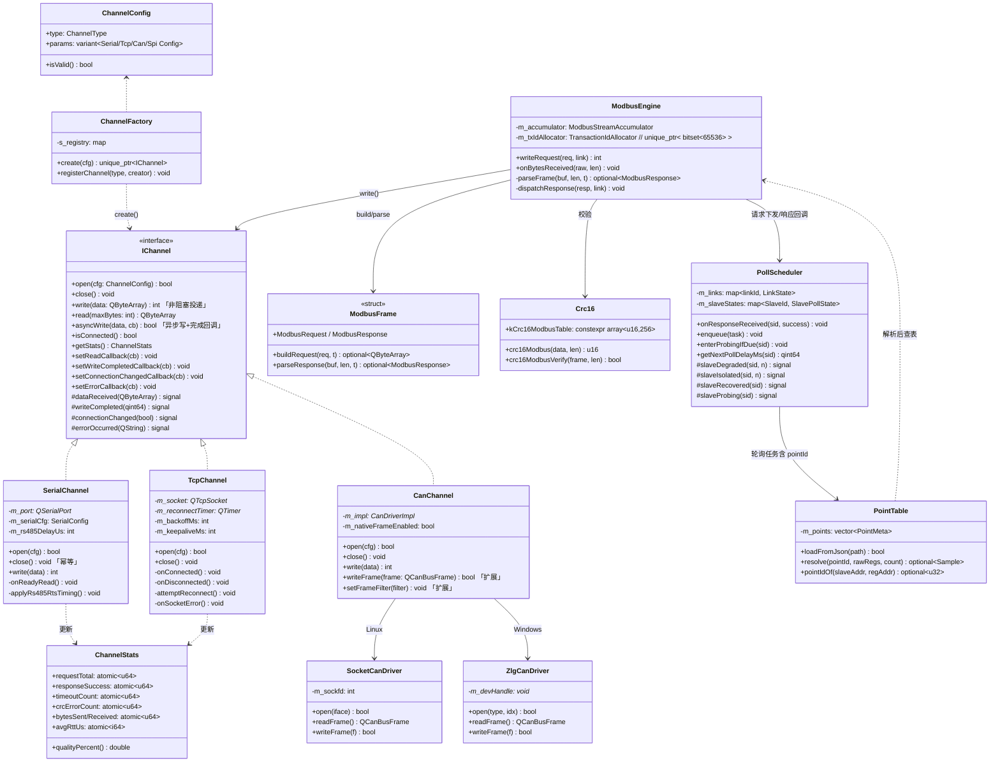
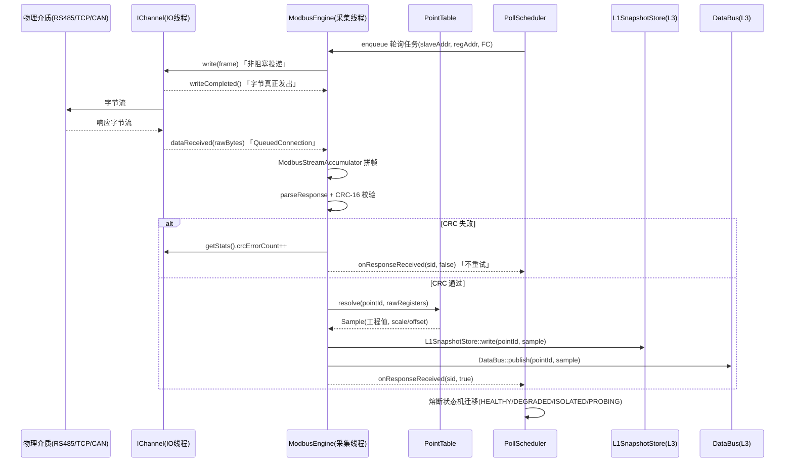
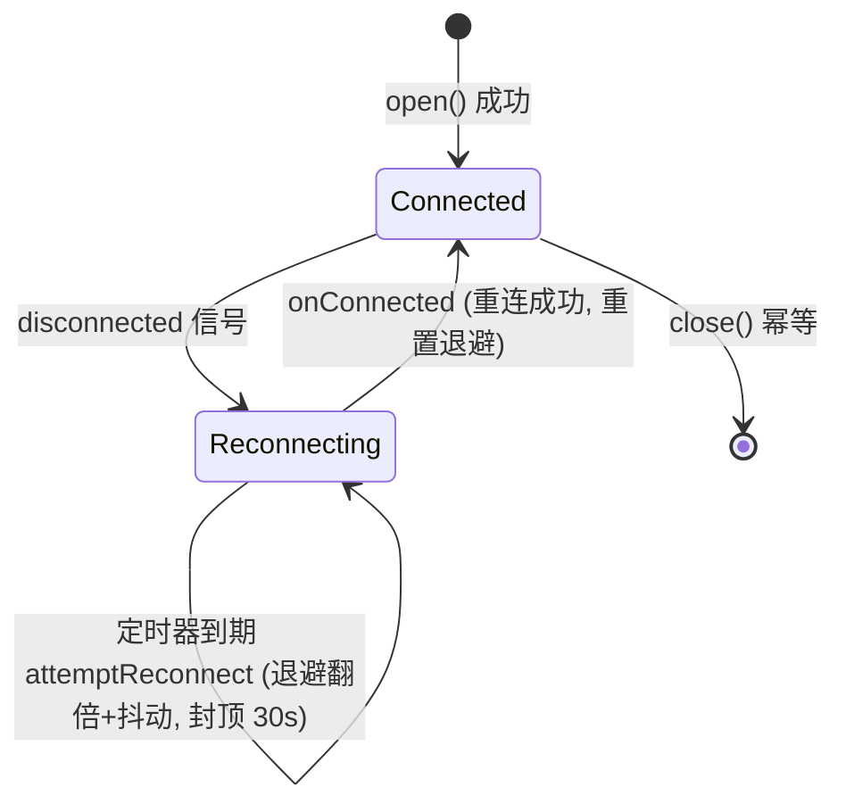
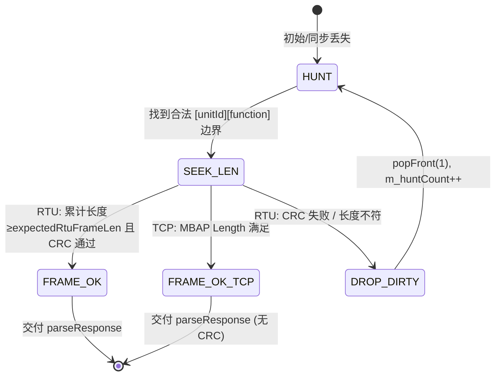
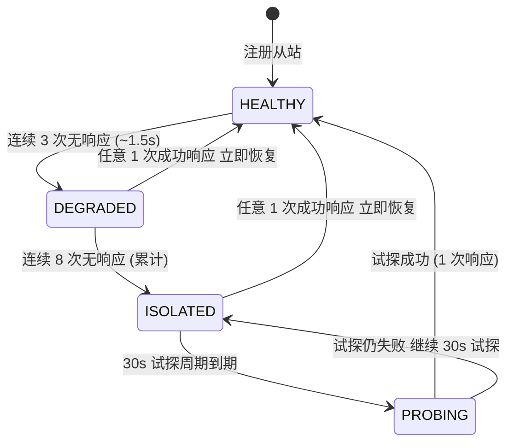
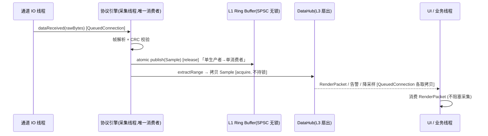

# ENS-LLD-100 《通信接入与协议引擎模块详细设计说明书》

> **文档编号**：ENS-LLD-100 ｜ **版本**：V1.4 ｜ **所属架构层级**：L1（通信接入层）+ L2（协议处理层）
> **对应 CMake Target**：`ens::channel`（SHARED，动态库）/ `ens::protocol`（STATIC，静态库）
> **构建类型**：`ens::channel` → SHARED（通信硬件因站而异，需热替换 `channel.dll`）；`ens::protocol` → STATIC（100ms 轮询热路径，内联进 exe）
> **核心负责类**：`IChannel` / `SerialChannel` / `TcpChannel` / `CanChannel` / `ChannelFactory` / `ChannelConfig` / `ChannelStats`（L1）；`ModbusEngine` / `ModbusFrame` / `PollScheduler` / `PointTable`（L2）
> **关联 ADR**：ADR-08 / ADR-13 / ADR-18（HLD 级）；ADR-LLD-10 ~ ADR-LLD-16（本册新增）
> **编制依据**：ENS-HLD-001 V1.5、ENS-CONC-001 V1.0、ENS-LLD-000 V1.3（总纲）、ENS-PEDS-001 V1.0（协议引擎设计说明）、ENS-DBDD（数据库设计说明书）、ENS-LLD-300 V1.1（L3 数据中枢 LLD）

---

## 文档修订记录

| 版本 | 日期 | 修订人 | 修订内容 |
|------|------|--------|---------|
| V1.0 | 2026-08-13 | 高级 C++ 通信与后端工程师 | 初始版本。依据总纲 §2 标准模板，合并编制 L1（101~103）与 L2（201~203）五个子模块的详细设计，覆盖：IChannel 抽象与三类通道实现、通道工厂与配置装配、通道级通信质量统计、ModbusFrame/CRC-16 查表、ModbusEngine 流式拼帧状态机、PollScheduler 优先级队列与 RS485 三级熔断、PointTable 字节序与工程值转换；含完整 Mermaid 类图/序列图、C++17 关键类声明（`static_assert` 断言）、线程并发模型、10+ 边界场景矩阵、MockChannel 单测策略。 |
| V1.1 | 2026-08-13 | 高级 C++ 通信与后端工程师 | 评审后修订：① §5.3 新增 Qt 事件循环延迟对 100ms BMS 热路径的影响及规避（避免耗时阻塞、OS 线程优先级提升）；② §4.3.6 补充 `std::bitset<65536>` 内存体积 8KB 及堆上分配约束；③ §4.2.1 为 `ModbusStreamAccumulator` 增加 RTU 脏数据最大前滑字节数限制（4KB），防止高噪音下逐字节前滑空转。 |
| V1.2 | 2026-08-13 | 高级 C++ 通信与后端工程师 | 评审后修订：① §4.2.1 修正 `ModbusStreamAccumulator::append()` 环形覆盖时 `m_read` 指针未前移的 bug；② §4.3.2 新增 `PollScheduler` 低优先级（LOW）饥饿保护机制（最大连续抢占计数）；③ §4.3.6 为 `std::bitset<65536>` 补充移动/拷贝构造防护（`unique_ptr` 包裹或 `= delete`）。 |
| V1.3 | 2026-08-13 | 高级 C++ 通信与后端工程师 | 评审后修订：① §4.4.2 `PointTable::resolve` 中间变量与 `Sample::value` 改为 `double`，避免 Uint32/Int32 转 `float` 的 IEEE 754 精度丢失；② §4.4.3 新增 `PointTable` 热加载 RCU 原子替换机制；③ §4.3.2.1 `kMaxConsecutivePreempt` 由硬编码改为按链路参数配置。 |
| V1.4 | 2026-08-13 | 高级 C++ 通信与后端工程师 | 评审后修订：① §3.2.2 为 `interFrameDelayUs` 增加 Modbus Serial Line Protocol Spec V1.02 的波特率 > 19200 分支，返回固定 1750 µs；② §4.3.2.1 为 SBO 控制写指令（HIGH）增加风暴防护：连续 `maxConsecutiveSboBurst` 次后强制让出 1 个槽位给 NORMAL 队列；③ §4.2.1 `ModbusStreamAccumulator::tryExtractFrame` 增加异常响应帧识别，功能码最高位为 1 时按固定 5 字节（RTU）/ 9 字节（TCP）提取，避免等待动态长度导致超时。 |

---

## 0. 文档定位与子模块映射

本册为 L1 通信接入层与 L2 协议处理层的**合并详细设计说明书**，覆盖总纲（ENS-LLD-000）索引矩阵中 `ENS-LLD-101 ~ 103`（L1）与 `ENS-LLD-201 ~ 203`（L2）五个子模块。落地代码统一归属 `src/channel/`（SHARED）与 `src/protocol/`（STATIC），本册按"总体 → 分模块"组织，避免跨文件重复。

| 子模块编号 | 主题 | 本册章节 | 核心类 | CMake Target / 构建类型 |
|-----------|------|---------|--------|--------------------------|
| ENS-LLD-101 | 接入层抽象与通道实现 | §3 | `IChannel`、`SerialChannel`、`TcpChannel`、`CanChannel` | `ens::channel` / SHARED |
| ENS-LLD-102 | 通道工厂与配置装配 | §3.5 | `ChannelFactory`、`ChannelConfig`、`ChannelType` | `ens::channel` / SHARED |
| ENS-LLD-103 | 通道级通信质量统计与诊断 | §3.6 | `ChannelStats`、`SlidingQualityEstimator` | `ens::channel` / SHARED |
| ENS-LLD-201 | Modbus 协议引擎 | §4.1 / §4.2 | `ModbusEngine`、`ModbusFrame`、`Crc16`、`ModbusStreamAccumulator` | `ens::protocol` / STATIC |
| ENS-LLD-202 | 轮询调度与 RS485 熔断 | §4.3 | `PollScheduler`、`SlavePollState`、`SlaveHealth`、`TransactionIdAllocator` | `ens::protocol` / STATIC |
| ENS-LLD-203 | 点表解析器 | §4.4 | `PointTable`、`PointMeta`、`ByteOrder` | `ens::protocol` / STATIC |

> **约束声明**：本册严格遵守总纲 §6 的全局技术不变式（6.1 原子对齐无锁屏障 / 6.4 RS485 熔断状态机），不得推翻 ADR-08~23；新增细化决策以 `ADR-LLD-10~16` 记录于 §8。L1 所有公开类/函数声明前带 `ENS_CHANNEL_API` 导出宏；L2（STATIC）严禁引入导出宏（总纲 §3.3.2 / §6.8）。

---

## 1. 模块概述

### 1.1 职责边界

- **L1 通信接入层（`ens::channel`，SHARED）** 是五层架构的最底层，唯一职责是**把不同物理介质（RS485 串口 / Modbus TCP / CAN）统一抽象成字节流通道**。上层 Modbus 协议引擎只依赖 `IChannel` 接口，不感知底层介质；新增通道类型（如 SPI 扩展）时协议解析代码零改动。
- **L2 协议处理层（`ens::protocol`，STATIC）** 是协议语义层，负责 Modbus RTU/TCP 的**帧构建/解析、查表 CRC-16 校验、字节流拼帧状态机、点表寄存器→工程值映射、多链路轮询调度与 RS485 半双工串行保护**。对 `Sample` 语义、L1 RingBuffer 无感知（仅经 `L1SnapshotStore::write` / `DataBus::publish` 下行）。

**做什么**：字节流收发（L1）+ Modbus 编解码、点表映射、轮询调度（L2）。
**不做什么**：L1 不下发业务语义、不感知寄存器含义；L2 不触达 SQLite/UI、不持有 GUI 控件、不判定告警业务（告警在 L4，本层仅经信号上报原始状态）。

### 1.2 架构位置与上下游依赖

```
L2 协议层 ──Modbus 帧──▶ IChannel.write() ──字节流──▶ 物理介质
物理介质 ──字节流──▶ IChannel.dataReceived() ──▶ ModbusEngine 解析
ModbusEngine ──Sample(工程值)──▶ L1SnapshotStore::write / DataBus::publish ──▶ L3 DataHub
L4 SBO ──写寄存器请求(0x06/0x10)──▶ PollScheduler 实时插队 ──▶ ModbusEngine ──▶ IChannel
```

依赖关系**仅经由抽象接口**：
- 协议层 → 通道层：仅依赖 `ens::channel::IChannel`（纯虚基类），**禁止**在协议层直接 `#include <QSerialPort>` / `<QTcpSocket>`（CI 头文件包含校验，总纲 §6.8）。
- 协议层 → 数据层：解析后的测点数据以 `Sample`（16B 对齐，ADR-08/18）语义调用 `L1SnapshotStore::write` / `DataBus::publish`（由 L3 提供，参考 ENS-LLD-300 §2.2）。

### 1.3 关联需求与 HLD 章节

| 需求项 | 简述 | HLD / ADR | 本册章节 |
|--------|------|-----------|---------|
| COMM-01~09 | Modbus 协议引擎 / 帧 / CRC / 超时 / 重试 / 半双工调度 | HLD §3.1.2 | §4.1 / §4.2 |
| COMM-12/13 | 通道抽象接口（IChannel） | HLD §3.1.1 | §3.1 / §3.2 / §3.5 |
| COMM-14/15 | 通信质量评估（60s 滑动窗口） | HLD §3.1.4 | §3.6 |
| NFR-PERF-02 | 100ms 高频 BMS 包稳定接收 | HLD §4 | §4.3 / §5 |
| NFR-PERF-11 | 100ms 高频 BMS 包带宽规划 + 专线插队 | HLD §3.1.3 | §4.3 |
| NFR-REL-02 | TCP/串口断线重连（指数退避） | HLD §3.1.4 | §3.3 |
| NFR-REL-03 | CRC 校验失败不污染数据 | HLD §3.1.2 | §4.1 / §6 |
| NFR-REL-05 | 故障隔离（链路/从站独立 + 三级熔断） | ADR-13 / HLD §3.1.5 | §4.3 / §6 |
| NFR-PORT-03 | 跨平台通道抽象 | HLD §3.1.1 | §3.2 / §3.4 |
| FR-DG-02 | 诊断读取 CRC 错误计数 / 质量% | HLD §3.1.4 | §3.6 |
| FR-CTRL-05 | 控制指令执行反馈（优先级插队） | HLD §3.1.3 | §4.3.4 |
| FR-DIAG-04 | 从站熔断状态 UI 联动 | HLD §3.1.5 | §4.3.3 |

---

## 2. 总体组件设计与数据流

### 2.1 L1/L2 核心类图（C++ 继承体系与组合关系）



### 2.2 完整数据流（物理字节流 → L3 快照/总线）



> **设计意图**：热路径（采集线程 → L1 → DataBus → L3 下游）全程无锁 + 信号槽 `QueuedConnection`，保证 100ms 高频写入**零阻塞**采集线程；CRC 失败与超时**不重试**（避免占用半双工总线），仅计入统计并驱动熔断，与总纲 §6.4 / HLD §3.1.5 一致。

---

## 3. L1 通信接入层详细设计（ENS-LLD-101 / 102 / 103）

### 3.1 `IChannel` 接口定义（ENS-LLD-101）

`IChannel` 是纯虚基类，**继承自 `QObject`**（支持跨线程 signal/slot 投递）。设计约束（对应 SRS COMM-12/13、NFR-PORT-03）：

- `open` / `close` 成对调用，`close` **必须幂等**（二次调用不抛异常、不重复释放，RAII 保证）。
- `write` 为**非阻塞投递（hand-off）**：仅把帧拷贝进通道发送队列 / OS 缓冲即返回，物理发送完成经 `writeCompleted` 信号异步上报；**调用线程（调度线程）不因此阻塞**。RS485 半双工场景下由上层 `PollScheduler` 用"总线忙"状态机保证串行，而非靠 `write` 内部阻塞。
- `read` 为非阻塞读取，返回当前内核/缓冲可用数据；**帧完整性判定由协议引擎负责**（见 §4.2 累加器）。
- `asyncWrite` 为带完成回调的异步写封装（语义与 `writeCompleted` 信号等价，便于非 Qt 上下文使用）。
- `getStats()` 返回通道级原子统计快照（§3.6），所有统计字段使用 `std::atomic`，支持跨线程安全读取。
- 所有回调在**通道 IO 线程**触发，回调内**禁止长时间阻塞**。

```cpp
// src/channel/IChannel.h
#pragma once
#include "ens/export.hpp"
#include "ChannelConfig.h"
#include "ChannelStats.h"
#include <QByteArray>
#include <QObject>
#include <QString>
#include <functional>
#include <memory>

namespace ens::channel {

using ReadCallback            = std::function<void(const QByteArray& data)>;
using WriteCompletedCallback  = std::function<void(qint64 bytesWritten)>;
using ConnectionChangedCallback = std::function<void(bool connected)>;
using ErrorCallback           = std::function<void(const QString& errorMessage)>;

class ENS_CHANNEL_API IChannel : public QObject {
    Q_OBJECT
public:
    IChannel(QObject* parent = nullptr) : QObject(parent) {}
    ~IChannel() override = default;

    IChannel(const IChannel&) = delete;
    IChannel& operator=(const IChannel&) = delete;
    IChannel(IChannel&&) = delete;
    IChannel& operator=(IChannel&&) = delete;

    // ── 生命周期（close 必须幂等） ──
    virtual bool open(const ChannelConfig& cfg) = 0;
    virtual void close() = 0;

    // ── I/O 操作 ──
    // write 非阻塞投递：仅入发送队列即返回，物理发送完成经 writeCompleted 上报
    virtual int write(const QByteArray& data) = 0;
    // asyncWrite：带完成回调的异步写（与 writeCompleted 信号语义等价）
    virtual bool asyncWrite(const QByteArray& data, WriteCompletedCallback cb) = 0;
    virtual QByteArray read(int maxBytes = 4096) = 0;

    // ── 状态查询 ──
    virtual bool isConnected() const = 0;
    virtual ChannelStats getStats() const = 0;
    virtual QString lastError() const = 0;

    // ── 回调注册 ──
    virtual void setReadCallback(ReadCallback cb) = 0;
    virtual void setWriteCompletedCallback(WriteCompletedCallback cb) = 0;
    virtual void setConnectionChangedCallback(ConnectionChangedCallback cb) = 0;
    virtual void setErrorCallback(ErrorCallback cb) = 0;

signals:
    void dataReceived(const QByteArray& data);       // 原始字节到达（IO 线程）
    void writeCompleted(qint64 bytesWritten);         // 字节已写到底层设备/OS，可释放 RS485 DE/RE
    void connectionChanged(bool connected);           // TCP 断线/重连、串口拔出/插入
    void errorOccurred(const QString& errorMessage);  // IO 错误
};

}  // namespace ens::channel
```

### 3.2 `SerialChannel` 物理串口实现（ENS-LLD-101）

#### 3.2.1 实现选型与跨平台适配

采用 **`QSerialPort` 高性能封装**（Win32 / POSIX 双后端由 Qt 统一抽象），避免直接 `#include <windows.h>` / `<termios.h>` 带来的平台耦合；仅在 `open()` 内通过原生句柄（`QSerialPort::handle()`）配置驱动级参数（下述）。保留裸 API 适配作为降级路径：若目标平台 QtSerialPort 不可用，可经条件编译切换至自封装的 `PosixSerial` / `Win32Serial`。

#### 3.2.2 RS485 半双工方向控制（RTS 信号时序控制与收发切换延时）

RS485 为半双工总线，发送时须将 DE/RE 拉高（发送态），发送结束立即拉回接收态，并插入 ≥ 3.5 字符静默（见 §4.1.1 帧边界）。**方向控制与静默延时由 UART 硬件/驱动完成，调度线程完全不 `sleep`**：

- **Linux**：经 `TIOCSRS485` ioctl 配置 `SER_RS485_RTS_ON_SEND | SER_RS485_RTS_AFTER_SEND` + `delay_rts_after_send`（内核在 RTS 切回接收前插入的静默时间，单位微秒）。
- **Windows**：通过原生句柄配置 `RTS_CONTROL_TOGGLE`（驱动级自动方向）或 `ReadIntervalTimeout` 保守值保证帧边界；对 MAX13487/SP3485 类自动方向芯片无需软件干预。

```cpp
// src/channel/SerialChannel.cpp —— open() 内 RS485 方向控制片段（节选）
static int interFrameDelayUs(int baudRate, int dataBits, int stopBits, const QString& parity) {
    // Modbus Serial Line Protocol Specification V1.02 标准例外：
    // 当波特率 > 19200 bps 时，标准推荐固定 1.75 ms（1750 µs）作为帧间静默，
    // 停止位固定为 1.0 字符时间。否则按公式 bitsPerChar * 3.5 / baudRate 计算。
    if (baudRate > 19200) {
        return 1750;  // µs
    }
    const int bitsPerChar = dataBits + (parity == "N" ? 0 : 1) + stopBits;
    return static_cast<int>((bitsPerChar * 3500000LL) / baudRate);  // 3.5 字符·us
}

void SerialChannel::applyRs485RtsTiming(int baudRate, int dataBits, int stopBits, const QString& parity) {
    const int delayUs = interFrameDelayUs(baudRate, dataBits, stopBits, parity);
    m_rs485DelayUs = delayUs;
#if defined(Q_OS_LINUX)
    int fd = m_port->handle();
    struct serial_rs485 rs485conf{};
    rs485conf.flags = SER_RS485_ENABLED | SER_RS485_RTS_ON_SEND | SER_RS485_RTS_AFTER_SEND;
    rs485conf.delay_rts_after_send = static_cast<unsigned int>(delayUs);
    ioctl(fd, TIOCSRS485, &rs485conf);   // 发送结束后硬件自动拉回接收态 + 插入静默
#elif defined(Q_OS_WIN)
    // Windows：自动方向芯片由硬件处理；软件方向须配合完成回调释放 RTS。
    // 此处仅记录延时，实际收发切换在 writeCompleted 信号中由驱动保证。
    m_rs485DelayUs = delayUs;
#endif
}
```

> **关键约束**：任何情况下不得在应用层用 `usleep`/`QTimer` 模拟 3.5 字符静默；`writeCompleted` 信号用于"物理发送结束"语义，恰好对应 RS485 方向控制释放时机（HLD §3.1.2 / ENS-PEDS-001 §2.3.1）。

> **波特率 > 19200 标准例外（V1.4 新增）**：完全按公式计算时，115200 bps 的 3.5 字符时间仅约 330 µs，非硬实时 Linux 驱动层难以保证低于 1ms 的切换精度，容易导致从站误判帧边界。因此遵循 Modbus Serial Line Protocol Specification V1.02，当 `baudRate > 19200` 时固定返回 **1750 µs**，停止位仍按 1.0 字符时间配置。

#### 3.2.3 从站熔断/降级机制（连续 N 次响应超时 → 降频至 30s 试探）

> **与 HLD §3.1.5 / 总纲 §6.4 的关系**：HLD 定义三级熔断状态机（ADR-13），但**从站级连续超时计数与降频策略的落地**归属 L2 `PollScheduler`（见 §4.3）。此处 `SerialChannel` 仅提供**链路级**支撑能力：当 `PollScheduler` 判定某从站进入 ISOLATED/PROBING 后，下发到该物理串口的请求频率被 `PollScheduler` 自动降频（30s 一次），`SerialChannel` 自身仍保持 FIFO 串行收发，不因单从站故障改变总线时序。

`SerialChannel` 在链路层提供两重保障：

1. **链路离线感知**：串口被拔出 / 驱动 IO 错误 → `errorOccurred` 信号 → 标记 `isConnected()=false` → 触发通道级重连尝试（定时 `open` 重试）。
2. **收发切换延时保证**：§3.2.2 的 `delay_rts_after_send` 确保半双工总线在每帧之间留出 ≥3.5 字符静默，**避免冲包**——这是从站降频后总线仍健康的前提。

> **设计意图（熔断联动）**：从站"连续 N 次超时"的 N 取值为 **3（降级）/ 8（隔离）**，降频后 30s 才试探一次（ADR-LLD-10，细化 ADR-13）。`SerialChannel` 不自行计数，计数由 `PollScheduler::onResponseReceived` 驱动（§4.3.2），避免 L1 越权感知协议语义。

```cpp
// src/channel/SerialChannel.h（节选）
class ENS_CHANNEL_API SerialChannel : public IChannel {
    Q_OBJECT
public:
    bool open(const ChannelConfig& cfg) override;
    void close() override;                  // 幂等：m_port->close() + deleteLater()
    int  write(const QByteArray& data) override;
    bool asyncWrite(const QByteArray& data, WriteCompletedCallback cb) override;
    QByteArray read(int maxBytes) override;
    bool isConnected() const override { return m_port && m_port->isOpen(); }
    ChannelStats getStats() const override { return m_stats.snapshot(); }
    QString lastError() const override { return m_lastError; }

    void setReadCallback(ReadCallback cb) override { m_readCb = std::move(cb); }
    void setWriteCompletedCallback(WriteCompletedCallback cb) override { m_writeCb = std::move(cb); }
    void setConnectionChangedCallback(ConnectionChangedCallback cb) override { m_connCb = std::move(cb); }
    void setErrorCallback(ErrorCallback cb) override { m_errCb = std::move(cb); }

private slots:
    void onReadyRead();                     // 读数据 → emit dataReceived()
    void onBytesWritten(qint64 n);          // 写完成 → emit writeCompleted()
    void onErrorOccurred(QSerialPort::SerialPortError);

private:
    QSerialPort* m_port = nullptr;
    SerialConfig m_serialCfg{};
    int          m_rs485DelayUs = 3500;
    ChannelStats m_stats;                  // 原子统计（§3.6）
    QString      m_lastError;
    ReadCallback m_readCb;
    WriteCompletedCallback m_writeCb;
    ConnectionChangedCallback m_connCb;
    ErrorCallback m_errCb;
};
```

### 3.3 `TcpChannel` Modbus TCP 实现（ENS-LLD-101）

#### 3.3.1 实现选型

采用 **`QTcpSocket`** 封装（非阻塞、事件循环驱动）。断线重连、KeepAlive、半开连接识别均在 IO 线程内完成，定时器与 `QTcpSocket` 同属 IO 线程（通过 `QObject` 父子关系 + `moveToThread` 保证，禁止跨线程启停定时器）。

#### 3.3.2 指数退避算法的断线自动重连状态机

TCP 断线（`disconnected` 信号）触发指数退避重连（COMM-09, NFR-REL-02）：序列 **1s → 2s → 4s → 8s → 16s → 30s（封顶）→ 30s…**，并叠加 ±10% 随机抖动（避免多链路"同步重连风暴"）。



```cpp
// src/channel/TcpChannel.cpp —— 指数退避重连核心
void TcpChannel::attemptReconnect() {
    // m_backoffMs 已在 ctor 初始化为 reconnectBaseMs(1000)
    if (m_backoffMs < m_reconnectMaxMs /*30000*/) {
        m_backoffMs = std::min(m_backoffMs * 2, m_reconnectMaxMs);
        if (m_backoffMs == 0) m_backoffMs = m_reconnectBaseMs;   // 首次 1s
    }
    // 重连抖动：±10% 随机，分散多链路重连峰值（NFR-REL-02 工业增强）
    const int jitter = static_cast<int>(m_backoffMs * 0.1 * (rand() / double(RAND_MAX) * 2 - 1));
    m_reconnectTimer->start(std::max(1, m_backoffMs + jitter));
    emit connectionChanged(false);   // 通知上层链路离线（进入"重连中"）
}

void TcpChannel::onConnected() {
    m_backoffMs = 0;                 // 重连成功, 重置退避
    emit connectionChanged(true);    // 通知上层链路恢复
}
```

#### 3.3.3 心跳检测（KeepAlive）与半开连接识别

TCP 全双工下，**半开连接**（一端已崩溃但另一端未收到 FIN）是最常见的"假在线"陷阱：应用层 `isConnected()` 仍返回 `true`，但所有写请求石沉大海、超时后才发现断线。`TcpChannel` 通过两层防护识别：

1. **内核级 SO_KEEPALIVE**：在 `open()` 成功后设置 `QAbstractSocket::setSocketOption(QAbstractSocket::KeepAliveOption, 1)`，并（平台允许时）调小 `tcp_keepalive_time/idle`、`tcp_keepalive_intvl`、`tcp_keepalive_probes`，让内核在数秒~数十秒内探测到死链。
2. **应用级心跳（应用层探针）**：由 L2 `PollScheduler` 的高频 BMS 链路或业务层周期性下发轻量读请求（如读一个"心跳寄存器"FC04），结合 `ChannelStats::avgRttUs` 与超时计数；若连续多次心跳无响应 → 主动 `close()` 触发重连（半开连接识别）。

```cpp
// src/channel/TcpChannel.cpp —— 半开连接加固（节选）
void TcpChannel::hardenKeepAlive() {
    m_socket->setSocketOption(QAbstractSocket::KeepAliveOption, 1);
#if defined(Q_OS_LINUX)
    int fd = m_socket->socketDescriptor();
    int idle = 10, interval = 3, probes = 3;   // 10s 空闲 → 每 3s 探测 → 3 次失败判死
    setsockopt(fd, IPPROTO_TCP, TCP_KEEPIDLE,  &idle,     sizeof(idle));
    setsockopt(fd, IPPROTO_TCP, TCP_KEEPINTVL, &interval, sizeof(interval));
    setsockopt(fd, IPPROTO_TCP, TCP_KEEPCNT,   &probes,   sizeof(probes));
#endif
}
```

> **inFlight 清理（与 §4.3.5 协同）**：TCP 断连/`close()` 时，`ModbusEngine` 必须先清空该链路 `inFlight` 表，将所有在途请求按失败上报（触发对应从站熔断统计），避免断连残留导致 Transaction ID 错配（ENS-PEDS-001 §3.6）。

### 3.4 `CanChannel` 接口扩展预留（ENS-LLD-101）

`CanChannel` 对 SocketCAN（Linux）/ ZLG CAN（Windows，周立功 SDK）做统一抽象。平台相关驱动通过 `CanDriverImpl` 多态隔离：

- **Linux**：`SocketCanDriver`（`socket()`+`bind()`+`read()`/`write()`）。
- **Windows**：`ZlgCanDriver`（ZLG 设备 SDK）。
- **CAN 原生帧扩展预留（CADS V1.5.3 口径）**：当前 `IChannel` 抽象为字节流，对 Modbus over CAN 或透明传输足够；但未来扩展 CANopen / J1939 等基于 CAN ID/IDE/RTR 的协议时纯字节流会丢失帧头元数据。故 `CanChannel` 内部预留原生 CAN Frame 接口 `writeFrame(const QCanBusFrame&)` / `setFrameFilter(const CanFilterConfig&)`。**不破坏 L1 字节流抽象**：默认关闭（`m_nativeFrameEnabled=false`），需要元数据时由配置显式开启。

```cpp
// src/channel/CanChannel.h（节选）
class ENS_CHANNEL_API CanChannel : public IChannel {
    Q_OBJECT
public:
    bool open(const ChannelConfig& cfg) override;
    void close() override;
    int  write(const QByteArray& data) override;
    bool asyncWrite(const QByteArray& data, WriteCompletedCallback cb) override;
    QByteArray read(int maxBytes) override;
    bool isConnected() const override;
    ChannelStats getStats() const override;
    QString lastError() const override;

    // ── CAN 原生帧扩展（默认关闭，m_nativeFrameEnabled=false） ──
    bool writeFrame(const QCanBusFrame& frame);
    void setFrameFilter(const CanFilterConfig& filter);
    void setNativeFrameEnabled(bool on) { m_nativeFrameEnabled = on; }

    void setReadCallback(ReadCallback cb) override { m_readCb = std::move(cb); }
    // ... 其余回调同 SerialChannel
private:
    CanDriverImpl* m_impl = nullptr;
    bool           m_nativeFrameEnabled = false;
    ChannelStats   m_stats;
};
```

### 3.5 通道工厂与配置装配（ENS-LLD-102）

`ChannelFactory::create()` 按配置构造具体通道，实现**依赖倒置**：协议层只持有 `unique_ptr<IChannel>`。支持插件式注册表（`registerChannel`），现场私有协议网关可注入自定义通道而无需改 `create()` 主流程。

```cpp
// src/channel/ChannelFactory.h
#pragma once
#include "IChannel.h"
#include "ChannelConfig.h"
#include <memory>
#include <unordered_map>
#include <functional>

namespace ens::channel {

class ENS_CHANNEL_API ChannelFactory {
public:
    using Creator = std::function<std::unique_ptr<IChannel>()>;

    static std::unique_ptr<IChannel> create(const ChannelConfig& cfg) {
        // 插件化扩展点优先：已注册的自定义类型直接委派
        if (auto it = s_registry.find(cfg.type); it != s_registry.end())
            return it->second();
        switch (cfg.type) {
            case ChannelType::Serial: return std::make_unique<SerialChannel>();
            case ChannelType::TCP:    return std::make_unique<TcpChannel>();
            case ChannelType::CAN:    return std::make_unique<CanChannel>();
            case ChannelType::SPI:    return nullptr;   // 预留扩展位：未实现，调用方判空
            default:                  return nullptr;
        }
    }

    static void registerChannel(ChannelType type, Creator c) {
        s_registry[type] = std::move(c);
    }

private:
    static inline std::unordered_map<ChannelType, Creator> s_registry;
};

}  // namespace ens::channel
```

`ChannelConfig` 采用 `std::variant` 强类型多态配置（避免 `void*`/union 类型不安全），`ChannelType` 枚举含 `SPI` 预留扩展位（保证 ABI 稳定，新增通道类型不破坏既有 `switch` 分支），详见 ENS-PEDS-001 §7.1（本册不再重复全量代码，保持口径一致）。

> **扩展位设计原则**：通道类型扩展不应破坏既有工厂 ABI。`ChannelFactory::create()` 的 `default` 分支返回 `nullptr`，调用方判空即可；`SPI` 仅增加一个枚举项 + 一个占位子类。

### 3.6 通道级通信质量统计与诊断（ENS-LLD-103）

每条链路维护**全局累计原子快照**（`ChannelStats`，供 `getStats()` 即时返回、无锁）与**最近 60 秒滑动窗口**（`SlidingQualityEstimator`，用于实时诊断与颜色等级判定），二者职责互补、均零动态分配（与 ENS-PEDS-001 §5 口径一致，移入本册作为 L1 独立子模块）。

```cpp
// src/channel/ChannelStats.h（依据 ICD §2.4，L1 权威原子统计）
#pragma once
#include "ens/export.hpp"
#include <atomic>
#include <cstdint>

namespace ens::channel {

struct ENS_CHANNEL_API ChannelStats {
    std::atomic<uint64_t> requestTotal{0};
    std::atomic<uint64_t> responseSuccess{0};
    std::atomic<uint64_t> timeoutCount{0};
    std::atomic<uint64_t> crcErrorCount{0};
    std::atomic<uint64_t> bytesSent{0};
    std::atomic<uint64_t> bytesReceived{0};
    std::atomic<int64_t>  avgRttUs{0};   // 平均往返时延 (微秒)

    double qualityPercent() const {
        uint64_t total = requestTotal.load(std::memory_order_acquire);
        if (total == 0) return 100.0;
        uint64_t success = responseSuccess.load(std::memory_order_acquire);
        return (static_cast<double>(success) / static_cast<double>(total)) * 100.0;
    }

    ChannelStats snapshot() const { return *this; }  // 原子逐字段拷贝（编译器展开）
};

// 60 秒滑动窗口（环形 std::array<QualityBucket,60>，零动态分配）
// 桶定位采用"绝对秒级时间戳 % 60"，秒边界重置采用 double-checked locking + CAS，
// 详见 ENS-PEDS-001 §5.1（与本册口径一致）。质量% = 窗口内成功/窗口内请求 ×100；
// 等级：≥95% 优秀 / 80~95% 一般 / <80% 异常（COMM-14/15, FR-DG-02）。

}  // namespace ens::channel
```

---

## 4. L2 协议处理层详细设计（ENS-LLD-201 / 202 / 203）

### 4.1 `ModbusFrame` 报文结构与 CRC-16（ENS-LLD-201）

#### 4.1.1 帧结构

**RTU 帧（串口，含 CRC-16/MODBUS）**

| 字段 | 字节 | 说明 |
|------|------|------|
| 从站地址 | 1 | 1~247 |
| 功能码 | 1 | 0x01~0x10 |
| 数据区 | N | 寄存器地址 + 数量 / 数据 |
| CRC-16 | 2 | 低字节在前，高字节在后（多项式 0xA001，初值 0xFFFF） |

**TCP 帧（MBAP 头，无 CRC）**

| 字段 | 字节 | 说明 |
|------|------|------|
| Transaction ID | 2 | 请求/响应配对标识（16-bit，位图分配见 §4.3.5） |
| Protocol ID | 2 | 固定 0x0000 |
| Length | 2 | 后续字节数 |
| Unit ID | 1 | 从站地址 |
| PDU | N | 功能码 + 数据（同 RTU，但**无 CRC**） |

> **关键差异**：RTU 帧靠 3.5 字符时间间隔（≈3.5ms @115200）做帧边界切分；TCP 帧靠 MBAP 的 `Length` 字段精确切分，因此 TCP 模式**不计算也不传输 CRC**。

#### 4.1.2 高性能 CRC-16 查表加速算法

采用 **CRC-16/MODBUS**（多项式 0xA001 reflected，初值 0xFFFF）。使用**编译期 `constexpr` 预计算 256 项查找表**，运行期查表计算，避免逐位运算；每条请求帧的校验仅 `len` 次查表 + 异或。所有 256 项在编译期生成，**零运行期初始化开销**。

```cpp
// src/protocol/Crc16.h —— 256 项预计算查表法 CRC-16/MODBUS
#pragma once
#include <cstdint>
#include <array>
#include <cstddef>

namespace ens::protocol {

constexpr uint16_t crc16ModbusEntry(uint8_t index) {
    uint16_t crc = index;
    for (int i = 0; i < 8; ++i)
        crc = (crc & 0x0001) ? static_cast<uint16_t>((crc >> 1) ^ 0xA001u)
                             : static_cast<uint16_t>(crc >> 1);
    return crc;
}

// 256 项查找表（编译期生成，零运行期初始化）
inline constexpr std::array<uint16_t, 256> kCrc16ModbusTable = [] {
    std::array<uint16_t, 256> t{};
    for (int i = 0; i < 256; ++i) t[i] = crc16ModbusEntry(static_cast<uint8_t>(i));
    return t;
}();

inline uint16_t crc16Modbus(const uint8_t* data, size_t len) {
    uint16_t crc = 0xFFFF;
    for (size_t i = 0; i < len; ++i)
        crc = static_cast<uint16_t>((crc >> 8) ^ kCrc16ModbusTable[(crc ^ data[i]) & 0xFF]);
    return crc;
}

inline bool crc16ModbusVerify(const uint8_t* frame, size_t totalLen) {
    if (totalLen < 3) return false;            // 至少 addr+fc+crc
    const uint16_t calc = crc16Modbus(frame, totalLen - 2);
    const uint16_t recv = static_cast<uint16_t>(frame[totalLen - 2])
                        | static_cast<uint16_t>(frame[totalLen - 1] << 8);
    return calc == recv;
}

// ── 双字节查表变体（ADR-LLD-11，可选加速） ──
// 将单 16 位表拆为两张 256 项表（crcHi / crcLo），单次迭代仅 1 次查表 + 2 次异或，
// 在极低端 ARM 上进一步省去 (crc>>8) 拼接；x86-64 上与原表性能相当，按需启用。
inline constexpr std::array<uint8_t, 256> kCrcHi = [] { /* 高字节表 */ std::array<uint8_t,256> t{}; for(int i=0;i<256;++i) t[i]=static_cast<uint8_t>(crc16ModbusEntry(i)>>8); return t; }();
inline constexpr std::array<uint8_t, 256> kCrcLo = [] { /* 低字节表 */ std::array<uint8_t,256> t{}; for(int i=0;i<256;++i) t[i]=static_cast<uint8_t>(crc16ModbusEntry(i)&0xFF); return t; }();

}  // namespace ens::protocol
```

> **校验失败处理**（NFR-REL-03）：丢弃该帧 → `ChannelStats::crcErrorCount` 自增 → **不重试**（避免占用半双工总线），不将错误数据上送。诊断模块通过 `IChannel::getStats()` 读取 CRC 错误计数（FR-DG-02）。

#### 4.1.3 功能码覆盖

引擎支持常用功能码 **`0x03`（读保持寄存器）、`0x04`（读输入寄存器）、`0x06`（写单个寄存器）、`0x10`（写多个寄存器）**，并兼容 `0x01/0x02/0x05/0x0F` 读/写线圈类（ICD 完整集）。异常响应格式 `[unitId][0x80|FC][exceptionCode]`（RTU 追加 CRC）；解析器识别 `function & 0x80` 即判定为异常，填充 `isException + exception`，**不重试**（确定性协议级拒绝），经信号告知业务层（FR-CTRL-05）。

### 4.2 `ModbusEngine` 状态机与流式解析（ENS-LLD-201）

#### 4.2.1 流式环形缓冲区拼帧状态机

> **工程隐患（CADS V1.5.2 修正）**：`QSerialPort::readyRead` 触发时，内核缓冲区送出的字节流是碎片化的——一条响应可能分 2 次到达，两条响应也可能粘连成一次 `dataReceived`。若直接在每个 `dataReceived` 上调用帧解析，极易把"半个帧"判定为 CRC 失败，造成误报。

**修正策略**：在 `ModbusEngine` 接收端引入轻量级 **`ModbusStreamAccumulator`**，所有原始字节先进入累加器，只有在提取出**完整帧**后才送入 `parseResponse`；CRC 校验永远不在不完整数据上进行。

内部使用**固定容量环形字节数组**（`std::array<uint8_t, 4096>` + 读写指针），`append` / `pop_front` / 缓冲区回绕均不产生任何堆分配（零动态分配原则，总纲 §6）。

> **环形覆盖读指针修正（V1.2 新增）**：`append()` 写入数据超过剩余容量时会发生环形覆盖（最旧数据被新数据覆盖）。此时必须同步前移 `m_read`，否则 `tryExtractFrame` 下次读取将拿到"新旧混合脏数据"，导致帧解析错误。修正逻辑见下方代码：`m_size + len > kCapacity` 时计算溢出量 `overflow`，并将 `m_read` 前移相同字节。

> **RTU 脏数据前滑边界（V1.1 新增）**：在强电磁干扰场景下，总线可能持续涌入无意义字节。若累加器在 `HUNT`/`DROP_DIRTY` 状态逐字节前滑，遇到连续 4KB 脏数据将触发 **4K 次单字节前滑**，空耗 CPU 且拖慢后续好帧解析。因此引入**最大前滑字节数限制 `kMaxHuntBytes = 4096`**：当单次同步过程中累计前滑字节数达到阈值仍未能提取出合法帧时，直接调用 `clear()` 清空整个环形缓冲区并复位状态机，避免逐字节空转；清空后重新从下一批字节开始同步。



| 状态 | 含义 | 动作 |
|------|------|------|
| `HUNT` | 同步丢失/启动，逐字节前滑寻找 `[unitId][function]` 合法边界 | 计数 `m_huntCount`，供诊断感知同步质量 |
| `SEEK_LEN` | 已定位帧头，累加至期望长度 | RTU 校验 CRC；TCP 校验 MBAP `Length` |
| `DROP_DIRTY` | CRC 失败 / 长度不符（脏数据） | `popFront(1)` 前滑，回到 `HUNT`；累计前滑 ≥`kMaxHuntBytes` 则 `clear()` 清空缓冲区（V1.1） |
| `FRAME_OK` | 完整帧且校验通过 | 交付 `parseResponse` |

```cpp
// src/protocol/ModbusStreamAccumulator.h（节选，零动态分配）
#pragma once
#include <array>
#include <cstdint>
#include <cstddef>

namespace ens::protocol {

class ModbusStreamAccumulator {
public:
    static constexpr size_t kCapacity = 4096;      // 固定环形字节数组
    static constexpr size_t kMaxHuntBytes = 4096;  // 脏数据最大前滑字节数（V1.1 新增）

    // 追加原始字节；返回本次可提取的完整帧数（0 表示尚需等待）
    void append(const uint8_t* data, size_t len) noexcept {
        // V1.2 修正：发生环形覆盖时，必须同步前移 m_read，否则下一次提取会读到
        // 被新数据覆盖后的"新旧混合脏数据"，导致错误解析。
        if (m_size + len > kCapacity) {
            const size_t overflow = (m_size + len) - kCapacity;
            m_read = (m_read + overflow) % kCapacity;  // 被挤掉的最旧数据前移读指针
        }
        for (size_t i = 0; i < len; ++i)
            m_buf[(m_write + i) % kCapacity] = data[i];
        m_write = (m_write + len) % kCapacity;
        m_size  = std::min(m_size + len, kCapacity);  // 环形覆盖：溢出即丢最旧（脏数据）
    }

    // 试图从缓冲区提取一帧（RTU 模式需 CRC 校验）。成功返回 true 并填充 out。
    bool tryExtractFrame(uint8_t* out, size_t& outLen, bool isTcp) noexcept;

    void popFront(size_t n) noexcept {
        m_read = (m_read + n) % kCapacity;
        m_size = (m_size >= n) ? (m_size - n) : 0;
        m_huntSlidBytes += n;                        // 累计本次同步前滑字节数（V1.1 新增）
        if (m_huntSlidBytes >= kMaxHuntBytes) {
            clear();                                 // 连续 4KB 脏数据直接清空，防止空转
        }
    }

    // 完整帧提取成功后必须复位前滑计数器（V1.1 新增）
    void onFrameExtracted() noexcept { m_huntSlidBytes = 0; }

    void clear() noexcept {
        m_read = m_write = m_size = 0;
        m_huntCount = 0;
        m_huntSlidBytes = 0;
        m_buf.fill(0);
    }

    size_t huntCount() const noexcept { return m_huntCount; }

private:
    // 非空洞辅助函数：用于 tryExtractFrame 内部无分支读取
    uint8_t peek(size_t offset) const noexcept {
        return m_buf[(m_read + offset) % kCapacity];
    }
    void pop(size_t n, uint8_t* out, size_t& outLen) noexcept {
        outLen = n;
        for (size_t i = 0; i < n; ++i)
            out[i] = m_buf[(m_read + i) % kCapacity];
        popFront(n);
    }

    std::array<uint8_t, kCapacity> m_buf{};
    size_t m_read = 0, m_write = 0, m_size = 0;
    uint32_t m_huntCount = 0;
    size_t   m_huntSlidBytes = 0;   // 当前同步周期累计前滑字节数（V1.1 新增）
};

}  // namespace ens::protocol
```

#### 4.2.1.1 异常响应帧长度快速识别（V1.4 新增）

Modbus 异常响应帧结构固定：**RTU 模式下为 5 字节**（`[UnitID][0x80+FunctionCode][ExceptionCode][CRC_L][CRC_H]`），**TCP 模式下为 9 字节**（MBAP 7 字节 + `[UnitID][0x80+FunctionCode][ExceptionCode]`）。而正常的 `0x03`/`0x04` 读响应帧长度是动态的，需等待 `Byte Count` 字段才能确定完整帧长。

若在 `tryExtractFrame` 中一律按正常读响应的动态长度等待，则从站返回异常码时，引擎会错误地等待后续字节直至超时，既浪费总线时间，又可能把后续好帧拖入超时。因此拼帧状态机必须在定位到帧头后**立即判断功能码最高位**：

```cpp
// src/protocol/ModbusStreamAccumulator.cpp —— tryExtractFrame 内部节选
bool ModbusStreamAccumulator::tryExtractFrame(uint8_t* out, size_t& outLen, bool isTcp) noexcept {
    if (m_size < (isTcp ? 7u : 4u)) return false;          // 最小帧头都未到

    // 读取帧头：TCP 偏移 6 字节为 UnitID；RTU 偏移 0 字节为 UnitID
    const size_t unitOff = isTcp ? 6u : 0u;
    const uint8_t unitId = peek(unitOff);
    const uint8_t function = peek(unitOff + 1);

    // 异常响应帧：功能码最高位为 1，长度固定
    if (function & 0x80) {
        const size_t expected = isTcp ? 9u : 5u;
        if (m_size < expected) return false;               // 等完整异常帧
        pop(expected, out, outLen);
        outLen = expected;
        onFrameExtracted();
        return true;
    }

    // 正常响应帧：按功能码/Byte Count 继续计算期望长度（略）
    // ...
}
```

> **设计要点**：异常帧一旦完整到达即立即提取并交付 `parseResponse`，由 `ModbusEngine` 识别 `function & 0x80` 后产生 `frameError(ExceptionResponse, ...)` 或交付带异常码的 `ModbusResponse`；上层 `PollScheduler` 将其视为**确定性错误，不重试**（HLD §3.1.2 / ENS-PEDS-001 §3.4）。

#### 4.2.2 `ModbusEngine` 主解析流程

`ModbusEngine` 在采集线程内完成帧解析（避免额外线程上下文切换），解析后的结构化 `Sample` / 寄存器值经 `L1SnapshotStore::write` / `DataBus::publish` 下行（见 §2.2）。`TransactionIdAllocator`（§4.3.5）负责 TCP 的 16-bit Transaction ID 分配与 `inFlight` 残留清理。

```cpp
// src/protocol/ModbusEngine.h（节选）
#pragma once
#include "IChannel.h"
#include "ModbusFrame.h"
#include "ModbusStreamAccumulator.h"
#include "TransactionIdAllocator.h"
#include <unordered_map>
#include <memory>

namespace ens::protocol {

class ModbusEngine : public QObject {
    Q_OBJECT
public:
    explicit ModbusEngine(std::unique_ptr<ens::channel::IChannel> ch,
                          Transport transport, QObject* parent = nullptr)
        : QObject(parent), m_channel(std::move(ch)), m_transport(transport) {
        m_channel->setReadCallback([this](const QByteArray& d) {
            onBytesReceived(reinterpret_cast<const uint8_t*>(d.constData()),
                            static_cast<size_t>(d.size()));
        });
    }

    // 下发请求（组帧 + 非阻塞写），返回内部请求句柄或 <0 表示失败
    int writeRequest(const ModbusRequest& req, uint32_t linkId);

public slots:
    void onBytesReceived(const uint8_t* raw, size_t len);

signals:
    void responseParsed(uint32_t linkId, uint8_t slaveAddr,
                        const ModbusResponse& resp);
    void frameError(uint32_t linkId, uint8_t slaveAddr, FrameErrorKind kind); // CRC/畸形/超时

private:
    std::optional<ModbusResponse> parseFrame(const uint8_t* buf, size_t len, Transport t);
    void dispatchResponse(uint32_t linkId, const ModbusResponse& resp);

    std::unique_ptr<ens::channel::IChannel> m_channel;
    ModbusStreamAccumulator m_accumulator;
    TransactionIdAllocator   m_txIdAllocator;   // 内部持有 unique_ptr<bitset<65536>>
    Transport                m_transport;
};

}  // namespace ens::protocol
```

> **TCP 无 hunt 需求**：MBAP `Length` 精确切分，任何长度不匹配直接丢弃当前连接缓存并清空累加器（TCP 流错误通常意味着连接已乱序，应触发断连重连）。RTU 才启用 `HUNT` 模式。

### 4.3 `PollScheduler` 轮询调度器（ENS-LLD-202）

#### 4.3.1 核心矛盾：半双工 vs 全双工

RS485 为**半双工总线**，同一总线上必须严格串行"请求 → 等待响应 → 下一请求"；而 100ms 高频 BMS 极速包与 1s 辅机包共享总线时会产生带宽冲突（NFR-PERF-11）。带宽约束计算见 HLD §3.1.3：100ms 周期内单条 RS485 链路最多轮询 4 从站 × 10 寄存器，**BMS 快包必须走 Modbus TCP（全双工）**，RS485 仅承载 1s 周期辅机/电表数据。

#### 4.3.2 优先级队列：高频 BMS（100ms）与普通包（1s~5s）分级调度

每条物理链路拥有独立调度队列，互不阻塞；同一链路内维护 **3 个优先级队列**，高优先级任务可插队，低优先级任务受饥饿保护：

| 优先级 | 队列 | 内容 | 周期 |
|--------|------|------|------|
| **HIGH** | `highPriorityQueue` | 控制指令写寄存器（SBO 下发、告警复位，0x06/0x10） | 事件触发，立即插队 |
| **NORMAL** | `normalQueue` | BMS 100ms 极速包（独立 TCP 专线） | 100ms |
| **LOW** | `lowPriorityQueue` | 1s 辅机/电表轮询（RS485） | 1000ms~5000ms |

```cpp
// 优先级插队算法（HIGH 控制写指令抢占当前轮询队列优先下发）
void PollScheduler::enqueue(const PollTask& task) {
    LinkState& link = m_links[task.linkId];
    if (task.isControlCommand) {                 // SBO 写指令实时插队到队首
        link.highPriorityQueue.push_front(task);
    } else if (task.priority == PollPriority::Normal) {
        link.normalQueue.push_back(task);        // BMS 极速包 FIFO
    } else {
        link.lowPriorityQueue.push_back(task);   // LOW 任务独立队列（V1.2 分离）
    }
}
```

#### 4.3.2.1 低优先级（LOW）饥饿保护（V1.2 新增）

在低速 RS485 链路（如 9600 bps，单帧传输 20~30ms）中，若高频 BMS 轮询或连续 SBO 控制写指令密集下发，`HIGH`/`NORMAL` 队列可能持续占用总线时间片，导致 `LOW` 队列中的辅机/电表数据长时间无法调度（队列饥饿）。

**保护机制**：为每条链路引入**最大连续抢占计数 `maxConsecutivePreempt`**，由链路参数决定（V1.3 改为可配置）。调度器每次从 `HIGH`/`NORMAL` 队列取任务时递增 `link.consecutivePreemptCount`；当计数达到阈值且 `LOW` 队列非空时，**强制弹出并执行 1 次 `LOW` 任务**，然后清零计数。这样可保证低优先级测点的数据更新不会完全停滞。

#### 4.3.2.2 SBO 控制写指令风暴防护（V1.4 新增）

`HIGH` 队列中的 SBO 控制写指令（`0x06`/`0x10`）具有最高优先级，用于满足控制实时性。但当前 `dequeueNext` 逻辑中 `HIGH` 队列**不受 `maxConsecutivePreempt` 限制**——若上层逻辑因 Bug 或外部攻击突发连续发起大量 SBO 写请求（SBO Storm），`highPriorityQueue` 将完全卡死 `normalQueue`（100ms BMS 包）与 `lowPriorityQueue`。

**防护机制**：为 `HIGH` 队列单独设置**最大连续下发上限 `maxConsecutiveSboBurst`**（默认 10，可配置）：

- 每次从 `highPriorityQueue` 取任务时递增 `link.consecutiveSboCount`；
- 当 `consecutiveSboCount >= maxConsecutiveSboBurst` 且 `normalQueue` 非空时，**强制让出 1 个槽位给 NORMAL 队列**；
- 只要 `normalQueue` 为空，仍可继续消费 `HIGH` 队列（避免控制通道空转）；
- 执行一次 `NORMAL` 任务后清零 `consecutiveSboCount`。

> **与 L4 协同**：本机制是 L2 的最后一道防线，不能替代 L4 `DeviceSboGuard` 的 Rate Limiting。推荐在 L4 先做频控（ADR-23），L2 的风暴防护作为兜底。

**可配置策略（V1.3/V1.4 新增）**：硬编码的固定值无法同时适配 2400 bps RS485（单次轮询 50~100ms，5 次约 250~500ms）与高速 Modbus TCP（5 次仅数毫秒）。因此将 `maxConsecutivePreempt` 与 `maxConsecutiveSboBurst` 均下沉到 `ChannelConfig` / `LinkParams`：

| 参数 | Modbus TCP 专线 | RS485 @ 9600 bps | RS485 @ 2400 bps | 缺省计算 |
|------|-----------------|------------------|------------------|----------|
| `maxConsecutivePreempt` | 10+ | 3~5（默认 5） | 2~3 | `std::max(2, 500ms / estimatedFrameTimeMs)` |
| `maxConsecutiveSboBurst` | 20~50 | 10（默认） | 5~8 | `std::max(5, 1000ms / estimatedFrameTimeMs)` |

- `maxConsecutivePreempt`：控制 NORMAL 对 LOW 的饥饿保护阈值。
- `maxConsecutiveSboBurst`：控制 HIGH 对 NORMAL 的风暴防护阈值；TCP 专线可适当放宽，因为 BMS 100ms 包与 SBO 写指令通常走不同 socket，资源冲突风险低。

```cpp
// 链路参数（V1.3/V1.4 新增可配置字段）
struct LinkParams {
    ChannelType channelType = ChannelType::Serial;
    int baudRate = 9600;                 // RS485 波特率；TCP 下忽略
    int maxConsecutivePreempt = 5;       // 最大连续抢占计数，可配置
    int maxConsecutiveSboBurst = 10;     // SBO 控制写指令连续下发上限，可配置（V1.4 新增）
    int estimatedFrameTimeMs = 30;       // 单帧估计耗时，用于自动计算缺省值
};

// 带饥饿保护与 SBO 风暴防护的出队算法（V1.2/V1.3/V1.4 迭代）
PollTask PollScheduler::dequeueNext(LinkState& link) {
    const int limit = link.params.maxConsecutivePreempt;
    const int sboLimit = link.params.maxConsecutiveSboBurst;

    // 1. SBO 风暴防护：连续下发 sboLimit 次 HIGH 后，若 NORMAL 非空则强制让出 1 槽
    if (!link.highPriorityQueue.empty()) {
        if (link.consecutiveSboCount >= sboLimit && !link.normalQueue.empty()) {
            link.consecutiveSboCount = 0;
            link.consecutivePreemptCount = 0;
            auto t = link.normalQueue.front();
            link.normalQueue.pop_front();
            return t;
        }
        link.consecutiveSboCount++;
        link.consecutivePreemptCount++;
        auto t = link.highPriorityQueue.front();
        link.highPriorityQueue.pop_front();
        return t;
    }

    // 2. 低优先级饥饿保护：连续执行 limit 次高/中优先级后，强制插播 1 次 LOW 任务
    if (link.consecutivePreemptCount >= limit && !link.lowPriorityQueue.empty()) {
        link.consecutivePreemptCount = 0;
        auto t = link.lowPriorityQueue.front();
        link.lowPriorityQueue.pop_front();
        return t;
    }

    // 3. NORMAL 队列（100ms BMS 包）
    if (!link.normalQueue.empty()) {
        link.consecutivePreemptCount++;
        auto t = link.normalQueue.front();
        link.normalQueue.pop_front();
        return t;
    }

    // 4. LOW 队列兜底
    if (!link.lowPriorityQueue.empty()) {
        link.consecutivePreemptCount = 0;
        auto t = link.lowPriorityQueue.front();
        link.lowPriorityQueue.pop_front();
        return t;
    }

    return PollTask{};  // 空任务
}

// 每次成功执行任意任务后，按优先级清零相关计数
void PollScheduler::onTaskExecuted(LinkState& link, PollPriority p) {
    if (p == PollPriority::Low) link.consecutivePreemptCount = 0;
    if (p == PollPriority::Normal) link.consecutiveSboCount = 0;
}
```

> **设计权衡**：`maxConsecutivePreempt` 过小会削弱控制实时性，过大则 LOW 饥饿风险上升；推荐现场按链路波特率与 LOW 数据刷新要求通过配置文件调整，默认值覆盖 9600 bps 典型场景。

#### 4.3.3 RS485 三级熔断/降级状态机（连续 N 次超时 → 30s 试探）

每个从站独立维护熔断状态（`enum class SlaveHealth`）。本册显式展开 **PROBING = 3** 为独立状态（诊断 UI 精确呈现"探测中"），与 ADR-13 / HLD §3.1.5 一致（ADR-LLD-10 将阈值固化为 3/8/30s）。



| 状态 | 触发条件 | 轮询策略 | 总线/CPU 开销 |
|------|---------|---------|--------------|
| **HEALTHY（健康）** | 初始 / 收到任何成功响应 | 正常周期（按 `pollIntervalMs`） | 100% |
| **DEGRADED（降级）** | 连续 3 次无响应 | 降级周期 × 3（默认 1s → 3s） | 33% |
| **ISOLATED（隔离）** | 连续 8 次无响应 | 30s 试探一次 | 3% |
| **PROBING（探测）** | ISOLATED 满 30s 后单次试探 | 单次试探 + 1s 静默期 | < 1% |

**核心收益**（以 4 从站、1 故障为例）：无熔断时单条总线 6s 内无法完成正常轮询；熔断后故障从站 30s 才试探一次（仅占 5% 总线），正常从站仍维持 1s 周期，故障恢复成功立即自动回 HEALTHY（< 1s）。

```cpp
// src/protocol/PollScheduler.cpp —— 从站熔断控制（含 PROBING 显式状态，ADR-LLD-10）
enum class SlaveHealth : uint8_t {
    HEALTHY  = 0,   // 正常轮询（原始周期）
    DEGRADED = 1,   // 降级轮询（3× 周期，失败 3-7 次）
    ISOLATED = 2,   // 隔离（30s 探测一次，失败 ≥ 8 次）
    PROBING  = 3    // 隔离后单次试探（ISOLATED 满 30s 触发）
};

struct SlavePollState {
    int      consecutiveFailures = 0;
    int      consecutiveSuccesses = 0;
    SlaveHealth health = SlaveHealth::HEALTHY;
    qint64   lastProbeTimeMs = 0;
    qint64   lastResponseTimeMs = 0;
    int      originalIntervalMs = 1000;
    int      currentIntervalMs = 1000;
};

void PollScheduler::onResponseReceived(SlaveId sid, bool success) {
    SlavePollState& s = m_slaveStates[sid];
    if (success) {
        s.consecutiveFailures = 0;
        s.consecutiveSuccesses++;
        s.lastResponseTimeMs = now();
        if (s.health != SlaveHealth::HEALTHY) {
            s.health = SlaveHealth::HEALTHY;
            s.currentIntervalMs = s.originalIntervalMs;
            emit slaveRecovered(sid);   // 任意成功响应 → 立即恢复
        }
    } else {
        s.consecutiveSuccesses = 0;
        s.consecutiveFailures++;
        if (s.consecutiveFailures >= 3 && s.consecutiveFailures < 8) {
            if (s.health == SlaveHealth::HEALTHY) {
                s.health = SlaveHealth::DEGRADED;
                s.currentIntervalMs = s.originalIntervalMs * 3;
                emit slaveDegraded(sid, s.consecutiveFailures);
            }
        } else if (s.consecutiveFailures >= 8) {
            s.health = SlaveHealth::ISOLATED;
            s.currentIntervalMs = 30000;
            s.lastProbeTimeMs = now();
            emit slaveIsolated(sid, s.consecutiveFailures);
        }
    }
    recomputeNextPollTime(sid);
}

void PollScheduler::enterProbingIfDue(SlaveId sid) {
    SlavePollState& s = m_slaveStates[sid];
    if (s.health == SlaveHealth::ISOLATED && now() - s.lastProbeTimeMs >= 30000) {
        s.health = SlaveHealth::PROBING;
        s.lastProbeTimeMs = now();
        emit slaveProbing(sid);            // 触发单次探测包下发
    }
}

qint64 PollScheduler::getNextPollDelayMs(SlaveId sid) {
    const SlavePollState& s = m_slaveStates[sid];
    if (s.health == SlaveHealth::ISOLATED) {
        qint64 sinceLastProbe = now() - s.lastProbeTimeMs;
        return std::max<qint64>(0, 30000 - sinceLastProbe);
    }
    if (s.health == SlaveHealth::PROBING) return 0;   // 立即下发探测包
    return s.currentIntervalMs;
}
```

> **状态信号契约**（ICD §2.5）：`PollScheduler` 暴露 `slaveDegraded(sid, n)` / `slaveIsolated(sid, n)` / `slaveRecovered(sid)` / `slaveProbing(sid)` 信号，推送给通信诊断模块（FR-DIAG-04），UI 用颜色呈现：绿=HEALTHY，黄=DEGRADED+失败次数，红=ISOLATED/PROBING+失败次数，恢复后 1s 内刷新为绿。

#### 4.3.4 实时插队机制（SBO 控制写指令抢占）

SBO 下发 `0x06`（写单个寄存器）/ `0x10`（写多个寄存器）时，通过 `enqueue` 的 `isControlCommand` 分支**抢占当前轮询队列优先下发**（§4.3.2），满足 FR-CTRL-05 执行反馈实时性，不被常规轮询排队阻塞。与 L4 `DeviceSboGuard`（ADR-23）协同：插队前须先 `tryAcquire` 设备级锁，确保同设备同时刻仅一个 Armed 序列。

#### 4.3.5 半双工串口总线排队保护（避免单条 RS485 总线并发冲包）

RS485 为半双工，单条总线上**绝对禁止并发下发**（否则多从站响应在总线上冲突 = 冲包）。保护机制：

- **总线忙状态机**：`LinkState::busy` 标志。发请求 → 置 `busy=true` → `write`（非阻塞）→ 启动 IO 线程内独立超时定时器 → 收到响应/超时 → 取消定时器 → `busy=false` → 立即尝试下一帧（`onBusFree`）。
- **FIFO 串行保证**：同一 RS485 链路所有从站请求经单一 `normalQueue`/`highPriorityQueue` 串行消费，**任何时刻仅一帧在途**；`writeCompleted` 信号仅用于释放 RS485 方向控制（DE/RE），不参与并发判定。
- **TCP 全双工豁免**：TCP 链路每从站可独立并发（各自 Transaction ID 配对 + 独立超时），不受 `busy` 限制。

```cpp
// 半双工 RS485 严格 FIFO 串行调度（事件驱动，调度线程绝不阻塞）
// scheduleRtuLink(link):
//   onBusFree(link):                         // 总线空闲时触发
//     if link.queue 空: return
//     task = link.queue.dequeue()           // FIFO
//     link.busy = true                      // 占用半双工总线
//     channel.write(frame)                  // 非阻塞投递
//     armDeadline(link, responseTimeoutMs)  // IO 线程内独立超时计时器
//   onWriteCompleted(link):                 // writeCompleted 信号：释放 DE/RE
//   onResponse/onTimeout(link):
//     cancelDeadline(link)
//     if 响应 && CRC 通过: deliver(slave, parse(bytes))
//     else: onResponseReceived(slave.id, false)  // 触发熔断统计
//     link.busy = false
//     onBusFree(link)                       // 立即下一帧（不依赖软件帧间隔）
```

#### 4.3.6 Modbus TCP Transaction ID 分配与 inFlight 残留清理

引入 `TransactionIdAllocator`，分配时主动跳过当前仍在 `inFlight` 中的 ID；分配器将 `inFlight` 查询结构由 `std::unordered_set<uint16_t>` 改为 **`std::bitset<65536>`**，把查询/占用时间复杂度锁定为 **O(1)**，消除哈希冲突、再哈希开销与动态内存分配。并在**超时 / 断连 / 重连 / close()** 时强制清空 `inFlight` 并上报失败（与 §3.3.3 协同）。

> **内存体积注意（V1.1 新增）**：`std::bitset<65536>` 在内存中占用 **8 KB**。文档已将其设计为 `TransactionIdAllocator` / `ModbusEngine` 的**成员变量**（位于堆上的类实例中），处理得当；编码时**严禁**在函数栈上临时构造该对象，否则 8 KB 栈变量在递归较深或栈空间受限的线程中可能导致栈溢出。
>
> **移动/拷贝构造防护（V1.2 新增）**：即使类实例在堆上，移动构造或拷贝构造时 8 KB 的逐位拷贝仍会造成显著的 L1 Cache 冲刷。推荐两种防护方案：
> 1. **方案 A（推荐）**：将 `std::bitset<65536>` 用 `std::unique_ptr<std::bitset<65536>>` 包裹，移动/拷贝时仅转移指针，避免 8 KB 数据复制。
> 2. **方案 B**：在持有 `bitset` 的类中显式 `= delete` 拷贝构造、拷贝赋值、移动构造、移动赋值，仅允许通过指针/引用传递。
>
> 本册采用**方案 A**，`TransactionIdAllocator` 内部持有 `std::unique_ptr<std::bitset<65536>> m_inFlight`，彻底消除大对象值语义拷贝风险。

```cpp
// src/protocol/TransactionIdAllocator.h（节选，O(1) 位图分配，unique_ptr 包裹 8KB）
#include <bitset>
#include <memory>
#include <atomic>
#include <cstdint>

class TransactionIdAllocator {
public:
    static constexpr uint16_t INVALID_ID = 0;   // 0 保留为无效，分配从 1 开始

    TransactionIdAllocator()
        : m_inFlight(std::make_unique<std::bitset<65536>>()) {
        m_inFlight->reset();
    }

    // V1.2：禁用拷贝/移动，避免 8KB 逐位拷贝；也可通过 unique_ptr 默认实现移动
    TransactionIdAllocator(const TransactionIdAllocator&) = delete;
    TransactionIdAllocator& operator=(const TransactionIdAllocator&) = delete;
    TransactionIdAllocator(TransactionIdAllocator&&) = default;
    TransactionIdAllocator& operator=(TransactionIdAllocator&&) = default;

    uint16_t next() {
        for (int i = 0; i < 65535; ++i) {
            uint16_t id = m_next.fetch_add(1, std::memory_order_relaxed);
            if (id == INVALID_ID) id = m_next.fetch_add(1, std::memory_order_relaxed);
            if (!m_inFlight->test(id)) return id;
        }
        return INVALID_ID;   // 极端: 所有 ID 在途，调用方记严重错误
    }

    void markInFlight(uint16_t id)   { m_inFlight->set(id); }
    void unmark(uint16_t id)         { m_inFlight->reset(id); }
    bool isInFlight(uint16_t id) const { return m_inFlight->test(id); }
    void clearInFlight()             { m_inFlight->reset(); }
    void reset() noexcept            { m_next.store(1, std::memory_order_relaxed); m_inFlight->reset(); }

private:
    std::atomic<uint16_t> m_next{1};                          // uint16_t 自增天然模 65536 回绕
    std::unique_ptr<std::bitset<65536>> m_inFlight;           // 8KB 位图在堆上，移动仅转移指针
};
```

| 触发场景 | 清理动作 | 上层影响 |
|---------|---------|---------|
| 请求超时 | `txIdAllocator.unmark(tid)` + 上报失败 | 该从站超时计数++，触发熔断 |
| 收到响应 | `txIdAllocator.unmark(tid)` + 交付 | 正常 |
| TCP disconnected / 重连前 | `txIdAllocator.clearInFlight()` + 遍历上报失败 | 在途从站按超时，链路离线 |
| `close()` | `txIdAllocator.clearInFlight()` + `txIdAllocator.reset()` | 资源释放，避免悬空 |

### 4.4 `PointTable` 点表映射与字节序转换（ENS-LLD-203）

`PointTable` 是"寄存器原始值 → 工程实际值"的映射中枢，由点表 JSON 配置驱动（FR-CFG-04/06 热加载），对寄存器地址、Modbus 语义无感知之外的额外协议知识。

#### 4.4.1 字节序支持（大端 / 小端 / 字交换 CDAB / BADC）

Modbus 多字节/多寄存器数值的字节排列因设备厂商而异，`PointTable` 统一支持 4 种解析序（ADR-LLD-12）：

| 枚举 | 名称 | 32 位布局（字节序，寄存器内→跨寄存器） | 典型场景 |
|------|------|----------------------------------------|---------|
| `ABCD` | Big-Endian（大端） | 高字高字节…低字低字节 | 标准大端设备 |
| `DCBA` | Little-Endian（小端） | 低字低字节…高字高字节 | x86 / 小端设备 |
| `CDAB` | 字交换（Word-Swap） | 低字在前（高字节序） | 常见 PLC/仪表"AB CD"误排 |
| `BADC` | 字节交换（Byte-Swap） | 每字内字节反转 | 部分国产 BMS |

```cpp
// src/protocol/PointTable.h（节选）
#pragma once
#include "Sample.h"   // L3 提供的 Sample（16B 对齐）
#include <cstdint>
#include <vector>
#include <optional>
#include <QString>

namespace ens::protocol {

enum class ByteOrder : uint8_t { ABCD = 0, DCBA = 1, CDAB = 2, BADC = 3 };

enum class RegType : uint8_t {
    Uint16 = 0, Int16 = 1, Uint32 = 2, Int32 = 3, Float32 = 4
};

struct PointMeta {
    uint32_t pointId;        // 测点 ID（与 L3 RingBuffer 寻址一致）
    uint8_t  slaveAddr;      // Modbus 从站地址
    uint16_t regAddr;        // 起始寄存器地址
    uint8_t  functionCode;   // 0x03 / 0x04
    RegType  regType;        // 数据类型
    ByteOrder byteOrder;     // 字节序
    float    scale = 1.0f;   // 工程值缩放
    float    offset = 0.0f;  // 工程值偏移
    uint32_t pollGroup = 0;  // 轮询分组（高频/普通）
};
static_assert(sizeof(PointMeta) == 32, "PointMeta should be cache-friendly 32B");

class PointTable {
public:
    bool loadFromJson(const QString& path);              // 热加载点表（FR-CFG-06）
    std::optional<uint32_t> pointIdOf(uint8_t slave, uint16_t reg) const;
    // 将原始寄存器数组（来自 ModbusResponse.data）映射为工程 Sample
    std::optional<Sample> resolve(uint32_t pointId,
                                  const uint8_t* rawRegisters, size_t regCount,
                                  uint64_t timestampMs) const;

private:
    uint32_t reorderUint32(const uint8_t* src, ByteOrder bo) const;
    int32_t  reorderInt32 (const uint8_t* src, ByteOrder bo) const;
    float    reorderFloat32(const uint8_t* src, ByteOrder bo) const;

    std::vector<PointMeta> m_points;
};

}  // namespace ens::protocol
```

#### 4.4.2 字节序重组与数据类型转换核心算法

```cpp
// 32 位大端基序（ABCD）拼装；其余序由字节/字重排得到
uint32_t PointTable::reorderUint32(const uint8_t* src, ByteOrder bo) const {
    // src 指向连续 4 字节（来自 2 个 Modbus 保持寄存器，每寄存器 2 字节，大端存储）
    uint8_t b[4];
    switch (bo) {
        case ByteOrder::ABCD: b[0]=src[0]; b[1]=src[1]; b[2]=src[2]; b[3]=src[3]; break;
        case ByteOrder::DCBA: b[0]=src[3]; b[1]=src[2]; b[2]=src[1]; b[3]=src[0]; break;
        case ByteOrder::CDAB: b[0]=src[2]; b[1]=src[3]; b[2]=src[0]; b[3]=src[1]; break; // 字交换
        case ByteOrder::BADC: b[0]=src[1]; b[1]=src[0]; b[2]=src[3]; b[3]=src[2]; break; // 字节交换
    }
    return (uint32_t(b[0]) << 24) | (uint32_t(b[1]) << 16) |
           (uint32_t(b[2]) << 8)  |  uint32_t(b[3]);
}

// 工程值缩放与偏移（scale/offset）：engineering = raw * scale + offset
std::optional<Sample> PointTable::resolve(uint32_t pointId,
                                          const uint8_t* raw, size_t regCount,
                                          uint64_t tsMs) const {
    const PointMeta* pm = findMeta(pointId);
    if (!pm) return std::nullopt;
    if (regCount < (pm->regType >= RegType::Uint32 ? 2u : 1u)) return std::nullopt; // 边界

    // V1.3 修正：中间变量与 Sample::value 统一使用 double，避免 uint32_t/int32_t 转 float 时
    // IEEE 754 单精度尾数仅 23-bit（最大无损整数 2^24 ≈ 1.68×10^7）导致累计电量等大数据失真。
    double rawVal = 0.0;
    switch (pm->regType) {
        case RegType::Uint16: rawVal = static_cast<double>((uint16_t(raw[0]) << 8) | raw[1]); break;
        case RegType::Int16:  rawVal = static_cast<double>((int16_t(uint16_t(raw[0]) << 8) | raw[1])); break;
        case RegType::Uint32: rawVal = static_cast<double>(reorderUint32(raw, pm->byteOrder)); break;
        case RegType::Int32:  rawVal = static_cast<double>(reorderInt32(raw, pm->byteOrder)); break;
        case RegType::Float32:rawVal = static_cast<double>(reorderFloat32(raw, pm->byteOrder)); break;
    }
    const double engineering = rawVal * static_cast<double>(pm->scale)
                             + static_cast<double>(pm->offset);   // 工程实际值计算

    Sample s{};
    s.timestamp = tsMs;
    s.pointId   = pointId;
    s.value     = engineering;   // 要求 Sample::value 为 double（见 V1.3 说明）
    return s;   // 随后由 ModbusEngine 推送 L1SnapshotStore::write / DataBus::publish
}
```

> **IEEE 754 精度注意（V1.3 新增）**：`float` 尾数 23-bit，有效数字约 7 位，最大无损整数仅 2^24 ≈ 1.68×10^7。工业现场 kWh 累计电量等测点可达 10^8 量级，若用 `float` 中转会丢失低位精度。因此 `PointTable::resolve` 内部**强制使用 `double`**，并要求跨层 `Sample::value` 字段类型为 `double`（64-bit，尾数 52-bit，约 15~16 位有效数字）。`PointMeta` 中 `scale`/`offset` 仍保持 `float` 存储以节省配置内存，计算时提升为 `double`。
>
> **边界处理**：`regCount` 不足（短帧/被截断）→ 返回 `nullopt`，不产出脏 `Sample`；`pointId` 未在点表注册 → 静默丢弃（不崩溃）。`scale`/`offset` 由点表 JSON 配置，零硬编码（点表驱动原则，HLD §1.3）。

#### 4.4.3 点表热加载的线程安全与原子替换（V1.3 新增）

`PointTable::loadFromJson()` 支持运行时热加载（FR-CFG-06），但 `PointTable` 位于 L2 解析层，采集线程会在任意时刻调用 `resolve()` 只读访问 `m_points`（`std::vector<PointMeta>`）。若主线程/配置线程在热加载时直接修改 `m_points`，`vector` 扩容重分配会导致旧缓冲区释放，而采集线程仍可能持有指向旧缓冲区的 `PointMeta*` 引用，引发 **Use-After-Free**。

**热重载机制（RCU 范式）**：

1. **配置侧只构建新表，不修改旧表**：`loadFromJson()` 在临时对象中解析新 JSON，生成新的 `std::vector<PointMeta>`。
2. **原子指针切换**：`PointTable` 内部持有 `std::shared_ptr<const std::vector<PointMeta>> m_pointsAtomic`。热加载完成后，调用 `std::atomic_store_explicit(&m_pointsAtomic, newPoints, std::memory_order_release)` 原子替换指针。
3. **采集侧无锁只读**：`resolve()` 开始时通过 `std::atomic_load_explicit(&m_pointsAtomic, std::memory_order_acquire)` 获取当前点表快照（`shared_ptr` 拷贝，引用计数 +1），在整个 `resolve` 执行期间保证底层 `vector` 不会被释放。
4. **旧表延迟释放**：`shared_ptr` 引用计数归零后自动释放旧 `vector`；由于采集线程持有快照，旧表会在该次 `resolve` 完成后安全释放。

```cpp
// src/protocol/PointTable.h（V1.3 热加载 RCU 节选）
#include <memory>
#include <vector>
#include <atomic>

class PointTable {
public:
    bool loadFromJson(const QString& path);   // 热加载：内部 RCU 替换
    std::optional<Sample> resolve(uint32_t pointId,
                                  const uint8_t* rawRegisters, size_t regCount,
                                  uint64_t timestampMs) const;

private:
    const PointMeta* findMeta(uint32_t pointId) const {
        // acquire 加载：与热加载时的 release store 配对
        auto points = std::atomic_load_explicit(&m_pointsAtomic, std::memory_order_acquire);
        if (!points) return nullptr;
        // 只读查找（此处可用二分/哈希索引优化，但必须在 points 生命周期内完成）
        for (const auto& p : *points) {
            if (p.pointId == pointId) return &p;
        }
        return nullptr;
    }

    // RCU：原子 shared_ptr 替换，保证采集线程解析期间旧 vector 不被释放
    mutable std::shared_ptr<const std::vector<PointMeta>> m_pointsAtomic;
};

bool PointTable::loadFromJson(const QString& path) {
    auto newPoints = std::make_shared<std::vector<PointMeta>>();
    // ... 解析 JSON 填充 *newPoints ...
    std::atomic_store_explicit(&m_pointsAtomic,
                               std::shared_ptr<const std::vector<PointMeta>>(newPoints),
                               std::memory_order_release);
    return true;
}
```

> **替代方案（若无法使用 shared_ptr 原子操作）**：热重载请求不直接修改 `PointTable`，而是投递到采集线程的事件队列，在**安全点**（如一次轮询周期结束、所有在途请求已响应）由采集线程自身执行替换。该方案实现简单但会引入配置生效延迟（最坏一个轮询周期），现场可根据编译器/平台能力二选一。

---

## 5. 线程与并发模型

### 5.1 采集线程工作逻辑：单线程管理单条链路，无锁推送 L3

- **通道底层 IO 线程**：每条通道在独立线程跑 Qt 事件循环，`QSerialPort`/`QTcpSocket` 的 `readyRead`/`connected`/`disconnected` 在本线程触发，通过 `dataReceived` 信号把原始字节投递。
- **Modbus 帧解析线程（采集线程）**：协议引擎在采集线程内完成帧解析（避免额外线程切换），解析后的结构化 `Sample` 通过两条路径下行：
  1. **无锁队列（SPSC）**：采集线程 → L1 Ring Buffer，原子 `fetch_add` + `release/acquire` 屏障（总纲 §6.1 / ENS-LLD-300 §3.2）；
  2. **Qt 跨线程信号槽（`Qt::QueuedConnection`）**：事件类通知（熔断、异常、连接变更）投递到业务/UI 线程，**禁止**工作线程直接操作 QWidget / QCustomPlot。



### 5.2 持锁预算（热路径 O(1) 解析，无锁写入）

| 组件 | 归属线程 | 同步原语 | 持锁预算 |
|------|---------|---------|---------|
| `IChannel` 实现类 | 各 IO 线程 | 无（仅原子统计） | — |
| `ModbusEngine` 解析 | 采集线程 | 无锁（环形累加器 + 位图） | O(1) 解析 |
| `PollScheduler` | 采集/调度线程 | `QMutex`（仅 `m_slaveStates` 分片，低频） | < 10 μs |
| `PointTable::resolve` | 采集线程 | 无（只读 `m_points`，配置期加载） | O(1) |
| L1 写入 | 采集线程 | 无锁 atomic + 屏障 | — |

- **单线程管理单条链路**：每条物理链路（串口/TCP 连接）由单一采集线程独享，内部状态（`m_slaveStates`、`m_accumulator`、`m_inflightBits`）无并发写，无需加锁。
- **无锁写入**：采集线程解析后直接 `L1SnapshotStore::write(pointId, sample)`（内部 `RingBuffer::push` 无锁，总纲 §6.1）；零动态分配、零锁竞争，保障 100ms 高频不丢帧（NFR-PERF-02）。
- **禁止**：工作线程直接操作 UI 控件；热路径出现 `usleep`/阻塞式 I/O；跨层直接包含实现类头文件（CI 头文件包含校验，总纲 §6.8）。

### 5.3 Qt 事件循环延迟对 100ms BMS 热路径的影响（V1.1 新增）

L1 通道 IO 线程到 L2 解析/调度线程通常通过 `dataReceived` 信号的 `Qt::QueuedConnection` 投递。该路径需经过接收线程的 Qt 事件队列，**若该线程的事件循环被其他耗时逻辑阻塞，会导致 100ms BMS 报文在队列中积压**，极端情况下出现多周期延迟甚至丢帧。

**规避策略**：

1. **通信 IO 线程与 L2 解析/调度线程不承担任何耗时阻塞计算**。所有 CRC、字节序转换、工程值计算、点表查找均保持 O(1) 且无阻塞；数据库写入、文件落盘、复杂告警判定、UI 刷新等耗时操作必须 offload 到独立工作线程或通过 `DataBus` 异步扇出（ENS-LLD-300 §3）。

2. **100ms 极速包处理线程提升 OS 线程优先级**：
   - **Linux**：采集线程绑定到 `SCHED_FIFO` 实时调度策略，优先级建议 `sched_priority = 50`（需 `CAP_SYS_NICE` 权限，容器/现场部署时通过 systemd `LimitRTPRIO=` 或 capabilities 授予）。
   - **Windows**：采集线程调用 `SetThreadPriority(GetCurrentThread(), THREAD_PRIORITY_ABOVE_NORMAL)`；在确定性要求更高的场景可提升到 `THREAD_PRIORITY_TIME_CRITICAL`（需谨慎评估与其他系统线程的抢占影响）。
   - **保底措施**：即使无法提升 OS 优先级，也必须保证事件循环不被阻塞；优先级提升是"锦上添花"，事件循环零阻塞才是"底线"。

3. **跨线程信号投递最小化**：在 100ms 热路径上，尽量采用**无锁 SPSC RingBuffer 直接交换 `Sample`**（见 §5.1），仅在必须通知事件/状态时（如熔断、连接变更）使用 `Qt::QueuedConnection`；原始字节流 `dataReceived` 若在同一采集线程内消费，可直接使用 `Qt::DirectConnection` 避免队列延迟。

> **设计意图**：100ms 周期内任何一次非确定性延迟都必须被消除。优先级提升 + 事件循环零阻塞 + 无锁数据交换共同构成 NFR-PERF-02 的落地保障。

---

## 6. 边界条件与异常处理（10+ 场景处理策略矩阵）

| # | 异常/边界场景 | 检测方式 | 处理策略 | 是否重试 | 关联需求 |
|---|--------------|---------|---------|---------|---------|
| 1 | **CRC 校验失败** | `crc16ModbusVerify` 不匹配 | 丢弃帧 → `crcErrorCount++` → 不污染数据 | 否（避免占总线） | COMM-03, NFR-REL-03 |
| 2 | **超时未响应** | 每请求独立超时定时器到期 | 重试 ≤ 2 次 → 放弃 → `timeoutCount++` → 触发熔断 | 是（≤2次） | COMM-05, NFR-REL-05 |
| 3 | **从站离线/熔断** | 连续 3/8 次失败 | HEALTHY→DEGRADED→ISOLATED→PROBING，降频 30s 试探 | 否（自动降频） | ADR-13, HLD §3.1.5 |
| 4 | **畸形报文（长度不符/非法功能码）** | `parseResponse` 返回 `nullopt` / `HUNT` 前滑 | 丢弃当前帧，`popFront(1)` 继续同步 | 否 | NFR-REL-03 |
| 5 | **字节乱序 / 字节序配置错** | `resolve` 产出非预期极值或 NaN | 点表 `ByteOrder` 配置校验；超量程告警；不写脏值 | 否 | FR-CFG-04 |
| 6 | **粘包（两帧粘连）** | 累加器 `tryExtractFrame` 多次提取 | 循环提取直到缓冲区不足一帧 | 否 | NFR-REL-03 |
| 7 | **断包（半帧到达）** | 长度不足期望 | 留待下次 `dataReceived` 续拼 | 否 | NFR-REL-03 |
| 8 | **TCP 连接断开** | `disconnected` 信号 | 指数退避重连 → 标"重连中" → 清空 `inFlight` | 重连后自动 | COMM-09, NFR-REL-02 |
| 9 | **半开连接（假在线）** | KeepAlive 探测 / 连续心跳超时 | 主动 `close()` 触发重连 | 重连后自动 | NFR-REL-02 |
| 10 | **串口拔出 / IO 错误** | `errorOccurred` 信号 | 关闭串口 → 标记离线 → 定时重试 `open` | 重试 open | NFR-REL-02 |
| 11 | **从站异常响应（0x80+FC）** | `function & 0x80` | 解析异常码 → 记录 → 不重试 → 告知业务层 | 否 | COMM-02, FR-CTRL-05 |
| 12 | **寄存器数量不足（短帧）** | `regCount` < 期望 | `resolve` 返回 `nullopt`，静默丢弃 | 否 | NFR-REL-03 |
| 13 | **SBO 写指令与轮询冲包（RS485）** | `busy` 状态机 | 严格 FIFO 串行 + 控制指令 HIGH 插队（单帧在途） | 否（串行化） | FR-CTRL-05 |
| 14 | **Transaction ID 回绕错配** | `inFlight` 位图残留 | 分配时跳过在途 ID；断连/超时强制 `clear` | 否（清理） | ENS-PEDS-001 §3.6 |
| 15 | **点表未注册 pointId** | `pointIdOf` 返回 `nullopt` | 静默丢弃解析结果，不写脏数据 | 否 | FR-CFG-04 |
| 16 | **RTU 高噪音持续脏数据** | `m_huntSlidBytes >= kMaxHuntBytes` | `clear()` 清空累加器并复位状态机，等待下一批字节重新同步 | 否（自然恢复） | NFR-REL-03 |
| 17 | **环形缓冲区溢出覆盖** | `m_size + len > kCapacity` | 同步前移 `m_read`，丢弃最旧数据，避免新旧混合脏数据 | 否（自然恢复） | NFR-REL-03 |
| 18 | **Modbus 异常响应帧（0x80+FC）** | `function & 0x80` | 按固定 5B（RTU）/ 9B（TCP）立即提取，交付异常码，不重试 | 否 | COMM-02, FR-CTRL-05 |
| 19 | **SBO 控制写指令风暴** | `consecutiveSboCount >= maxConsecutiveSboBurst` | 连续下发达上限后强制让出 1 槽给 NORMAL 队列；L4 `DeviceSboGuard` 同步频控 | 否（调度保护） | FR-CTRL-05, ADR-23 |

> **统一原则**：L1/L2 热路径**绝不因异常阻塞采集线程**；所有失败仅计数 + 信号上报，由 `PollScheduler` 熔断状态机与诊断模块（FR-DIAG-04）做可视化呈现。CRC 失败、畸形、异常响应三类**确定性错误一律不重试**，避免污染半双工总线（HLD §3.1.2 / ENS-PEDS-001 §3.4）。

---

## 7. 单元测试与 Mock 策略

### 7.1 测试框架

采用 **GoogleTest**（协议/通道纯逻辑）+ **QtTest**（信号槽/事件循环相关）。关键用例须覆盖正常路径 + 边界路径 + 故障注入。

### 7.2 `MockChannel` 设计

`MockChannel` 实现 `ens::channel::IChannel` 纯虚接口，内部不触及任何真实硬件/Qt 事件循环，由测试侧**直接注入字节流**，用于验证 `ModbusEngine` 与 `PollScheduler` 在脏数据/粘包/极速报文下的行为。

```cpp
// tests/mock/MockChannel.h（节选）
#pragma once
#include "IChannel.h"
#include <QByteArray>
#include <vector>

namespace ens::channel::test {

class MockChannel : public IChannel {
    Q_OBJECT
public:
    bool open(const ChannelConfig&) override { m_connected = true; emit connectionChanged(true); return true; }
    void close() override { m_connected = false; emit connectionChanged(false); }

    // 测试侧直接调用：把"设备回应的字节流"喂给引擎
    void injectReceived(const QByteArray& bytes) { emit dataReceived(bytes); }

    // 捕获引擎下发的帧（断言组帧/CRC 正确）
    QByteArray lastWritten() const { return m_lastWritten; }
    int  write(const QByteArray& data) override { m_lastWritten = data; m_writtenHistory.push_back(data); emit writeCompleted(data.size()); return data.size(); }
    bool asyncWrite(const QByteArray& data, WriteCompletedCallback cb) override { const int n = write(data); if (cb) cb(n); return true; }
    QByteArray read(int) override { return {}; }
    bool isConnected() const override { return m_connected; }
    ChannelStats getStats() const override { return m_stats; }
    QString lastError() const override { return {}; }

    void setReadCallback(ReadCallback cb) override { m_readCb = std::move(cb); }
    void setWriteCompletedCallback(WriteCompletedCallback cb) override { m_writeCb = std::move(cb); }
    void setConnectionChangedCallback(ConnectionChangedCallback cb) override { m_connCb = std::move(cb); }
    void setErrorCallback(ErrorCallback cb) override { m_errCb = std::move(cb); }

    // ── 故障注入辅助 ──
    void injectGarbage(size_t n);                 // 注入随机脏字节（验证 HUNT 同步恢复）
    void injectStickyFrame(const QByteArray& a, const QByteArray& b); // 粘包
    void injectHighSpeedBurst(const QByteArray& frame, int times);    // 极速报文（100ms 压力）

private:
    bool m_connected = false;
    QByteArray m_lastWritten;
    std::vector<QByteArray> m_writtenHistory;
    ChannelStats m_stats;
    ReadCallback m_readCb; WriteCompletedCallback m_writeCb;
    ConnectionChangedCallback m_connCb; ErrorCallback m_errCb;
};

}  // namespace ens::channel::test
```

### 7.3 关键用例清单

| 测试项 | 框架 | 关键用例 | 性能基准 |
|--------|------|---------|---------|
| CRC-16 查表 | GoogleTest | 已知帧（如 `01 03 00 00 00 01` + 正确 CRC）校验通过；篡改 1 字节失败；与逐位算法黄金值比对 | 5000 帧/秒校验 < 1ms |
| 流式拼帧 | GoogleTest + `MockChannel` | 断包（先发半帧再发余下）→ 正确提取 1 帧；粘包（两帧连发）→ 提取 2 帧；脏字节前滑（HUNT）→ 恢复；缓冲区溢出覆盖 → `m_read` 同步前移，无新旧混合脏数据；异常响应帧（0x83）按固定 5B/9B 立即提取，不等待动态长度 | — |
| 功能码解析 | GoogleTest | 0x03/0x04 多寄存器、0x06/0x10 回显、异常 0x80+FC 解析 | — |
| 字节序/工程值 | GoogleTest | ABCD/DCBA/CDAB/BADC 各构造一例；`resolve` 内部使用 `double`，构造 uint32_t > 2^24（如 100,000,000 kWh）校验无精度丢失 | — |
| 点表热加载 | GoogleTest + 多线程 | 采集线程持续 `resolve()` 的同时主线程 `loadFromJson()` 更新大点表；验证无崩溃、无 UAF、旧点表引用安全释放 | — |
| 熔断状态机 | GoogleTest | 连续 3 次失败→DEGRADED；连续 8 次→ISOLATED；30s 后 PROBING；1 次成功→HEALTHY | — |
| 优先级插队 | GoogleTest | SBO 写指令（HIGH）在普通轮询中插队到队首；RS485 `busy` 时仅单帧在途；连续 `maxConsecutivePreempt` 次 HIGH/NORMAL 后强制调度 1 次 LOW；连续 `maxConsecutiveSboBurst` 次 SBO 后强制让出 1 槽给 NORMAL；验证不同链路参数下阈值可配置 | — |
| TCP inFlight | GoogleTest | 16-bit ID 回绕（模拟 1.8h 后）不重复；断连 `clear` 后无悬空 | — |
| 指数退避 | QtTest | 断线序列 1→2→4→8→16→30→30s；`onConnected` 重置 | — |
| 故障注入 | GoogleTest + `MockChannel` | `injectGarbage` 后引擎 `huntCount` 增长但后续好帧仍可解析；`injectHighSpeedBurst` 下无丢帧、无撕裂；连续 4KB 脏数据后 `clear()` 不空转 | 100ms 极速包 0 丢帧 |

> **Mock 策略总结**：所有通道依赖通过 `IChannel` 纯虚接口注入，`MockChannel` 与真实 `SerialChannel`/`TcpChannel` 可互换；`ModbusEngine` / `PollScheduler` 单测无需真实硬件即可覆盖脏数据、粘包、极速报文等工业现场最常见故障模式（FR-SIM-05a~e 故障注入要求的可执行派生）。

---

## 8. 设计决策（ADR-LLD 新增）

| 编号 | 决策 | 理由 | 是否推翻 HLD |
|------|------|------|--------------|
| ADR-LLD-10 | 从站熔断阈值固化：连续 **3 次**降级、**8 次**隔离、**30s** 试探（PROBING 显式状态） | 细化 ADR-13 / HLD §3.1.5，给出可编码的精确阈值，避免各站经验值漂移 | 否（细化） |
| ADR-LLD-11 | `ModbusStreamAccumulator` 采用固定 4096B 环形字节数组，零动态分配；提供单 16 位 256 项表 + 双字节（crcHi/crcLo）256 项表两档 CRC 实现；新增脏数据最大前滑字节数 `kMaxHuntBytes = 4096`，达到阈值直接 `clear()` | 满足热路径零堆分配（总纲 §6）/ 100ms 不丢帧（NFR-PERF-02）；双字节表为低端 ARM 可选加速；防止高噪音下逐字节前滑空转 | 否 |
| ADR-LLD-12 | `PointTable` 字节序统一为 4 枚举：`ABCD`/`DCBA`/`CDAB`/`BADC` | 覆盖储能主流 BMS/PLC 的 4 种寄存器排列，消除"AB CD"误排类现场问题 | 否 |
| ADR-LLD-13 | `IChannel::asyncWrite` 与 `writeCompleted` 信号并存，均表达"物理发送完成"语义 | 兼容 Qt 信号槽上下文与非 Qt 回调上下文，统一 RS485 方向控制释放时机 | 否 |
| ADR-LLD-14 | 半双工保护由 `PollScheduler` 的 `busy` 状态机 + FIFO 串行承担，L1 不感知协议语义 | 严格隔离 L1（字节流）与 L2（协议/调度），符合分层解耦（HLD §1.3） | 否 |
| ADR-LLD-15 | `TransactionIdAllocator` 用 `std::bitset<65536>` 位图分配，O(1) 跳过在途 ID；`bitset` 用 `std::unique_ptr` 包裹并禁用拷贝/移动 | 消除哈希冲突/再哈希/动态分配，杜绝 100ms 高频下 ID 回绕错配；同时避免 8KB 逐位拷贝带来的 L1 Cache 冲刷 | 否 |
| ADR-LLD-16 | `MockChannel` 实现 `IChannel` 纯虚接口，测试侧直接注入字节流 | 支撑脏数据/粘包/极速报文故障注入，满足 FR-SIM-05 可派生测试 | 否 |
| ADR-LLD-17 | `PointTable::resolve` 内部中间变量与 `Sample::value` 统一使用 `double` | 避免 uint32_t/int32_t 大整数（如 kWh 累计电量）转 `float` 时 IEEE 754 单精度低位丢失 | 否（细化） |
| ADR-LLD-18 | `PointTable` 热加载采用 RCU 原子替换：`std::shared_ptr<const std::vector<PointMeta>>` + acquire/release | 防止热加载 `vector` 扩容重分配与采集线程 `resolve()` 并发导致 Use-After-Free | 否（细化） |
| ADR-LLD-19 | `PollScheduler` 的 `maxConsecutivePreempt` 由链路参数（`ChannelConfig`/`LinkParams`）配置，按 TCP/RTU 及波特率差异化 | 解决固定值无法同时适配 2400 bps RS485（5 次≈500ms）与高速 TCP（5 次≈数 ms）的问题 | 否（细化） |
| ADR-LLD-20 | Modbus RTU 帧间静默：波特率 > 19200 时固定使用 1750 µs（Modbus Serial Line Protocol Spec V1.02） | 非硬实时 Linux 驱动层难以保证 <1ms 切换精度，固定 1.75ms 避免从站误判帧边界 | 否（细化） |
| ADR-LLD-21 | `ModbusStreamAccumulator` 在 `tryExtractFrame` 中识别异常响应帧（`function & 0x80`），按固定 5B（RTU）/ 9B（TCP）立即提取 | 避免按正常读响应动态长度等待导致超时，快速交付异常码 | 否（细化） |
| ADR-LLD-22 | `PollScheduler` 为 SBO 控制写指令设置 `maxConsecutiveSboBurst`，连续下发达到上限后强制让出 1 槽给 NORMAL 队列 | 防止上层 Bug 或外部攻击引发 SBO Storm，卡死 BMS 100ms 包与 LOW 轮询 | 否（细化） |

> 以上 `ADR-LLD-10~22` 均为对 HLD ADR-08~23 的**细化或落地手段**，未推翻任何 HLD 级决策。

---

## 附录 A：可追溯性矩阵（L1/L2 ↔ HLD / SRS / LLD-300）

| SRS / HLD / 总纲 | 本册落点 |
|------------------|---------|
| HLD §3.1.1（IChannel 抽象） | §3.1 / §3.2 / §3.5 |
| HLD §3.1.2（Modbus 帧 / CRC） | §4.1 |
| HLD §3.1.3（多链路并发 / 半双工） | §4.3.1 / §4.3.5 |
| HLD §3.1.4（TCP 重连 / 质量） | §3.3 / §3.6 |
| HLD §3.1.5 / ADR-13（RS485 熔断） | §3.2.3 / §4.3.3 |
| 总纲 §6.1（原子对齐无锁屏障） | §5.1 / §5.2 |
| 总纲 §6.4（RS485 熔断状态机） | §4.3.3 |
| 总纲 §6.8（CI 头文件包含校验） | §1.2 / §5.2 |
| COMM-01~09 | §4.1 / §4.2 / §4.3 |
| COMM-12/13 | §3.1 / §3.5 |
| NFR-PERF-02（100ms 高频） | §4.3.2 / §5 / §5.3 |
| NFR-PERF-11（带宽规划） | §4.3.1 / §4.3.2.1 |
| NFR-REL-02/03/05 | §3.3 / §4.1.2 / §4.3.3 / §6 |
| FR-CTRL-05（SBO 插队 / 优先级调度 / 风暴防护） | §4.3.4 / §4.3.2.1 / §4.3.2.2 |
| COMM-02（异常响应处理） | §4.2.1.1 |
| FR-CFG-04（点表配置 / 字节序） | §4.4.1 / §4.4.2 |
| FR-CFG-06（点表热加载） | §4.4.3 |
| FR-DG-02 / FR-DIAG-04 | §3.6 / §4.3.3 |
| ENS-LLD-300 §2.2（Sample / L1SnapshotStore / DataBus 下游接口） | §2.2 / §4.2 / §4.4.2 |

## 附录 B：关键文件清单

| 文件 | 所属 Target | 说明 |
|------|------------|------|
| `src/channel/IChannel.h` | `ens::channel` (SHARED) | 统一通道抽象接口（非阻塞 hand-off 口径） |
| `src/channel/SerialChannel.h/cpp` | `ens::channel` (SHARED) | RS485 串口 + RTS 方向控制 + 链路离线感知 |
| `src/channel/TcpChannel.h/cpp` | `ens::channel` (SHARED) | Modbus TCP + 指数退避 + KeepAlive/半开识别 |
| `src/channel/CanChannel.h/cpp` | `ens::channel` (SHARED) | SocketCAN / ZLG CAN 统一抽象 + 原生帧扩展位 |
| `src/channel/ChannelFactory.h` | `ens::channel` (SHARED) | 通道工厂 + 插件注册 |
| `src/channel/ChannelConfig.h` | `ens::channel` (SHARED) | 通道配置（variant 多态 + SPI 扩展位） |
| `src/channel/ChannelStats.h` | `ens::channel` (SHARED) | 原子通信统计 + 60s 滑动窗口 |
| `include/ens/export.hpp` | 公共 | 符号导出宏（SHARED 用） |
| `src/protocol/ModbusFrame.h/cpp` | `ens::protocol` (STATIC) | 帧结构 / 功能码 / 异常码 |
| `src/protocol/Crc16.h` | `ens::protocol` (STATIC) | CRC-16 查表（constexpr 256 项 / 双字节表） |
| `src/protocol/ModbusStreamAccumulator.h` | `ens::protocol` (STATIC) | RTU/TCP 字节流累加器（零动态分配） |
| `src/protocol/ModbusEngine.h/cpp` | `ens::protocol` (STATIC) | 流式拼帧状态机 + 解析 + 分发 |
| `src/protocol/TransactionIdAllocator.h` | `ens::protocol` (STATIC) | TCP Transaction ID 位图分配 + inFlight 清理 |
| `src/protocol/PollScheduler.h/cpp` | `ens::protocol` (STATIC) | 多链路调度 + 优先级队列 + 三级熔断（含 PROBING） |
| `src/protocol/PointTable.h/cpp` | `ens::protocol` (STATIC) | 点表解析器：字节序 + 数据类型 + scale/offset |
| `tests/mock/MockChannel.h` | 测试 | `IChannel` Mock 实现，故障注入 |

---

*本册（ENS-LLD-100 V1.4）基于 ENS-HLD-001 V1.5、ENS-CONC-001 V1.0、ENS-LLD-000 V1.3、ENS-PEDS-001 V1.0、ENS-LLD-300 V1.1 编制，所有类名、接口、ADR 编号、Sample 结构、CRC 算法、熔断阈值均严格沿用上游文档，作为 `src/channel/` 与 `src/protocol/` 编码的直接依据。覆盖 L1（ENS-LLD-101~103）与 L2（ENS-LLD-201~203）五个子模块，新增 `ADR-LLD-10~22` 均为对 HLD ADR-08~23 的细化，未推翻任何 HLD 级决策。*
