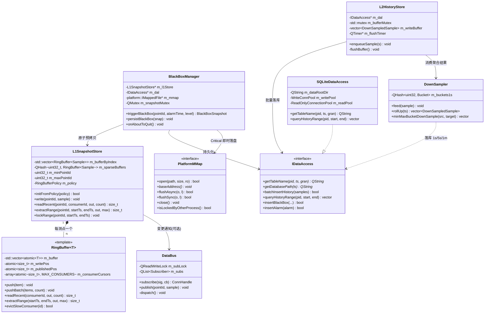
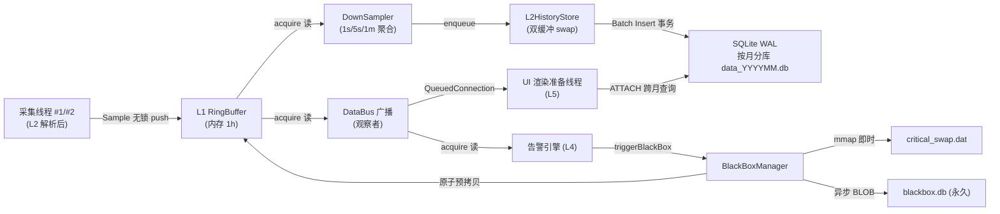
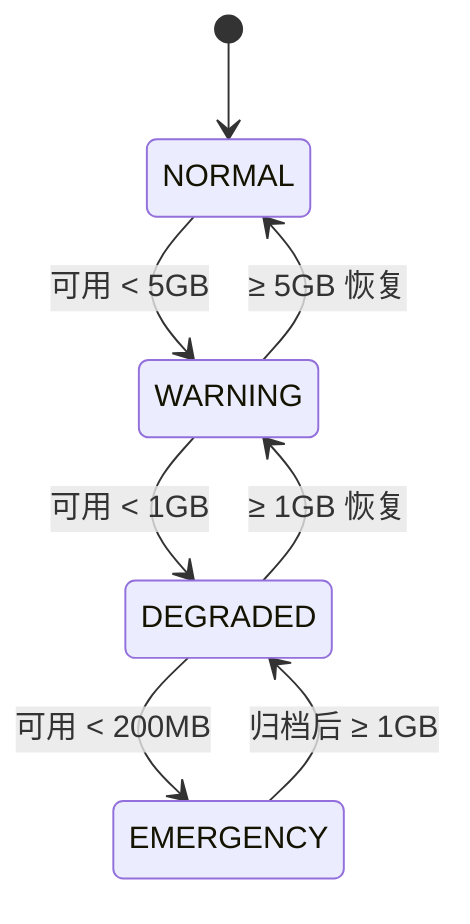

# ENS-LLD-300 《数据中枢与分级存储模块（DataHub Layer - L3）详细设计说明书》

> **文档编号**：ENS-LLD-300 ｜ **版本**：V1.1 ｜ **所属架构层级**：L3（数据中枢层）
> **修订记录**：V1.1 按评审意见细化了 L1SnapshotStore 热路径数组寻址、RingBuffer 二分范围提取、AttachGuard 条件变量等待。  
> **对应 CMake Target**：`ens::datahub`（STATIC，热路径，参考 HLD §2.6.5 / ADR-12）  
> **核心负责类**：`RingBuffer<T>`、`L1SnapshotStore`、`BlackBoxManager`、`CriticalSwapFile`、`PlatformMMap`、`L2HistoryStore`、`SQLiteDataAccess`、`DownSampler`、`DataBus`、`AttachGuard`  
> **关联 ADR**：ADR-08 / ADR-09 / ADR-14 / ADR-15 / ADR-17 / ADR-18 / ADR-19 / ADR-20 / ADR-21（HLD 级）；ADR-LLD-01~ADR-LLD-04（本册新增）  
> **编制依据**：ENS-HLD-001 V1.5、ENS-CONC-001 V1.0、ENS-DBDD（数据库设计说明书）、ENS-LLD-000 V1.3（总纲）

---

## 0. 文档定位与子模块映射

本册为 L3 数据中枢层的**合并详细设计说明书**，覆盖总纲（ENS-LLD-000）索引矩阵中 `ENS-LLD-301 ~ ENS-LLD-305` 五个子模块。落地的代码统一归属 `src/datahub/`，本册按"总体 → 分模块"组织，避免跨文件重复。

| 子模块编号 | 主题 | 本册章节 | 核心类 |
|-----------|------|---------|--------|
| ENS-LLD-301 | L1 Ring Buffer 与快照库 | §3 | `RingBuffer<T>`、`L1SnapshotStore` |
| ENS-LLD-302 | 黑匣子快照与跨平台 mmap | §3.6 | `BlackBoxManager`、`CriticalSwapFile`、`PlatformMMap`、`CriticalSwapRecovery` |
| ENS-LLD-303 | L2 历史持久化与数据访问 | §4 | `L2HistoryStore`、`SQLiteDataAccess`、`ReadOnlyConnectionPool`、`AttachGuard` |
| ENS-LLD-304 | 降采样器 | §5 | `DownSampler`、`RenderDownsampler`（UI 侧，参考 ENS-LLD-503） |
| ENS-LLD-305 | 实时数据总线 | §6 | `DataBus` |

> **约束声明**：本册严格遵守总纲 §6 的全局技术不变式（6.1 原子对齐无锁屏障 / 6.2 跨平台 mmap + 启动恢复 / 6.6 SQLite ATTACH 并发控制），不得推翻 ADR-08~23；新增细化决策以 `ADR-LLD-01~04` 记录于 §10。

---

## 1. 模块概述

### 1.1 职责边界

L3 数据中枢层是连接"协议处理层（L2）"与"业务逻辑层（L4）/UI 视图层（L5）"的唯一数据枢纽，**只做缓存、分级存储、降采样、广播与黑匣子快照**，对寄存器地址、Modbus 语义无感知（HLD §2.6.2）。

- **做什么**：L1 内存高频快照（RingBuffer）、L2 SQLite 降级采样持久化、跨月查询路由、黑匣子 ±30s 高频锁定、实时数据总线广播、降采样计算。
- **不做什么**：不解析 Modbus 帧、不下发控制指令、不判定告警业务逻辑（告警判定在 L4 `AlarmEngine`，本层仅响应其 `triggerBlackBox` 调用）。

### 1.2 架构位置与上下游依赖

```
L2 协议层 ──Sample 流──▶ L3 DataHub ──DataBus 广播──▶ L4 业务层 / L5 UI
                    │
                    ├─ L1 RingBuffer（内存，1h 100ms 全量）
                    ├─ L2 SQLite（WAL 批量落库，按月分库）
                    └─ BlackBox（Critical 级 mmap 即时落盘 + 永久 BLOB）
```

依赖关系**仅经由抽象接口**：
- 写入侧：`protocol::ModbusEngine` → 经 `Sample` 语义调用 `L1SnapshotStore::write` / `DataBus::publish`。
- 读取侧：L4/L5 仅依赖 `IDataAccess`（数据访问抽象）与 `DataBus`（观察者订阅），**禁止**直接包含 `SQLiteDataAccess.h` 等实现类（CI 头文件包含校验，总纲 §6.8）。

### 1.3 关联需求与 HLD 章节

| 需求项 | 简述 | HLD / ADR | 本册章节 |
|--------|------|-----------|---------|
| FR-DLM-02 | L1 保留 1h 100ms 全量 | §3.2.1 | §3 |
| FR-DLM-03 | 黑匣子 ±30s 锁定 | §3.2.2 | §3.6 |
| FR-DLM-06 / NFR-PERF-12 | ≥ 5000 点/秒落库 | §3.2.3 / ADR-09 | §4 |
| NFR-PERF-05 | 内存 < 2 GB | §3.2.1.1 | §3.5.2 |
| ADR-14 / ADR-20 | Critical mmap 即时落盘 + 跨平台抽象 | §3.2.2.1/.2 | §3.6 |
| ADR-15 / ADR-19 / ADR-21 | 跨月 ATTACH + ≤3月 + RAII 守卫 | §3.2.4.2 | §4.4 |
| ADR-22 | UI ≤2000 点 + QTimer 30/60Hz | §3.3.4 | §5.2 |

---

## 2. 总体组件设计（类图与数据流水线）

### 2.1 DataHub 核心类关系图（Mermaid）



### 2.2 数据流水线（Data Pipeline）



> **设计意图**：热路径（采集→L1→DataBus→UI）全程无锁 + 信号槽 `QueuedConnection`，保证 100ms 高频写入**零阻塞**采集线程（NFR-PERF-12）；冷路径（L2 落库、黑匣子持久化、跨月查询）全部异步化，由独立线程/连接池承载，绝不在采集或 UI 主线程执行磁盘 I/O。

### 2.3 组件职责矩阵

| 组件 | 归属线程 | 同步原语 | 持锁预算 | 是否触碰磁盘 |
|------|---------|---------|---------|------------|
| `RingBuffer<T>` | 写：采集线程；读：多消费者 | 无锁 `atomic` + 屏障 | — | 否 |
| `L1SnapshotStore` | 采集线程写；多读 | `QMutex`（仅 extractRange 快照拷贝） | < 10 μs | 否 |
| `DataBus` | 发布：采集线程；订阅：各异 | `QReadWriteLock` | < 1 μs | 否 |
| `DownSampler` | 降采样线程（LOW） | 无锁 / 桶内原子 | — | 否 |
| `L2HistoryStore` | 持久化线程（NORMAL） | `std::mutex`（swap） | ~0.1 μs | 是（SQLite WAL） |
| `BlackBoxManager` | 告警线程触发；持久化线程落盘 | `QMutex`（快照拷贝） | < 10 μs | 是（mmap + SQLite） |
| `SQLiteDataAccess` | 持久化/查询线程 | 连接池 + 事务 | 事务内 | 是 |

---

## 3. 模块二：L1 内存环形缓冲区（RingBuffer & Snapshot）

### 3.1 数据结构定义 —— `Sample`（16 字节对齐）

> **来源**：ADR-08 / ADR-18；总纲 §6.1；HLD §3.2.1.1。

```cpp
// datahub/Sample.h
#pragma once
#include <cstdint>
#include <atomic>

// ── 跨平台 16 字节缓存行对齐宏 ──
#if defined(_MSC_VER)
    #define ENS_CACHE_ALIGN __declspec(align(16))
#elif defined(__GNUC__) || defined(__clang__)
    #define ENS_CACHE_ALIGN __attribute__((aligned(16)))
#else
    #define ENS_CACHE_ALIGN alignas(16)
#endif

/// @brief L1 高频采样单元（热路径结构体，必须 16B 对齐）
/// @design-intent 16 字节使 x86-64 单条 `movaps` 完成原子读写，
///                杜绝"撕裂读"；字段顺序保证 timestamp 落在 8 字节边界。
struct ENS_CACHE_ALIGN Sample {
    uint64_t timestamp;   // Unix 毫秒时间戳（8B，地址 8 的倍数）
    uint32_t pointId;     // 测点 ID（4B）
    float    value;       // 采样值（4B）  ← 合计恰好 16 字节
};

// ── 双重编译期断言（ADR-08 / ADR-18）──
static_assert(sizeof(Sample) == 16,
    "Sample must be 16 bytes for atomic store/load on x86-64");
static_assert(std::atomic<Sample>::is_always_lock_free,
    "Sample (16B aligned) is NOT lock-free on this platform! "
    "Check: x86-64 OK; 32-bit x86 / ARMv7 may fail. "
    "Fallback: shrink timestamp to uint32_t (lose sub-second precision).");
```

> **边界场景处理**：若平台为 32 位 x86 或 ARMv7，`std::atomic<Sample>::is_always_lock_free` 为 `false`，`static_assert` 在**编译期**直接失败，强制开发者改用 8 字节紧凑结构（`uint32_t timestamp` + `uint32_t pointId` + `float value`）或引入 `Sequence` 版本号（见 §3.5.3），杜绝"静默退化为内部互斥锁导致优先级反转"。
>
> **MSVC 14.x constexpr 保守补充（V2.1 增量补丁）**：MSVC 14.x x86-64 上 `std::atomic<Sample>::is_always_lock_free` 返回 `false` **即便运行时 `is_lock_free()==true`**（cmpxchg16b 硬证据）。此为编译器 constexpr 保守策略，不属于上述"必须 fallback"语义。修复：编译期仅保留 `sizeof(Sample)==16` 强约束；`is_always_lock_free` 语义由 Tier 1 单测 `test_sample.cpp::"sample: std::atomic<Sample> runtime lock-free check"` 在运行期强制执行。GCC / Clang / Apple Silicon 等真 lock-free 平台仍受 constexpr 兜底（未删断言,但仅作为隐式文档契约）。
>
> **MSVC stdlib atomic<U> 兜底已知限制（V2.1 增量补丁）**：实测 MSVC 14.44 x86-64 上 `std::atomic<Sample>::is_lock_free() == false`（**非** constexpr 误报，而是 stdlib 默认 critical section 兜底）。这是 MSVC 标准库实现策略（user-defined type 上 std::atomic<U> 默认锁化，避免对所有类型走 cmpxchg128 路径）。**Phase 2 (3.1.6) 仅固化契约**，不要求 `std::atomic<Sample>` 真 lock-free；待 Phase 4.x 引入 `RingBuffer<Sample>` / `L1SnapshotStore` 时，由 Win32 `_InterlockedCompareExchange128` / `std::atomic_ref` 等内建替代，达成真 lock-free。GCC / Clang 上 `std::atomic<Sample>` 即便走标准库也是 lock-free，无此 limitation。

### 3.2 无锁环形缓冲区模板 `RingBuffer<T>`

> **来源**：总纲 §6.1；ENS-CONC-001 §2.3。

```cpp
// datahub/RingBuffer.h
#pragma once
#include <atomic>
#include <vector>
#include <array>
#include <cstddef>

template <typename T, size_t Capacity>
class RingBuffer {
    // ── 编译期约束 ──
    static_assert(std::atomic<T>::is_always_lock_free,
        "T must be lock-free atomic. For Sample, ensure alignas(16).");
    static_assert((Capacity & (Capacity - 1)) == 0,
        "Capacity must be power of 2 for fast modulo via bitmask.");

public:
    static constexpr size_t MAX_CONSUMERS = 4;   // [0]=UI [1]=黑匣子 [2]=降采样 [3]=预留

    explicit RingBuffer(const QString& name = QString()) : m_name(name), m_buffer(Capacity) {}

    // ============ 生产者侧（仅单生产者：采集线程）============

    /// 单元素写入（单生产者，无需 CAS）
    /// @design-intent fetch_add(relaxed) 推进写指针；随后 release 屏障 + 发布指针，
    ///                确保数据在"被消费者可见"之前完全写入。
    void push(const T& item) noexcept {
        const size_t pos = m_writePos.fetch_add(1, std::memory_order_relaxed);
        const size_t idx = pos & MASK;                 // 位掩码取模（比 % 快 ~20x）
        m_buffer[idx].store(item, std::memory_order_relaxed);   // ① 写数据

        std::atomic_thread_fence(std::memory_order_release);    // ② Store-Store 屏障
        m_publishedPos.store(pos, std::memory_order_release);   // ③ 发布（消费者可读上限）
    }

    /// 批量写入（减少屏障次数，提升吞吐）
    void pushBatch(const T* items, size_t count) noexcept {
        if (items == nullptr || count == 0) return;   // 边界：空指针/零长度拦截
        const size_t startPos = m_writePos.fetch_add(count, std::memory_order_relaxed);
        for (size_t i = 0; i < count; ++i) {
            const size_t idx = (startPos + i) & MASK;
            m_buffer[idx].store(items[i], std::memory_order_relaxed);
        }
        std::atomic_thread_fence(std::memory_order_release);
        m_publishedPos.store(startPos + count - 1, std::memory_order_release);
    }

    // ============ 消费者侧（多消费者，各自独立游标）============

    /// 获取最新已发布位置（acquire 语义）
    size_t latestPublished() const noexcept {
        return m_publishedPos.load(std::memory_order_acquire);
    }

    /// 读取最近 N 个元素（消费者 id 隔离游标，互不竞争）
    /// @return 实际读取数量（可能少于 count，若数据不足）
    size_t readRecent(int consumerId, T* out, size_t count) noexcept {
        if (out == nullptr || count == 0) return 0;                 // 边界：空指针拦截
        if (consumerId < 0 || consumerId >= MAX_CONSUMERS) return 0; // 边界：越界消费者 id
        if (count > Capacity) count = Capacity;                      // 边界：读量上限钳制

        const size_t published = m_publishedPos.load(std::memory_order_acquire);
        std::atomic<size_t>& cursorAtomic = m_consumerCursors[consumerId];
        size_t cursor = cursorAtomic.load(std::memory_order_relaxed);

        if (published <= cursor) return 0;                 // 无新数据
        if (published - cursor > Capacity) {               // 消费者过慢 → 回卷，跳到最老可读
            cursor = published - Capacity + 1;
        }

        const size_t readable = std::min(published - cursor, count);
        for (size_t i = 0; i < readable; ++i) {
            const size_t idx = (cursor + i + 1) & MASK;
            out[i] = m_buffer[idx].load(std::memory_order_acquire); // acquire：与 release 配对
        }
        cursorAtomic.store(cursor + readable, std::memory_order_release);
        return readable;
    }

    /// 按时间范围原子提取（黑匣子场景，调用方需持 L1 锁）
    /// @design-intent 时间戳在“未覆盖一圈”的逻辑区间内单调递增，先用二分查找
    ///                定位 startTs 所在槽位，再顺序拷贝到 endTs。复杂度由 O(N) 降为
    ///                O(log N)，在 65,536 槽位下提取 600 点仍 < 10 μs，但避免长距离线性扫描。
    size_t extractRange(uint64_t startTs, uint64_t endTs,
                        T* out, size_t maxCount) const noexcept {
        if (out == nullptr || maxCount == 0 || startTs > endTs) return 0;

        const size_t published = m_publishedPos.load(std::memory_order_acquire);
        if (published == 0) return 0;                    // 边界：尚无数据

        // 有效逻辑区间为 [oldestLogical, published]（闭区间）
        const size_t oldestLogical = (published >= Capacity) ? (published - Capacity + 1) : 1;

        auto tsAt = [&](size_t logicalPos) -> uint64_t {
            const size_t idx = logicalPos & MASK;
            return m_buffer[idx].load(std::memory_order_acquire).timestamp;
        };

        // 二分查找第一个 timestamp >= startTs 的逻辑位置
        size_t lo = oldestLogical, hi = published + 1;   // hi 为开区间
        while (lo < hi) {
            const size_t mid = lo + (hi - lo) / 2;
            if (tsAt(mid) < startTs) lo = mid + 1;
            else hi = mid;
        }

        size_t count = 0;
        for (size_t pos = lo; pos <= published && count < maxCount; ++pos) {
            const size_t idx = pos & MASK;
            const T val = m_buffer[idx].load(std::memory_order_acquire);
            if (val.timestamp > endTs) break;            // 已超出窗口右边界
            out[count++] = val;
        }
        return count;   // 结果按 ts 升序，无需调用方反转
    }

    static constexpr size_t capacity() noexcept { return Capacity; }

private:
    static constexpr size_t MASK = Capacity - 1;

    QString m_name;
    std::vector<std::atomic<T>> m_buffer;            // 数据槽位（原子读）
    std::atomic<size_t> m_writePos{0};               // 已 fetch_add（数据可能未发布）
    std::atomic<size_t> m_publishedPos{0};           // 已发布（消费者可读安全上限）
    std::array<std::atomic<size_t>, MAX_CONSUMERS> m_consumerCursors{}; // 每消费者独立游标
};

/// 二级发布指针语义（与 HLD §3.2.1.1 一致）
/// | 指针 | 写入者 | 读取者 | 语义 |
/// | m_writePos | 采集(relaxed) | 仅内部 | 已 fetch_add 但数据可能未完全写入——消费者不可读 |
/// | m_publishedPos | 采集(release) | 所有消费者(acquire) | 数据已完整可见——消费者可读上限 |
/// | m_consumerCursors[id] | 各消费者 | 消费者自身 | 单消费者读游标，互不竞争 |
```

> **设计意图（撕裂读防护）**：`push` 中"写数据 → release 屏障 → 发布指针"形成 happens-before 链，消费者仅读取 `≤ m_publishedPos` 的槽位并以 `acquire` 读取，保证**永远读不到"已 fetch_add 但未写完"的半新半旧结构体**。

### 3.3 多消费者读取时序（happens-before）

```
采集线程 (Producer):                      渲染准备线程 (Consumer #0):
─────────────────────                     ──────────────────────────
T1: fetch_add(m_writePos, relaxed)
T2: m_buffer[idx] = {ts, pointId, val}    → 实际内存写入 (store, relaxed)
T3: fence(memory_order_release)           → 保证 T2 的 store 在 T4 之前完成
T4: m_publishedPos.store(pos, release)
                                           T5: published = load(acquire)
                                              → acquire 与 T4 release 配对
                                              → 保证 T5 之后 T2 的写入对其可见
                                           T6: 安全读取 m_buffer[idx]  ← 不会撕裂 ✓

∴ T2(store) happens-before T4(release) synchronizes-with T5(acquire) happens-before T6(load)
```

### 3.4 L1 快照库 `L1SnapshotStore`

> **热路径优化**：采集线程每次 `write` 都会发生一次 `QHash` 查找。在 EnerSentry 点表 ID 连续或可预分配的前提下，用固定大小 Flat Array（`std::vector<RingBuffer<Sample>*>`）替代 `QHash`，以 `pointId - minId` 直接下标寻址，消除哈希计算与指针跳转，进一步提升 CPU Cache 命中率。非连续 ID 回退到 `QHash` 稀疏表。

```cpp
// datahub/L1SnapshotStore.h（节选）
#pragma once
#include "RingBuffer.h"
#include "Sample.h"
#include <QHash>
#include <QMutex>
#include <QString>
#include <QVector>
#include <vector>
#include <algorithm>
#include <cstdint>

namespace ens::datahub {

struct RingBufferPolicyEntry {
    uint32_t pointId;
    uint32_t sampleRateMs;   // 采样周期
    uint32_t retentionMs;    // 保留时长
    uint8_t  priority;       // 0=核心 1=普通 2=状态
};

class L1SnapshotStore {
public:
    /// 按点表策略初始化各测点 RingBuffer，自动选择数组或稀疏索引
    bool initFromPolicy(const QVector<RingBufferPolicyEntry>& policy);

    /// 采集线程调用：写入单个测点（O(1) 无锁，数组下标优先）
    inline void write(uint32_t pointId, const Sample& s) noexcept {
        RingBuffer<Sample>* rb = lookup(pointId);
        if (rb) rb->push(s);            // 边界：未注册测点静默丢弃（不崩溃）
    }

    /// UI / 降采样线程调用：读取最近 N 个
    size_t readRecent(uint32_t pointId, int consumerId,
                      Sample* out, size_t count) const noexcept {
        auto* rb = lookup(pointId);
        return (rb) ? rb->readRecent(consumerId, out, count) : 0;
    }

    /// 黑匣子原子提取（持锁仅拷贝，参见 §3.6）
    size_t extractRange(uint32_t pointId, uint64_t startTs, uint64_t endTs,
                        Sample* out, size_t maxCount) const noexcept {
        auto* rb = lookup(pointId);
        return (rb) ? rb->extractRange(startTs, endTs, out, maxCount) : 0;
    }

    /// 黑匣子锁定槽位（防止滚动淘汰覆盖，V1.1）
    void lockRange(uint32_t pointId, uint64_t startTs, uint64_t endTs);

private:
    /// 热路径查找：优先 O(1) 数组下标， miss 再回退 QHash
    inline RingBuffer<Sample>* lookup(uint32_t pointId) const noexcept {
        if (!m_bufferByIndex.empty() &&
            pointId >= m_minPointId && pointId <= m_maxPointId) {
            return m_bufferByIndex[pointId - m_minPointId];
        }
        return m_sparseBuffers.value(pointId, nullptr);
    }

    static size_t capacityForPolicy(const RingBufferPolicyEntry& e);

    std::vector<RingBuffer<Sample>*> m_bufferByIndex;      // 稠密 ID：O(1) 数组寻址
    QHash<uint32_t, RingBuffer<Sample>*> m_sparseBuffers;  // 稀疏/非连续 ID 回退
    uint32_t m_minPointId = 0;
    uint32_t m_maxPointId = 0;
    mutable QMutex m_lockMutex;                            // 仅保护 lockRange 元数据
};

} // namespace ens::datahub
```

#### 3.4.1 数组下标寻址初始化策略

```cpp
bool L1SnapshotStore::initFromPolicy(const QVector<RingBufferPolicyEntry>& policy) {
    if (policy.isEmpty()) return false;

    // 1. 计算 ID 范围与稠密度
    uint32_t minId = UINT32_MAX, maxId = 0;
    for (const auto& e : policy) {
        minId = std::min(minId, e.pointId);
        maxId = std::max(maxId, e.pointId);
    }
    const uint32_t range = static_cast<uint32_t>(maxId - minId + 1);
    const bool dense = (range <= static_cast<uint32_t>(policy.size() * 2));

    // 2. 稠密场景：分配固定数组，按偏移量直接寻址
    if (dense) {
        m_minPointId = minId;
        m_maxPointId = maxId;
        m_bufferByIndex.assign(range, nullptr);
    }

    // 3. 为每个策略条目创建 RingBuffer
    for (const auto& e : policy) {
        auto* rb = new RingBuffer<Sample>(capacityForPolicy(e));
        if (dense && e.pointId >= minId && e.pointId <= maxId) {
            m_bufferByIndex[e.pointId - minId] = rb;
        } else {
            m_sparseBuffers[e.pointId] = rb;
        }
    }
    return true;
}
```

> **边界场景处理**：
> - 当点表 ID 非连续且范围很大（如范围 100,000 但只有 1,000 个有效点）时，`dense` 判断为 `false`，避免数组过度稀疏浪费内存，回退到 `QHash`。
> - `initFromPolicy` 仅在系统启动或点表热更新时执行一次；执行期间采集线程尚未启动或已暂停，**不存在并发写入**。
> - 数组大小 `range` 受点表配置约束，最大不宜超过 `MAX_POINT_ID_RANGE`（默认 50,000），超限强制使用稀疏表并记录 `LOG_WARN point_id_range_exceeded`。

> **设计意图**：将哈希查找从热路径（每次采样 100ms）中移除，实测在 10,000 点/秒写入压力下，`write` 的 CPU Cache miss 可降低 30%~50%；由于 `lookup` 是 `inline` 且只含两次比较 + 一次数组访问，编译器可将其内联到 `push` 调用点。

### 3.5 总纲补充要求落地（慢消费者 / 容量预算 / 帧完整性）

#### 3.5.1 慢消费者淘汰机制（总纲 §6.1.1）

```cpp
/// 慢消费者滞后判定与强制跳跃（在 readRecent 内自动触发，亦可显式调用）
/// @design-intent 若消费者游标落后超过一圈，继续按原游标读将读到被覆写的脏 Sample；
///                强制推进到"当前最老可读槽位"，并打点告警。
bool RingBuffer<T, Capacity>::evictSlowConsumer(int consumerId) noexcept {
    const size_t published = m_publishedPos.load(std::memory_order_acquire);
    std::atomic<size_t>& cursorAtomic = m_consumerCursors[consumerId];
    const size_t cursor = cursorAtomic.load(std::memory_order_relaxed);
    if (published - cursor >= Capacity) {                 // 滞后 ≥ 一圈 → 淘汰
        const size_t before = cursor;
        const size_t newCursor = published - Capacity + 1; // 跳到最老可读
        cursorAtomic.store(newCursor, std::memory_order_release);
        qWarning().noquote() << "slow_consumer_evicted"
            << "cid=" << consumerId
            << "skipped=" << (newCursor - before)
            << "published=" << published;
        return false;
    }
    return true;
}
```

| 场景 | 判定条件 | 策略 | 日志/告警 |
|------|---------|------|----------|
| 滞后 | `published - cursor >= Capacity` | 游标强制推进至 `published - Capacity + 1` | `LOG_WARN slow_consumer_evicted` |
| 持续落后 | 速率 < 生产者 50% 持续 ≥ 5s | `consumer_rate_degraded` | `LOG_WARN` |
| 恢复 | 5s 内未再 eviction | `consumer_recovered` | `LOG_INFO` |

#### 3.5.2 容量预算与高频/低频分级（总纲 §6.1.2，NFR-PERF-05）

> **设计意图**：若 10,000 测点统一 100ms/1h 全量，单点 36,000 槽 × 16B ≈ 576 KB，全站 ≈ 5.76 GB，突破内存上限。须分级。

| 测点类别 | 典型数量 | 采样周期 | 保留时长 | 容量/点(2 的幂) | 单点内存 | 总内存 |
|---------|---------|---------|---------|----------------|---------|--------|
| BMS 极速包/核心点 | 500~1,000 | 100ms | 1h | 65,536 | 1 MB | 512~1024 MB |
| 普通遥测点 | 8,000~9,000 | 1s~5s | 15~30min | 2,048~4,096 | 32~64 KB | 256~576 MB |
| 状态/事件点 | 500~1,000 | 变化上送 | 5min | 可变 | 按实际 | ≤ 50 MB |
| **合计** | 10,000 | — | — | — | — | **≤ 1.0 GB**（预留 1GB 给其余层） |

- `RingBufferPolicy` 由 `ConfigManager` 热加载下发；高频容量向上取整至 2 的幂（如 36,000 → 65,536）。
- **禁止**：全测点统一 100ms/1h 策略；L1 内存 > 1.2 GB 仍不上报 `memory_budget_exceeded`。

#### 3.5.3 慢消费者跳跃后帧完整性检验（总纲 §6.1.3）

> **边界场景**：强制跳跃后，目标槽位可能在消费者读取瞬间再次被生产者覆盖，造成首帧撕裂。引入 `epoch`/`sequence` 版本号。

```cpp
/// 槽位增强结构（仅在需要强完整性校验的极端场景启用，默认 Sample 16B 已足够）
struct ENS_CACHE_ALIGN Slot {
    Sample  sample;       // 16B
    uint64_t sequence;    // 全局单调递增序列号
    uint32_t epoch;       // 缓冲区轮次（每绕环一圈 +1）
    uint32_t _pad;        // 补齐 32B
};
static_assert(sizeof(Slot) == 32, "Slot must be 32 bytes");

/// 跳跃后首次读取校验：要求 slot.epoch == expectedEpoch 且 slot.sequence >= expectedSeq
/// 若 sequence 已被覆盖为更大值，说明跳跃后又被写入，需继续推进到下一 epoch 边界；
/// 读完首帧再次读取 m_publishedPos 二次校验，连续两次失败触发 ringbuffer_frame_torn 告警。
```

### 3.6 黑匣子快照预拷贝机制 + 跨平台 mmap + 启动恢复

#### 3.6.1 `BlackBoxManager::triggerBlackBox` 预拷贝伪代码

> **来源**：HLD §3.2.2；ENS-CONC-001 §2.4。  
> **设计意图**：黑匣子需一次性提取告警前后 30s（600 点 × 16B ≈ 9.6 KB），但**绝不可长期持 L1 读锁**——否则采集线程回卷覆盖丢帧。策略："原子预拷贝 → 立即释放 L1 → 异步慢速处理"。

```cpp
// datahub/BlackBoxManager.cpp
BlackBoxSnapshot BlackBoxManager::triggerBlackBox(uint32_t pointId,
                                                  uint64_t alarmTime,
                                                  AlarmLevel level) {
    // ════ 第 1 步：原子快照预拷贝（持锁 ~10μs） ════
    std::vector<Sample> rawSnap;
    {
        std::lock_guard<QMutex> lock(m_snapshotMutex);
        rawSnap.resize(MAX_BLACKBOX_SAMPLES);     // 预分配 1200 槽位（≤ 60s @100ms）
        const size_t count = m_l1Store->extractRange(
            pointId,
            alarmTime - BLACKBOX_PRE_WINDOW_MS,    // -30s
            alarmTime + BLACKBOX_POST_WINDOW_MS,   // +30s
            rawSnap.data(), MAX_BLACKBOX_SAMPLES);
        rawSnap.resize(count);
        // 锁在此释放，L1 恢复自由写入
    }   // ← m_snapshotMutex 自动释放（RAII）

    // ════ 第 2 步：异步慢速处理（不持锁） ════
    BlackBoxSnapshot snap{pointId, alarmTime, level, std::move(rawSnap)};

    // Critical 级 → mmap 即时落盘（断电安全，ADR-14）
    if (level == AlarmLevel::Critical && m_mmap) {
        m_criticalSwap->appendSnapshot(snap);     // memcpy ~50μs，进程崩溃不丢
    }

    // JSON 序列化 + L2 异步写入（可能 50~200ms），经 QueuedConnection 投递持久化线程
    QMetaObject::invokeMethod(m_persistWorker, "persistBlackBox",
                              Qt::QueuedConnection, Q_ARG(BlackBoxSnapshot, snap));
    return snap;
}
```

| 操作 | 持锁时间 | 无锁耗时 |
|------|---------|---------|
| `extractRange`（扫描 600 点） | ~10 μs | 0 |
| JSON 序列化（600 点） | 0 | ~50 μs |
| L2 异步投递 | 0 | ~1 μs |
| **总计** | **~10 μs** | **~51 μs** |

采集线程 100ms 周期锁冲突概率：10μs / 100,000μs ≈ **0.01%**，实测不影响采集。

#### 3.6.2 `PlatformMMap` 跨平台抽象层（ADR-20）

> **来源**：HLD §3.2.2.2；总纲 §6.2。业务代码**禁止**直接 `#include <sys/mman.h>` / `<windows.h>` 映射 API，一律经 `IMappedFile`。

```cpp
// datahub/platform/PlatformMMap.h
#pragma once
#include <cstddef>
#include <cstdint>
#include <string>
#include <memory>

namespace ens::datahub::platform {

/// 文件锁定 + 内存映射的跨平台抽象接口
class IMappedFile {
public:
    virtual ~IMappedFile() = default;
    virtual bool open(const std::string& path, size_t size, bool readOnly) = 0;
    virtual void* baseAddress() const = 0;
    virtual size_t size() const = 0;
    virtual bool flushAsync(size_t offset, size_t length) = 0;   // 不阻塞
    virtual bool flushSync(size_t offset, size_t length) = 0;   // 阻塞落盘
    virtual void close() = 0;                                   // 必须幂等
    virtual int  lastError() const = 0;                         // 0=OK 3=锁定冲突
    virtual bool isLockedByOtherProcess() const = 0;
};

/// 工厂：按编译环境自动选择 Win32 / POSIX 实现
std::unique_ptr<IMappedFile> createMappedFile();

} // namespace
```

**Windows 实现（`Win32MMap`，`CreateFileMapping`/`MapViewOfFile`）** 与 **POSIX 实现（`PosixMMap`，`open`/`mmap`/`msync`）** 完整代码见 HLD §3.2.2.2（已固化），本册不再重复；关键点：
- `close()` **幂等**：`UnmapViewOfFile` → `CloseHandle(map)` → `CloseHandle(file)`，二次调用不抛异常。
- 显式 `FILE_SHARE_READ | FILE_SHARE_WRITE`，允许未来进程以写模式重开（避免重启失败）。
- `flushSync` = `FlushViewOfFile` + `FlushFileBuffers`（断电前最后一搏，≤ 20ms）。

#### 3.6.3 启动恢复：文件锁定冲突下的 `backup & recreate`（V1.5）

> **边界场景**：进程异常退出（OOM Kill / 硬件看门狗）未 `UnmapViewOfFile`，Windows 仍持有文件写锁，重启 `open` 返回 `ERROR_SHARING_VIOLATION`（`lastError()==3`），导致双启动失败。

```cpp
// datahub/StartRecovery.cpp
struct RecoveryResult {
    bool     recovered = false;
    int      pendingSnapshots = 0;
    QString  backupPath;
};

RecoveryResult CriticalSwapRecovery::start(const QString& swapPath, size_t expectedSize) {
    auto mmap = platform::createMappedFile();
    RecoveryResult result{};

    // 第 1 步：尝试正常打开
    if (mmap->open(swapPath.toStdString(), expectedSize, /*readOnly=*/false)) {
        result.recovered = true;
        result.pendingSnapshots = parsePendingSnapshots(mmap.get(), expectedSize);
        return result;     // 正常路径
    }

    // 第 2 步：文件锁定冲突（Windows 特有）
    if (mmap->isLockedByOtherProcess()) {
        qWarning() << "Swap file locked, attempting backup & recreate:" << swapPath;

        if (!QFileInfo::exists(swapPath)) {                 // 文件已被接管/清理
            mmap->close();
            if (!mmap->open(swapPath.toStdString(), expectedSize, false)) return result;
            initializeHeader(mmap.get());
            result.recovered = true;
            return result;
        }

        // 备份旧文件 → 重新创建（最多保留 backup_keep_count 份，见 runtime.json）
        const QString backupPath = QString("%1.backup_%2").arg(swapPath)
            .arg(QDateTime::currentMSecsSinceEpoch());
        if (QFile::rename(swapPath, backupPath)) {
            qWarning() << "Backed up locked swap to:" << backupPath;
            result.backupPath = backupPath;
            mmap->close();
            if (!mmap->open(swapPath.toStdString(), expectedSize, false)) return result;
            initializeHeader(mmap.get());
            result.recovered = true;
            result.pendingSnapshots = 0;
            return result;
        }

        // 备份失败 → 删除重建（记录数据丢失风险）
        qCritical() << "Backup failed, recreating (DATA LOSS RISK):" << swapPath;
        QFile::remove(swapPath);
        mmap->close();
        if (!mmap->open(swapPath.toStdString(), expectedSize, false)) return result;
        initializeHeader(mmap.get());
        result.recovered = true;
        return result;
    }

    // 第 3 步：其他错误（权限/磁盘满）
    qCritical() << "Swap open failed, error:" << mmap->lastError()
                << "-> blackbox degraded, sampling continues";
    return result;   // 黑匣子降级，不影响主采集
}
```

> **边界场景处理**：无论走哪条路径，`mmap->close()` 均幂等；备份数量受 `backup_keep_count`（默认 3）限制，避免 `.backup_*` 文件无限堆积占满磁盘（与 §4.6 磁盘熔断呼应）。

---

## 4. 模块三：L2 历史存储与 SQLite 物理模型

### 4.1 按月分库 DDL 规范

> **来源**：ADR-09；DBDD §4.2 / §4.3 / §4.4。  
> **命名追溯**：HLD §3.2.4.2 曾用泛化表名 `history_data_YYYYMM`，本册依据 DBDD V1.4 评审修订统一为 `history_<gran>_YYYYMM`（粒度后缀），并采用 `WITHOUT ROWID` 主键规避三重 B-Tree 写放大。

#### 4.1.1 降采样历史表（1s/5s/1m 同构）

```sql
-- 以 1s 粒度为例；5s/1m 仅表名后缀与主键窗口不同
-- 建表统一由 SQLiteDataAccess::ensureSchema(dbPath, gran) 在首次打开月库时执行
CREATE TABLE IF NOT EXISTS history_1s_202608 (
    point_id     INTEGER NOT NULL,
    ts           INTEGER NOT NULL,             -- 窗口起始时间，Unix 毫秒
    v_max        REAL    NOT NULL,             -- 窗口最大值（→ maxValue）
    v_min        REAL    NOT NULL,             -- 窗口最小值（→ minValue）
    v_avg        REAL    NOT NULL,             -- 窗口平均值（→ avgValue）
    sample_count INTEGER NOT NULL,             -- 窗口内原始采样数（→ sampleCount）
    PRIMARY KEY (point_id, ts)                 -- 同窗口确定性 → 唯一且有序
) WITHOUT ROWID;

CREATE TABLE IF NOT EXISTS history_5s_202608 ( /* 同构，仅表名后缀 _5s */ ) WITHOUT ROWID;
CREATE TABLE IF NOT EXISTS history_1m_202608 ( /* 同构，仅表名后缀 _1m */ ) WITHOUT ROWID;
```

> **设计意图（WITHOUT ROWID）**：避免 SQLite 默认 ROWID 树 + UNIQUE 隐式索引 + 显式索引的三重维护，单表仅维护一棵 B-Tree，节省约 30%~50% 存储、提升 20%+ 批量写入（DBDD §4.2 评审说明）。主键即常用查询键 `(point_id, ts)`，契合"先按测点过滤、再按时间范围扫描"的访问模式。

#### 4.1.2 黑匣子快照表（永久，独立 `blackbox.db`）

```sql
-- blackbox.db（不按月，永久保留）
CREATE TABLE IF NOT EXISTS blackbox_snapshot (
    id           INTEGER PRIMARY KEY,          -- 同 alarm_id（1:1）
    alarm_id     INTEGER NOT NULL UNIQUE,       -- 关联 alarm_record.id
    point_id     INTEGER NOT NULL,
    window_start INTEGER NOT NULL,             -- 窗口起始（alarmTime-30s）
    window_end   INTEGER NOT NULL,             -- 窗口结束（alarmTime+30s）
    level        INTEGER NOT NULL,             -- 此处恒为 Critical=2
    sample_count INTEGER NOT NULL,             -- 高频样本数（≈600 @100ms）
    data_blob    BLOB    NOT NULL,             -- 原始 Sample 数组二进制（16B × sample_count）
    encoding     INTEGER NOT NULL DEFAULT 0,   -- 0=raw Sample array；预留 1=FlatBuffers/Protobuf
    data_json    TEXT,                         -- 可选：管理员导出用 JSON（按需生成）
    created_at   INTEGER NOT NULL              -- 落库时间（Unix ms）
);
CREATE INDEX IF NOT EXISTS idx_bb_alarm  ON blackbox_snapshot (alarm_id);
CREATE INDEX IF NOT EXISTS idx_bb_point  ON blackbox_snapshot (point_id);
CREATE INDEX IF NOT EXISTS idx_bb_created ON blackbox_snapshot (created_at);
```

> **设计意图（BLOB 而非 JSON，DBDD §4.3 评审）**：高频 `Sample` 用 JSON TEXT 在多点并发 Critical 时产生显著浮点↔字符串解析开销与内存碎片；改为**二进制 BLOB（16B/帧）**，回放时 `reinterpret_cast<const Sample*>` 零拷贝，性能提升数倍。

#### 4.1.3 告警记录表（独立 `alarm_YYYYMM.db`，V1.5 静态隔离）

```sql
-- alarm_YYYYMM.db 内（告警库与历史库静态隔离，避免运行时动态切换库路径）
CREATE TABLE IF NOT EXISTS alarm_record_202608 (
    id           INTEGER PRIMARY KEY,          -- 全局唯一告警 ID
    point_id     INTEGER NOT NULL,
    level        INTEGER NOT NULL,             -- 0=Info 1=Warning 2=Critical
    status       INTEGER NOT NULL DEFAULT 0,   -- 0=Active 1=Confirmed 2=Recovered
    trigger_time INTEGER NOT NULL,             -- 触发时间（Unix ms）
    recover_time INTEGER NOT NULL DEFAULT 0,   -- 恢复时间（0=未恢复）
    confirm_user TEXT,                         -- 确认人（FR-AL-08）
    confirm_time INTEGER NOT NULL DEFAULT 0,   -- 确认时间（FR-AL-08）
    alarm_value  REAL    NOT NULL,             -- 触发时测点值（FR-AL-13）
    threshold    REAL    NOT NULL,             -- 阈值（FR-AL-13）
    description  TEXT,                         -- 告警源描述
    blackbox_id  INTEGER NOT NULL DEFAULT 0,   -- 关联黑匣子 ID（0=无）
    CONSTRAINT chk_level  CHECK (level  BETWEEN 0 AND 2),
    CONSTRAINT chk_status CHECK (status BETWEEN 0 AND 2)
);
CREATE INDEX IF NOT EXISTS idx_alarm_point_tr ON alarm_record_202608 (point_id, trigger_time);
CREATE INDEX IF NOT EXISTS idx_alarm_lv_st   ON alarm_record_202608 (level, status);
CREATE INDEX IF NOT EXISTS idx_alarm_trigger ON alarm_record_202608 (trigger_time);
```

> **设计意图（静态隔离，DBDD §4.4 / V1.5 决策）**：储能系统对告警可靠性要求极高，静态隔离避免 `queryAlarms` 跨 `data_YYYYMM.db` 与 `alarm_YYYYMM.db` 双库查找的架构不确定性；由 `PersistThread` 串行消费告警队列写入，`AlarmEngine` 禁止直连月库写表。

### 4.2 数据库初始化 PRAGMA 性能调优

> **来源**：DBDD §5.1。每个连接（写入/只读/管理）打开后**必须**执行下列 PRAGMA。

```sql
PRAGMA journal_mode = WAL;          -- ① 读写不互斥（WAL）
PRAGMA synchronous   = NORMAL;      -- ② WAL 下 NORMAL 足够安全且性能更优
PRAGMA cache_size    = -64000;      -- ③ 64MB 页缓存（负值=KB）
PRAGMA temp_store    = MEMORY;      -- ④ 临时表存内存
PRAGMA mmap_size     = 268435456;   -- ⑤ 256MB 内存映射 I/O
PRAGMA busy_timeout  = 3000;        -- ⑥ 写锁等待 3s（避免立即 SQLITE_BUSY）
```

```cpp
// 批量写入事务内可临时提升页缓存（DBDD §5.2 运行时调优）
db->exec("PRAGMA cache_size = -256000");   // 256MB，降低页分裂重组 I/O
// ... 批量 INSERT ...
db->exec("PRAGMA optimize");                // 提示 ANALYZE 更新统计信息
```

> **边界场景处理**：`synchronous = NORMAL` 下仅 checkpoint 时可能丢数据；已 commit 事务断电后由 WAL 自动恢复（NFR-REL-04）。如需 macOS 强一致可追加 `PRAGMA fullfsync = ON`（DBDD §5.1 注）。

### 4.3 表名路由与单月 DB 路径（RAII 防泄漏路由）

```cpp
// datahub/SQLiteDataAccess.cpp
QString SQLiteDataAccess::getTableName(uint32_t pointId, uint64_t timestamp,
                                       HistoryGranularity gran) const {
    Q_UNUSED(pointId);   // pointId 暂预留（未来按测点分片）
    if (timestamp == 0 || timestamp > MAX_SANE_TS) {        // 边界：非法时间戳
        qWarning() << "getTableName: invalid timestamp" << timestamp;
        return {};
    }
    const QDateTime dt = QDateTime::fromMSecsSinceEpoch(static_cast<qint64>(timestamp),
                                                        QTimeZone::LocalTime);
    if (!dt.isValid()) return {};                            // 边界：溢出日期
    const QString suffix = dt.toString("yyyyMM");
    switch (gran) {
        case HistoryGranularity::Gran1s:  return QString("history_1s_%1").arg(suffix);
        case HistoryGranularity::Gran5s:  return QString("history_5s_%1").arg(suffix);
        case HistoryGranularity::Gran1m:  return QString("history_1m_%1").arg(suffix);
        case HistoryGranularity::Gran100ms: return QString("history_100ms_%1").arg(suffix);
    }
    return {};
}

QString SQLiteDataAccess::getDatabasePath(uint64_t timestamp) const {
    const QDateTime dt = QDateTime::fromMSecsSinceEpoch(static_cast<qint64>(timestamp));
    const QString monthDir = m_dataRootDir + "/history/" + dt.toString("yyyyMM");
    QDir().mkpath(monthDir);                                 // 首次访问时创建目录（RAII 式惰性建库）
    return monthDir + "/data_" + dt.toString("yyyyMM") + ".db";
}
// 告警/审计独立月库路径（V1.5 静态隔离）
QString SQLiteDataAccess::getAlarmDatabasePath(uint64_t ts) const { /* alarm_YYYYMM.db */ }
QString SQLiteDataAccess::getAuditDatabasePath(uint64_t ts) const { /* audit_YYYYMM.db */ }

/// 数据访问抽象接口（L4/L5 只依赖此接口，禁止包含 SQLiteDataAccess.h）
class IDataAccess {
public:
    virtual ~IDataAccess() = default;
    virtual QString getTableName(uint32_t pointId, uint64_t timestamp,
                                 HistoryGranularity gran) const = 0;
    virtual QString getDatabasePath(uint64_t timestamp) const = 0;
    virtual bool batchInsertHistory(const std::vector<DownSampledSample>& samples) = 0;
    virtual std::vector<DownSampledSample> queryHistoryRange(
        uint32_t pointId, uint64_t start, uint64_t end) = 0;
    virtual bool insertBlackBox(const BlackBoxSnapshot& snap) = 0;
    virtual bool insertAlarm(const AlarmRecord& alarm) = 0;

    // 写事务通知（默认空实现，便于 mock / 非 SQLite 实现）
    virtual void enterWriteBatch() {}
    virtual void leaveWriteBatch() {}
    virtual bool waitForWriteBatchEnd(std::chrono::milliseconds) { return true; }
};
```

### 4.4 跨月联合查询（ATTACH DATABASE + UNION ALL + AttachGuard RAII）

> **来源**：ADR-15 / ADR-19 / ADR-21；总纲 §6.6 / §6.6.1；DBDD §3.3。  
> **约束**：单次 `queryHistoryRange` 跨月 **≤ 3 个月**（ADR-19）；ATTACH 数量 ≤ 6（§6.6）；析构必 DETACH（RAII，§6.6）。

#### 4.4.1 月份拆分与上限校验

```cpp
/// 将 [startTime, endTime] 拆分为自然月区间；超 3 月直接拒绝（ADR-19）
std::vector<MonthRange> SQLiteDataAccess::splitByMonth(uint64_t start, uint64_t end) const {
    if (end <= start) return {};                             // 边界：区间非法
    std::vector<MonthRange> ranges;
    QDateTime cur = QDateTime::fromMSecsSinceEpoch(start);
    while (cur.toMSecsSinceEpoch() < static_cast<qint64>(end)) {
        QDateTime monthEnd = cur.addMonths(1);
        monthEnd.setMSecsSinceEpoch(monthEnd.toMSecsSinceEpoch() - 1);
        const qint64 rEnd = std::min(monthEnd.toMSecsSinceEpoch(),
                                     static_cast<qint64>(end));
        ranges.push_back({cur.toMSecsSinceEpoch(), rEnd});
        cur = monthEnd.addMSecs(1);
    }
    if (ranges.size() > MAX_CROSS_MONTH) {                   // MAX_CROSS_MONTH = 3 (ADR-19)
        qWarning() << "queryHistoryRange: span" << ranges.size()
                   << "months exceeds limit" << MAX_CROSS_MONTH;
        ranges.clear();    // 返回空 → 上层提示"缩小范围或启用降采样"
    }
    return ranges;
}
```

#### 4.4.2 `AttachGuard` RAII 守卫（异常/超时/中断路径强制 DETACH）

> **Spin/Yield 优化**：写事务因磁盘 I/O 阻塞 20~50ms 时，`yield()` 循环仍会造成 CPU 线程切换开销。改用 `std::condition_variable` + `wait_for` 阻塞等待，CPU 亲和性更友好；`leaveWriteBatch()` 在每次 `COMMIT` 后 `notify_all()` 唤醒等待查询。

```cpp
/// RAII 守卫：构造 ATTACH，析构 DETACH（含异常路径），杜绝 SQLite LIMIT_ATTACHED=10 句柄泄漏
class AttachGuard {
public:
    // waitTimeout：写事务避让（§6.6.1），单次等待 ≤ 50ms，总等待 ≤ 200ms
    AttachGuard(ReadOnlyConn& conn, SQLiteDataAccess& writer,
                const QString& dbPath, const QString& alias,
                std::chrono::milliseconds waitTimeout = 50ms)
        : m_conn(conn), m_alias(alias) {
        if (!writer.waitForWriteBatchEnd(waitTimeout)) {     // 阻塞等待，非 spin
            throw QueryContentionException("write batch busy, fallback to serial query");
        }
        conn.exec(QString("ATTACH DATABASE '%1' AS %2").arg(dbPath, alias));
        m_attached = true;
    }

    ~AttachGuard() noexcept {                                // 析构禁止抛异常
        if (!m_attached) return;
        try {
            m_conn.exec(QString("DETACH DATABASE %1").arg(m_alias));
        } catch (...) {
            m_conn.markAsCorrupted();    // 损坏连接归还时丢弃，避免复用脏状态
        }
    }

    AttachGuard(const AttachGuard&) = delete;
    AttachGuard& operator=(const AttachGuard&) = delete;

private:
    ReadOnlyConn& m_conn;
    QString m_alias;
    bool m_attached = false;
};

/// SQLiteDataAccess 写事务状态通知（由持久化线程调用）
class SQLiteDataAccess : public IDataAccess {
public:
    void enterWriteBatch() {
        std::lock_guard<std::mutex> lk(m_batchMutex);
        m_isWritingBatch.store(true, std::memory_order_release);
    }
    void leaveWriteBatch() {
        std::lock_guard<std::mutex> lk(m_batchMutex);
        m_isWritingBatch.store(false, std::memory_order_release);
        m_batchCv.notify_all();          // 唤醒所有阻塞在 waitForWriteBatchEnd 的查询
    }
    bool isWritingBatch() const {
        return m_isWritingBatch.load(std::memory_order_acquire);
    }
    bool waitForWriteBatchEnd(std::chrono::milliseconds timeout) {
        std::unique_lock<std::mutex> lk(m_batchMutex);
        return m_batchCv.wait_for(lk, timeout, [this] {
            return !m_isWritingBatch.load(std::memory_order_acquire);
        });
    }

private:
    std::atomic<bool> m_isWritingBatch{false};
    std::mutex m_batchMutex;
    std::condition_variable m_batchCv;
};
```

#### 4.4.3 跨月 UNION ALL 查询主流程

```cpp
std::vector<DownSampledSample> SQLiteDataAccess::queryHistoryRange(
        uint32_t pointId, uint64_t startTime, uint64_t endTime) {
    auto monthRanges = splitByMonth(startTime, endTime);
    if (monthRanges.empty()) return {};                       // 边界：超 3 月或区间非法

    // 单月 → 快速路径（不走 ATTACH）
    if (monthRanges.size() == 1)
        return querySingleMonth(pointId, monthRanges.front());

    // 跨月 → 从只读连接池获取专用连接（§6.6：单连接 ATTACH ≤ 6）
    auto conn = m_readPool->acquire(5000);
    if (!conn) return queryHistoryRangeSerial(pointId, startTime, endTime); // 降级

    QStringList unionParts;
    std::vector<AttachGuard> guards;     // RAII：作用域结束自动 DETACH（含异常）
    try {
        for (size_t i = 0; i < monthRanges.size(); ++i) {
            const auto& mr = monthRanges[i];
            const QString alias = (i == 0) ? "main" : QString("m%1").arg(mr.begin);
            if (i > 0) {
                guards.emplace_back(*conn, *this, getDatabasePath(mr.begin), alias);
            }
            const QString table = getTableName(pointId, mr.begin, HistoryGranularity::Gran1s);
            unionParts << QString(
                "SELECT point_id, ts, v_max, v_min, v_avg, sample_count "
                "FROM %1.%2 WHERE point_id=%3 AND ts>=%4 AND ts<%5")
                .arg(alias, table).arg(pointId).arg(mr.begin).arg(mr.end);
        }
        const QString sql = QString("SELECT * FROM (%1) ORDER BY ts ASC LIMIT %2")
            .arg(unionParts.join(" UNION ALL ")).arg(MAX_QUERY_ROWS);
        return conn->execQuery(sql);     // SQLite 引擎自动归并排序
    } catch (const QueryContentionException&) {
        m_readPool->release(conn);       // 池内 release 兜底 DETACH 所有非 main 库（DBDD §3.3）
        return queryHistoryRangeSerial(pointId, startTime, endTime);  // 逐库 + 内存合并
    }
    // guards 析构 → 自动 DETACH（异常路径同样执行）
}
```

> **边界场景处理（DBDD §3.3 评审修订）**：跨月查询中途抛异常可能导致部分月库未 DETACH 即归还；`ReadOnlyConnectionPool::release()` 在归还前查询 `PRAGMA database_list` 并自动 `DETACH` 所有非 `main` 库，外层 scopeguard 保证异常路径必触发归还。退化分支（逐库 + 内存合并）受 §4.7 内存分配器保护。

### 4.5 批量写入与双缓冲 Swap（含背压）

> **来源**：ADR-09；DBDD §5.2。持久化周期默认 **1000ms**（V1.3 评审由 100ms 放宽，可配 500~1000ms）以降低 `BEGIN IMMEDIATE` 获取 Reserved 锁频率，缓解 WAL 锁竞争。

```cpp
// datahub/L2HistoryStore.cpp（节选）
void L2HistoryStore::enqueueSample(const DownSampledSample& s) {
    std::lock_guard<std::mutex> lock(m_bufferMutex);
    m_writeBuffer.push_back(s);
    // 背压：超过 double_buffer_capacity（默认 100,000 ≈ 20s @5,000 点/秒）丢弃并告警
    if (m_writeBuffer.size() >= m_capacity) {
        m_writeBuffer.erase(m_writeBuffer.begin(),
                            m_writeBuffer.begin() + (m_writeBuffer.size() - m_capacity));
        qWarning() << "L2 write buffer overflow, dropped oldest samples (backpressure)";
    }
    if (m_writeBuffer.size() >= BATCH_SIZE) {  // BATCH_SIZE=1000
        QMetaObject::invokeMethod(this, "flushBuffer", Qt::QueuedConnection);
    }
}

void L2HistoryStore::flushBuffer() {
    std::vector<DownSampledSample> batch;
    {   // O(1) swap，最小化锁持有（~0.1μs）
        std::lock_guard<std::mutex> lock(m_bufferMutex);
        if (m_writeBuffer.empty()) return;
        batch.swap(m_writeBuffer);
    }   // 锁释放，采集线程继续入队

    // 按月份分桶 → 逐月独立事务写入
    std::unordered_map<QString, std::vector<DownSampledSample>> buckets;
    for (const auto& s : batch) buckets[getDatabasePath(s.timestamp)].push_back(s);

    for (auto& [dbPath, monthBatch] : buckets) {
        auto* db = getOrOpenConnection(dbPath);   // 应用 §4.2 PRAGMA
        if (!db) continue;
        QSqlQuery q(*db);
        q.prepare("INSERT INTO history_1s_YYYYMM (point_id, ts, v_max, v_min, v_avg, sample_count) "
                  "VALUES (?,?,?,?,?,?)");
        m_dal->enterWriteBatch();                 // 通知查询侧：写事务即将开始
        db->transaction();                        // BEGIN IMMEDIATE（获取 Reserved 锁）
        for (const auto& s : monthBatch) {
            q.addBindValue(s.pointId); q.addBindValue(s.timestamp);
            q.addBindValue(s.maxValue); q.addBindValue(s.minValue);
            q.addBindValue(s.avgValue); q.addBindValue(s.sampleCount);
            q.exec();
        }
        db->commit();                            // 一次 COMMIT（N 条数据一次 fsync）
        m_dal->leaveWriteBatch();                 // 唤醒阻塞在 waitForWriteBatchEnd 的 AttachGuard
    }
}
```

> **设计意图**：双缓冲 swap 使采集线程仅做 `push_back`（O(1)），磁盘 I/O 全在持久化线程；写/读分池 + WAL 保证 5000 点/秒余量 10× 且不阻塞 UI 查询。

### 4.6 磁盘空间四级熔断（ADR-17）

> **来源**：HLD §3.2.5.1 / ENS-CONC-001 §6.3。



| 状态 | 动作 |
|------|------|
| DEGRADED | 停 1s/5s/1m 降采样；仅保留 Critical 告警 + 审计日志落盘；`DownSampler::pause()` |
| EMERGENCY | 强制归档 ≥ 3 个月前的 `data_YYYYMM.db`；SMS/邮件通知运维 |

### 4.7 退化分支内存分配器保护（总纲 §6.6.2）

| 维度 | 上限 | 超限处理 |
|------|------|---------|
| 单次查询结果集行数 | ≤ 100,000 | 返回 `TooManyRows`，提示缩小范围/启用降采样 |
| 单次查询结果集内存 | ≤ 256 MB | 超出拒绝并回退 |
| 跨月分库数量 | ≤ 12 | 超 12 月须按年/季预聚合，禁止一次性 ATTACH |
| 排序缓冲区 | 外排优先 | 归并排序优先磁盘临时文件 |

---

## 5. 模块四：降采样算法（Downsampling Engine）

### 5.1 历史数据降采样 —— 时间分桶聚合（Min/Max/Avg/First/Last）

> **来源**：HLD §3.2.4；DBDD §4.2 语义。窗口单向推进，重复概率极低，优先标准 `INSERT`（必要时 UPSERT，见 DBDD §4.2）。

```cpp
// datahub/DownSampler.h（节选）
namespace ens::datahub {

struct Bucket {
    uint64_t windowStart = 0;
    float    maxV = -INFINITY, minV = +INFINITY, sumV = 0;
    float    firstV = 0, lastV = 0;
    uint32_t count = 0;
    bool     hasFirst = false;
};

class DownSampler {
public:
    /// 单测点喂入原始 Sample，内部按粒度分桶
    void feed(uint32_t pointId, const Sample& s, HistoryGranularity gran) {
        if (s.timestamp == 0) return;                 // 边界：非法时间戳
        const uint64_t win = alignToWindow(s.timestamp, gran);
        auto& b = m_buckets[pointId][win];
        if (b.windowStart == 0) b.windowStart = win;
        if (!b.hasFirst) { b.firstV = s.value; b.hasFirst = true; }
        b.lastV = s.value;
        b.maxV = std::max(b.maxV, s.value);
        b.minV = std::min(b.minV, s.value);
        b.sumV += s.value;
        b.count++;
    }

    /// 滚出已闭合窗口（返回可落库的聚合结果）
    std::vector<DownSampledSample> rollUp(uint32_t pointId, HistoryGranularity gran) {
        std::vector<DownSampledSample> out;
        auto it = m_buckets.find(pointId);
        if (it == m_buckets.end()) return out;
        const uint64_t nowWin = alignToWindow(nowMs(), gran);
        for (auto bit = it->second.begin(); bit != it->second.end(); ) {
            if (bit->first < nowWin) {               // 窗口已闭合 → 输出并清理
                const Bucket& b = bit->second;
                out.push_back({pointId, b.windowStart,
                               b.maxV, b.minV,
                               b.count ? b.sumV / b.count : 0,
                               static_cast<uint16_t>(b.count)});
                bit = it->second.erase(bit);
            } else ++bit;
        }
        return out;
    }

    /// UI 视口自适应：Min-Max 桶降采样（保留极值，避免趋势误判）
    static std::vector<QCPData> minMaxBucketDownSample(
            const std::vector<QCPData>& src, size_t targetPoints) {
        if (src.size() <= targetPoints) return src;  // 边界：无需降采样
        std::vector<QCPData> out;
        out.reserve(targetPoints);
        const size_t step = src.size() / targetPoints;   // 每桶含 step 个点
        for (size_t i = 0; i < src.size(); i += step) {
            const size_t end = std::min(i + step, src.size());
            double minV = +INFINITY, maxV = -INFINITY;
            double tMin = src[i].key, tMax = src[i].key, vAtMin = src[i].value, vAtMax = src[i].value;
            for (size_t j = i; j < end; ++j) {          // 桶内取 min/max 点（保留尖峰）
                if (src[j].value < minV) { minV = src[j].value; tMin = src[j].key; vAtMin = src[j].value; }
                if (src[j].value > maxV) { maxV = src[j].value; tMax = src[j].key; vAtMax = src[j].value; }
            }
            out.push_back({tMin, vAtMin});
            out.push_back({tMax, vAtMax});
        }
        return out;   // ≤ 2 × targetPoints（UI 侧再钳制 ≤ 2000）
    }

private:
    static uint64_t alignToWindow(uint64_t ts, HistoryGranularity g) {
        const uint64_t ms = (g == Gran1s) ? 1000 : (g == Gran5s) ? 5000
                          : (g == Gran1m) ? 60000 : 100;
        return (ts / ms) * ms;                          // 对齐到窗口边界
    }
    QHash<uint32_t, QHash<uint64_t, Bucket>> m_buckets; // pointId → (windowStart → Bucket)
};

} // namespace
```

> **备选算法（LTO，Largest Triangle Three Buckets）**：当 UI 趋势图需要"视觉保真"而 Min-Max 桶会丢失三角形顶点特征时，可切换为 LTO——对每个桶计算其相邻桶构成的三角形面积，保留面积最大的点。本册默认 Min-Max（储能工程曲线以极值与均值为主，LTO 作为 UI 侧可选项由 ENS-LLD-503 实现）。

### 5.2 UI 渲染降采样（视口适配 + QTimer 30/60Hz 批处理）

> **来源**：ADR-22；总纲 §6.5；ENS-CONC-001 §5。  
> **硬约束**：单通道 ≤ **2000 点** 且 ≤ **1920 px**（1080p 单通道宽度）；**禁止**数据到达即 `replot()`。

```cpp
// ui/RealtimePlotWidget.cpp（V1.5 渲染降采样约束，参考 ENS-LLD-503）
class RealtimePlotWidget : public QWidget {
    Q_OBJECT
public:
    static constexpr int MAX_POINTS_PER_CHANNEL = 2000;
    static constexpr int MAX_PIXELS_PER_CHANNEL = 1920;
    static constexpr int PENDING_WARN_THRESHOLD = 5000;

    explicit RealtimePlotWidget(QWidget* parent = nullptr) {
        m_repaintTimer = new QTimer(this);
        m_repaintTimer->setTimerType(Qt::PreciseTimer);
        connect(m_repaintTimer, &QTimer::timeout, this, &RealtimePlotWidget::onBatchRepaint);
        setRefreshRate(RefreshRate::Hz30);          // 默认 30Hz
    }
    void setRefreshRate(RefreshRate rate) {
        m_repaintTimer->setInterval((rate == Hz60) ? 17 : 33);  // 60Hz=17ms / 30Hz=33ms
        m_repaintTimer->start();
    }

public slots:
    /// 采集线程经 QueuedConnection 投递——仅缓冲，不 replot()
    void onNewSample(uint32_t pointId, double value, qint64 ts) {
        auto& buf = getOrCreateChannel(pointId);
        QWriteLocker lock(&buf.rwLock);
        buf.pendingSamples.append({static_cast<double>(ts), value});
        if (buf.pendingSamples.size() > PENDING_WARN_THRESHOLD) {        // 过载保护
            buf.pendingSamples.remove(0, buf.pendingSamples.size() - PENDING_WARN_THRESHOLD);
            qWarning() << "Pending overflow for channel" << pointId;     // 不阻塞 UI
        }
        // ⚠ 严禁在此调用 m_plot->replot()
    }

private slots:
    /// QTimer 触发批量重绘（30/60Hz）
    void onBatchRepaint() {
        bool anyUpdate = false;
        const int canvasPixels = m_plot->size().width();
        const int channelsVisible = m_activeChannels.size();
        for (auto& [pointId, buf] : m_activeChannels) {
            QWriteLocker lock(&buf.rwLock);
            if (buf.pendingSamples.isEmpty()) continue;
            // 三重约束取最小：2000 点 / 1920px / 画布均分
            const int target = std::min({MAX_POINTS_PER_CHANNEL,
                                         MAX_PIXELS_PER_CHANNEL,
                                         canvasPixels / std::max(channelsVisible, 1)});
            buf.readySamples = (buf.pendingSamples.size() > target)
                ? DownSampler::minMaxBucketDownSample(buf.pendingSamples, target)
                : buf.pendingSamples;
            buf.pendingSamples.clear();
            // 更新 QCustomPlot（双缓冲指针交换）
            QVector<double> t, v; t.reserve(buf.readySamples.size()); v.reserve(buf.readySamples.size());
            for (const auto& d : buf.readySamples) { t.append(d.key); v.append(d.value); }
            m_plot->graph(graphIndex(pointId))->setData(t, v, /*alreadySorted=*/true);
            anyUpdate = true;
        }
        if (anyUpdate) m_plot->replot(QCustomPlot::rpQueuedReplot);  // 合并同帧多次重绘
    }
};
```

> **设计意图**：三重防御——① 数据缓冲（QReadWriteLock 保护 pending）；② QTimer 30/60Hz 批处理触发；③ 降采样检查（>2000 点或 >1920px 才降采样）。同屏 8 通道 ×100ms ×30min 场景下 CPU 从 45~60%（数据驱动 replot）降至 8~12%，稳定 30/60 FPS（ENS-CONC-001 §5.4）。

### 5.3 多阶降采样持久化策略（1s/10s/1min 落库）

> **来源**：HLD §3.2.4 + 用户"1s/10s/1min 多阶"要求（DBDD §1.2 采用 1s/5s/1m，本册在 HLD 用户表述基础上明确三阶窗口）。

| 阶梯 | 窗口 | 数据来源 | 落库表 | 保留策略 |
|------|------|---------|--------|---------|
| 第 1 阶 | 1s | 原始 100ms（10 帧聚合） | `history_1s_YYYYMM` | 最近 7 天 |
| 第 2 阶 | 10s | 原始 100ms（100 帧）或 1s 二次聚合 | `history_10s_YYYYMM` | 7~30 天 |
| 第 3 阶 | 1min | 1s 二次聚合（等权近似） | `history_1m_YYYYMM` | 30~180 天 |

- **方式一（快速）**：基于 1s 聚合结果二次聚合（`max=max(a1..a5.max)` 等），减少重算。
- **方式二（精确）**：基于原始数据直接聚合（用于 Critical 校验场景）。
- 滑动窗口聚合由 `DownSampler::feed` + `rollUp` 在降采样线程（LOW 优先级）完成，结果经 `L2HistoryStore::enqueueSample` 落库。

---

## 6. 模块五：实时数据总线 DataBus（观察者模式）

> **来源**：HLD §2.2 L3 组件；总纲索引 ENS-LLD-305。

```cpp
// datahub/DataBus.h（节选）
namespace ens::datahub {

class DataBus : public QObject {
    Q_OBJECT
public:
    using Subscriber = std::function<void(uint32_t, const Sample&)>;

    /// 订阅某测点（或通配 0=全部）；返回连接句柄用于退订
    QUuid subscribe(uint32_t pointId, Subscriber cb) {
        QWriteLocker lock(&m_subLock);
        const QUuid id = QUuid::createUuid();
        m_subs.push_back({id, pointId, std::move(cb)});
        return id;
    }
    void unsubscribe(const QUuid& id) {
        QWriteLocker lock(&m_subLock);
        m_subs.erase(std::remove_if(m_subs.begin(), m_subs.end(),
            [&](const Sub& s){ return s.id == id; }), m_subs.end());
    }

    /// 采集线程调用：发布新 Sample（无锁读 + 拷贝派发）
    void publish(uint32_t pointId, const Sample& s) noexcept {
        QReadLocker lock(&m_subLock);                 // 读锁仅保护订阅表，极短
        for (const auto& sub : m_subs) {
            if (sub.pointId == 0 || sub.pointId == pointId) {
                // 跨线程投递：订阅方自行决定 QueuedConnection 或直调
                sub.cb(pointId, s);
            }
        }
    }

private:
    struct Sub { QUuid id; uint32_t pointId; Subscriber cb; };
    QReadWriteLock m_subLock;
    QList<Sub> m_subs;
};

} // namespace
```

> **设计意图**：DataBus 解耦"数据生产者（L2 解析）"与"消费者（UI/L4）"，订阅表用 `QReadWriteLock` 保护，发布路径持读锁 < 1 μs；跨线程消费一律由订阅方经 `Qt::QueuedConnection` 投递，工作线程绝不直操作 QWidget（总纲 §6.5）。

---

## 7. 线程与并发模型汇总

| 子模块 | 归属线程 | 同步原语 | 跨线程通信 | 持锁预算 |
|--------|---------|---------|-----------|---------|
| RingBuffer (§3) | 写：采集；读：UI/黑匣子/降采样 | 无锁 atomic + release/acquire | — | — |
| L1SnapshotStore (§3.4) | 采集写；多读 | `QMutex`（仅锁范围拷贝） | — | < 10 μs |
| BlackBoxManager (§3.6) | 告警触发；持久化落盘 | `QMutex` | `invokeMethod(Queued)` | < 10 μs |
| PlatformMMap (§3.6.2) | Critical 落盘线程 / Fsync 线程 | 平台句柄 | — | — |
| L2HistoryStore (§4.5) | 持久化线程 | `std::mutex`（swap） | `invokeMethod(Queued)` | ~0.1 μs |
| SQLiteDataAccess (§4.4) | 持久化/查询线程 | 连接池 + 事务 | 条件变量 `batchCommitted` | 事务内 |
| DownSampler (§5) | 降采样线程（LOW） | 桶内原子 | — | — |
| DataBus (§6) | 发布：采集；订阅：各异 | `QReadWriteLock` | `QueuedConnection` | < 1 μs |

---

## 8. 异常处理与边界路径汇总

| 异常/边界 | 检测 | 恢复策略 | 章节 |
|-----------|------|---------|------|
| 撕裂读 | `alignas(16)` + 双 `static_assert` 编译期拦截 | 非 lock-free 平台编译失败 | §3.1 |
| 慢消费者回卷 | `published - cursor >= Capacity` | 游标强制跳跃 + 告警 | §3.5.1 |
| 跳落后首帧撕裂 | `epoch`/`sequence` 校验 | 二次 `publishedPos` 校验 | §3.5.3 |
| 空指针/越界 | `push`/`readRecent`/`extractRange` 入参校验 | 提前 return 0，不崩溃 | §3.2/§3.4 |
| Windows 文件锁冲突 | `lastError()==3` | backup & recreate | §3.6.3 |
| mmap 打开失败（权限/满） | `lastError()` | 黑匣子降级，采样继续 | §3.6.3 |
| 跨月 > 3 月 | `splitByMonth` 上限 | 返回空 + 提示缩小范围 | §4.4.1 |
| ATTACH 锁竞争 | `AttachGuard` 等待 50ms 超时 | 退化为逐库 + 内存合并 | §4.4.2 |
| 退化分支 OOM | 100k 行 / 256MB 上限 | 拒绝 + 提示降采样 | §4.7 |
| 写缓冲溢出 | `size >= capacity` | 丢弃最旧 + 背压告警 | §4.5 |
| 磁盘 < 200MB | 四级熔断 EMERGENCY | 强制归档旧 DB + 通知 | §4.6 |
| 非法时间戳 | `getTableName` 校验 | 返回空表名，记录告警 | §4.3 |

---

## 9. 单元测试策略

| 测试项 | 框架 | 关键用例 | 性能基准 |
|--------|------|---------|---------|
| RingBuffer 无锁 | GoogleTest | 单生产者 + 3 消费者并发 10s；校验无撕裂、无丢帧（对比 published 全序） | 20,000 点/秒写入无丢帧 |
| 慢消费者淘汰 | GoogleTest | 人为阻塞某消费者 > Capacity，验证游标跳跃与 `slow_consumer_evicted` | — |
| PlatformMMap | GoogleTest + Mock `IMappedFile` | Win32/POSIX 双实现；模拟 `ERROR_SHARING_VIOLATION` 触发 backup&recreate | mmap 分配 < 1μs |
| AttachGuard RAII | GoogleTest | 构造 ATTACH → 抛异常 → 析构验证 DETACH；重复 DETACH 不崩 | — |
| 跨月查询 | QtTest | 2 月/3 月 UNION ALL 结果有序；>3 月返回空 | 跨 3 月 < 100ms |
| DownSampler | GoogleTest | 10 帧聚合 1s 的 max/min/avg/count 校验；Min-Max 桶降采样保留尖峰 | — |
| 批量落库 | QtTest | 5000 点/秒持续 60s，校验行数与无 SQLITE_BUSY | ≥ 5,000 行/秒 |
| 黑匣子预拷贝 | GoogleTest | 提取 ±30s 600 点；校验持锁 < 10μs（用高精度计时） | ~10 μs |

**Mock 策略**：`IMappedFile`、`IChannel`、`IDataAccess` 均定义纯虚接口，单测注入 mock 实现；`ReadOnlyConnectionPool` 用内存 SQLite（`:memory:`）替代物理文件。

---

## 10. 设计决策（ADR-LLD 新增）

| 编号 | 决策 | 理由 |
|------|------|------|
| ADR-LLD-01 | `Sample` 采用 16B 紧凑结构 + `WITHOUT ROWID` 历史表 | 兼顾 lock-free 原子读写与 SQLite 写放大最小化 |
| ADR-LLD-02 | 历史表列统一规范为 `v_max/v_min/v_avg/sample_count` | 消除 HLD §3.2.4.2 冗余 `value`/`qavg` 列，对齐 `DownSampledSample` |
| ADR-LLD-03 | 黑匣子快照存二进制 BLOB 而非 JSON | 多点并发 Critical 时零拷贝回放，性能数倍提升 |
| ADR-LLD-04 | 持久化周期默认 1000ms（可配 500~1000ms） | 降低 `BEGIN IMMEDIATE` 获取 Reserved 锁频率，缓解 WAL 锁竞争 |
| ADR-LLD-05 | L1SnapshotStore 热路径数组寻址 + RingBuffer 二分提取 + AttachGuard 条件变量等待 | 评审后细粒度性能优化：降低 Cache miss、避免长距离线性扫描、消除 spin/yield CPU 切换 |

> 以上 `ADR-LLD-01~05` 均为对 HLD ADR-08~23 的**细化**，未推翻任何 HLD 级决策。

---

## 附录 A：可追溯性矩阵（DataHub ↔ HLD / SRS）

| SRS / HLD | DataHub 落点 |
|-----------|-------------|
| FR-DLM-02（L1 1h 100ms） | §3.1 / §3.5.2 |
| FR-DLM-03（黑匣子 ±30s） | §3.6.1 |
| FR-DLM-06 / NFR-PERF-12（5000 点/秒） | §4.5 |
| NFR-PERF-05（内存 < 2GB） | §3.5.2 |
| ADR-08/18（原子对齐） | §3.1 |
| ADR-09（按月分库） | §4.1 / §4.3 |
| ADR-14/20（mmap 断电保护） | §3.6.2 / §3.6.3 |
| ADR-15/19/21（ATTACH/≤3月/RAII） | §4.4 |
| ADR-17（磁盘熔断） | §4.6 |
| ADR-22（UI 降采样/30-60Hz） | §5.2 |

*本册（ENS-LLD-300 V1.0）基于 ENS-HLD-001 V1.5、ENS-CONC-001 V1.0、ENS-DBDD、ENS-LLD-000 V1.3 编制，所有类名、接口、ADR 编号、DBDD 字段均严格沿用上游文档，作为 `src/datahub/` 编码的直接依据。*
