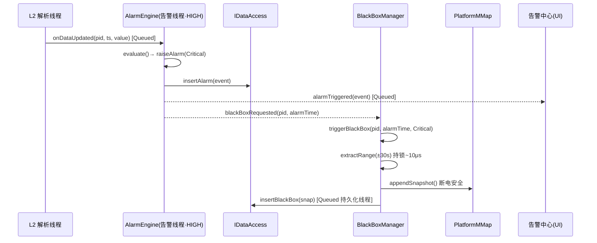
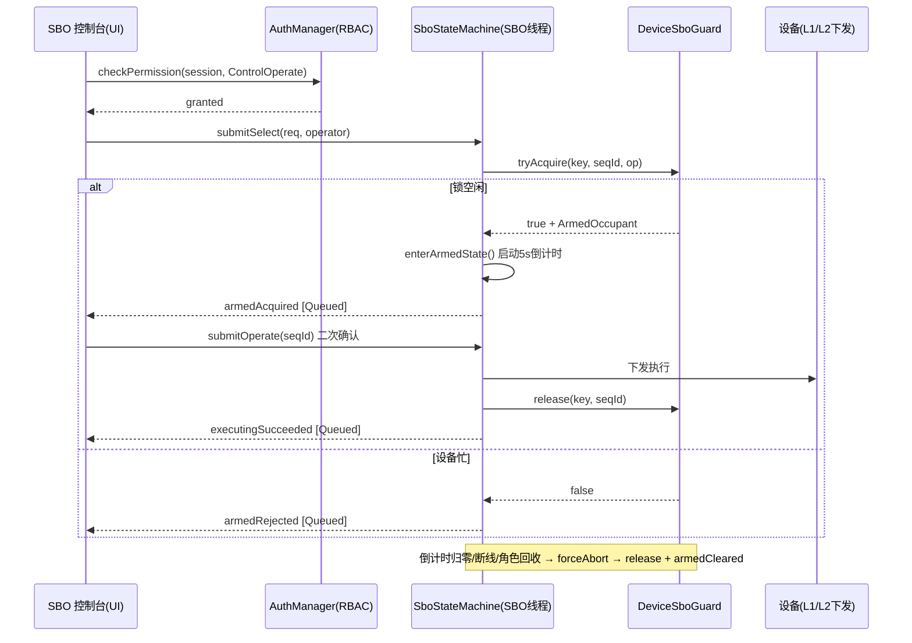

# ENS-LLD-400 业务层详细设计说明书（EnerSentry 储能上位机系统）

> **文档编号**：ENS-LLD-400（合并册，覆盖 ENS-LLD-401 告警引擎 / ENS-LLD-402 SBO 控制与设备级锁 / ENS-LLD-403 基于角色的权限控制 RBAC）
> **层级**：L4 业务逻辑层（`ens::business`）与 L3 数据中枢层（`ens::datahub`）交互
> **版本**：V1.5
> **基线依赖**：HLD V1.5、SRS、DBDD、DataHub_LLD（ENS-LLD-300）、线程模型专题报告、总纲 ENS-LLD-000
> **不可推翻决策**：ADR-08 ~ ADR-23；本册新增细化以 ADR-LLD-01~05 记录，不得与既有 ADR 冲突

| 版本 | 日期 | 作者 | 说明 |
|------|------|------|------|
| V1.0 | 2026-08-13 | 业务架构师 | 初始版本：告警引擎、SBO 状态机/设备级锁、RBAC 完整接口与 ADR 对齐 |
| V1.1 | 2026-08-13 | 业务架构师 | 评审后细化：① `AlarmEngine::reloadRules` 跨线程 marshal 到告警线程私有槽执行；② `DataBus` 增加回调契约与 `subscribeQueued` 接口，显式约束回调非阻塞 |
| V1.2 | 2026-08-14 | 业务架构师 | 工程落地细化：① `reloadRules` 旧 `PointAlarmState` 清理/迁移策略；② 告警风暴队列预分配消除 `malloc` jitter；③ `DataBus` 订阅句柄生命周期安全（RAII `SubscriptionGuard` + 显式 `unsubscribe`） |
| V1.3 | 2026-08-14 | 业务架构师 | 致命 bug 修正与现代化：① `std::deque` 无 `reserve` 改为固定容量 `std::vector` 环形缓冲区；② `reloadRules` 删除规则前强制恢复 Active 告警（`RuleRemoved`）；③ SBO 链路恢复显式 `stop()` `m_flappingTimer`；④ `DataBus::subscribeQueued` 升级为函数指针模板（编译期检查）；⑤ `SboDeviceKey::qHash` 改用 `qHashMulti` |
| V1.4 | 2026-08-14 | 业务架构师 | 工程落地细化：① 风暴丢弃计数器 `m_stormDroppedCount` 按批次 `exchange(0)` 原子读取并重置，信号 `alarmStormTriggered` 增加 `droppedCount` 参数；② `ScopedAuthGuard` 析构函数显式 `noexcept`，`AuthManager::recordAudit` 必须非阻塞且不抛异常，避免 `std::terminate` |
| V1.5 | 2026-08-30 | 业务架构师 | Phase 3 切片 10 落地：① §1.2 `BusinessStateMachine`（Station/Device/Point 三层 FSM：Config→Running→Stats，跨层一致性约束，Device 全部非 Running 才可升 Station Stats）实现；② §2.2-2.4 `AlarmEntities.h` + `IAlarmEngine.h` + `AlarmEngine.h/.cpp` 实现完整告警引擎（迟滞 + On/Off-Delay + 同源抑制 + 风暴抑制 `MAX_PENDING_STORM=2000` + droppedCount 原子 + Critical→blackBoxRequested 依赖倒置）；③ §3.2 `DeviceSboGuard`（二维 Key 分桶互斥 + QMutex + ArmedOccupant 纯数据无 QTimer 指针）实现；④ §3.3 `SboStateMachine`（Idle→Selecting→Armed→Executed/Timeout/Aborted 三定时器：5s 倒计时 + 500ms 链路抖动 + 2s 执行监护；急停 3s；FR-CTRL-07 断线自动清锁 + 盲点 ③ 链路恢复 stop m_flappingTimer）实现。RBAC（§4 ENS-LLD-403）属 V1.6+ 任务，本次未落地。 |

---

## 0. 约定与全局不变式

### 0.1 命名空间与模块形态

| 命名空间 | 层 | 形态 | 说明 |
|---------|----|------|------|
| `ens::business` | L4 | **SHARED**（动态库） | 业务逻辑层，每个公开类/函数必须标注 `ENS_BUSINESS_API` |
| `ens::datahub` | L3 | **STATIC**（静态库） | 数据中枢层，业务层仅依赖其抽象接口（`IDataAccess`、`DataBus`），**禁止**直接包含 `SQLiteDataAccess.h` 等实现类（CI 头文件包含校验，总纲 §6.8） |
| `ens::datahub::platform` | L3 | STATIC | 跨平台 mmap 抽象（`IMappedFile`），业务层经其落盘 Critical 黑匣子 |

```cpp
// business/export.h —— SHARED 模块导出宏（总纲 §3 命名约定）
#pragma once
#include <QtCore/QtGlobal>
#if defined(ENS_BUSINESS_LIBRARY)
#  define ENS_BUSINESS_API Q_DECL_EXPORT
#else
#  define ENS_BUSINESS_API Q_DECL_IMPORT
#endif
```

### 0.2 线程模型（摘要，详见线程模型专题报告）

- **1 个 UI 主线程** + **10 个后台工作线程**（`QThread`）。
- **告警线程**：独立 `QThread`，优先级 `HIGH`，承载 `AlarmEngine` 全量判定（NFR-PERF-06：告警端到端 < 100ms）。
- **SBO 线程**：独立 `QThread`，承载 `SboStateMachine` 状态流转，内含**独立单发倒计时定时器**（`QTimer`），不受通信轮询阻塞（FR-CTRL-02 / FR-CTRL-07）。
- **跨线程边界**：所有跨线程推送一律经 `Qt::QueuedConnection`；工作线程**绝不**直接操作 `QWidget`（总纲 §6.5）。
- **时钟纪律**：所有涉及超时、延时确认、同源抑制、Armed 倒计时的内部计时统一使用 `std::chrono::steady_clock` 单调时钟（Code Review 修复项 ④），仅落库/UI 显示时转换为 Unix Epoch（UTC, ms）。

### 0.3 编码规范

- C++17：优先使用 `std::optional` / `std::variant` / `std::string_view` / `std::unique_ptr`。
- 所有公开接口标注 **线程安全性**（见各 `// 线程安全:` 注释）。
- UI 异步推送统一使用 Qt 信号槽（声明为 `signals:`），跨线程消费者以 `Qt::QueuedConnection` 订阅。
- 数据落库/审计一律经 `IDataAccess` 单一通道（DBDD §4.5 防篡改要求）。

---

## 1. 模块概述与物理分布

### 1.1 物理分布

```
┌──────────────────────────────────────────────────────────────┐
│ L5 UI 视图层 (Qt Widgets, UI 主线程)                            │
│   AlarmCenter / SboConsole / LoginDialog  ←—— QueuedConnection │
└───────────────────────────┬──────────────────────────────────┘
                            │ 订阅/触发（观察者 + 信号槽）
┌───────────────────────────▼──────────────────────────────────┐
│ L4 业务逻辑层  ens::business  (SHARED)                         │
│   AlarmEngine(L4 告警线程·HIGH)                                │
│   SboStateMachine + DeviceSboGuard (L4 SBO 线程)               │
│   AuthManager + SessionManager (L4 控制/业务线程)               │
│   BlackBoxManager::triggerBlackBox 调用方（Critical 触发）      │
└───────────┬───────────────────────────────┬──────────────────┘
            │ IDataAccess（抽象）            │ DataBus（观察者）
            ▼                                ▼
┌──────────────────────────────────────────────────────────────┐
│ L3 数据中枢层  ens::datahub  (STATIC)                          │
│   RingBuffer / L1SnapshotStore / BlackBoxManager / PlatformMMap │
│   L2HistoryStore / SQLiteDataAccess / DownSampler / QueryEngine │
│   DataBus / AttachGuard                                        │
└──────────────────────────────────────────────────────────────┘
            ▲ L2 协议层经 Sample 语义写入 L1 / DataBus
```

### 1.2 模块职责边界

| 模块 | 编号 | 职责 | 禁止事项 |
|------|------|------|---------|
| 告警引擎 | ENS-LLD-401 | 测点阈值判定、迟滞、同源抑制、延时确认、风暴抑制与合并投递、Critical→黑匣子触发 | 不直接连接月库写 `alarm_record`（由 `PersistThread`/`AlarmPersistThread` 串行消费写入，DBDD §4.4） |
| SBO 控制 + 设备级锁 | ENS-LLD-402 | SBO 状态机生命周期、设备级二维分桶互斥锁、独占倒计时、断线/异常 ForceAbort、启动恢复 | 不解析 Modbus 帧、不下发字节流（下发由 L1/L2 完成） |
| RBAC | ENS-LLD-403 | 身份认证、三级角色权限校验、会话生命周期、登录失败锁定、密码哈希、审计拦截 | 不缓存明文密码、不绕过 `ScopedAuthGuard` 执行业务写操作 |

---

## 2. 告警引擎（ENS-LLD-401）

### 2.1 职责与边界

`AlarmEngine` 运行于 **L4 告警线程（HIGH 优先级）**，是 100ms 高频测点流的**唯一判定方**。数据流：

```
L2 解析线程 ──Sample(100ms)──▶ onDataUpdated(pointId, ts, value)  [QueuedConnection]
        │
        ▼
AlarmEngine::evaluate()
   ├─ 查规则 (m_rules: unordered_map)
   ├─ 屏蔽检测 (m_suppressedPoints / 同源抑制 60s)
   ├─ 迟滞比较 (on/off 双阈值)
   ├─ 延时确认 On/Off-Delay (steady_clock, 3s)
   ├─ 风暴抑制 + 合并投递 (ADR-10, MAX_PENDING_STORM=2000)
   └─ 触发 → IDataAccess::insertAlarm + emit alarmTriggered
                └─ Critical → emit blackBoxRequested → BlackBoxManager::triggerBlackBox(±30s, mmap 落盘)
```

**追溯关系**：FR-AL-01~13、NFR-PERF-06、ADR-10（风暴抑制）、ADR-14（Critical mmap 落盘）。

### 2.2 核心数据结构

```cpp
// business/entities/AlarmEntities.h
#pragma once
#include <cstdint>
#include <string>

namespace ens::business {

/// 告警级别（与 DBDD alarm_record.level 一致：0=Info 1=Warning 2=Critical）
enum class AlarmLevel : uint8_t { Info = 0, Warning = 1, Critical = 2 };

/// 告警状态机（与 DBDD alarm_record.status 对齐）
enum class AlarmStatus : uint8_t { Active = 0, Confirmed = 1, Recovered = 2 };

/// 告警规则（配置热加载，FR-CFG-06）
struct AlarmRule {
    uint32_t pointId    = 0;
    AlarmLevel level    = AlarmLevel::Warning;
    float onThreshold   = 0.0f;   // 越过即触发（进入 On-Delay）
    float offThreshold  = 0.0f;   // 迟滞：需回落至该值以下才恢复
    bool  enabled       = true;
    // 延时确认（FR-AL-05）：持续越界 onDelayMs 后才正式产生告警；
    // 恢复需持续低于 offThreshold offDelayMs 后才置 Recovered。
    uint32_t onDelayMs  = 3000;   // 默认 3s
    uint32_t offDelayMs = 3000;
    // 同源抑制（FR-AL-04）：同一 pointId 同级别，60s 内已产生过则不再重复触发
    uint32_t suppressWindowMs = 60000;
};

/// 风暴抑制配置（ADR-10）
struct AlarmStormConfig {
    uint32_t windowMs        = 1000;   // 滑动窗口 1s
    uint32_t threshold       = 200;    // 窗口内告警数超阈值即进入风暴模式
    uint32_t flushIntervalMs = 200;    // 合并批刷出间隔
};

/// 告警恢复原因（用于审计与 UI 区分，避免"规则删除"导致告警悬空）
enum class AlarmRecoveryReason {
    Normal,      // 测点值恢复至 offThreshold 以下（默认）
    RuleRemoved, // 管理员热重载/删除规则，强制恢复
    Manual,      // 人工确认恢复（未来扩展）
    LinkDown     // 通信链路中断（未来扩展）
};

/// 告警事件（引擎内流转 + 落库 + UI 推送）
struct AlarmEvent {
    uint64_t    id          = 0;       // 全局唯一（雪花/自增，落库后回填）
    uint32_t    pointId     = 0;
    AlarmLevel  level       = AlarmLevel::Warning;
    AlarmStatus status      = AlarmStatus::Active;
    uint64_t    triggerTime = 0;       // Unix ms（落库/显示用）
    uint64_t    recoverTime = 0;
    float       alarmValue  = 0.0f;    // 触发时测点值（FR-AL-13）
    float       threshold   = 0.0f;    // 阈值（FR-AL-13）
    std::string description;           // 告警源描述
    uint64_t    blackboxId  = 0;       // 关联黑匣子（0=无）
    AlarmRecoveryReason recoveryReason = AlarmRecoveryReason::Normal; // 恢复原因（status=Recovered 时有效）
};
// 落库结构 AlarmRecord 与 DBDD §4.4 alarm_record_YYYYMM 字段一一对应（含 confirm_user/confirm_time）
```

```cpp
/// 单测点运行时判定状态（所有权归 AlarmEngine::m_states，非 void* 类型擦除）
struct PointAlarmState {
    uint32_t pointId = 0;

    // —— 迟滞锁存 ——
    bool     inAlarmBand = false;   // 当前是否处于越界带（含迟滞）
    float    lastRaw     = 0.0f;

    // —— 同源抑制（monotonic，仅内部计时用） ——
    int64_t  lastRaiseMono = 0;     // 上次正式产生告警的时刻（steady_clock）

    // —— 延时确认 On/Off-Delay（monotonic，替代逐点 QTimer，避免海量定时器） ——
    bool     pendingOn     = false; // 正在 On-Delay 计时
    int64_t  onSinceMono   = 0;     // 进入候选（越界）起点
    bool     pendingOff    = false; // 正在 Off-Delay 计时
    int64_t  offSinceMono  = 0;     // 进入恢复候选起点

    // —— 当前活跃告警 ——
    AlarmStatus status      = AlarmStatus::Recovered;
    uint64_t    activeId    = 0;    // 当前 Active/Confirmed 记录的 id
};
```

### 2.3 判定算法

#### 2.3.1 阈值判定 + 迟滞比较（FR-AL-03）

迟滞防止测点在阈值附近抖动造成告警频繁翻转：

```
越界进入条件： raw > onThreshold                       → 进入候选（pendingOn=true, onSinceMono=now）
迟滞恢复条件： raw < offThreshold  （offThreshold<onThreshold） → 进入恢复候选（pendingOff=true）
```

`checkHysteresis` 维护 `inAlarmBand` 锁存位：仅在 `raw` 越过**反向**阈值时才翻转，避免边界抖动。

#### 2.3.2 延时确认 On/Off-Delay（FR-AL-05）

为防止瞬态扰动误报，越界必须**持续 `onDelayMs`** 才正式产生告警；恢复同理需持续 `offDelayMs`。实现采用 `steady_clock` 时间戳比较（非 QTimer，避免每点一个定时器）：

```cpp
// 伪代码（告警线程内，无锁，单点串行）
void evaluate(uint32_t pid, uint64_t, float value) {
    auto& st = m_states[pid];
    const AlarmRule& r = m_rules.at(pid);
    const int64_t now = MonotonicClock::nowMs();   // steady_clock

    if (value > r.onThreshold) {
        if (!st.pendingOn && !st.inAlarmBand) {
            st.pendingOn = true; st.onSinceMono = now;
        }
        if (st.pendingOn && (now - st.onSinceMono) >= r.onDelayMs) {
            st.pendingOn = false; st.inAlarmBand = true;
            raiseAlarm(pid, r, value, now);        // 正式产生
        }
    } else if (value < r.offThreshold) {
        if (st.inAlarmBand) { st.pendingOff = true; st.offSinceMono = now; }
        if (st.pendingOff && (now - st.offSinceMono) >= r.offDelayMs) {
            st.pendingOff = false; st.inAlarmBand = false;
            recoverAlarm(pid, now);                // 置 Recovered
        }
    }
}
```

#### 2.3.3 同源抑制（FR-AL-04）

`raiseAlarm` 前检查 `now - st.lastRaiseMono < r.suppressWindowMs`（默认 60s）；命中则丢弃本次触发（不落库、不推送），仅更新 `lastRaiseMono`。

#### 2.3.4 风暴抑制与合并投递（ADR-10）

高频告警（如整站掉电）会在 1s 内产生海量告警。策略：

1. 每次 `raiseAlarm` 将 `now` 压入 `m_alarmTimeRing`（1s 滑动窗口）；窗口内计数 > `threshold` 进入**风暴模式** `m_stormActive=true`。
2. 风暴模式下，告警入 `m_pendingStorm`（合并批次），**硬上限 `MAX_PENDING_STORM = 2000`**；超限则丢弃并 `m_stormDroppedCount++`（原子计数，防 OOM，Code Review 修复项 ③）。
3. `m_stormFlushTimer`（200ms 单发）到期调用 `flushStormBatch`，通过 `m_stormDroppedCount.exchange(0)` 原子读取并重置本次批次丢弃数，发射 `alarmStormTriggered(totalCount, droppedCount, samples)` 合并推送；窗口计数回落至阈值以下则 `m_stormActive=false` 并发 `alarmStormCleared`。`m_stormDroppedCount` 按**批次重置归零**（非单调递增），UI 直接展示本次风暴丢弃数。

> 风暴模式下**仍可保证 Critical 实时性**：Critical 级告警不受合并延迟影响，立即走 `alarmTriggered` + `blackBoxRequested`（见 2.4）。

#### 2.3.5 Critical 告警 → 黑匣子落盘（ADR-14）

`raiseAlarm` 中若 `level == Critical`：
```
emit blackBoxRequested(pointId, triggerTime);
```
由 `BlackBoxManager::triggerBlackBox(pointId, alarmTime, AlarmLevel::Critical)`（DataHub_LLD §3.6.1）在 `lock_guard` 内原子预拷贝 ±30s（600 点 × 16B ≈ 9.6KB，持锁 ~10μs），释放后立即 `appendSnapshot` 进 `PlatformMMap`（断电安全），再异步序列化落 `blackbox.db`。普通 Warning/Info **不**触发 mmap。

### 2.4 `AlarmEngine.h` 完整声明

```cpp
// business/AlarmEngine.h
#pragma once
#include "export.h"
#include "IAlarmEngine.h"          // 接口（见下）
#include <QObject>
#include <QTimer>
#include <unordered_map>
#include <unordered_set>
#include <deque>
#include <vector>
#include <atomic>
#include <mutex>

namespace ens::business {

/// 告警引擎实现类（HLD §5.4）。
/// 线程安全：
///   - 热路径 evaluate() 及内部容器（m_rules / m_states / m_suppressedPoints）
///     无锁，依赖「告警线程亲和性」保证单写者；onDataUpdated 必须由外部以
///     Qt::QueuedConnection 投递到告警线程事件循环。
///   - 配置接口（loadRules / reloadRules / suppressPoint / unsuppressPoint /
///     setStormConfig）会被 UI/主线程触发。实现上若检测到跨线程调用，则通过
///     QMetaObject::invokeMethod(this, ..., Qt::QueuedConnection) 自动排队到告警
///     线程内部执行，避免主线程直接改写 m_rules 与 100ms evaluate() 并发产生
///     Race Condition。参见 §2.4.1。
class ENS_BUSINESS_API AlarmEngine : public IAlarmEngine {
    Q_OBJECT
public:
    explicit AlarmEngine(QObject* parent = nullptr);
    ~AlarmEngine() override;

    // 构造期预分配：m_pendingStorm.reserve(MAX_PENDING_STORM)、m_alarmTimeRing.reserve(128)，
    // 消除风暴模式下的 malloc/rehash jitter（评审关注点 ②）。

    // —— 配置（支持跨线程安全调用，内部会 marshal 到告警线程） ——
    void loadRules(const std::vector<AlarmRule>& rules) override;       // 初始化期通常已在告警线程
    void reloadRules(const std::vector<AlarmRule>& rules) override;     // 热加载 FR-CFG-06（可被 UI/主线程触发）
    void suppressPoint(uint32_t pointId, uint64_t expireTimeEpoch) override;
    void unsuppressPoint(uint32_t pointId) override;
    void setStormConfig(const AlarmStormConfig& cfg) override;
    bool isInStormMode() const override { return m_stormActive.load(); }

public slots:
    // 由 L2 解析线程经 QueuedConnection 调用（每测点 100ms）
    void onDataUpdated(uint32_t pointId, uint64_t timestampEpoch, float value) override;

private slots:
    // 实际执行配置变更的私有槽，仅在告警线程事件循环内被调用
    void doReloadRules(const std::vector<AlarmRule>& rules);
    void doSuppressPoint(uint32_t pointId, uint64_t expireTimeEpoch);
    void doUnsuppressPoint(uint32_t pointId);
    void doSetStormConfig(const AlarmStormConfig& cfg);
    void acknowledgeAlarm(uint64_t alarmId, const QString& user) override;          // FR-AL-08
    void acknowledgeAlarms(const std::vector<uint64_t>& ids, const QString& user) override; // FR-AL-10

signals:
    void alarmTriggered(const AlarmEvent& alarm) override;
    void alarmRecovered(uint64_t alarmId) override;
    void alarmAcknowledged(uint64_t alarmId) override;
    void blackBoxRequested(uint32_t pointId, uint64_t alarmTimeEpoch) override;     // Critical 触发
    void alarmStormTriggered(int totalCount, int droppedCount,
                             const QVector<AlarmEvent>& samples) override;
    void alarmStormCleared() override;

private:
    // —— 判定核心 ——
    void evaluate(uint32_t pointId, uint64_t tsEpoch, float value);
    bool checkHysteresis(const AlarmRule& r, float value, PointAlarmState& st);
    bool checkSuppression(const AlarmRule& r, PointAlarmState& st, int64_t nowMono);
    void raiseAlarm(uint32_t pid, const AlarmRule& r, float value, int64_t nowMono);
    void recoverAlarm(uint32_t pid, int64_t nowMono,
                      AlarmRecoveryReason reason = AlarmRecoveryReason::Normal);

    // —— 风暴抑制 ——
    void onStormFlush();                  // m_stormFlushTimer 超时回调
    bool isStormTriggered() const;
    void flushStormBatch(const QString& reason);

    // —— 规则缓存（unordered_map，O(1) 查表） ——
    std::unordered_map<uint32_t, AlarmRule>      m_rules;
    std::unordered_map<uint32_t, PointAlarmState> m_states;
    std::unordered_set<uint32_t>                 m_suppressedPoints;     // 维护期屏蔽
    std::unordered_map<uint32_t, uint64_t>       m_suppressExpirations;  // pointId→到期Epoch

    // —— 风暴抑制（HLD §5.4.1，Code Review 修复项 ③） ——
    static constexpr int MAX_PENDING_STORM = 2000;   // 待合并队列硬上限（防 OOM）
    static constexpr int ALARM_TIME_RING_SIZE = 128; // 1s 滑动窗口最大容量（100ms 周期下 1s 最多 10 条，128 留余量）
    AlarmStormConfig      m_stormConfig;
    std::vector<int64_t>  m_alarmTimeRing;             // 固定容量环形缓冲区（monotonic），替代 std::deque（无 reserve）
    size_t                m_ringHead = 0;              // 下一次写入位置
    size_t                m_ringCount = 0;             // 当前有效元素数
    std::unordered_map<uint64_t, AlarmEvent> m_pendingStorm; // 待合并批次，构造期 reserve(MAX_PENDING_STORM)
    std::atomic<int>      m_stormDroppedCount{0};      // 溢出丢弃计数（lock-free）
    std::atomic<bool>     m_stormActive{false};
    QTimer*               m_stormFlushTimer = nullptr; // 200ms 单发 Flush

    // —— 落库通道（依赖倒置，禁止直接连月库） ——
    IDataAccess*          m_dal = nullptr;             // 注入（总纲 §6.8）
};

} // namespace ens::business
```

```cpp
// business/IAlarmEngine.h —— 抽象接口（ENS_BUSINESS_API 导出）
#pragma once
#include "export.h"
#include <QObject>
#include <QString>
#include <vector>
#include <QVector>
#include "entities/AlarmEntities.h"

namespace ens::business {
class ENS_BUSINESS_API IAlarmEngine : public QObject {
    Q_OBJECT
public:
    virtual ~IAlarmEngine() = default;
    virtual void loadRules(const std::vector<AlarmRule>&) = 0;
    virtual void reloadRules(const std::vector<AlarmRule>&) = 0;
    virtual void suppressPoint(uint32_t pointId, uint64_t expireTimeEpoch) = 0;
    virtual void unsuppressPoint(uint32_t pointId) = 0;
    virtual void setStormConfig(const AlarmStormConfig&) = 0;
    virtual bool isInStormMode() const = 0;
public slots:
    virtual void onDataUpdated(uint32_t pointId, uint64_t timestampEpoch, float value) = 0;
    virtual void acknowledgeAlarm(uint64_t alarmId, const QString& user) = 0;
    virtual void acknowledgeAlarms(const std::vector<uint64_t>& ids, const QString& user) = 0;
signals:
    void alarmTriggered(const AlarmEvent&);
    void alarmRecovered(uint64_t);
    void alarmAcknowledged(uint64_t);
    void blackBoxRequested(uint32_t pointId, uint64_t alarmTimeEpoch);
    void alarmStormTriggered(int totalCount, int droppedCount,
                             const QVector<AlarmEvent>& samples);
    void alarmStormCleared();
};
} // namespace ens::business
```

#### 2.4.1 `reloadRules` 运行期更新的线程安全（评审建议 1）

`m_rules` / `m_states` 在热路径 `evaluate()` 中按 100ms 周期无锁访问。若 UI/主线程因配置修改（例如管理员调整告警阈值）直接调用 `reloadRules`，会与 `evaluate()` 并发读写 `std::unordered_map`，触发 **Race Condition / 迭代器失效**。因此 `AlarmEngine` 必须保证：

1. **公开配置接口**（`reloadRules`、`suppressPoint`、`unsuppressPoint`、`setStormConfig`）必须支持从任意线程安全调用；内部若检测到非告警线程，通过 `QMetaObject::invokeMethod(this, ..., Qt::QueuedConnection)` 排队到告警线程私有槽执行。
2. **私有槽**（`doReloadRules`、`doSuppressPoint` 等）只在告警线程事件循环内执行，与 `onDataUpdated`/`evaluate()` 串行化，彻底消除并发。

实现示例：

```cpp
void AlarmEngine::reloadRules(const std::vector<AlarmRule>& rules) {
    if (QThread::currentThread() == thread()) {
        doReloadRules(rules);          // 已在告警线程，直接执行
        return;
    }
    // 主线程 / UI 线程触发时排队到告警线程
    QMetaObject::invokeMethod(
        this,
        [this, rules]() { doReloadRules(rules); },
        Qt::QueuedConnection);
}

void AlarmEngine::doReloadRules(const std::vector<AlarmRule>& rules) {
    Q_ASSERT(QThread::currentThread() == thread());

    // 1) 重建规则缓存
    std::unordered_map<uint32_t, AlarmRule> newRules;
    newRules.reserve(rules.size() * 2);   // 预留，避免 rehash
    for (const auto& r : rules) newRules[r.pointId] = r;

    // 2) 旧状态清理与迁移（评审关注点 ① + 致命盲点 ② 修正）
    //    - 新规则不再包含的点：若当前处于 Active/Confirmed，必须先强制恢复告警，
    //      再 erase，避免 UI/数据库告警记录永久卡死在 Active 状态
    //    - 阈值发生变化的点：重置 pendingOn / pendingOff / lastRaiseMono，
    //      防止旧延时确认时间戳在新阈值下误触发
    const int64_t nowMono = MonotonicClock::nowMs();
    for (auto it = m_states.begin(); it != m_states.end(); ) {
        auto rit = newRules.find(it->first);
        if (rit == newRules.end()) {
            // 致命盲点 ② 修正：规则删除前，活跃告警必须显式恢复
            if (it->second.status == AlarmStatus::Active ||
                it->second.status == AlarmStatus::Confirmed) {
                recoverAlarm(it->first, nowMono, AlarmRecoveryReason::RuleRemoved);
            }
            it = m_states.erase(it);                 // 规则已删除，状态必须清理
        } else {
            const auto& oldRule = m_rules[it->first];
            if (oldRule.onThreshold != rit->second.onThreshold ||
                oldRule.offThreshold != rit->second.offThreshold ||
                oldRule.level != rit->second.level) {
                it->second.pendingOn = false;
                it->second.pendingOff = false;
                it->second.onSinceMono = 0;
                it->second.offSinceMono = 0;
                it->second.lastRaiseMono = 0;          // 同源抑制窗口也重置
            }
            ++it;
        }
    }

    m_rules = std::move(newRules);
}
```

> 编码约束：所有涉及 `m_rules`、`m_states`、`m_suppressedPoints` 的写操作必须仅在 `doXxx` 私有槽内进行；公开方法仅做线程判定与 marshalling。

> **状态迁移原则**：`reloadRules` 不是简单 `clear()`，必须保证：
> > 1. 旧规则删除的点 → 若 `status == Active/Confirmed`，先调用 `recoverAlarm(..., RuleRemoved)` 强制恢复并落库/推送，再 `m_states.erase()`，避免告警记录永久卡死在 Active；
> > 2. 阈值或等级变更的点 → 重置所有 pending 标记与同源抑制时间戳，防止旧延时在新阈值下误触发；
> > 3. 未变更的点 → 保持状态连续，避免正在 On-Delay 中的合法告警被意外打断。

> **线程安全**：`AlarmEngine` 不内部加锁，依赖「告警线程亲和性」保证 `m_rules`/`m_states` 单写者；`m_stormDroppedCount` 为原子只读计数，可跨线程查询。`onDataUpdated` 必须由外部以 `Qt::QueuedConnection` 投递至告警线程事件循环，禁止其它线程直接调用。

#### 2.4.2 风暴抑制内存预分配（评审关注点 ②）

告警线程优先级为 `HIGH`，需保证 100ms 周期内**确定性延迟（Deterministic Latency）**。风暴模式下 `m_pendingStorm` 每批合并会高频 `insert`；若由默认 `unordered_map` 动态增长触发多次堆分配与 Rehash，会在高优先级线程中引入微秒级 jitter。

**实现约束**：

```cpp
AlarmEngine::AlarmEngine(QObject* parent) : QObject(parent) {
    m_rules.reserve(1024);
    m_states.reserve(1024);
    // 预分配风暴抑制容器，避免运行期 malloc/rehash
    m_pendingStorm.reserve(MAX_PENDING_STORM);
    m_alarmTimeRing.resize(ALARM_TIME_RING_SIZE);   // 固定容量环形缓冲区（std::deque 无 reserve，改用 vector）

    m_stormFlushTimer = new QTimer(this);
    m_stormFlushTimer->setSingleShot(true);
    connect(m_stormFlushTimer, &QTimer::timeout, this, &AlarmEngine::onStormFlush);
}
```

**环形窗口操作示例**（固定容量 `std::vector`，避免 `std::deque` 无 `reserve` 的编译错误）：

```cpp
// 记录一次告警发生时刻
void AlarmEngine::recordAlarmTime(int64_t nowMono) {
    m_alarmTimeRing[m_ringHead] = nowMono;
    m_ringHead = (m_ringHead + 1) % ALARM_TIME_RING_SIZE;
    if (m_ringCount < ALARM_TIME_RING_SIZE) ++m_ringCount;
}

// 统计过去 1s 内告警次数（monotonic，单位 ms）
int AlarmEngine::countAlarmsInLastSecond(int64_t nowMono) const {
    int cnt = 0;
    for (size_t i = 0; i < m_ringCount; ++i) {
        size_t idx = (m_ringHead + ALARM_TIME_RING_SIZE - m_ringCount + i) % ALARM_TIME_RING_SIZE;
        if (nowMono - m_alarmTimeRing[idx] <= 1000) ++cnt;
    }
    return cnt;
}
```

> **为什么不用 `std::deque`**：`std::deque` 标准库未提供 `reserve()`，无法构造期预分配；改为固定容量 `std::vector` + 头指针/计数器，既消除 malloc jitter，又避免编译错误。

> **可选升级**：若将来经 profiling 发现 `AlarmEvent` 拷贝仍有 jitter，可进一步改用固定容量环形缓冲区（Ring Buffer）+ 索引池管理 `m_pendingStorm`，但当前 `reserve` 已满足设计要求，复杂度可控。

### 2.5 告警引擎时序图（Critical → 黑匣子）



---

## 3. SBO 控制状态机与设备级锁（ENS-LLD-402）

### 3.1 生命周期状态机

状态流转严格遵循 SRS FR-CTRL-02（Select Before Operate）与 FR-CTRL-07（断线自动清除）。权限校验（RBAC）在 `Select` 前由 `AuthManager` 完成。

```mermaid
stateDiagram-v2
    [*] --> Idle
    Idle --> Selecting: SelectRequested<br/>(RBAC 校验 operator)
    Selecting --> Idle: PermissionDenied<br/>(角色<Engineer)
    Selecting --> Armed: PermissionGranted<br/>+ DeviceSboGuard::tryAcquire 成功
    Armed --> Executed: Operate (二次确认)
    Armed --> Timeout: ArmedTimeout (5s/3s 倒计时归零)
    Armed --> Aborted: LinkDown / RoleDowngraded / ForceAbort
    Executed --> Idle: 释放锁 + 审计
    Timeout --> Idle: 释放锁 + 审计"timeout"
    Aborted --> Idle: 释放锁 + 审计"aborted"
    Idle --> [*]
```

**状态转换矩阵（摘要）**

| 当前态 | 事件 | 条件 | 下一态 | 动作 |
|--------|------|------|--------|------|
| Idle | `SelectRequested` | RBAC 通过 | Selecting | `m_sequenceId = UUID()` |
| Selecting | `PermissionDenied` | 角色 < Engineer | Idle | 写审计"拒绝"；UI 提示无权限 |
| Selecting | `PermissionGranted` | `tryAcquire` 成功 | Armed | 启动 5s/3s 单发倒计时；注册链路/角色监听；审计"armed" |
| Armed | `Operate` | 二次确认 | Executed | 下发指令；2s 执行超时监护 |
| Armed | `ArmedTimeout` | 倒计时归零 | Timeout | 释放锁；审计"timeout"；UI"请重新选择" |
| Armed | `LinkDown`/`RoleDowngraded`/`ForceAbort` | 断线/权限回收/异常抢占 | Aborted | 释放锁；审计"aborted" |
| Executed | 设备回执 | 成功/失败 | Idle | 释放锁；审计结果 |

### 3.2 设备级锁 `DeviceSboGuard`（ADR-23）

**二维 Key 分桶互斥**：以 `(linkId, slaveId, registerAddr)` 唯一定位一个可控点。不同设备、不同寄存器可**并发** Armed（10 个 PCS 柜可并行 5s SBO）；**同一设备同一寄存器**同一时刻仅允许 1 个 Armed。

> **Code Review 修复项 ②（关键）**：`ArmedOccupant` **不再持有 `QTimer*`**。QTimer 的生命周期与线程归属完全由 `SboStateMachine` 管理；`DeviceSboGuard` 仅保存纯数据（时间戳 + 超时阈值）供查询。原因：若 Guard 与 StateMachine 分属不同线程，Guard 内 `start()/stop()` QTimer 会触发 `QObject::startTimer: Timers cannot be stopped from another thread`，且存在悬空指针 double-free 风险。

```cpp
// business/SboControlGuard.h
#pragma once
#include "export.h"
#include <QObject>
#include <QHash>
#include <QMutex>
#include <optional>
#include <QString>

namespace ens::business {

/// 设备级 SBO 锁 Key（二维：(链路+从站) + 寄存器地址）
struct SboDeviceKey {
    uint32_t linkId;        // 通信链路 ID
    uint32_t slaveId;       // Modbus 从站号
    uint32_t registerAddr;  // 操作寄存器地址

    bool operator==(const SboDeviceKey& o) const {
        return linkId == o.linkId && slaveId == o.slaveId && registerAddr == o.registerAddr;
    }
    uint32_t hash() const {                 // FNV-1a（备用，与 qHash 一致）
        uint32_t h = 2166136261u;
        h = (h ^ linkId)       * 16777619u;
        h = (h ^ slaveId)      * 16777619u;
        h = (h ^ registerAddr) * 16777619u;
        return h;
    }
};

// Qt5/6 推荐：使用 qHashMulti 组合哈希，代码更简洁且防碰撞性更好
inline uint qHash(const SboDeviceKey& k, uint seed = 0) {
    return qHashMulti(seed, k.linkId, k.slaveId, k.registerAddr);
}

/// 当前 Armed 占用信息（纯数据，绝不含 QObject 指针）
struct ArmedOccupant {
    QString sequenceId;
    QString operatorName;
    int64_t armedSinceMonoMs = 0;   // 进入 Armed 的单调时刻（steady_clock）
    int64_t timeoutMs        = 5000;// 超时阈值（常规 5000 / 急停 3000）
};

/// 设备级 SBO 逻辑锁守卫（分桶互斥，ADR-23）
/// 线程安全：m_buckets 由 QMutex 保护（读写均加锁），可跨线程查询。
class ENS_BUSINESS_API DeviceSboGuard : public QObject {
    Q_OBJECT
public:
    /// 尝试获取设备级锁；false=该设备该寄存器已有 Armed（并发冲突）
    bool tryAcquire(const SboDeviceKey& key, const QString& sequenceId,
                    const QString& operatorName, ArmedOccupant* out = nullptr);

    /// 释放锁（Operate/Cancel/Aborted 任一终止时调用，sequenceId 防误释放）
    void release(const SboDeviceKey& key, const QString& sequenceId);

    /// 查询当前占用（返回只读元数据，不含任何 QObject 指针）
    std::optional<ArmedOccupant> query(const SboDeviceKey& key) const;
    QList<SboDeviceKey> listActiveArmed() const;

signals:
    void armedAcquired(const QString& sequenceId, const SboDeviceKey& key);
    void armedRejected(const QString& sequenceId, const SboDeviceKey& key,
                       const QString& busyBy, int64_t elapsedMs);
    void armedReleased(const QString& sequenceId, const SboDeviceKey& key);

private:
    QHash<SboDeviceKey, ArmedOccupant> m_buckets;  // 设备 → Armed 占用
    mutable QMutex m_mutex;                          // 保护 m_buckets
};

} // namespace ens::business
```

> **并发语义**：`tryAcquire` 在 `m_mutex` 保护下检查 Key 是否已占用；已占用返回 false（StateMachine 转入 `Rejected`，UI 显示"设备忙"）。`release` 校验 `sequenceId` 防止 A 释放 B 的锁。

### 3.3 `SboStateMachine.h` 完整声明

```cpp
// business/SboStateMachine.h
#pragma once
#include "export.h"
#include "ISBOManager.h"
#include "SboControlGuard.h"
#include <QObject>
#include <QTimer>
#include <optional>

namespace ens::business {

/// SBO 控制状态机（HLD §5.5，V1.5 注入 DeviceSboGuard）
/// 线程安全：本类运行于独立 SBO 线程；所有 QTimer 由本对象在同一线程内创建/启停
///          （DirectConnection，无跨线程信号排队）。Guard 经由 m_mutex 独立保护。
class ENS_BUSINESS_API SboStateMachine : public ISBOManager {
    Q_OBJECT
public:
    explicit SboStateMachine(QObject* parent = nullptr);
    ~SboStateMachine() override;

    void setGuard(DeviceSboGuard* guard) { m_guard = guard; }   // IoC 注入
    SBOState currentState() const { return m_state; }

    // ISBOManager 实现
    bool submitSelect(const SboSelectRequest& req, const QString& operatorName) override;
    bool submitOperate(const QString& sequenceId) override;
    bool submitCancel(const QString& sequenceId) override;
    bool isDeviceArmed(const SboDeviceKey& key) const override;

signals:
    void armedAcquired(const QString& sequenceId, const SboDeviceKey& key) override;
    void armedRejected(const QString& sequenceId, const SboDeviceKey& key,
                       const QString& busyBy, int64_t elapsedMs) override;
    void armedCleared(const QString& reason) override;
    void executingSucceeded(const QString& sequenceId, const QString& device) override;
    void executingFailed(const QString& sequenceId, const QString& device,
                         const QString& reason) override;

private slots:
    void onArmedTimeout();                  // 5s/3s 倒计时归零 → Timeout
    void onLinkStatusChanged(bool connected);// 断线自动清除（500ms 抖动过滤）
    void onFlappingTimeout();               // 500ms 抖动窗口到期 → 真实断线 → forceAbort
    void onUserRoleChanged(const QString& user, const QString& newRole); // 权限回收 → Abort
    void onExecutingTimeout();              // 设备 2s 无响应 → Failed

private:
    void enterArmedState();                 // 启动 m_armedTimer（单发）
    void transitionTo(SBOState next);
    void forceAbort(const QString& reason); // 断线/异常抢占统一出口

    SBOState                  m_state = SBOState::Idle;
    QString                   m_sequenceId;
    QString                   m_operator;
    SboCommand                m_pendingCommand;
    std::optional<SboDeviceKey> m_heldKey;  // 当前持有的设备锁 Key
    DeviceSboGuard*           m_guard = nullptr;  // 注入的设备级锁
    QTimer*                   m_armedTimer    = nullptr; // 独立倒计时（5s/3s）
    QTimer*                   m_flappingTimer = nullptr; // 链路抖动 500ms 窗口
    QTimer*                   m_execTimer     = nullptr; // Executing 2s 超时
};

} // namespace ens::business
```

```cpp
// business/ISBOManager.h —— 抽象接口
#pragma once
#include "export.h"
#include <QObject>
#include <QString>
#include "entities/SboEntities.h"

namespace ens::business {
class ENS_BUSINESS_API ISBOManager : public QObject {
    Q_OBJECT
public:
    virtual ~ISBOManager() = default;
    /// 提交 Select（权限校验在此前由 AuthManager 完成）
    virtual bool submitSelect(const SboSelectRequest& req, const QString& operatorName) = 0;
    virtual bool submitOperate(const QString& sequenceId) = 0;
    virtual bool submitCancel(const QString& sequenceId) = 0;
    virtual bool isDeviceArmed(const SboDeviceKey& key) const = 0;
signals:
    void armedAcquired(const QString& sequenceId, const SboDeviceKey& key);
    void armedRejected(const QString& sequenceId, const SboDeviceKey& key,
                       const QString& busyBy, int64_t elapsedMs);
    void armedCleared(const QString& reason);
    void executingSucceeded(const QString& sequenceId, const QString& device);
    void executingFailed(const QString& sequenceId, const QString& device, const QString& reason);
};
} // namespace ens::business
```

### 3.4 独占倒计时、断线/异常 ForceAbort 与启动恢复

1. **独占倒计时（ADR-16）**：`enterArmedState()` 内 `m_armedTimer->setSingleShot(true)`，`start(5000)`（常规）/ `start(3000)`（急停）。倒计时归零 `onArmedTimeout()` → `transitionTo(Timeout)` → `m_guard->release()` → 审计"timeout"。**不受通信轮询影响**，保证即使链路卡死也能强制清除 Armed（FR-CTRL-07）。

2. **断线/异常 ForceAbort**：`onLinkStatusChanged(false)`（经 `m_flappingTimer` 500ms 抖动过滤，避免瞬时闪断误清）→ `forceAbort("link_down")`；`onUserRoleChanged`（发起人角色被回收至 < Engineer）→ `forceAbort("role_downgraded")`；设备 2s 无响应 `onExecutingTimeout()` → `executingFailed` + 释放锁。`forceAbort` 是统一出口：释放 `m_heldKey` 锁、停所有定时器、发 `armedCleared`、写审计。

   **链路恢复时必须显式复位 `m_flappingTimer`（盲点 ③ 修正）**：若断线后 500ms 窗口内链路恢复（`onLinkStatusChanged(true)`），必须立即 `m_flappingTimer->stop()`，否则定时器到期仍会误触发 `forceAbort`。

   ```cpp
   void SboStateMachine::onLinkStatusChanged(bool connected) {
       if (!connected) {
           // 启动 500ms 抖动过滤窗口
           m_flappingTimer->start(500);
       } else {
           // 链路恢复：立即 stop，防止定时器到期误触发 forceAbort
           if (m_flappingTimer->isActive()) m_flappingTimer->stop();
       }
   }

   void SboStateMachine::onFlappingTimeout() {
       // 500ms 后仍未恢复，才认定为真实断线
       forceAbort("link_down");
   }
   ```

3. **启动恢复（总纲 §6.3 / §6.3.1 / §6.3.2）**：进程崩溃/重启后，残留 Armed 状态必须平滑清除，避免设备卡死在预置态。
   - **SboResetQueue**：单线程异步下发清除指令，指令间隔 **20~50ms**（平滑，避免总线风暴）。
   - 启动时扫描 `BlackBoxManager`/持久化层残留 SBO 序列，对每个未终态序列投递 `release` + 下发"取消预置"命令，直至全部归零再允许新 SBO。

### 3.5 SBO 控制时序图



---

## 4. 基于角色的权限控制 RBAC（ENS-LLD-403）

### 4.1 角色模型与权限矩阵

> **命名对齐说明**：本 LLD 采用 SRS FR-AUTH-02 与 DBDD `users.role` 经评审确定的三级角色 **`Operator / Engineer / Admin`**（工程师具备控制下发权限，对应 FR-CTRL-04 "仅工程师及以上"）。需求讨论中曾以 `Operator / Admin / SuperAdmin` 描述三级，其语义与本基线一致（`SuperAdmin` 映射至 `Admin` 顶层）。为保证与既有 SRS/HLD/DBDD/SBO 状态机（"角色 < engineer" 拦截）及 `users.role` 列约束严格一致，本说明统一使用 `Operator / Engineer / Admin`；若后续产品确需四级（新增 `SuperAdmin`），`Role` 枚举可无破坏性扩展，且 `users.role` 列 `CHECK` 约束需同步更新。

| 角色 | 权限（累积） | 典型操作 |
|------|-------------|---------|
| `Operator`（操作员） | `ViewAlarm` · `AckAlarm` · `ExportReport` | 监视、告警确认、报表导出 |
| `Engineer`（工程师） | + `ConfigModify` · `ControlOperate` | 配置修改、SBO 控制下发（FR-CTRL-04） |
| `Admin`（管理员） | + `UserManage` · `SystemConfig` · `ViewAudit` | 用户管理、系统配置、查看完整审计（FR-AUTH-03/04） |

```cpp
// business/entities/AuthEntities.h
#pragma once
#include <QString>

namespace ens::business {

enum class Role : uint8_t { Operator = 0, Engineer = 1, Admin = 2 };

/// 权限点（细粒度，所有写操作均须校验其一）
enum class Permission : uint8_t {
    ViewAlarm,      // 查看告警
    AckAlarm,       // 告警确认（FR-AL-08）
    ExportReport,   // 报表导出
    SuppressPoint,  // 告警屏蔽（FR-CFG-10）
    ConfigModify,   // 配置修改
    ControlOperate, // SBO 控制下发（FR-CTRL-04）
    UserManage,     // 用户管理（FR-AUTH-03）
    SystemConfig,   // 系统配置
    ViewAudit       // 查看完整审计（FR-AUTH-04）
};

/// 内存会话（FR-AUTH-05：15 分钟无操作自动锁定）
struct Session {
    QString sessionId;
    QString username;
    Role    role = Role::Operator;
    int64_t createdMono      = 0;   // steady_clock 创建时刻
    int64_t lastActivityMono = 0;   // 最近活动（steady_clock）
    bool    active           = false;
};

/// 登录失败尝试记录（NFR-SEC-06：5 次失败锁 15 分钟）
/// 注意：锁定状态须持久化——`lockedUntilMono` 为内存热缓存，权威值存于
/// `users.locked_until`（DBDD §4.6，Unix ms，0=未锁）；进程重启后由 login 读库恢复，
/// 杜绝“重启绕过锁”（修复项：NFR-SEC-06 闭环）。
struct LoginAttempt {
    QString username;
    int     failCount    = 0;
    int64_t lockedUntilMono = 0;    // steady_clock 热缓存；0=未锁
};

} // namespace ens::business
```

### 4.2 `AuthManager.h` 完整接口

```cpp
// business/AuthManager.h
#pragma once
#include "export.h"
#include <QObject>
#include <QString>
#include <optional>
#include <QByteArray>
#include <QHash>
#include <QMutex>

namespace ens::business {

class ENS_BUSINESS_API AuthManager : public QObject {
    Q_OBJECT
public:
    explicit AuthManager(QObject* parent = nullptr);
    ~AuthManager() override;

    // —— 认证 ——
    /// 登录；成功填充 out 会话并返回 true，失败（密码错/锁定/禁用）返回 false。
    /// 线程安全：m_sessions/m_attempts 由 m_mutex 保护，可多线程并发登录。
    bool login(const QString& username, const QString& password,
               Session& out);

    /// 登出（FR-AUTH-05 手动或超时自动）。
    void logout(const QString& sessionId);

    // —— 授权 ——
    /// 基于会话校验权限（推荐入口，自动续期 lastActivity）。
    bool checkPermission(const QString& sessionId, Permission perm) const;
    /// 基于用户名直接校验（无会话场景，如内部服务）。
    bool checkPermissionByName(const QString& username, Permission perm) const;

    /// 刷新活动时间戳（UI 每次操作调用，重置 15min 计时）。
    void touchActivity(const QString& sessionId);

    /// 扫描并驱逐超时会话（15min）；由 SBO/业务线程定时器周期调用。
    void sweepExpiredSessions();

    // —— 会话查询 ——
    std::optional<Session> getSession(const QString& sessionId) const;
    bool isSessionValid(const QString& sessionId) const;

    // —— 用户管理（需 Admin，FR-AUTH-03）——
    bool addUser(const QString& adminSession, const QString& newUser,
                 const QString& initPassword, Role role);
    bool changePassword(const QString& sessionId, const QString& oldPw,
                        const QString& newPw);
    bool setRole(const QString& adminSession, const QString& targetUser, Role role);
    bool setEnabled(const QString& adminSession, const QString& targetUser, bool enabled);

    // —— 密码学（NFR-SEC-02：自适应成本因子哈希，bcrypt cost=12）——
    // 说明：bcrypt 标准输出已内嵌盐（形如 $2b$12$<salt><hash>）；下方 salt 列
    // 仍按父文档（HLD-000/HLD-ICD/LLD-000/ARCH）约定显式存储 gensalt(12) 盐串，
    // 用于成本因子升级/审计追溯；验证统一走 bcrypt_checkpw(pw, password_hash)。
    static QByteArray generateSalt();                       // bcrypt gensalt(cost=12)，返回 $2b$12$... 盐串
    static QByteArray hashPassword(const QString& password,
                                   const QByteArray& salt); // bcrypt(password, salt, cost=12) → 完整哈希串

signals:
    void sessionExpired(const QString& sessionId);
    void loginFailed(const QString& username, int failCount);
    void accountLocked(const QString& username, int64_t lockedUntilEpoch);

    // 记录审计日志（由 ScopedAuthGuard 析构调用）。
    // 约束：noexcept + 非阻塞（推入 PersistThread 队列），禁止直接同步写 SQLite。
    void recordAudit(const QString& sessionId, const QString& action,
                     const QString& target, const QString& result) noexcept;

private:
    // 权限累积表（角色 → 允许权限集合），编译期确定
    static bool roleHasPermission(Role r, Permission p);

    QHash<QString, Session>    m_sessions;     // sessionId → Session
    QHash<QString, LoginAttempt> m_attempts;   // username → 失败记录
    mutable QMutex             m_mutex;        // 保护上述两者

    static constexpr int   MAX_FAIL_COUNT   = 5;     // NFR-SEC-06
    static constexpr int64_t LOCK_DURATION_MS = 15 * 60 * 1000; // 锁 15 分钟
    static constexpr int64_t SESSION_TIMEOUT_MS = 15 * 60 * 1000; // 15 分钟
    IDataAccess*           m_dal = nullptr;   // 用户/审计落库（注入）
};

} // namespace ens::business
```

**密码存储（DBDD §4.6 `users` 表）**：仅存 `password_hash`（= `hashPassword(pw, salt)` 的 bcrypt 完整哈希串，标准 `$2b$12$...` 格式、已含盐），**绝不存明文/可逆密文**。`salt` 列由 `generateSalt()`（`bcrypt_gensalt(12)`）生成、每用户独立、随账号入库；`login` 时优先用 `bcrypt_checkpw(pw, password_hash)` 验证（盐已内嵌于哈希，无需显式取出 salt 参与比对；`salt` 列保留用于成本升级与审计追溯）。

**登录失败锁定（NFR-SEC-06，持久化闭环）**：连续 `MAX_FAIL_COUNT=5` 次失败 → 同时写内存 `m_attempts.lockedUntilMono = now + 15min` **与** `users.locked_until`（经 `m_dal` 持久化，Unix ms）。`login` 时优先 `SELECT locked_until FROM users`：若 `locked_until > now` 直接拒绝并 `emit accountLocked`（重启后锁定依然有效，攻击无法靠重启绕过）。锁定到期后允许重试并清零 `failCount` 与 `locked_until=0`。成功登录清零两者。

**会话超时（FR-AUTH-05）**：`sweepExpiredSessions()` 周期执行，`now - lastActivityMono >= SESSION_TIMEOUT_MS` → 标记失效、`emit sessionExpired`（UI 回登录页，采集不中断）。

### 4.3 统一权限拦截器 `ScopedAuthGuard`（RAII）

为避免分散校验遗漏，所有**写操作**（配置修改、控制下发、告警确认/屏蔽、用户管理）统一经 RAII Guard 拦截。Guard 构造即校验并在失败时可短路；析构时统一记录审计（FR-AUTH-04）。

```cpp
// business/ScopedAuthGuard.h
#pragma once
#include "export.h"
#include <QString>
#include "entities/AuthEntities.h"

namespace ens::business {

/// RAII 权限拦截器：构造即校验，operator bool() 判结果；析构写审计（成功/拒绝）。
/// 用法：
///   if (ScopedAuthGuard g(auth, sessionId, Permission::ControlOperate, "sbo_operate", deviceId); g) {
///       ... 执行受保护写操作 ...
///   } else { /* 拒绝，UI 提示无权限，审计已记录 */ }
class ENS_BUSINESS_API ScopedAuthGuard {
public:
    ScopedAuthGuard(AuthManager* auth, const QString& sessionId,
                    Permission perm, const QString& action,
                    const QString& target = {})
        : m_auth(auth), m_sessionId(sessionId), m_action(action), m_target(target) {
        m_allowed = auth && auth->checkPermission(sessionId, perm);
        m_perm = perm;
    }
    ~ScopedAuthGuard() noexcept {
        // 审计：无论允许与否均留痕（FR-AUTH-04）。实际落库经 IDataAccess::insertAuditLog。
        // C++11 起析构函数默认 noexcept；recordAudit 必须保证不抛异常，且为非阻塞调用
        //（推入 PersistThread 队列），否则栈展开时将触发 std::terminate。
        if (m_auth) {
            m_auth->recordAudit(m_sessionId, m_action, m_target,
                                m_allowed ? "success" : "denied");
        }
    }
    explicit operator bool() const { return m_allowed; }

    ScopedAuthGuard(const ScopedAuthGuard&) = delete;
    ScopedAuthGuard& operator=(const ScopedAuthGuard&) = delete;

private:
    AuthManager* m_auth;
    QString      m_sessionId;
    QString      m_action;     // 如 "sbo_operate" / "alarm_confirm" / "config_update"
    QString      m_target;     // 设备ID/测点ID/用户名
    Permission   m_perm;
    bool         m_allowed = false;
};

} // namespace ens::business
```

> 审计落库通道：`AuthManager::recordAudit` 经 `IDataAccess::insertAuditLog(user, role, action, target, detail, result, ts, sessionId)` 单一入口写入 `audit_log_YYYYMM`（DBDD §4.5），无 UPDATE/DELETE 业务入口，保证不可篡改。

> **异常安全契约（关键）**：`ScopedAuthGuard` 析构函数显式声明 `noexcept`。`AuthManager::recordAudit` 实现必须满足：
> > 1. **绝对不抛出 C++ 异常**：内部所有可能失败的操作（内存分配、队列 push）用 `try/catch(...)` 吞掉或前置检查；
> > 2. **非阻塞调用**：审计日志不直接写 SQLite，而是推入 `PersistThread` 的线程安全队列（如 `mpsc_queue`），由后台线程批量落库；
> > 3. **失败不抛异常**：若队列满，仅记录到 stderr/本地 fallback log，不抛异常，避免在栈展开路径上触发 `std::terminate`。
> > 
> > 违反以上任意一条都可能在 Guard 析构时（尤其是异常传播栈展开过程中）导致进程崩溃。

---

## 5. 业务层与数据中枢接口交互

业务层（L4）**绝不**直接触碰 SQLite/文件，统一通过 L3 抽象接口：`DataBus`（热路径观察者）与 `IDataAccess`（冷路径持久化/查询）。

### 5.1 DataBus 观察者模式（热路径）

`DataBus` 解耦"生产者（L2 解析）"与"消费者（UI/L4）"。订阅表由 `QReadWriteLock` 保护，发布路径持**读锁 < 1 μs**；跨线程消费一律由订阅方经 `Qt::QueuedConnection` 投递（总纲 §6.5，工作线程绝不直操作 QWidget）。

> **回调契约（Callback Contract）**：`publish()` 在采集线程**同步调用**所有匹配的 `Subscriber` 回调（持 `m_lock` 读锁期间）。回调必须**非阻塞、无 I/O、无长时间 UI 绘制**；如果订阅者需要做重 UI 更新，回调内应仅执行 `postEvent`、`QMetaObject::invokeMethod(receiver, ..., Qt::QueuedConnection)` 或把数据推入线程安全队列，由目标线程后续消费。违者会拖慢采集线程，破坏 100ms 周期实时性。

```cpp
// datahub/DataBus.h（节选自 DataHub_LLD §6，STATIC，业务层仅依赖声明）
namespace ens::datahub {
class DataBus : public QObject {
    Q_OBJECT
public:
    /// Subscriber 回调：在 publish 线程同步执行，必须非阻塞、轻量。
    using Subscriber = std::function<void(uint32_t, const Sample&)>;

    // 订阅某测点（Subscriber 默认在 publish 线程同步调用）。返回句柄用于退订。
    // 线程安全：m_lock 保护订阅表。
    QUuid subscribe(uint32_t pointId, Subscriber cb);

    // 兼容接口：Qt4 字符串槽语法（仍有运行时拼写风险，不推荐新项目使用）
    QUuid subscribeQueued(uint32_t pointId, QObject* receiver, const char* slot);

    // 现代 C++/Qt5/6 函数指针重载（编译期检查，推荐）
    // 内部自动以 Qt::QueuedConnection 将数据投递到 receiver 所在线程。
    template <typename Receiver, typename Method>
    QUuid subscribeQueued(uint32_t pointId, Receiver* receiver, Method method) {
        static_assert(std::is_member_function_pointer_v<Method>,
                      "method must be a non-static member function pointer");
        return subscribe(pointId, [receiver, method](uint32_t pid, const Sample& s) {
            // 仅在 publish 线程做轻量封装，实际槽函数由 receiver 线程排队执行
            QMetaObject::invokeMethod(
                receiver,
                [receiver, method, pid, s]() { (receiver->*method)(pid, s); },
                Qt::QueuedConnection);
        });
    }

    void  unsubscribe(const QUuid& id);

    // 发布（采集线程调用，noexcept，持读锁 < 1μs）。线程安全。
    void  publish(uint32_t pointId, const Sample& s) noexcept;

private:
    struct Sub { QUuid id; uint32_t pointId; Subscriber cb; };
    QHash<QUuid, Sub>    m_subs;
    mutable QReadWriteLock m_lock;
};
}
```

**推荐：业务层/UI 使用 `subscribeQueued` 函数指针重载（默认 QueuedConnection）**，避免在采集线程执行任何 UI 逻辑，并在编译期检查槽函数签名：

```cpp
// UI 层示例：函数指针语法，编译期检查；回调在 UI 线程执行
auto id = m_dataBus->subscribeQueued(
    pid,
    m_plot,                          // receiver 在 UI 线程
    &PlotWidget::onSample);          // 拼写错误在编译期暴露
```

> 旧式字符串槽（`SLOT(...)`）仍可编译，但缺乏编译期检查，运行期拼写错误无法发现，**新代码不推荐**。

若使用 `std::function` 版本，必须保证回调轻量并显式排队：

```cpp
auto id = m_dataBus->subscribe(pid, [this](uint32_t p, const Sample& s){
    // 仅做事件封装或 invokeMethod，禁止在此直接绘图/SQL/网络
    QMetaObject::invokeMethod(
        this,
        [this, p, s]() { m_plot->pushSample(p, s); },
        Qt::QueuedConnection);         // 确保在 UI 线程执行
});
```

#### 5.1.1 订阅句柄生命周期安全（评审关注点 ③）

`DataBus::subscribe` / `subscribeQueued` 返回的 `QUuid` 句柄必须被订阅方持有并在销毁前显式 `unsubscribe(uuid)`，否则 `DataBus::m_subs` 会保留指向已销毁对象的回调/信号槽连接，导致：

- `std::function` lambda 捕获 `this` 指针悬空；
- 已销毁的 `QObject*` 仍作为 `QueuedConnection` 的 receiver，触发 Qt 运行时警告甚至崩溃。

**推荐做法**：业务层/UI 使用 RAII 订阅守卫 `SubscriptionGuard`，在析构时自动退订。

```cpp
// business/SubscriptionGuard.h（L4 工具类，ENS_BUSINESS_API 导出）
#pragma once
#include "export.h"
#include <QUuid>
#include <memory>

namespace ens::datahub { class DataBus; }

namespace ens::business {

class ENS_BUSINESS_API SubscriptionGuard {
public:
    SubscriptionGuard() = default;
    SubscriptionGuard(ens::datahub::DataBus* bus, const QUuid& id) : m_bus(bus), m_id(id) {}

    ~SubscriptionGuard() { unsubscribe(); }

    SubscriptionGuard(const SubscriptionGuard&) = delete;
    SubscriptionGuard& operator=(const SubscriptionGuard&) = delete;

    SubscriptionGuard(SubscriptionGuard&& other) noexcept
        : m_bus(other.m_bus), m_id(std::move(other.m_id)) { other.m_bus = nullptr; }
    SubscriptionGuard& operator=(SubscriptionGuard&& other) noexcept {
        if (this != &other) { unsubscribe(); m_bus = other.m_bus; m_id = std::move(other.m_id); other.m_bus = nullptr; }
        return *this;
    }

    void reset() { unsubscribe(); }
    bool isSubscribed() const { return m_bus && !m_id.isNull(); }
    const QUuid& id() const { return m_id; }

private:
    void unsubscribe();
    ens::datahub::DataBus* m_bus = nullptr;
    QUuid m_id;
};

}
```

**UI 弹窗/Widget 示例**：

```cpp
class AlarmDetailWidget : public QWidget {
    Q_OBJECT
public:
    explicit AlarmDetailWidget(DataBus* bus, uint32_t pid, QWidget* parent = nullptr);
    ~AlarmDetailWidget() override;   // m_subGuard 析构自动 unsubscribe
private:
    ens::business::SubscriptionGuard m_subGuard;
};

AlarmDetailWidget::AlarmDetailWidget(DataBus* bus, uint32_t pid, QWidget* parent)
    : QWidget(parent) {
    QUuid id = bus->subscribeQueued(pid, this, &AlarmDetailWidget::onPointSample);
    m_subGuard = SubscriptionGuard(bus, id);   // 移动赋值
}
```

> **强制约束**：所有使用 `subscribe`/`subscribeQueued` 的类，必须在类中持有 `SubscriptionGuard` 或在析构函数中显式调用 `unsubscribe(uuid)`。CI 通过 `clang-tidy` 自定义检查或 Code Review 把关。

> **Sample 不变式（ADR-08，业务层依赖）**：`Sample` 严格 16 字节 `alignas(16)`，且
> `static_assert(sizeof(Sample)==16, ...)` 与
> `static_assert(std::atomic<Sample>::is_always_lock_free, "Sample NOT lock-free!")`
> 双断言保证无锁原子访问（防撕裂读，32 位 x86/ARMv7 编译期守卫）。

### 5.2 QueryEngine 跨月 ATTACH 查询（冷路径）

历史查询经 `IDataAccess::queryHistoryRange`，底层按自然月分库（`data_YYYYMM.db`），跨月走 `ATTACH DATABASE` + `UNION ALL`，由 `AttachGuard` RAII 强制 DETACH（ADR-15/19/21）。

```cpp
// datahub/IDataAccess.h（抽象，业务层依赖）
namespace ens::datahub {
class IDataAccess {
public:
    virtual ~IDataAccess() = default;
    virtual QString getTableName(uint32_t pointId, uint64_t ts, HistoryGranularity g) const = 0;
    virtual QString getDatabasePath(uint64_t ts) const = 0;  // 月度路由
    virtual std::vector<DownSampledSample> queryHistoryRange(
        uint32_t pointId, uint64_t start, uint64_t end) = 0; // ≤3 月（ADR-19）
    virtual bool insertAlarm(const AlarmEvent& a) = 0;
    virtual bool insertBlackBox(const BlackBoxSnapshot& s) = 0;
    virtual bool insertAuditLog(const QString& user, const QString& role,
                                const QString& action, const QString& target,
                                const QString& detail, const QString& result,
                                int64_t ts, const QString& sessionId) = 0;
};
}
```

**跨月查询硬约束（DataHub_LLD §4.4）**：
- 单次 `queryHistoryRange` 跨月 **≤ 3 个月**（ADR-19）；超 3 月返回空并提示"缩小范围或启用降采样"。
- `ATTACH` 数量 **≤ 6**（§6.6），`AttachGuard` 析构（含异常路径）必 `DETACH`，杜绝 `LIMIT_ATTACHED=10` 句柄泄漏。
- 写事务避让：`AttachGuard` 构造时 `waitForWriteBatchEnd(50ms)`（条件变量阻塞，非 spin），避免与 `PersistThread` 文件级写锁互斥（DBDD §4 评审关注点）。

**Critical 黑匣子触发链路（ADR-14）**：见 §2.3.5 与 §2.5。`AlarmEngine` 仅发射 `blackBoxRequested`，由 L3 `BlackBoxManager::triggerBlackBox` 完成原子预拷贝 + `PlatformMMap` 落盘，业务层不感知 mmap 细节（经 `IMappedFile` 抽象，总纲 §6.2）。

---

## 6. 单元测试与边界异常覆盖（GTest / QtTest）

> 测试框架：核心逻辑用 **GoogleTest**（mock `IDataAccess`/`IMappedFile`/`ISBOManager`）；Qt 信号槽/线程相关用 **QtTest**。Mock 注入纯虚接口，避免依赖物理 SQLite（`:memory:` 替代）。

### 6.1 告警引擎（ENS-LLD-401）

| 用例 | 类型 | 验证点 | 预期 |
|------|------|--------|------|
| 阈值越界即触发 | GTest | `onDataUpdated` 越过 `onThreshold` | 产生 `alarmTriggered`，`status=Active` |
| 迟滞防抖 | GTest | 在 `offThreshold`~`onThreshold` 间抖动 | 不翻转，无重复告警 |
| On-Delay 3s | GTest | 越界持续 < 3s 后回落 | 不产生告警（瞬态抑制） |
| On-Delay 超时 | GTest | 越界持续 ≥ 3s | 正式产生 |
| 同源抑制 60s | GTest | 同点同级别 60s 内二次越界 | 丢弃，更新 `lastRaiseMono` |
| 风暴合并 | GTest | 1s 内 > 200 告警 | 进入风暴模式，`alarmStormTriggered(total, dropped, samples)`；`droppedCount` 经 `exchange(0)` 原子读取并重置 |
| 风暴丢弃计数重置 | GTest | 风暴解除后再次进入风暴 | 新风暴 `droppedCount` 从 0 开始，不累积上次数值 |
| Critical 黑匣子 | GTest+Mock | `raiseAlarm(Critical)` | `blackBoxRequested` 发射；mock `BlackBoxManager` 验证 `triggerBlackBox(pointId, ±30s, Critical)` |
| 屏蔽到期恢复 | GTest | `suppressPoint` 到期 | 屏蔽自动失效，恢复判定 |
| 时钟跳变 | GTest | 注入 `steady_clock` mock 回拨 | 内部计时不受影响，无错触发（修复项 ④） |
| 规则热加载 | GTest | `reloadRules` 运行中替换 | 新规则立即生效，旧 `m_states` 不崩溃 |
| 规则热加载状态迁移 | GTest | 旧规则 `pendingOn` 点被删除 / 阈值变更 / 未变更 | 删除点 `m_states` 被 erase；阈值变更点 pending 标记重置；未变更点状态连续 |
| 规则删除时 Active 恢复 | GTest | Active 告警点规则被删除 | 先发射 `alarmRecovered(activeId)` 并标记 `RuleRemoved`，再 erase，UI/DB 不卡死 |
| 风暴内存预分配 | GTest+性能 | 构造后连续 10s 高频告警，采样 `publish()` 延迟 | 无异常峰值；`m_pendingStorm` 未触发 rehash（容量 ≥ MAX_PENDING_STORM） |
| 环形窗口编译与功能 | 编译+GTest | `m_alarmTimeRing` 使用 `std::vector` + 环形下标 | 编译通过；1s 窗口计数正确；无 `std::deque::reserve` 调用 |
| 跨线程规则更新 | QtTest | 主线程调 `reloadRules`，告警线程并发执行 `onDataUpdated`/`evaluate()` | 内部 marshal 到告警线程；`m_rules` 始终单写者，无 Race Condition |

### 6.2 SBO 状态机与设备级锁（ENS-LLD-402）

| 用例 | 类型 | 验证点 | 预期 |
|------|------|--------|------|
| 完整生命周期 | QtTest | Idle→Select→Armed→Operate→Executed | 状态序列正确，锁释放 |
| 设备级并发 | GTest | 10 个不同 `SboDeviceKey` 同时 `tryAcquire` | 全部成功（10 柜并行） |
| 同寄存器互斥 | GTest | 同一 Key 两次 `tryAcquire` | 第二次 false（"设备忙"） |
| 独占倒计时 | QtTest | `m_armedTimer` 5s 归零 | `Timeout` + `release` + 审计"timeout"；不受链路状态影响 |
| 断线 ForceAbort | QtTest | Armed 中 `onLinkStatusChanged(false)`（500ms 去抖） | `Aborted` + 锁释放 + `armedCleared` |
| 链路抖动恢复 | QtTest | `onLinkStatusChanged(false)` 后 200ms 内 `onLinkStatusChanged(true)` | `m_flappingTimer` 被显式 `stop()`，不触发 `forceAbort`，Armed 保持 |
| 角色回收 Abort | QtTest | Armed 中 `onUserRoleChanged(<Engineer)` | `Aborted` + 审计"role_downgraded" |
| `release` 误释放防护 | GTest | 错误 `sequenceId` 调 `release` | 不释放他人锁 |
| 启动恢复 SboResetQueue | GTest+Mock | 注入残留 Armed 序列 | 单线程 20~50ms 间隔下发清除，全部归零 |
| `ArmedOccupant` 无 QTimer | 静态检查 | 结构体不含 `QObject*` | 跨线程安全（修复项 ②） |
| `SboDeviceKey` 哈希质量 | GTest | 10 组不同 Key 经 `qHashMulti` 分布 | 无冲突；与 `operator==` 一致；优于手搓 FNV-1a |

### 6.3 RBAC（ENS-LLD-403）

| 用例 | 类型 | 验证点 | 预期 |
|------|------|--------|------|
| 角色权限矩阵 | GTest | `checkPermission(Operator, ControlOperate)` | false；`(Engineer, ControlOperate)` true |
| 登录失败锁定 | GTest | 连续 5 次失败 | 第 6 次拒绝 + `accountLocked`（锁 15min） |
| 锁定到期 | GTest | `lockedUntilMono` 过去 | 允许重试，清零计数 |
| 会话超时 | QtTest | `sweepExpiredSessions` 超时 15min | 会话失效 + `sessionExpired` |
| 密码哈希不可逆 | GTest | `hashPassword` 同盐同密文；不同盐不同；`bcrypt_checkpw` 验签通过 | 无明文；bcrypt cost=12 自适应成本，抗暴力破解优于裸 SHA-256 |
| 锁定持久化 | GTest+Mock | 锁定后重建 `AuthManager`（读 `users.locked_until`） | 重启仍拒绝至 `locked_until` 过期（修复项：锁不丢） |
| `ScopedAuthGuard` 短路 | GTest | 无权限构造 Guard | `operator bool()`=false，析构写审计"denied" |
| `ScopedAuthGuard` 析构 noexcept | GTest | mock `recordAudit` 抛异常 | 析构不抛异常，不触发 `std::terminate`；实际实现必须 noexcept |
| `recordAudit` 非阻塞 | GTest | 高频构造/析构 Guard | `recordAudit` 仅推入队列，不直接写 SQLite，延迟 < 1μs |
| 用户管理鉴权 | GTest | `Operator` 调 `addUser` | 拒绝（需 Admin） |
| 审计防篡改 | GTest+Mock | `insertAuditLog` 后尝试 UPDATE | 无业务入口，mock 不提供改/删 |

### 6.4 跨层 / 并发（DataHub 接口契约）

| 用例 | 类型 | 验证点 | 预期 |
|------|------|--------|------|
| 撕裂读防护 | GTest | `RingBuffer` 单生产者 + 3 消费者并发 10s | 无撕裂、无丢帧（对比 `published` 全序，ADR-08） |
| 跨月 ATTACH ≤3 月 | GTest | `queryHistoryRange` 跨 4 月 | 返回空，提示降采样（ADR-19） |
| `AttachGuard` RAII | GTest | 构造 ATTACH→抛异常→析构 | 验证 DETACH；重复 DETACH 不崩（ADR-21） |
| `PlatformMMap` 双实现 | GTest+Mock `IMappedFile` | Win32/POSIX；模拟 `ERROR_SHARING_VIOLATION` | backup&recreate；mmap < 1μs |
| DataBus 订阅 | QtTest | 发布/退订/跨线程 Queued | 回调在订阅线程执行，发布 < 1μs |
| DataBus 回调契约 | GTest | 同步 Subscriber 内执行 10ms 阻塞操作 | 采集线程 `publish()` 耗时 > 10ms，破坏实时性；CI 静态/Review 禁止 |
| DataBus subscribeQueued | QtTest | 使用 `subscribeQueued` 函数指针重载连接 UI 槽 | 回调在 UI 线程执行，采集线程 < 1μs；断点调试安全 |
| DataBus subscribeQueued 编译期检查 | 编译测试 | 错误成员函数指针传入 `subscribeQueued` | 编译失败（模板 `static_assert`） |
| DataBus 订阅生命周期 | QtTest | `SubscriptionGuard` 析构 / 显式 `unsubscribe` 后销毁 Widget | 再 `publish` 无悬空回调、无 Qt 警告、无崩溃 |
| DataBus 订阅泄漏 | GTest | 模拟 1000 次订阅-销毁（未 unsubscribe） | 使用 `SubscriptionGuard` 时 `m_subs` 归零；未使用时检测出 dangling 回调 |

---

## 7. 决策记录（ADR 引用与新增）

| 编号 | 主题 | 本文落点 |
|------|------|---------|
| ADR-08 | `Sample` 16B 对齐 + lock-free | §5.1 双 `static_assert` 引用 |
| ADR-10 | 告警风暴抑制 | §2.3.4 / `MAX_PENDING_STORM=2000` |
| ADR-14 | Critical mmap 落盘 | §2.3.5 / §2.5 |
| ADR-15 / 19 / 21 | ATTACH / ≤3 月 / RAII | §5.2 |
| ADR-16 | SBO Armed 定时器独占 | §3.4 |
| ADR-20 | PlatformMMap 跨平台 | §5.2 黑匣子链路 |
| ADR-22 | UI ≤2000 点 + QTimer | §5.1 |
| ADR-23 | DeviceSboGuard 设备级锁 | §3.2 |
| ADR-LLD-01~05 | DataHub 细粒度优化 | 接口一致性引用（DataHub_LLD） |
| Code Review ② | `ArmedOccupant` 去 `QTimer*` | §3.2 / §6.2 |
| Code Review ③ | 风暴队列硬上限 + 原子丢弃计数 | §2.3.4 / §6.1 |
| Code Review ④ | `steady_clock` 单调时钟 | §0.2 / §2.3.2 / §6.1 |
| ADR-LLD-06 | `reloadRules` 旧 `PointAlarmState` 清理/迁移策略 | §2.4.1 |
| ADR-LLD-07 | 风暴抑制容器构造期预分配，消除 malloc jitter | §2.4.2 |
| ADR-LLD-08 | `DataBus` 订阅句柄 RAII 生命周期管理 | §5.1.1 |
| ADR-LLD-09 | `std::deque` 无 `reserve`，改用固定容量 `std::vector` 环形缓冲区 | §2.4.2 |
| ADR-LLD-10 | 规则删除时 Active 告警强制恢复（`RuleRemoved`） | §2.4.1 |
| ADR-LLD-11 | SBO 链路恢复显式复位 `m_flappingTimer` | §3.4 |
| ADR-LLD-12 | `DataBus::subscribeQueued` 函数指针模板 + 编译期检查 | §5.1 |
| ADR-LLD-13 | `SboDeviceKey::qHash` 使用 `qHashMulti` 组合哈希 | §3.2 |
| ADR-LLD-14 | 风暴丢弃计数器按批次 `exchange(0)` 原子读取并重置 | §2.3.4 |
| ADR-LLD-15 | `ScopedAuthGuard` 析构 `noexcept` + `recordAudit` 非阻塞不抛异常 | §4.3 |

---

> **文档结尾**：本说明书严格继承 HLD V1.5、SRS、DBDD、DataHub_LLD（ENS-LLD-300）、线程模型专题报告与总纲 ENS-LLD-000 的全部约束与命名，可直接作为 `business/` 与 `datahub/` 层告警引擎、SBO 状态机/设备级锁、RBAC 的编码落地与单元测试依据。所有结构体、接口、状态机与 ADR 引用均与既有基线保持一致，未推翻 ADR-08~23。
