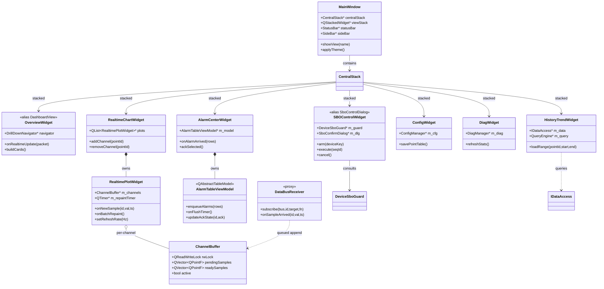
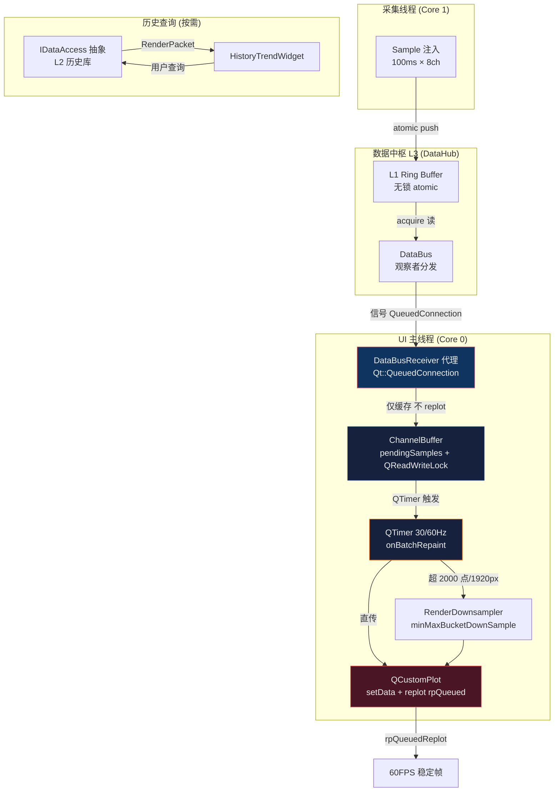
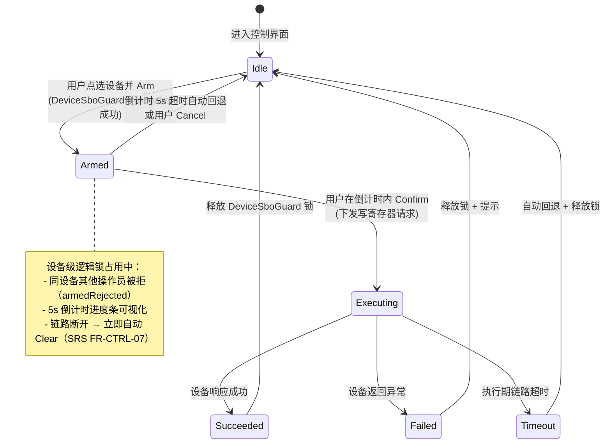
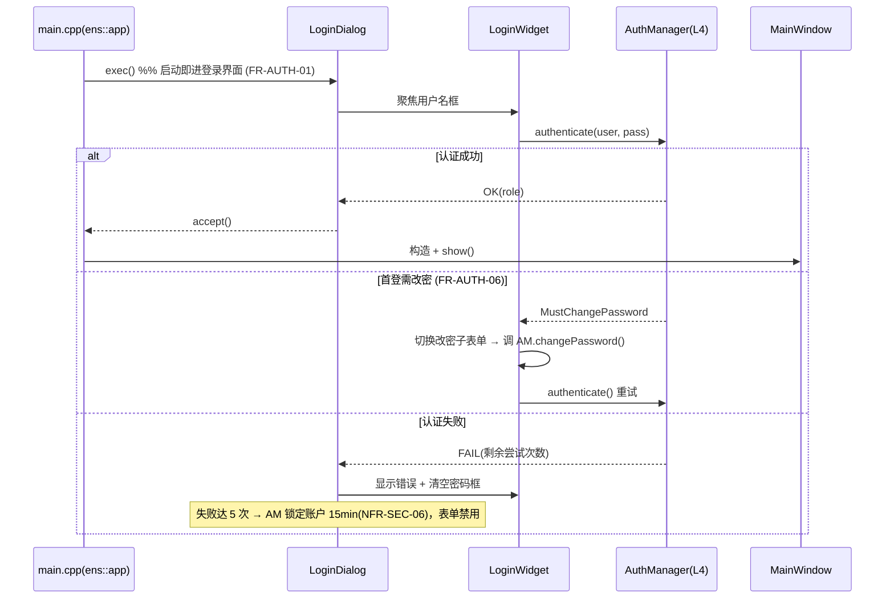

# EnerSentry 储能上位机系统
## UI 视图与交互渲染模块（UI Layer - L5）详细设计说明书

> **文档编号**：ENS-LLD-500  
> **版本**：V1.1  
> **日期**：2026-08-14  
> **状态**：正式发布  
> **编制依据**：《EnerSentry-详细设计说明书（总纲）ENS-LLD-000 V1.3》《EnerSentry-储能上位机系统-概要设计说明书 ENS-HLD-001 V1.5》《EnerSentry-储能上位机系统-软件需求规格说明书（SRS）ENS-SRS-001 V1.1》《EnerSentry-数据中枢层详细设计说明书 ENS-LLD-300 V1.1》《EnerSentry-业务层详细设计说明书 ENS-LLD-400 V1.4》《EnerSentry-线程模型与并发设计专题报告 ENS-CONC-001 V1.0》《UI 详细设计说明 UI-DD V1.5》《交互设计文档 ENS-UI-PROTO-001 V1.2》  
> **适用人员**：UI 架构师、Qt/C++ 开发工程师、交互设计师、测试工程师、技术评审人员

---

## 文档修订记录

| 版本 | 日期 | 修订人 | 修订内容 |
|------|------|--------|---------|
| V1.0 | 2026-08-14 | UI 架构师 | 初始版本。覆盖 L5 总架构、控件树、数据绑定与 UI 模型层、QCustomPlot 高性能渲染管线、SBO 安全控制交互、异常路径与边界处理。作为 ENS-LLD-501~508 的总纲性合并文档 |
| V1.1 | 2026-08-14 | UI 架构师 | 工程优化反馈 4 条：① ChannelBuffer 锁竞争极短化（Swap 零拷贝 + 锁外降采样）；② QCustomPlot 零拷贝数据传递（QCPGraphData 替代 QVector<double> 拆包）；③ Qt 5.15 High-DPI 缩放策略补全（PassThrough）；④ 动态删通道安全迭代（removeChannel 立即退订 DataBus） |

---

## 目录

- [§0 文档定位与模块映射](#0-文档定位与模块映射)
- [§1 总体 UI 架构与组件关系](#1-总体-ui-架构与组件关系)
- [§2 控件树与界面组件树设计](#2-控件树与界面组件树设计)
- [§3 数据绑定与 UI 模型层设计](#3-数据绑定与-ui-模型层设计)
- [§4 QCustomPlot 高性能渲染管线设计](#4-qcustomplot-高性能渲染管线设计)
- [§5 SBO 安全控制与高危操作交互设计](#5-sbo-安全控制与高危操作交互设计)
- [§6 异常路径与边界处理](#6-异常路径与边界处理)
- [§7 登录与鉴权交互设计（LoginDialog / SessionLockDialog）](#7-登录与鉴权交互设计logindialog--sessionlockdialog)
- [附录 A：需求追溯矩阵](#附录-a需求追溯矩阵)
- [附录 B：架构决策（ADR）索引](#附录-b架构决策adr索引)

---

## §0 文档定位与模块映射

### 0.1 文档定位

本文档是 **L5 UI 视图层（UI Layer）** 的总纲性详细设计说明书，向上承接《详细设计说明书（总纲）ENS-LLD-000》第 4.1 节索引矩阵中 **ENS-LLD-501 ~ ENS-LLD-508** 八个子模块的合并规范，向下指导 `ens::ui` 静态库（STATIC）的全部编码实现。

L5 在 EnerSentry 五层架构中处于最顶层，承担 **数据可视化呈现** 与 **用户交互** 两项职责。其核心约束是：**UI 主线程绝不直接接触 SQLite / Socket 等 I/O 资源**，所有实时数据经 `DataBus::subscribeQueued` 以 `Qt::QueuedConnection` 进入 UI 侧缓冲；所有历史查询经抽象接口 `IDataAccess` 注入（严禁 `#include "SQLiteDataAccess.h"`）；所有控制下发经 L4 抽象接口 `ISBOManager` 注入。

### 0.2 模块职责边界

| 子模块编号 | 功能域 | 权威类名（总纲/HLD） | 数据来源 | 依赖层次 |
|-----------|--------|---------------------|---------|---------|
| ENS-LLD-501 | 主窗口框架 | `MainWindow` | — | L5 |
| ENS-LLD-502 | 电站总览 + 三级钻取 | `OverviewWidget`, `DrillDownNavigator` | 订阅 DataBus | L5→L3 |
| ENS-LLD-503 | 实时曲线渲染 | `RealtimeChartWidget`, `RealtimePlotWidget`, `RenderDownsampler`, `OpenGLDetector` | 订阅 L1 Ring Buffer（经 DataBus） | L5→L3 |
| ENS-LLD-504 | 告警中心 | `AlarmCenterWidget`, `AlarmTableViewModel` | L4 `AlarmEngine` → DataBus | L5→L4→L3 |
| ENS-LLD-505 | 历史趋势 | `HistoryTrendWidget`, `QueryEngine` | `IDataAccess`（L2 历史库） | L5→L3 |
| ENS-LLD-506 | 参数配置 | `ConfigWidget`, `ConfigManager` | `IDataAccess` + 配置 JSON | L5→L4 |
| ENS-LLD-507 | 通信诊断 | `DiagWidget`, `DiagManager` | `IChannel::getStats()`（L2→L1） | L5→L2→L1 |
| ENS-LLD-508 | SBO 安全控制 | `SBOControlWidget`, `DeviceSboGuard` | `ISBOManager` 下发写寄存器 | L5→L4→L2 |

### 0.3 命名映射表（用户建议名 ↔ 权威类名）

为满足「术语与命名与 ENS-HLD-001 及 ENS-LLD-300 严格一致」的硬性约束，本说明书对任务书中建议的部分类名做如下权威化映射，后续章节一律使用 **总纲/HLD 权威类名**，并以括号标注别名：

| 任务书建议名 | 总纲/HLD 权威类名 | 映射说明 |
|-------------|-----------------|---------|
| `DashboardView` | `OverviewWidget` | 电站总览主视图（别名仅用于交互稿，代码以 `OverviewWidget` 为准） |
| `SboControlDialog` | `SBOControlWidget` | SBO 控制主面板；其内嵌的「确认/倒计时」对话框以 `SboConfirmDialog` 实现 |
| `RealtimePlotWidget` | `RealtimePlotWidget` | 保持原样，为 ENS-LLD-503 内部实时渲染控件 |
| `AlarmTableViewModel` | `AlarmCenterWidget` 内模型类 | 即 `AlarmTableViewModel`，隶属于 `AlarmCenterWidget` 的 `QAbstractTableModel` 子类 |

> **命名铁律（交互设计文档 ENS-UI-PROTO-001）**：`ens::ui` 仅依赖 `ens::business`（抽象接口）与 `qcustomplot`；严禁出现 `new QSerialPort` / `QTcpSocket` / 直接 `IChannel` 引用；跨线程一律 `Qt::QueuedConnection`。

### 0.4 构建目标与依赖

- **CMake Target**：`ens::ui`（STATIC 库）。依据总纲 §3.3.2，**STATIC 模块严禁使用导出宏**（无 `ENS_UI_EXPORT` 之类符号）。
- **依赖**：`ens::datahub`（抽象接口 `IDataAccess` + `DataBus`）、`ens::business`（抽象接口 `ISBOManager` / `AlarmEngine` 信号定义）、`qcustomplot`、`Qt5::Widgets`。
- **语言标准**：C++17 / Qt 5.15 LTS（兼容 Qt 6.x 信号槽语法）。

---

## §1 总体 UI 架构与组件关系

### 1.1 分层定位

L5 位于五层架构顶端，与下层仅通过抽象接口和信号槽通信，禁止跨层直接引用（HLD §2.3）。UI 主线程运行在独立 CPU 核心（Core 0），与 10 个工作线程职责隔离（ENS-CONC-001 §1.2）。

### 1.2 组件类关系图（Class Diagram）

下图采用 **总纲/HLD 权威类名**，并以 `<<alias>>` 标注用户建议别名。



> 图中 `DataBusReceiver` 为跨线程代理（§3.2）；`ChannelBuffer` 为每通道缓冲（§3.1）；`IDataAccess` 为 L3 抽象接口（图中以 `..>` 虚线表示依赖抽象，不引入具体实现头文件）。

### 1.3 UI 主线程 ↔ 后台采集/持久化数据管线（Flowchart）



**关键不变式（ADR-22）**：
1. 数据到达 **仅** 进入 `ChannelBuffer::pendingSamples`，**严禁** 在接收路径调用 `replot()`；
2. 重绘由 `QTimer`（默认 33ms / 30Hz，可选 17ms / 60Hz，`Qt::PreciseTimer`）统一驱动 `onBatchRepaint()`；
3. 每通道硬上限 `min(2000 点, 1920 px, canvasPixels / activeChannels)`，超出走 `RenderDownsampler::minMaxBucketDownSample`；
4. 渲染终态统一 `QCustomPlot::replot(QCustomPlot::rpQueuedReplot)`，合并同帧多次重绘请求。

---

## §2 控件树与界面组件树设计

### 2.1 控件树（Widget Tree）

```
QDialog (LoginDialog)                 ← 启动首屏（FR-AUTH-01），exec() 成功后才构造 MainWindow
└── LoginWidget                       (共享登录表单：用户名/密码 + 首登强改密；亦被 SessionLockDialog 复用)
        └── (内嵌于) QDialog (SessionLockDialog)   ← 会话超时锁屏（FR-AUTH-05），解锁后恢复 MainWindow

QMainWindow (MainWindow)
├── MenuBar                         (菜单栏：文件/视图/工具/帮助，受 RBAC 动态裁剪)
├── QToolBar (TopToolBar)          (快捷视图切换 + 全局锁定指示)
├── CentralWidget
│   └── QStackedWidget (CentralStack)   ← 六大业务视图堆叠，按权限/角色切换
│       ├── OverviewWidget        (电站总览：卡片 + 三级钻取导航 DrillDownNavigator)
│       ├── RealtimeChartWidget   (实时曲线：N × RealtimePlotWidget 网格)
│       ├── AlarmCenterWidget     (告警中心：AlarmTableViewModel + 确认工具条)
│       ├── HistoryTrendWidget    (历史趋势：时间轴 + 多通道叠加)
│       ├── ConfigWidget          (参数配置：点表/阈值/链路 分页)
│       ├── DiagWidget            (通信诊断：链路质量表 + 吞吐曲线)
│       └── SBOControlWidget      (SBO 安全控制：设备树 + 确认对话框)
├── DockWidget (SideBar)           (左侧导航/设备树，可折叠)
└── QStatusBar (statusBar)         (连接状态 / 时钟 / CPU / 告警计数 / 权限身份)
```

**布局结构**：
- 顶层采用 `QVBoxLayout`：`MenuBar` + `TopToolBar` → `CentralWidget` → `StatusBar`；
- `CentralWidget` 内以 `QHBoxLayout` 横向排布 `SideBar`（固定宽，可隐藏）与 `CentralStack`（拉伸填充）；
- `RealtimeChartWidget` 内部以 `QGridLayout` 网格排布多个 `RealtimePlotWidget`（支持 1/4/9 宫格自适应）；
- `OverviewWidget` 以 `QGridLayout` 排布电站/柜/模组三级卡片，`DrillDownNavigator` 以面包屑（`QHBoxLayout` + `QLabel`）呈现钻取路径。

### 2.2 所有权与生命周期（Ownership & Lifecycle）

- **父子所有权**：所有业务视图均为 `CentralStack` 的子对象（Qt 对象树自动析构）。`RealtimePlotWidget` 归 `RealtimeChartWidget` 所有；`AlarmTableViewModel` 归 `AlarmCenterWidget` 所有。
- **防止悬空指针**：跨视图持有的非父子指针一律用 `QPointer<T>`（如 `DataBusReceiver` 持有 `ChannelBuffer*` 时）。
- **RAII 订阅守卫**：`SubscriptionGuard`（§3.3）在视图析构时自动退订 DataBus，杜绝悬空信号。
- **显隐节流**：`RealtimePlotWidget::hideEvent()` 停止 `m_repaintTimer`，`showEvent()` 重启（UI-DD §3.2），避免后台视图空转渲染。
- **状态持久化**：窗口几何、各视图分栏比例、最后选中视图经 `QSettings` 持久化（UI-DD §3.1），重启恢复。

```cpp
// ui/common/WidgetLifecycle.h —— 显隐节流与状态持久化契约（示意）
class RealtimePlotWidget : public QWidget {
    Q_OBJECT
protected:
    void showEvent(QShowEvent* e) override {
        Q_ASSERT(m_repaintTimer);
        if (!m_repaintTimer->isActive()) m_repaintTimer->start(); // 重启渲染
        QWidget::showEvent(e);
    }
    void hideEvent(QHideEvent* e) override {
        if (m_repaintTimer && m_repaintTimer->isActive())
            m_repaintTimer->stop(); // 停止空转，节省 CPU
        QWidget::hideEvent(e);
    }
};
```

---

## §3 数据绑定与 UI 模型层设计

### 3.1 ChannelBuffer —— 每通道双缓冲结构

`ChannelBuffer` 是 UI 侧每通道的实时样本缓冲，由 `QReadWriteLock` 保护，承载「后台推送 → 定时批绘」的解耦。

```cpp
// ui/realtime/ChannelBuffer.h
#pragma once
#include <QVector>
#include <QReadWriteLock>
#include <QPointF>
#include <cstdint>

namespace ens::ui {

/// 单通道实时采样缓冲（UI 线程与后台推送线程共享，通过读写锁保护）
/// 设计要点：
///  - pendingSamples：后台线程经 QueuedConnection 追加的原始样本（不触发重绘）
///  - readySamples：经降采样后、待 QCustomPlot::setData 消费的就绪样本
///  - 双缓冲指针交换思想见 §4.2（pending→ready 的 clear/assign 等价 O(1) 语义）
struct ChannelBuffer {
    uint32_t pointId = 0;            // 测点 ID
    mutable QReadWriteLock rwLock;   // 读写锁：保护下方两个容器

    QVector<QPointF> pendingSamples; // 后台落入的原始样本（tsMs, value）
    QVector<QPointF> readySamples;   // 降采样就绪样本

    bool active = true;              // 通道是否启用
    bool pendingRemoval = false;     // 逻辑删除标记：当前帧消费后回收，避免迭代期析构

    ChannelBuffer() = default;
    explicit ChannelBuffer(uint32_t id) : pointId(id) {}

    ChannelBuffer(const ChannelBuffer&) = delete;
    ChannelBuffer& operator=(const ChannelBuffer&) = delete;
};

} // namespace ens::ui
```

### 3.2 DataBusReceiver —— 跨线程数据接收代理

UI 主线程**严禁**直接访问 SQLite/Socket。`DataBusReceiver` 作为代理，将 L3 `DataBus` 的跨线程信号以 `Qt::QueuedConnection` 安全转投到 UI 线程内的 `ChannelBuffer`。

```cpp
// ui/common/DataBusReceiver.h
#pragma once
#include <QObject>
#include <QPointer>
#include <QHash>
#include <cstdint>
#include "datahub/DataBus.h"   // 仅依赖抽象接口，严禁 #include "SQLiteDataAccess.h"

namespace ens::ui {

class ChannelBuffer;

/// UI 侧数据总线接收代理
/// 不变式：
///  - UI 主线程绝不直接访问 SQLite/Socket；
///  - 实时数据仅经本代理进入 UI 缓冲（ADR-22 第 1 条）；
///  - subscribe 必须经 subscribeQueued（QueuedConnection），保证跨线程安全。
class DataBusReceiver : public QObject {
    Q_OBJECT
public:
    explicit DataBusReceiver(QObject* parent = nullptr) : QObject(parent) {}

    /// 注册一个 UI 侧 ChannelBuffer 供数据落入
    void registerBuffer(uint32_t pointId, ChannelBuffer* buf) {
        Q_ASSERT_X(buf, "DataBusReceiver::registerBuffer", "null buffer");
        m_buffers.insert(pointId, QPointer<ChannelBuffer>(buf));
    }
    void unregisterBuffer(uint32_t pointId) { m_buffers.remove(pointId); }

public slots:
    /// 后台线程 -> UI 线程的桥接槽（由 DataBus::subscribeQueued 以 QueuedConnection 投递）
    /// 仅负责缓存，严禁在此调用 replot()。
    void onSampleArrived(uint32_t pointId, double value, qint64 tsMs) {
        auto it = m_buffers.find(pointId);
        if (it == m_buffers.end() || it.value().isNull()) return; // 通道已回收则丢弃

        ChannelBuffer* buf = it.value();
        QWriteLocker lock(&buf->rwLock);
        buf->pendingSamples.append(QPointF(static_cast<double>(tsMs), value));

        // 硬上限保护：pending > 5000 触发丢样（§6.1），避免 OOM
        constexpr int PENDING_WARN_THRESHOLD = 5000;
        if (buf->pendingSamples.size() > PENDING_WARN_THRESHOLD) {
            buf->pendingSamples.remove(0,
                buf->pendingSamples.size() - PENDING_WARN_THRESHOLD);
            qWarning() << "Pending overflow for channel" << pointId
                       << "- dropped oldest samples";
        }
        // ⚠ 严禁在此调用 buf 所属 Widget 的 replot()
    }

signals:
    /// 通知渲染控件有数据落入（仅在 UI 线程发射，供 onBatchRepaint 感知）
    void bufferUpdated(uint32_t pointId);

private:
    QHash<uint32_t, QPointer<ChannelBuffer>> m_buffers; // 非拥有，ChannelBuffer 由 Widget 管理
};

} // namespace ens::ui
```

> 订阅动作在业务代码侧通过 `ens::datahub::DataBus::subscribeQueued(pointId, target, slot)` 完成（ENS-LLD-400 §4.4 函数指针模板），`DataBusReceiver` 仅作为「接收槽宿主 + 缓冲落地」的薄代理，不持有 `DataBus` 长生命周期引用，避免环状依赖。

### 3.3 SubscriptionGuard —— RAII 订阅守卫

```cpp
// ui/common/SubscriptionGuard.h
#pragma once
#include <QObject>
#include "datahub/DataBus.h"

namespace ens::ui {

/// RAII 订阅守卫：构造即订阅，析构自动退订，防止忘记 unsubscribe 造成悬空信号。
class SubscriptionGuard {
public:
    SubscriptionGuard(ens::datahub::DataBus* bus, uint32_t pointId,
                      QObject* target, const char* slot)
        : m_bus(bus), m_token(-1) {
        Q_ASSERT_X(bus, "SubscriptionGuard", "bus is null");
        Q_ASSERT_X(target, "SubscriptionGuard", "target is null");
        m_token = bus->subscribeQueued(pointId, target, slot);
    }

    SubscriptionGuard(const SubscriptionGuard&) = delete;
    SubscriptionGuard& operator=(const SubscriptionGuard&) = delete;

    ~SubscriptionGuard() {
        if (m_bus && m_token >= 0) m_bus->unsubscribe(m_token);
    }

    int token() const noexcept { return m_token; }

private:
    ens::datahub::DataBus* m_bus;
    int m_token;
};

} // namespace ens::ui
```

### 3.4 AlarmTableViewModel —— 告警风暴保护的表模型

依据 ADR-10（告警风暴抑制）与 SRS FR-AL 系列，UI 侧通过自定义 `QAbstractTableModel` 承载告警，采用 **批量 Timer 刷新 + 去抖（debounce）**，确保告警风暴下 UI 不冻结。

```cpp
// ui/alarm/AlarmTableViewModel.h
#pragma once
#include <QAbstractTableModel>
#include <QVector>
#include <QTimer>
#include <QReadWriteLock>
#include <QString>
#include <cstdint>

namespace ens::ui {

/// 单行告警记录（UI 模型层表示，与 L4 AlarmEngine 输出字段一致）
struct AlarmRow {
    uint64_t alarmId   = 0;
    uint32_t pointId   = 0;
    QString  deviceName;
    QString  level;        // "Critical" / "Major" / "Minor"
    QString  message;
    qint64   raiseTsMs = 0;
    bool     acknowledged = false;
};

/// 告警中心表模型：批量 Timer 刷新 + 去抖，防止告警风暴冻结 UI（ADR-10）
class AlarmTableViewModel : public QAbstractTableModel {
    Q_OBJECT
public:
    enum Columns { ColLevel = 0, ColDevice, ColMessage, ColTime, ColAck, ColumnCount };

    explicit AlarmTableViewModel(QObject* parent = nullptr)
        : QAbstractTableModel(parent) {
        m_flushTimer = new QTimer(this);
        m_flushTimer->setTimerType(Qt::PreciseTimer);
        m_flushTimer->setInterval(120); // 去抖窗口 120ms：合并风暴期批量插入
        connect(m_flushTimer, &QTimer::timeout, this, &AlarmTableViewModel::onFlushTimer);
        m_flushTimer->start();
    }

    int rowCount(const QModelIndex& parent = QModelIndex()) const override {
        Q_UNUSED(parent);
        QReadLocker lock(&m_lock);
        return m_rows.size();
    }
    int columnCount(const QModelIndex& parent = QModelIndex()) const override {
        Q_UNUSED(parent); return ColumnCount;
    }
    QVariant data(const QModelIndex& index, int role = Qt::DisplayRole) const override {
        if (!index.isValid()) return {};
        QReadLocker lock(&m_lock);
        if (index.row() >= m_rows.size()) return {};
        const AlarmRow& r = m_rows.at(index.row());
        if (role == Qt::DisplayRole || role == Qt::ToolTipRole) {
            switch (index.column()) {
                case ColLevel:   return r.level;
                case ColDevice:  return r.deviceName;
                case ColMessage: return r.message;
                case ColTime:    return QDateTime::fromMSecsSinceEpoch(r.raiseTsMs)
                                           .toString("yyyy-MM-dd hh:mm:ss");
                case ColAck:     return r.acknowledged ? tr("已确认") : tr("待确认");
            }
        }
        if (role == Qt::ForegroundRole && index.column() == ColLevel) {
            // 告警配色（SRS UI-02）：Critical 红 / Major 橙 / Minor 黄
            if (r.level == "Critical") return QColor(0xE9, 0x45, 0x60);
            if (r.level == "Major")    return QColor(0xFF, 0x8C, 0x00);
            return QColor(0xF2, 0xC9, 0x4C);
        }
        return {};
    }
    QVariant headerData(int section, Qt::Orientation o, int role = Qt::DisplayRole) const override {
        if (role != Qt::DisplayRole || o != Qt::Horizontal) return {};
        static const char* H[] = {"级别", "设备", "描述", "时间", "确认"};
        return tr(H[section]);
    }

    /// 批量注入告警（L4 AlarmEngine 经 QueuedConnection 投递，落入 pending）
    void enqueueAlarms(const QVector<AlarmRow>& incoming) {
        QWriteLocker lock(&m_lock);
        m_pending.append(incoming); // 不立即重置模型，交给 flushTimer 合并
    }

    /// 单条确认状态变更（去抖合并入 pending 逻辑，统一在 flush 生效）
    void updateAckState(uint64_t alarmId, bool acked) {
        QWriteLocker lock(&m_lock);
        for (auto& r : m_pending) if (r.alarmId == alarmId) r.acknowledged = acked;
        for (auto& r : m_rows)    if (r.alarmId == alarmId) r.acknowledged = acked;
    }

public slots:
    /// 批量刷新：风暴期用 beginResetModel 一次性刷新；稳态用 beginInsertRows 增量插入
    void onFlushTimer() {
        QWriteLocker lock(&m_lock);
        if (m_pending.isEmpty()) return;

        // 经验阈值：单次 > 50 条走 reset（避免 beginInsertRows 高频抖动）
        if (m_pending.size() > 50) {
            beginResetModel();
            m_rows.append(m_pending);
            // 上限保护：保留最近 5000 条，超出裁剪（防内存膨胀）
            constexpr int MAX_ROWS = 5000;
            if (m_rows.size() > MAX_ROWS)
                m_rows.remove(0, m_rows.size() - MAX_ROWS);
            m_pending.clear();
            endResetModel();
        } else {
            const int start = static_cast<int>(m_rows.size());
            const int count = static_cast<int>(m_pending.size());
            beginInsertRows(QModelIndex(), start, start + count - 1);
            m_rows.append(m_pending);
            m_pending.clear();
            endInsertRows();
        }
    }

private:
    QVector<AlarmRow> m_rows;     // 已呈现行
    QVector<AlarmRow> m_pending;  // 待合并入 m_rows（去抖窗口内累积）
    QReadWriteLock    m_lock;
    QTimer*           m_flushTimer = nullptr;
};

} // namespace ens::ui
```

---

## §4 QCustomPlot 高性能渲染管线设计

### 4.1 渲染管线总览（三重防御）

依据 ADR-22，渲染采用「**缓冲 → 定时 → 降采样**」三重防御，彻底杜绝「数据到达即 replot」这一工业上位机头号性能陷阱。

```mermaid
flowchart TB
    SAMPLE[Sample 到达<br/>采集/DataBus] --> BUF["第1层 数据缓冲<br/>per-channel pendingSamples<br/>QReadWriteLock"]
    BUF --> TIMER{"第2层 QTimer 触发<br/>30Hz / 60Hz"}
    TIMER -->|33ms / 17ms| CAP{"第3层 降采样判定<br/>数据量 > min(2000,1920,canvas/chan)?"}
    CAP -->|是| DOWN[Min-Max 桶降采样<br/>RenderDownsampler]
    CAP -->|否| DIRECT[直传]
    DOWN --> SET[QCPGraph::setData<br/>双缓冲指针交换 O(1)]
    DIRECT --> SET
    SET --> REPLOT[QCustomPlot::replot<br/>rpQueuedReplot 合并同帧]
    REPLOT --> FRAME[稳定 30/60 FPS]

    style BUF fill:#0f3460,stroke:#e94560,color:#eee
    style TIMER fill:#16213e,stroke:#ff6600,color:#eee
    style CAP fill:#4a1525,stroke:#ff4444,color:#eee
```

### 4.2 RenderDownsampler —— UI 侧画布降采样

> 注意：本降采样器与 L2 落盘降采样 `DownSampler`（ENS-LLD-300）**职责不同**——`DownSampler` 用于历史库聚合（Max/Min/Avg 滑窗），`RenderDownsampler` 仅服务于画布像素约束下的视觉保真（Min-Max 桶）。

```cpp
// ui/realtime/RenderDownsampler.h
#pragma once
#include <QVector>
#include <QPointF>
#include <algorithm>
#include <cstdint>

namespace ens::ui {

/// UI 侧画布降采样器（区别于 L2 落盘降采样 DownSampler）
/// 采用 Min-Max 桶策略：单桶内保留极大/极小两个极值点，最大程度保留波形视觉特征。
class RenderDownsampler {
public:
    /// 计算每通道目标点数：取三者最小值（ADR-22 硬约束）
    /// min(2000 点硬上限, 1920 px 硬上限, 画布像素 / 可见通道数)
    static int computeTargetPoints(int canvasPixels, int activeChannels,
                                   int hardCapPoints = 2000,
                                   int hardCapPixels = 1920) {
        Q_ASSERT_X(canvasPixels > 0, "computeTargetPoints", "non-positive canvas");
        Q_ASSERT_X(activeChannels > 0, "computeTargetPoints", "no active channel");
        const int byPixels = canvasPixels / activeChannels;
        int t = hardCapPoints;
        t = std::min(t, hardCapPixels);
        t = std::min(t, byPixels);
        return std::max(1, t); // 至少保留 1 点，避免空图
    }

    /// 将 src 降采样至至多 maxPoints 个点（Min-Max 桶）
    /// 规则：每桶取 (min, max) 两个点，端点特殊处理，保证输出 ≤ maxPoints（偶数）。
    static QVector<QPointF> minMaxBucketDownSample(const QVector<QPointF>& src,
                                                   int maxPoints) {
        QVector<QPointF> out;
        const int n = src.size();
        if (n <= maxPoints || maxPoints < 2) { out = src; return out; }

        // 每桶输出 2 点（min/max），因此桶数 = maxPoints / 2
        const int buckets = std::max(1, maxPoints / 2);
        const int perBucket = n / buckets;
        out.reserve(buckets * 2);

        for (int b = 0; b < buckets; ++b) {
            const int start = b * perBucket;
            const int end = (b == buckets - 1) ? n : start + perBucket;
            if (end <= start) continue;

            double minV = src[start].y(), maxV = src[start].y();
            double minX = src[start].x(), maxX = src[start].x();
            int minIdx = start, maxIdx = start;
            for (int i = start + 1; i < end; ++i) {
                if (src[i].y() < minV) { minV = src[i].y(); minX = src[i].x(); minIdx = i; }
                if (src[i].y() > maxV) { maxV = src[i].y(); maxX = src[i].x(); maxIdx = i; }
            }
            // 先输出时间靠前者，保证 x 单调（QCustomPlot 要求有序）
            if (minIdx <= maxIdx) {
                out.append(QPointF(minX, minV));
                out.append(QPointF(maxX, maxV));
            } else {
                out.append(QPointF(maxX, maxV));
                out.append(QPointF(minX, minV));
            }
        }
        Q_ASSERT(out.size() <= maxPoints);
        return out;
    }
};

} // namespace ens::ui
```

### 4.3 OpenGLDetector —— 渲染加速探测与降级

```cpp
// ui/realtime/OpenGLDetector.h
#pragma once
#include <QString>

namespace ens::ui {

/// 启动时探测 OpenGL 可用性；不可用时回退软件渲染并建议降频至 30Hz（ENS-CONC-001 §6.5）
class OpenGLDetector {
public:
    struct Result {
        bool available = false;
        QString detail;
    };

    static Result detect() {
        Result r;
        // 优先尝试创建离屏 GL 上下文；失败则标记不可用（工控主机常见）
        // 简化探测：依赖 QOpenGLWidget 可用性；真实实现可尝试 create() 验证。
        r.available = tryCreateContext();
        r.detail = r.available
            ? QStringLiteral("OpenGL 可用，启用 setOpenGl(true) + 60Hz")
            : QStringLiteral("OpenGL 不可用，回退软件渲染 + 强制 30Hz");
        return r;
    }

    /// 应用探测结果：成功启用 OpenGL，失败回退并降频
    static void apply(QCustomPlot* plot, const Result& r) {
        Q_ASSERT_X(plot, "OpenGLDetector::apply", "null plot");
        if (!r.available) {
            plot->setOpenGl(false); // 软件渲染
        } else {
            plot->setOpenGl(true);  // 硬件加速
        }
    }

private:
    static bool tryCreateContext(); // 平台相关实现（Win32/WGL, POSIX/GLX）
};

} // namespace ens::ui
```

### 4.4 RealtimePlotWidget —— 完整头文件（多通道 / 双缓冲 / 定时 / 动态增删）

```cpp
// ui/realtime/RealtimePlotWidget.h
#pragma once
#include <QWidget>
#include <QTimer>
#include <QHash>
#include <QPointer>
#include <QCustomPlot>
#include <QReadWriteLock>
#include <QVector>
#include <QPointF>
#include <QShowEvent>
#include <QHideEvent>
#include <cstdint>
#include "ChannelBuffer.h"
#include "RenderDownsampler.h"

namespace ens::ui {

/// 实时多通道曲线渲染控件
/// 设计约束（ADR-22）：
///  - 数据到达仅入 pendingSamples，绝不 replot；
///  - 重绘由 QTimer（默认 33ms/30Hz，可选 17ms/60Hz，PreciseTimer）驱动；
///  - 每通道硬上限 min(2000, 1920, canvas/chan)，超出走 RenderDownsampler；
///  - 动态增删通道并回收内存；缩放/平移与实时刷新解耦（§6.2）。
class RealtimePlotWidget : public QWidget {
    Q_OBJECT
public:
    static constexpr int MAX_POINTS_PER_CHANNEL = 2000;  // 硬上限
    static constexpr int MAX_PIXELS_PER_CHANNEL = 1920;  // 1080p 单通道宽
    static constexpr int PENDING_WARN_THRESHOLD  = 5000;  // 积压告警/丢样阈值

    enum class RefreshRate { Hz30, Hz60 };
    Q_ENUM(RefreshRate)

    explicit RealtimePlotWidget(QWidget* parent = nullptr)
        : QWidget(parent), m_plot(new QCustomPlot(this)) {
        // 定时器批处理 —— 严禁数据驱动 replot()
        m_repaintTimer = new QTimer(this);
        m_repaintTimer->setTimerType(Qt::PreciseTimer);
        connect(m_repaintTimer, &QTimer::timeout,
                this, &RealtimePlotWidget::onBatchRepaint);
        setRefreshRate(RefreshRate::Hz30); // 默认 30Hz（ADR-22）

        // 布局：图表占满控件
        auto* lay = new QVBoxLayout(this);
        lay->setContentsMargins(0, 0, 0, 0);
        lay->addWidget(m_plot);

        // High-DPI：线宽与字体 setCosmetic(true) 保证缩放一致（UI-DD §2.1）
        m_plot->xAxis->setTickLabelFont(QFont("Consolas", 9));
        m_plot->yAxis->setTickLabelFont(QFont("Consolas", 9));
    }

    /// 设定刷新率（30Hz 默认 / 60Hz 高性能站）
    void setRefreshRate(RefreshRate rate) {
        const int ms = (rate == RefreshRate::Hz60) ? 17 : 33;
        m_repaintTimer->setInterval(ms);
        if (!m_repaintTimer->isActive()) m_repaintTimer->start();
    }

    /// 动态增通道：创建并注册 ChannelBuffer 与对应 QCPGraph
    void addChannel(uint32_t pointId, const QString& label,
                    const QColor& color = Qt::cyan) {
        Q_ASSERT_X(!m_channels.contains(pointId), "addChannel", "duplicate channel");
        auto* buf = new ChannelBuffer(pointId);
        m_channels.insert(pointId, buf); // 所有权归本 Widget（哈希析构时 delete）

        QCPGraph* g = m_plot->addGraph();
        g->setName(label);
        g->setPen(QPen(color, 1, Qt::SolidLine));
        g->setLineStyle(QCPGraph::lsLine);
        g->setScatterStyle(QCPScatterStyle::ssNone); // 实时曲线不画散点，省 CPU
        m_graphs.insert(pointId, g);
    }

    /// 动态删通道：立即退订 DataBusReceiver + 标记逻辑删除，当前帧消费后回收
    /// （V1.1 工程优化：防止 removeChannel 后 DataBus 仍持续推送导致 pendingSamples 永不归零）
    void removeChannel(uint32_t pointId) {
        auto* buf = m_channels.value(pointId, nullptr);
        if (!buf) return;
        // 立即退订，切断数据源 —— 后续 onNewSample 将因 buf 已标记 pendingRemoval 而丢弃
        if (m_receiver) m_receiver->unregisterBuffer(pointId);
        buf->pendingRemoval = true; // 延迟回收，见 onBatchRepaint
    }

public slots:
    /// 后台线程经 QueuedConnection 投递 —— 仅缓冲，不 replot()（ADR-22 第1条）
    void onNewSample(uint32_t pointId, double value, qint64 timestampMs) {
        ChannelBuffer* buf = m_channels.value(pointId, nullptr);
        if (!buf) return;
        QWriteLocker lock(&buf->rwLock);
        buf->pendingSamples.append(QPointF(static_cast<double>(timestampMs), value));
        if (buf->pendingSamples.size() > PENDING_WARN_THRESHOLD) {
            buf->pendingSamples.remove(0,
                buf->pendingSamples.size() - PENDING_WARN_THRESHOLD);
            qWarning() << "Pending overflow for channel" << pointId;
        }
        // ⚠ 严禁在此调用 m_plot->replot()
    }

private slots:
    /// QTimer 触发的批量重绘入口（30Hz 或 60Hz）
    /// V1.1 工程优化：锁内仅做指针/容器交换（< 1μs），降采样计算完全在锁外执行，
    /// 彻底消除 pendingSamples 较多时 CPU 密集降采样阻塞 onNewSample 的风险。
    void onBatchRepaint() {
        bool anyUpdate = false;
        const int canvasPixels = m_plot->viewport().width();
        const int channelsVisible = m_channels.size();

        for (auto it = m_channels.begin(); it != m_channels.end(); ) {
            ChannelBuffer* buf = it.value();

            // ── 第 1 步：锁内仅做指针/容器交换，锁持有时间 < 1μs ──
            QVector<QPointF> localPending;
            {
                QWriteLocker lock(&buf->rwLock);

                if (buf->pendingRemoval && buf->pendingSamples.isEmpty()) {
                    // 当前帧已消费完，安全回收
                    const uint32_t pid = buf->pointId;
                    lock.unlock();
                    removeGraphAndBuffer(pid);
                    it = m_channels.erase(it);
                    continue;
                }
                if (buf->pendingSamples.isEmpty()) { ++it; continue; }

                // Swap 零拷贝：将 pendingSamples 整体「偷」出锁外
                // qSwap 后 buf->pendingSamples 为空（O(1)），localPending 持有全部数据
                qSwap(localPending, buf->pendingSamples);
                // ⚠ 此时锁已释放！后续降采样不阻塞 onNewSample 写入新 pending
            }

            // ── 第 2 步：锁外执行降采样计算（CPU 密集但无竞争）──
            const int targetPoints = RenderDownsampler::computeTargetPoints(
                canvasPixels, channelsVisible,
                MAX_POINTS_PER_CHANNEL, MAX_PIXELS_PER_CHANNEL);

            if (localPending.size() > targetPoints) {
                buf->readySamples =
                    RenderDownsampler::minMaxBucketDownSample(localPending, targetPoints);
            } else {
                buf->readySamples = std::move(localPending); // 直传，零拷贝转移
            }
            // localPending 在此析构（空或已 move）

            // ── 第 3 步：QCPGraphData 零拷贝传递（V1.1 工程优化）──
            // 直接利用 QCustomPlot 原生数据类型 QCPGraphData(key, value)，
            // 省去 QPointF → QVector<double> t, v 的解包循环与内存分配。
            QCPGraph* g = m_graphs.value(buf->pointId, nullptr);
            if (g) {
                auto* data = g->data();
                data->clear();
                data->reserve(buf->readySamples.size());
                for (const auto& pt : buf->readySamples)
                    data->add(pt.x(), pt.y());
                anyUpdate = true;
            }
            ++it;
        }

        if (anyUpdate) {
            // rpQueuedReplot 合并同帧多次重绘请求
            m_plot->replot(QCustomPlot::rpQueuedReplot);
        }
    }

protected:
    void showEvent(QShowEvent* e) override {
        if (!m_repaintTimer->isActive()) m_repaintTimer->start(); // 显隐节流（UI-DD §3.2）
        QWidget::showEvent(e);
    }
    void hideEvent(QHideEvent* e) override {
        if (m_repaintTimer->isActive()) m_repaintTimer->stop();
        QWidget::hideEvent(e);
    }

private:
    void removeGraphAndBuffer(uint32_t pointId) {
        if (auto* g = m_graphs.take(pointId)) m_plot->removeGraph(g);
    }

    QCustomPlot*                  m_plot;
    QTimer*                       m_repaintTimer;
    QHash<uint32_t, ChannelBuffer*> m_channels; // 拥有 ChannelBuffer
    QHash<uint32_t, QCPGraph*>      m_graphs;   // 非拥有（归 m_plot）
    QPointer<DataBusReceiver>       m_receiver; // 非 owning，外部注入（供 removeChannel 退订）
    bool m_userInteracting = false;             // §6.2 缩放/平移解耦标志
};

} // namespace ens::ui
```

> **V1.1 双缓冲 + 零拷贝优化说明（工程反馈落地）**：
> 1. **锁极短化**：`onBatchRepaint` 中 `QWriteLocker` 仅包裹 `qSwap(localPending, buf->pendingSamples)` 一行，锁持有时间 < 1μs；降采样计算完全在锁外执行，彻底消除 pendingSamples 较多时 CPU 密集型 `minMaxBucketDownSample` 阻塞 `onNewSample` 写入的风险。
> 2. **QCPGraphData 零拷贝传递**：直接利用 QCustomPlot 原生数据类型 `QCPGraphData(key, value)` 替代 `QVector<double> t, v` 拆包循环，省去 QPointF → double 的解包循环与两次内存分配。
> 3. **安全删通道**：`removeChannel` 被调用时立即在 `DataBusReceiver::unregisterBuffer(pointId)` 中解除注册，确保后续 DataBus 推送不再落入该通道的 pendingSamples，从而保证当前帧消费后能被安全回收。

---

## §5 SBO 安全控制与高危操作交互设计

### 5.1 SBO 状态机（ADR-16 / ADR-23）

SBO（Select-Before-Operate，选控）为高危写操作，必须经过 **Arm（预选）→ Confirm（确认）→ Execute（执行）** 三阶段。V1.5 起由 `DeviceSboGuard` 提供 **设备级逻辑锁**（按 `(linkId, slaveId, registerAddr)` 分桶），取代 V1.4 的全站单 Armed 槽位，使同站多柜并发 SBO 并行化（10 柜从串行 50s 降为并行 5s）。



### 5.2 DeviceSboGuard —— 设备级逻辑锁（占用反馈源）

`DeviceSboGuard` 由 L4 提供（ENS-LLD-400 §4.3、ENS-CONC-001 §5.5），UI 层仅消费其信号做视觉反馈。关键接口：

```cpp
// business/SboControlGuard.h（L4 提供，UI 仅引用抽象/信号，不直接实例化逻辑）
struct SboDeviceKey {
    uint32_t linkId;       // 通信链路 ID
    uint32_t slaveId;      // Modbus 从站号
    uint32_t registerAddr; // 操作寄存器地址
    uint32_t hash() const; // FNV-1a，分桶键
    bool operator==(const SboDeviceKey&) const = default;
};

class DeviceSboGuard : public QObject {
    Q_OBJECT
public:
    /// 尝试获取设备级锁；false=该设备已有 SBO 在 Armed（outOccupant 反馈占用者）
    bool tryAcquire(const SboDeviceKey& key, const QString& sequenceId,
                    const QString& operatorName,
                    ArmedOccupant* outOccupant = nullptr);
    void release(const SboDeviceKey& key, const QString& sequenceId);
signals:
    void armedAcquired(QString sequenceId, SboDeviceKey key);
    void armedRejected(QString sequenceId, SboDeviceKey key, QString occupantName);
    void armedReleased(QString sequenceId, SboDeviceKey key);
    void armedTimeout(QString sequenceId, SboDeviceKey key);
};
```

### 5.3 SBOControlWidget + SboConfirmDialog —— 高危交互实现

UI 层将「倒计时进度条」与「占用反馈」落地，严格遵循 ADR-16/23 与 SRS FR-CTRL 系列（5s 预选倒计时、3s 执行倒计时、链路断开自动清除）。

```cpp
// ui/sbo/SBOControlWidget.h
#pragma once
#include <QWidget>
#include <QTreeWidget>
#include <QPushButton>
#include <QProgressBar>
#include <QLabel>
#include <QTimer>
#include <QPointer>
#include "business/SboControlGuard.h"   // L4 抽象/信号头，非具体实现
#include "business/ISBOManager.h"       // 下发写寄存器（L4 抽象）

namespace ens::ui {

/// SBO 安全控制主面板（别名 SboControlDialog 指其内嵌确认对话框）
/// 交互约束（SRS FR-CTRL-01~07, ADR-16/23）：
///  - Arm 后 5s 倒计时锁；Confirm 后 3s 执行倒计时；
///  - 同设备占用时拒绝并高亮占用者（DeviceSboGuard 反馈）；
///  - 链路断开立即自动 Clear 回 Idle。
class SBOControlWidget : public QWidget {
    Q_OBJECT
public:
    explicit SBOControlWidget(DeviceSboGuard* guard, ISBOManager* sbo,
                              QWidget* parent = nullptr)
        : QWidget(parent), m_guard(guard), m_sbo(sbo) {
        Q_ASSERT_X(guard, "SBOControlWidget", "guard null");
        Q_ASSERT_X(sbo,   "SBOControlWidget", "sbo manager null");

        m_tree = new QTreeWidget(this);
        m_tree->setHeaderLabel(tr("设备树（按 linkId/slaveId/reg 分桶）"));
        m_armBtn    = new QPushButton(tr("预选 Arm"), this);
        m_confirmBtn= new QPushButton(tr("确认执行 Confirm"), this);
        m_cancelBtn = new QPushButton(tr("取消 Cancel"), this);
        m_progress  = new QProgressBar(this);   // 倒计时进度条
        m_occupyLbl = new QLabel(tr("占用状态：空闲"), this); // 占用反馈

        // 信号绑定：DeviceSboGuard 反馈 -> UI 视觉
        connect(m_guard, &DeviceSboGuard::armedAcquired,
                this, &SBOControlWidget::onArmedAcquired);
        connect(m_guard, &DeviceSboGuard::armedRejected,
                this, &SBOControlWidget::onArmedRejected);
        connect(m_guard, &DeviceSboGuard::armedTimeout,
                this, &SBOControlWidget::onArmedTimeout);
        connect(m_armBtn, &QPushButton::clicked, this, &SBOControlWidget::onArmClicked);
        connect(m_confirmBtn, &QPushButton::clicked, this, &SBOControlWidget::onConfirmClicked);
        connect(m_cancelBtn, &QPushButton::clicked, this, &SBOControlWidget::onCancelClicked);

        m_armTimer.setSingleShot(true);
        m_armTimer.setInterval(5000); // 5s 预选倒计时（SRS FR-CTRL）
        connect(&m_armTimer, &QTimer::timeout, this, &SBOControlWidget::onArmTimeout);
        // 进度条动画（100ms 步进，5000ms 满）
        connect(&m_progressTimer, &QTimer::timeout, this, [this]{
            m_progress->setValue(m_progress->value() + 2);
        });
        m_progressTimer.setInterval(100);
    }

public slots:
    void onArmClicked() {
        SboDeviceKey key{selectedLink(), selectedSlave(), selectedReg()};
        ArmedOccupant occ;
        if (!m_guard->tryAcquire(key, nextSequence(), currentOperator(), &occ)) {
            // 占用反馈已由 armedRejected 信号处理；此处仅禁用按钮
            m_confirmBtn->setEnabled(false);
            return;
        }
        m_currentKey = key;
        startCountdown(); // 进度条 + 倒计时启动
    }
    void onConfirmClicked() {
        Q_ASSERT_X(!m_currentKey.has_value(), "onConfirmClicked", "not armed");
        m_armTimer.stop(); m_progressTimer.stop();
        // 下发写寄存器（经 ISBOManager，L4 -> L2 ModbusEngine）
        m_sbo->execute(*m_currentKey, nextSequence());
        m_confirmBtn->setEnabled(false);
    }
    void onCancelClicked() {
        if (m_currentKey) m_guard->release(*m_currentKey, currentSequence());
        resetToIdle();
    }

    // —— DeviceSboGuard 反馈 ——
    void onArmedAcquired(QString /*seq*/, SboDeviceKey key) {
        m_occupyLbl->setText(tr("占用状态：本操作员已锁定设备 (link=%1,slave=%2)")
            .arg(key.linkId).arg(key.slaveId));
        m_confirmBtn->setEnabled(true);
    }
    void onArmedRejected(QString /*seq*/, SboDeviceKey key, QString occupant) {
        m_occupyLbl->setText(tr("⚠ 设备已被占用：%1 (link=%2,slave=%3)")
            .arg(occupant).arg(key.linkId).arg(key.slaveId));
        m_occupyLbl->setStyleSheet("color:#E94560;font-weight:bold;");
        resetToIdle(); // 拒绝即回到 Idle，避免半锁状态
    }
    void onArmedTimeout(QString /*seq*/, SboDeviceKey key) {
        if (m_currentKey && *m_currentKey == key) resetToIdle();
    }

    /// 链路断开自动清除（SRS FR-CTRL-07）
    void onLinkLost(uint32_t linkId) {
        if (m_currentKey && m_currentKey->linkId == linkId) {
            m_guard->release(*m_currentKey, currentSequence());
            resetToIdle();
        }
    }

private:
    void startCountdown() {
        m_progress->setValue(0);
        m_progressTimer.start();
        m_armTimer.start(); // 5s 预选锁
    }
    void resetToIdle() {
        m_armTimer.stop(); m_progressTimer.stop();
        m_progress->setValue(0);
        m_confirmBtn->setEnabled(false);
        m_occupyLbl->setText(tr("占用状态：空闲"));
        m_occupyLbl->setStyleSheet(QString());
        m_currentKey.reset();
    }

    uint32_t selectedLink() const { /* 从 m_tree 当前项解析 */ return 1; }
    uint32_t selectedSlave() const { return 2; }
    uint32_t selectedReg() const { return 0x1000; }
    QString nextSequence() const { return QUuid::createUuid().toString(); }
    QString currentSequence() const { return m_seq; }
    QString currentOperator() const { return tr("当前操作员"); }

    QTreeWidget* m_tree;
    QPushButton* m_armBtn, * m_confirmBtn, * m_cancelBtn;
    QProgressBar* m_progress;
    QLabel* m_occupyLbl;
    QTimer m_armTimer, m_progressTimer;
    QPointer<DeviceSboGuard> m_guard;
    QPointer<ISBOManager> m_sbo;
    std::optional<SboDeviceKey> m_currentKey;
    QString m_seq;
};

} // namespace ens::ui
```

> **高危操作二次确认**：`SboConfirmDialog`（内嵌模态对话框）在 `Confirm` 时弹出，要求输入二次确认口令或勾选「我已知晓此操作不可逆」，进一步降低误操作概率（SRS FR-CTRL-02）。其实现复用 §5.3 的 `onConfirmClicked` 流程，仅增加模态拦截层。

---

## §6 异常路径与边界处理

### 6.1 UI 过载丢样保护（pendingSamples 满）

当后台推送速率远超 UI 渲染速率（如长时间置于后台视图、或 60Hz 模式下降采样线程抖动），`ChannelBuffer::pendingSamples` 可能积压。保护策略（ADR-22 + ENS-CONC-001 §5.3）：

- **阈值**：单通道 `pendingSamples.size() > 5000` 触发丢样（丢弃最旧样本并 `qWarning` 记录），防止 OOM；
- **根因**：UI 线程被阻塞（如主线程执行历史查询同步 I/O）——应通过 §6.3 的 `IDataAccess` 异步化规避；
- **观测**：状态栏实时显示各通道 `pendingSamples` 峰值，运维可据此判断是否降级刷新率。

```cpp
// 见 ChannelBuffer / DataBusReceiver::onSampleArrived 中的 PENDING_WARN_THRESHOLD 逻辑
// 超过阈值即执行 remove(0, overflow) 丢弃头部，确保渲染线程永远有界。
```

### 6.2 QCustomPlot 缩放/平移 与 实时刷新解耦

用户对曲线进行 **缩放（wheel zoom）/ 平移（drag pan）** 时，若实时 `setData` 持续刷新会导致视图「跳动」且浪费算力。`RealtimePlotWidget` 通过 `m_userInteracting` 标志解耦（UI-DD §4.2）：

- `mousePress` / `wheel` 事件置 `m_userInteracting = true`；
- `mouseRelease` 后延迟 500ms 复位为 `false`；
- `onBatchRepaint` 中若 `m_userInteracting` 为真：仅更新数据但 **不调用 `replot`**（或仅 `replot` 不重置坐标轴范围），避免坐标轴被实时滚动覆盖用户视图；
- 用户停止交互后恢复正常滚动刷新。

```cpp
// ui/realtime/RealtimePlotWidget.cpp（节选）
void RealtimePlotWidget::onMouseInteractStart() { m_userInteracting = true; }
void RealtimePlotWidget::onMouseInteractEnd() {
    QTimer::singleShot(500, this, [this]{ m_userInteracting = false; });
}
// 在 onBatchRepaint 的 anyUpdate 分支：
//   if (m_userInteracting) { /* 仅 setData，跳过 replot 或保留轴范围 */ }
//   else { m_plot->replot(QCustomPlot::rpQueuedReplot); }
```

### 6.3 分辨率自适应与 High-DPI 缩放

- **分辨率范围**：SRS UI-07 要求支持 1920×1080 ~ 3840×2160（4K）。`RealtimeChartWidget` 的 `QGridLayout` 按可用宽度自动选择 1/4/9 宫格；`OverviewWidget` 卡片流（`QFlowLayout` 风格）按 DPI 重排。
- **High-DPI**：启用 `QApplication::setAttribute(Qt::AA_EnableHighDpiScaling)`；**V1.1 补充**：在 Qt 5.15 LTS 中，为避免 125%、150% 等非整数缩放倍率导致 QCustomPlot 画布或 UI 边框出现 1px 隙隙/线条模糊，必须显式设置 **PassThrough** 缩放策略（不四舍五入，由 Qt/DPI 感知系统自行处理亚像素对齐）；`QCustomPlot` 的轴线宽/字体调用 `setCosmetic(true)`（UI-DD §2.1），保证在 150%/200% 缩放下不模糊、不错位。
- **状态持久化**：`QSettings` 保存最后窗口几何、分栏比例、选中视图与刷新率（UI-DD §3.1），重启恢复；i18n 文本统一经 `tr()` 包裹，支持中/英切换。
- **暗色主题**：统一 QSS 暗色样式（SRS UI-01），配色与告警级别（UI-02）一致：Critical 红 `#E94560`、Major 橙 `#FF8C00`、Minor 黄 `#F2C94C`，背景深蓝灰。

```cpp
// ui/common/HiDpiTheme.h（示意）
inline void applyDarkTheme(QApplication& app) {
    QApplication::setAttribute(Qt::AA_EnableHighDpiScaling, true);
    // V1.1 补充：Qt 5.15 LTS 中必须显式设置 PassThrough，
    // 避免 125%/150% 非整数缩放导致 QCustomPlot 画布出现 1px 隙隙或线条模糊
    QApplication::setHighDpiScaleFactorRoundingPolicy(
        Qt::HighDpiScaleFactorRoundingPolicy::PassThrough);
    QApplication::setAttribute(Qt::AA_UseHighDpiPixmaps, true);
    QFile qss(":/qss/ens_dark.qss");
    if (qss.open(QIODevice::ReadOnly)) app.setStyleSheet(qss.readAll());
}
```

---

## §7 登录与鉴权交互设计（LoginDialog / SessionLockDialog）

> **缺口说明**：本模块为本次补充。原 §0~§6 仅在状态栏体现「权限身份」、导航栏「RBAC 灰显」，默认用户已登录，**未描述启动登录屏与超时锁屏这两个 P0 交互载体**。其需求与业务逻辑实际已存在——`FR-AUTH-01~06`、`NFR-SEC-01/06` 定义登录/RBAC/会话锁；`ENS-LLD-403`（L4）已设计 `AuthManager`/`SessionManager`（bcrypt、登录失败锁定、权限校验、审计拦截）。本节省略重复，仅补齐 L5 呈现层。

### 7.1 职责边界

- **L5 只做呈现与采集**，所有认证判定、密码哈希、账户锁定、会话生命周期均由 L4 `AuthManager`/`SessionManager`（ENS-LLD-403）完成。UI 经**依赖注入的鉴权抽象**调用，绝不直接 `#include` 密码存储 / SQLite（与 §0.4「UI 不碰 SQLite」铁律一致）。
- `LoginDialog`、`SessionLockDialog` 均属 `ens::ui`，**不绑定具体业务模块**，仅依赖 `common/widgets/LoginWidget`（共享表单）与 L4 鉴权抽象。

### 7.2 类与组件

| 类 | 基类 | 职责 | 关键依赖 |
|----|------|------|---------|
| `LoginWidget` | `QWidget` | 共享登录表单：用户名 / 密码（`echoMode=Password`）、登录按钮、取消/退出；首登强改密时切换为改密子表单 | `Theme`（暗色主题）、L4 鉴权抽象 |
| `LoginDialog` | `QDialog` | **启动首屏**（FR-AUTH-01）：内嵌 `LoginWidget`，`exec()` 阻塞至认证成功；失败计数与账户锁定提示由 L4 返回的错误码驱动 | `LoginWidget`、L4 `AuthManager` |
| `SessionLockDialog` | `QDialog` | **会话超时锁屏**（FR-AUTH-05）：复用 `LoginWidget`；解锁后恢复 `MainWindow`，期间数据采集不中断 | `LoginWidget`、L4 `SessionManager` |

> `LoginWidget` 落位 `src/ui/common/widgets/`（≥2 个对话框复用，满足「公用组件进 `common/`」铁律，见 ENS-DEV-ARCH §3.5）。

### 7.3 启动与解锁流程



会话超时解锁（FR-AUTH-05）：`SessionManager::idleTimedOut()` 信号触发 `SessionLockDialog::exec()`（模态覆盖 `MainWindow`）；采集/解析线程照常运行；解锁成功后重置空闲计时并 `accept()` 恢复 `MainWindow`。

### 7.4 交互要点（对应需求）

- **FR-AUTH-01 / NFR-SEC-01**：系统启动后必先过 `LoginDialog`，无匿名入口；认证失败不进入 `MainWindow`。
- **FR-AUTH-05 / NFR-SEC-05**：无操作超阈值（默认 15min）自动弹 `SessionLockDialog`；锁屏期间数据采集不中断、已订阅缓冲继续累积。
- **FR-AUTH-06**：`AuthManager` 返回 `MustChangePassword` 时 `LoginWidget` 内联改密表单，首次登录强制修改默认密码后方可完成登录。
- **NFR-SEC-06**：登录失败 5 次锁定账户 15min——计数与锁定在 L4，UI 仅消费 `AuthManager` 返回的错误码与倒计时，禁用表单并显示提示。
- **NFR-USA-05（键盘可达性）**：用户名框默认聚焦，`Enter` 提交、`Esc` 取消；全键盘可完成登录。
- **主题一致**：`LoginWidget`/`LoginDialog` 沿用 `common/theme.qss` 与 `Theme` 调色板，与主框架暗色主题同源。
- **生成物规则**：`LoginDialog.ui` / `SessionLockDialog.ui` 由 `AUTOUIC` 生成 `ui_*.h` 入 `build/`；`moc_*` / `qrc_*` 同例，均不入库（见 ENS-DEV-ARCH §2.2.3）。

### 7.5 需求追溯

| 需求编号 | 本节约束 | 实现要点 |
|---------|---------|---------|
| FR-AUTH-01 | §7.1 / §7.3 | 启动 `LoginDialog::exec()` 首屏 |
| FR-AUTH-05 | §7.3 / §7.4 | `SessionManager` 超时触发 `SessionLockDialog` |
| FR-AUTH-06 | §7.3 / §7.4 | `LoginWidget` 内联改密子表单 |
| NFR-SEC-01 | §7.4 | 无匿名入口 |
| NFR-SEC-06 | §7.4 | 失败 5 次锁定，UI 消费 L4 错误码 |
| NFR-USA-05 | §7.4 | 键盘可达登录 |

## 附录 A：需求追溯矩阵

| 需求编号 | 需求摘要 | 对应章节 | 实现要点 |
|---------|---------|---------|---------|
| UI-01 | 暗色主题 | §6.3 | QSS 暗色 + 统一配色 |
| UI-02 | 告警三级配色 | §3.4 / §6.3 | ForegroundRole 分级着色 |
| UI-07 | 1920×1080~3840×2160 | §6.3 | 宫格自适应 + High-DPI |
| FR-OV-01~07 | 电站总览 + 三级钻取 <200ms | §1.2 / §2.1 | OverviewWidget + DrillDownNavigator |
| FR-RT-01~08 | 8 通道 60FPS 滚动 | §4 | QTimer 30/60Hz + 降采样 |
| FR-AL-01~13 | 告警三级/迟滞/抑制/确认/批量/黑匣子 | §3.4 / §5 | AlarmTableViewModel + 批量刷新 |
| FR-HT-01~08 | 历史趋势查询 | §1.3 / §3 | IDataAccess 异步查询 |
| FR-CFG-01~10 | 参数配置热加载 | §2.1 | ConfigWidget + ConfigManager |
| FR-DG-01~06 | 通信诊断 | §2.1 | DiagWidget + IChannel::getStats |
| FR-CTRL-01~07 | SBO 5s/3s 倒计时、断链自动清除 | §5 | DeviceSboGuard + 状态机 |
| FR-AUTH-01~06 / NFR-SEC-01/06 | 登录首屏 / RBAC / 会话锁 / 失败锁定 | §7 | LoginDialog + SessionLockDialog + LoginWidget（共享表单） |
| NFR-PERF-03 | ≥60FPS | §4.1 | 渲染管线三重防御 |
| NFR-PERF-04 | CPU<15% | §4.4 / §6.1 | 降采样 + 显隐节流 |
| NFR-PERF-08 | 24h<1s / 7d<3s | §1.3 | IDataAccess 异步历史查询 |
| NFR-PERF-13 | 8ch 60FPS | §4 | QCustomPlot + OpenGLDetector |

## 附录 B：架构决策（ADR）索引

| ADR | 决策 | 本文对应约束 |
|-----|------|------------|
| ADR-10 | 告警风暴抑制 | §3.4 批量 Timer + 去抖 |
| ADR-16 | SBO Armed 计时器全站独占（V1.4）→ 由 ADR-23 细化 | §5.1 状态机 |
| ADR-22 | UI 渲染降采样 ≤2000 点 + QTimer 30/60Hz | §4 全章（核心不变式） |
| ADR-23 | SBO DeviceSboGuard 设备级逻辑锁 | §5.2 / §5.3 |
| ADR-12 | STATIC + SHARED 混合构建（`ens::ui` 为 STATIC） | §0.4 严禁导出宏 |

---

*本文档为 EnerSentry 储能上位机系统 UI 视图与交互渲染模块（L5）详细设计说明书（ENS-LLD-500 V1.0），与《详细设计说明书（总纲）ENS-LLD-000》《概要设计说明书 ENS-HLD-001 V1.5》《数据中枢层详细设计 ENS-LLD-300》《业务层详细设计 ENS-LLD-400》《线程模型专题报告 ENS-CONC-001》保持严格一致。所有 C++ 代码片段均符合 C++17 / Qt 5.15+ 规范，可作为 `ens::ui` 静态库编码基线。*
