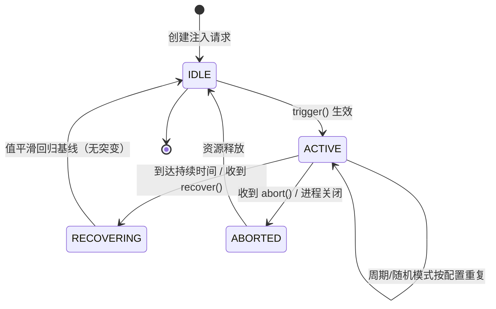
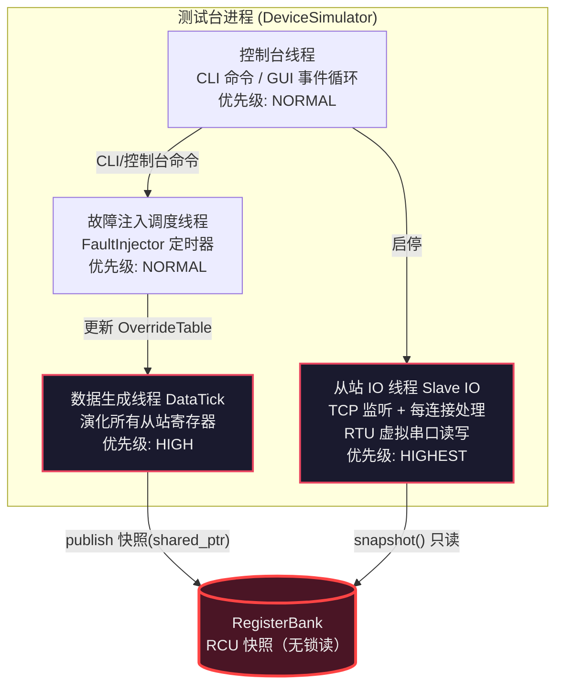

# EnerSentry 储能上位机系统 —— 设备模拟与故障注入设计说明

> **文档编号**：ENS-HLD-SIM  
> **版本**：V1.4  
> **日期**：2026-08-18  
> **状态**：正式发布（基线规范）  
> **编制依据**：《EnerSentry-储能上位机系统-概要设计说明书 V1.5》（ENS-HLD-001）、《EnerSentry-储能上位机系统-软件需求规格说明书（SRS）V1.1》（ENS-SRS-001）、《EnerSentry-储能上位机系统-接口控制文档 V1.14》（ENS-ICD-001）、《EnerSentry-储能上位机系统-线程模型与并发设计专题报告 V1.0》（ENS-CONC-001）  
> **对应需求**：FR-SIM-01~10、FR-SIM-05a~e、NFR-TEST-01~04、COMM-03/09/12/13、NFR-REL-02/03/05、NFR-MAINT-03/04、NFR-PORT-03、FR-AL-01~13、FR-CTRL-07、FR-DG-02  
> **后续文档**：《详细设计说明书 ENS-LLD-SIM》、《测试方案》

---

## 文档修订记录

| 版本 | 日期 | 修订人 | 修订内容 |
|------|------|--------|---------|
| V1.0 | 2026-08-14 | 系统架构师 | 初始版本。补齐"设备模拟器 + 故障注入"作为独立测试台（Test Bench）的专属概要设计：程序形态结论、模拟点位模型（与 ICD 严格对齐）、Modbus TCP 监听 + 虚拟串口对接（主程序零改动）、故障注入引擎（FR-SIM-05a~e 五类故障全覆盖）、线程模型（与 ENS-CONC-001 一致）、配置与脚本；新增 FR-SIM-08/09 与 NFR-TEST-01~03 需求编号 |
| V1.1 | 2026-08-17 | 系统架构师 | 增加图形控制台（GUI）形态：启动器升级为默认 Qt 5.15 Widgets 界面（`DeviceSimulator`），保留 headless 入口（`DeviceSimulatorHeadless`）；新增需求 FR-SIM-10 / NFR-TEST-04；同步修订 §2.2 / §2.5 / §6.1 / §9.1 / §11 与耦合说明（`ens::sim` 确认不依赖 Qt） |
| V1.2 | 2026-08-17 | 系统架构师 | 项目结构落地为"单仓库两子项目 + 共享 `ens::sim` 静态库"：明确 `libs/ens_sim`（共享库）、`apps/device_simulator`（测试台）、`apps/ens_app`（上位机）三目标；进程内 Simulation 模式降级为可选增强（受 `ENS_APP_SIM_MODE` CMake option 控制，非默认）；同步修订 §2.2 / §2.5 / §9.1（FR-SIM-08 弱化）/ §11（ADR-SIM-01） |
| V1.3 | 2026-08-17 | 系统架构师 | **形态收敛为纯 GUI 测试台**：移除命令行 / headless 入口（`DeviceSimulatorHeadless`）与进程内 `SimulationMode`（含 `ENS_APP_SIM_MODE`）；`ens::sim` 不再作为独立共享静态库，降级为 `device_simulator` 工程**内部纯 C++17 模块**（`src/sim/`）；明确单仓库两独立 Qt 工程（`device_simulator` / `ens_app`）仅经 Modbus TCP 5020 对话。同步修订 §2.2 / §2.5 / §7.1 / §7.2 / §8（NFR-TEST-02 弱化）/ §9.1（FR-SIM-08 重定义）/ §11（ADR-SIM-01、ADR-SIM-06） |
| V1.4 | 2026-08-18 | 系统架构师 | **RTU 升为正式一等链路，TCP + RTU 双链路同时启用**：依据主程序通信栈为 Modbus TCP + RTU 双栈（COMM §1.3 / §3.1「高频走 TCP、辅机走 RS485」），将测试台从 V1.3「TCP 默认、RTU 可选回退」升级为「TCP 监听（BMS/PCS/电表）+ 虚拟串口 RTU 从站（液冷/消防辅机）同时运行」，完美镜像主程序实际部署拓扑——一个 `simconfig.json` 即可同时验证两条通信路径。同步修订 §1.2 / §2.2 / §2.4 / §3.2 / §4.1 / §7.1（simconfig 双端点配置）/ §9.1（FR-SIM-09）/ §11（ADR-SIM-01 / 02）；修正 V1.3「仅经 Modbus TCP 对话」措辞矛盾 |

---

## 目录

1. [引言与定位](#1-引言与定位)
   - 1.1 [编写目的](#11-编写目的)
   - 1.2 [文档范围与约束](#12-文档范围与约束)
   - 1.3 [术语与缩略语](#13-术语与缩略语)
   - 1.4 [参考文档](#14-参考文档)
2. [程序定位与形态](#2-程序定位与形态)
   - 2.1 [测试台定位：独立于被测系统](#21-测试台定位独立于被测系统)
   - 2.2 [形态结论与推荐：可复用模拟库 + 轻量启动器](#22-形态结论与推荐可复用模拟库--轻量启动器)
   - 2.3 [数据流方向：只产生数据/故障，不消费主程序内部状态](#23-数据流方向只产生数据故障不消费主程序内部状态)
   - 2.4 [与被测系统的边界：IChannel 零改动接入](#24-与被测系统的边界ichannel-零改动接入)
   - 2.5 [进程 / 库部署形态与 CMake Target](#25-进程--库部署形态与-cmake-target)
3. [模拟点位模型（与 ICD 严格对齐）](#3-模拟点位模型与-icd-严格对齐)
   - 3.1 [点表契约继承（PointTableEntry 复用）](#31-点表契约继承pointtableentry-复用)
   - 3.2 [设备拓扑](#32-设备拓扑)
   - 3.3 [BMS 簇级寄存器映射](#33-bms-簇级寄存器映射)
   - 3.4 [BMS 单体级寄存器映射（640 电压 / 温度）](#34-bms-单体级寄存器映射640-电压--温度)
   - 3.5 [PCS 寄存器映射](#35-pcs-寄存器映射)
   - 3.6 [关口电表寄存器映射](#36-关口电表寄存器映射)
   - 3.7 [辅机（液冷 / 消防）寄存器映射](#37-辅机液冷--消防寄存器映射)
   - 3.8 [物理规律演化模型](#38-物理规律演化模型)
4. [通信对接设计（Modbus TCP 监听 + 虚拟串口）](#4-通信对接设计modbus-tcp-监听--虚拟串口)
   - 4.1 [主程序零改动接入模型](#41-主程序零改动接入模型)
   - 4.2 [Modbus TCP Server（监听端口 / 从站地址 / 轮询节奏）](#42-modbus-tcp-server监听端口--从站地址--轮询节奏)
   - 4.3 [虚拟串口 RTU 从站（com0com / socat）](#43-虚拟串口-rtu-从站com0com--socat)
   - 4.4 [响应构建（FC03/04 读，FC05/06/10 写回显）](#44-响应构建fc0304-读fc050610-写回显)
   - 4.5 [寄存器库与并发读取（RCU 快照）](#45-寄存器库与并发读取rcu-快照)
5. [故障注入引擎](#5-故障注入引擎)
   - 5.1 [触发 / 恢复状态机](#51-触发--恢复状态机)
   - 5.2 [五类故障映射（FR-SIM-05a~e → 寄存器字节）](#52-五类故障映射fr-sim-05a~e--寄存器字节)
   - 5.3 [触发模式（单次 / 周期 / 随机 / 脚本化）](#53-触发模式单次--周期--随机--脚本化)
   - 5.4 [故障作用域（全局 / 按设备 / 按测点）](#54-故障作用域全局--按设备--按测点)
6. [线程模型（与 ENS-CONC-001 一致）](#6-线程模型与-ens-conc-001-一致)
   - 6.1 [线程拓扑](#61-线程拓扑)
   - 6.2 [数据生成线程（DataTick）](#62-数据生成线程datatick)
   - 6.3 [从站 IO 线程（Slave IO）](#63-从站-io 线程slave-io)
   - 6.4 [故障注入调度](#64-故障注入调度)
   - 6.5 [生命周期与优雅关闭](#65-生命周期与优雅关闭)
7. [配置与脚本](#7-配置与脚本)
   - 7.1 [配置项（JSON）](#71-配置项json)
   - 7.2 [场景脚本格式（Scenario Script）](#72-场景脚本格式scenario-script)
   - 7.3 [典型场景示例](#73-典型场景示例)
8. [非功能与可测试性（NFR-TEST）](#8-非功能与可测试性nfr-test)
9. [需求追溯矩阵](#9-需求追溯矩阵)
   - 9.1 [本册新增需求](#91-本册新增需求)
   - 9.2 [关联主程序需求追溯](#92-关联主程序需求追溯)
10. [附录 A：寄存器映射速查矩阵](#10-附录-a寄存器映射速查矩阵)
11. [附录 B：架构决策（ADR-SIM）](#11-附录-b架构决策adr-sim)

---

## 1. 引言与定位

### 1.1 编写目的

本文档是 EnerSentry 储能上位机系统**设备模拟与故障注入（独立测试台 / Test Bench）**的概要设计说明。在既有体系中，"设备模拟器"仅在 SRS 的 `FR-SIM` 系列与 HLD-000 的§概览中被零散提及，缺少一份专属设计文档。然而它是开发期**唯一的"假设备"数据源与测试武器**：无真实硬件时，开发、联调、演示、回归测试全部依赖它驱动主程序（被测系统）。

本文档的目标：

- 明确测试台**程序形态与边界**，使其作为一等公民程序存在，且**不侵入、不改动被测主系统**；
- 定义**模拟点位模型**，使其与《接口控制文档 ENS-ICD-001》的点表 / 寄存器映射**严格一致**；
- 定义**通信对接方式**，确保主程序通信栈（IChannel / ModbusEngine）**零代码改动**即可接入；
- 定义**故障注入引擎**，覆盖 SRS `FR-SIM-05a~e` 五类故障，并能驱动 `FR-AL`（告警）、`FR-CTRL-07`（SBO 断线分支）、`COMM-12/13`（通信诊断）的验证；
- 定义**线程模型**，与《线程模型与并发设计专题报告 ENS-CONC-001》保持一致。

**预期读者**：系统架构师、测试台开发工程师、测试工程师、系统集成 / 现场调试工程师、技术评审人员。

### 1.2 文档范围与约束

**本册覆盖**：

- 测试台的程序形态、进程 / 库边界、与 IChannel 的对接契约；
- 模拟点位模型（BMS / PCS / 关口电表 / 辅机）的寄存器映射，字节序、缩放因子、单位与 ICD 对齐；
- Modbus TCP 监听服务 + 虚拟串口 RTU 从站**双链路同时接入**的实现要点（TCP 承载 BMS/PCS/电表，RTU 承载液冷/消防辅机，完美镜像主程序双栈部署）；
- 故障注入引擎的状态机、五类故障到寄存器字节的映射、四种触发模式；
- 测试台自身线程模型、配置与场景脚本格式；
- 启动器**图形控制台（GUI）**的模块划分、交互与刷新模型（Qt 5.15 Widgets，FR-SIM-10）。

**本册不覆盖**（由其他文档负责）：

- 主程序（被测系统）的协议解析、轮询调度、告警判定、SBO 控制、UI 渲染——属 HLD-000 / COMM / PROTO / BIZ / UI；
- 主程序的 ICD 接口契约（`PointTableEntry` 等结构定义）——属 ENS-ICD-001，本册**复用不重定义**；
- 自动化测试的用例组织与执行计划——属《测试方案》。

**设计约束基线**：

| 维度 | 约束 |
|------|------|
| 语言 / 框架 | C++17、Qt 5.15 LTS、QCustomPlot（仅启动器 UI 用）、nlohmann/json |
| 通信协议 | 自研 Modbus RTU / TCP 帧构造，与主程序共用同一套 CRC-16/MODBUS（多项式 0xA001）与 MBAP 规范 |
| 接入兼容 | 主程序通过标准 `IChannel` 直连，测试台**不得要求主程序新增任何通道类型或分支** |
| 点表一致 | 测试台点位 ID / 寄存器地址 / 数据类型 / 字节序 / 缩放因子 / 单位须与主程序 `pointtable.json` 完全一致 |
| 线程一致 | 测试台线程模型遵循 ENS-CONC-001 的五项原则（职责单一 / 无锁优先 / 零 UI 阻塞 / 故障隔离 / 亲和性绑定） |

### 1.3 术语与缩略语

| 术语 | 含义 |
|------|------|
| **测试台 / Test Bench** | 本文档设计的设备模拟与故障注入独立程序，作为被测主系统的"假设备"数据源 |
| **被测系统 (SUT)** | EnerSentry 主程序（上位机），通过 `IChannel` 连接真实设备或本测试台 |
| **Modbus TCP Server** | Modbus TCP 从站的服务端实现：被动监听端口、接受主站连接、响应读请求（主程序 `TcpChannel` 是 Modbus TCP **Client**） |
| **RCU 快照** | Read-Copy-Update：数据生成线程写临时副本、原子发布 `shared_ptr<const>` 新快照，读侧无锁获取当前快照 |
| **故障作用域** | 故障注入的目标范围：全局 / 指定从站 / 指定测点 |
| **场景脚本** | 预设的一组故障注入序列（含时间、目标、参数），用于自动化回归 |

### 1.4 参考文档

| 编号 | 文档名称 | 版本 | 关键引用 |
|------|---------|------|---------|
| REF-SRS | 软件需求规格说明书（SRS） | V1.1 | FR-SIM-01~07、FR-SIM-05a~e、NFR 系列、COMM 系列、FR-AL、FR-CTRL-07、FR-DG |
| REF-HLD | 概要设计说明书（HLD） | V1.5 | 五层架构、IChannel 抽象、线程模型引用、故障注入能力矩阵 |
| REF-ICD | 接口控制文档（ICD/IDD） | V1.14 | `PointTableEntry` / `RegisterType` / `DataType` / `ByteOrder` / `pointtable.json` 约定 |
| REF-CONC | 线程模型与并发设计专题报告 | V1.0 | 线程拓扑、无锁模型、职责单一、亲和性绑定 |
| REF-COMM | 通信接入设计说明 | V1.5.3 | `IChannel`、Modbus 帧 / CRC、TcpChannel 重连、PollScheduler 熔断 |
| REF-LLD-SIM | 设备模拟与故障注入模块详细设计 | V1.0 | 本册的详细落地（类图 / 伪代码 / 数据结构） |

---

## 2. 程序定位与形态

### 2.1 测试台定位：独立于被测系统

测试台（Test Bench）是**被测主系统之外的独立程序**，其唯一职责是代替真实储能设备，向上位机提供**符合 Modbus 协议的字节流**与**可控的故障**。它不是一个"插件"、不是主程序内部的隐藏开关，而是一个**一等公民程序（First-class Program）**。

| 维度 | 测试台 | 被测主系统（SUT） |
|------|--------|-------------------|
| 进程 | 独立进程（`DeviceSimulator.exe` / `ens-sim` 启动器） | 独立进程（EnerSentry 主程序） |
| 角色 | Modbus **从站**（Server） | Modbus **主站**（Client） |
| 数据 | 只**产生**模拟数据与故障 | 采集、解析、存储、呈现、控制 |
| 状态依赖 | 不读取主程序任何内部状态 | 不感知自己连的是真实设备还是测试台 |
| 部署 | 开发机 / 调试工控机，可与被测同机（回环）或异机 | 站端工控机 |

> **关键不变量**：测试台**只产生数据 / 故障，不消费主程序内部状态**（见 NFR-TEST-03）。它对被测系统的唯一"影响面"是经由标准 `IChannel` 收发的 Modbus 字节流——这与真实设备完全一致。因此，被测主系统的全部逻辑（解析、告警、SBO、存储、诊断）都可在无真实硬件时被完整验证。

### 2.2 形态结论与推荐：可复用模拟库 + 轻量启动器

经权衡常见形态，本设计给出**明确结论**：测试台以**纯 GUI 应用**交付，不提供命令行 / headless 入口，模拟逻辑作为工程内部模块组织（不单独编译为共享库）；主程序与测试台始终为两个独立进程、经 Modbus TCP + Modbus RTU **双链路**对话（完美镜像主程序双栈部署）。

> **结论（推荐形态：单仓库两独立 Qt 工程 + 测试台内部引擎模块）**：测试台与上位机主程序**同处一个代码仓库（`EnerSentry`）的两个独立工程**，二者经 Modbus TCP（高频设备，默认 5020）+ Modbus RTU 虚拟串口（液冷/消防辅机）**双链路同时对话**，完美镜像主程序实际部署拓扑（COMM §3.1「高频走 TCP、辅机走 RS485」），主程序通信栈零改动（FR-SIM-09）：
> - **测试台工程 `device_simulator`（Qt 5.15 Widgets GUI 应用）**：以图形控制台 `SimulatorMainWindow` 为人机交互前端（FR-SIM-10），含监听状态、实时寄存器监视、故障注入控制、场景脚本运行、执行日志查看、配置面板（详见 §2.5 / ENS-SIM-IMP §5、§10）。模拟 / 故障逻辑（`SimulatorEngine` / `PointGenerator` / `ModbusSlaveEmulator` / `FaultInjector` / `ScenarioScript` / `RegisterBank`）作为工程**内部的纯 C++17 模块**（`src/sim/`）实现，**不单独编译为静态库、不提供命令行 / headless 入口**。
> - **上位机主程序 `ens_app`（Qt 应用）**：被测系统本身；以标准 `TcpChannel`（BMS/PCS/电表，FR-SIM-09）与 `SerialChannel`（液冷/消防辅机）分别连接测试台的 TCP 监听与虚拟串口 RTU 从站，对"连的是真实设备还是模拟器"完全无感（§2.4）。
> - **无进程内 Simulation 模式**：测试台与主程序始终为两个独立进程，主程序**不链接、不感知**测试台任何源码。逻辑组织由"测试台内部模块"承担，无需跨项目共享库——主程序本就只消费 Modbus 字节流，无需复用模拟逻辑。

**为何不采用"共享静态库 + headless"形态**：你明确只要 GUI 测试台、不要命令行。headless 入口的存在理由（CI 无界面自动化）已被放弃；而"共享库"的唯一硬理由正是为 headless 拆分零 Qt 引擎——既无 headless，引擎作为工程内部模块即可，无需单独成库。保留共享库与 headless 只会徒增 CMake 复杂度与维护面。

**为何不采用"进程内 Simulation 模式"**：该模式需主程序链接模拟库，违背"两工程完全独立、主程序零耦合"的初衷，且收益有限（单进程联调可用"两进程 + 本机 TCP 回环"等价替代）。故彻底移除。

| 形态 | 独立进程 | 主程序零改动 | GUI 交互 | 构建复杂度 |
|------|---------|------------|---------|-----------|
| 仅 exe（无库） | ✅ | ✅ | 需自绘或无 | 低 |
| 库 + headless（旧方案） | ✅ | ✅ | ✅ | 高（3 目标 + CI） |
| **两工程 + 内部模块（采用）** | ✅ | ✅ | ✅ | 低（2 工程，引擎内聚） |

### 2.3 数据流方向：只产生数据/故障，不消费主程序内部状态

测试台对外的数据流向是**单向产生**：

```
   测试台（从站）                                      被测主系统（主站）
┌──────────────────────┐   Modbus 字节流    ┌──────────────────────────┐
│  PointGenerator       │ ──── 读请求响应 ──▶ │  IChannel → ModbusEngine  │
│  (演化寄存器值)        │ ◀── 写请求(控制) ── │  → PollScheduler → 业务层  │
│  FaultInjector        │                    │  (告警/SBO/存储/诊断)      │
│  (改写/破坏响应)       │                    │                          │
└──────────────────────┘                    └──────────────────────────┘
        │                                            ▲
        │ 仅输出：寄存器值 / 故障帧                     │ 主程序状态完全由主程序自决
        └──────── 不回读、不依赖主程序任何内部状态 ──────┘
```

- 测试台**可接受**主程序的写请求（如 SBO 排风 / 液冷控制写寄存器），并在本地回显，但这只是"模拟设备接受控制"，**不构成对主程序内部状态的依赖**。
- 测试台**绝不**主动查询主程序的告警结果、SBO 状态、存储内容；验证"主程序是否正确响应"是测试框架（外部断言）的职责，而非测试台的职责（见 NFR-TEST-03）。

### 2.4 与被测系统的边界：IChannel 零改动接入

主程序通信栈（`IChannel` → `ModbusEngine` → `PollScheduler`）对"连的是真实设备还是测试台"**完全无感**。测试台只须在物理 / 网络层提供标准 Modbus 从站端点：

- **默认路径（FR-SIM-09）**：测试台作为 **Modbus TCP Server** 监听本机端口（默认 `5020`），主程序以标准 `TcpChannel`（Modbus TCP Client）连接 `127.0.0.1:5020`，使用既有 `pointtable.json`（从站地址 = 模拟从站地址）。**主程序代码零改动**。
- **RTU 链路（承载辅机，与主程序 RS485 部署一致）**：测试台作为 **Modbus RTU 从站**挂载到虚拟串口（`com0com` 配对端口 / `socat` pty 对），主程序以标准 `SerialChannel` 连接配对端口。**主程序代码零改动**。该链路与 TCP 链路**同时启用**，分别承载不同设备类（见 §3.2）——这是验证主程序 RTU 栈（真实 CRC-16 校验、RS485 半双工、3.5 字符帧切分、`ModbusStreamAccumulator` 的 Hunt Mode）的必要条件。
- 故障注入（CRC 错误、断链、超时）均由测试台在**响应侧**施加，主程序照常走 `crcErrorCount++` / 超时重试 / 熔断 / 重连流程——这正是要验证的行为。

> **零改动验收点**：主程序不新增任何"IsSimulator"分支、不新增通道类型、不新增协议分支。接入测试台与接入真实设备**仅差一份 `channels.json` / `pointtable.json` 配置**。

### 2.5 进程 / 库部署形态与 CMake Target

> 单仓库 `EnerSentry` 采用 **顶层 CMake + 两个应用子项目**：`apps/device_simulator`（测试台 GUI）与 `apps/ens_app`（上位机），二者互不依赖（对应开发阶段直接建立的两个工程）。

| 组件 | 路径 / CMake Target | 构建类型 | 说明 |
|------|---------------------|---------|------|
| 测试台应用 | `apps/device_simulator` → `DeviceSimulator` | EXECUTABLE（Qt 5.15 Widgets GUI） | 图形控制台（FR-SIM-10）；内含 `src/sim/` 纯 C++17 引擎模块（不单独成库）；链接 QtWidgets + nlohmann_json |
| 上位机主程序 | `apps/ens_app` → `ens::app` | EXECUTABLE（Qt） | 被测系统；经标准 `TcpChannel`（BMS/PCS/电表）与 `SerialChannel`（液冷/消防辅机）分别连测试台 TCP 监听 / 虚拟串口 RTU 从站（FR-SIM-09）；默认不感知测试台任何源码 |

> **符号与耦合**：`device_simulator` 内部的 `src/sim/` 引擎模块为**纯 C++17**（原生 socket + `std::thread`，不依赖 Qt 信号槽），便于隔离测试；Qt GUI 仅作薄前端消费 RCU 快照（NFR-TEST-04）。两个工程**互不依赖**——主程序编译时根本不需要测试台源码存在，确保主程序零耦合（NFR-TEST-03）。

---

## 3. 模拟点位模型（与 ICD 严格对齐）

### 3.1 点表契约继承（PointTableEntry 复用）

测试台**不重新定义**点表结构，而是**直接复用** ENS-ICD-001 §7.1 的 `PointTableEntry`：

```cpp
// 复用 ENS-ICD-001 §7.1 —— 测试台与主程序共用同一结构体定义
namespace ens::protocol {
enum class RegisterType : uint8_t { Coil=0, DiscreteInput=1, HoldingRegister=2, InputRegister=3 };
enum class DataType     : uint8_t { Bool=0, Int16=1, Uint16=2, Int32=3, Float32=4, Float64=5 };
enum class ByteOrder    : uint8_t { ABCD=0, BADC=1, CDAB=2, DCBA=3 };

struct PointTableEntry {
    uint32_t     pointId;
    std::string  pointName;
    uint32_t     linkId;
    uint8_t      slaveAddress;
    RegisterType regType;
    uint16_t     registerAddr;
    DataType     dataType;
    ByteOrder    byteOrder;
    float        scaleFactor;
    float        offset;
    std::string  unit;
    uint32_t     pollIntervalMs;
    uint8_t      priority;
    bool         enabled;
};
}
```

测试台加载与主程序**完全相同**的 `pointtable.json`（或由 `SimConfig` 内嵌同一份映射），保证：

- 测点 ID、从站地址、寄存器地址、数据类型、字节序、缩放因子、单位**逐字段一致**；
- 工程值计算口径一致：`工程值 = 寄存器原始值 × scaleFactor + offset`（ICD §7.1）；
- 浮点寄存器统一 `float32` + `ABCD`（大端 / Motorola）字节序，与 ICD 示例（Rack-01 最高温度 @ holding 100，float32 ABCD 0.1 ℃）一致。

> **对齐验收点**：测试台产出的每个寄存器字节，经主程序 `PointTable::resolve` 解析后，得到的工程值 = 测试台设定的物理值（在缩放精度内）。本文 §3.3~3.7 给出的寄存器映射即为 `pointtable.json` 的**权威内容**，无"待定"。

### 3.2 设备拓扑

| 设备类 | 默认从站地址 | 数量 | 链路（测试台承载方式） | 轮询节奏 |
|--------|-------------|------|---------|---------|
| BMS（电池簇） | 1 ~ 16 | 16 | **Modbus TCP**（监听 5020，全双工） | 簇级 100ms；单体级 1s（可配） |
| PCS（功率变换） | 17 ~ 20 | 4 | **Modbus TCP**（监听 5020） | 1s |
| 关口电表 | 21 | 1 | **Modbus TCP**（监听 5020） | 1s |
| 液冷辅机 | 22 | 1 | **Modbus RTU**（虚拟串口 RS485，半双工） | 1s |
| 消防辅机 | 23 | 1 | **Modbus RTU**（虚拟串口 RS485，半双工） | 1s |

> 数量与地址均可配（FR-SIM-02 / FR-SIM-07）。上表为**默认整站规模**，与 SRS `FR-SIM-02`（≥16 BMS + 4 PCS + 1 电表 + 辅机若干）一致。从站地址空间 1~247，测试台支持任意子集。**链路分配固定为 TCP 承载 BMS/PCS/电表、RTU 承载辅机**，与 COMM §3.1「高频走 TCP、辅机走 RS485」的带宽论证一致；测试台**同时拉起 TCP 监听与 RTU 虚拟串口从站**，一个 `simconfig.json` 即可验证两条通信路径（FR-SIM-09）。

### 3.3 BMS 簇级寄存器映射

每簇寄存器基址：`BMS_BASE(c) = 0x1000 + (c-1) * 0x600`，`c ∈ [1,16]`。簇级块占用前 `0x10` 寄存器。

| 偏移(hex) | 寄存器地址 | 类型 | 数据类型 | 字节序 | scale | offset | 单位 | 含义 | 故障注入关联 |
|-----------|-----------|------|---------|--------|-------|--------|------|------|--------------|
| +0x00 | `BMS_BASE+0` | HR | float32 | ABCD | 0.1 | 0 | ℃ | 簇最高温度 | FR-SIM-05a |
| +0x02 | `BMS_BASE+2` | HR | float32 | ABCD | 0.01 | 0 | % | 簇 SOC | — |
| +0x04 | `BMS_BASE+4` | HR | float32 | ABCD | 0.01 | 0 | % | 簇 SOH | — |
| +0x06 | `BMS_BASE+6` | HR | float32 | ABCD | 0.1 | 0 | ℃ | 簇平均温度 | — |
| +0x08 | `BMS_BASE+8` | HR | float32 | ABCD | 0.01 | 0 | V | 簇总压 | — |
| +0x0A | `BMS_BASE+10` | HR | float32 | ABCD | 0.01 | 0 | A | 簇电流（正=放电） | — |
| +0x0C | `BMS_BASE+12` | HR | uint16 | — | 1 | 0 | — | 均衡状态字（bitN=第 N 子模块均衡中） | — |
| +0x0D | `BMS_BASE+13` | HR | uint16 | — | 1 | 0 | — | **告警字**（见 §3.3.1） | FR-SIM-05a/b 改写 |
| +0x0E | `BMS_BASE+14` | HR | uint16 | — | 1 | 0 | — | 簇状态字（bit0=运行,1=充电,2=放电,3=故障,4=离线） | FR-SIM-05c 置离线 |

**3.3.1 簇告警字（Alarm Word）位定义**

| Bit | 名称 | 触发含义 |
|-----|------|---------|
| 0 | OverTemp | 簇最高温度越上限（≥ 告警阈值） |
| 1 | CellOverVoltage | 存在单体过压 |
| 2 | CellUnderVoltage | 存在单体欠压 |
| 3 | TempDiffLarge | 簇内最大温差越限 |
| 4 | SOHLow | SOH 低于阈值 |
| 5 | SOCLow | SOC 低于阈值 |
| 6 | BalanceFault | 均衡电路异常 |
| 7 | CommLoss | 簇内部通信丢失 |

> 测试台在**正常演化**时依据物理模型自动维护告警字；故障注入（FR-SIM-05a/b）可强制置位对应 bit，使主程序 `FR-AL` 立即产生对应级别告警。

### 3.4 BMS 单体级寄存器映射（640 电压 / 温度）

每簇单体块从 `BMS_BASE+0x10` 起；电压、温度各 640 点（与 SRS"640 单体电压/温度"一致）。

| 块 | 起始地址 | 寄存器数 | 类型 | 数据类型 | 字节序 | scale | offset | 单位 | 含义 |
|----|---------|---------|------|---------|--------|-------|--------|------|------|
| 单体电压 | `BMS_BASE+0x10` | 640 | HR | uint16 | — | 0.001 | 0 | V | Cell[i] 电压（mV 级存储，如 3.700V → 3700） |
| 单体温度 | `BMS_BASE+0x290` | 640 | HR | uint16 | — | 0.1 | 0 | ℃ | Cell[i] 温度 |

- `Cell[i]` 索引 `i ∈ [0,639]`，电压寄存器 = `BMS_BASE+0x10+i`，温度寄存器 = `BMS_BASE+0x290+i`。
- 单体电压用 `uint16` 而非 `float32`，是储能 BMS 主流做法（mV 精度足够，省一半寄存器）；缩放 `0.001 V` 与 ICD `scaleFactor` 约定一致。
- 单体级轮询默认 1s（高频整站下可由 `pollIntervalMs` 调整为 100ms；测试台按 `pointtable.json` 配置响应，不强制）。

> **FR-SIM-05b 映射**：注入"单体电压异常"时，测试台把目标 `Cell[i]` 电压寄存器改写为越限值（如 < 2.5V 或 > 3.65V），主程序总览页（FR-OV-04）据此高亮异常电芯。

### 3.5 PCS 寄存器映射

每台 PCS 基址：`PCS_BASE(p) = 0x2000 + (p-1) * 0x200`，`p ∈ [1,4]`。

| 偏移 | 地址 | 类型 | 数据类型 | 字节序 | scale | offset | 单位 | 含义 | 故障关联 |
|------|------|------|---------|--------|-------|--------|------|------|----------|
| +0x00 | `PCS_BASE+0` | HR | float32 | ABCD | 0.01 | 0 | kW | 有功功率（正=放电） | — |
| +0x02 | `PCS_BASE+2` | HR | float32 | ABCD | 0.01 | 0 | kVar | 无功功率 | — |
| +0x04 | `PCS_BASE+4` | HR | float32 | ABCD | 0.01 | 0 | V | 输出线电压 | — |
| +0x06 | `PCS_BASE+6` | HR | float32 | ABCD | 0.01 | 0 | A | 输出电流 | — |
| +0x08 | `PCS_BASE+8` | HR | float32 | ABCD | 0.01 | 0 | Hz | 电网频率 | — |
| +0x0A | `PCS_BASE+10` | HR | uint16 | — | 1 | 0 | — | 运行模式（0待机/1恒功率/2恒压/3恒流/4故障） | — |
| +0x0B | `PCS_BASE+11` | HR | uint16 | — | 1 | 0 | — | **故障字**（bit0过流/1过压/2过温/3通讯） | 可注入 |
| +0x0C | `PCS_BASE+12` | HR | uint16 | — | 1 | 0 | — | PCS 状态字（bit3=故障） | — |

**控制寄存器（供 SBO 写，FR-CTRL / ICD §7.x 示例对齐）**

| 地址 | 类型 | 数据类型 | 含义 | 对应 ICD SBO 示例 |
|------|------|---------|------|-------------------|
| `PCS_BASE+0x1000` | HR（可写）/ Coil | uint16（0/1） | 排风控制 | `(linkId=1, slaveId=2, registerAddr=0x1000)` |
| `PCS_BASE+0x2000` | HR（可写）/ Coil | uint16（0/1） | 液冷控制 | `(linkId=1, slaveId=2, registerAddr=0x2000)` |

> 控制寄存器地址与 ICD §7.x 的 SBO 设备键示例（`PCS#1 排风 0x1000 / 液冷 0x2000`）**逐字节一致**，确保主程序 SBO 下发（FC06/FC05）能被测试台正确回显，进而验证 FR-CTRL 全链路（含 FR-CTRL-07 断线分支）。

### 3.6 关口电表寄存器映射

基址 `METER_BASE = 0x3000`，从站地址 21。

| 偏移 | 地址 | 类型 | 数据类型 | 字节序 | scale | offset | 单位 | 含义 |
|------|------|------|---------|--------|-------|--------|------|------|
| +0x00 | `0x3000` | HR | int32 | ABCD | 0.01 | 0 | kWh | 正向总有功电能（累计） |
| +0x04 | `0x3004` | HR | float32 | ABCD | 0.01 | 0 | kW | 总有功功率 |
| +0x06 | `0x3006` | HR | float32 | ABCD | 0.01 | 0 | kVar | 总无功功率 |
| +0x08 | `0x3008` | HR | float32 | ABCD | 0.01 | 0 | V | A 相电压 |
| +0x0A | `0x300A` | HR | float32 | ABCD | 0.01 | 0 | A | A 相电流 |
| +0x0C | `0x300C` | HR | float32 | ABCD | 0.01 | 0 | Hz | 电网频率 |

> 电表电能为累计量，测试台按有功功率对时间积分递增（物理规律，见 §3.8）。

### 3.7 辅机（液冷 / 消防）寄存器映射

**液冷辅机** 基址 `AUX_COOL_BASE = 0x4000`，从站 22：

| 偏移 | 地址 | 类型 | 数据类型 | scale | offset | 单位 | 含义 |
|------|------|------|---------|-------|--------|------|------|
| +0x00 | `0x4000` | HR | float32 | 0.1 | 0 | ℃ | 出水温度 |
| +0x02 | `0x4002` | HR | float32 | 0.1 | 0 | ℃ | 回水温度 |
| +0x04 | `0x4004` | HR | float32 | 0.01 | 0 | L/min | 流量 |
| +0x06 | `0x4006` | HR | uint16 | 1 | 0 | — | 运行状态字（bit0=运行,1=故障） |
| +0x07 | `0x4007` | HR | uint16 | 1 | 0 | — | 故障字 |

**消防辅机** 基址 `AUX_FIRE_BASE = 0x4100`，从站 23：

| 偏移 | 地址 | 类型 | 数据类型 | scale | offset | 单位 | 含义 |
|------|------|------|---------|-------|--------|------|------|
| +0x00 | `0x4100` | HR | uint16 | 1 | 0 | — | 烟感状态（0/1） |
| +0x01 | `0x4101` | HR | uint16 | 1 | 0 | — | 温感状态（0/1） |
| +0x02 | `0x4102` | HR | uint16 | 1 | 0 | — | 状态字 |
| +0x03 | `0x4103` | HR | uint16 | 1 | 0 | — | 故障字 |

> 辅机数量与地址可配（FR-SIM-02 "辅机若干"）。上述为默认两套；测试台支持按 `SimConfig` 扩展更多辅机从站。

### 3.8 物理规律演化模型

`PointGenerator` 按物理规律演化寄存器值，使数据"非随机噪声"（满足 FR-SIM-04）。以下为每簇 / 每 PCS 的演化规则（`Δt` 为生成步长）：

**(1) SOC 演化**

```
Capacity_Ah = 280            // 单簇标称容量
I = clusterCurrent_A         // 簇电流（正=放电）
SOC_next = SOC - (I * Δt_h / Capacity_Ah) * 100
// 充电时 I<0 → SOC 上升；放电时 I>0 → SOC 下降
clamp(SOC_next, 0, 100)
```

**(2) 温度演化（I²R 加热 + 自然冷却）**

```
R_int   = 0.0008             // 单簇等效内阻（Ω 量级，示意）
T_amb   = 25.0               // 环境温度
k_heat  = 0.02               // 加热系数
k_cool  = 0.01               // 冷却系数
dT = (k_heat * I*I * R_int - k_cool * (T - T_amb)) * Δt_s
T_next = T + dT
// 大电流放电 → 温度上升；静置 → 回到环境温度附近
```

**(3) 单体电压（OCV + 内阻压降）**

```
SOC_n  = SOC / 100
OCV    = 3.0 + 0.6 * SOC_n + 0.05 * sin(2π * SOC_n)   // 开路电压曲线（示意）
V_cell = OCV + I * R_cell        // R_cell ≈ 0.0005 Ω；叠加 ±2mV 高斯噪声
// 正常区间约 2.9~3.65 V；充电末端偏高
```

**(4) 簇总压 / 电流 / PCS 功率**

```
V_total   = V_cell_nominal * N_series      // N_series 串联数（示意 48~52）
P_pcs_kW  = V_total * I / 1000             // 有功功率随电流变化
f_grid    = 50.0 + small_drift             // 频率在 50±0.2 Hz 附近缓慢游走
```

**(5) 电表电能累计**

```
E_kWh_next = E_kWh + P_pcs_kW * Δt_h      // 按有功功率对时间积分
```

> 上述系数为**示意默认值**，均可在 `SimConfig` 中覆盖（FR-SIM-07）。演化保证：电压 / 温度 / SOC 随时间缓慢波动、充放电时单调合理、温度随电流上升——满足 FR-SIM-04 "数据按物理规律变化"。

---

## 4. 通信对接设计（Modbus TCP 监听 + 虚拟串口）

### 4.1 主程序零改动接入模型

```
┌──────────── 被测主系统（不改一行代码）────────────┐         ┌──── 测试台（从站）────┐
│ 通道A channels.json: {type:TCP, ip:127.0.0.1, port:5020}  │         │  ModbusTcpServer      │
│   → 承载 BMS(1..16)/PCS(17..20)/Meter(21)                  │────────▶│  监听 :5020           │
│ 通道B channels.json: {type:RTU, port:COM3, baud:115200}    │         │                       │
│   → 承载 液冷(22)/消防(23) 辅机                             │────────▶│  RtuSlavePort         │
│  IChannel(TcpChannel/SerialChannel) → ModbusEngine         │◀────────│  共用 RegisterBank    │
│   → PollScheduler（按链路分通道轮询）                       │         │  响应 FC03/04/05/06/10│
└────────────────────────────────────────────────────┘         └───────────────────────┘
       仅配置不同；逻辑零改动                                       产生数据/故障
```

- 主程序 `TcpChannel` 是标准 Modbus TCP **Client**，测试台 `ModbusTcpServer` 是被动 **Server**；主程序 `SerialChannel` 是标准 Modbus RTU **Client**，测试台 `RtuSlavePort` 是被动 **Slave**。两条链路**同时运行**，通过 `127.0.0.1:5020` 回环与虚拟串口对（`com0com` / `socat`）对接，主程序通信栈**零改动**（FR-SIM-09 / COMM-12/13）。
- 链路分配由主程序 `channels.json` 决定：BMS/PCS/电表走 TCP 通道，液冷/消防辅机走 RTU 通道——与现场 RS485 总线部署完全一致。测试台侧两传输层共用同一 `RegisterBank` 后端，对主程序而言只是"两个标准 Modbus 从站端点"。

### 4.2 Modbus TCP Server（监听端口 / 从站地址 / 轮询节奏）

| 项 | 默认值 | 说明 |
|----|--------|------|
| 监听地址 | `0.0.0.0`（回环默认 `127.0.0.1`） | 可配 `bindIp` |
| 监听端口 | `5020` | 避开标准 502；可配（FR-SIM-09 默认 TCP 回环） |
| 协议 | Modbus TCP（MBAP，无 CRC） | 帧靠 MBAP `Length` 切分（COMM RTU/TCP 帧格式） |
| 并发 | 每连接一处理上下文；多从站并发响应 | 主程序 `PollScheduler` 对 TCP 全双工并发（COMM §3.3） |
| 支持功能码 | FC03（读保持）、FC04（读输入）、FC06（写单寄存器）、FC05（写单线圈）、FC10（写多寄存器） | 与 SRS COMM-02 一致 |
| 事务配对 | 按 MBAP `TransactionId` 原样回显 | 主程序 `TransactionIdAllocator` 依赖此配对 |

**从站地址路由**：TCP 模式下，主程序在一帧 MBAP 后附加 `Unit ID`（= 从站地址）。测试台 `ModbusTcpServer` 按 `Unit ID` 路由到对应 `RegisterBank` 快照并构造响应——因此**一个 TCP 端口可承载全部 23 个从站**（主程序多从站并发轮询，见 COMM §3.3）。

**轮询节奏**：测试台是**被动响应方**，不主动推送；"轮询节奏"由主程序 `PollScheduler` 按 `pointtable.json` 的 `pollIntervalMs` 决定（BMS 簇级 100ms、单体 1s、PCS/电表/辅机 1s）。测试台只需在收到读请求时返回**当前寄存器快照值**即可。

### 4.3 虚拟串口 RTU 从站（com0com / socat）

| 平台 | 虚拟串口方案 | 测试台侧 | 主程序侧 |
|------|-------------|---------|---------|
| Windows | `com0com` 配对（如 COM3↔COM4） | 打开 COM4 作为 RTU 从站 | `SerialChannel` 打开 COM3 |
| Linux | `socat PTY,raw,echo=0 PTY,raw,echo=0` 生成 `/dev/pts/X`↔`/dev/pts/Y` | 打开 `/dev/pts/Y` | `SerialChannel` 打开 `/dev/pts/X` |

- 帧格式：RTU（地址 + FC + 数据 + **CRC-16/MODBUS**，多项式 0xA001，初值 0xFFFF，低字节在前）——与主程序 `crc16ModbusVerify` 完全一致。
- 半双工：RTU 模式单总线上主从严格串行；测试台作为从站，仅在收到完整请求帧（3.5 字符静默判定）后响应，不抢占总线。
- 从站地址：RTU 帧首字节 = 从站地址，测试台按地址路由到对应 `RegisterBank`。

> RTU 模式是 **FR-SIM-05d（CRC 错误）** 与 **FR-SIM-05c（断链：从站停止应答）** 的主要验证路径；TCP 模式无 CRC，对应"帧破坏 / 连接断开"语义（见 §5.2）。

### 4.4 响应构建（FC03/04 读，FC05/06/10 写回显）

**读响应（FC03/04）**：

```
请求: [unitId][0x03][startHi][startLo][qtyHi][qtyLo]
构造响应:
  byteCount = qty * 2
  响应 = [unitId][0x03][byteCount][reg0Hi][reg0Lo]...[regN-1Hi][regN-1Lo]
        └─ 各寄存器值从 RegisterBank 快照按 dataType/byteOrder 编码 ─┘
  TCP: 前加 MBAP（TransactionId 原样，Length = 后续字节数），无 CRC
  RTU: 末尾加 CRC-16/MODBUS（低字节在前）
```

**写响应（FC06/FC05/FC10）**：测试台接受主程序 SBO 控制写（排风 / 液冷），在本地 `RegisterBank` 对应控制寄存器回显，并返回标准写回显帧；主程序据此判定 `FR-CTRL-05`（执行反馈）。故障注入不影响正常写回显（除非该从站处于"断链"故障）。

### 4.5 寄存器库与并发读取（RCU 快照）

`RegisterBank` 是被测设备全部寄存器的内存镜像。为兼顾"生成线程高频写"与"IO 线程高频读且不阻塞"，采用与主程序一致的 **RCU 快照**（对齐 ADR-LLD-18 的 `shared_ptr<const>` 原子替换思路）：

```
class RegisterBank {
    // 按从站地址分桶；每从站一份寄存器镜像
    std::unordered_map<uint8_t, std::shared_ptr<const SlaveRegs>> m_banks;
    std::shared_mutex m_rw;            // 仅在"发布新快照"时写锁，读侧无锁
public:
    // IO 线程调用：无锁获取当前快照（acquire）
    std::shared_ptr<const SlaveRegs> snapshot(uint8_t slave) const {
        std::shared_lock lk(m_rw);
        auto it = m_banks.find(slave);
        return it == m_banks.end() ? nullptr : it->second;
    }
    // 生成线程调用：构建新副本并原子发布（release）
    void publish(uint8_t slave, std::shared_ptr<const SlaveRegs> next) {
        std::unique_lock lk(m_rw);
        m_banks[slave] = std::move(next);
    }
};
```

- 生成线程（DataTick）每次 tick 写入**临时副本**，完成后 `publish` 新 `shared_ptr<const>`；旧快照在最后一个持有者（正在响应的 IO 上下文）释放后自动析构。
- IO 线程（Slave IO）在每个请求到达时 `snapshot(slave)` 拿当前只读视图，编码响应——**全程无阻塞、无拷贝竞争**。
- 故障注入改写的也是生成线程侧的"故障覆盖表"，随快照发布生效，保证字节级一致。

---

## 5. 故障注入引擎

### 5.1 触发 / 恢复状态机

每个故障注入是一个 `FaultSession`，其生命周期由 `FaultInjector` 管理。状态机覆盖触发、持续、恢复、中止：



| 状态 | 含义 | 对寄存器的影响 |
|------|------|---------------|
| IDLE | 未注入 | 正常物理演化 |
| ACTIVE | 故障生效中 | 覆盖表对目标寄存器施加故障值 / 破坏响应 |
| RECOVERING | 恢复中 | 故障值按斜率平滑回归基线（避免主程序误判"突变抖动"） |
| ABORTED | 中止 | 立即清除覆盖表该项，回到正常 |

> 恢复采用**平滑回归**（而非瞬间跳变），以贴近真实设备恢复行为，并避免主程序因"瞬间回正常"产生额外误告警（与 FR-AL-03 迟滞设计呼应）。

### 5.2 五类故障映射（FR-SIM-05a~e → 寄存器字节）

| 故障 | SRS | 寄存器 / 字节级作用 | 主程序可观测行为 |
|------|-----|---------------------|------------------|
| **过温 (5a)** | FR-SIM-05a | 改写目标 BMS 簇 `最高温度` 寄存器（§3.3 +0x00）按设定速率上升，越过告警阈值后**置位告警字 bit0**（§3.3.1） | 主程序 `FR-AL` 产生严重告警（红+蜂鸣，FR-AL-06）；总览健康色变红 |
| **电压异常 (5b)** | FR-SIM-05b | 改写目标 `Cell[i]` 电压寄存器（§3.4）为越限值（<2.5V 或 >3.65V） | 主程序总览页高亮异常电芯（FR-OV-04）；可触发告警字 bit1/2 |
| **通信断链 (5c)** | FR-SIM-05c | 目标从站**停止响应**读请求（RTU 丢弃帧 / TCP 关闭该 Unit 的连接） | 主程序 `PollScheduler` 超时→重试→熔断降级（ADR-13）；链路状态离线→指数退避重连（COMM-09）；若 SBO Armed 期间则触发 **FR-CTRL-07** 自动清除 |
| **CRC 错误 (5d)** | FR-SIM-05d | **RTU 模式**：响应帧 CRC 两字节被故意改错（低字节翻转 / 重算错误 CRC），使 `crc16ModbusVerify` 失败；**TCP 模式**：无 CRC，改为破坏 1 个数据字节使主程序帧解析失败/丢弃 | 主程序 `crcErrorCount++`（FR-DG-02，NFR-REL-03）；诊断页 CRC 错误率上升 |
| **响应超时 (5e)** | FR-SIM-05e | 目标从站收到请求后**延迟响应**超过主程序 `responseTimeoutMs`（默认 500ms）再回包（或单帧故意不回） | 主程序 `timeoutCount++`、重试≤2（COMM-05）、触发熔断（NFR-REL-05） |

> **CRC 错误的 TCP 等价说明**：Modbus TCP 规范不含 CRC（COMM 帧格式）。为在 TCP 回环下仍验证"坏帧被丢弃并计数"的行为，TCP 模式提供 **"响应破坏（Corrupt Response）"** 故障：翻转响应 PDU 中 1 字节，使主程序 `ModbusStreamAccumulator` / 解析层判定帧损坏并丢弃计数（等价于 RTU 的 CRC 错误验证目标：坏帧不污染数据、被计数）。LLD §4 给出 `buildCorruptFrame()` 伪代码。

### 5.3 触发模式（单次 / 周期 / 随机 / 脚本化）

| 模式 | 语义 | 典型用途 |
|------|------|---------|
| **单次 (Once)** | `trigger()` 后立即生效，持续 `durationMs` 后自动 RECOVERING | 手动验证单条链路 |
| **周期 (Periodic)** | 按 `periodMs` 循环：ACTIVE `onMs` → RECOVERING `offMs` | 压测链路稳定性、验证熔断恢复 |
| **随机 (Random)** | 在 `[minGapMs, maxGapMs]` 随机间隔触发，作用域随机选从站 | 随机断链压测、混沌测试 |
| **脚本化 (Scripted)** | 按 `ScenarioScript` 的时间序列精确触发（FR-SIM-06） | 自动化回归、整站演练 |

> 四种模式均可在控制台或 CLI 指定"作用域"（§5.4）与"目标参数"（如过温速率、越限阈值、超时毫秒数）。

### 5.4 故障作用域（全局 / 按设备 / 按测点）

| 作用域 | 示例 | 影响 |
|--------|------|------|
| 全局 | `scope=all` | 全部从站同时施加（如整站过温演练） |
| 按设备 | `slave=3`（BMS 簇 3） | 仅该从站寄存器/响应受影响 |
| 按测点 | `slave=3&reg=0x10&cell=12` | 仅该簇第 12 单体电压越限（FR-SIM-05b 精确定位） |

`FaultSession` 内部维护 `OverrideTable`：

```
struct FaultOverride {
    FaultType type;            // OverTemp / CellVoltage / CommLoss / CrcError / Timeout
    Scope scope;               // ALL / SLAVE / POINT
    uint8_t slave;             // 目标从站（scope≠ALL 有效）
    uint16_t reg;              // 目标寄存器（scope=POINT 有效）
    float targetValue;         // 越限值 / 目标温度
    float rampRate;            // 上升速率（℃/s 或 V/s）
    int32_t corruptMs;         // 超时/延迟毫秒
};
```

`PointGenerator` 在每 tick 合成寄存器值时，先算物理基线，再叠加 `FaultInjector::resolveOverride(slave, reg)` 的结果——保证故障值最终进入 `RegisterBank` 快照（§4.5）。

---

## 6. 线程模型（与 ENS-CONC-001 一致）

### 6.1 线程拓扑

测试台遵循 ENS-CONC-001 的五项原则（职责单一 / 无锁优先 / 零 UI 阻塞 / 故障隔离 / 亲和性绑定）。默认线程拓扑：



| 线程 | 优先级 | 职责 | 锁策略 | 最大延迟 |
|------|--------|------|--------|---------|
| 控制台线程 | NORMAL | CLI / GUI 事件循环、接收注入命令 | 无（命令经 QueuedConnection 投给 FI） | 人机可接受 |
| 数据生成线程 DataTick | HIGH | 按步长演化全部从站寄存器 + 叠加故障覆盖 | 仅在 `publish` 时 `shared_mutex` 写锁（极短） | tick 间隔（默认 50~100ms） |
| 从站 IO 线程 Slave IO | HIGHEST | TCP 监听 / 接受连接 / 处理读请求；RTU 串口读写 | 读侧 `snapshot()` 无锁 | 响应构造 < 1ms |
| 故障注入调度线程 | NORMAL | 管理 `FaultSession` 状态机、定时器触发 / 恢复 | 仅更新 `OverrideTable`（原子/锁） | 定时器精度 ~10ms |

> 与 ENS-CONC-001 §1.4 一致：热路径（IO 响应）**无锁**，仅在快照发布与故障表更新时持极短锁；控制台与生成解耦；每线程职责单一，崩溃不影响其他线程（故障隔离）。

> **GUI 刷新模型（FR-SIM-10）**：图形控制台运行于 Qt 主线程（优先级 NORMAL），通过 **30Hz `QTimer`** 周期调用 `RegisterBank::snapshot()` 读取最新寄存器镜像并刷新控件（对齐主程序 ADR-22 的渲染节奏）。GUI **绝不**在 UI 线程直接读写引擎热路径；向引擎下发指令（启停、注入故障、加载场景）经 `SimulatorEngine` 的线程安全接口（内部互斥 / 队列）完成。UI 卡顿不影响 Modbus 响应与数据生成（故障隔离）。

### 6.2 数据生成线程（DataTick）

- 维护一个固定间隔 `tickMs`（默认 100ms）的 `QTimer`（或 `std::this_thread::sleep_for` 循环 + `try-catch` 包裹，对齐 ENS-CONC-001 §1.6 的 `SafeWorker` 模式）。
- 每 tick：遍历全部从站 → 按 §3.8 物理模型推进簇级/单体/PCS/电表值 → 调用 `FaultInjector::resolveOverride` 叠加故障 → 组装新 `SlaveRegs` → `RegisterBank::publish`。
- 单体级（640×16 簇）量大，可降频（默认 1s）或在生成线程内批量处理；生成线程**不阻塞 IO 线程**（写锁仅发布瞬间）。

### 6.3 从站 IO 线程（Slave IO）

- **TCP 模式**：`QTcpServer` 在 IO 线程监听 `bindIp:port`；`newConnection` 时 `nextPendingConnection()`，连接 `readyRead` → 解析 MBAP+PDU → `snapshot(slave)` 取当前值 → 编码响应 → `write()`。多连接并发，每连接独立上下文（与 COMM §3.3 全双工并发对应）。
- **RTU 模式**：`QSerialPort` 打开虚拟串口，按 3.5 字符静默判定完整帧（驱动/硬件级，对齐 COMM §2.1，不用用户态 sleep），解析后响应。
- **故障短路**：若目标从站处于 `CommLoss` 故障 → RTU 丢弃请求 / TCP 关闭该连接；若处于 `Timeout` 故障 → `QTimer::singleShot(corruptMs)` 延迟回包；若处于 `CrcError` 故障 → 回包前改坏 CRC 字节。

### 6.4 故障注入调度

- `FaultInjector` 运行于独立线程，持有 `OverrideTable`（生成线程每 tick 读取）。
- 单次 / 周期 / 随机模式由 `QTimer` / 自管调度器驱动状态机（§5.1）。
- 脚本化模式由 `ScenarioScript` 解析后，将一系列 `FaultSession` 按时间戳排入调度队列（FR-SIM-06）。

### 6.5 生命周期与优雅关闭

- 启动：`DeviceSimulator::main` 解析 `SimConfig` → 构造 `SimulatorEngine` → `engine.start()`（起 DataTick / Slave IO / FaultInjector）→ 进入事件循环。
- 关闭：收到退出信号 → `engine.stop()` → 先停故障注入、再停 IO（关闭监听 socket / 串口）、最后停生成线程 → 释放 `RegisterBank`。对齐 ENS-CONC-001 §1.5 的"优雅关闭"顺序。

---

## 7. 配置与脚本

### 7.1 配置项（JSON）

测试台配置 `simconfig.json`（由 `SimConfig` 加载，NFR-MAINT-03 配置外部化）：

| 配置项 | 类型 | 默认 | 说明 |
|--------|------|------|------|
| `tcp` | object | 见下 | **TCP 链路**（承载 BMS/PCS/电表）：`{ "enabled": true, "bindIp": "127.0.0.1", "port": 5020 }`；`enabled=false` 可单独关闭 TCP 链路（纯 RTU 回归） |
| `rtu` | object | 见下 | **RTU 链路**（承载液冷/消防辅机）：`{ "enabled": true, "port": "COM4", "baudRate": 115200 }`；`enabled=false` 可单独关闭 RTU 链路（纯 TCP 回归） |
| `slaves` | array | 见 §3.2 | 从站拓扑（地址/类型/规模/**`transport` 归属 `tcp` 或 `rtu`**）——决定该从站暴露到哪条链路 |
| `tickMs` | int | `100` | 数据生成步长 |
| `pointtablePath` | string | `"config/pointtable.json"` | 复用主程序点表（保证字节级一致） |
| `seed` | int | `0` | 随机种子（NFR-TEST-01 确定性） |
| `exportLogPath` | string | `""` | 执行日志 JSON 导出路径（为空则不导出）；GUI 提供"导出日志"按钮，用于问题回溯（NFR-TEST-02 弱化） |

> **双链路默认同时启用**：`tcp.enabled` 与 `rtu.enabled` 默认均为 `true`。每个从站在 `slaves[]` 中通过 `transport` 字段声明归属链路（`tcp` / `rtu`）；测试台据此把该从站暴露到对应传输层，两条链路**共用同一 `RegisterBank`** 后端。主程序按 `channels.json` 分链路轮询——一个 `simconfig.json` 即可同时验证 TCP 栈与 RTU 栈。关闭任一 `enabled` 可用于单链路回归（如仅验证 RTU 的 CRC 失败路径）。

### 7.2 场景脚本格式（Scenario Script）

`ScenarioScript` 为 JSON 数组，每项描述一个带时间戳的故障注入（FR-SIM-06）：

```json
{
  "scenario": "整站过温演练",
  "description": "先单簇过温，10s 后整站过温，30s 后恢复",
  "steps": [
    { "t": 0,    "action": "inject", "fault": "OverTemp", "scope": "slave", "slave": 3, "targetValue": 65.0, "rampRate": 2.0, "durationMs": 10000 },
    { "t": 10000, "action": "inject", "fault": "OverTemp", "scope": "all",  "targetValue": 60.0, "rampRate": 1.0, "durationMs": 20000 },
    { "t": 30000, "action": "recover", "fault": "OverTemp", "scope": "all" }
  ]
}
```

- `t`：相对脚本启动的毫秒偏移；`FaultInjector` 按时间戳精确触发。
- 脚本执行过程可被记录为**机器可读结果日志（JSON）**（NFR-TEST-02），供问题回溯与人工复核。

### 7.3 典型场景示例

**场景 A：整站过温演练（验证 FR-AL + 总览）**

1. 启动测试台（默认 TCP 回环），主程序连入；
2. 注入 `OverTemp / scope=all / targetValue=60 / rampRate=1.0`；
3. 预期：各簇最高温度寄存器上升 → 告警字 bit0 置位 → 主程序 FR-AL 严重告警弹窗 + 总览变红。

**场景 B：随机断链压测（验证 COMM-09 / ADR-13 / FR-CTRL-07）**

1. 启动测试台，主程序连入；
2. 注入 `CommLoss / scope=random / mode=random / minGapMs=2000 / maxGapMs=8000`；
3. 预期：随机从站离线 → 主程序熔断降级（HEALTHY→DEGRADED→ISOLATED）→ 指数退避重连（COMM-09）；若在 SBO Armed 期间对目标从站断链，则 FR-CTRL-07 自动清除 Armed 并写审计。

**场景 C：CRC 风暴（验证 NFR-REL-03 / FR-DG-02）**

1. 注入 `CrcError / scope=all / mode=periodic / onMs=500 / offMs=500`；
2. 预期：主程序 `crcErrorCount` 持续增长但**不污染数据**、不重试（NFR-REL-03），诊断页 CRC 错误率可见（FR-DG-02）。

---

## 8. 非功能与可测试性（NFR-TEST）

> 新增 `NFR-TEST` 类别（既有 NFR 最大到 NFR-PORT-04，无 TEST 类，故不冲突）。

| 需求编号 | 需求 | 指标 / 约束 | 优先级 |
|---------|------|------------|--------|
| NFR-TEST-01 | 可测试性 / 确定性 | 数据生成须可设随机种子（`seed`）；同一 `SimConfig` + 同一 `ScenarioScript` 多次运行结果可复现，支撑 CI 回归断言 | P0 |
| NFR-TEST-02 | 观测日志导出 | 测试台可将故障注入 / 场景执行过程导出为**机器可读 JSON 日志**（`sim_events.jsonl` + `sim_report.json`），供问题回溯与人工复核；GUI 提供"导出日志"按钮 | P1 |
| NFR-TEST-03 | 单向解耦 | 测试台只产生数据 / 故障、不消费 / 依赖主程序内部状态；不要求主程序新增任何代码分支 | P0 |

> 上述三条为测试台自身的质量属性，使它能作为**可靠回归武器**（呼应 SRS 7.6 测试方案对 FR-SIM-05a~e、FR-CTRL-07 的覆盖要求）。

---

## 9. 需求追溯矩阵

### 9.1 本册新增需求

| 编号 | 需求 | 优先级 | 落点章节 |
|------|------|--------|---------|
| FR-SIM-08 | 模拟 / 故障逻辑以测试台**内部纯 C++17 模块**（`src/sim/`，含 `SimulatorEngine` / `PointGenerator` / `ModbusSlaveEmulator` / `FaultInjector` / `ScenarioScript` / `RegisterBank`）形式组织；**不单独编译为共享库、不提供 headless 入口**，仅服务于 GUI 测试台；不依赖 Qt、不链接主程序任何业务层 | P1 | §2.2, §2.5 |
| FR-SIM-09 | **TCP + RTU 双链路同时接入**：测试台同时拉起 Modbus TCP 监听（默认 5020，承载 BMS/PCS/电表）与虚拟串口 RTU 从站（承载液冷/消防辅机），完美镜像主程序实际双栈部署（COMM §3.1）；主程序分别经标准 `TcpChannel` / `SerialChannel` 直连，通信栈零改动 | P0 | §2.4, §3.2, §4.1, §4.2, §4.3 |
| FR-SIM-10 | 图形化控制台（GUI）：提供监听 / 连接状态、实时寄存器监视、故障注入控制（五类故障 + 作用域 + 触发模式）、场景脚本运行器（加载 / 运行 / 停止 / 进度）、执行日志与事件查看、配置面板；UI 刷新 ≤30Hz 且不阻塞 IO / 生成线程（对齐主程序 ADR-22） | P1 | §2.2, §2.5, §6.1, ENS-SIM-IMP §5 / §10 |
| NFR-TEST-04 | UI 渲染独立于模拟引擎：GUI 经 RCU 快照轮询刷新（30Hz），不直接读写引擎热路径；界面卡顿不影响 Modbus 响应与数据生成 | P1 | §6.1, ENS-SIM-IMP §9 / §10 |
| NFR-TEST-01 | 可测试性 / 确定性（种子可复现） | P0 | §8 |
| NFR-TEST-02 | 观测日志导出（机器可读 JSON，GUI 可导出） | P1 | §8, §7.2 |
| NFR-TEST-03 | 单向解耦（不消费主程序状态） | P0 | §2.3, §8 |

### 9.2 关联主程序需求追溯

| 本册覆盖的主程序需求 | 验证方式（由测试台驱动） | 对应主程序设计 |
|---------------------|--------------------------|---------------|
| FR-SIM-01~07 | 独立进程 / 多设备 / 字节级一致 / 物理规律 / 故障注入 / 脚本 / 可配 | HLD-000 §概览, SRS |
| FR-SIM-05a~e | 五类故障全覆盖（见 §5.2） | HLD-000 §故障注入能力矩阵 |
| FR-AL-01~13 | 过温/电压异常注入 → 主程序告警产生/分级/确认/黑匣子 | ENS-LLD-400 §2 |
| FR-CTRL-07 | CommLoss 断链注入 + SBO Armed 期间 → 自动清除 Armed + 审计 | ENS-LLD-400 §SBO 状态机 |
| COMM-03 / NFR-REL-03 | CrcError 注入 → 主程序 CRC 错误计数、丢弃不污染 | ENS-LLD-100 §4.1, §6 |
| COMM-09 / NFR-REL-02 | CommLoss 注入 → 主程序指数退避重连 | ENS-LLD-100 §3.3, COMM §4.1 |
| COMM-12 / 13 / NFR-PORT-03 | 主程序经 `IChannel` 直连测试台，零改动 | ENS-HLD-000 §IChannel, ENS-LLD-100 §3 |
| ADR-13 / NFR-REL-05 | CommLoss / Timeout 注入 → 主程序三级熔断 | ENS-LLD-100 §4.3, ENS-CONC-001 §3 |
| FR-DG-02 | CrcError / Timeout 注入 → 诊断页 CRC/超时计数 | ENS-LLD-400 §DiagManager |
| FR-OV-04 | CellVoltage 异常注入 → 总览高亮异常电芯 | ENS-LLD-500 §总览 |

---

## 10. 附录 A：寄存器映射速查矩阵

| 设备 | 从站 | 基址 | 关键寄存器 | 故障关联 |
|------|------|------|-----------|---------|
| BMS 簇 c | 1~16 | `0x1000+(c-1)*0x600` | 最高温度 +0x00 / SOC +0x02 / 告警字 +0x0D / 单体电压 +0x10(×640) / 单体温度 +0x290(×640) | 5a, 5b, 5c |
| PCS p | 17~20 | `0x2000+(p-1)*0x200` | 有功 +0x00 / 故障字 +0x0B / 排风控制 +0x1000 / 液冷控制 +0x2000 | 控制回显 |
| 关口电表 | 21 | `0x3000` | 电能 +0x00 / 功率 +0x04 / 频率 +0x0C | — |
| 液冷辅机 | 22 | `0x4000` | 出水温 +0x00 / 故障字 +0x07 | — |
| 消防辅机 | 23 | `0x4100` | 烟感 +0x00 / 温感 +0x01 / 故障字 +0x03 | — |

> 全部地址、数据类型、字节序、缩放因子与主程序 `pointtable.json`（ICD §7.1）一致，无"待定"。

---

## 11. 附录 B：架构决策（ADR-SIM）

| 编号 | 决策 | 理由 | 是否推翻 HLD |
|------|------|------|--------------|
| ADR-SIM-01 | 测试台以**纯 GUI 应用**交付（`device_simulator`，Qt 5.15 Widgets），模拟逻辑作为工程内部纯 C++17 模块（`src/sim/`），**不单独编译共享库、不提供 headless**；与上位机主程序（`ens_app`）为单仓库两独立工程，经 Modbus TCP（高频设备，默认 5020）+ Modbus RTU 虚拟串口（辅机）**双链路同时对话**，完美镜像主程序双栈部署（COMM §3.1），主程序零改动接入（FR-SIM-09） | 你明确只要 GUI 测试台、不要命令行；既无 headless，拆分零 Qt 共享库失去意义；两工程独立 + 本机 TCP 回环已满足联调与零耦合（NFR-TEST-03）；主程序通信栈本就是 TCP+RTU 双栈，测试台须镜像才能完整验证 RTU 栈 | 否（细化 V1.3→V1.4） |
| ADR-SIM-02 | **Modbus TCP + RTU 双链路同时启用**：TCP 监听 5020 承载 BMS/PCS/电表，虚拟串口 RTU 从站承载液冷/消防辅机，二者共用同一 `RegisterBank`；主程序经标准 `IChannel`（`TcpChannel` / `SerialChannel`）分别直连 | 完美镜像主程序双栈部署（COMM §3.1「高频走 TCP、辅机走 RS485」），确保 TCP 栈与 RTU 栈（真实 CRC-16、RS485 半双工、3.5 字符帧、Hunt Mode）均被验证且主程序通信栈零改动（FR-SIM-09 / COMM-12/13） | 否（细化 V1.3→V1.4） |
| ADR-SIM-03 | 寄存器库采用 RCU `shared_ptr<const>` 快照，生成写、IO 读无锁 | 对齐主程序 ADR-LLD-18 的无锁/原子替换思路；热路径零阻塞（ENS-CONC-001） | 否 |
| ADR-SIM-04 | 故障注入以"覆盖表 + 状态机"实现，寄存器值随快照发布生效 | 保证字节级一致；恢复平滑，避免误告警抖动 | 否 |
| ADR-SIM-05 | TCP 模式下"CRC 错误"以"响应破坏（Corrupt Response）"等价实现 | Modbus TCP 规范无 CRC；以坏帧丢弃+计数达成同一验证目标（NFR-REL-03） | 否（细化） |
| ADR-SIM-06 | 测试台为**纯 GUI 应用**（`DeviceSimulator`，Qt 5.15 Widgets），无命令行 / headless 入口；引擎模块（`src/sim/`）为**纯 C++17**（原生 socket + std::thread，**不依赖 Qt**），GUI 仅作薄前端消费 RCU 快照（NFR-TEST-04） | 满足 FR-SIM-10 人机交互（你明确只要 GUI）；引擎不依赖 Qt 便于隔离测试，且无需为 headless 拆分库（细化 ADR-SIM-01） | 否（细化 V1.2→V1.3） |

> 以上 ADR-SIM 均为对 HLD ADR-08~23 / ADR-LLD-10~22 的**细化或落地手段**，未推翻任何 HLD 级决策。

---

*本文档为 EnerSentry 储能上位机系统「设备模拟与故障注入」的概要设计说明（ENS-HLD-SIM V1.4），与 ICD 点表 / 寄存器映射、COMM 通信栈（TCP+RTU 双栈）、ENS-CONC-001 线程模型、SRS FR-SIM 系列严格一致。详细落地见《ENS-LLD-SIM》。*
