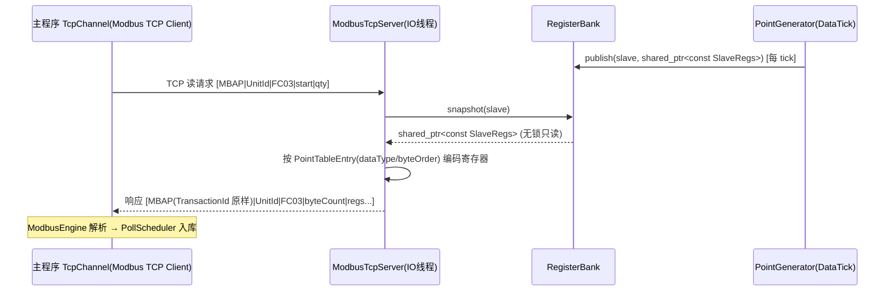
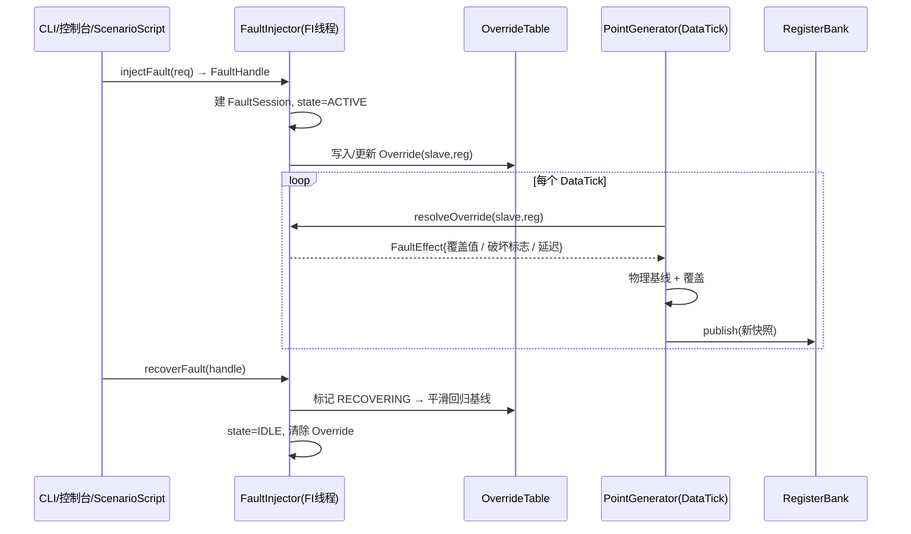
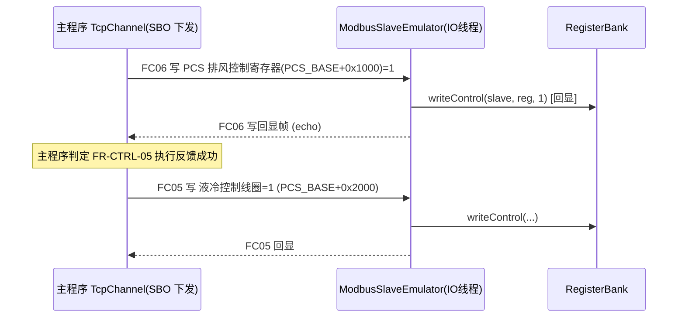
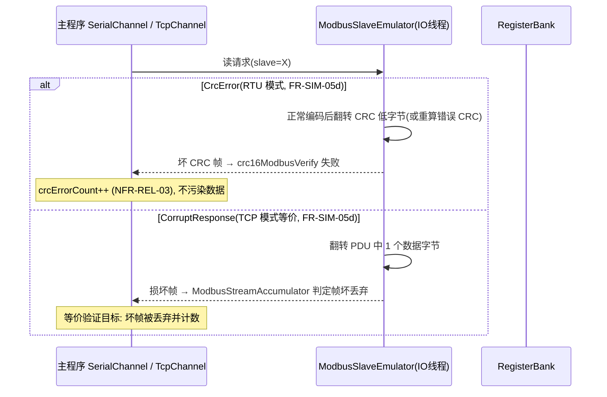
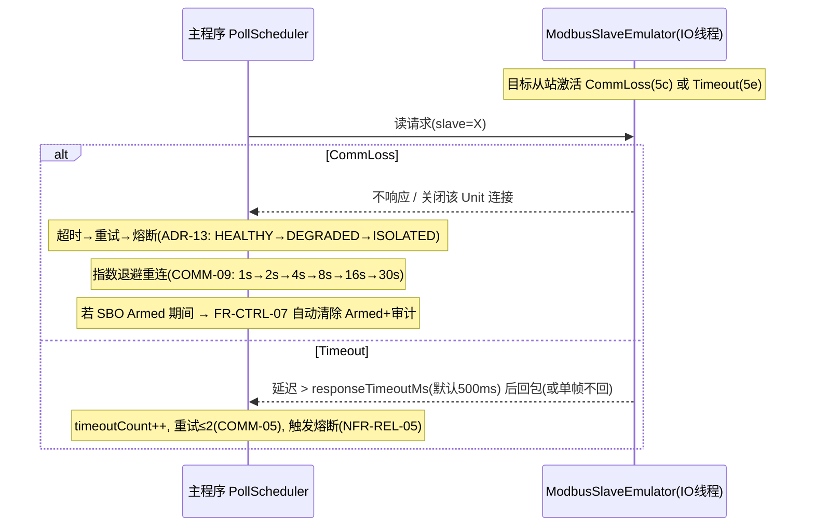
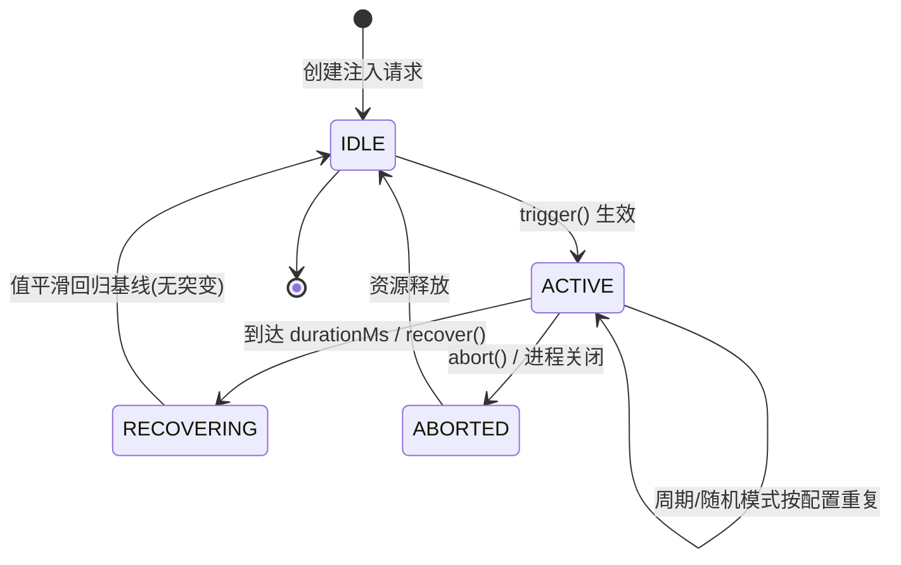

# ENS-LLD-SIM 《设备模拟与故障注入模块 详细设计说明书》

> 文档编号：ENS-LLD-SIM ｜ 版本：V1.1 ｜ 所属架构层级：独立进程（7xx 段，功能模块 ⑦ 设备模拟器）｜ 对应工程：`device_simulator`（Qt GUI EXECUTABLE）；内部 `src/sim/` 引擎模块（纯 C++17，零 Qt）；`ens_app` 为单仓库内独立工程（经 Modbus TCP 5020 + Modbus RTU 虚拟串口双链路对话）
> 构建类型：STATIC + EXECUTABLE ｜ 核心负责类：`SimulatorEngine` ｜ 关联 ADR：ADR-SIM-01~05（HLD-SIM §11）、ADR-LLD-18（RCU 快照）

---

## 0. 文档导读与可追溯性声明

- 本册是 **ENS-HLD-SIM《设备模拟与故障注入设计说明》** 的直接落地细化，所有章节均可在 HLD-SIM 找到对应骨架（见 **附录 A：与 HLD-SIM 章节映射**）。
- 本册严格遵循 **ENS-LLD-000 §2 标准模板**（7 个强制章节），未删除任何章节；因测试台含多类协同对象，额外补充 **附录 A / B** 用于追溯与 ADR 落地说明。
- 编号规则遵循 ENS-LLD-000 §3：`7xx` 段映射"设备模拟器（独立进程）"，本文档编号 `ENS-LLD-SIM` 属该段（用户指定文件名，全局唯一）。
- 关联 SRS 需求：FR-SIM-01~09、NFR-TEST-01~03；关联主程序需求：FR-AL-01~13、FR-CTRL-07、COMM-03/09/12/13、NFR-REL-02/03/05、ADR-13、FR-DG-02、FR-OV-04。
- **零改动接入铁律**：主程序通信栈（`IChannel` / `ModbusEngine` / `PollScheduler`）不新增任何分支即可直连本测试台（FR-SIM-09 / NFR-TEST-03）。

---

## 1. 模块概述

### 1.1 职责边界

- **做什么**：在独立进程 `DeviceSimulator`（纯 Qt 5.15 Widgets GUI 应用）中，**模拟整站储能设备的全部 Modbus 寄存器**——BMS（16 簇 × 簇级 + 640 单体电压/温度）、PCS（4 台）、关口电表、液冷/消防辅机；按物理规律持续演化寄存器值；按指令**注入五类故障**（过温 / 电压异常 / 断链 / CRC 错误 / 响应超时）；通过 **Modbus TCP 监听**或**虚拟串口 RTU 从站**把数据/故障暴露给主程序，使主程序以标准 `TcpChannel`/`SerialChannel` 零改动轮询。
- **不做什么**：**不消费、不依赖主程序任何内部状态**（NFR-TEST-03 单向解耦）；不实现告警判定、SBO 状态机、持久化等业务逻辑——这些均由主程序在被测路径上完成，本模块仅提供"刺激源"。

### 1.2 在架构中的位置与上下游依赖

| 维度 | 说明 |
|------|------|
| 架构归属 | 独立进程 / 功能模块 ⑦ 设备模拟器（不属于主程序五层之一，逻辑上位于主程序 `L1 通信接入层` 的**对侧**——即"被轮询的设备侧"） |
| 对主程序依赖 | **仅**通过统一的字节流契约：主程序 `IChannel`（TCP Client / Serial）↔ 本模块 `ISlaveTransport`（TCP Server / RTU Slave）。主程序完全无感知 |
| 内部模块依赖 | `ens::protocol::PointTableEntry`（复用 ICD §7.1，保证字节级一致）；`device_simulator/src/sim` 内部自洽，无外部业务库依赖 |
| 形态 | 纯 GUI 应用 `DeviceSimulator`（Qt 5.15 Widgets，FR-SIM-10）；`src/sim` 引擎模块内聚于 `device_simulator` 工程，不单独成库、无 headless 入口；与上位机 `ens_app` 为单仓库两独立工程，经 Modbus TCP（5020，承载 BMS/PCS/电表）+ Modbus RTU 虚拟串口（承载液冷/消防辅机）**双链路同时对话**，完美镜像主程序双栈部署（FR-SIM-09） |

### 1.3 关联需求与 HLD 章节

| 需求 / 设计项 | 本模块落点 | HLD-SIM 对应 |
|--------------|-----------|--------------|
| FR-SIM-01（独立进程）/ FR-SIM-08（内部模块，无 headless） | §2 类图、`SimulatorEngine`、`src/sim` | §2.2, §2.5 |
| FR-SIM-02（多设备规模）/ FR-SIM-07（参数可配） | `SimConfig`、`SlaveSpec` | §3.2, §7.1 |
| FR-SIM-03（字节级一致）/ FR-SIM-04（物理规律） | `PointGenerator`、`PointTableEntry` 复用 | §3.1, §3.8 |
| FR-SIM-05a~e（五类故障） | `FaultInjector`、`FaultSession` | §5.1~5.4 |
| FR-SIM-06（脚本化）/ FR-SIM-09（TCP 回环零改动） | `ScenarioScript`、`ModbusTcpServer` | §4.1, §7.2 |
| NFR-TEST-01/02/03 | `seed`/日志导出/单向解耦 | §8 |
| 主程序验证（FR-AL / FR-CTRL-07 / COMM-12-13 / NFR-REL-03） | §7 自动化驱动方案 | §9.2 |

---

## 2. 类图设计（Class Diagram）

### 2.1 类结构总览（Mermaid classDiagram）

```mermaid
classDiagram
    class SimulatorEngine {
        +SimConfig config
        -RegisterBank* bank
        -PointGenerator* gen
        -ModbusSlaveEmulator* slave
        -FaultInjector* injector
        -ScenarioScript* scenario
        +start() bool
        +stop() noexcept
        +loadScenario(path string) bool
        +injectFault(req FaultRequest) FaultHandle
        +recoverFault(h FaultHandle) bool
        +abortFault(h FaultHandle) bool
    }

    class PointGenerator {
        -std::mt19937 rng
        -PhysicsParams phys
        -uint32_t tickMs
        +generateTick(Builder& b) noexcept
        -evolveBms(SlaveRegs& r, float dtS)
        -evolvePcs(SlaveRegs& r, float dtS)
        -evolveMeter(SlaveRegs& r, float dtS)
        -evolveAux(SlaveRegs& r, float dtS)
    }

    class FaultInjector {
        -OverrideTable table
        -std::vector~FaultSession~ sessions
        +resolveOverride(slave uint8, reg uint16) FaultEffect
        +trigger(req FaultRequest) FaultHandle
        +recover(h FaultHandle) bool
        +abort(h FaultHandle) bool
        -tickSessions(dtMs uint32) noexcept
    }

    class ModbusSlaveEmulator {
        -vector~unique_ptr~ISlaveTransport~~ transports   // TCP 监听 + RTU 从站同时启用
        -RegisterBank* bank
        -FaultInjector* injector
        +start() bool
        +stop() noexcept
        -onRequest(frame Frame) Frame
        -buildReadResponse(slave, fc, start, qty) Frame
        -buildWriteEcho(slave, fc, start, vals) Frame
        -buildCorruptFrame(src Frame) Frame
    }

    class RegisterBank {
        -unordered_map~uint8, shared_ptr~const SlaveRegs~~ banks
        -shared_mutex rw
        +snapshot(slave uint8) shared_ptr~const SlaveRegs~
        +publish(slave uint8, next shared_ptr~const SlaveRegs~) noexcept
        +readControl(slave, reg) uint16
        +writeControl(slave, reg, v uint16) noexcept
    }

    class ScenarioScript {
        +name string
        +steps vector~Step~
        +load(path string) bool
        +schedule(injector FaultInjector*) bool
        -playLoop()
    }

    class SimConfig {
        +tcp TcpEndpoint          // {enabled:true, bindIp:"127.0.0.1", port:5020}
        +rtu RtuEndpoint          // {enabled:true, port:"COM4", baudRate:115200}
        +tickMs uint32
        +seed uint32
        +exportLogPath string
        +slaves vector~SlaveSpec~   // 每项含 transport:tcp/rtu 链路归属
        +pointtablePath string
        +load(path string) bool
    }

    class SlaveSpec {
        +slaveId uint8
        +kind DeviceKind           // BMS / PCS / METER / AUX
        +transport Transport       // tcp / rtu 链路归属（决定暴露到哪条传输层）
        +regCount uint16
    }

    class ISlaveTransport {
        <<interface>>
        +open() bool
        +close() noexcept
        +setRequestHandler(cb function)
        +isOpen() bool const
    }

    class ModbusTcpServer {
        -QTcpServer* srv
        -uint16 port
        -string bindIp
        +open() bool
        +close() noexcept
    }

    class RtuSlavePort {
        -QSerialPort* port
        -string dev
        -uint32 baud
        +open() bool
        +close() noexcept
    }

    class FaultSession {
        -FaultHandle id
        -FaultType type
        -FaultState state
        -FaultOverride ov
        -int64_t remainMs
        +trigger() noexcept
        +recover() noexcept
        +abort() noexcept
        -transition(dtMs uint32) noexcept
    }

    class SlaveRegs {
        +uint8_t slaveId
        +vector~uint16_t~ holding
        +vector~uint16_t~ input
        +vector~uint8_t~ coils
        +vector~uint8_t~ discretes
        +getHolding(reg uint16) uint16 const
        +setHolding(reg uint16, v uint16) noexcept
    }

    SimulatorEngine *-- RegisterBank
    SimulatorEngine *-- PointGenerator
    SimulatorEngine *-- ModbusSlaveEmulator
    SimulatorEngine *-- FaultInjector
    SimulatorEngine *-- ScenarioScript
    SimulatorEngine *-- SimConfig
    ModbusSlaveEmulator *-- ISlaveTransport
    ISlaveTransport <|.. ModbusTcpServer
    ISlaveTransport <|.. RtuSlavePort
    RegisterBank o-- SlaveRegs
    FaultInjector o-- FaultSession
    PointGenerator ..> RegisterBank : 经 Builder publish
    ModbusSlaveEmulator ..> RegisterBank : snapshot 只读
    FaultInjector ..> PointGenerator : resolveOverride 覆盖
    ScenarioScript ..> FaultInjector : trigger/recover
```

### 2.2 关键类职责与公开接口

#### 2.2.1 `SimulatorEngine`（编排者）

- 持有并生命周期管理全部子对象；`start()` 按 ENS-CONC-001 §1.5 顺序启动（DataTick → Slave IO → FaultInjector），`stop()` 逆序优雅关闭。
- 暴露给 GUI 的统一命令入口：`injectFault` / `recoverFault` / `abortFault` / `loadScenario`（GUI 经 Qt 信号投送到引擎线程）。

#### 2.2.2 `PointGenerator`（物理演化器）

- 每个 DataTick 遍历全部从站，按 HLD-SIM §3.8 物理模型推进寄存器，并调用 `FaultInjector::resolveOverride` 叠加故障，最后通过 `RegisterBank::publish` 发布新快照。
- `rng` 以 `SimConfig::seed` 构造（NFR-TEST-01 确定性）：同一 `seed` + 同一脚本 → 同一演化序列。

#### 2.2.3 `FaultInjector`（故障注入调度）

- 维护全局 `OverrideTable`（按 `slave→reg` 索引的覆盖项）。
- `resolveOverride(slave, reg)` 被 `PointGenerator` 每 tick 调用，返回该寄存器当前应施加的 `FaultEffect`（覆盖值 / 破坏标志 / 延迟毫秒）。
- 单次/周期/随机/脚本化四模式的状态机由 `FaultSession` 承载（见 §3.2）。

#### 2.2.4 `ModbusSlaveEmulator` + `ISlaveTransport`（通信层）

- 被动响应方，不主动推送。`ISlaveTransport` 为抽象接口，两个实现：`ModbusTcpServer`（TCP 监听 + MBAP 路由，承载 BMS/PCS/电表）、`RtuSlavePort`（虚拟串口 RTU 从站，承载液冷/消防辅机）。**两条链路同时启用**，`ModbusSlaveEmulator` 持有一组 `ISlaveTransport`（而非单个），各自独立 `open()` 并共用同一 `RegisterBank` 后端。
- **链路归属路由**：每个从站在 `SlaveSpec.transport` 中声明归属 `tcp` 或 `rtu`；测试台据此把该从站暴露到对应传输层。主程序侧按 `channels.json` 分通道轮询（TCP 通道轮询 BMS/PCS/电表、RTU 通道轮询辅机），对测试台而言只是"两个标准 Modbus 从站端点"。
- 请求到达 → `snapshot(slave)` 取只读快照 → 按 `PointTableEntry` 的 `dataType/byteOrder` 编码响应（TCP 加 MBAP、RTU 加 CRC-16）→ 写回。故障短路（断链/超时/CRC 破坏）在 `onRequest` 内判定（见 §3.3、§4.3）。

#### 2.2.5 `RegisterBank`（RCU 快照库）

- 采用与主程序 `L1SnapshotStore` 一致的 **RCU 模式**（ADR-LLD-18：`shared_ptr<const>` 原子替换）。
- `snapshot()` 读侧无锁（`shared_lock`）；`publish()` 写侧极短 `unique_lock`。IO 线程高频读永不阻塞生成线程写。

#### 2.2.6 `ScenarioScript`（脚本化驱动）

- 解析 HLD-SIM §7.2 的 JSON 场景，将 `steps[]` 按时间戳 `t` 排入调度队列，驱动 `FaultInjector`。执行过程产出机器可读 JSON 日志（NFR-TEST-02）。

#### 2.2.7 `SimConfig`（配置）

- 加载 `simconfig.json`（HLD-SIM §7.1），缺省值内置；文件缺失/损坏时回退默认并记日志（见 §6.1）。

---

## 3. 核心时序 / 状态机图

### 3.1 正常轮询响应时序（主程序零改动接入）



> 主程序侧完全无感知：上述路径与轮询真实设备字节级等价（FR-SIM-09 / COMM-12/13）。**TCP 通道（BMS/PCS/电表）与 RTU 通道（液冷/消防辅机）共用同一 `RegisterBank` 快照**，差异仅在传输层封装（MBAP vs CRC-16），请求解析与响应编码逻辑完全一致。

### 3.2 故障注入作用时序



### 3.3 SBO 写回显时序（验证 FR-CTRL 全链路）



> 控制寄存器地址 `PCS_BASE+0x1000` / `+0x2000` 与 ICD §7.x SBO 示例逐字节一致（HLD-SIM §3.5），确保主程序 SBO 下发能被正确回显，进而验证含 FR-CTRL-07 断线分支的全链路。

### 3.4 坏帧注入时序（CRC 错误 / 响应破坏）



### 3.5 断链 / 超时模拟时序（验证 COMM-09 / ADR-13 / FR-CTRL-07）



### 3.6 `FaultSession` 状态机（HLD-SIM §5.1）



| 状态 | 对寄存器的影响 | 主程序可观测 |
|------|---------------|-------------|
| IDLE | 正常物理演化 | — |
| ACTIVE | 覆盖表对目标寄存器施加故障值/破坏响应 | 告警/熔断/重连 等 |
| RECOVERING | 故障值按斜率平滑回归基线（避免误告警抖动，呼应 FR-AL-03 迟滞） | 告警自动复归 |
| ABORTED | 立即清除覆盖项，回到正常 | — |

---

## 4. 关键 API 与结构体定义（C++17 类型约束）

### 4.1 点表数据结构（与 ICD 严格对齐）

**直接复用 ENS-ICD-001 §7.1 的 `PointTableEntry`**，测试台与主程序加载同一份 `pointtable.json`，保证逐字段一致（HLD-SIM §3.1）。定义见于 `ens::protocol` 命名空间，本模块 `#include` 引用，**不重新定义**：

```cpp
namespace ens::protocol {
enum class RegisterType : uint8_t { Coil = 0, DiscreteInput = 1, HoldingRegister = 2, InputRegister = 3 };
enum class DataType     : uint8_t { Bool = 0, Int16 = 1, Uint16 = 2, Int32 = 3, Float32 = 4, Float64 = 5 };
enum class ByteOrder    : uint8_t { ABCD = 0, BADC = 1, CDAB = 2, DCBA = 3 };

struct PointTableEntry {
    uint32_t     pointId;
    std::string  pointName;
    uint32_t     linkId;
    uint8_t      slaveAddress;
    RegisterType regType;
    uint16_t     registerAddr;
    DataType     dataType;
    ByteOrder    byteOrder;
    float        scaleFactor;
    float        offset;
    std::string  unit;
    uint32_t     pollIntervalMs;
    uint8_t      priority;
    bool         enabled;
};

// 工程值口径: 工程值 = 寄存器原始值 × scaleFactor + offset  (ICD §7.1)
float toEngineering(uint16_t raw, const PointTableEntry& e) noexcept;
uint16_t fromEngineering(float eng, const PointTableEntry& e) noexcept;
}
```

> **字节级一致性验收**：测试台写入寄存器 `raw` 后，主程序 `PointTable::resolve` 解析出的工程值 = 测试台设定的物理值（缩放精度内）。任何一侧不得擅自改 `scaleFactor`/`byteOrder`/`dataType`。

### 4.2 每从站寄存器镜像 `SlaveRegs`（RCU 载体）

热路径不要求对单寄存器原子读写——因 IO 线程持有的是 `shared_ptr<const SlaveRegs>` 只读快照，天然无撕裂读。故 `SlaveRegs` 本身无需 `alignas(16)`；编码用的**临时线缓冲** `WireFrame` 才标 `ENS_CACHE_ALIGN`（满足 LLD-000 §2.1 强制约束）：

```cpp
// sim/SlaveRegs.h
struct SlaveRegs {
    uint8_t               slaveId = 0;
    std::vector<uint16_t> holding;    // [registerAddr] 保持寄存器（按寄存器地址索引）
    std::vector<uint16_t> input;      // [registerAddr] 输入寄存器
    std::vector<uint8_t>  coils;      // [registerAddr/8] 线圈
    std::vector<uint8_t>  discretes;  // [registerAddr/8] 离散输入

    uint16_t getHolding(uint16_t reg) const noexcept {
        return (reg < holding.size()) ? holding[reg] : 0;
    }
    void setHolding(uint16_t reg, uint16_t v) noexcept {
        if (reg < holding.size()) holding[reg] = v;
    }
};

// 线缓冲（热路径编码用，标对齐以满足 LLD-000 §2.1 强制约束）
#if defined(_MSC_VER)
    #define ENS_CACHE_ALIGN __declspec(align(16))
#elif defined(__GNUC__) || defined(__clang__)
    #define ENS_CACHE_ALIGN __attribute__((aligned(16)))
#else
    #define ENS_CACHE_ALIGN alignas(16)
#endif

struct ENS_CACHE_ALIGN WireFrame {
    std::array<uint8_t, 300> buf{};   // MBAP+PDU 暂存，足够覆盖常见读请求
    size_t len = 0;
};
static_assert(sizeof(WireFrame) % 16 == 0, "WireFrame must be 16-byte aligned");
```

> **寄存器地址作用域说明（避免误读）**：寄存器地址是**从站作用域**内的偏移。`PCS_BASE+0x1000` 表示"该 PCS 从站内部寄存器 0x3000"，与"关口电表从站 21 内部寄存器 0x3000"分属不同 `slaveId`，经 MBAP `Unit ID` / RTU 首字节路由，**不冲突**（HLD-SIM §3.5 / §4.2）。各从站 `holding` 向量按其自身最大寄存器地址 +1 定容（BMS≈0x510、PCS≈0x4001、电表≈0x0E、辅机较小）。

### 4.3 故障覆盖结构 `FaultOverride` / `FaultEffect`

```cpp
namespace ens::sim {
enum class FaultType  : uint8_t { OverTemp = 0, CellVoltage = 1, CommLoss = 2, CrcError = 3, Timeout = 4 };
enum class Scope      : uint8_t { ALL = 0, SLAVE = 1, POINT = 2 };
enum class FaultState : uint8_t { IDLE = 0, ACTIVE = 1, RECOVERING = 2, ABORTED = 3 };

struct FaultOverride {
    FaultType type;
    Scope     scope;
    uint8_t   slave = 0;        // scope != ALL 有效
    uint16_t  reg   = 0;        // scope == POINT 有效
    float     targetValue = 0;  // 越限值 / 目标温度
    float     rampRate    = 0;  // ℃/s 或 V/s 上升速率
    int32_t   corruptMs   = 0;  // 超时/延迟毫秒
    int32_t   durationMs  = 0;  // 持续时长
};

struct FaultEffect {
    bool  active      = false;  // 是否对该寄存器施加覆盖
    float value       = 0;       // 覆盖后的物理值
    bool  corruptCrc  = false;   // RTU: 坏 CRC
    bool  corruptByte = false;   // TCP: 破坏 PDU 字节
    bool  dropLink    = false;   // 不响应 / 关连接
    int32_t delayMs   = 0;        // 响应延迟
};
}
```

### 4.4 关键类头文件声明（带 noexcept / const / override）

```cpp
// sim/RegisterBank.h
namespace ens::sim {
class RegisterBank {
public:
    std::shared_ptr<const SlaveRegs> snapshot(uint8_t slave) const;          // 无锁读
    void publish(uint8_t slave, std::shared_ptr<const SlaveRegs> next) noexcept; // 极短写锁
    uint16_t readControl(uint8_t slave, uint16_t reg) const noexcept;
    void     writeControl(uint8_t slave, uint16_t reg, uint16_t v) noexcept;  // SBO 回显
private:
    std::unordered_map<uint8_t, std::shared_ptr<const SlaveRegs>> m_banks;
    mutable std::shared_mutex m_rw;
};
}

// sim/ISlaveTransport.h
namespace ens::sim {
class ISlaveTransport {                                  // <<interface>>
public:
    virtual ~ISlaveTransport() = default;
    virtual bool open() = 0;
    virtual void close() noexcept = 0;
    virtual bool isOpen() const noexcept = 0;
    using RequestHandler = std::function<WireFrame(const WireFrame&)>;
    virtual void setRequestHandler(RequestHandler cb) = 0;
};

// sim/ModbusTcpServer.h
class ModbusTcpServer : public ISlaveTransport {
public:
    explicit ModbusTcpServer(std::string ip, uint16_t port, RegisterBank* bank, FaultInjector* fi);
    bool open() override;
    void close() noexcept override;
    bool isOpen() const noexcept override;
    void setRequestHandler(RequestHandler cb) override;
private:
    QTcpServer* m_srv = nullptr;
};

// sim/RtuSlavePort.h
class RtuSlavePort : public ISlaveTransport {
public:
    explicit RtuSlavePort(std::string dev, uint32_t baud, RegisterBank* bank, FaultInjector* fi);
    bool open() override;
    void close() noexcept override;
    bool isOpen() const noexcept override;
    void setRequestHandler(RequestHandler cb) override;
private:
    QSerialPort* m_port = nullptr;
};

// sim/ModbusSlaveEmulator.h —— 同时管理 TCP 监听 + RTU 从站，共用同一 RegisterBank
class ModbusSlaveEmulator {
public:
    explicit ModbusSlaveEmulator(RegisterBank* bank, FaultInjector* fi);
    bool start(const SimConfig& cfg);                 // 依 cfg.tcp/rtu.enabled 分别 open 两条链路
    void stop() noexcept;
private:
    std::vector<std::unique_ptr<ISlaveTransport>> m_transports;  // [TcpServer?, RtuSlavePort?]
    RegisterBank* m_bank;
    FaultInjector* m_fi;
};

// sim/SimConfig.h —— 双端点 + 每从站链路归属
struct SlaveSpec {
    uint8_t    slaveId;
    DeviceKind kind;        // BMS / PCS / METER / AUX
    Transport  transport;   // tcp / rtu —— 决定暴露到哪条链路
    uint16_t   regCount;
};
struct TcpEndpoint  { bool enabled = true;  std::string bindIp = "127.0.0.1"; uint16_t port = 5020; };
struct RtuEndpoint  { bool enabled = true;  std::string dev = "COM4";         uint32_t baudRate = 115200; };
struct SimConfig {
    TcpEndpoint  tcp;
    RtuEndpoint  rtu;
    uint32_t     tickMs = 100;
    uint32_t     seed = 0;
    std::string  exportLogPath;
    std::vector<SlaveSpec> slaves;
    std::string  pointtablePath = "config/pointtable.json";
    bool load(const std::string& path);
};

// sim/FaultInjector.h
namespace ens::sim {
class FaultInjector {
public:
    FaultEffect      resolveOverride(uint8_t slave, uint16_t reg) const;     // PointGenerator 每 tick 调用
    FaultHandle      trigger(const FaultRequest& req);
    bool             recover(FaultHandle h) noexcept;
    bool             abort(FaultHandle h) noexcept;
    void             tickSessions(uint32_t dtMs) noexcept;                   // FI 线程驱动
private:
    OverrideTable m_table;
    std::vector<FaultSession> m_sessions;
};
}
```

### 4.5 关键函数伪代码

#### 4.5.1 正常读响应构建 `buildReadResponse`（FC03/04）

```
function buildReadResponse(slave, fc, start, qty) -> Frame:
    snap = bank.snapshot(slave)                 // 无锁只读快照
    if snap == null: return ExceptionResponse(slave, fc, ILLEGAL_DATA_ADDR)
    out = WireFrame()
    out.buf[0] = slave
    out.buf[1] = fc
    out.buf[2] = qty * 2                         // byteCount
    idx = 3
    for i in [0, qty):
        reg = start + i
        raw = snap.getHolding(reg)              // 故障覆盖已随生成线程 publish 生效
        out.buf[idx..idx+1] = encodeUInt16BE(raw)   // Modbus 大端
        idx += 2
    out.len = idx
    return out
```

> 故障值（如过温后的最高温度、越限单体电压、告警字 bit 置位）已包含在 `snap` 中——因为 `PointGenerator` 生成快照时调用 `resolveOverride` 叠加过（见 §4.5.2）。IO 线程只负责"当前快照值 → 字节"，**不感知故障逻辑**（职责单一，HLD-SIM §6.1）。

#### 4.5.2 数据生成 tick + 故障覆盖 `PointGenerator::generateTick`

```
function generateTick(builder):
    dtS = tickMs / 1000.0
    for each slave in config.slaves:
        regs = builder.beginSlave(slave.id)      // 取上一快照可变副本
        switch slave.kind:
            BMS:  evolveBms(regs, dtS)
            PCS:  evolvePcs(regs, dtS)
            METER: evolveMeter(regs, dtS)
            AUX:  evolveAux(regs, dtS)
        // 叠加故障覆盖
        for reg in regs.holding touched by this slave:
            eff = injector.resolveOverride(slave.id, reg)
            if eff.active:
                if eff.dropLink: continue         // 断链由 IO 线程处理, 此处不写
                regs.setHolding(reg, fromEngineering(eff.value, entryOf(slave,reg)))
                // 过温时同步置位告警字 bit0 (HLD-SIM §3.3.1)
                if eff.type == OverTemp: setAlarmBit(regs, 0)
                if eff.type == CellVoltage: setAlarmBit(regs, 1 or 2)
        builder.publish(slave.id, regs)           // → RegisterBank.publish (RCU)
```

#### 4.5.3 故障状态机转移 `FaultSession::transition`

```
function transition(dtMs):
    switch state:
        IDLE:        return
        ACTIVE:
            if mode == Once and elapsed >= durationMs:
                state = RECOVERING
            elif mode == Periodic:
                cycleClock += dtMs
                if cycleClock >= onMs+offMs: cycleClock -= (onMs+offMs)  // 循环
                // ACTIVE 持续 onMs, 然后由 RECOVERING offMs
                if cycleClock >= onMs: state = RECOVERING
            // Random / Scripted 由调度器调用 recover()
        RECOVERING:
            rampValueTowardBaseline(rampRate * dtMs)   // 平滑回归
            if |current - baseline| < eps:
                clearOverride(); state = IDLE
        ABORTED:
            clearOverride(); state = IDLE
```

#### 4.5.4 CRC 错误帧构造 `buildCorruptFrame`

```
function buildCorruptFrame(src Frame) -> Frame:
    out = src
    if transport == RTU:
        // 正常 CRC 已在 buildReadResponse 后追加(低字节在前)
        // 翻转 CRC 低字节 → crc16ModbusVerify 必然失败
        crcLoPos = out.len - 2
        out.buf[crcLoPos] ^= 0xFF
    else: // TCP: 无 CRC, 改为破坏 PDU 中 1 个数据字节
        // 翻转第一个数据寄存器高位字节
        corruptPos = 3 + 2   // 跳过 unitId+fc+byteCount 后的首数据字节
        out.buf[corruptPos] ^= 0xFF
    return out
```

> CRC 算法须与主程序 `crc16ModbusVerify` 完全一致（多项式 `0xA001`，初值 `0xFFFF`，低字节在前），确保被主程序判定为损坏而非误判正常：

```cpp
uint16_t crc16Modbus(const uint8_t* data, size_t len) noexcept {
    uint16_t crc = 0xFFFF;
    for (size_t i = 0; i < len; ++i) {
        crc ^= data[i];
        for (int b = 0; b < 8; ++b) {
            const uint16_t lsb = crc & 0x0001u;
            crc >>= 1;
            if (lsb) crc ^= 0xA001u;
        }
    }
    return crc; // 线上: lo = crc & 0xFF, hi = crc >> 8
}
```

#### 4.5.5 断链 / 超时模拟（IO 线程短路）

```
function onRequest(frame):
    slave = frame.unitId
    eff = injector.resolveOverride(slave, /*scope级*/ 0xFFFF)  // 取该从站级故障
    if eff.dropLink:
        if transport == RTU: return NOTHING          // 丢弃请求, 不响应
        else:               closeConnection(slave)   // TCP 关闭该 Unit 连接
        return NOTHING
    if eff.delayMs > 0:
        scheduleResponseLater(bind(onRequestNormal, frame), eff.delayMs)  // 超时注入
        return NOTHING
    resp = onRequestNormal(frame)
    if eff.corruptCrc or eff.corruptByte:
        resp = buildCorruptFrame(resp)
    return resp
```

---

## 5. 线程与并发模型

### 5.1 线程拓扑（与 ENS-CONC-001 一致）

| 线程 | 优先级 | 职责 | 锁策略 | 最大延迟 |
|------|--------|------|--------|---------|
| 控制台/事件线程 | NORMAL | Qt GUI 事件循环（QApplication）、接收注入命令 | 无（命令经信号/队列投给 FI 线程） | 人机可接受 |
| 数据生成线程 `DataTick` | HIGH | 按步长演化全部从站寄存器 + 叠加故障覆盖 | 仅 `publish` 时 `shared_mutex` 写锁（极短） | tick 间隔（默认 100ms） |
| 从站 IO 线程 `Slave IO` | HIGHEST | TCP 监听 / 接受连接 / 处理读请求；RTU 串口读写 | 读侧 `snapshot()` 无锁 | 响应构造 < 1ms |
| 故障注入调度线程 `FaultInjector` | NORMAL | 管理 `FaultSession` 状态机、定时器触发/恢复 | 仅更新 `OverrideTable`（短锁/原子） | 定时器精度 ~10ms |

### 5.2 同步原语与跨线程通信

- **`RegisterBank` RCU**：生成线程写（`publish` → `unique_lock` + `shared_ptr` 替换），IO 线程读（`snapshot` → `shared_lock`）。旧快照在最后一个持有者释放后自动析构，无显式锁竞争。
- **`OverrideTable`**：`FaultInjector` 写、`PointGenerator` 读。用 `std::shared_mutex` 或 `QReadWriteLock` 保护；`resolveOverride` 读侧加读锁（极短，仅查表）。为降低锁争用，可在 FI 线程批量提交快照式更新（写时整体替换 `shared_ptr<const OverrideTable>`），读侧无锁——与本模块 RCU 思路统一。
- **命令投递**：控制台线程 → FI 线程用 `QMetaObject::invokeMethod(..., Qt::QueuedConnection)` 或 `std::async` + 线程安全队列，避免跨线程直接调对象。
- **禁止项**（对齐 ADR-22 / LLD-000 §2.1）：IO 线程与工作线程**绝不**直接操作任何 UI 控件；本模块为纯引擎（无 UI），由 GUI 启动器消费 RCU 快照并仅做命令转发（NFR-TEST-04）。

### 5.3 生命周期与优雅关闭（ENS-CONC-001 §1.5）

```
SimulatorEngine::start():
    gen.start(tickMs)          // 起 DataTick(HIGH)
    slave.start()              // 起 Slave IO(HIGHEST) + 监听
    injector.start()           // 起 FI 线程(NORMAL)
    return enterEventLoop()    // Qt GUI 事件循环

SimulatorEngine::stop() noexcept:   // 逆序
    injector.stop()            // 先停故障注入
    slave.stop()               // 关监听 socket / 串口
    gen.stop()                 // 最后停生成线程
    bank.clear()               // 释放 RegisterBank
```

---

## 6. 异常处理与边界路径

### 6.1 配置与启动边界

| 异常分支 | 触发条件 | 恢复策略 |
|----------|---------|---------|
| `simconfig.json` 缺失 | 文件不存在 | 回退内置默认配置；记 `WARN` 日志；正常启动（NFR-MAINT-03 兜底） |
| `simconfig.json` 解析失败 | JSON 语法错 | 记 `ERROR` + 行号；回退默认；**不崩溃** |
| `pointtable.json` 缺失 | 与主程序共用点表未找到 | 仍可用内置寄存器映射（HLD-SIM §3）启动；告警提示"点表不一致风险" |
| TCP 端口被占用 | `bind()` 失败（如 5020 已被占） | 尝试 `port+1` 重试至多 3 次；仍失败则 `ERROR` 退出并给出提示 |
| 虚拟串口不存在 | com0com/socat 未就绪 | `RtuSlavePort::open()` 返回 false；记 `ERROR`；建议切 TCP 模式 |
| `seed` 越界 | 非 0/合法值 | `std::mt19937` 接受 `uint32`，越界自动取模，不影响确定性 |

### 6.2 运行期边界

| 异常分支 | 触发条件 | 恢复策略 |
|----------|---------|---------|
| 寄存器越界访问 | `reg >= holding.size()` | `getHolding` 返回 0；`setHolding` 静默忽略（不抛异常，不崩） |
| 未知 Unit ID | 主程序请求未在 `SimConfig.slaves` 的从站 | 返回 Modbus 异常响应 `ILLEGAL_DATA_ADDR`，不关闭连接 |
| 生成线程异常 | 物理模型计算出 NaN/Inf | `PointGenerator` 每 tick 用 `try-catch` 包裹（对齐 ENS-CONC-001 §1.6 `SafeWorker`）；异常时该从站值保持上一帧，记 `ERROR` |
| IO 线程写失败 | socket 已断开 | `write()` 返回错误 → 关闭该连接；不影响其他连接（故障隔离） |
| 故障表并发写 | FI 写 / 生成读竞态 | RCU 快照式替换，读侧无锁，杜绝数据竞争 |
| 进程关闭信号 | SIGINT / 退出 | `stop()` 优雅逆序关闭；所有线程 `join` 后释放（`RAII` 守卫资源） |

### 6.3 RAII 守卫要求

- 所有句柄（`QTcpServer` / `QSerialPort` / 线程对象）由智能指针或栈对象持有，析构自动释放。
- `RegisterBank` 的 `shared_ptr<const>` 快照在请求处理上下文结束即释放，不跨请求长期持有。
- 配置加载失败不得留下半初始化状态：`SimConfig::load` 采用"先解析到临时对象，成功再 `std::swap`"的提交式写法。

---

## 7. 单元测试策略

### 7.1 测试框架与 Mock 策略

- 框架：**GoogleTest**（主）/ 可选 QtTest 做信号槽验证。
- Mock：对 `ISlaveTransport` 提供 `MockTransport`，使 `PointGenerator` / `FaultInjector` / `RegisterBank` 可在**无真实 socket/串口**下单测（引擎纯 C++17，便于隔离测试，NFR-TEST-04）。
- 仿真确定性：单测固定 `seed`，断言演化序列可复现（NFR-TEST-01）。

### 7.2 关键用例清单

| 用例 ID | 验证点 | 输入 | 期望 |
|---------|--------|------|------|
| UT-SIM-01 | 点表字节级一致 | 写入 `raw=3700`（scale 0.001）于单体电压寄存器 | 主程序口径工程值 = 3.700 V（对齐 `toEngineering`） |
| UT-SIM-02 | 物理演化单调 | 放电电流 > 0，tick 100 次 | SOC 单调下降、温度随 I²R 上升 |
| UT-SIM-03 | CRC 算法一致 | `crc16Modbus` 对任意帧 | 与主程序 `crc16ModbusVerify` 互逆 |
| UT-SIM-04 | 过温注入 | `injectFault(OverTemp, slave=3, target=65)` | 该簇最高温度寄存器上升、告警字 bit0 置位 |
| UT-SIM-05 | 电压异常 | `injectFault(CellVoltage, slave=3, reg=0x10, cell=12, target=2.4)` | 第 12 单体电压寄存器越限 |
| UT-SIM-06 | 断链注入 | `injectFault(CommLoss, slave=5)` | `onRequest` 对该从站返回空（连接关闭/丢弃） |
| UT-SIM-07 | CRC 错误帧 | `buildCorruptFrame(rtuFrame)` | 翻转后 `crc16ModbusVerify` 失败 |
| UT-SIM-08 | 响应破坏(TCP) | `buildCorruptFrame(tcpFrame)` | PDU 字节被翻转，主程序解析丢弃 |
| UT-SIM-09 | 超时注入 | `injectFault(Timeout, slave=7, corruptMs=800)` | 响应延迟 ≥ 800ms |
| UT-SIM-10 | 状态机转移 | 单次模式 `trigger→recover` | IDLE→ACTIVE→RECOVERING→IDLE；平滑回归 |
| UT-SIM-11 | 恢复平滑 | 过温 65℃ 注入 10s 后 recover | 温度按 `rampRate` 回归基线，无突变 |
| UT-SIM-12 | 脚本驱动 | 加载 HLD-SIM §7.2 场景 A | 按 `t` 时间戳精确触发、最终恢复 |
| UT-SIM-13 | RCU 无锁读 | 生成线程高频 publish + IO 线程并发 snapshot | 无数据竞争、无死锁（ThreadSanitizer） |
| UT-SIM-14 | 配置兜底 | 缺失 `simconfig.json` | 回退默认并启动成功 |

### 7.3 性能基准用例

- **UT-PERF-01**：16 BMS ×（簇级 + 640 电压 + 640 温度）单 tick 生成耗时 < 50ms（满足默认 tickMs=100 预算，NFR-PERF 同源思想）。
- **UT-PERF-02**：单连接读响应构造 < 1ms（HLD-SIM §6.1）。
- **UT-PERF-03**：100 并发连接（模拟主程序多从站并发轮询，COMM §3.3）下 IO 线程无堆积。

### 7.4 自动化测试驱动方案（回归验证主程序）

本模块的核心价值是**驱动主程序回归**。下列方案说明如何用测试台验证主程序关键路径，对应 HLD-SIM §9.2。

#### 7.4.1 驱动 FR-AL（告警引擎，ENS-LLD-400 §2）

1. 主程序以 `channels.json = {type:TCP, ip:127.0.0.1, port:5020}` 启动（零改动），连入测试台；
2. 测试台执行场景 A（整站过温）：`injectFault(OverTemp, scope=all, target=60, rampRate=1.0)`；
3. 断言（主程序侧 / 或经诊断接口导出）：FR-AL 产生严重告警（红 + 蜂鸣，FR-AL-06），告警字 bit0 对应告警记录入库，总览健康色变红；
4. `recover` 后断言告警自动复归（FR-AL-03 迟滞）。

#### 7.4.2 驱动 FR-CTRL-07（SBO 断线分支，ENS-LLD-400 §SBO 状态机）

1. 主程序对 PCS#1 发起 SBO：`Select → Armed`（5s 倒计时，FR-CTRL-07）；
2. 测试台在 Armed 期间 `injectFault(CommLoss, slave=17)`（PCS#1 从站）；
3. 断言：主程序 `SBOStateMachine` 检测到链路失效 → 进入 `Aborted` 分支 **自动清除 Armed** → 写审计日志（FR-CTRL-07）；
4. 测试台 `recover(CommLoss)` → 主程序指数退避重连成功（COMM-09），可重新 SBO。

#### 7.4.3 驱动 COMM-12/13 与 NFR-REL-03（IChannel 零改动 + CRC 丢弃，ENS-LLD-100 §3/§4）

1. 主程序经 `IChannel`（`TcpChannel` / `SerialChannel`）直连测试台，**无新增分支**（COMM-12/13 / NFR-PORT-03）；
2. 注入 `CrcError`：RTU 模式翻转 CRC → 主程序 `crc16ModbusVerify` 失败，`crcErrorCount++`（NFR-REL-03），**数据不污染**、不重试；TCP 模式 `CorruptResponse` → `ModbusStreamAccumulator` 判定帧坏丢弃并计数（等价目标）；
3. 注入 `Timeout`：主程序 `timeoutCount++`、重试 ≤ 2（COMM-05）、触发三级熔断（NFR-REL-05 / ADR-13 HEALTHY→DEGRADED→ISOLATED→PROBING）；
4. 注入 `CommLoss` 随机风暴 → 断言主程序熔断降级与指数退避重连曲线符合 COMM-09（1s→2s→4s→8s→16s→30s cap）。

#### 7.4.4 CI 机器可读日志（NFR-TEST-02）

测试台运行场景脚本，过程产出 JSON 执行日志（`sim_events.jsonl` + `sim_report.json`），供问题回溯与人工复核（NFR-TEST-02 弱化）：

```json
{
  "scenario": "整站过温演练",
  "seed": 42,
  "transport": "tcp",
  "events": [
    {"t": 0,    "action": "inject",  "fault": "OverTemp", "scope": "all", "target": 60.0},
    {"t": 1200, "observer": "main",  "assert": "FR-AL-06", "result": "pass",
     "detail": "cluster 1..16 alarmWord.bit0 set, severe alarm raised"},
    {"t": 30000,"action": "recover", "fault": "OverTemp", "scope": "all"},
    {"t": 31200,"observer": "main",  "assert": "FR-AL-03", "result": "pass",
     "detail": "alarm auto-cleared after hysteresis"}
  ],
  "summary": {"pass": 2, "fail": 0}
}
```

> 该日志由 `ScenarioScript::playLoop` 在每步触发/恢复时，以及可选"外部观测钩子"（主程序诊断接口导出）回填 `observer` 断言结果，实现**闭环回归**（呼应 SRS 7.6 测试方案对 FR-SIM-05a~e、FR-CTRL-07 的覆盖要求）。

---

## 附录 A：与 HLD-SIM 章节映射

| HLD-SIM 章节 | 本册对应细化 |
|-------------|-------------|
| §2 程序定位与形态 | §1.1 / §2.1（`device_simulator` 内部 `src/sim` + `DeviceSimulator` GUI） |
| §3 模拟点位模型 | §4.1（PointTableEntry 复用）、§4.2（SlaveRegs）、§4.5.2（演化）、§3.2 注（地址作用域） |
| §4 通信对接设计 | §2.2.4（ISlaveTransport）、§4.4（TcpServer/RtuSlavePort）、§3.1/§3.3/§3.5（时序） |
| §5 故障注入引擎 | §3.2/§3.6（状态机）、§4.3/§4.5.3~4.5.5（结构与伪代码） |
| §6 线程模型 | §5（拓扑/同步/生命周期） |
| §7 配置与脚本 | §1.3、§6.1（配置兜底）、§7.4.4（脚本日志） |
| §8 NFR-TEST | §7.1/§7.2（seed 确定性、日志导出、单向解耦） |
| §9 追溯矩阵 | 见本册 §1.3、§7.4 |
| §10 寄存器速查 | 同 §4.2 注（与 ICD 一致） |
| §11 ADR-SIM | 附录 B |

## 附录 B：ADR-SIM 落地要点

HLD-SIM §11 定义的 ADR-SIM-01~05 均为"细化/落地"决策，不推翻 HLD。本册落地对应关系：

| ADR | 决策 | 本册落地 |
|-----|------|---------|
| ADR-SIM-01 | 形态 = 纯 GUI 应用 + 内部引擎模块 | `device_simulator`（Qt GUI EXE）内含 `src/sim` 引擎（零 Qt）；`ens_app` 独立工程，经 Modbus TCP（5020）+ Modbus RTU 虚拟串口双链路对话，完美镜像主程序双栈（§1.1, §1.2, §2.1） |
| ADR-SIM-02 | TCP + RTU 双链路同时启用、零改动 | `ModbusSlaveEmulator` 持有一组 `ISlaveTransport`（TCP 监听 + RTU 从站），共用同一 `RegisterBank`；`SlaveSpec.transport` 声明每从站链路归属（§2.2.4, §4.4, HLD §4） |
| ADR-SIM-03 | RCU 快照承载寄存器镜像 | `RegisterBank`（§4.2, §5.2），对齐 ADR-LLD-18 |
| ADR-SIM-04 | 故障为"覆盖表 + 状态机" | `FaultInjector`/`FaultSession`/`FaultOverride`（§3.2, §4.3） |
| ADR-SIM-05 | 物理规律演化满足 FR-SIM-04 | `PointGenerator::evolveBms/Pcs/Meter/Aux`（§4.5.2, HLD §3.8） |

---

## 附录 C：实现规格补充文档指引

本册给出"设计"，开发人员落地还需**具体工件规格**（公共库契约、点表数据、物理常数、CMake、场景脚本、日志 schema、线程库决策、验收清单、GUI 控制台）。这些内容统一收录于配套文档 **`ENS-SIM-IMP`《设备模拟与故障注入程序 实现规格补充》**（同目录 `04-测试台/`），请勿在本册重复实现细节。该册附录 A 提供点表全量生成脚本 `ptgen.py`，仓库内另提交可直接加载的：

- `data/sim_pointtable_sample.json` —— 代表性点表样例（Rack-01 全簇级 + 8 单体、PCS-01、电表/液冷/消防）。
- `scenarios/overheat_drill.json` —— 整站过温演练。
- `scenarios/random_linkloss_stress.json` —— 随机断链压测。
- `scenarios/voltage_fault_drill.json` —— 电压越限演练。
- `ENS-SIM-IMP` §10（UI 控制台设计）+ HLD-SIM §2.5 / §6.1 —— 图形启动器 `DeviceSimulator`（Qt 5.15 Widgets）的模块、主窗口布局、30Hz 刷新模型（FR-SIM-10）；引擎 `src/sim/` 仍为零 Qt 依赖，GUI 仅作薄前端消费 RCU 快照。
- 命名说明：本册代码中 `namespace ens::sim` 为 `device_simulator/src/sim` 的**内部 C++ 命名空间**（非独立库 Target）；代码组织见 ENS-SIM-IMP §1。测试台**无命令行 / headless 入口、无进程内 Simulation 模式**——与 HLD-SIM V1.3 / ENS-SIM-IMP 一致。

---

> 文档结束。本册与 ENS-HLD-SIM、ENS-SIM-IMP、ENS-LLD-000（编号/模板规则）、ENS-ICD-001（点表契约）严格一致；主程序通信栈零改动接入铁律（FR-SIM-09 / NFR-TEST-03）已在 §1、§3.1、§3.5、§7.4 多处落实。
